# 2. 产品层初始化详解

通用层初始化完成后（见文档 1），`tdx_app_all_init()` 进入 `#if defined(TDX_PRODUCT_RC)` 包裹的产品特定代码块。以下分析以 **RC（录音卡片）产品**为例，其他产品（EP / CC / WT / RP）可通过各自的 `TDX_HAS_*` 开关裁剪相同模板。

---

## 2.1 GPIO 电源预配置

```c
#if TDX_HAS_WIFI
    gpio_set_mode(IO_PORT_SPILT(WIFI_POWER_PORT_IO), PORT_HIGHZ);
#endif
    gpio_set_mode(IO_PORT_SPILT(VDD_POWER_PORT_IO), PORT_OUTPUT_HIGH);
```

| GPIO | 状态 | 目的 |
|------|------|------|
| `WIFI_POWER_PORT_IO` | 高阻 (`PORT_HIGHZ`) | WiFi 模块默认不上电，避免漏电流 |
| `VDD_POWER_PORT_IO` | 输出高 (`PORT_OUTPUT_HIGH`) | 为 OLED / EMMC 等外设提供 VDD LDO |

**设计意图**：在初始化任何依赖这些电源轨的子系统之前，先把电源状态置为已知态。高阻态让 WiFi 保持关闭直到显式开启；VDD 高电平确保后续 OLED 初始化时不会面临电源未就绪的竞态。

---

## 2.2 RTC 初始化

```c
tdx_rtc_init();
```

> **【可确定】** 这行代码是 `tdx_app_all_init()` 中唯一与 RTC 相关的调用，由 SDK 核心 (`libtdx_sdk.a`) 提供，声明在 `sdk/include/tdx_api_util.h`。

**总览 — 从 `tdx_rtc_init()` 到软件 RTC 的完整推理链**：

`tdx_rtc_init()` 本身没有回调注册参数（不同于 `tdx_auth_init(&ops)` 需要应用层赋值结构体），说明它的全部逻辑封装在闭源库内部。结合源码可见部分，可以反推出内部流程：

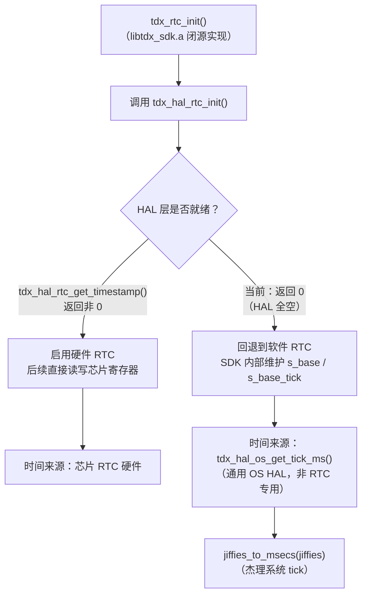

关键点：软件 RTC 的时基走的是**通用 OS HAL**（`tdx_hal_os_get_tick_ms()`），而非 RTC 专用 HAL（`tdx_hal_rtc_*()`）。前者是所有平台必须实现的适配层，后者是可选的硬件外设。这意味着即使 RTC HAL 永远为空，只要 OS HAL 提供 tick，SDK 核心就能自主维护软件时间。

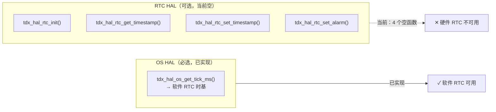

---

### 2.2.1 已知 vs 未知 — 阅读本章前先看这张清单

`libtdx_sdk.a` 是闭源静态库，以下事实基于**源码可见部分**（`port/` 目录 + SDK 头文件），与**闭源库内部推断**必须分开：

| 事实 | 状态 | 依据 |
|------|------|------|
| HAL 层 `tdx_hal_rtc_*` 是空实现 | **可确定** | `tdx_hal_sys_jl7018.c` 源码可见 |
| `TDX_HAL_HAVE_RTC = 1` 已定义 | **可确定** | `tdx_hal_config.h:53`，见 2.2.2 讨论 |
| RTC 没有回调表注册模式 | **可确定** | 无 `tdx_rtc_ops_t` 结构体定义 |
| `on_rtc_synced` 是空 stub | **可确定** | `tdx_app_callbacks_impl.c` 源码可见 |
| BLE 时间同步路径存在 | **可确定** | `tdx_app.c` `TDX_PROTOCOL_EVENT_RTC_SET` |
| 时间持久化机制存在 | **可确定** | `tdx_app.c` / `tdx_charge.c` 调用点明确 |
| OS HAL 提供 `get_tick_ms()` | **可确定** | `tdx_hal_os_jl7018.c` 源码可见 |
| SDK 核心内部有软件 RTC | **高度可能** | 间接证据充分，但内部实现不可见 |
| 软件 RTC 使用 tick 作为基准 | **合理推断** | 无其他时间来源，但内部逻辑不可见 |
| 硬件/软件自动切换 | **合理推断** | HAL 接口设计暗示，但切换逻辑不可见 |

---

### 2.2.2 HAL 层现状 — 空实现（可确定）

`port/platform/jl7018/tdx_hal_sys_jl7018.c` 中定义了 4 个 RTC HAL 函数：

```c
void tdx_hal_rtc_init(void)
{
    /* rtc_init declared in asm/rtc.h (included via tdx_app_config.h chain) */
}

void tdx_hal_rtc_set_timestamp(uint32_t timestamp)
{
    (void)timestamp;
}

uint32_t tdx_hal_rtc_get_timestamp(void)
{
    return 0;
}

void tdx_hal_rtc_set_alarm(uint32_t timestamp)
{
    (void)timestamp;
}
```

**结论：硬件 RTC HAL 为空实现。** 4 个函数均为空 stub，没有接入芯片 RTC 驱动。

> **⚠️ `TDX_HAL_HAVE_RTC` 配置矛盾**：`port/platform/jl7018/tdx_hal_config.h:53` 已定义 `#define TDX_HAL_HAVE_RTC 1`，声明平台**具备**硬件 RTC 能力。但 HAL 实现层 4 个函数体为空。这形成了一组矛盾：
>
> | 层次 | 声称 | 实际 |
> |------|------|------|
> | 平台配置（`tdx_hal_config.h`） | `TDX_HAL_HAVE_RTC = 1`（有 RTC） | — |
> | HAL 实现（`tdx_hal_sys_jl7018.c`） | — | 4 个空函数 |
>
> **如果 SDK 核心使用 `TDX_HAL_HAVE_RTC` 宏来选择代码路径**，它可能已经在调用这些空函数（返回 0），而不是完全回退到软件 RTC。这一矛盾意味着当前状态本质上是 **"配置声称有硬件 RTC，但驱动未接入"**，而非单纯的"硬件 RTC 未启用"。

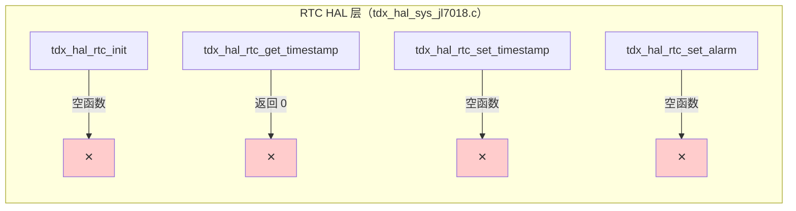

> **注意**：芯片 SDK 其实提供了 RTC 头文件（`#include "asm/rtc.h"`）和完整的驱动 API（`rtc_init()`、`read_sys_time()`、`write_sys_time()` 等），只是 port 层没有调用。

---

### 2.2.3 为什么 RTC 没有回调表？（可确定 + 推断）

文档 1 中鉴权/录音使用**运行时回调表注册**：

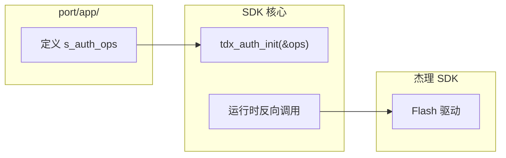

RTC 使用**链接时 HAL 符号绑定**：

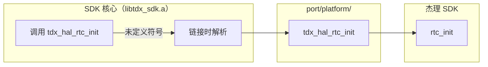

**可确定的部分**：
- `tdx_rtc_init()` 没有参数，不需要应用层注册结构体
- `tdx_hal_rtc_*` 是全局函数，通过链接符号解析

**推断的部分**：
- SDK 核心选择这种模式是因为 RTC 接口简单且标准（init/get/set/alarm），不需要异构适配

---

### 2.2.4 SDK 核心内部是否有软件 RTC？（高度可能的推断）

**间接证据链**：

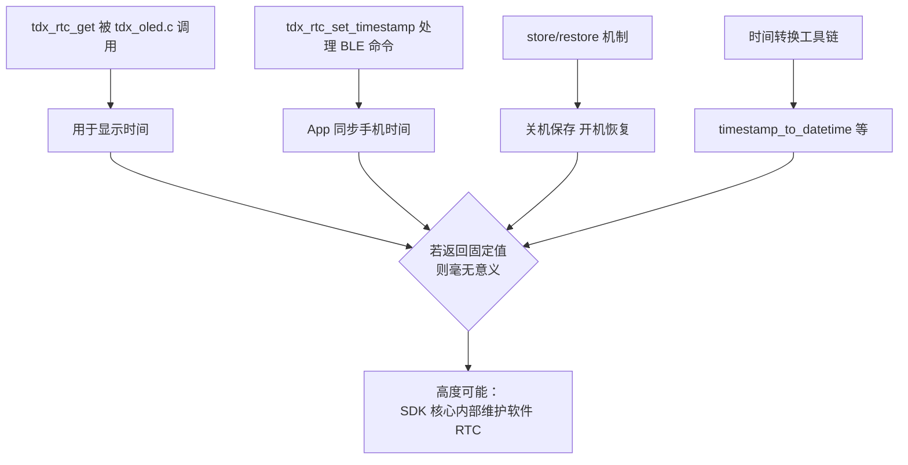

**推断的底层逻辑**：

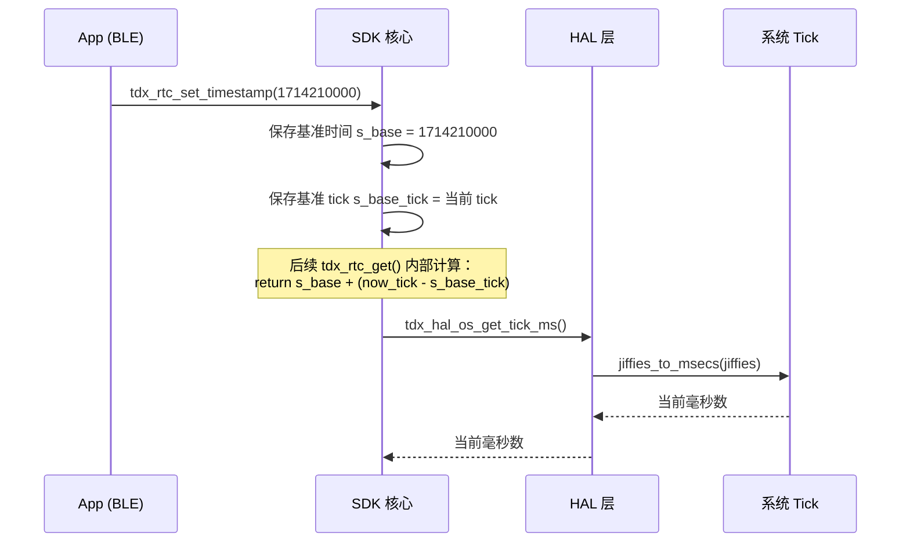

> **⚠️ 注意**：上述时序图是**根据接口设计的合理推断**，`libtdx_sdk.a` 内部真实实现不可见。

---

### 2.2.5 时间设置路径与持久化机制（可确定调用点，推断内部逻辑）

**时间设置入口**（源码可见）：

时间通过 BLE 命令从手机同步到设备：

```c
// tdx_app.c:2389-2394 — 源码可见
case TDX_PROTOCOL_EVENT_RTC_SET: {
    u32 ts = *(u32 *)data;
    int result = (ts > 0) ? tdx_rtc_set_timestamp(ts) : 1;
    tdx_indicate_rtc_ack_t ra = { .result = result, .timestamp = ts };
    tdx_protocol_indicate(TDX_INDICATE_RTC_ACK, &ra, sizeof(ra));
    break;
}
```

这是 RTC 时间的**唯一设置入口**：手机通过 BLE 下发 Unix 时间戳 → `tdx_rtc_set_timestamp()` → SDK 核心更新内部基准。

**持久化调用点**（源码可见）：

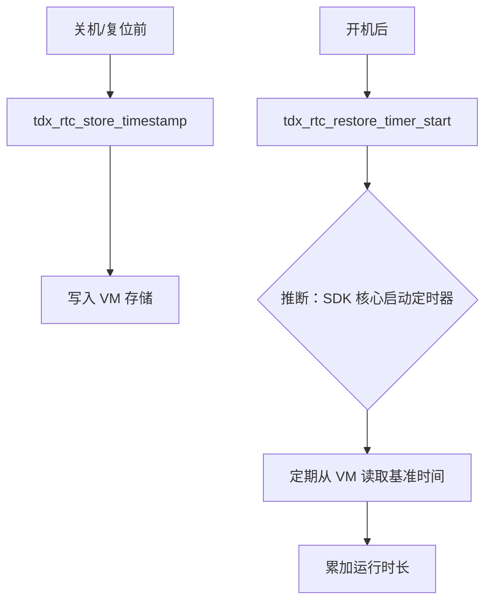

**具体调用位置**：

| 场景 | `tdx_rtc_store_timestamp()` | `tdx_rtc_restore_timer_stop()` | `tdx_rtc_restore_timer_start()` |
|------|----------------------------|------|--------------------------------|
| `tdx_app_all_init()`（正常启动） | 否 | 否 | 否 |
| `tdx_app_idle_handle()`（进入 idle） | **是** | **是** | **是** |
| `tdx_app_factory_reset_handle()` | **是** | 否 | 否 |

其中 `tdx_rtc_restore_timer_stop()` 与 `tdx_rtc_restore_timer_start()` 成对出现：先停止旧定时器，再启动新定时器。这确保在 idle/sleep 周期切换时不会出现多个 restore timer 并发运行。

> `tdx_rtc_restore_timer_start()` 和 `tdx_rtc_restore_timer_stop()` 的内部实现（定时器周期、追赶算法）在闭源库中，不可见。

---

### 2.2.6 回调表中的 `on_rtc_synced`（可确定）

```c
// tdx_app_callbacks_impl.c — 源码可见
static void _cb_on_rtc_synced(uint32_t timestamp) { }

static const tdx_app_callbacks_t s_app_cbs = {
    .on_rtc_synced = _cb_on_rtc_synced,  // ← 空实现
};
```

| 回调类型 | 数据流向 | 示例 | 当前状态 |
|----------|----------|------|----------|
| **请求型** | SDK → 应用层 → 返回值 | `get_auth_key` | 已实现 |
| **通知型** | SDK → 应用层（单向） | `on_rtc_synced` | **空 stub** |

**影响**：BLE 同步时间后，没有即时推送通知去刷新 OLED。不过 `tdx_oled.c:1069` 在每个显示周期都会调用 `tdx_rtc_get()` 获取当前时间，所以时间会在下一次画面刷新时自动更新——只是不是实时的。如果产品需要"时间同步后立即刷新显示"的体验，应在此回调中发送 `TDX_UI_EVT_MAINPAGE` 事件触发 OLED 立即重绘。

---

### 2.2.7 软件 RTC 的 tick 来源（可确定）

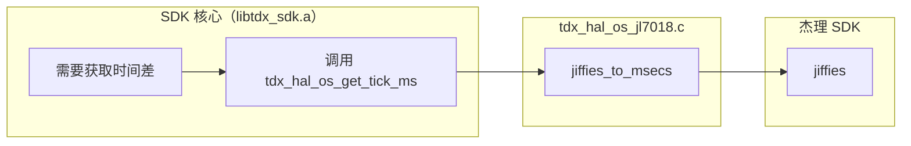

```c
// tdx_hal_os_jl7018.c — 源码可见
uint32_t tdx_hal_os_get_tick_ms(void)
{
    return jiffies_to_msecs(jiffies);
}
```

这是 SDK 核心获取系统 tick 的**唯一合法入口**。`libtdx_sdk.a` 通过符号依赖 `tdx_hal_os_get_tick_ms`，而不是直接引用 `jiffies`，保持了平台无关性。

---

### 2.2.8 硬件 RTC 启用路径（推断 + 实现指南）

如果未来要启用硬件 RTC，需要填充 `tdx_hal_sys_jl7018.c` 中的 4 个空函数。

**关键障碍：HAL 接口与芯片 API 的类型不匹配**

TideX HAL 接口使用 `uint32_t` Unix 时间戳，但杰理芯片 RTC API（`asm/rtc.h`）使用 `struct sys_time`：

```c
// 杰理芯片 RTC API（asm/rtc.h）
struct sys_time {
    u16 year;
    u8 month;
    u8 day;
    u8 hour;
    u8 min;
    u8 sec;
};

int  rtc_init(const struct rtc_dev_platform_data *arg);  // 需要平台数据参数
void read_sys_time(struct sys_time *curr_time);           // 输出 struct sys_time*
void write_sys_time(const struct sys_time *curr_time);    // 输入 struct sys_time*
void write_alarm(const struct sys_time *alarm_time);      // 输入 struct sys_time*
```

因此 HAL 层不能简单地转发调用，必须做 **`struct sys_time` ↔ Unix 时间戳** 的转换：

```c
// 正确填充方式（需要引入 tdx_api_util.h 的转换函数）
#include "tdx_api_util.h"  // 提供 tdx_rtc_datetime_to_timestamp / tdx_rtc_timestamp_to_datetime

void tdx_hal_rtc_init(void)
{
    // 配置平台数据：时钟源、32k 晶振、回调
    const struct rtc_dev_platform_data data = {
        .clk_sel = CLK_SEL_32K,   // 或 CLK_SEL_LRC，取决于硬件设计
        .x32xs   = 1,             // 使能 32k 晶振（需确认硬件贴装）
        .cbfun   = NULL,
    };
    rtc_init(&data);
}

uint32_t tdx_hal_rtc_get_timestamp(void)
{
    struct sys_time st;
    read_sys_time(&st);
    DateTime dt = {
        .year = st.year, .month = st.month, .day = st.day,
        .hour = st.hour, .minute = st.min, .second = st.sec,
    };
    return (uint32_t)tdx_rtc_datetime_to_timestamp(dt);
}

void tdx_hal_rtc_set_timestamp(uint32_t timestamp)
{
    DateTime dt = tdx_rtc_timestamp_to_datetime((time_t)timestamp);
    struct sys_time st = {
        .year = (u16)dt.year, .month = (u8)dt.month, .day = (u8)dt.day,
        .hour = (u8)dt.hour, .min = (u8)dt.minute, .sec = (u8)dt.second,
    };
    write_sys_time(&st);
}

void tdx_hal_rtc_set_alarm(uint32_t timestamp)
{
    DateTime dt = tdx_rtc_timestamp_to_datetime((time_t)timestamp);
    struct sys_time st = {
        .year = (u16)dt.year, .month = (u8)dt.month, .day = (u8)dt.day,
        .hour = (u8)dt.hour, .min = (u8)dt.minute, .sec = (u8)dt.second,
    };
    write_alarm(&st);
}
```

**硬件前提条件**：

| 条件 | 说明 |
|------|------|
| 32kHz 晶振贴装 | `rtc_dev_platform_data.x32xs = 1` 的前提。如未贴装，需使用内部 LRC（`CLK_SEL_LRC`），精度较差 |
| P33 备份域供电 | 关机时 RTC 寄存器需保持供电才能维持计时 |
| `TDX_HAL_HAVE_RTC = 1` | 已满足（`tdx_hal_config.h:53`） |

**切换机制的推断依据**：

| 证据 | 说明 |
|------|------|
| `tdx_hal_rtc.h` 注释 | "Implementation required when TDX_HAL_HAVE_RTC is enabled" → HAL 是**可选层** |
| `tdx_hal_rtc_get_timestamp()` 返回 `uint32_t` | 非 `int`，无错误码通道 → 返回 0 被解释为"无效"（推断） |
| 时间持久化机制存在 | 如果 SDK 核心**只**支持硬件 RTC，就不需要软件补偿机制 |

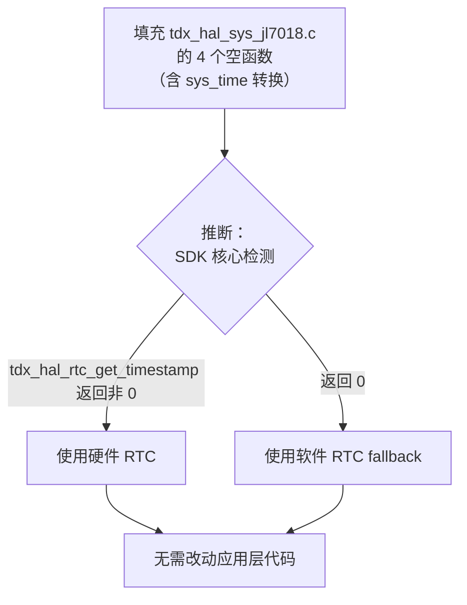

**⚠️ 设计陷阱（推断）**：Unix 时间戳 0 是合法的（1970-01-01 00:00:00 UTC）。如果硬件 RTC 恰好被设置为这个时间，SDK 核心可能误判为"HAL 不可用"而回退到软件 RTC。建议：如果 SDK 核心确实使用 `!= 0` 作为检测条件，可在 `tdx_hal_rtc_init()` 中设置一个远大于 0 的初始值来规避此问题。

---

### 2.2.9 本章事实汇总

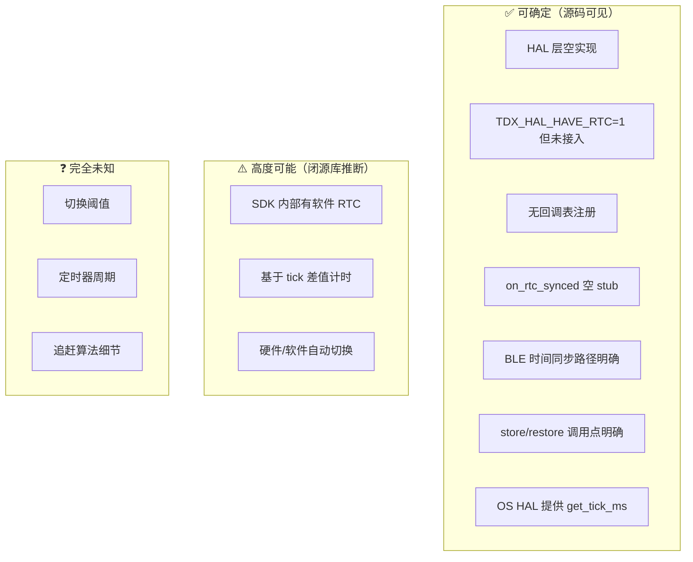

| 问题 | 答案 | 可信度 |
|------|------|--------|
| 当前有硬件 RTC 吗？ | **配置声称有，实际未接入**，HAL 全空 | 100% |
| SDK 有软件 RTC 吗？ | **有**，间接证据充分 | ~90% |
| 软件 RTC 用 tick 计时吗？ | **是**，无其他来源 | ~80% |
| BLE 时间从哪里来？ | 手机通过 `TDX_PROTOCOL_EVENT_RTC_SET` 下发 | 100% |
| 填充 HAL 后自动切硬件吗？ | **推断会**，但切换逻辑不可见 | ~70% |
| HAL 填充只需简单转发？ | **否**，需要 `struct sys_time` ↔ Unix 时间戳转换 | 100% |
| 时间戳 0 会误触发 fallback 吗？ | **可能**，取决于 SDK 内部阈值 | 未知 |

---

## 2.3 SPI 平台注册与中断初始化

```c
#if TDX_HAS_SPI
    tdx_spi_platform_register();
    tdx_spi_init_irq();
#endif
```

### 2.3.1 `tdx_spi_platform_register()` — 硬件操作表注册

`port/platform/jl7018/tdx_hal_spi_jl7018.c` 定义了 `tdx_spi_hw_ops_t` 类型的静态常量 `s_jl7018_hw_ops`，包含 14 个函数指针：

| 成员 | 实际函数 | 作用 |
|------|----------|------|
| `spi_open` | `jl_spi_open` | 配置 SPI2 为主机、MSB、CPOL=0、CPHA=0、16MHz |
| `spi_close` | `jl_spi_close` | 反初始化 SPI2 |
| `dma_send` / `dma_recv` | `jl_dma_send` / `jl_dma_recv` | DMA 方式收发 |
| `dma_xfer_isr` | `jl_dma_xfer_isr` | 中断上下文 DMA 传输 |
| `wait_tx_done` / `wait_rx_done` | `jl_wait_tx_done` / `jl_wait_rx_done` | 查询 ISR 状态标志 |
| `cs_init` / `cs_deinit` / `cs_high` / `cs_low` | `jl_cs_*` | 片选 GPIO 控制（默认 `IO_PORT_DM`） |
| `handshake_read` | `jl_handshake_read` | 读取握手 GPIO 电平 |
| `handshake_irq_init` / `handshake_irq_enable` | `jl_handshake_irq_*` | 配置 P33 唤醒中断（上升沿触发） |
| `wdt_clear` | `jl_wdt_clear` | 喂狗 |
| `delay_us` | `jl_delay_us` | 微秒延时 |
| `clock_lock` / `clock_unlock` | `jl_clock_lock` / `jl_clock_unlock` | 锁定系统时钟 160MHz |

`tdx_spi_platform_register()` 内部调用：

```c
tdx_spi_set_hw_ops(&s_jl7018_hw_ops, NULL);
tdx_spi_set_callbacks(&s_jl7018_default_cb);
```

将硬件操作表和默认应用回调一并注册给 TideX SDK 核心的 SPI 驱动层。这是**闭源库调用平台代码**的又一次体现——`libtdx_sdk.a` 中的 SPI 主控逻辑通过函数指针间接操作 JL7018 的 SPI 寄存器。

### 2.3.2 `tdx_spi_init_irq()` — 握手 GPIO 中断预配置

`tdx_spi_init_irq()` 声明在 `sdk/include/tdx_spi.h:103`，实现在 `libtdx_sdk.a` 闭源库中。**它不是 SPI 总线初始化**——总线初始化由 `tdx_spi_init()`（另一个独立函数）在 WiFi 实际启动时完成。详见 2.3.4。

### 2.3.3 低功耗注册

```c
REGISTER_LP_TARGET(tdx_spi_lp_target) = {
    .name    = "tdx_spi",
    .is_idle = _spi_lp_idle_query,
};
```

SPI 模块向系统低功耗框架注册，当 `_spi_lp_idle_query()` 返回 1（`tdx_spi_is_idle()`）时，系统方可进入深睡。

### 2.3.4 `tdx_spi_init_irq()` vs `tdx_spi_init()` — 两阶段初始化模型

> **【可确定】** `tdx_spi_init_irq()` 是闭源函数，但通过 HAL 层源码可以确定它调用了哪些 `s_hw_ops` 成员。它**不做 SPI 总线初始化**——总线初始化由独立的 `tdx_spi_init()` 在 WiFi 实际启动时完成。

#### 结构体 vs 直接注册 — SPI 的 ops + callbacks 双通道模式

SPI 模块的注册模式与 RTC/鉴权都不同，它同时使用**两个结构体**：

| 注册通道 | 结构体类型 | 内容 | 注册方式 |
|---------|-----------|------|---------|
| `s_jl7018_hw_ops` | `tdx_spi_hw_ops_t` | 14 个 HAL 函数指针（SPI 总线、CS、握手、系统服务） | `tdx_spi_set_hw_ops(&s_jl7018_hw_ops, NULL)` |
| `s_jl7018_default_cb` | `tdx_spi_callbacks_t` | 4 个应用回调（`on_rx_data`、`is_transport_active`、`on_tx_queue_drained`、`on_tx_error`） | `tdx_spi_set_callbacks(&s_jl7018_default_cb)` |

**hw_ops**（平台层提供）封装所有硬件相关的 SPI 寄存器操作；**callbacks**（应用层提供）封装协议/WiFi 层对传输事件的响应。SDK 核心的 SPI 主控逻辑同时持有两组指针，形成完整的闭源↔开源桥接。

#### `tdx_spi_init_irq()` 内部调用推断

`tdx_spi.h` 声明了两个独立的初始化函数：

```c
void tdx_spi_init_irq(void);   // ← tdx_app_all_init() 中调用
int  tdx_spi_init(void);       // ← tdx_hal_wifi_bus_init() 中调用
```

如果 `tdx_spi_init_irq` 已经做了 SPI 总线初始化，`tdx_spi_init` 就是多余的。两者同时存在说明职责不同。

`tdx_spi_init_irq()` 在闭源库内部可通过 `s_hw_ops` 调用以下成员：

| hw_ops 成员 | 被 `tdx_spi_init_irq` 调用？ | 推理依据 |
|-------------|---------------------------|----------|
| `handshake_irq_init` | **确定会** | 函数名直接对应，HAL 实现可见 |
| `handshake_irq_enable(0)` | **确定会** | `jl_handshake_irq_init` 末尾调 `p33_io_wakeup_enable(gpio, 0)`，SDK 需传入 callback 再 enable |
| `cs_init` | 可能 | CS GPIO 可提前配置为输出高 |
| `spi_open` | **不会** | 属于 `tdx_spi_init()` 职责，见下方 |
| `dma_send` / `dma_recv` | **不会** | SPI 未打开，DMA 无意义 |
| `clock_lock` | **不会** | 锁频仅在实际传输时需要 |

**HAL 层源码证据**（可确定）：

```c
// tdx_hal_spi_jl7018.c:156-168 — 源码可见
static void jl_handshake_irq_init(void (*callback)(void *arg), void *arg)
{
    s_handshake_callback = callback;           // SDK 传入的 ISR 回调

    memset(&s_jl_gpio_irq_config, 0, sizeof(s_jl_gpio_irq_config));
    s_jl_gpio_irq_config.pullup_down_mode = PORT_INPUT_PULLDOWN_1M;
    s_jl_gpio_irq_config.filter           = PORT_FLT_DISABLE;
    s_jl_gpio_irq_config.edge             = RISING_EDGE;
    s_jl_gpio_irq_config.gpio             = TDX_SPI_HANDSHAKE_IO;
    s_jl_gpio_irq_config.callback         = jl_handshake_isr_wrapper;

    p33_io_wakeup_port_init(&s_jl_gpio_irq_config);
    p33_io_wakeup_enable(s_jl_gpio_irq_config.gpio, 0);  // IRQ 禁用！
}
```

关键点：
- P33 域 GPIO 配置为**下拉 + 上升沿触发**（WiFi 模块拉高 IO 时产生中断）
- `p33_io_wakeup_enable(gpio, 0)` 最后一个参数 `0` = **disable**——IRQ 配置完成但开关关闭
- SDK 传入的 `callback` 被保存到 `s_handshake_callback`，后续在 `jl_handshake_isr_wrapper` 中被调用

**结论**：`tdx_spi_init_irq()` 做的是**中断信号线的硬件预配置**，不是 SPI 外设初始化。命名为 "init_irq" 而非 "init"，本身就是 SDK 设计者的意图表达。

#### `tdx_spi_init()` — 总线真正初始化（WiFi 启动时）

`tdx_spi_init()` 由 `tdx_hal_wifi_bus_jl7018.c:51-56` 调用：

```c
int tdx_hal_wifi_bus_init(tdx_wifi_bus_recv_cb_t recv_cb)
{
    s_ctx.recv_cb = recv_cb;
    tdx_file_free_dat_cache();
    return tdx_spi_init();  // ← 此时才真正打开 SPI 外设
}
```

这是 **HAL 层对 SDK 核心的反向调用**：WiFi 总线 HAL 调用 `tdx_spi_init()` → SDK 核心通过 `s_hw_ops->spi_open()` 配置 SPI2 主机模式、使能 DMA、打开握手 IRQ。

数据发送同样经过 SDK 层：`tdx_hal_wifi_bus_write()` → `tdx_esp32_spi_send_data()`（定义在 `sdk/include/tdx_spi.h:117`）→ SDK 核心通过 `s_hw_ops->dma_send()` 实际发送。

#### 三阶段递进初始化全景

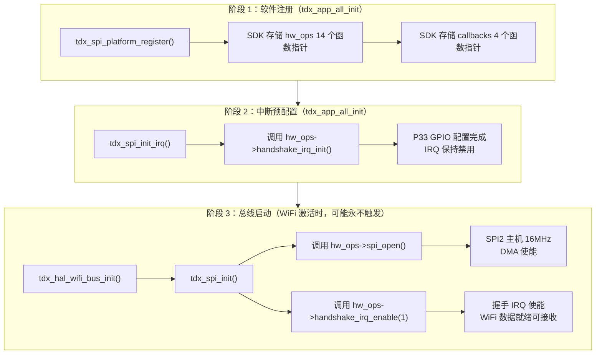

#### 已知 vs 未知

| 事实 | 状态 | 依据 |
|------|------|------|
| `tdx_spi_init_irq()` 实现在闭源库 `libtdx_sdk.a` | **可确定** | 声明在 `tdx_spi.h`，源码不可见 |
| 它调用 `handshake_irq_init` + `handshake_irq_enable(0)` | **高度可能** | HAL 源码可见，函数名直接对应 |
| 它不调用 `spi_open` | **高度可能** | `tdx_spi_init()` 独立存在，职责分离 |
| `tdx_spi_init()` 才真正打开 SPI 总线 | **高度可能** | `tdx_hal_wifi_bus_jl7018.c` 调用链明确 |
| 握手 IRQ 初始为禁用状态 | **可确定** | `jl_handshake_irq_init` HAL 源码明确 `enable(0)` |
| P33 IO 配置为下拉 + 上升沿 | **可确定** | HAL 源码可见 |
| SPI 总线可能永远不打开 | **可确定** | 如果产品只走 BLE 通道，WiFi 永不起动 |
| SDK 内部 SPI 主控逻辑细节 | **不可见** | 闭源 |
| `tdx_spi_init_irq` 是否还调了 `cs_init` | **未知** | 闭源 |

---

## 2.4 OLED 回调注册与显示任务创建

```c
#if TDX_HAS_DISPLAY
    tdx_oled_register_callbacks();
#endif
```

### 2.4.1 `tdx_oled_register_callbacks()` — 桥接 OLED 事件到应用层

该函数位于 `port/app/tdx_app.c`，是 OLED 模块与应用层的**回调注册点**：

```c
static void tdx_oled_register_callbacks(void)
{
    tdx_oled_register_notify_cb(tdx_oled_event_handler);
    tdx_oled_register_mode_check(tdx_oled_pc_mode_check);
    tdx_battery_set_display_handler(tdx_bat_display_handler);
}
```

| 注册函数 | 回调 | 触发场景 |
|----------|------|----------|
| `tdx_oled_register_notify_cb()` | `tdx_oled_event_handler()` | OLED 需要切换画面（录音、主页、充电等） |
| `tdx_oled_register_mode_check()` | `tdx_oled_pc_mode_check()` | OLED 查询当前是否为 PC 模式 |
| `tdx_battery_set_display_handler()` | `tdx_bat_display_handler()` | 电池百分比变化时刷新显示 |

这三组回调将 `port/bsp/display/ssd1306/` 中的 OLED 驱动与 `port/app/` 中的业务逻辑关联起来。OLED 驱动本身是纯显示引擎，不知道"现在该显示什么"，它通过回调向应用层询问。

### 2.4.2 `tdx_oled_task_create()` — 显示任务启动

```c
int tdx_oled_task_create(void)
{
    if (s_oled.task_created) {
        return -1;  // 防御性：防止重复创建
    }
    int res = tdx_hal_os_task_create(TDX_OLED_TASK_NAME, _tdx_oled_task,
                                      NULL, 512, 256, 2);
    s_oled.task_created = true;
    return 0;
}
```

- 任务名：`TDX_OLED_TASK_NAME`
- 入口：`_tdx_oled_task()` — 内部运行消息循环，处理 `TDX_UI_EVT_*` 事件
- 堆栈：512 字节，优先级 2
- 防御性：重复创建返回 -1，避免任务泄漏

OLED 任务在两种情况下被创建：
1. **异常恢复路径**：立即创建并显示录音界面
2. **正常启动路径**：创建后发送 `TDX_UI_EVT_MAINPAGE` 显示主页

---

## 2.5 异常恢复 vs 正常启动 — 分支判断

```c
u8 err_boot = tdx_record_err_reboot_flag_read();
if (err_boot == 1) {
    // ===== 异常恢复路径 =====
} else {
    // ===== 正常启动路径 =====
}
```

### 2.5.1 异常恢复路径（录音中重启）

当上次关机为异常复位（断电、看门狗、HardFault）且正处于录音状态时，TideX 需要**无缝恢复录音**：

```c
RecordStatus *rp = tdx_record_get_status();
#if TDX_HAS_DISPLAY
    tdx_oled_task_create();
    tdx_app_get_custom_ops()->show_recording(rp);
#endif

// 按键初始化
tdx_key_dip_switch_init(tdx_dip_switch_gpio_check_handle);
tdx_dip_switch_gpio_first_check();

// 应用任务启动
tdx_app_tasks_init();

// 恢复录音
if (rp->scene == RECORD_SCENE_CHAT) {
    app_send_message(APP_MSG_RECORD_CHAT_MODE, 0);
} else {
    app_send_message(APP_MSG_RECORD_CALL_MODE, 0);
}

// 清除异常标志
tdx_record_err_reboot_flag_write(0);
```

**关键行为**：
- 不显示主页，直接恢复录音界面
- 通过 `app_send_message()` 向 `app_core` 发送消息，触发录音状态机恢复
- 不清除录音错误标志直到恢复指令发出（防止再次异常时丢失状态）

### 2.5.2 正常启动路径

```c
#if TDX_HAS_DISPLAY
    tdx_oled_task_create();
    os_taskq_post_msg(TDX_OLED_TASK_NAME, 1, TDX_UI_EVT_MAINPAGE);
#endif

#if TDX_HAS_VIBRATE
    vibrate_init();
#endif

// 按键初始化
tdx_key_dip_switch_init(tdx_dip_switch_gpio_check_handle);
tdx_dip_switch_gpio_first_check();

// EMMC 空闲检查
tdx_app_emmc_poweroff_check();

// 应用任务启动
tdx_app_tasks_init();
```

**关键行为**：
- 显示主页
- 振动马达初始化并运行 500ms 提示上电成功
- 启动 EMMC 空闲超时断电检查（见文档 1.1）
- 最后启动应用任务（BLE、协议事件循环等）

### 2.5.3 两种路径对比

| 步骤 | 异常恢复 | 正常启动 |
|------|----------|----------|
| OLED 画面 | 恢复录音界面 | 主页 |
| 振动马达 | 不初始化（已在运行） | `vibrate_init()` + 500ms 振动 |
| EMMC 检查 | 跳过（录音中不能断电） | `tdx_app_emmc_poweroff_check()` |
| 按键初始化 | 有 | 有 |
| 应用任务 | 有 | 有 |
| 额外操作 | 发送消息恢复录音 | 无 |

---

## 2.6 按键检测初始化

```c
#if (DIP_KEY_DETECT_BY_INTERRUPT == 0)
    // tdx_key_detect_task_create();  // 当前未使用轮询模式
#else
    tdx_key_dip_switch_init(tdx_dip_switch_gpio_check_handle);
    tdx_dip_switch_gpio_first_check();
#endif
```

### 2.6.1 中断模式（当前使用）

`tdx_key_dip_switch_init()` 位于 `port/app/tdx_key.c`：

```c
void tdx_key_dip_switch_init(void (*cb)(tdx_hal_gpio_irq_edge_t edge))
{
    s_dip_switch.init_done = TRUE;
    s_dip_switch.callback  = cb;

    tdx_hal_gpio_set_input_pullup(TDX_GPIO_DIP_SWITCH);

    // 根据当前电平推断初始边沿
    tdx_hal_gpio_irq_edge_t initial_edge =
        tdx_hal_gpio_read(TDX_GPIO_DIP_SWITCH)
            ? TDX_GPIO_IRQ_FALLING
            : TDX_GPIO_IRQ_RISING;

    tdx_hal_gpio_irq_register(TDX_GPIO_DIP_SWITCH, dip_switch_hal_irq_cb,
                               initial_edge);
    tdx_hal_gpio_irq_enable(TDX_GPIO_DIP_SWITCH, true);
}
```

**设计要点**：
- 使用 HAL GPIO 抽象（`tdx_hal_gpio_*`），不直接操作芯片寄存器
- 内部上拉，按键按下为低电平释放为高点平（或相反，取决于硬件）
- 根据当前 GPIO 电平推断初始边沿，避免首次中断方向错误
- 回调 `tdx_dip_switch_gpio_check_handle()` 在中断上下文中执行，实际按键消抖和状态机在 `app_core` 任务中处理

### 2.6.2 轮询模式（未使用但保留）

```c
static void tdx_key_detect_task(void *arg)
{
    tdx_key_dip_switch_init(tdx_dip_switch_gpio_check_handle);
    tdx_dip_switch_gpio_first_check();
    while (1) {
        tdx_dip_switch_gpio_check_handle();
        tdx_hal_os_delay_ms(300);
    }
}
```

- 独立任务，每 300ms 轮询一次
- 堆栈 256 字节，优先级 2
- 当前被注释掉，说明硬件设计倾向于中断方式以节省功耗

### 2.6.3 `tdx_dip_switch_gpio_first_check()`

上电后立即执行一次按键状态扫描。如果用户在上电时按住按键（如进入 DUT 模式），这次扫描能立即捕获，而不必等待中断触发。

---

## 2.7 振动马达初始化

```c
#if TDX_HAS_VIBRATE
    vibrate_init();
#endif
```

`vibrate_init()` 位于 `port/bsp/vibrate/tdx_vibrate.c`：

```c
void vibrate_init(void)
{
    vibrate_run_flag = false;
    vibrate_run_timer = 0;

    struct gpio_config gpio_config_vibrate = {
        .pin  = PORT_PIN_1,
        .mode = PORT_OUTPUT_HIGH,
        .hd   = PORT_DRIVE_STRENGT_64p0mA,
    };
    gpio_init(PORTC, &gpio_config_vibrate);

    vibrate_run_by_time(500);  // 上电振动 500ms 提示成功
}
```

**设计要点**：
- 驱动电流配置为 64mA，匹配振动马达负载
- 初始化后自动振动 500ms，给用户明确的上电反馈
- `vibrate_on()` 内部会先调用 `tdx_app_emmc_poweron(1)` —— 振动马达与 EMMC 共用 VDD LDO，振动前确保电源已开启
- 定时器自动关闭：`usr_timeout_add()` 创建的软定时器到期后自动调用 `vibrate_off()`

---

## 2.8 EMMC 电源检查

```c
tdx_app_emmc_poweroff_check();
```

该函数触发 EMMC 空闲超时断电机制的首次检查（详见文档 1.1）。在正常启动路径中调用，异常恢复路径中跳过 —— 因为录音中 EMMC 必须持续供电。

---

## 2.9 应用任务初始化

```c
tdx_app_tasks_init();
```

这是产品层初始化的最后一步，负责创建 TideX 运行所需的全部 RTOS 任务和子系统。函数内部使用 `static u8 inited` 防止重复调用。

### 2.9.1 文件系统任务

```c
#if TDX_HAS_FILE_STORAGE
    tdx_file_init();
#endif
```

初始化文件传输模块：SD 卡管理、文件列表维护、BLE/WiFi 文件同步状态机。如果产品无文件存储（如部分 EP 产品），通过 `TDX_HAS_FILE_STORAGE = 0` 完全裁剪。

### 2.9.2 BLE GATT Server 初始化

```c
void tdx_app_ble_server_init(void)
{
    tdx_ble_server_init();
#if !TDX_HAS_FILE_STORAGE
    tdx_ble_server_adv_enable(1);
#endif
}
```

- `tdx_ble_server_init()`：初始化 GATT Service、Characteristic、安全属性
- 无条件初始化，但广播使能有条件：有文件存储的产品可能由文件系统模块控制广播时机（如格式化完成后才广播），无文件存储的产品立即开启广播

### 2.9.3 协议事件任务

```c
tdx_protocol_task_create(tdx_app_protocol_event_handler);
```

创建独立的协议处理任务，所有 BLE 命令解析后的业务事件（录音控制、电池查询、版本查询、OTA、文件传输等）都通过 `tdx_app_protocol_event_handler()` 统一分发。

**事件处理示例**：
```c
static void tdx_app_protocol_event_handler(tdx_protocol_event_t event,
                                            void *data, u32 len)
{
    switch (event) {
    case TDX_PROTOCOL_EVENT_RECORD:
        tdx_record_handle_cmd((Record_info *)data);
        break;
    case TDX_PROTOCOL_EVENT_BATTERY_QUERY:
        // 查询电池并主动上报
        break;
    case TDX_PROTOCOL_EVENT_VERSION_QUERY:
        // 上报硬件/固件版本
        break;
    // ... 其他事件
    }
}
```

### 2.9.4 DUT 模式初始化

```c
tdx_dut_init();
```

读取 VM 中保存的 `KEY_DUT_DISABLED_FLAG`：
- 若标志存在 → 禁用按键进入 DUT 模式（finalpack 后状态）
- 若标志不存在 → 允许 8 次连击进入 DUT 模式

DUT 模块支持 6 项工厂测试（OLED、振动、录音、WiFi、格式化、关机），通过 BLE 命令或按键触发。详见 `port/app/tdx_dut.c`。

### 2.9.5 初始化完成标志

```c
tdx_app_init_flag = true;
```

标记 TideX 框架完全就绪。此后：
- 消息拦截器开始生效（`tdx_app_key_msg_handler`、`tdx_app_msg_handler`）
- BLE 连接请求可被正常处理
- 按键事件可触发录音等业务动作

---

## 2.10 产品层初始化全景时序

```
tdx_app_all_init()
  │
  ├── 【通用层】回调注册 / 传输层 / 录音引擎 / WiFi 清零  (文档 1)
  │
  ├── 【产品层】
  │     ├── GPIO: WiFi 高阻, VDD 高电平
  │     ├── RTC 初始化
  │     ├── SPI 平台注册 + 中断初始化
  │     ├── OLED 回调注册
  │     ├── 异常恢复判断?
  │     │     ├── YES → OLED 恢复录音界面 → 按键初始化 → 任务启动 → 恢复录音
  │     │     └── NO  → OLED 主页 → 振动 500ms → 按键初始化 → EMMC 检查 → 任务启动
  │     └── tdx_app_tasks_init()
  │           ├── 文件系统任务 (条件编译)
  │           ├── BLE GATT Server 初始化
  │           ├── 协议事件任务 (tdx_protocol_task_create)
  │           └── DUT 模式初始化
  │
  └── tdx_app_init_flag = true
```

---

## 2.11 存在的问题与改进方向

### 问题 1：轮询模式代码死存

`tdx_key_detect_task_create()` 及相关轮询代码已被注释掉，但源文件 `tdx_key.c` 中仍保留了完整实现：

```c
#if (DIP_KEY_DETECT_BY_INTERRUPT == 0)
    // tdx_key_detect_task_create();  // 被注释
```

以及独立的轮询任务定义。既然当前所有产品都使用中断模式，建议：
- 删除轮询模式代码，或将 `#if (DIP_KEY_DETECT_BY_INTERRUPT == 0)` 块整体移除
- 如果必须保留（为某款硬件预留），应添加明确注释说明保留原因

### 问题 2：异常恢复路径缺少 EMMC 上电

异常恢复路径中直接恢复录音，但未显式调用 `tdx_app_emmc_poweron(1)`。虽然正常启动路径中 `vibrate_init()` 会间接触发 EMMC 上电，但异常恢复路径跳过了振动初始化。如果 EMMC 在异常复位后处于断电状态，录音恢复将失败。

**改进**：在异常恢复路径中显式调用 `tdx_app_emmc_poweron(1)`，或确保 `tdx_record_start()` 内部自动处理存储上电。

### 问题 3：`tdx_app_tasks_init()` 的防重入设计局限

```c
static u8 inited = 0;
if (inited) { return; }
inited = 1;
```

这种防重入仅在**当前运行周期**有效。如果 `tdx_app_all_exit()` 后再次调用 `tdx_app_all_init()`，`inited` 仍为 1，导致任务不再创建。

**改进**：在 `tdx_app_all_exit()` 中重置 `inited = 0`，或改用更明确的模块生命周期管理。

### 问题 4：充电上电逻辑被注释

```c
#if (TCFG_CHARGE_POWERON_ENABLE == 1)
    // if (get_charge_online_flag()) {
    //     tdx_app_charge_start();
    //     tdx_app_ble_server_auto_shutdown_disable();
    // }
#endif
```

充电插入自动开机时的 BLE 广播和自动关机策略被完全注释。如果产品设计要求"充电即开机并广播"，这段代码需要恢复并验证。

### 问题 5：SD 卡内存检查被注释

```c
// tdx_file_device_sd_mem_check();
```

首次启动时未检查 SD 卡容量和文件系统健康度。如果用户插入损坏的 SD 卡，后续录音可能静默失败。

---

**本章总结**：产品层初始化是"硬件资源就绪 → 用户交互准备 → 后台任务启动"的三阶段过程。RC 产品的核心差异在于：有屏（OLED）、有振动、有 SPI/WiFi、有文件存储，因此初始化链路比 EP（耳机）产品更长。异常恢复路径的设计体现了嵌入式产品对**断电续录**的硬性需求，这是消费级 TWS 耳机通常不具备的能力。
