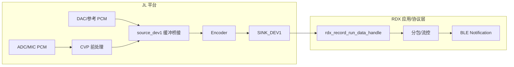
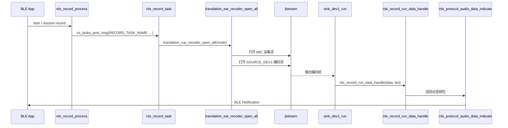
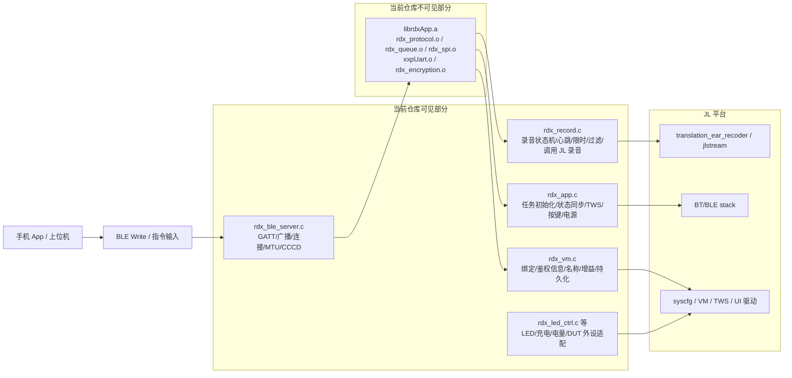

# 开麦录音的全流程分析

> 本文只写当前仓库里能直接从代码验证到的录音实现。对于 `.x6flow` 设计稿、JL Studio 工程等当前仓库未保留的内容，只作为可能来源，不写成既定事实。

## 一、先给结论

JL 平台提供的是一套通用音频流框架 `jlstream`，外加一组 source / process / encoder / sink 节点和场景化 recorder 封装。RDX 当前的开麦上传链路不是“单条 ADC 流直达 BLE”，而是“两条 `jlstream` + 一个 `source_dev1` 缓冲桥接”的结构。`SINK_DEV1` 才是 JL 平台把编码帧交给 RDX 的边界；BLE 分包、流控、状态机、心跳、TWS、UI 都属于 RDX 层。



## 二、JL 平台可确认的原生录音能力

### 1. 核心框架：`jlstream`

JL 用 `jlstream` 抽象一切音频处理流程。不管是播放还是录音，都是把多个节点按拓扑连成 pipeline，然后通过统一接口完成配置、启动和释放。

关键 API：

```c
struct jlstream *jlstream_pipeline_parse(u16 pipeline_uuid, u16 source_node_uuid);
int jlstream_node_ioctl(struct jlstream *stream, u16 node_uuid, int cmd, int arg);
int jlstream_start(struct jlstream *stream);
void jlstream_stop(struct jlstream *stream, u16 fade_msec);
void jlstream_release(struct jlstream *stream);
```

当前仓库中能直接确认到的录音 pipeline UUID 只有两条：

| Pipeline | UUID | 说明 |
|----------|------|------|
| `PIPELINE_UUID_TRANSLATION` | `0x218B` | 翻译耳机相关的双声道 pipeline UUID |
| `PIPELINE_UUID_TRANSLATION_MONO` | `0x9463` | 翻译耳机相关的单声道 pipeline UUID |

需要注意的是：当前仓库**没有**保留对应的 `.x6flow` 源文件，所以这里只能确认“UUID 存在并被代码使用”，不能把某个具体的流程图文件名写成既定事实。

### 2. 可直接确认的 source / process / encoder / sink 节点

#### 2.1 Source 节点

| 节点 | UUID | 作用 |
|------|------|------|
| `NODE_UUID_ADC` | `0xD06D` | 硬件 ADC，负责把麦克风模拟信号变成 PCM |
| `NODE_UUID_ESCO_RX` | `0x8458` | eSCO 下行音频输入 |
| `NODE_UUID_SOURCE_DEV1` | `0x8FC5` | 自定义源节点 1，不是硬件采样源，而是“缓冲桥接源” |

其中 `NODE_UUID_SOURCE_DEV1` 是当前项目里很关键的一层：`effect_dev1` / `effect_dev3` 会把 PCM 写入 `source_dev1_input_write()`，编码流再从 `source_dev1_get_frame()` 取数。也就是说，它更像“内部 PCM 汇聚缓冲区”，不是一个物理外设。

ADC 的中断点数在当前工程里至少能看到两种配置：

- `translation_ear_recoder` 的 MIC 采集流把 `NODE_UUID_SOURCE` 配成 `256` 点
- `ai_voice_recoder` 把 `NODE_UUID_SOURCE` 配成 `320` 点

### 2.2 CVP / DMS 语音处理节点

JL 平台提供了较完整的语音前处理节点集合，典型节点如下：

| 类型 | 节点 | UUID | 说明 |
|------|------|------|------|
| 单麦 | `NODE_UUID_CVP_SMS_ANS` | `0xD0BC` | 单麦 ANS |
| 单麦 | `NODE_UUID_CVP_SMS_DNS` | `0xDBF5` | 单麦 DNS |
| 双麦 | `NODE_UUID_CVP_DMS_ANS` | `0x2115` | 双麦 ANS |
| 双麦 | `NODE_UUID_CVP_DMS_DNS` | `0x420E` | 双麦 DNS |
| 双麦 | `NODE_UUID_CVP_DMS_FLEXIBLE_ANS` | `0x90F9` | 灵活双麦 ANS |
| 双麦 | `NODE_UUID_CVP_DMS_FLEXIBLE_DNS` | `0x68F2` | 灵活双麦 DNS |
| 三麦 | `NODE_UUID_CVP_3MIC` | `0x0048` | 三麦方案 |
| 开发 | `NODE_UUID_CVP_DEVELOP` | `0x76EF` | 第三方/开放开发节点 |

这些节点并不是同时启用，而是通过 `get_cvp_node_uuid()` 按板级配置选择。当前板级配置 `TCFG_AUDIO_CVP_3MIC_MODE = 1`，因此当前项目实际会选中 `NODE_UUID_CVP_3MIC`。

### 2.3 Encoder 节点 `NODE_UUID_ENCODER`

JL 提供统一的编码器插拔框架，参数结构如下：

```c
struct encoder_fmt {
  u8  quality;
  u8  complexity;
  u8  sw_hw_option;
  u8  ch_num;
  u8  format;
  u8  bit_width;
  u16 frame_dms;
  u32 bit_rate;
  u32 sample_rate;
};
```

在当前仓库里，以下编码能力是可以直接从头文件、静态库或调用点确认的：

| 编码能力 | 入口/证据 | 备注 |
|----------|-----------|------|
| OPUS | `get_opus_enc_ops()` | 单声道 OPUS，`translation_ear_recoder` / `ai_voice_recoder` 都会走到这类配置 |
| OPUS_ST | `get_opus_stenc_ops()` | 双声道 OPUS，和翻译耳机相关场景关系更紧密 |
| SPEEX | `get_speex_enc_obj()` | 接口存在，`translation_ear_recoder` 里也保留了 `AUDIO_CODING_SPEEX` 分支 |
| LC3 | `lib_lc3_codec.a` / `lc3_codec_api.h` | 仓库里能看到库和接口 |
| LDAC | `lib_ldac_enc.a` | 仓库里能看到编码库 |
| MP3 / ADPCM | demo 级入口 | 更偏文件类编码，不在当前 RDX 上传主链路中 |

对 OPUS 来说，当前代码可确认的封装模式包括：

| mode | 含义 |
|------|------|
| `0` | 无头 raw |
| `1` | eng + range 或 size + range 兼容模式 |
| `2` | OGG |
| `3` | size + rangeFinal 兼容模式 |

当前 RDX 链路使用的是 16kHz OPUS，最终输出到 `SINK_DEV1`。

### 2.4 Sink 节点

| 节点 | UUID | 作用 |
|------|------|------|
| `NODE_UUID_SINK_DEV0` | `0xB328` | 自定义输出 0，当前 MIC 采集流会配置它 |
| `NODE_UUID_SINK_DEV1` | `0xB329` | 自定义输出 1，当前 RDX 的录音上传边界 |
| `NODE_UUID_AI_TX` | `0xDFDA` | AI 语音上传输出 |
| `NODE_UUID_UART_DUMP` | `0xE76E` | UART dump |
| `NODE_UUID_DAC` | `0xDCCD` | 回放/回环相关输出 |

其中最关键的是 `NODE_UUID_SINK_DEV1`。在当前工程里，`sink_dev1_run()` 收到编码帧后会直接调用 `rdx_record_run_data_handle()`，这就是 JL 平台和 RDX 协议层的接缝。

### 3. JL 提供的 recorder 场景封装

除了底层 `jlstream` 外，JL 还提供了一组面向场景的 recorder 封装：

| 封装 | 文件 | 作用 |
|------|------|------|
| `translation_ear_recoder` | `audio/interface/recoder/translation_ear_recoder.c` | RDX 当前使用的翻译耳机录音封装 |
| `ai_voice_recoder` | `audio/interface/recoder/ai_voice_recoder.c` | AI 语音上传旧方案 |
| `file_recorder` | `audio/interface/recoder/file_recorder.c` | 录音到文件 |
| `pc_mic_recoder` | `audio/interface/recoder/pc_mic_recoder.c` | USB 麦克风 |
| `esco_recoder` | `audio/interface/recoder/esco_recoder.c` | 通话录音 |
| `le_audio_recorder` | `audio/interface/recoder/le_audio_recorder.c` | LE Audio 录音 |

`file_recorder` 这点很重要：JL 平台本身就提供“编码后写文件”的通用能力，不是所有录音都必须走 RDX 上传链路。它会通过 `jlstream_set_enc_file()` 把编码结果交给文件接口，并且会额外创建音频线程处理落盘。

## 三、RDX 当前录音链路的真实结构

### 1. `translation_ear_recoder` 不是单流，而是双流

`translation_ear_recoder` 内部维护的是 `g_translation_ear_recoder[2]`，注释也写明了：

- `g_translation_ear_recoder[0]`：MIC 采样流
- `g_translation_ear_recoder[1]`：收集数据和编码流

更关键的是，`translation_ear_recoder_open_all()` 当前实现会**同时**打开两条流：

- `translation_ear_recoder_open(MIC, NODE_UUID_ADC, ...)`
- `translation_ear_recoder_open(DAC, NODE_UUID_SOURCE_DEV1, ...)`

也就是说，当前代码不是“按模式只开某一条流”，而是“总是开两条流，再由 `global_ch_mode` 和 `source_dev1_get_idx_enable()` 决定哪一路数据真正参与编码”。

```mermaid
flowchart TB
  subgraph S0[流 0：采集 / 前处理流]
    OPEN0[open MIC stream] --> ADC[NODE_UUID_ADC]
    ADC --> CVP[get_cvp_node_uuid<br/>当前板级为 NODE_UUID_CVP_3MIC]
    CVP --> MICBRIDGE[effect_dev3 -> source_dev1_input_write(0)]
  end

  subgraph S1[流 1：编码 / 输出流]
    OPEN1[open encode stream] --> SRC1[NODE_UUID_SOURCE_DEV1]
    SRC1 --> PACK[source_dev1_get_frame<br/>按 global_ch_mode 组帧]
    PACK --> ENC[NODE_UUID_ENCODER / OPUS]
    ENC --> SINK1[NODE_UUID_SINK_DEV1]
  end

  DACPCM[DAC/参考 PCM] --> DACBRIDGE[effect_dev1 -> source_dev1_input_write(1)]
  MICBRIDGE --> SRC1
  DACBRIDGE --> SRC1
  SINK1 --> RDXIN[rdx_record_run_data_handle]
```

上图里有两个需要特别说明的点：

1. `effect_dev1` / `effect_dev3` 这两个桥接点是当前代码里可以直接确认到的，它们通过 `source_dev1_input_write()` 往 `SOURCE_DEV1` 的双缓冲里灌 PCM。
2. 由于当前仓库没有保留 `.x6flow` 源文件，因此不能把 `MIC` 采集流里所有节点的顺序写成唯一事实；但“双流 + source_dev1 汇聚 + SINK_DEV1 出口”这一层是可以被代码直接证明的。

### 2. 模式切换与当前编译配置

当前工程里 `translation_ear_recoder_open_all()` 支持的模式主要有：

| 模式 | 语义 | 当前实现里的关键点 |
|------|------|-------------------|
| `MIC_TO_MONO_OPUS` | 单声道上传 | 在当前编译配置 `RDX_SUPPORT_ALGORITHM = 1` 下，会把 `global_ch_mode` 设成 `AUDIO_CH_LR` |
| `DAC_TO_MONO_OPUS` | DAC/参考路单声道上传 | `global_ch_mode = AUDIO_CH_R` |
| `MIC_TO_STERO_OPUS` | MIC 相关立体声模式 | `global_ch_mode = AUDIO_CH_L` |
| `DAC_TO_STERO_OPUS` | DAC 相关立体声模式 | `global_ch_mode = AUDIO_CH_R` |
| `MIC_DAC_TO_STERO_OPUS` | MIC + DAC 立体声上传 | `global_ch_mode = AUDIO_CH_LR` |

因此，文档里如果简单写成“chat = 仅 MIC”，在概念上可以理解，但在**当前编译产物**上并不够精确。更准确的说法应该是：chat 场景最终走 `MIC_TO_MONO_OPUS`，但当前构建会启用 `AUDIO_CH_LR` 的声道策略，不能机械地等同于“只打开 MIC 这一条物理支路”。

为了避免把“场景语义”和“底层声道/桥接实现”混在一起，可以把当前构建下的关键参数直接对照成表：

| 场景 | `rdx_record` 语义 | `translation_ear_recoder_open_all()` 模式 | 当前构建下的 `global_ch_mode` | 编码输出 | 说明 |
|------|-------------------|-------------------------------------------|-------------------------------|----------|------|
| chat | 聊天录音 | `MIC_TO_MONO_OPUS` | `AUDIO_CH_LR` | 16kHz OPUS mono | 语义上是 chat 单声道上传，但当前构建并不是“只剩一条 MIC 物理支路” |
| call | 通话录音 | `MIC_DAC_TO_STERO_OPUS` | `AUDIO_CH_LR` | 16kHz OPUS stereo | 编码前会同时利用 MIC 与 DAC/参考路桥接进 `SOURCE_DEV1` |

### 3. 从 App 指令到 BLE 发包的完整调用链



把这条链路拆开以后，可以把责任边界看得很清楚：`sink_dev1_run()` 之前主要是 JL 平台内部的音频流处理，`rdx_record_run_data_handle()` 之后才进入 RDX 协议层。

## 四、JL 平台提供什么，不提供什么

### 1. JL 平台明确提供的能力

- `jlstream` 通用音频流框架
- source / process / encoder / sink 节点体系
- 按板级配置切换的 CVP 前处理节点
- `translation_ear_recoder`、`ai_voice_recoder`、`file_recorder` 等场景封装
- 编码后写文件的通用机制
- 通过 `SINK_DEV1` 把编码帧交给上层协议代码

### 2. 当前项目里属于 RDX 或应用层的能力

- BLE 音频数据分包、MTU 适配和发送流控
- 开始 / 暂停 / 恢复 / 停止状态机
- BLE 连接状态、CCCD、可发送状态判断
- 录音保活心跳
- 最长录音时长限制
- 首 10 帧过滤等业务策略
- TWS 同步和主从切换管控
- LED、提示音、振动等 UI 表现
- chat / call 场景的策略选择和上层状态联动

## 五、RDX 框架到底做了什么

如果只看录音链路，很容易把 RDX 误解成“一个把 OPUS 往 BLE 发出去的协议文件”。但从当前仓库的结构看，RDX 更准确的定义是：

- 一层**可见的集成层源码**，负责把协议需求落到 JL SDK 的录音、BLE、TWS、按键、VM、LED、电源管理上
- 一层**不可见的协议内核库**，负责协议解析、封包、应答、部分传输状态机和加密逻辑

也就是说，RDX 不是单文件，不是纯协议栈，也不是纯业务层，而是“协议内核 + 平台适配层”的组合。



### 1. 当前仓库里“看得见”的部分

这一层的共同特点是：**源码在仓库里，逻辑可以逐行跟**。它们更偏“集成层”和“平台落地层”，不是纯协议核心。

| 模块 | 当前能直接看到它做什么 | 本质角色 |
|------|------------------------|----------|
| `rdx_app.c` | 初始化 RDX 任务、拉起 BLE server、拉起 protocol task、同步通话/播放/录音状态、处理 TWS、按键、开关机、WiFi/EMMC 电源策略 | 总控胶水层 |
| `rdx_record.c` | 维护录音状态机、心跳、超时、首 10 帧过滤、录音任务、MIC 增益、录音 UI/TWS 联动，并调用 `translation_ear_recoder_open_all()` | 录音业务层 |
| `rdx_ble_server.c` | 定义 GATT 表、广播数据、连接参数、MTU/CCCD 状态、`stream_tx_ready` 等 BLE 传输准备条件 | BLE 接入层 |
| `rdx_vm.c` | 绑定状态、鉴权信息、耳机信息、BLE 名称、自动关机时间、MIC 增益等持久化与恢复 | 持久化和设备身份层 |
| `rdx_led_ctrl.c`、`rdx_charge.c`、`rdx_battery.c`、`rdx_key.c`、`rdx_dut.c` | LED 灯效、充电态、电量、按键 remap、工装模式等外设和产品行为 | 外设适配层 |

把这几层合在一起看，RDX 在可见部分里主要承担的是：

1. 把协议命令转换成耳机侧动作。
2. 把耳机侧状态整理后上报给协议层。
3. 把 JL 平台的能力按产品需求编排起来。
4. 把录音、BLE、TWS、UI、VM 这些原本分散的 SDK 能力串成一套产品行为。

### 2. 当前仓库里“看不见”的部分

真正不可见的核心，是 `librdxApp.a`。从当前工程的 map 和 resolution 文件可以确认，它至少包含这些对象：

- `rdx_protocol.o`
- `rdx_queue.o`
- `rdx_spi.o`
- `xxpUart.o`
- `rdx_encryption.o`

这说明 RDX 的黑盒部分不是只封了一点协议文本，而是至少把以下几类东西打包进静态库了：

| 黑盒模块 | 从符号名能推断出的职责 | 为什么说它不可见 |
|----------|------------------------|------------------|
| `rdx_protocol.o` | 协议命令解析、状态上报、ack 组包、录音/电量/绑定/名称/RTC/WiFi 等命令处理 | 仓库里只有 `rdx_protocol.h`，没有对应 `.c` 源文件 |
| `rdx_queue.o` | 协议内部队列与发送缓冲调度 | 只有链接产物，没有源码 |
| `rdx_spi.o` | SPI 侧传输/中断配合 | 当前目录只有头文件，没有 `.c` |
| `xxpUart.o` | UART/WiFi 侧通信桥接 | 当前目录只有头文件，没有 `.c` |
| `rdx_encryption.o` | 算法 key、加密相关处理 | 只有符号名，具体流程不可见 |

换句话说，当前仓库里**看不见的不是“RDX 有没有协议”，而是“协议真正怎么解析、怎么封包、怎么加密、怎么在多传输通道里调度”**。

### 3. 一个很重要的判断：RDX 的“可见层”并不等于“协议层”

很多时候会把 `rdx_record.c`、`rdx_ble_server.c` 误认为就是协议实现本身。实际上它们更多是在给黑盒协议层提供“平台能力”和“产品上下文”。

例如：

- `rdx_record.c` 里可以看到首 10 帧过滤、超时停止、心跳保活、BLE 连接判断、`stream_tx_ready` 检查等业务策略
- 但真正把一帧音频编码成 `*DEV#stream#...` 之类协议数据并发给 APP 的，是 `rdx_protocol_audio_data_indicate()`，这个实现落在黑盒库里
- `rdx_app.c` 会调用 `rdx_protocol_task_create()`、`rdx_protocol_get_version()`
- 但 protocol task 内部如何收命令、如何分发、如何做 ack，并不在可见源码中

所以更准确的说法是：

- **可见层负责“让协议落地”**
- **不可见层负责“协议本身怎么跑”**

### 4. 以“录音”为例看 RDX 的 visible / invisible 分工

在录音场景里，这个边界特别清楚：

#### 可见部分

- `rdx_record_process()` 决定 start / pause / resume / stop 的状态切换
- `rdx_record_task()` 把录音命令交给 `translation_ear_recoder_open_all()`
- `rdx_record_run_data_handle()` 检查连接句柄、CCCD、`stream_tx_ready`、首 10 帧过滤条件
- `rdx_ble_server.c` 维护 BLE 是否就绪、MTU 多大、通知是否开启

#### 不可见部分

- `rdx_protocol_audio_data_indicate()` 如何把音频帧封成协议消息
- 录音状态上报 `rdx_protocol_record_state_indicate()` 如何编码
- 协议 task 如何处理 App 下发的 `*APP#record#...` 命令
- 如果存在校验、加密、分片、重发策略，其细节大多在黑盒库中

因此，录音这件事并不是“RDX 可见源码自己全做完了”，而是：

- 可见源码决定**什么时候录、能不能录、录音时系统怎么配合**
- 黑盒协议决定**录音数据和状态怎么按 RDX 协议发出去**

### 5. 对后续分析最有用的切分方法

后面如果你继续分析 RDX，建议不要按“文件名”切，而要按下面这条边界来切：

#### A. 产品行为层（可见）

- 录音状态机
- BLE 就绪条件
- 按键和场景切换
- TWS 同步
- VM 持久化
- UI / 灯效 / 电机 / 电源管理

#### B. 协议内核层（不可见）

- App 命令解析
- 设备侧协议应答
- 音频流封包
- 传输队列和发送调度
- WiFi / SPI / UART 通道细节
- 算法 key / 加密处理

用这条边界切，后面看问题会更快：

- 如果问题是“录音为什么没启动 / 状态为什么错 / BLE 为什么没 ready / UI 为什么没同步”，优先查可见层
- 如果问题是“协议包格式不对 / 某个 ack 内容不对 / 加密失败 / 黑盒 task 没按预期响应”，就已经进入不可见层

## 六、写这部分文档时应避免的误区

最后总结一下，这类文档后续维护时最容易踩的坑有 3 个：

1. **不要把当前仓库未保留的 `.x6flow` 文件写成既定事实。** 现在能确认的是 UUID 和代码调用关系，不是可视化流程图源文件名。
2. **不要把 `translation_ear_recoder` 写成单流直通。** 当前代码明确是双流结构，`SOURCE_DEV1` 是汇聚桥接点。
3. **不要把 chat 简化成“仅 MIC”而不加前提。** 在当前构建下，这个说法容易让人误以为编码流只看一条 PCM 输入，和实际代码不完全一致。
