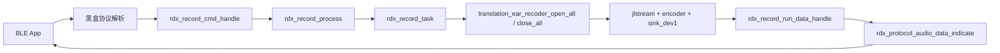
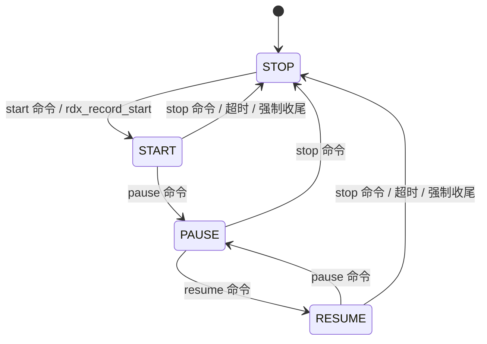

# RDX 录音状态机分析

> 本文只分析当前仓库中 `rdx_record.c`、`rdx_record.h` 以及它们能直接看到的调用边界。
> 
> 对于 `rdx_protocol_audio_data_indicate()`、`rdx_protocol_record_state_indicate()`、`rdx_protocol_task_create()` 这类落在 `librdxApp.a` 中的实现，本文只说明边界，不把黑盒内部逻辑写成确定事实。

## 一、先给结论

`rdx_record.c` 不是编码器，也不是协议解析器，它本质上是 **RDX 录音业务状态机**。

它主要做 4 件事：

1. 接收来自协议层或本地按键的录音控制命令。
2. 维护 `RecordStatus`，决定当前是 start / pause / resume / stop 哪种状态。
3. 把“状态变化”翻译成 JL 平台动作，例如启动 `translation_ear_recoder_open_all()`、关闭录音流、设置 MIC 增益、控制 LED、限制 TWS 切换、维护超时和重试定时器。
4. 在录音数据出来之后做最后一道可见层过滤，只在 BLE 条件满足时才把数据交给黑盒协议层发送。

一句话概括：

- **`rdx_record.c` 决定录音什么时候开始、什么时候暂停、什么时候停止、停止时系统如何收尾。**
- **真正把录音数据封成 RDX 协议包发给 APP 的，不在这个文件里。**

## 二、文件在整体链路里的位置



这张图里有两个关键点：

1. `rdx_record_cmd_handle()` 之前的“协议解析”是黑盒。
2. `rdx_record_run_data_handle()` 之后的“协议封包和发送”也是黑盒。

所以 `rdx_record.c` 正好位于 **协议层与 JL 平台录音层之间**。

## 三、核心状态数据：`RecordStatus`

`rdx_record.c` 所有流程最终都围绕 `RecordStatus` 展开。结构体定义在 `rdx_record.h`：

| 字段 | 作用 | 备注 |
|------|------|------|
| `run` | 当前录音状态 | `START=0`、`PAUSE=1`、`RESUME=2`、`STOP=3` |
| `formate` | 当前录音格式 | 单声道 / 立体声 OPUS 等 |
| `scene` | 当前场景 | `CHAT=0`、`CALL=1` |
| `orig_scene` | 原始场景 | 用于场景切换辅助 |
| `process_state` | 状态机忙闲标志 | `READY` / `BUSY` |
| `mode` | 在线 / 离线模式 | 当前版本里主要用在线录音 |
| `orig_mode` | 原始模式 | 用于 run_exit 时恢复判断 |
| `key_trigger` | 是否由按键触发 | 影响电机/UI 行为 |
| `ui_notify` | UI 回调 | 指向 `rdx_record_ui_notify()` |
| `begin_time` | 开始时间 | 离线录音逻辑残留字段 |
| `rerun` | 是否需要重启录音 | `run_exit` 时处理 |
| `stream_discont` | 流是否中断 | BLE 断连 / 重连保护 |

默认值由 `rdx_record_set_default()` 写入：

- `run = RECORD_STATE_STOP`
- `formate = RECORD_FORMATE_OPUS_16K_MONO`
- `scene = RECORD_SCENE_CHAT`
- `process_state = REC_PROCESS_STATE_READY`
- `stream_discont = false`

这意味着系统上电后默认认为“当前没有录音”，且默认进入 chat 场景。

## 四、真正的状态机长什么样

### 1. 外部可见状态

从 `run` 字段来看，状态机只有 4 个显式状态：



但如果看行为层，实际上可以理解成两类状态：

- **活跃态**：`START`、`RESUME`
- **非活跃态**：`PAUSE`、`STOP`

代码里之所以把 `START` 和 `RESUME` 拆开，是因为两者都会触发“打开录音流”，但在语义上一个是首次开启，一个是暂停后的恢复。

### 2. 还有一个隐藏状态：`process_state`

除了 `run` 之外，真正防重入的是 `process_state`：

- `REC_PROCESS_STATE_READY`
- `REC_PROCESS_STATE_BUSY`

它不代表业务态，而是代表 **“状态机此刻能不能接受新的状态切换请求”**。

只要 `process_state == BUSY`，新的 start / pause / resume / stop 请求就会被拒绝，并且最多启动一个 2 秒的超时兜底定时器，把状态重新拉回 `READY`。

所以 `rdx_record.c` 其实是 **双层状态机**：

1. `run` 决定业务态。
2. `process_state` 决定业务态能否切换。

## 五、命令入口：`rdx_record_cmd_handle()`

这个函数是协议层进入录音状态机的主入口。它做的事情可以分成 5 步。

### 1. 对 start 命令做 `stream_tx_ready` 延迟保护

如果收到的是 start 命令，但 BLE 侧 `stream_tx_ready == 0`，函数不会立刻开录，而是：

1. 把命令缓存到 `g_pending_record_info`
2. 启动 `g_record_cmd_delay_timer`
3. 每 2 秒重试一次
4. 最多重试 5 次

这说明录音启动并不是“收到命令立即开”，而是要等 BLE 发送面真正 ready。

### 2. 去重

如果新命令和 `record_status.run` 一样，就直接返回，避免重复处理。

### 3. 忙态保护

如果 `rdx_record_process_is_busy_check()` 判断当前还在 BUSY，就直接拒绝本次状态切换。

### 4. 写入新状态

当前文件中，`cmd` 字符会被解释成如下语义：

| `r_info->cmd` | 在 `rdx_record.c` 中的含义 |
|---------------|----------------------------|
| `'0'` | START |
| `'1'` | PAUSE |
| `'2'` | RESUME |
| `'3'` | STOP |

同时会根据 `type` 决定场景：

- `type -> CHAT`：`formate = OPUS_16K_MONO`
- `type -> CALL`：`formate = OPUS_16K_STERO`

### 5. 进入 `rdx_record_process()`

命令入口并不直接开关录音流，而是统一把控制权交给 `rdx_record_process()`。

### 6. 一个需要特别注意的点

`rdx_protocol.h` 里的协议宏命名与 `rdx_record_cmd_handle()` 对 `'0'/'1'/'2'/'3'` 的解释并不完全直观一致。由于真正的协议解析逻辑在黑盒库里，所以更稳妥的结论应该是：

- **`rdx_record.c` 只相信传进来的 `Record_info` 内容。**
- **命令字符是如何从 BLE 协议文本转换成 `'0'/'1'/'2'/'3'` 的，这一步属于黑盒协议层。**

## 六、状态分发中心：`rdx_record_process()`

`rdx_record_process()` 是整份文件里最关键的函数。它本质上是“状态变化执行器”。

进入这个函数以后，处理顺序基本固定：

1. 检查 `process_state` 是否忙。
2. 如果 BLE 已连接，就异步上报一次录音状态给协议层。
3. 把 `process_state` 置为 `BUSY`。
4. 根据 `record_status.run` 分发到 start / resume / pause / stop 分支。
5. 如启用了 TWS，同步录音状态到对耳。

### 1. `START` 分支做什么

- 停掉录音状态上传定时器
- 禁止 TWS 自动主从切换
- 播放录音开始提示音
- 根据 `scene` 选择启动参数
  - `CHAT` -> `MIC_TO_MONO_OPUS`
  - `CALL` -> `MIC_DAC_TO_STERO_OPUS`
- 向 `rdx_record_task` 发消息，让异步任务真正去打开 `translation_ear_recoder`
- 关闭自动关机
- 设置录音灯效
- 如果启用心跳支持，则启动 keep alive 定时器

### 2. `RESUME` 分支做什么

和 `START` 很像，区别主要在语义：

- 不播放录音开启提示音
- 仍然会重新打开录音流
- 仍然会再次进入活跃态配置

### 3. `PAUSE` 分支做什么

- 清理上传文件相关状态（当前多为兼容残留接口）
- 清空首帧过滤计数
- 停掉心跳检测
- 禁止 TWS 自动切换
- 给 `rdx_record_task` 发关闭录音流消息
- 恢复自动关机
- 根据 BLE 是否连接设置灯效

### 4. `STOP` 分支做什么

- 清理上传状态
- 清空首帧过滤计数
- 播放录音结束提示音
- 停掉心跳检测
- 给 `rdx_record_task` 发关闭流消息
- 重新允许 TWS 自动角色切换
- 恢复自动关机
- 根据连接状态设置灯效

### 5. 为什么这里要单独用一个任务

因为 `rdx_record_process()` 负责的是 **业务决策**，而真正打开 / 关闭 JL 录音流是可能更重、更底层的动作，所以它把执行落到了独立任务 `rdx_record_task` 上。

## 七、异步任务边界：`rdx_record_task()`

这个任务很“薄”，但非常关键。它说明状态机和 JL 录音流之间有明确的线程边界。

任务逻辑只有两类：

- `START` / `RESUME` -> `translation_ear_recoder_open_all(msg[2])`
- `STOP` / `PAUSE` -> `translation_ear_recoder_close_all()`

所以：

- **`rdx_record_process()` 决定该不该开录。**
- **`rdx_record_task()` 负责真的去开录。**

这两个函数不要混着看。前者是状态机，后者是执行器。

## 八、运行期数据链路：`run_init` / `run_data_handle` / `run_exit`

这三个函数很像是给录音流生命周期准备的回调入口。虽然当前源码里看不到谁直接调用它们，但从命名和内容上可以确定，它们属于“录音流开始、运行中、结束”的可见层钩子。

### 1. `rdx_record_run_init()`

这个函数在录音流真正进入运行态时做初始化工作：

- 触发 UI 通知
- 判断当前是在线还是离线模式
- 设置 `begin_time`
- 检查并应用 MIC 增益
- 启动最长录音时长定时器

这里能看出一个设计意图：

- `rdx_record_process()` 更偏“控制平面”
- `rdx_record_run_init()` 更偏“数据流真正开始跑起来后的初始化”

### 2. `rdx_record_run_data_handle()`

这是整个 `rdx_record.c` 最重要的数据出口函数。它只做两类事情：

#### 首先，做首帧过滤

前 10 帧数据直接丢弃：

```text
if filter_cnt < 10:
    filter_cnt++
    return
```

这说明项目明确认为录音刚启动时的前几帧不稳定，需要滤掉。

#### 然后，做发送前条件判断

只有同时满足以下条件，才会把数据交给黑盒协议层：

- BLE 连接句柄有效
- `stream_discont == false`
- `ccc_configured == true`
- `stream_tx_ready == true`

满足条件后，才调用：

```c
rdx_protocol_audio_data_indicate(d, len);
```

所以 `rdx_record_run_data_handle()` 的角色不是封包，而是：

- **丢掉不该发的前几帧**
- **拦住当前不该发的流**
- **只在发送条件满足时，把帧交给黑盒协议层**

### 3. `rdx_record_run_exit()`

流退出时它会做收尾：

- 清空过滤计数
- 恢复 `process_state = READY`
- 停止最大时长定时器
- 触发 UI 收尾
- 如果 `rerun == true`，1 秒后重新调用 `rdx_record_start()`

说明这个文件连“异常退出后的自动重启”也考虑进去了。

## 九、保护逻辑与定时器

`rdx_record.c` 里有不少保护逻辑，它们比主状态机更容易被忽略，但实际很关键。

### 1. Busy 保护

相关变量：

- `record_status.process_state`
- `record_set_process_state_timer`
- `RDX_RECORD_STATE_BUSY_TIMEOUT = 2000`

作用：避免状态切换重入。如果某次切换后迟迟没有把状态拉回 `READY`，2 秒超时兜底会强制恢复。

### 2. Start 延迟重试

相关变量：

- `g_record_cmd_delay_timer`
- `g_record_cmd_retry_cnt`
- `RECORD_CMD_DELAY_MS = 2000`
- `RECORD_CMD_MAX_RETRY = 5`

作用：等待 `stream_tx_ready` 再真正执行 start。

### 3. 心跳超时

相关变量：

- `record_alive_timer`
- `record_keep`
- `heartbeat_timer_cnt`

作用：如果启用了 `RECORD_HEARTBEAT_SUPPORT`，则每 3 秒检查一次心跳，连续超时就强制 stop。

需要注意：当前源码里这个宏是注释掉的，因此这套逻辑**默认并未启用**。

### 4. 最大录音时长

相关变量：

- `rdx_record_max_timer`
- `RDX_RECORD_LIMIT_TIME = (5*60*60 - 2) * 1000`

作用：最长录音时间约 5 小时减 2 秒，到时自动 stop。

### 5. 流中断保护

相关变量：

- `stream_discont`
- `stream_resume_timer`

作用：

- BLE 断开时：标记 `stream_discont = true`
- BLE 恢复后：延迟 3 秒再把 `stream_discont` 清回 `false`

这能避免链路刚恢复时立即把不稳定数据送给协议层。

### 6. 首帧过滤

相关变量：

- `stream_filter_cnt`

作用：前 10 帧直接丢掉，规避启录时爆音/抖动。

## 十、场景差异：chat 和 call 到底差在哪

`rdx_record.c` 在场景上只关心两类：

| 场景 | 编码格式 | 录音模式 | MIC 增益来源 |
|------|----------|----------|--------------|
| `CHAT` | `OPUS_16K_MONO` | `MIC_TO_MONO_OPUS` | `mic0 + mic3` |
| `CALL` | `OPUS_16K_STERO` | `MIC_DAC_TO_STERO_OPUS` | `mic2 + mic3` |

结合增益逻辑看：

- chat 场景主要关心 `RECORD_MIC_0` 和 `RECORD_MIC_3`
- call 场景主要关心 `RECORD_MIC_2` 和 `RECORD_MIC_3`

也就是说，`rdx_record.c` 并不只是决定“单声道还是双声道”，它还负责切换两套不同的 MIC 增益配置。

## 十一、UI、TWS 与录音并不是分离的

`rdx_record.c` 有一个很容易被低估的特点：它不是纯音频文件，而是把产品行为揉进了状态机。

在 start / resume / pause / stop 分支里，都会看到这些动作：

- LED 灯效切换
- 录音开始/结束提示音
- 电机震动
- TWS 自动角色切换开关
- TWS 录音状态同步
- 自动关机开关

这意味着：

- **录音状态机不仅控制录音流，还控制整机行为。**

如果后续某个问题表现为“录音状态对了，但灯效不对 / TWS 不对 / 关机策略不对”，不要把它当成独立问题，很可能根源仍在 `rdx_record_process()` 的状态切换分支。

## 十二、可见部分与不可见部分的最终边界

### 可见部分：`rdx_record.c` 明确做的事

- 录音状态机维护
- 录音命令去重
- busy 防重入
- start 延迟重试
- 录音任务调度
- MIC 增益配置
- 最大录音时间控制
- 首帧过滤
- 断连流中断保护
- UI / TWS / 自动关机联动
- 决定何时把数据交给协议层

### 不可见部分：当前源码看不到的事

- `Record_info` 是如何从 BLE 协议文本解析出来的
- `rdx_protocol_record_state_indicate()` 如何编码录音状态包
- `rdx_protocol_audio_data_indicate()` 如何封装音频流
- 协议层是否做分片、校验、重发、加密
- `run_init` / `run_data_handle` / `run_exit` 的最终上层调用点

所以分析 `rdx_record.c` 时，最稳妥的边界判断是：

- **这里能看见“录音控制平面”。**
- **这里看不见“协议数据平面”。**

## 十三、阅读这个文件时的推荐顺序

如果后面你还要继续往下拆，建议按这个顺序看：

1. `RecordStatus` 和几个关键定时器变量
2. `rdx_record_cmd_handle()`
3. `rdx_record_process()`
4. `rdx_record_task()`
5. `rdx_record_run_init()` / `rdx_record_run_data_handle()` / `rdx_record_run_exit()`
6. `rdx_record_mic_gain_check()`
7. `stream_discont`、`max_timer`、`keep_alive` 这些保护逻辑

这样看，最不容易把“状态机”和“数据路径”混在一起。

## 十四、最后的结论

`rdx_record.c` 可以理解成 **RDX 录音控制器**。

它不负责编码实现，不负责协议解析，也不直接实现 BLE 分包；它负责的是：

- 录音状态机
- 录音任务调度
- 录音运行期保护
- 录音与整机行为的联动

因此如果后面继续定位问题，可以先按下面这条原则分流：

- “录音为什么没开、没停、状态错、灯效错、TWS 错、超时错、首帧处理错” -> 先查 `rdx_record.c`
- “音频包为什么格式不对、协议内容不对、加密不对、ACK 不对” -> 已经越过 `rdx_record.c`，进入黑盒协议层