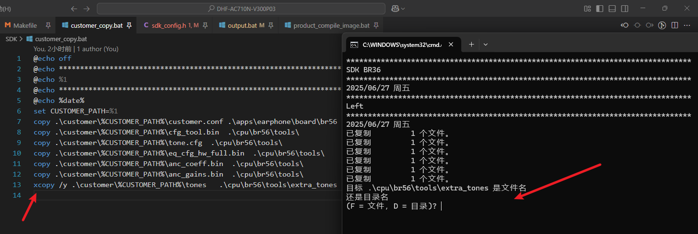
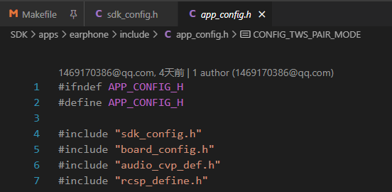
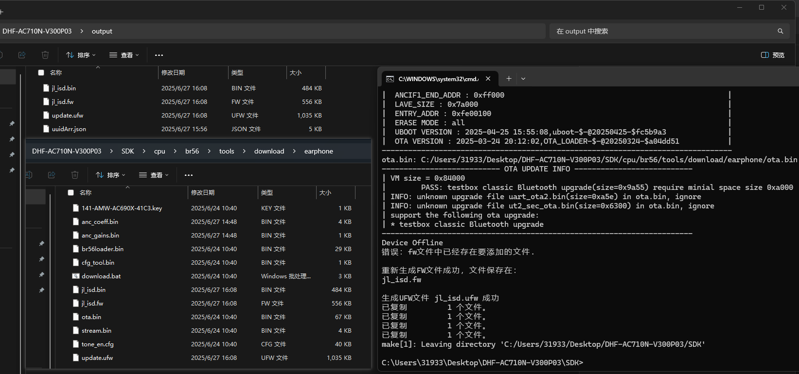

# 根目录下的`product_compile_image.bat`

```bat
@echo off
@echo ********************************************************************************
@echo SDK BR36
@echo ********************************************************************************
@echo %date%
cd ./
set PATH=tools\utils;%PATH%

del customer_path.conf
set para=%1
@rem  ###-customer +blname or model
@rem  ###-JOYROOM_Funpods_FN3_Left
@rem  ###-JOYROOM_Funpods_FN3_Right
@rem  ###-JOYROOM_Funpods_FN3_NOAPP_Left
@rem  ###-JOYROOM_Funpods_FN3_NOAPP_Right
set CUSTOMER_PATH=JOYROOM_Funpods_FN3_NOAPP_Left
echo CUSTOMER_PATH=%CUSTOMER_PATH%>customer_path.conf
echo CFLAGS_EX+=-D_%CUSTOMER_PATH%>>customer_path.conf
@rem ###-key select
@rem ###  1-default
@rem ###  2-product
set CUSTOMER_CHIPKEY=product
echo CUSTOMER_CHIPKEY=%CUSTOMER_CHIPKEY%>>customer_path.conf
call ".\customer_copy.bat"  %CUSTOMER_PATH%
call ".\apps\earphone\board\br36\output.bat"  %CUSTOMER_PATH%
@echo %para%
if "%para%" neq "all" (
if "%para%" neq "clean" (
     start cmd.exe /k "make clean&&make all -j 16"
 )
 )
```


## 疑问1

**我没记错的话，这是shell脚本吧？他具体干了什么？**

这不是 shell 脚本，而是一个 Windows 批处理脚本（Batch 文件，扩展名通常是 .bat 或 .cmd）。`@echo off` 是批处理脚本的典型开头。

这个脚本的主要功能是：

**1. 环境设置**

- 关闭命令回显（`@echo off`）
  - `@echo off` 中的 `@` 是为了不显示 `echo off` 这条命令本身
  - `echo off` 会关闭后续所有命令的回显
  - 所以后面的命令都不需要再加 `@` 了

- 显示 SDK BR36 的标题信息和当前日期
- 设置工具路径到系统 PATH 中

**2. 配置文件生成**

- 删除旧的 `customer_path.conf` 配置文件
- 设置客户路径为 `JOYROOM_Funpods_FN3_NOAPP_Left`（看起来是某款耳机产品的左耳配置）
- 生成新的配置文件，包含：
  - 客户路径设置
  - 编译标志（CFLAGS_EX）
  - 芯片密钥类型设置为 "product"

**3. 调用其他脚本**

- 执行 `customer_copy.bat` 进行客户配置复制
- 执行 `output.bat` 处理输出相关操作

**4. 编译控制**

- 根据传入参数决定是否启动编译
- 如果参数不是 "all" 或 "clean"，则在新的命令窗口中执行：
  - `make clean` 清理之前的编译结果
  - `make all -j 16` 使用 16 个并行任务进行编译

这看起来是一个嵌入式设备（可能是蓝牙耳机）的固件开发工具链的构建脚本，专门用于编译 JOYROOM 品牌耳机的固件。

## 疑问2

**Windows 批处理脚本双击运行一定会出现命令窗口显示脚本命令吗？所以才要关闭命令回显？这样看起来简洁一点？**

是的，你理解得很对！

**Windows 批处理脚本的默认行为：**

- 双击 .bat 文件运行时，**一定会弹出命令提示符窗口**
- 默认情况下会显示每条执行的命令（回显），看起来像这样：

```bat
C:\>echo SDK BR36
SDK BR36

C:\>echo %date%
2025-06-24

C:\>cd ./
C:\>set PATH=tools\utils;%PATH%
...
```

**`@echo off` 的作用：**

- 关闭命令回显，只显示命令的**输出结果**，不显示命令本身
- 加上 `@echo off` 后就变成：

```bat
SDK BR36
********************************************************************************
2025-06-24
...
```

**为什么要这样做：**

1. **界面更简洁** - 用户只看到有用的信息，不看到冗长的命令
2. **更专业** - 像一个成品软件的输出，而不是原始的脚本调试信息
3. **减少干扰** - 避免技术细节干扰最终用户

**其他相关知识：**

- 如果想完全隐藏命令窗口，需要用 `.vbs` 脚本或其他方法调用
- 单个命令前加 `@` 也能关闭该命令的回显
- `@echo off` 中的 `@` 是为了不显示 `echo off` 这条命令本身

所以你的理解完全正确！这是为了让脚本运行时的界面看起来更加专业和简洁。

## 疑问3

**@echo %date%这个获取的是系统的本地时间吗？什么格式形式？**

是的，`%date%` 获取的是**系统的本地时间**中的日期部分。

**格式形式：** `%date%` 的格式**取决于系统的区域设置**，不同地区显示格式不同：

中文系统（中国大陆）：

```bat
2025-06-24 星期二
```

**英文系统（美国）：**

```bat
Tue 06/24/2025
```

**获取更多时间信息：**

- `%date%` - 只有日期
- `%time%` - 只有时间（如：14:30:25.67）
- `%date% %time%` - 日期和时间都显示

**如果需要固定格式：** 如果你需要固定格式的日期（不受系统区域影响），可以这样：

```bat
@echo off
for /f "tokens=2 delims==" %%a in ('wmic OS Get localdatetime /value') do set "dt=%%a"
set "YY=%dt:~2,2%" & set "YYYY=%dt:~0,4%" & set "MM=%dt:~4,2%" & set "DD=%dt:~6,2%"
echo %YYYY%-%MM%-%DD%
```

所以在你的脚本中，`@echo %date%` 会根据运行脚本的电脑的区域设置来显示相应格式的当前日期。

## 疑问4

```bat
cd ./
set PATH=tools\utils;%PATH%
```

`cd ./`

- **作用**：切换到当前目录
- **看起来多余**：因为 `./` 就是当前目录，理论上这条命令没有实际效果
  - 如果这个脚本不在正确位置上的话，也没用
  - 如果在正确位置上的的话，这句话没用。
- 实际意义：
  - 可能是为了**确保工作目录**确实在脚本所在目录
  - 有些情况下，批处理脚本的当前目录可能不是脚本文件所在目录
  - 起到一种"重置"作用，确保后续操作都在正确的目录进行

`set PATH=tools\utils;%PATH%`

- **作用**：修改系统 PATH 环境变量
- 具体功能：
  - 将 `tools\utils` 目录添加到 PATH 的**最前面**
  - `%PATH%` 是原来的 PATH 变量内容
  - 用分号 `;` 分隔多个路径

### 疑问1

**每一个工程的tools\utils目录都添加进path环境变量，工程多了path中路径太多会不会有什么隐患？将tools\utils目录添加进path中，是为什么在任何地方都可以精准引用tools\utils目录中的东西？`set PATH=tools\utils;%PATH%`是在path中新建一个路径还是替换最前面的路径？，我看你说`%PATH%` 是原来的 PATH 变量内容？**

#### **PATH 路径过多的隐患**

**确实存在隐患：**

1. **性能影响** - PATH 路径越多，**系统查找可执行文件时遍历时间越长**
2. **命令冲突** - 不同工程可能有同名工具，优先级按 PATH 顺序决定
   - 看谁在最前面
3. **安全风险** - 可能意外执行了错误路径下的程序
4. **维护困难** - PATH 变得臃肿，难以管理

#### **PATH 的工作原理**

当你输入命令时，系统会**按顺序**搜索 PATH 中的每个目录：

```bat
PATH=tools\utils;C:\Windows\System32;C:\Windows

执行 mytool.exe 时：
1. 先在 tools\utils 找
2. 找不到再在 C:\Windows\System32 找  
3. 还找不到再在 C:\Windows 找
```

#### **`set PATH=tools\utils;%PATH%` 是新建还是替换？**

**是新建/追加**，不是替换！

```bat
# 假设原来的 PATH 是：
PATH=C:\Windows\System32;C:\Windows

# 执行后：
PATH=tools\utils;C:\Windows\System32;C:\Windows
```

**工作过程：**

1. `%PATH%` 获取原来的完整 PATH 内容
2. `tools\utils;` 添加到最前面
3. **整个 PATH 被重新赋值**，包含新旧所有路径

**为什么添加到最前面？**

- **优先级最高** - 确保使用的是当前工程的工具版本
- **避免版本冲突** - 不会被系统中的同名工具干扰

**更好的做法**

很多项目会这样做：

```bat
# 保存原始 PATH
set ORIGINAL_PATH=%PATH%

# 添加工具路径
set PATH=tools\utils;%PATH%

# 脚本结束时恢复（可选）
set PATH=%ORIGINAL_PATH%
```

或者直接用完整路径调用工具，避免修改 PATH。

### 疑问2？？？？

**感觉脚本执行顺序是从右边到左边的？set PATH=tools\utils;%PATH%，先获取完整的path内容，然后在最前面添加一条变量？tools\utils相对路径可以这么写吗？因为脚本的位置在工程根目录中7003D8_V138_Middware，而tool目录7003D8_V138_Middware\cpu\br36\tools，utils目录还没有这种情况下还是脚本还可以往下执行？ **

你的观察很敏锐！让我逐一回答：

**执行顺序问题**

你理解错了！批处理中 `=` 右边是**先计算，再赋值**：

```bat
set PATH=tools\utils;%PATH%
```

**执行顺序：**

1. **先计算右边**：`tools\utils;%PATH%` → `tools\utils;C:\Windows\System32;...`
2. **再赋值给左边**：`PATH=计算结果`

这是**从右到左**的计算，然后赋值给左边变量。

**相对路径问题**

`tools\utils` 这样写是**有问题的**！

**当前情况分析：**

```bat
工程结构：
7003D8_V138_Middware/          ← 脚本在这里
├── 脚本.bat  
└── cpu/
    └── br36/
        └── tools/
            └── utils/         ← 实际工具在这里
```

正确的相对路径应该是：

```bat
set PATH=cpu\br36\tools\utils;%PATH%
```

**为什么脚本还能继续执行？**

**原因有几个：**

1. **PATH 添加不会导致脚本停止**

```bat
set PATH=不存在的路径;%PATH%
echo 这行还是会执行  # 不会报错
```

2. **工具可能还没被调用**

   - 脚本可能在后面才调用工具

   - 此时只是设置了 PATH，还没有实际使用

3. **可能有其他机制**

   - 脚本可能用完整路径调用工具
   - 或者在 `customer_copy.bat` 中会复制工具到正确位置

验证方法：

```bat
@echo off
set PATH=tools\utils;%PATH%
echo 当前PATH: %PATH%
where some_tool.exe 2>nul && echo 找到工具 || echo 工具不存在
```

**结论：** 这个脚本的 PATH 设置很可能是**错误的**，但因为：

- 批处理容错性强
- 工具可能通过其他方式调用
- 或者在后续脚本中会修正路径

所以脚本表面上能继续执行。

## 疑问5

**这几个脚本语句呢？删除现有配置文件，自动加载customer目录下的文件名，然后呢？写入新的配置文件中？**

```bat
del customer_path.conf
set para=%1
@rem  ###-customer +blname or model
@rem  ###-JOYROOM_Funpods_FN3_Left
@rem  ###-JOYROOM_Funpods_FN3_Right
@rem  ###-JOYROOM_Funpods_FN3_NOAPP_Left
@rem  ###-JOYROOM_Funpods_FN3_NOAPP_Right
set CUSTOMER_PATH=JOYROOM_Funpods_FN3_NOAPP_Left
echo CUSTOMER_PATH=%CUSTOMER_PATH%>customer_path.conf
echo CFLAGS_EX+=-D_%CUSTOMER_PATH%>>customer_path.conf
```

**获取命令行参数**

```bat
set para=%1
```

- `%1` 是第一个命令行参数
- 比如运行 `script.bat JOYROOM_Left`，则 `para=JOYROOM_Left`
  - 问题是双击后不会有输入参数的机会，后面直接硬编码了
  - **获取的是谁的参数？这是一个批处理脚本，获取的应该是脚本内容？毕竟人为没有输入参数啊？**

`%1` 获取的是**运行批处理脚本时的命令行参数**，不是脚本内容。

几种运行方式的区别：

**双击运行（没有参数）**

```bat
用户双击脚本文件
→ %1 = 空值
→ para = 空值
```

**命令行运行（有参数）**

```bat
# 在命令提示符中运行：
script.bat JOYROOM_Left
→ %1 = "JOYROOM_Left"
→ para = "JOYROOM_Left"

# 多个参数的情况：
script.bat JOYROOM_Left debug clean
→ %1 = "JOYROOM_Left"
→ %2 = "debug" 
→ %3 = "clean"
```

**被其他脚本调用（有参数）**

```bat
# 在另一个脚本中：
call "script.bat" JOYROOM_Right
→ %1 = "JOYROOM_Right"
```

**当前脚本的实际情况**

你说得对！如果用户是**双击运行**这个脚本：

- `%1` 是**空值**
- `para` 也是**空值**
- 但脚本完全不使用这个参数，直接硬编码了 `CUSTOMER_PATH`

**在双击运行的脚本中，如果没有别的脚本调用传入参数的话，他就是空值，因为双击运行人为无法直接向命令窗口输入参数？**

**双击 .bat 文件时：**

- Windows 直接执行脚本，**没有机会输入参数**
- `%1`, `%2`, `%3` 等都是**空值**
- 用户无法在双击时传递任何命令行参数

获得参数的几种方式

**命令行运行（可以传参）**

```bat
C:\> script.bat JOYROOM_Left debug
```

**快捷方式传参**

```bat
右键创建快捷方式 → 属性 → 目标
改为: "C:\path\script.bat" JOYROOM_Left
```

**其他脚本调用**

```bat
call "script.bat" JOYROOM_Right
```

**批处理内部获取用户输入**

```bat
@echo off
echo 请选择产品型号:
echo 1. JOYROOM_Left
echo 2. JOYROOM_Right
set /p choice=请输入选择(1-2): 
if "%choice%"=="1" set CUSTOMER_PATH=JOYROOM_Left
if "%choice%"=="2" set CUSTOMER_PATH=JOYROOM_Right
```

**注释说明**

```bat
@rem  ###-customer +blname or model
@rem  ###-JOYROOM_Funpods_FN3_Left
@rem  ###-JOYROOM_Funpods_FN3_Right
```

- 这些是注释，说明支持的客户/型号选项

- 但实际上**脚本没有使用这些参数**！
- **有脚本获取了customer目录下的各文件名**

**硬编码设置**

```bat
set CUSTOMER_PATH=JOYROOM_Funpods_FN3_NOAPP_Left
```

- **关键问题**：这里硬编码了路径，**完全忽略了命令行参数**！
  - **除了其他脚本调用，或者内部获取用户输入的话，双击直接运行无法获得参数。**

- 不管你传什么参数，都会使用 `JOYROOM_Funpods_FN3_NOAPP_Left`

**写入新配置文件**

```bat
echo CUSTOMER_PATH=%CUSTOMER_PATH%>customer_path.conf
echo CFLAGS_EX+=-D_%CUSTOMER_PATH%>>customer_path.conf
```

生成的 `customer_path.conf` 内容：

```bat
CUSTOMER_PATH=JOYROOM_Funpods_FN3_NOAPP_Left
CFLAGS_EX+=-D_JOYROOM_Funpods_FN3_NOAPP_Left
```

**两种写入的写法不同：**

`>` 单箭头 - 覆盖写入

- **覆盖模式**：清空文件内容，重新写入

- 如果文件存在，**删除原内容**

- 如果文件不存在，**创建新文件**

`>>` 双箭头 - 追加写入

- **追加模式**：在文件末尾添加内容
- **保留原内容**，新内容写在后面
- 如果文件不存在，也会创建新文件

```bat
# 第1行：覆盖写入（如果文件存在会清空）
echo CUSTOMER_PATH=JOYROOM_Funpods_FN3_NOAPP_Left>customer_path.conf

# 第2行：追加写入（在第1行内容后面添加）
echo CFLAGS_EX+=-D_JOYROOM_Funpods_FN3_NOAPP_Left>>customer_path.conf
```

**为什么这样设计？**

1. **第1行用 `>`**：确保配置文件从头开始，清除旧配置
2. **第2行用 `>>`**：在第1行基础上添加更多配置项

**设计缺陷：**

1. **获取了参数但没使用** - `para=%1` 设置了但后面没用到
2. **硬编码配置** - 应该根据参数动态设置，但实际是固定值
3. **注释与实现不符** - 注释说支持多种型号，但代码只支持一种

正确的实现应该是：

```bat
set CUSTOMER_PATH=%1
if "%CUSTOMER_PATH%"=="" set CUSTOMER_PATH=JOYROOM_Funpods_FN3_NOAPP_Left
echo CUSTOMER_PATH=%CUSTOMER_PATH%>customer_path.conf
echo CFLAGS_EX+=-D_%CUSTOMER_PATH%>>customer_path.conf
```

**结论：** 这个脚本目前是**半成品**，准备了参数处理框架但没有实际使用，只能编译固定的一种产品配置。

## 疑问6

```bat
@rem ###-key select
@rem ###  1-default
@rem ###  2-product
set CUSTOMER_CHIPKEY=product
echo CUSTOMER_CHIPKEY=%CUSTOMER_CHIPKEY%>>customer_path.conf
call ".\customer_copy.bat"  %CUSTOMER_PATH%
call ".\apps\earphone\board\br36\output.bat"  %CUSTOMER_PATH%
```

**前三行语句相当于注释？而且不会在脚本运行时显示出来？原因是用了@还是本身的语法就是注释而已？后面就是在赋值一个变量，并追加到配置文件中，再往后就是内部调用其他脚本并传递参数？**

**这些是注释的原因：**

- `rem` 本身就是**注释语法**（remark的缩写）
- `@` 的作用是**不显示这条命令本身**
- **本来就是利用命令窗口的批处理程序，相当于一条一条命令往命令窗口输一样。会像人为输入一样的效果。**

不加 `@` 的情况：

```bat
rem 这是注释
```

运行时会显示：

```bat
C:\>rem 这是注释
```

加 `@` 的情况：

```bat
@rem 这是注释
```

运行时不显示任何内容

**调用其他脚本并传参**

```bat
call ".\customer_copy.bat"  %CUSTOMER_PATH%
call ".\apps\earphone\board\br36\output.bat"  %CUSTOMER_PATH%
```

相当于执行：

```bat
call ".\customer_copy.bat" JOYROOM_Funpods_FN3_NOAPP_Left
call ".\apps\earphone\board\br36\output.bat" JOYROOM_Funpods_FN3_NOAPP_Left
```

这是一个典型的构建脚本模式：生成配置文件 → 调用具体的处理脚本。

## 最后一个echo部分

```bat
@echo %para%                           # 显示传入的参数
if "%para%" neq "all" (               # 如果参数不等于 "all"
    if "%para%" neq "clean" (         # 且参数不等于 "clean"
        start cmd.exe /k "make clean&&make all -j 16"    # 执行编译
    )
)
```

**参数值的不同处理：**

1. 参数 = "all"：
   - 不执行编译命令
   - 可能是只做配置准备工作
2. 参数 = "clean"：
   - 不执行编译命令
   - 可能是只做清理工作
3. 参数 = 其他值（比如具体客户名）：
   - **执行编译**：`make clean && make all -j 16`
   - `-j 16` 表示使用16个并行线程编译

```bat
build.bat JOYROOM_Left        # 会执行编译
build.bat all                 # 只做配置，不编译  
build.bat clean               # 只做配置，不编译
```

- **但是双击运行脚本，没有机会输入参数的，内部没有获取用户输入的话？**

**双击 `.bat` 文件时：**

- `%1` 参数为**空**
- 无法传入参数
- 脚本会按照"无参数"的逻辑执行

这个脚本设计上有问题，双击运行时确实没有机会输入参数，只能使用硬编码的默认客户配置。参数主要用于控制编译行为，而不是客户选择。

### 编译执行语句

```bat
start cmd.exe /k "make clean && make all -j 16"
```

**各部分含义：**

1. **`start`** - Windows批处理命令，启动新的程序或命令窗口
2. **`cmd.exe`** - 启动新的命令行窗口
   - 编译过程可能很长，需要独立窗口显示进度
   - `/k` 保持窗口打开，方便查看编译结果和错误信息
   - 不阻塞原脚本窗口
3. **`/k`** - cmd.exe的参数，执行命令后**保持窗口打开**（不自动关闭）
   - 上一个脚本执行完了会自动关闭
4. **`"make clean && make all -j 16"`** - 在新窗口中执行的命令

## 有哪一些可以优化的地方

# 被调用脚本`customer_copy.bat`

```bat
@echo off
@echo ********************************************************************************
@echo %1
@echo ********************************************************************************
@echo %date%
set CUSTOMER_PATH=%1
copy .\customer\%CUSTOMER_PATH%\customer.conf .\apps\earphone\board\br36
copy .\customer\%CUSTOMER_PATH%\cfg_tool.bin  .\cpu\br36\tools\
copy .\customer\%CUSTOMER_PATH%\tone.cfg  .\cpu\br36\tools\
copy .\customer\%CUSTOMER_PATH%\eq_cfg_hw_full.bin  .\cpu\br36\tools\
copy .\customer\%CUSTOMER_PATH%\anc_coeff.bin  .\cpu\br36\tools\
copy .\customer\%CUSTOMER_PATH%\anc_gains.bin  .\cpu\br36\tools\
xcopy /y .\customer\%CUSTOMER_PATH%\tones   .\cpu\br36\tools\extra_tones
```

**这个脚本是在别的脚本内部调用的调用时还跟随了参数，所以这个后面那一些语句就是通过参数找到对应的客户配置路径把他们的文件配置复制到工程编译时的路径下？这个是强制覆盖吗？没有就创建？**

**参数调用：** 这个脚本确实是被其他脚本调用的，比如：

```bat
这里 ABC_Company 就是 %1 参数，代表客户配置路径。
```

**关于覆盖和创建：**

1. copy 命令（前6行）：
   - 默认会提示是否覆盖已存在的文件
   - 如果目标目录不存在，copy 命令会**失败**
   - 不会自动创建目录
2. xcopy 命令（最后一行）：
   - `/y` 参数表示**强制覆盖**，不提示确认
   - 如果目标目录不存在，xcopy 会**自动创建**



**潜在问题：** 这个脚本假设目标目录都已经存在，如果不存在，copy 命令会失败。更安全的做法是：

```bat
if not exist ".\apps\earphone\board\br36" mkdir ".\apps\earphone\board\br36"
copy .\customer\%CUSTOMER_PATH%\customer.conf .\apps\earphone\board\br36
```

所以这个脚本的作用就是根据客户参数，将特定客户的配置文件部署到编译环境中。

# 被调用脚本`\apps\earphone\board\br36\output.bat`

```bat
@echo off
@echo ********************************************************************************
@echo %1 output
@echo ********************************************************************************
@echo %date%
cd ./
if exist apps\earphone\board\br36\customer.h del apps\earphone\board\br36\customer.h
echo #define  _%1 1>>apps\earphone\board\br36\customer.h
for /f "eol=# tokens=1,2 delims==" %%a in (apps\earphone\board\br36\customer.conf) do (
echo #define %%a %%b>>apps\earphone\board\br36\customer.h
)
```

- 删除旧配置`customer.h`里面全是宏定义
  - 控制代码的启用
  - 如果已存在 `customer.h` 文件，就删除它（重新生成）

- 这个脚本的作用是**根据客户参数和配置文件生成C语言头文件**，用于条件编译。

**生成客户特定的宏定义：**

```bat
echo #define  _%1 1>>apps\earphone\board\br36\customer.h
```

- **`>>` 的行为：**
  - 如果文件**存在**：追加内容到文件末尾
  - 如果文件**不存在**：**自动创建**新文件并写入内容
- 如果用单个 `>`：
  - 这样也可以，但后续的 for 循环中，必须用 `>>` 来追加，否则会覆盖之前的内容。

在头文件中写入客户标识宏，比如调用 `script.bat JOYROOM_Funpods_FN3_NOAPP_Left ` 就会生成：

```bat
#define _JOYROOM_Funpods_FN3_NOAPP_Left 1
```

**解析配置文件并生成宏定义：**

```bat
for /f "eol=# tokens=1,2 delims==" %%a in (apps\earphone\board\br36\customer.conf) do (
    echo #define %%a %%b>>apps\earphone\board\br36\customer.h
)
```

- 这里的`customer.conf`是根目录下的`customer_copy.bat`脚本从customer目录中复制过来的。
  - 以文件夹分左右分客户的方式

**详细解释 for 循环：**

- `eol=#`：忽略以 `#` 开头的行（注释行）
- `tokens=1,2`：提取每行的前两个字段
- `delims==`：以 `=` 作为分隔符
  - `=`分隔一个字段
- 读取 `customer.conf` 文件的每一行

```bat
#  _KEY_TONE_EN
#  // 按键提示音。建议音频输出使用固定采样率
#   0：  
#   1：   
#---------------------------------------------
_KEY_TONE_EN=0
###------------------------------------------

#  _AUDIO_CVP_NS_MODE
#  通话降噪模式配置
#   0： CVP_ANS_MODE 
#   1： CVP_DNS_MODE
#---------------------------------------------
_AUDIO_CVP_NS_MODE=0
###------------------------------------------
```

**实际替换操作**

**echo #define %%a %%b>>apps\earphone\board\br36\customer.h 宏定义这种追加方式？是一行一行追加吗？换行吗？%算占位符吗？美观一点？**

关于 `%%a` 和 `%%b`：

**在批处理 for 循环中：**

- `%%a` 和 `%%b` 是**循环变量**，不是占位符
- 每次循环时，`%%a` 和 `%%b` 会被实际的值替换

**追加方式和换行：**

**`echo` 命令的特点：**

- `echo` 默认会在输出后**自动换行**
- 所以每次执行都会在新的一行写入内容

## echo的输入位置

`echo` 命令的输出方向：

**1. 普通 echo（输出到命令窗口）：**

```bat
echo Hello World
```

这会在命令窗口显示：`Hello World`

**2.echo 配合重定向符（输出到文件）：**

```bat
echo #define %%a %%b>>apps\earphone\board\br36\customer.h
```

**重定向符的作用：**

- `>>` 是**重定向符**，改变了输出方向
- **没有重定向符**：输出到命令窗口
- **有重定向符**：输出到指定文件

**具体到这行代码：**

```bat
echo #define %%a %%b>>apps\earphone\board\br36\customer.h
```

**执行结果：**

- `#define %%a %%b` 的内容**不会显示**在命令窗口
- 而是**直接写入**到 `customer.h` 文件中
- 命令窗口不会有任何显示

## echo的换行效果

**echo自带换行效果？这个特性体现在没有重定向还是有重定向？**

`echo` 的**自带换行效果**在**两种情况下都存在**！

输出到命令窗口（无重定向）：

```bat
echo Line1
echo Line2
echo Line3
```

命令窗口显示：

```bat
Line1
Line2  
Line3
```

每个 `echo` 输出后自动换行。

**输出到文件（有重定向）：**

```bat
echo Line1 > test.txt
echo Line2 >> test.txt  
echo Line3 >> test.txt
```

`test.txt` 文件内容：

```bat
同样，每个 echo 写入文件时也自动换行。
```

在你分析的脚本中：

```bat
echo #define  _%1 1>>apps\earphone\board\br36\customer.h
for /f ... do (
    echo #define %%a %%b>>apps\earphone\board\br36\customer.h
)
```

生成的 customer.h 文件：

```bat
#define _ABC_Company 1
#define _KEY_TONE_EN 0
#define _AUDIO_CVP_NS_MODE 0
```

每一行都是独立的，这就是 `echo` 自带换行的效果。

# 构建与编译

**这个是直接调用当前脚本目录下的makefile文件进行构建和编译？是Makefile没后缀名的文件还是Makefile.bak文件？**

## Make 文件查找顺序：

`make` 命令会按照**固定顺序**在当前目录查找构建文件：

1. **`GNUmakefile`** （GNU Make 特有）
2. **`makefile`** （小写，无扩展名）
3. **`Makefile`** （首字母大写，无扩展名）

**`Makefile.bak` 不会被自动识别！**

- `.bak` 通常是**备份文件**
- `make` 不会自动查找带后缀的文件
- 除非明确指定：`make -f Makefile.bak`

在这个脚本中：

```bat
make clean && make all -j 16
```

**会查找的文件（按优先级）：**

1. `GNUmakefile`
2. `makefile`
3. `Makefile`

**找到第一个就使用，其他忽略。**

**嵌入式项目常见情况：**

大多数嵌入式项目使用：

- **`Makefile`**（首字母大写）- 最常见
- 有时会有多个 Makefile 在不同目录

# vscode的运行生成任务流程

**需要的文件：**

1. `.vscode/tasks.json` - 这是核心配置文件，定义了所有任务
2. `winmk.bat` - 你的批处理脚本文件

**分析流程概述：**

当你在VSCode中选择"终端 → 运行生成任务"时，流程是这样的：

1. 任务发现阶段
   - VSCode读取`.vscode/tasks.json`文件
   - 解析其中定义的所有任务配置
2. 任务选择阶段
   - 如果有多个任务，VSCode会显示任务选择器
   - 用户选择要执行的具体任务
3. 任务执行阶段
   - 根据任务配置创建终端会话
   - 执行指定的命令（可能调用你的`winmk.bat`）
   - 显示输出结果

## tasks.json 结构解析

**全局配置**

- `version: "2.0.0"` - 使用VSCode tasks的2.0版本格式

**任务定义**

"all" 任务（默认构建任务）

```json
{
    "label": "all",                    // 任务显示名称
    "type": "shell",                   // 执行类型为shell命令
    "windows": {
        "command": ".vscode/winmk.bat all"  // Windows平台专用命令
    },
    "command": "make all -j`nproc`",   // 非Windows平台命令
    "problemMatcher": [],              // 错误匹配器（空数组表示不解析错误）
    "group": {
        "kind": "build",               // 归类为构建任务
        "isDefault": true              // 设为默认构建任务
    }
}
```

"clean" 任务

```json
{
    "label": "clean",
    "type": "shell", 
    "windows": {
        "command": ".vscode/winmk.bat clean"
    },
    "command": "make clean -j`nproc`",
    "group": "build"                   // 构建任务，但不是默认
}
```

## 执行流程分析

在Windows环境下的完整流程：

**1. 触发阶段**

- 用户选择：`Ctrl+Shift+P` → "Tasks: Run Build Task" 或 "终端 → 运行生成任务"
- 由于"all"任务设置了`"isDefault": true`，会直接执行

**2. 命令解析阶段**

- VSCode检测到Windows平台
- 选择`windows.command`：`.vscode/winmk.bat all`
- 忽略通用的`command`字段

**3.winmk.bat 执行流程**

```bat
SET SCRIPT_PATH=%~dp0%                    # 获取批处理文件所在目录
SET PATH=%SCRIPT_PATH%\..\tools\utils;%PATH%  # 添加工具路径到环境变量
make "%1" -j %NUMBER_OF_PROCESSORS%       # 执行make命令，%1是传入的参数
```

实际执行的命令链：

```bat
.vscode/winmk.bat all
  ↓
SET PATH=.vscode/../tools/utils;%PATH%
  ↓
make "all" -j %NUMBER_OF_PROCESSORS%
```

## 关键特性分析

**1. 跨平台兼容性**

- Windows: 使用`winmk.bat`脚本
- Linux/macOS: 直接使用`make`命令与`nproc`

**2. 并行编译优化**

- Windows: `-j %NUMBER_OF_PROCESSORS%` (使用系统处理器数量)
- Linux/macOS: `-j`nproc`` (使用`nproc`命令获取核心数)

**3. 工具路径管理**

- `winmk.bat`自动添加`../tools/utils`到PATH
- 确保make等工具可以被找到

## 实际构建流程

**这就调用了脚本目录下的makefile进行整个工程的构建与编译？ 但是makefile跟.vscode在一个目录啊？脚本在.vscode/winmk.bat？**

```bat
项目根目录/
├── .vscode/
│   ├── tasks.json
│   └── winmk.bat
├── Makefile          # 与.vscode同级
├── tools/
│   └── utils/        # 工具目录
└── 其他源码文件...
```

当VSCode执行 `.vscode/winmk.bat all` 时：

1. **VSCode的工作目录**：项目根目录（workspace root）
2. **脚本位置**：`.vscode/winmk.bat`
3. **Makefile位置**：项目根目录

实际执行流程

```bat
# winmk.bat 内容分析
SET SCRIPT_PATH=%~dp0%                    # 获取脚本所在目录 = 项目根目录/.vscode/
SET PATH=%SCRIPT_PATH%\..\tools\utils;%PATH%  # 添加 项目根目录/tools/utils 到PATH
make "%1" -j %NUMBER_OF_PROCESSORS%       # 在当前工作目录执行make
```

**关键点：**

- `%~dp0%` = `.vscode/` 目录的完整路径
- `%SCRIPT_PATH%\..` = 项目根目录
- `%SCRIPT_PATH%\..\tools\utils` = 项目根目录下的tools/utils
- `make` 命令在VSCode的工作目录（项目根目录）执行

**这是vscode的特性吧？一般情况下执行make需要保持当前目录下有makefile才能构建编译吧？**

### Make的一般工作机制

**标准情况下：**

```bat
cd /path/to/project    # 必须先进入Makefile所在目录
make all               # 在当前目录查找Makefile
```

如果你在其他目录执行make，会报错：

```bat
cd /home/user
make all               # 错误：No targets specified and no makefile found
```

VSCode的tasks有一个重要特性：**工作目录继承**

当VSCode执行任务时：

1. **默认工作目录**：始终是workspace根目录
2. **即使脚本在子目录**：工作目录仍然保持在根目录
3. **这是VSCode的设计特性**：为了方便项目级别的构建任务

# 与原来的区别

## 相同点

 **核心构建逻辑**

- 都是调用make命令进行编译
- 都设置了PATH环境变量指向tools\utils
- 都支持并行编译（-j参数）

**工作目录处理**

- 都在项目根目录执行make
- 你的脚本：`cd ./` 确保在当前目录
- VSCode：默认workspace根目录

## 主要差异

**功能丰富度**

你的脚本更强大：

```bat
# 客户定制化配置
set CUSTOMER_PATH=JOYROOM_Funpods_FN3_NOAPP_Left
echo CUSTOMER_PATH=%CUSTOMER_PATH%>customer_path.conf
echo CFLAGS_EX+=-D_%CUSTOMER_PATH%>>customer_path.conf

# 芯片密钥配置
set CUSTOMER_CHIPKEY=product
echo CUSTOMER_CHIPKEY=%CUSTOMER_CHIPKEY%>>customer_path.conf

# 调用其他脚本
call ".\customer_copy.bat"  %CUSTOMER_PATH%
call ".\apps\earphone\board\br36\output.bat"  %CUSTOMER_PATH%
```

**VSCode tasks简单：**

- 只是make命令的简单包装

**参数处理逻辑**

你的脚本：

```bat
if "%para%" neq "all" (
if "%para%" neq "clean" (
    start cmd.exe /k "make clean&&make all -j 16"  # 默认行为：先clean再build
 )
 )
```

**VSCode tasks：**

- 直接传递参数给make
- all任务和clean任务分离

## 用户体验

**你的脚本：**

- 显示SDK信息和日期
- 新开命令行窗口显示编译过程
- 可以独立运行，不依赖IDE

**VSCode tasks：**

- 集成在IDE中，输出在终端面板
- 依赖VSCode环境

## 环境配置

**你的脚本：**

- 创建动态配置文件（customer_path.conf）
- 硬编码客户路径和密钥配置
- 调用客户特定的脚本

**VSCode tasks：**

- 纯粹的构建命令包装

## 设计思路对比

你的脚本 = **完整的构建系统**

- 项目配置管理
- 客户定制化
- 构建流程编排
- 独立可执行

### VSCode tasks = **IDE集成的构建快捷方式**

- 简化的make命令包装
- IDE集成体验
- 跨平台兼容

## 建议

你可以结合两者优势：

```bat
{
    "label": "SDK Build",
    "type": "shell",
    "windows": {
        "command": "./your_build_script.bat"
    },
    "group": {
        "kind": "build",
        "isDefault": true
    }
}
```

这样既保持了你完整的构建逻辑，又获得了VSCode的集成体验！

你的脚本显然是一个更完整、更专业的构建系统，而VSCode tasks更像是一个便捷的IDE集成工具。

# `AC710N-V300P03-7106`移植

可视化的，所有配置会自动更新在`SDK\apps\earphone\board\br56\sdk_config.h`，而新架构配置在`SDK\customer\Left\customer.conf`中，而且两者形式不一样。

- 那就是可视化的宏文件就是用可视化工具修改保存但是不用可视化编译。`customer.h`还是添加我们自己的宏，两个一起用。

- 每个客户的自己可视化的宏单独保存利用就和提示音一样。

## 如何利用`sdk_config.h`中的宏

Makefile中定义的头文件搜索路径是：

```makefile
export INCLUDES := \
	@build/include_dir.txt \
	-I$(SYS_INC_DIR)
```

在`build/include_dir.txt`文件中，我找到了以下关键的包含路径：

```makefile
-Iapps/earphone/board/br56
```

这个路径正好对应你询问的`SDK\apps\earphone\board\br56\sdk_config.h`文件所在的目录。

1.**直接路径匹配**:

- 你询问的文件路径：`SDK\apps\earphone\board\br56\sdk_config.h`
- include目录中的路径：`-Iapps/earphone/board/br56`
- 两者完全匹配（SDK是根目录）

2.**相关的其他路径**:

```makefile
-Iapps/earphone
-Iapps/earphone/include
-Iapps/earphone/ui
```

这些都是earphone应用相关的头文件搜索路径。

3.**编译流程确认**:

- Makefile中的`$(INCLUDES)`会包含所有这些`-I`路径
- 编译器在预处理阶段会搜索这些目录
- 任何源代码中的`#include "sdk_config.h"`都会在`apps/earphone/board/br56`目录中找到该文件

**那么只要在使用`sdk_config.h`中宏的地方添加对应的头文件即可。**



**那么`customer.h`中的宏要想被使用，也必须添加头文件。路径已经被包含了makefile不用更改**

## 移植

直接把`SDK\product_compile_image.bat`以及`SDK\customer_copy.bat`和`SDK\apps\earphone\board\br56\output.bat`路径修改一下即可。

在每个使用`customer.h`宏的地方添加头文件包含一下即可。



## 编译后的输出目录

看了这个Makefile，编译后的输出目录确实是由**Makefile决定的**

在这个Makefile中，有几个关键的目录设置：

**主要输出文件路径**：

```makefile
export OUT_ELF   := cpu/br56/tools/sdk.elf
export OBJ_FILE  := $(OUT_ELF).objs.txt
```

最终的ELF可执行文件输出到 `cpu/br56/tools/` 目录下

**编译中间文件目录**：

```makefile
export BUILD_DIR := objs
```

所有的 `.o` 目标文件和编译中间文件都放在 `objs/` 目录下。

### 目录结构分析

根据这个配置，编译后的文件分布是：

- **中间文件**：`objs/` 目录（存放 `.o` 文件等）
- **最终输出**：`cpu/br56/tools/sdk.elf`（可执行文件）
- **对象文件清单**：`cpu/br56/tools/sdk.elf.objs.txt`

### 清理规则验证

从clean规则也能看出目录结构：

```makefile
clean:
	$(QUITE) $(RM) $(OUT_ELF)          # 删除最终输出文件
	$(QUITE) $(RM) $(BUILD_DIR)        # 删除整个编译目录
```

### 结论

这个Makefile通过以下方式控制输出目录：

- `BUILD_DIR` 变量控制编译中间文件的存放位置
- `OUT_ELF` 变量控制最终可执行文件的输出路径
- 这些变量被export到子Makefile（`build/Makefile.mk`）中使用

所以答案很明确：**输出目录完全由这个Makefile决定**，通过预定义的路径变量来控制文件的输出位置。

## `build/Makefile.mk`

**makefile中的这个输出目录指的是什么？编译后的二进制文件？ build/Makefile.mk这个文件是干嘛的？ 但是我编译工程后的烧录文件生成DHF-AC710N-V300P03\SDK\cpu\br56\tools\download\earphone还有DHF-AC710N-V300P03\output 这是build/Makefile.mk文件的作用吗？**

### Makefile中的输出目录含义

从你提供的Makefile看，这里的"输出目录"指的是：

1. 编译中间文件目录：
   - `BUILD_DIR := objs` - 存放 `.o` 目标文件、依赖文件等编译过程中的中间文件
2. 链接输出文件：
   - `OUT_ELF := cpu/br56/tools/sdk.elf` - 这是**链接器生成的ELF格式可执行文件（二进制文件）**

### build/Makefile.mk的作用

`build/Makefile.mk` 是**实际的编译规则文件**，主Makefile通过以下方式调用它：

```makefile
all: pre_build 
	make -f build/Makefile.mk  # 使用-f指定具体的makefile文件
```

它的作用是：

- 包含具体的编译规则（如何编译.c文件生成.o文件）
- 包含链接规则（如何将.o文件链接成最终的ELF文件）
- 处理依赖关系管理

### 烧录文件的生成

你看到的这些目录：

- `DHF-AC710N-V300P03\SDK\cpu\br56\tools\download\earphone`
- `DHF-AC710N-V300P03\output`

这些**不是直接由Makefile编译规则产生的**，而是由**后处理脚本**生成的：

```makefile
# 后处理脚本设置
export POST_SCRIPT     := cpu/br56/tools/download.bat  # Windows
export POST_SCRIPT     := cpu/br56/tools/download.sh   # Linux
export RUN_POST_SCRIPT := bash $(POST_SCRIPT)
```

### 完整的构建流程

1. 编译阶段：`build/Makefile.mk`负责
   - 编译源码 → 生成 `.o` 文件到 `objs/` 目录
   - 链接 → 生成 `cpu/br56/tools/sdk.elf`
2. 后处理阶段：`download.bat/sh`脚本负责
   - 将ELF文件转换为烧录格式（如bin、hex等）
   - 生成烧录工具需要的文件结构
   - 输出到 `download/earphone` 和 `output` 目录

所以你看到的烧录文件目录是由**后处理脚本**而不是`build/Makefile.mk`直接创建的。`build/Makefile.mk`只负责编译和链接生成ELF文件。

# 修改烧录文件生成位置

`cpu/br56/tools/download.bat`下的

```makefile
@echo off
Setlocal enabledelayedexpansion
@echo ********************************************************************************
@echo SDK BR56
@echo ********************************************************************************
@echo %date%

cd /d %~dp0

set OBJDUMP=C:\JL\pi32\bin\llvm-objdump.exe
set OBJCOPY=C:\JL\pi32\bin\llvm-objcopy.exe
set ELFFILE=sdk.elf

set compress_tool=.\lz4_packet.exe

REM %OBJDUMP% -D -address-mask=0x1ffffff -print-dbg $1.elf > $1.lst
%OBJCOPY% -O binary -j .text %ELFFILE% text.bin
%OBJCOPY% -O binary -j .data %ELFFILE% data.bin
%OBJCOPY% -O binary -j .data_code %ELFFILE% data_code.bin
%OBJCOPY% -O binary -j .data_code_z %ELFFILE% data_code_z.bin
%OBJCOPY% -O binary -j .overlay_init %ELFFILE% init.bin
%OBJCOPY% -O binary -j .overlay_aec %ELFFILE% aec.bin
%OBJCOPY% -O binary -j .overlay_aac %ELFFILE% aac.bin

for /L %%i in (0,1,20) do (
            %OBJCOPY% -O binary -j .overlay_bank%%i %ELFFILE% bank%%i.bin
                set bankfiles=!bankfiles! bank%%i.bin 0xbbaa
        )

%compress_tool% -dict text.bin -input data_code_z.bin 0 init.bin 0 aec.bin 0 aac.bin 0 !bankfiles! -o compress.bin

%OBJDUMP% -section-headers -address-mask=0x1ffffff %ELFFILE%
REM %OBJDUMP% -t %ELFFILE% > symbol_tbl.txt

copy /b text.bin + data.bin + data_code.bin + compress.bin app.bin

del !bankfiles! data_code_z.bin text.bin data.bin compress.bin

set TONE_EN_ENABLE=1

set TONE_ZH_ENABLE=0
del download\earphone\ALIGN_DIR\anc_ext.bin

call download/earphone/download.bat

```

## 当前的输出流程

1.ELF处理阶段（在当前目录 `cpu/br56/tools/`）：

- 从 `sdk.elf` 提取各个段生成 `.bin` 文件
- 压缩处理生成 `compress.bin`
- 合并生成最终的 `app.bin`

2.**烧录文件生成阶段**：

```bat
call download/earphone/download.bat
```

这行调用了 `download/earphone/download.bat`，这个脚本负责：

- 生成最终的烧录文件
- 决定烧录文件的输出位置

## 不同路径下的download.bat

`download/earphone/download.bat`下的

```makefile
@echo off

cd %~dp0

copy ..\..\anc_coeff.bin .
copy ..\..\anc_gains.bin .
copy ..\..\br56loader.bin .
copy ..\..\ota.bin .

if not %KEY_FILE_PATH%A==A set KEY_FILE=-key %KEY_FILE_PATH%

if %PROJ_DOWNLOAD_PATH%A==A set PROJ_DOWNLOAD_PATH=..\..\..\..\..\..\output
copy %PROJ_DOWNLOAD_PATH%\*.bin .	
if exist %PROJ_DOWNLOAD_PATH%\tone_en.cfg copy %PROJ_DOWNLOAD_PATH%\tone_en.cfg .	
if exist %PROJ_DOWNLOAD_PATH%\tone_zh.cfg copy %PROJ_DOWNLOAD_PATH%\tone_zh.cfg .
if exist sdk_config.h del sdk_config.h
if exist sdk_config.c del sdk_config.c

if %TONE_EN_ENABLE%A==1A (
    if not exist tone_en.cfg copy ..\..\tone.cfg tone_en.cfg
    set TONE_FILES=tone_en.cfg
)
if %TONE_ZH_ENABLE%A==1A (
    set TONE_FILES=%TONE_FILES% tone_zh.cfg
)

if %FORMAT_VM_ENABLE%A==1A set FORMAT=-format vm
if %FORMAT_ALL_ENABLE%A==1A set FORMAT=-format all

if not %RCSP_EN%A==A (
   ..\..\json_to_res.exe ..\..\json.txt
    set CONFIG_DATA=config.dat
)


@echo on
..\..\isd_download.exe ..\..\isd_config.ini -tonorflash -dev br56 -boot 0x100000 -div8 -wait 300 -uboot ..\..\uboot.boot -app ..\..\app.bin  -tone %TONE_FILES% -res cfg_tool.bin ..\..\p11_code.bin stream.bin %CONFIG_DATA% %KEY_FILE% %FORMAT% -key 141-AMW-AC690X-41C3.key  -format all
@echo off
:: -format all
::-reboot 2500

@rem ɾ    ʱ ļ -format all
if exist *.mp3 del *.mp3 
if exist *.PIX del *.PIX
if exist *.TAB del *.TAB
if exist *.res del *.res
if exist *.sty del *.sty

@rem    ɹ̼      ļ 
..\..\fw_add.exe -noenc -fw jl_isd.fw -add ..\..\ota.bin -type 100 -out jl_isd.fw
@rem       ýű  İ汾  Ϣ   FW  ļ   
..\..\fw_add.exe -noenc -fw jl_isd.fw -add ..\..\script.ver -out jl_isd.fw

..\..\ufw_maker.exe -fw_to_ufw jl_isd.fw
copy jl_isd.ufw update.ufw
del jl_isd.ufw

copy update.ufw %PROJ_DOWNLOAD_PATH%\update.ufw
copy jl_isd.bin %PROJ_DOWNLOAD_PATH%\jl_isd.bin
copy jl_isd.fw %PROJ_DOWNLOAD_PATH%\jl_isd.fw


@rem         ˵  
@rem -format vm        //    VM     
@rem -format cfg       //    BT CFG     
@rem -format 0x3f0-2   //  ʾ ӵ  0x3f0    sector   ʼ         2    sector(  һ      Ϊ16   ƻ 10   ƶ  ɣ  ڶ             10    )

ping /n 2 127.1>null
IF EXIST null del null

```

### 分析一下两个不同路径下download.bat的区别

通过分析这个 `download/earphone/download.bat` 脚本，我可以看出它的主要功能和输出路径控制：

**文件收集阶段**

```bat
copy ..\..\anc_coeff.bin .
copy ..\..\anc_gains.bin .
copy ..\..\br56loader.bin .
copy ..\..\ota.bin .
```

从上级目录复制必要的二进制文件到当前目录

- **所以修改ANC参数时，为什么修改的是上级目录的，因为这里的会被覆盖。**

**项目文件复制**

```bat
if %PROJ_DOWNLOAD_PATH%A==A set PROJ_DOWNLOAD_PATH=..\..\..\..\..\..\output
copy %PROJ_DOWNLOAD_PATH%\*.bin .
```

**关键部分**：如果没有设置 `PROJ_DOWNLOAD_PATH` 环境变量，默认设置为 `output` 目录

**固件生成**

```bat
..\..\isd_download.exe ..\..\isd_config.ini -tonorflash -dev br56 -boot 0x100000 -div8 -wait 300 -uboot ..\..\uboot.boot -app ..\..\app.bin ...
```

使用 `isd_download.exe` 工具生成固件文件

**最终输出**

```bat
copy update.ufw %PROJ_DOWNLOAD_PATH%\update.ufw
copy jl_isd.bin %PROJ_DOWNLOAD_PATH%\jl_isd.bin
copy jl_isd.fw %PROJ_DOWNLOAD_PATH%\jl_isd.fw
```

**输出控制**：将生成的烧录文件复制到 `PROJ_DOWNLOAD_PATH` 指定的目录

### 两个脚本的区别

上级目录的 `download.bat`：

- 负责**ELF文件处理**和**二进制文件生成**
- 生成 `app.bin` 等中间文件
- 调用下级脚本进行最终处理

`download/earphone/download.bat`：

- 负责**固件封装**和**烧录文件生成**
- 决定**最终输出路径**
- 生成 `.fw`、`.bin`、`.ufw` 等烧录文件

## 修改输出路径的方法

**方法1：设置环境变量（推荐）**

在主 `download.bat` 中添加：

```bat
set PROJ_DOWNLOAD_PATH=你想要的输出路径
call download/earphone/download.bat
```

**方法2：修改默认路径**

在 `download/earphone/download.bat` 中修改：

```bat
REM 原来的默认路径
if %PROJ_DOWNLOAD_PATH%A==A set PROJ_DOWNLOAD_PATH=..\..\..\..\..\..\output

REM 修改为你想要的路径
if %PROJ_DOWNLOAD_PATH%A==A set PROJ_DOWNLOAD_PATH=你的自定义路径
```

**方法3：添加额外复制**

在 `download/earphone/download.bat` 最后添加：

```bat
copy update.ufw 你的目标路径\
copy jl_isd.bin 你的目标路径\
copy jl_isd.fw 你的目标路径\
```

**推荐使用方法1**，因为它不会破坏原有的脚本结构，只是通过环境变量来控制输出路径。

## 两个固件文件生成路径

**位置1：`DHF-AC710N-V300P03\SDK\cpu\br56\tools\download\earphone`**

**作用**：**临时工作目录/中间处理目录**

- 这是 `download/earphone/download.bat` 脚本的**工作目录**
- 脚本在这里进行固件的**生成和处理**：

```bat
cd %~dp0  # 切换到 download/earphone 目录
copy ..\..\anc_coeff.bin .  # 复制文件到当前目录
..\..\isd_download.exe ...  # 在当前目录生成固件
```

- 生成的文件包括：`jl_isd.fw`、`jl_isd.bin`、`update.ufw` 等

**位置2：`DHF-AC710N-V300P03\output`**

**作用**：**最终输出目录**

这是通过 `PROJ_DOWNLOAD_PATH` 变量控制的**最终发布目录**：

```bat
if %PROJ_DOWNLOAD_PATH%A==A set PROJ_DOWNLOAD_PATH=..\..\..\..\..\..\output
copy update.ufw %PROJ_DOWNLOAD_PATH%\update.ufw
copy jl_isd.bin %PROJ_DOWNLOAD_PATH%\jl_isd.bin
copy jl_isd.fw %PROJ_DOWNLOAD_PATH%\jl_isd.fw
```

**文件流向过程**

```bat
1. 编译阶段
   ↓
2. cpu/br56/tools/download.bat (上级脚本)
   - 生成 app.bin 等中间文件
   ↓
3. cpu/br56/tools/download/earphone/ (工作目录)
   - 收集所有需要的文件
   - 使用 isd_download.exe 生成固件
   - 生成 jl_isd.fw, jl_isd.bin, update.ufw
   ↓
4. output/ (最终输出目录)
   - 复制最终的烧录文件
```

### 为什么有两个位置？

1. 分离关注点：
   - `download/earphone/` 目录专门用于固件生成过程
   - `output/` 目录是干净的最终输出，方便用户获取
2. 便于管理：
   - 工作目录包含很多临时文件和工具
   - 输出目录只包含最终需要的烧录文件
3. 支持多配置：
   - 可能有多个不同的产品配置（earphone、speaker等）
   - 但最终都输出到统一的 `output` 目录

### 实际使用建议

- **开发调试时**：可以从 `download/earphone/` 目录获取文件，因为这里有完整的生成日志
- **发布烧录时**：使用 `output/` 目录的文件，这里是最终的干净版本
- **修改输出路径**：只需要修改 `PROJ_DOWNLOAD_PATH` 变量即可

所以这两个位置是**正常的设计**，一个是工作目录，一个是最终输出目录。

# 批处理脚本中set的作用

`set` 命令不仅仅用于设置 PATH 路径，它是批处理中用来**设置各种环境变量**的通用命令。

**设置普通变量**

```bat
set VARIABLE_NAME=value
```

设置路径变量

```bat
set PATH=C:\Program Files\Tool;%PATH%
set MY_DIR=C:\MyFolder
```

设置其他类型的变量

```bat
set VERSION=1.0.2
set DEBUG_MODE=1
set CONFIG_FILE=config.ini
set ENABLE_FEATURE=true
```

## 让我们看看你脚本中的各种 `set` 用法

路径相关的 set

```bat
set OBJDUMP=C:\JL\pi32\bin\llvm-objdump.exe          # 工具路径
set OBJCOPY=C:\JL\pi32\bin\llvm-objcopy.exe          # 工具路径
set PROJ_DOWNLOAD_PATH=..\..\..\..\..\..\output      # 输出目录路径
```

配置选项的 set

```bat
set TONE_EN_ENABLE=1                                 # 功能开关
set TONE_ZH_ENABLE=0                                 # 功能开关
set FORMAT=-format vm                                # 命令参数
set FORMAT_ALL_ENABLE=1A                            # 启用标志
```

文件名相关的 set

```bat
set ELFFILE=sdk.elf                                  # 文件名
set TONE_FILES=tone_en.cfg                          # 文件列表
set CONFIG_DATA=config.dat                          # 配置文件名
```

命令参数的 set

```bat
set KEY_FILE=-key %KEY_FILE_PATH%                    # 命令行参数
set bankfiles=!bankfiles! bank%%i.bin 0xbbaa        # 动态构建参数列表
```

## 总结

`set` 命令是批处理中的**通用变量设置命令**，可以设置：

- 文件路径和目录路径
- 程序配置选项
- 命令行参数
- 文件名和扩展名
- 开关标志和状态值
- 任何需要在脚本中重复使用的字符串值

它不仅仅限于 PATH 环境变量，而是可以创建和修改任何环境变量或临时变量。

## set的时效性和作用域

**比如设置的环境变量path的路径？批处理脚本结束后就释放乐？ 嵌套的脚本中，顶级脚本set的变量，其他子级脚本也可以使用？**

### 时效性

临时性（默认行为）

```bat
set MY_VAR=hello
echo %MY_VAR%  # 输出：hello
```

**批处理脚本结束后，这些变量就会消失**，不会影响系统环境。

永久性（使用 setx）

```bat
setx MY_VAR hello        # 设置用户环境变量（永久）
setx MY_VAR hello /M     # 设置系统环境变量（永久，需要管理员权限）
```

这些变量会写入注册表，重启后仍然存在。

### 作用域

**进程级作用域**

- `set` 设置的变量在**当前进程及其子进程**中有效
- 父进程的变量会**继承**给子进程
- 子进程对变量的修改**不会影响**父进程

**嵌套脚本的变量传递**

**父脚本 → 子脚本**（变量继承）：

```bat
REM parent.bat
set PARENT_VAR=from_parent
set PROJ_DOWNLOAD_PATH=C:\output
call child.bat
```

```bat
REM child.bat
echo %PARENT_VAR%           # 可以访问：from_parent
echo %PROJ_DOWNLOAD_PATH%   # 可以访问：C:\output
set CHILD_VAR=from_child
```

**子脚本 → 父脚本**（变量不会传回）：

```bat
REM parent.bat
call child.bat
echo %CHILD_VAR%    # 无法访问，变量不存在
```

### 实际例子分析

在你的脚本中：

主 Makefile 设置的变量

```bat
export PROJ_DOWNLOAD_PATH := ..\..\..\..\..\..\output
export TONE_EN_ENABLE := 1
```

这些通过 `export` 设置的变量会传递给子进程。

主 download.bat 设置

```bat
set TONE_EN_ENABLE=1
set TONE_ZH_ENABLE=0
call download/earphone/download.bat
```

子脚本 download/earphone/download.bat 中

```bat
if %TONE_EN_ENABLE%A==1A (
    # 可以访问父脚本设置的 TONE_EN_ENABLE
)
if %PROJ_DOWNLOAD_PATH%A==A set PROJ_DOWNLOAD_PATH=..\..\..\..\..\..\output
```

### 总结

1. 时效性：
   - `set` 设置的变量是**临时的**，脚本结束后消失
   - `setx` 设置的变量是**永久的**
2. 作用域：
   - 父脚本的变量**可以**被子脚本访问
   - 子脚本的变量**不能**传回父脚本
   - 变量在当前进程及其子进程中有效
3. 实践建议：
   - **需要在多个脚本间共享的变量在顶级脚本中设置**
   - 临时变量在需要的脚本中局部设置
   - 避免在子脚本中修改重要的全局变量
