# 根目录下的`product_compile_image.bat`

```bat
@echo off
@echo ********************************************************************************
@echo SDK BR36
@echo ********************************************************************************
@echo %date%
cd ./
set PATH=tools\utils;%PATH%

del customer_path.conf
set para=%1
@rem  ###-customer +blname or model
@rem  ###-JOYROOM_Funpods_FN3_Left
@rem  ###-JOYROOM_Funpods_FN3_Right
@rem  ###-JOYROOM_Funpods_FN3_NOAPP_Left
@rem  ###-JOYROOM_Funpods_FN3_NOAPP_Right
set CUSTOMER_PATH=JOYROOM_Funpods_FN3_NOAPP_Left
echo CUSTOMER_PATH=%CUSTOMER_PATH%>customer_path.conf
echo CFLAGS_EX+=-D_%CUSTOMER_PATH%>>customer_path.conf
@rem ###-key select
@rem ###  1-default
@rem ###  2-product
set CUSTOMER_CHIPKEY=product
echo CUSTOMER_CHIPKEY=%CUSTOMER_CHIPKEY%>>customer_path.conf
call ".\customer_copy.bat"  %CUSTOMER_PATH%
call ".\apps\earphone\board\br36\output.bat"  %CUSTOMER_PATH%
@echo %para%
if "%para%" neq "all" (
if "%para%" neq "clean" (
     start cmd.exe /k "make clean&&make all -j 16"
 )
 )
```


## 疑问1

**我没记错的话，这是shell脚本吧？他具体干了什么？**

这不是 shell 脚本，而是一个 Windows 批处理脚本（Batch 文件，扩展名通常是 .bat 或 .cmd）。`@echo off` 是批处理脚本的典型开头。

这个脚本的主要功能是：

**1. 环境设置**

- 关闭命令回显（`@echo off`）
  - `@echo off` 中的 `@` 是为了不显示 `echo off` 这条命令本身
  - `echo off` 会关闭后续所有命令的回显
  - 所以后面的命令都不需要再加 `@` 了

- 显示 SDK BR36 的标题信息和当前日期
- 设置工具路径到系统 PATH 中

**2. 配置文件生成**

- 删除旧的 `customer_path.conf` 配置文件
- 设置客户路径为 `JOYROOM_Funpods_FN3_NOAPP_Left`（看起来是某款耳机产品的左耳配置）
- 生成新的配置文件，包含：
  - 客户路径设置
  - 编译标志（CFLAGS_EX）
  - 芯片密钥类型设置为 "product"

**3. 调用其他脚本**

- 执行 `customer_copy.bat` 进行客户配置复制
- 执行 `output.bat` 处理输出相关操作

**4. 编译控制**

- 根据传入参数决定是否启动编译
- 如果参数不是 "all" 或 "clean"，则在新的命令窗口中执行：
  - `make clean` 清理之前的编译结果
  - `make all -j 16` 使用 16 个并行任务进行编译

这看起来是一个嵌入式设备（可能是蓝牙耳机）的固件开发工具链的构建脚本，专门用于编译 JOYROOM 品牌耳机的固件。

## 疑问2

**Windows 批处理脚本双击运行一定会出现命令窗口显示脚本命令吗？所以才要关闭命令回显？这样看起来简洁一点？**

是的，你理解得很对！

**Windows 批处理脚本的默认行为：**

- 双击 .bat 文件运行时，**一定会弹出命令提示符窗口**
- 默认情况下会显示每条执行的命令（回显），看起来像这样：

```bat
C:\>echo SDK BR36
SDK BR36

C:\>echo %date%
2025-06-24

C:\>cd ./
C:\>set PATH=tools\utils;%PATH%
...
```

**`@echo off` 的作用：**

- 关闭命令回显，只显示命令的**输出结果**，不显示命令本身
- 加上 `@echo off` 后就变成：

```bat
SDK BR36
********************************************************************************
2025-06-24
...
```

**为什么要这样做：**

1. **界面更简洁** - 用户只看到有用的信息，不看到冗长的命令
2. **更专业** - 像一个成品软件的输出，而不是原始的脚本调试信息
3. **减少干扰** - 避免技术细节干扰最终用户

**其他相关知识：**

- 如果想完全隐藏命令窗口，需要用 `.vbs` 脚本或其他方法调用
- 单个命令前加 `@` 也能关闭该命令的回显
- `@echo off` 中的 `@` 是为了不显示 `echo off` 这条命令本身

所以你的理解完全正确！这是为了让脚本运行时的界面看起来更加专业和简洁。

## 疑问3

**@echo %date%这个获取的是系统的本地时间吗？什么格式形式？**

是的，`%date%` 获取的是**系统的本地时间**中的日期部分。

**格式形式：** `%date%` 的格式**取决于系统的区域设置**，不同地区显示格式不同：

中文系统（中国大陆）：

```bat
2025-06-24 星期二
```

**英文系统（美国）：**

```bat
Tue 06/24/2025
```

**获取更多时间信息：**

- `%date%` - 只有日期
- `%time%` - 只有时间（如：14:30:25.67）
- `%date% %time%` - 日期和时间都显示

**如果需要固定格式：** 如果你需要固定格式的日期（不受系统区域影响），可以这样：

```bat
@echo off
for /f "tokens=2 delims==" %%a in ('wmic OS Get localdatetime /value') do set "dt=%%a"
set "YY=%dt:~2,2%" & set "YYYY=%dt:~0,4%" & set "MM=%dt:~4,2%" & set "DD=%dt:~6,2%"
echo %YYYY%-%MM%-%DD%
```

所以在你的脚本中，`@echo %date%` 会根据运行脚本的电脑的区域设置来显示相应格式的当前日期。

## 疑问4

```bat
cd ./
set PATH=tools\utils;%PATH%
```

`cd ./`

- **作用**：切换到当前目录
- **看起来多余**：因为 `./` 就是当前目录，理论上这条命令没有实际效果
  - 如果这个脚本不在正确位置上的话，也没用
  - 如果在正确位置上的的话，这句话没用。
- 实际意义：
  - 可能是为了**确保工作目录**确实在脚本所在目录
  - 有些情况下，批处理脚本的当前目录可能不是脚本文件所在目录
  - 起到一种"重置"作用，确保后续操作都在正确的目录进行

`set PATH=tools\utils;%PATH%`

- **作用**：修改系统 PATH 环境变量
- 具体功能：
  - 将 `tools\utils` 目录添加到 PATH 的**最前面**
  - `%PATH%` 是原来的 PATH 变量内容
  - 用分号 `;` 分隔多个路径

### 疑问1

**每一个工程的tools\utils目录都添加进path环境变量，工程多了path中路径太多会不会有什么隐患？将tools\utils目录添加进path中，是为什么在任何地方都可以精准引用tools\utils目录中的东西？`set PATH=tools\utils;%PATH%`是在path中新建一个路径还是替换最前面的路径？，我看你说`%PATH%` 是原来的 PATH 变量内容？**

#### **PATH 路径过多的隐患**

**确实存在隐患：**

1. **性能影响** - PATH 路径越多，**系统查找可执行文件时遍历时间越长**
2. **命令冲突** - 不同工程可能有同名工具，优先级按 PATH 顺序决定
   - 看谁在最前面
3. **安全风险** - 可能意外执行了错误路径下的程序
4. **维护困难** - PATH 变得臃肿，难以管理

#### **PATH 的工作原理**

当你输入命令时，系统会**按顺序**搜索 PATH 中的每个目录：

```bat
PATH=tools\utils;C:\Windows\System32;C:\Windows

执行 mytool.exe 时：
1. 先在 tools\utils 找
2. 找不到再在 C:\Windows\System32 找  
3. 还找不到再在 C:\Windows 找
```

#### **`set PATH=tools\utils;%PATH%` 是新建还是替换？**

**是新建/追加**，不是替换！

```bat
# 假设原来的 PATH 是：
PATH=C:\Windows\System32;C:\Windows

# 执行后：
PATH=tools\utils;C:\Windows\System32;C:\Windows
```

**工作过程：**

1. `%PATH%` 获取原来的完整 PATH 内容
2. `tools\utils;` 添加到最前面
3. **整个 PATH 被重新赋值**，包含新旧所有路径

**为什么添加到最前面？**

- **优先级最高** - 确保使用的是当前工程的工具版本
- **避免版本冲突** - 不会被系统中的同名工具干扰

**更好的做法**

很多项目会这样做：

```bat
# 保存原始 PATH
set ORIGINAL_PATH=%PATH%

# 添加工具路径
set PATH=tools\utils;%PATH%

# 脚本结束时恢复（可选）
set PATH=%ORIGINAL_PATH%
```

或者直接用完整路径调用工具，避免修改 PATH。

### 疑问2？？？？

**感觉脚本执行顺序是从右边到左边的？set PATH=tools\utils;%PATH%，先获取完整的path内容，然后在最前面添加一条变量？tools\utils相对路径可以这么写吗？因为脚本的位置在工程根目录中7003D8_V138_Middware，而tool目录7003D8_V138_Middware\cpu\br36\tools，utils目录还没有这种情况下还是脚本还可以往下执行？ **

你的观察很敏锐！让我逐一回答：

**执行顺序问题**

你理解错了！批处理中 `=` 右边是**先计算，再赋值**：

```bat
set PATH=tools\utils;%PATH%
```

**执行顺序：**

1. **先计算右边**：`tools\utils;%PATH%` → `tools\utils;C:\Windows\System32;...`
2. **再赋值给左边**：`PATH=计算结果`

这是**从右到左**的计算，然后赋值给左边变量。

**相对路径问题**

`tools\utils` 这样写是**有问题的**！

**当前情况分析：**

```bat
工程结构：
7003D8_V138_Middware/          ← 脚本在这里
├── 脚本.bat  
└── cpu/
    └── br36/
        └── tools/
            └── utils/         ← 实际工具在这里
```

正确的相对路径应该是：

```bat
set PATH=cpu\br36\tools\utils;%PATH%
```

**为什么脚本还能继续执行？**

**原因有几个：**

1. **PATH 添加不会导致脚本停止**

```bat
set PATH=不存在的路径;%PATH%
echo 这行还是会执行  # 不会报错
```

2. **工具可能还没被调用**

   - 脚本可能在后面才调用工具

   - 此时只是设置了 PATH，还没有实际使用

3. **可能有其他机制**

   - 脚本可能用完整路径调用工具
   - 或者在 `customer_copy.bat` 中会复制工具到正确位置

验证方法：

```bat
@echo off
set PATH=tools\utils;%PATH%
echo 当前PATH: %PATH%
where some_tool.exe 2>nul && echo 找到工具 || echo 工具不存在
```

**结论：** 这个脚本的 PATH 设置很可能是**错误的**，但因为：

- 批处理容错性强
- 工具可能通过其他方式调用
- 或者在后续脚本中会修正路径

所以脚本表面上能继续执行。

## 疑问5

**这几个脚本语句呢？删除现有配置文件，自动加载customer目录下的文件名，然后呢？写入新的配置文件中？**

```bat
del customer_path.conf
set para=%1
@rem  ###-customer +blname or model
@rem  ###-JOYROOM_Funpods_FN3_Left
@rem  ###-JOYROOM_Funpods_FN3_Right
@rem  ###-JOYROOM_Funpods_FN3_NOAPP_Left
@rem  ###-JOYROOM_Funpods_FN3_NOAPP_Right
set CUSTOMER_PATH=JOYROOM_Funpods_FN3_NOAPP_Left
echo CUSTOMER_PATH=%CUSTOMER_PATH%>customer_path.conf
echo CFLAGS_EX+=-D_%CUSTOMER_PATH%>>customer_path.conf
```

**获取命令行参数**

```bat
set para=%1
```

- `%1` 是第一个命令行参数
- 比如运行 `script.bat JOYROOM_Left`，则 `para=JOYROOM_Left`
  - 问题是双击后不会有输入参数的机会，后面直接硬编码了
  - **获取的是谁的参数？这是一个批处理脚本，获取的应该是脚本内容？毕竟人为没有输入参数啊？**

`%1` 获取的是**运行批处理脚本时的命令行参数**，不是脚本内容。

几种运行方式的区别：

**双击运行（没有参数）**

```bat
用户双击脚本文件
→ %1 = 空值
→ para = 空值
```

**命令行运行（有参数）**

```bat
# 在命令提示符中运行：
script.bat JOYROOM_Left
→ %1 = "JOYROOM_Left"
→ para = "JOYROOM_Left"

# 多个参数的情况：
script.bat JOYROOM_Left debug clean
→ %1 = "JOYROOM_Left"
→ %2 = "debug" 
→ %3 = "clean"
```

**被其他脚本调用（有参数）**

```bat
# 在另一个脚本中：
call "script.bat" JOYROOM_Right
→ %1 = "JOYROOM_Right"
```

**当前脚本的实际情况**

你说得对！如果用户是**双击运行**这个脚本：

- `%1` 是**空值**
- `para` 也是**空值**
- 但脚本完全不使用这个参数，直接硬编码了 `CUSTOMER_PATH`

**在双击运行的脚本中，如果没有别的脚本调用传入参数的话，他就是空值，因为双击运行人为无法直接向命令窗口输入参数？**

**双击 .bat 文件时：**

- Windows 直接执行脚本，**没有机会输入参数**
- `%1`, `%2`, `%3` 等都是**空值**
- 用户无法在双击时传递任何命令行参数

获得参数的几种方式

**命令行运行（可以传参）**

```bat
C:\> script.bat JOYROOM_Left debug
```

**快捷方式传参**

```bat
右键创建快捷方式 → 属性 → 目标
改为: "C:\path\script.bat" JOYROOM_Left
```

**其他脚本调用**

```bat
call "script.bat" JOYROOM_Right
```

**批处理内部获取用户输入**

```bat
@echo off
echo 请选择产品型号:
echo 1. JOYROOM_Left
echo 2. JOYROOM_Right
set /p choice=请输入选择(1-2): 
if "%choice%"=="1" set CUSTOMER_PATH=JOYROOM_Left
if "%choice%"=="2" set CUSTOMER_PATH=JOYROOM_Right
```

**注释说明**

```bat
@rem  ###-customer +blname or model
@rem  ###-JOYROOM_Funpods_FN3_Left
@rem  ###-JOYROOM_Funpods_FN3_Right
```

- 这些是注释，说明支持的客户/型号选项

- 但实际上**脚本没有使用这些参数**！
- **有脚本获取了customer目录下的各文件名**

**硬编码设置**

```bat
set CUSTOMER_PATH=JOYROOM_Funpods_FN3_NOAPP_Left
```

- **关键问题**：这里硬编码了路径，**完全忽略了命令行参数**！
  - **除了其他脚本调用，或者内部获取用户输入的话，双击直接运行无法获得参数。**

- 不管你传什么参数，都会使用 `JOYROOM_Funpods_FN3_NOAPP_Left`

**写入新配置文件**

```bat
echo CUSTOMER_PATH=%CUSTOMER_PATH%>customer_path.conf
echo CFLAGS_EX+=-D_%CUSTOMER_PATH%>>customer_path.conf
```

生成的 `customer_path.conf` 内容：

```bat
CUSTOMER_PATH=JOYROOM_Funpods_FN3_NOAPP_Left
CFLAGS_EX+=-D_JOYROOM_Funpods_FN3_NOAPP_Left
```

**两种写入的写法不同：**

`>` 单箭头 - 覆盖写入

- **覆盖模式**：清空文件内容，重新写入

- 如果文件存在，**删除原内容**

- 如果文件不存在，**创建新文件**

`>>` 双箭头 - 追加写入

- **追加模式**：在文件末尾添加内容
- **保留原内容**，新内容写在后面
- 如果文件不存在，也会创建新文件

```bat
# 第1行：覆盖写入（如果文件存在会清空）
echo CUSTOMER_PATH=JOYROOM_Funpods_FN3_NOAPP_Left>customer_path.conf

# 第2行：追加写入（在第1行内容后面添加）
echo CFLAGS_EX+=-D_JOYROOM_Funpods_FN3_NOAPP_Left>>customer_path.conf
```

**为什么这样设计？**

1. **第1行用 `>`**：确保配置文件从头开始，清除旧配置
2. **第2行用 `>>`**：在第1行基础上添加更多配置项

**设计缺陷：**

1. **获取了参数但没使用** - `para=%1` 设置了但后面没用到
2. **硬编码配置** - 应该根据参数动态设置，但实际是固定值
3. **注释与实现不符** - 注释说支持多种型号，但代码只支持一种

正确的实现应该是：

```bat
set CUSTOMER_PATH=%1
if "%CUSTOMER_PATH%"=="" set CUSTOMER_PATH=JOYROOM_Funpods_FN3_NOAPP_Left
echo CUSTOMER_PATH=%CUSTOMER_PATH%>customer_path.conf
echo CFLAGS_EX+=-D_%CUSTOMER_PATH%>>customer_path.conf
```

**结论：** 这个脚本目前是**半成品**，准备了参数处理框架但没有实际使用，只能编译固定的一种产品配置。

## 疑问6

```bat
@rem ###-key select
@rem ###  1-default
@rem ###  2-product
set CUSTOMER_CHIPKEY=product
echo CUSTOMER_CHIPKEY=%CUSTOMER_CHIPKEY%>>customer_path.conf
call ".\customer_copy.bat"  %CUSTOMER_PATH%
call ".\apps\earphone\board\br36\output.bat"  %CUSTOMER_PATH%
```

**前三行语句相当于注释？而且不会在脚本运行时显示出来？原因是用了@还是本身的语法就是注释而已？后面就是在赋值一个变量，并追加到配置文件中，再往后就是内部调用其他脚本并传递参数？**

**这些是注释的原因：**

- `rem` 本身就是**注释语法**（remark的缩写）
- `@` 的作用是**不显示这条命令本身**
- **本来就是利用命令窗口的批处理程序，相当于一条一条命令往命令窗口输一样。会像人为输入一样的效果。**

不加 `@` 的情况：

```bat
rem 这是注释
```

运行时会显示：

```bat
C:\>rem 这是注释
```

加 `@` 的情况：

```bat
@rem 这是注释
```

运行时不显示任何内容

**调用其他脚本并传参**

```bat
call ".\customer_copy.bat"  %CUSTOMER_PATH%
call ".\apps\earphone\board\br36\output.bat"  %CUSTOMER_PATH%
```

相当于执行：

```bat
call ".\customer_copy.bat" JOYROOM_Funpods_FN3_NOAPP_Left
call ".\apps\earphone\board\br36\output.bat" JOYROOM_Funpods_FN3_NOAPP_Left
```

这是一个典型的构建脚本模式：生成配置文件 → 调用具体的处理脚本。

```bat
set CUSTOMER_PATH=JOYROOM_Funpods_FN3_NOAPP_Left
```

**这个变量赋值就可以充当调用两个脚本的的参数了，那么`customer_path.conf`存在的意义是啥？**

[传送](###`customer_path.conf`)


## 最后一个echo部分

```bat
@echo %para%                           # 显示传入的参数
if "%para%" neq "all" (               # 如果参数不等于 "all"
    if "%para%" neq "clean" (         # 且参数不等于 "clean"
        start cmd.exe /k "make clean&&make all -j 16"    # 执行编译
    )
)
```

**参数值的不同处理：**

1. 参数 = "all"：
   - 不执行编译命令
   - 可能是只做配置准备工作
2. 参数 = "clean"：
   - 不执行编译命令
   - 可能是只做清理工作
3. 参数 = 其他值（比如具体客户名）：
   - **执行编译**：`make clean && make all -j 16`
   - `-j 16` 表示使用16个并行线程编译

```bat
build.bat JOYROOM_Left        # 会执行编译
build.bat all                 # 只做配置，不编译  
build.bat clean               # 只做配置，不编译
```

- **但是双击运行脚本，没有机会输入参数的，内部没有获取用户输入的话？**

**双击 `.bat` 文件时：**

- `%1` 参数为**空**
- 无法传入参数
- 脚本会按照"无参数"的逻辑执行

这个脚本设计上有问题，双击运行时确实没有机会输入参数，只能使用硬编码的默认客户配置。参数主要用于控制编译行为，而不是客户选择。

### 编译执行语句

```bat
start cmd.exe /k "make clean && make all -j 16"
```

**各部分含义：**

1. **`start`** - Windows批处理命令，启动新的程序或命令窗口
2. **`cmd.exe`** - 启动新的命令行窗口
   - 编译过程可能很长，需要独立窗口显示进度
   - `/k` 保持窗口打开，方便查看编译结果和错误信息
   - 不阻塞原脚本窗口
3. **`/k`** - cmd.exe的参数，执行命令后**保持窗口打开**（不自动关闭）
   - 上一个脚本执行完了会自动关闭
4. **`"make clean && make all -j 16"`** - 在新窗口中执行的命令

## 有哪一些可以优化的地方

# 被调用脚本`customer_copy.bat`

```bat
@echo off
@echo ********************************************************************************
@echo %1
@echo ********************************************************************************
@echo %date%
set CUSTOMER_PATH=%1
copy .\customer\%CUSTOMER_PATH%\customer.conf .\apps\earphone\board\br36
copy .\customer\%CUSTOMER_PATH%\cfg_tool.bin  .\cpu\br36\tools\
copy .\customer\%CUSTOMER_PATH%\tone.cfg  .\cpu\br36\tools\
copy .\customer\%CUSTOMER_PATH%\eq_cfg_hw_full.bin  .\cpu\br36\tools\
copy .\customer\%CUSTOMER_PATH%\anc_coeff.bin  .\cpu\br36\tools\
copy .\customer\%CUSTOMER_PATH%\anc_gains.bin  .\cpu\br36\tools\
xcopy /y .\customer\%CUSTOMER_PATH%\tones   .\cpu\br36\tools\extra_tones
```

**这个脚本是在别的脚本内部调用的调用时还跟随了参数，所以这个后面那一些语句就是通过参数找到对应的客户配置路径把他们的文件配置复制到工程编译时的路径下？这个是强制覆盖吗？没有就创建？**

**参数调用：** 这个脚本确实是被其他脚本调用的，比如：

```bat
这里 ABC_Company 就是 %1 参数，代表客户配置路径。
```

**关于覆盖和创建：**

1. copy 命令（前6行）：
   - 默认会提示是否覆盖已存在的文件
   - 如果目标目录不存在，copy 命令会**失败**
   - 不会自动创建目录
2. xcopy 命令（最后一行）：
   - `/y` 参数表示**强制覆盖**，不提示确认
   - 如果目标目录不存在，xcopy 会**自动创建**

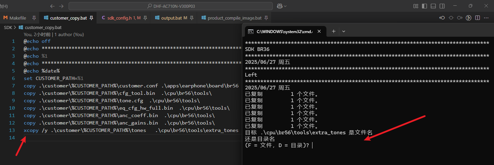

**潜在问题：** 这个脚本假设目标目录都已经存在，如果不存在，copy 命令会失败。更安全的做法是：

```bat
if not exist ".\apps\earphone\board\br36" mkdir ".\apps\earphone\board\br36"
copy .\customer\%CUSTOMER_PATH%\customer.conf .\apps\earphone\board\br36
```

所以这个脚本的作用就是根据客户参数，将特定客户的配置文件部署到编译环境中。

# 被调用脚本`\apps\earphone\board\br36\output.bat`

```bat
@echo off
@echo ********************************************************************************
@echo %1 output
@echo ********************************************************************************
@echo %date%
cd ./
if exist apps\earphone\board\br36\customer.h del apps\earphone\board\br36\customer.h
echo #define  _%1 1>>apps\earphone\board\br36\customer.h
for /f "eol=# tokens=1,2 delims==" %%a in (apps\earphone\board\br36\customer.conf) do (
echo #define %%a %%b>>apps\earphone\board\br36\customer.h
)
```

- 删除旧配置`customer.h`里面全是宏定义
  - 控制代码的启用
  - 如果已存在 `customer.h` 文件，就删除它（重新生成）

- 这个脚本的作用是**根据客户参数和配置文件生成C语言头文件**，用于条件编译。

**生成客户特定的宏定义：**

```bat
echo #define  _%1 1>>apps\earphone\board\br36\customer.h
```

- **`>>` 的行为：**
  - 如果文件**存在**：追加内容到文件末尾
  - 如果文件**不存在**：**自动创建**新文件并写入内容
- 如果用单个 `>`：
  - 这样也可以，但后续的 for 循环中，必须用 `>>` 来追加，否则会覆盖之前的内容。

在头文件中写入客户标识宏，比如调用 `script.bat JOYROOM_Funpods_FN3_NOAPP_Left ` 就会生成：

```bat
#define _JOYROOM_Funpods_FN3_NOAPP_Left 1
```

**解析配置文件并生成宏定义：**

```bat
for /f "eol=# tokens=1,2 delims==" %%a in (apps\earphone\board\br36\customer.conf) do (
    echo #define %%a %%b>>apps\earphone\board\br36\customer.h
)
```

- 这里的`customer.conf`是根目录下的`customer_copy.bat`脚本从customer目录中复制过来的。
  - 以文件夹分左右分客户的方式

**详细解释 for 循环：**

- `eol=#`：忽略以 `#` 开头的行（注释行）
- `tokens=1,2`：提取每行的前两个字段
- `delims==`：以 `=` 作为分隔符
  - `=`分隔一个字段
- 读取 `customer.conf` 文件的每一行

```bat
#  _KEY_TONE_EN
#  // 按键提示音。建议音频输出使用固定采样率
#   0：  
#   1：   
#---------------------------------------------
_KEY_TONE_EN=0
###------------------------------------------

#  _AUDIO_CVP_NS_MODE
#  通话降噪模式配置
#   0： CVP_ANS_MODE 
#   1： CVP_DNS_MODE
#---------------------------------------------
_AUDIO_CVP_NS_MODE=0
###------------------------------------------
```

**实际替换操作**

**echo #define %%a %%b>>apps\earphone\board\br36\customer.h 宏定义这种追加方式？是一行一行追加吗？换行吗？%算占位符吗？美观一点？**

关于 `%%a` 和 `%%b`：

**在批处理 for 循环中：**

- `%%a` 和 `%%b` 是**循环变量**，不是占位符
- 每次循环时，`%%a` 和 `%%b` 会被实际的值替换

**追加方式和换行：**

**`echo` 命令的特点：**

- `echo` 默认会在输出后**自动换行**
- 所以每次执行都会在新的一行写入内容

## echo的输入位置

`echo` 命令的输出方向：

**1. 普通 echo（输出到命令窗口）：**

```bat
echo Hello World
```

这会在命令窗口显示：`Hello World`

**2.echo 配合重定向符（输出到文件）：**

```bat
echo #define %%a %%b>>apps\earphone\board\br36\customer.h
```

**重定向符的作用：**

- `>>` 是**重定向符**，改变了输出方向
- **没有重定向符**：输出到命令窗口
- **有重定向符**：输出到指定文件

**具体到这行代码：**

```bat
echo #define %%a %%b>>apps\earphone\board\br36\customer.h
```

**执行结果：**

- `#define %%a %%b` 的内容**不会显示**在命令窗口
- 而是**直接写入**到 `customer.h` 文件中
- 命令窗口不会有任何显示

## echo的换行效果

**echo自带换行效果？这个特性体现在没有重定向还是有重定向？**

`echo` 的**自带换行效果**在**两种情况下都存在**！

输出到命令窗口（无重定向）：

```bat
echo Line1
echo Line2
echo Line3
```

命令窗口显示：

```bat
Line1
Line2  
Line3
```

每个 `echo` 输出后自动换行。

**输出到文件（有重定向）：**

```bat
echo Line1 > test.txt
echo Line2 >> test.txt  
echo Line3 >> test.txt
```

`test.txt` 文件内容：

```bat
同样，每个 echo 写入文件时也自动换行。
```

在你分析的脚本中：

```bat
echo #define  _%1 1>>apps\earphone\board\br36\customer.h
for /f ... do (
    echo #define %%a %%b>>apps\earphone\board\br36\customer.h
)
```

生成的 customer.h 文件：

```bat
#define _ABC_Company 1
#define _KEY_TONE_EN 0
#define _AUDIO_CVP_NS_MODE 0
```

每一行都是独立的，这就是 `echo` 自带换行的效果。

# 构建与编译

**这个是直接调用当前脚本目录下的makefile文件进行构建和编译？是Makefile没后缀名的文件还是Makefile.bak文件？**

## Make 文件查找顺序：

`make` 命令会按照**固定顺序**在当前目录查找构建文件：

1. **`GNUmakefile`** （GNU Make 特有）
2. **`makefile`** （小写，无扩展名）
3. **`Makefile`** （首字母大写，无扩展名）

**`Makefile.bak` 不会被自动识别！**

- `.bak` 通常是**备份文件**
- `make` 不会自动查找带后缀的文件
- 除非明确指定：`make -f Makefile.bak`

在这个脚本中：

```bat
make clean && make all -j 16
```

**会查找的文件（按优先级）：**

1. `GNUmakefile`
2. `makefile`
3. `Makefile`

**找到第一个就使用，其他忽略。**

**嵌入式项目常见情况：**

大多数嵌入式项目使用：

- **`Makefile`**（首字母大写）- 最常见
- 有时会有多个 Makefile 在不同目录

# vscode的运行生成任务流程

**需要的文件：**

1. `.vscode/tasks.json` - 这是核心配置文件，定义了所有任务
2. `winmk.bat` - 你的批处理脚本文件

**分析流程概述：**

当你在VSCode中选择"终端 → 运行生成任务"时，流程是这样的：

1. 任务发现阶段
   - VSCode读取`.vscode/tasks.json`文件
   - 解析其中定义的所有任务配置
2. 任务选择阶段
   - 如果有多个任务，VSCode会显示任务选择器
   - 用户选择要执行的具体任务
3. 任务执行阶段
   - 根据任务配置创建终端会话
   - 执行指定的命令（可能调用你的`winmk.bat`）
   - 显示输出结果

## tasks.json 结构解析

**全局配置**

- `version: "2.0.0"` - 使用VSCode tasks的2.0版本格式

**任务定义**

"all" 任务（默认构建任务）

```json
{
    "label": "all",                    // 任务显示名称
    "type": "shell",                   // 执行类型为shell命令
    "windows": {
        "command": ".vscode/winmk.bat all"  // Windows平台专用命令
    },
    "command": "make all -j`nproc`",   // 非Windows平台命令
    "problemMatcher": [],              // 错误匹配器（空数组表示不解析错误）
    "group": {
        "kind": "build",               // 归类为构建任务
        "isDefault": true              // 设为默认构建任务
    }
}
```

"clean" 任务

```json
{
    "label": "clean",
    "type": "shell", 
    "windows": {
        "command": ".vscode/winmk.bat clean"
    },
    "command": "make clean -j`nproc`",
    "group": "build"                   // 构建任务，但不是默认
}
```

## 执行流程分析

在Windows环境下的完整流程：

**1. 触发阶段**

- 用户选择：`Ctrl+Shift+P` → "Tasks: Run Build Task" 或 "终端 → 运行生成任务"
- 由于"all"任务设置了`"isDefault": true`，会直接执行

**2. 命令解析阶段**

- VSCode检测到Windows平台
- 选择`windows.command`：`.vscode/winmk.bat all`
- 忽略通用的`command`字段

**3.winmk.bat 执行流程**

```bat
SET SCRIPT_PATH=%~dp0%                    # 获取批处理文件所在目录
SET PATH=%SCRIPT_PATH%\..\tools\utils;%PATH%  # 添加工具路径到环境变量
make "%1" -j %NUMBER_OF_PROCESSORS%       # 执行make命令，%1是传入的参数
```

实际执行的命令链：

```bat
.vscode/winmk.bat all
  ↓
SET PATH=.vscode/../tools/utils;%PATH%
  ↓
make "all" -j %NUMBER_OF_PROCESSORS%
```

## 关键特性分析

**1. 跨平台兼容性**

- Windows: 使用`winmk.bat`脚本
- Linux/macOS: 直接使用`make`命令与`nproc`

**2. 并行编译优化**

- Windows: `-j %NUMBER_OF_PROCESSORS%` (使用系统处理器数量)
- Linux/macOS: `-j`nproc`` (使用`nproc`命令获取核心数)

**3. 工具路径管理**

- `winmk.bat`自动添加`../tools/utils`到PATH
- 确保make等工具可以被找到

## 实际构建流程

**这就调用了脚本目录下的makefile进行整个工程的构建与编译？ 但是makefile跟.vscode在一个目录啊？脚本在.vscode/winmk.bat？**

```bat
项目根目录/
├── .vscode/
│   ├── tasks.json
│   └── winmk.bat
├── Makefile          # 与.vscode同级
├── tools/
│   └── utils/        # 工具目录
└── 其他源码文件...
```

当VSCode执行 `.vscode/winmk.bat all` 时：

1. **VSCode的工作目录**：项目根目录（workspace root）
2. **脚本位置**：`.vscode/winmk.bat`
3. **Makefile位置**：项目根目录

实际执行流程

```bat
# winmk.bat 内容分析
SET SCRIPT_PATH=%~dp0%                    # 获取脚本所在目录 = 项目根目录/.vscode/
SET PATH=%SCRIPT_PATH%\..\tools\utils;%PATH%  # 添加 项目根目录/tools/utils 到PATH
make "%1" -j %NUMBER_OF_PROCESSORS%       # 在当前工作目录执行make
```

**关键点：**

- `%~dp0%` = `.vscode/` 目录的完整路径
- `%SCRIPT_PATH%\..` = 项目根目录
- `%SCRIPT_PATH%\..\tools\utils` = 项目根目录下的tools/utils
- `make` 命令在VSCode的工作目录（项目根目录）执行

**这是vscode的特性吧？一般情况下执行make需要保持当前目录下有makefile才能构建编译吧？**

### Make的一般工作机制

**标准情况下：**

```bat
cd /path/to/project    # 必须先进入Makefile所在目录
make all               # 在当前目录查找Makefile
```

如果你在其他目录执行make，会报错：

```bat
cd /home/user
make all               # 错误：No targets specified and no makefile found
```

VSCode的tasks有一个重要特性：**工作目录继承**

当VSCode执行任务时：

1. **默认工作目录**：始终是workspace根目录
2. **即使脚本在子目录**：工作目录仍然保持在根目录
3. **这是VSCode的设计特性**：为了方便项目级别的构建任务

# 与原来的区别

## 相同点

 **核心构建逻辑**

- 都是调用make命令进行编译
- 都设置了PATH环境变量指向tools\utils
- 都支持并行编译（-j参数）

**工作目录处理**

- 都在项目根目录执行make
- 你的脚本：`cd ./` 确保在当前目录
- VSCode：默认workspace根目录

## 主要差异

**功能丰富度**

你的脚本更强大：

```bat
# 客户定制化配置
set CUSTOMER_PATH=JOYROOM_Funpods_FN3_NOAPP_Left
echo CUSTOMER_PATH=%CUSTOMER_PATH%>customer_path.conf
echo CFLAGS_EX+=-D_%CUSTOMER_PATH%>>customer_path.conf

# 芯片密钥配置
set CUSTOMER_CHIPKEY=product
echo CUSTOMER_CHIPKEY=%CUSTOMER_CHIPKEY%>>customer_path.conf

# 调用其他脚本
call ".\customer_copy.bat"  %CUSTOMER_PATH%
call ".\apps\earphone\board\br36\output.bat"  %CUSTOMER_PATH%
```

**VSCode tasks简单：**

- 只是make命令的简单包装

**参数处理逻辑**

你的脚本：

```bat
if "%para%" neq "all" (
if "%para%" neq "clean" (
    start cmd.exe /k "make clean&&make all -j 16"  # 默认行为：先clean再build
 )
 )
```

**VSCode tasks：**

- 直接传递参数给make
- all任务和clean任务分离

## 用户体验

**你的脚本：**

- 显示SDK信息和日期
- 新开命令行窗口显示编译过程
- 可以独立运行，不依赖IDE

**VSCode tasks：**

- 集成在IDE中，输出在终端面板
- 依赖VSCode环境

## 环境配置

**你的脚本：**

- 创建动态配置文件（customer_path.conf）
- 硬编码客户路径和密钥配置
- 调用客户特定的脚本

**VSCode tasks：**

- 纯粹的构建命令包装

## 设计思路对比

你的脚本 = **完整的构建系统**

- 项目配置管理
- 客户定制化
- 构建流程编排
- 独立可执行

### VSCode tasks = **IDE集成的构建快捷方式**

- 简化的make命令包装
- IDE集成体验
- 跨平台兼容

## 建议

你可以结合两者优势：

```bat
{
    "label": "SDK Build",
    "type": "shell",
    "windows": {
        "command": "./your_build_script.bat"
    },
    "group": {
        "kind": "build",
        "isDefault": true
    }
}
```

这样既保持了你完整的构建逻辑，又获得了VSCode的集成体验！

你的脚本显然是一个更完整、更专业的构建系统，而VSCode tasks更像是一个便捷的IDE集成工具。

# `AC710N-V300P03-7106`移植

可视化的，所有配置会自动更新在`SDK\apps\earphone\board\br56\sdk_config.h`，而新架构配置在`SDK\customer\Left\customer.conf`中，而且两者形式不一样。

- 那就是可视化的宏文件就是用可视化工具修改保存但是不用可视化编译。`customer.h`还是添加我们自己的宏，两个一起用。

- 每个客户的自己可视化的宏单独保存利用就和提示音一样。

## 如何利用`sdk_config.h`中的宏

Makefile中定义的头文件搜索路径是：

```makefile
export INCLUDES := \
	@build/include_dir.txt \
	-I$(SYS_INC_DIR)
```

在`build/include_dir.txt`文件中，我找到了以下关键的包含路径：

```makefile
-Iapps/earphone/board/br56
```

这个路径正好对应你询问的`SDK\apps\earphone\board\br56\sdk_config.h`文件所在的目录。

1.**直接路径匹配**:

- 你询问的文件路径：`SDK\apps\earphone\board\br56\sdk_config.h`
- include目录中的路径：`-Iapps/earphone/board/br56`
- 两者完全匹配（SDK是根目录）

2.**相关的其他路径**:

```makefile
-Iapps/earphone
-Iapps/earphone/include
-Iapps/earphone/ui
```

这些都是earphone应用相关的头文件搜索路径。

3.**编译流程确认**:

- Makefile中的`$(INCLUDES)`会包含所有这些`-I`路径
- 编译器在预处理阶段会搜索这些目录
- 任何源代码中的`#include "sdk_config.h"`都会在`apps/earphone/board/br56`目录中找到该文件

**那么只要在使用`sdk_config.h`中宏的地方添加对应的头文件即可。**


**那么`customer.h`中的宏要想被使用，也必须添加头文件。路径已经被包含了makefile不用更改**

## 移植

直接把`SDK\product_compile_image.bat`以及`SDK\customer_copy.bat`和`SDK\apps\earphone\board\br56\output.bat`路径修改一下即可。

在每个使用`customer.h`宏的地方添加头文件包含一下即可。


## 编译后的输出目录

看了这个Makefile，编译后的输出目录确实是由**Makefile决定的**

在这个Makefile中，有几个关键的目录设置：

**主要输出文件路径**：

```makefile
export OUT_ELF   := cpu/br56/tools/sdk.elf
export OBJ_FILE  := $(OUT_ELF).objs.txt
```

最终的ELF可执行文件输出到 `cpu/br56/tools/` 目录下

**编译中间文件目录**：

```makefile
export BUILD_DIR := objs
```

所有的 `.o` 目标文件和编译中间文件都放在 `objs/` 目录下。

### 目录结构分析

根据这个配置，编译后的文件分布是：

- **中间文件**：`objs/` 目录（存放 `.o` 文件等）
- **最终输出**：`cpu/br56/tools/sdk.elf`（可执行文件）
- **对象文件清单**：`cpu/br56/tools/sdk.elf.objs.txt`

### 清理规则验证

从clean规则也能看出目录结构：

```makefile
clean:
	$(QUITE) $(RM) $(OUT_ELF)          # 删除最终输出文件
	$(QUITE) $(RM) $(BUILD_DIR)        # 删除整个编译目录
```

### 结论

这个Makefile通过以下方式控制输出目录：

- `BUILD_DIR` 变量控制编译中间文件的存放位置
- `OUT_ELF` 变量控制最终可执行文件的输出路径
- 这些变量被export到子Makefile（`build/Makefile.mk`）中使用

所以答案很明确：**输出目录完全由这个Makefile决定**，通过预定义的路径变量来控制文件的输出位置。

## `build/Makefile.mk`

**makefile中的这个输出目录指的是什么？编译后的二进制文件？ build/Makefile.mk这个文件是干嘛的？ 但是我编译工程后的烧录文件生成DHF-AC710N-V300P03\SDK\cpu\br56\tools\download\earphone还有DHF-AC710N-V300P03\output 这是build/Makefile.mk文件的作用吗？**

### Makefile中的输出目录含义

从你提供的Makefile看，这里的"输出目录"指的是：

1. 编译中间文件目录：
   - `BUILD_DIR := objs` - 存放 `.o` 目标文件、依赖文件等编译过程中的中间文件
2. 链接输出文件：
   - `OUT_ELF := cpu/br56/tools/sdk.elf` - 这是**链接器生成的ELF格式可执行文件（二进制文件）**

### build/Makefile.mk的作用

`build/Makefile.mk` 是**实际的编译规则文件**，主Makefile通过以下方式调用它：

```makefile
all: pre_build 
	make -f build/Makefile.mk  # 使用-f指定具体的makefile文件
```

它的作用是：

- 包含具体的编译规则（如何编译.c文件生成.o文件）
- 包含链接规则（如何将.o文件链接成最终的ELF文件）
- 处理依赖关系管理

### 烧录文件的生成

你看到的这些目录：

- `DHF-AC710N-V300P03\SDK\cpu\br56\tools\download\earphone`
- `DHF-AC710N-V300P03\output`

这些**不是直接由Makefile编译规则产生的**，而是由**后处理脚本**生成的：

```makefile
# 后处理脚本设置
export POST_SCRIPT     := cpu/br56/tools/download.bat  # Windows
export POST_SCRIPT     := cpu/br56/tools/download.sh   # Linux
export RUN_POST_SCRIPT := bash $(POST_SCRIPT)
```

### 完整的构建流程

1. 编译阶段：`build/Makefile.mk`负责
   - 编译源码 → 生成 `.o` 文件到 `objs/` 目录
   - 链接 → 生成 `cpu/br56/tools/sdk.elf`
2. 后处理阶段：`download.bat/sh`脚本负责
   - 将ELF文件转换为烧录格式（如bin、hex等）
   - 生成烧录工具需要的文件结构
   - 输出到 `download/earphone` 和 `output` 目录

所以你看到的烧录文件目录是由**后处理脚本**而不是`build/Makefile.mk`直接创建的。`build/Makefile.mk`只负责编译和链接生成ELF文件。

# 修改烧录文件生成位置

`cpu/br56/tools/download.bat`下的

```makefile
@echo off
Setlocal enabledelayedexpansion
@echo ********************************************************************************
@echo SDK BR56
@echo ********************************************************************************
@echo %date%

cd /d %~dp0

set OBJDUMP=C:\JL\pi32\bin\llvm-objdump.exe
set OBJCOPY=C:\JL\pi32\bin\llvm-objcopy.exe
set ELFFILE=sdk.elf

set compress_tool=.\lz4_packet.exe

REM %OBJDUMP% -D -address-mask=0x1ffffff -print-dbg $1.elf > $1.lst
%OBJCOPY% -O binary -j .text %ELFFILE% text.bin
%OBJCOPY% -O binary -j .data %ELFFILE% data.bin
%OBJCOPY% -O binary -j .data_code %ELFFILE% data_code.bin
%OBJCOPY% -O binary -j .data_code_z %ELFFILE% data_code_z.bin
%OBJCOPY% -O binary -j .overlay_init %ELFFILE% init.bin
%OBJCOPY% -O binary -j .overlay_aec %ELFFILE% aec.bin
%OBJCOPY% -O binary -j .overlay_aac %ELFFILE% aac.bin

for /L %%i in (0,1,20) do (
            %OBJCOPY% -O binary -j .overlay_bank%%i %ELFFILE% bank%%i.bin
                set bankfiles=!bankfiles! bank%%i.bin 0xbbaa
        )

%compress_tool% -dict text.bin -input data_code_z.bin 0 init.bin 0 aec.bin 0 aac.bin 0 !bankfiles! -o compress.bin

%OBJDUMP% -section-headers -address-mask=0x1ffffff %ELFFILE%
REM %OBJDUMP% -t %ELFFILE% > symbol_tbl.txt

copy /b text.bin + data.bin + data_code.bin + compress.bin app.bin

del !bankfiles! data_code_z.bin text.bin data.bin compress.bin

set TONE_EN_ENABLE=1

set TONE_ZH_ENABLE=0
del download\earphone\ALIGN_DIR\anc_ext.bin

call download/earphone/download.bat

```

## 当前的输出流程

1.ELF处理阶段（在当前目录 `cpu/br56/tools/`）：

- 从 `sdk.elf` 提取各个段生成 `.bin` 文件
- 压缩处理生成 `compress.bin`
- 合并生成最终的 `app.bin`

2.**烧录文件生成阶段**：

```bat
call download/earphone/download.bat
```

这行调用了 `download/earphone/download.bat`，这个脚本负责：

- 生成最终的烧录文件
- 决定烧录文件的输出位置

## 不同路径下的download.bat

`cpu\br56\tools\download\earphone\download.bat`下的

```makefile
@echo off

cd %~dp0

copy ..\..\anc_coeff.bin .
copy ..\..\anc_gains.bin .
copy ..\..\br56loader.bin .
copy ..\..\ota.bin .

if not %KEY_FILE_PATH%A==A set KEY_FILE=-key %KEY_FILE_PATH%

if %PROJ_DOWNLOAD_PATH%A==A set PROJ_DOWNLOAD_PATH=..\..\..\..\..\..\output
copy %PROJ_DOWNLOAD_PATH%\*.bin .	
if exist %PROJ_DOWNLOAD_PATH%\tone_en.cfg copy %PROJ_DOWNLOAD_PATH%\tone_en.cfg .	
if exist %PROJ_DOWNLOAD_PATH%\tone_zh.cfg copy %PROJ_DOWNLOAD_PATH%\tone_zh.cfg .
if exist sdk_config.h del sdk_config.h
if exist sdk_config.c del sdk_config.c

if %TONE_EN_ENABLE%A==1A (
    if not exist tone_en.cfg copy ..\..\tone.cfg tone_en.cfg
    set TONE_FILES=tone_en.cfg
)
if %TONE_ZH_ENABLE%A==1A (
    set TONE_FILES=%TONE_FILES% tone_zh.cfg
)

if %FORMAT_VM_ENABLE%A==1A set FORMAT=-format vm
if %FORMAT_ALL_ENABLE%A==1A set FORMAT=-format all

if not %RCSP_EN%A==A (
   ..\..\json_to_res.exe ..\..\json.txt
    set CONFIG_DATA=config.dat
)


@echo on
..\..\isd_download.exe ..\..\isd_config.ini -tonorflash -dev br56 -boot 0x100000 -div8 -wait 300 -uboot ..\..\uboot.boot -app ..\..\app.bin  -tone %TONE_FILES% -res cfg_tool.bin ..\..\p11_code.bin stream.bin %CONFIG_DATA% %KEY_FILE% %FORMAT% -key 141-AMW-AC690X-41C3.key  -format all
@echo off
:: -format all
::-reboot 2500

@rem ɾ    ʱ ļ -format all
if exist *.mp3 del *.mp3 
if exist *.PIX del *.PIX
if exist *.TAB del *.TAB
if exist *.res del *.res
if exist *.sty del *.sty

@rem    ɹ̼      ļ 
..\..\fw_add.exe -noenc -fw jl_isd.fw -add ..\..\ota.bin -type 100 -out jl_isd.fw
@rem       ýű  İ汾  Ϣ   FW  ļ   
..\..\fw_add.exe -noenc -fw jl_isd.fw -add ..\..\script.ver -out jl_isd.fw

..\..\ufw_maker.exe -fw_to_ufw jl_isd.fw
copy jl_isd.ufw update.ufw
del jl_isd.ufw

copy update.ufw %PROJ_DOWNLOAD_PATH%\update.ufw
copy jl_isd.bin %PROJ_DOWNLOAD_PATH%\jl_isd.bin
copy jl_isd.fw %PROJ_DOWNLOAD_PATH%\jl_isd.fw


@rem         ˵  
@rem -format vm        //    VM     
@rem -format cfg       //    BT CFG     
@rem -format 0x3f0-2   //  ʾ ӵ  0x3f0    sector   ʼ         2    sector(  һ      Ϊ16   ƻ 10   ƶ  ɣ  ڶ             10    )

ping /n 2 127.1>null
IF EXIST null del null

```

### 分析一下两个不同路径下download.bat的区别

通过分析这个 `download/earphone/download.bat` 脚本，我可以看出它的主要功能和输出路径控制：

**文件收集阶段**

```bat
copy ..\..\anc_coeff.bin .
copy ..\..\anc_gains.bin .
copy ..\..\br56loader.bin .
copy ..\..\ota.bin .
```

从上级目录复制必要的二进制文件到当前目录

- **所以修改ANC参数时，为什么修改的是上级目录的，因为这里的会被覆盖。**

**项目文件复制**

```bat
if %PROJ_DOWNLOAD_PATH%A==A set PROJ_DOWNLOAD_PATH=..\..\..\..\..\..\output
copy %PROJ_DOWNLOAD_PATH%\*.bin .
```

**关键部分**：如果没有设置 `PROJ_DOWNLOAD_PATH` 环境变量，默认设置为 `output` 目录

**固件生成**

```bat
..\..\isd_download.exe ..\..\isd_config.ini -tonorflash -dev br56 -boot 0x100000 -div8 -wait 300 -uboot ..\..\uboot.boot -app ..\..\app.bin ...
```

使用 `isd_download.exe` 工具生成固件文件

**最终输出**

```bat
copy update.ufw %PROJ_DOWNLOAD_PATH%\update.ufw
copy jl_isd.bin %PROJ_DOWNLOAD_PATH%\jl_isd.bin
copy jl_isd.fw %PROJ_DOWNLOAD_PATH%\jl_isd.fw
```

**输出控制**：将生成的烧录文件复制到 `PROJ_DOWNLOAD_PATH` 指定的目录

### 两个脚本的区别

上级目录的 `download.bat`：

- 负责**ELF文件处理**和**二进制文件生成**
- 生成 `app.bin` 等中间文件
- 调用下级脚本进行最终处理

`download/earphone/download.bat`：

- 负责**固件封装**和**烧录文件生成**
- 决定**最终输出路径**
- 生成 `.fw`、`.bin`、`.ufw` 等烧录文件

## 修改输出路径的方法

**方法1：设置环境变量（推荐）**

在主 `download.bat` 中添加：

```bat
set PROJ_DOWNLOAD_PATH=你想要的输出路径
call download/earphone/download.bat
```

**方法2：修改默认路径**

在 `download/earphone/download.bat` 中修改：

```bat
REM 原来的默认路径
if %PROJ_DOWNLOAD_PATH%A==A set PROJ_DOWNLOAD_PATH=..\..\..\..\..\..\output

REM 修改为你想要的路径
if %PROJ_DOWNLOAD_PATH%A==A set PROJ_DOWNLOAD_PATH=你的自定义路径
```

**方法3：添加额外复制**

在 `download/earphone/download.bat` 最后添加：

```bat
copy update.ufw 你的目标路径\
copy jl_isd.bin 你的目标路径\
copy jl_isd.fw 你的目标路径\
```

**推荐使用方法1**，因为它不会破坏原有的脚本结构，只是通过环境变量来控制输出路径。

## 两个固件文件生成路径

**位置1：`DHF-AC710N-V300P03\SDK\cpu\br56\tools\download\earphone`**

**作用**：**临时工作目录/中间处理目录**

- 这是 `download/earphone/download.bat` 脚本的**工作目录**
- 脚本在这里进行固件的**生成和处理**：

```bat
cd %~dp0  # 切换到 download/earphone 目录
copy ..\..\anc_coeff.bin .  # 复制文件到当前目录
..\..\isd_download.exe ...  # 在当前目录生成固件
```

- 生成的文件包括：`jl_isd.fw`、`jl_isd.bin`、`update.ufw` 等

**位置2：`DHF-AC710N-V300P03\output`**

**作用**：**最终输出目录**

这是通过 `PROJ_DOWNLOAD_PATH` 变量控制的**最终发布目录**：

```bat
if %PROJ_DOWNLOAD_PATH%A==A set PROJ_DOWNLOAD_PATH=..\..\..\..\..\..\output
copy update.ufw %PROJ_DOWNLOAD_PATH%\update.ufw
copy jl_isd.bin %PROJ_DOWNLOAD_PATH%\jl_isd.bin
copy jl_isd.fw %PROJ_DOWNLOAD_PATH%\jl_isd.fw
```

**文件流向过程**

```bat
1. 编译阶段
   ↓
2. cpu/br56/tools/download.bat (上级脚本)
   - 生成 app.bin 等中间文件
   ↓
3. cpu/br56/tools/download/earphone/ (工作目录)
   - 收集所有需要的文件
   - 使用 isd_download.exe 生成固件
   - 生成 jl_isd.fw, jl_isd.bin, update.ufw
   ↓
4. output/ (最终输出目录)
   - 复制最终的烧录文件
```

### 为什么有两个位置？

1. 分离关注点：
   - `download/earphone/` 目录专门用于固件生成过程
   - `output/` 目录是干净的最终输出，方便用户获取
2. 便于管理：
   - 工作目录包含很多临时文件和工具
   - 输出目录只包含最终需要的烧录文件
3. 支持多配置：
   - 可能有多个不同的产品配置（earphone、speaker等）
   - 但最终都输出到统一的 `output` 目录

### 实际使用建议

- **开发调试时**：可以从 `download/earphone/` 目录获取文件，因为这里有完整的生成日志
- **发布烧录时**：使用 `output/` 目录的文件，这里是最终的干净版本
- **修改输出路径**：只需要修改 `PROJ_DOWNLOAD_PATH` 变量即可

所以这两个位置是**正常的设计**，一个是工作目录，一个是最终输出目录。

# 批处理脚本中set的作用

`set` 命令不仅仅用于设置 PATH 路径，它是批处理中用来**设置各种环境变量**的通用命令。

**设置普通变量**

```bat
set VARIABLE_NAME=value
```

设置路径变量

```bat
set PATH=C:\Program Files\Tool;%PATH%
set MY_DIR=C:\MyFolder
```

设置其他类型的变量

```bat
set VERSION=1.0.2
set DEBUG_MODE=1
set CONFIG_FILE=config.ini
set ENABLE_FEATURE=true
```

## 让我们看看你脚本中的各种 `set` 用法

路径相关的 set

```bat
set OBJDUMP=C:\JL\pi32\bin\llvm-objdump.exe          # 工具路径
set OBJCOPY=C:\JL\pi32\bin\llvm-objcopy.exe          # 工具路径
set PROJ_DOWNLOAD_PATH=..\..\..\..\..\..\output      # 输出目录路径
```

配置选项的 set

```bat
set TONE_EN_ENABLE=1                                 # 功能开关
set TONE_ZH_ENABLE=0                                 # 功能开关
set FORMAT=-format vm                                # 命令参数
set FORMAT_ALL_ENABLE=1A                            # 启用标志
```

文件名相关的 set

```bat
set ELFFILE=sdk.elf                                  # 文件名
set TONE_FILES=tone_en.cfg                          # 文件列表
set CONFIG_DATA=config.dat                          # 配置文件名
```

命令参数的 set

```bat
set KEY_FILE=-key %KEY_FILE_PATH%                    # 命令行参数
set bankfiles=!bankfiles! bank%%i.bin 0xbbaa        # 动态构建参数列表
```

## 总结

`set` 命令是批处理中的**通用变量设置命令**，可以设置：

- 文件路径和目录路径
- 程序配置选项
- 命令行参数
- 文件名和扩展名
- 开关标志和状态值
- 任何需要在脚本中重复使用的字符串值

它不仅仅限于 PATH 环境变量，而是可以创建和修改任何环境变量或临时变量。

## set的时效性和作用域

**比如设置的环境变量path的路径？批处理脚本结束后就释放乐？ 嵌套的脚本中，顶级脚本set的变量，其他子级脚本也可以使用？**

### 时效性

临时性（默认行为）

```bat
set MY_VAR=hello
echo %MY_VAR%  # 输出：hello
```

**批处理脚本结束后，这些变量就会消失**，不会影响系统环境。

永久性（使用 setx）

```bat
setx MY_VAR hello        # 设置用户环境变量（永久）
setx MY_VAR hello /M     # 设置系统环境变量（永久，需要管理员权限）
```

这些变量会写入注册表，重启后仍然存在。

### 作用域

**进程级作用域**

- `set` 设置的变量在**当前进程及其子进程**中有效
- 父进程的变量会**继承**给子进程
- 子进程对变量的修改**不会影响**父进程

**嵌套脚本的变量传递**

**父脚本 → 子脚本**（变量继承）：

```bat
REM parent.bat
set PARENT_VAR=from_parent
set PROJ_DOWNLOAD_PATH=C:\output
call child.bat
```

```bat
REM child.bat
echo %PARENT_VAR%           # 可以访问：from_parent
echo %PROJ_DOWNLOAD_PATH%   # 可以访问：C:\output
set CHILD_VAR=from_child
```

**子脚本 → 父脚本**（变量不会传回）：

```bat
REM parent.bat
call child.bat
echo %CHILD_VAR%    # 无法访问，变量不存在
```

### 实际例子分析

在你的脚本中：

主 Makefile 设置的变量

```bat
export PROJ_DOWNLOAD_PATH := ..\..\..\..\..\..\output
export TONE_EN_ENABLE := 1
```

这些通过 `export` 设置的变量会传递给子进程。

主 download.bat 设置

```bat
set TONE_EN_ENABLE=1
set TONE_ZH_ENABLE=0
call download/earphone/download.bat
```

子脚本 download/earphone/download.bat 中

```bat
if %TONE_EN_ENABLE%A==1A (
    # 可以访问父脚本设置的 TONE_EN_ENABLE
)
if %PROJ_DOWNLOAD_PATH%A==A set PROJ_DOWNLOAD_PATH=..\..\..\..\..\..\output
```

### 总结

1. 时效性：
   - `set` 设置的变量是**临时的**，脚本结束后消失
   - `setx` 设置的变量是**永久的**
2. 作用域：
   - 父脚本的变量**可以**被子脚本访问
   - 子脚本的变量**不能**传回父脚本
   - 变量在当前进程及其子进程中有效
3. 实践建议：
   - **需要在多个脚本间共享的变量在顶级脚本中设置**
   - 临时变量在需要的脚本中局部设置
   - 避免在子脚本中修改重要的全局变量

# 移植后的一些问题

可视化版本SDK，如果顶级目录下没有output文件夹的话，脚本就会找不到路径从而烧录固件赋值不出来。

- 保持不动源码的原则，可以在顶级目录下手动创建一个output即可。
- 或者修改`SDK\cpu\br56\tools\download\earphone\download.bat`的脚本文件。

# 移植生成固件文件的位置和文件夹命名形式

[主要修改原理参考](#修改烧录文件生成位置)

只需要修改`download/earphone/download.bat`下的`download.bat`的脚本文件。

`cpu/br56/tools/download.bat`的 `download.bat`：

- 负责**ELF文件处理**和**二进制文件生成**
- 生成 `app.bin` 等中间文件
- 调用下级脚本进行最终处理

`download/earphone/download.bat`：

- 负责**固件封装**和**烧录文件生成**
- 决定**最终输出路径**
- 生成 `.fw`、`.bin`、`.ufw` 等烧录文件

## FN3修改了什么？

### 原来的最终固件脚本

```bat
@echo off

cd %~dp0

copy ..\..\script.ver .
copy ..\..\tone.cfg .
copy ..\..\p11_code.bin .
copy ..\..\anc_coeff.bin .
copy ..\..\anc_gains.bin .
copy ..\..\br36loader.bin .
copy ..\..\ota.bin .

..\..\isd_download.exe ..\..\isd_config.ini -tonorflash -dev br36 -boot 0x20000 -div8 -wait 300 -uboot ..\..\uboot.boot -app ..\..\app.bin -res ..\..\cfg_tool.bin tone.cfg p11_code.bin ..\..\eq_cfg_hw.bin -uboot_compress  -key  141-AMW-AC690X-41C3.key  -format all
:: -format all
::-reboot 2500

@rem 删除临时文件-format all
if exist *.mp3 del *.mp3 
if exist *.PIX del *.PIX
if exist *.TAB del *.TAB
if exist *.res del *.res
if exist *.sty del *.sty

..\..\ufw_maker.exe -fw_to_ufw jl_isd.fw
copy jl_isd.ufw update.ufw
del jl_isd.ufw

@REM 生成配置文件升级文件
::ufw_maker.exe -chip AC800X %ADD_KEY% -output config.ufw -res bt_cfg.cfg

::IF EXIST jl_696x.bin del jl_696x.bin 

@rem 常用命令说明
@rem -format vm        //擦除VM 区域
@rem -format cfg       //擦除BT CFG 区域
@rem -format 0x3f0-2   //表示从第 0x3f0 个 sector 开始连续擦除 2 个 sector(第一个参数为16进制或10进制都可，第二个参数必须是10进制)

ping /n 2 127.1>null
IF EXIST null del null

```

#### 修改后的最终脚本

```bat
@echo off
@echo ********************************************************************************
@echo 			SDK BR36 %1 %2 %3 %4 %5 %6
@echo ********************************************************************************
@echo %date%
cd %~dp0

REM 复制必要的配置和二进制文件到当前目录
copy ..\..\script.ver .
copy ..\..\tone.cfg .
copy ..\..\p11_code.bin .
copy ..\..\anc_coeff.bin .
copy ..\..\anc_gains.bin .
copy ..\..\br36loader.bin .
copy ..\..\ota.bin .

REM 获取当前日期信息，用于生成版本化目录名
for /f "tokens=1,2,3* delims=// " %%i in ('date /t') do set yyyy=%%i&set mm=%%j&set dd=%%k

REM 显示第2个参数（chipkey参数）
@echo ----chipkey=%2--

REM 根据第2个参数动态选择加密密钥文件
if "%2"=="default" (
    REM 如果参数为"default"，使用默认密钥
    set CHIPKEY=default.key
) else (
    REM 否则使用标准密钥文件
    set CHIPKEY=141-AMW-AC690X-41C3.key
)

REM 执行固件下载和打包操作
REM 参数说明：
REM -tonorflash: 不刷写音调配置
REM -dev br36: 指定设备类型为BR36
REM -boot 0x20000: 启动地址
REM -div8: 8分频
REM -wait 300: 等待300ms
REM -uboot_compress: 压缩uboot
REM -key: 指定加密密钥文件
REM -format all: 格式化所有区域
REM key不写死了，使用变量%CHIPKEY%
..\..\isd_download.exe ..\..\isd_config.ini -tonorflash -dev br36 -boot 0x20000 -div8 -wait 300 -uboot ..\..\uboot.boot -app ..\..\app.bin -res ..\..\cfg_tool.bin tone.cfg p11_code.bin ..\..\eq_cfg_hw.bin -uboot_compress  -key  %CHIPKEY%  -format all

REM 其他可选的格式化选项（已注释）
:: -format all
::-reboot 2500

REM 清理临时文件
if exist *.mp3 del *.mp3 
if exist *.PIX del *.PIX
if exist *.TAB del *.TAB
if exist *.res del *.res
if exist *.sty del *.sty

REM 将固件文件转换为UFW格式（升级文件格式）
..\..\ufw_maker.exe -fw_to_ufw jl_isd.fw
copy jl_isd.ufw update.ufw
del jl_isd.ufw

REM 处理Git版本信息，提取前8位作为版本标识
set GIT_VER_EX=%6
set GIT_VER=%GIT_VER_EX:~0, 8%

REM 生成版本化的输出目录路径
REM 格式：项目名_参数3_参数4_参数5_Git版本_年_月_日
set dirPath=..\..\..\..\..\output\%1_%3_%4_%5_%GIT_VER%_%yyyy%_%mm%_%dd%

REM 创建输出目录
mkdir "!dirPath!" 

REM 复制生成的固件文件到版本化目录，并添加项目名前缀
copy .\jl_isd.fw %dirPath%\%1_jl_isd.fw
copy .\update.ufw %dirPath%\%1_update.ufw

REM 生成配置文件升级文件（已注释的功能）
::ufw_maker.exe -chip AC800X %ADD_KEY% -output config.ufw -res bt_cfg.cfg

REM 清理临时文件（已注释）
::IF EXIST jl_696x.bin del jl_696x.bin 

REM 常用格式化命令说明：
REM -format vm        // 擦除VM区域
REM -format cfg       // 擦除BT CFG区域  
REM -format 0x3f0-2   // 表示从第0x3f0个sector开始连续擦除2个sector
REM                   // (第一个参数为16进制或10进制都可，第二个参数必须是10进制)

REM 等待2秒后退出
ping /n 2 127.1>null
IF EXIST null del null
```

**主要改动和新增功能**

**参数化支持**

- 后者在开头增加了参数显示：`SDK BR36 %1 %2 %3 %4 %5 %6`
- 脚本现在可以接收6个命令行参数，增强了脚本的灵活性
  - 调用最终固件生成脚本时可以接受更多参数。

**动态密钥选择机制**

```c
if "%2"=="default" (
set CHIPKEY=default.key
) else (
set CHIPKEY=141-AMW-AC690X-41C3.key
)
```

- 前者固定使用 `141-AMW-AC690X-41C3.key`

- 后者根据第2个参数动态选择密钥文件：如果参数为"default"则使用`default.key`，否则使用原密钥

**自动化输出目录管理**

```c
set GIT_VER_EX=%6
set GIT_VER=%GIT_VER_EX:~0, 8%
set dirPath=..\..\..\..\..\output\%1_%3_%4_%5_%GIT_VER%_%yyyy%_%mm%_%dd%
mkdir "!dirPath!" 
copy .\jl_isd.fw %dirPath%\%1_jl_isd.fw
copy .\update.ufw %dirPath%\%1_update.ufw
```

- 新增了基于日期和Git版本的输出目录自动创建

- 自动将生成的固件文件复制到带版本标识的目录中

- 文件命名包含项目标识前缀

**日期时间处理**

```c
for /f "tokens=1,2,3* delims=// " %%i in ('date /t') do set yyyy=%%i&set mm=%%j&set dd=%%k
echo %date%
```

- 增加了日期解析和显示功能

- 用于生成带时间戳的输出目录名

**版本控制集成**

- 通过第6个参数接收Git版本信息
- 截取Git版本号的前8位用于目录命名

**实现的核心功能提升**

1. **构建版本管理**：支持多版本并行构建，每次构建都有独立的输出目录
2. **密钥灵活配置**：支持不同的加密密钥策略
3. **自动化程度提升**：减少手动文件管理工作
4. **可追溯性**：通过时间戳和Git版本号实现构建结果的可追溯

这些改动让脚本从一个简单的固件生成工具升级为一个支持版本化、参数化的自动化构建系统，更适合在持续集成/持续部署(CI/CD)环境中使用。

### 调用生成固件脚本的脚本

#### 修改后

```bat
@echo off
Setlocal enabledelayedexpansion
@echo ********************************************************************************
@echo SDK BR36
@echo ********************************************************************************
@echo %date%

REM 切换到脚本所在目录
cd /d %~dp0

REM 设置工具路径和文件名
set OBJDUMP=C:\JL\pi32\bin\llvm-objdump.exe
set OBJCOPY=C:\JL\pi32\bin\llvm-objcopy.exe
set ELFFILE=sdk.elf
set bankfiles=
set LZ4_PACKET=.\lz4_packet.exe

REM 注释掉的反汇编命令，用于生成列表文件
REM %OBJDUMP% -D -address-mask=0x1ffffff -print-dbg $1.elf > $1.lst

REM 从ELF文件中提取各个段(section)到二进制文件
%OBJCOPY% -O binary -j .text %ELFFILE% text.bin          REM 提取代码段
%OBJCOPY% -O binary -j .data %ELFFILE% data.bin          REM 提取数据段
%OBJCOPY% -O binary -j .data_code %ELFFILE% data_code.bin REM 提取数据代码段
%OBJCOPY% -O binary -j .overlay_aec %ELFFILE% aec.bin     REM 提取AEC覆盖段
%OBJCOPY% -O binary -j .overlay_aac %ELFFILE% aaco.bin    REM 提取AAC覆盖段(原始)
%OBJCOPY% -O binary -j .overlay_aptx %ELFFILE% aptx.bin   REM 提取aptX覆盖段

%OBJCOPY% -O binary -j .common %ELFFILE% common.bin       REM 提取公共段

REM 处理AAC文件，移除尾部零字节并用ff标记
remove_tailing_zeros -i aaco.bin -o aac.bin -mark ff

REM 循环提取bank0到bank20的覆盖段
for /L %%i in (0,1,20) do (
            %OBJCOPY% -O binary -j .overlay_bank%%i %ELFFILE% bank%%i.bin
                REM 将每个bank文件名和地址添加到bankfiles变量中
                set bankfiles=!bankfiles! bank%%i.bin 0x0
        )

REM 使用LZ4压缩打包所有文件
REM -dict: 使用text.bin作为字典
REM -input: 输入文件列表(common.bin, aec.bin, aac.bin和所有bank文件)
REM -o: 输出文件名
%LZ4_PACKET% -dict text.bin -input common.bin 0 aec.bin 0 aac.bin 0 !bankfiles! -o bank.bin

REM 显示ELF文件的段头信息
%OBJDUMP% -section-headers -address-mask=0x1ffffff %ELFFILE%
REM 注释掉的符号表生成命令
REM %OBJDUMP% -t %ELFFILE% > symbol_tbl.txt

REM 将所有二进制文件按顺序合并成最终的应用程序文件
copy /b text.bin + data.bin + data_code.bin + bank.bin app.bin

REM 清理临时文件
del !bankfiles! common.bin text.bin data.bin bank.bin

REM 复制EQ配置文件
copy eq_cfg_hw_full.bin eq_cfg_hw.bin

REM 调用下载脚本，并传递所有命令行参数(%1-%6)
call download/earphone/download.bat %1 %2 %3 %4 %5 %6
```

**只有一处不同，就是调用生成最终固件脚本时，传递了6个命令行参数。**

### makefile修改的地方

```makefile
TOP=.
include $(TOP)/customer_path.conf
include $(TOP)/customer/product.conf #------------以上为新增
# 工具路径设置
#......

## 后处理脚本
FIXBAT          := tools\utils\fixbat.exe # 用于处理 utf8->gbk 编码问题
POST_SCRIPT     := cpu/br36/tools/download.bat
RUN_POST_SCRIPT := cpu\br36\tools\download.bat
CUST_SCRIPT     := customer_copy.bat  #------------新增
CUST_CUSTOMER   := apps\earphone\board\br36\output.bat  #------------新增

# ......
## 后处理脚本
FIXBAT          := touch # Linux下不需要处理 bat 编码问题
POST_SCRIPT     := cpu/br36/tools/download.sh
RUN_POST_SCRIPT := bash $(POST_SCRIPT)
endif

#获取git版本------------新增，这是调用download.bat的其中一个命令行参数
git_ver_ex=$(shell git log --pretty=oneline -1)
git_ver=$(firstword $(git_ver_ex))

#新增
ifeq ($(_IC_Model),0) 
  IC_VER=7003D8
else
  IC_VER=7006
endif

#......
CFLAGS+=$(CFLAGS_EX) #------------新增
# C++额外的编译参数
CXXFLAGS :=

#新增
ifneq ($(git_ver),)
	CFLAGS += -DGIT_VER=\"$(git_ver)\"
	CXXFLAGS += -DGIT_VER=\"$(git_ver)\"
endif

#......
# 头文件搜索路径
INCLUDES := \
#......
#中间件，SDK新增了头文件和源文件，makefile编译需要加入
-Iapps/middleware/basic \   #-------------新增
-Iapps/middleware/DhfAppIntegration \   #-------------新增

#......
# 需要编译的 .c 文件
c_SRC_FILES := \
#......
apps/earphone/find_earphone.c \  #-------------新增
#......
apps/middleware/basic/dhf_os.c \  #-------------新增
apps/middleware/basic/dhfcommon_interface.c \  #-------------新增
apps/middleware/basic/dhfcommon_key.c \  #-------------新增
apps/middleware/DhfAppIntegration/DhfAppCommand.c \  #-------------新增
apps/middleware/DhfAppIntegration/DhfAppCommFn3.c \  #-------------新增

#......
#-------------新增
all: pre_build $(OUT_ELF)
	$(info +POST-BUILD)
	$(QUITE) $(RUN_POST_SCRIPT) $(CUSTOMER_PATH) $(CUSTOMER_CHIPKEY) $(_SDK_VER) $(IC_VER) $(_HARDWARE_MODEL) $(git_ver)
	
pre_build:
	$(info +PRE-BUILD)
# $(QUITE) $(CUST_CUSTOMER) $(CUSTOMER_PATH)#-------------注释
# $(QUITE) $(CUST_SCRIPT) $(CUSTOMER_PATH)#-------------注释
	$(QUITE) $(CC) $(CFLAGS) $(DEFINES) $(INCLUDES) -D__LD__ -E -P cpu/br36/sdk_used_list.c -o cpu/br36/sdk_used_list.used
	$(QUITE) $(CC) $(CFLAGS) $(DEFINES) $(INCLUDES) -D__LD__ -E -P apps/earphone/movable/section.c -o apps/earphone/movable/section.txt
	$(QUITE) $(CC) $(CFLAGS) $(DEFINES) $(INCLUDES) -D__LD__ -E -P cpu/br36/sdk_ld.c -o cpu/br36/sdk.ld
	$(QUITE) $(CC) $(CFLAGS) $(DEFINES) $(INCLUDES) -D__LD__ -E -P cpu/br36/tools/download.c -o $(POST_SCRIPT)
	$(QUITE) $(FIXBAT) $(POST_SCRIPT)
	$(QUITE) $(CC) $(CFLAGS) $(DEFINES) $(INCLUDES) -D__LD__ -E -P cpu/br36/tools/isd_config_rule.c -o cpu/br36/tools/isd_config.ini
```

 **配置文件引入**

```makefile
include $(TOP)/customer_path.conf
include $(TOP)/customer/product.conf
```

这两行引入了客户相关的配置文件，用于定制化构建。`customer_path.conf`可能包含客户特定的路径设置，`product.conf`包含产品相关的配置参数。

**客户脚本定义**

```makefile
CUST_SCRIPT := customer_copy.bat
CUST_CUSTOMER := apps\earphone\board\br36\output.bat
```

定义了客户相关的脚本路径，用于执行客户特定的构建或部署操作。

**Git版本控制集成**

```makefile
git_ver_ex=$(shell git log --pretty=oneline -1)
git_ver=$(firstword $(git_ver_ex))
```

获取Git仓库的最新提交版本号，用于版本追踪和调试。这个版本号会被传递给编译器作为宏定义。

**IC型号条件编译**

```makefile
ifeq ($(_IC_Model),0) 
  IC_VER=7003D8
else
  IC_VER=7006
endif
```

根据IC模型参数动态设置IC版本号，支持不同硬件平台的条件编译。

**编译参数扩展**

```makefile
CFLAGS+=$(CFLAGS_EX)
ifneq ($(git_ver),)
	CFLAGS += -DGIT_VER=\"$(git_ver)\"
	CXXFLAGS += -DGIT_VER=\"$(git_ver)\"
endif
```

添加了额外的编译选项，并将Git版本号作为宏定义传递给编译器，使代码中可以访问版本信息。

**中间件支持**

新增的头文件路径和源文件都与中间件相关：

- 添加了`apps/middleware/basic`和`apps/middleware/DhfAppIntegration`的头文件搜索路径
- 包含了相应的`.c`源文件用于编译

**构建流程优化**

```makefile
all: pre_build $(OUT_ELF)
	$(RUN_POST_SCRIPT) $(CUSTOMER_PATH) $(CUSTOMER_CHIPKEY) $(_SDK_VER) $(IC_VER) $(_HARDWARE_MODEL) $(git_ver)

pre_build:
	# 各种预处理步骤
```

重新组织了构建流程，增加了`pre_build`目标，并在后处理脚本中传递更多参数（包括客户路径、芯片密钥、SDK版本、IC版本、硬件型号和Git版本）。

总的来说，这些新增内容主要是为了支持客户定制化、版本管理、多平台兼容和中间件集成，使构建系统更加灵活和可配置。

#### 语法分析

```makefile
all: pre_build $(OUT_ELF)
	$(info +POST-BUILD)
	$(QUITE) $(RUN_POST_SCRIPT) $(CUSTOMER_PATH) $(CUSTOMER_CHIPKEY) $(_SDK_VER) $(IC_VER) $(_HARDWARE_MODEL) $(git_ver)

pre_build:
	$(info +PRE-BUILD)
# $(QUITE) $(CUST_CUSTOMER) $(CUSTOMER_PATH)
# $(QUITE) $(CUST_SCRIPT) $(CUSTOMER_PATH)
	$(QUITE) $(CC) $(CFLAGS) $(DEFINES) $(INCLUDES) -D__LD__ -E -P cpu/br36/sdk_used_list.c -o cpu/br36/sdk_used_list.used
	$(QUITE) $(CC) $(CFLAGS) $(DEFINES) $(INCLUDES) -D__LD__ -E -P apps/earphone/movable/section.c -o apps/earphone/movable/section.txt
	$(QUITE) $(CC) $(CFLAGS) $(DEFINES) $(INCLUDES) -D__LD__ -E -P cpu/br36/sdk_ld.c -o cpu/br36/sdk.ld
	$(QUITE) $(CC) $(CFLAGS) $(DEFINES) $(INCLUDES) -D__LD__ -E -P cpu/br36/tools/download.c -o $(POST_SCRIPT)
	$(QUITE) $(FIXBAT) $(POST_SCRIPT)
	$(QUITE) $(CC) $(CFLAGS) $(DEFINES) $(INCLUDES) -D__LD__ -E -P cpu/br36/tools/isd_config_rule.c -o cpu/br36/tools/isd_config.ini
```

**目标和依赖关系**

```makefile
all: pre_build $(OUT_ELF)
```

- `all:` - **目标(target)**，这是Makefile的基本语法

- `:` - **分隔符**，分隔目标和依赖

- `pre_build $(OUT_ELF)` - **依赖列表**，表示all目标依赖这两个目标

**命令行前缀**

```makefile
$(info +POST-BUILD)
$(QUITE) $(RUN_POST_SCRIPT) ...
```

- **Tab缩进** - Makefile语法要求，命令必须以Tab开头

- `$(...)` - **变量引用语法**，Makefile中引用变量的标准方式

**内置函数**

```makefile
$(info +POST-BUILD)
```

- `$(info ...)` - **Makefile内置函数**，用于输出信息

**参数/变量部分**

变量名

```makefile
$(QUITE)           # 可能是控制输出的变量（通常为@或空）
$(RUN_POST_SCRIPT) # 后处理脚本路径
$(OUT_ELF)         # 输出的ELF文件名
```

**传递给脚本的参数**

```makefile
$(CUSTOMER_PATH)     # 客户路径
$(CUSTOMER_CHIPKEY)  # 客户芯片密钥
$(_SDK_VER)         # SDK版本
$(IC_VER)           # IC版本
$(_HARDWARE_MODEL)  # 硬件型号
$(git_ver)          # Git版本号
```

**整体结构分析**

```makefile
目标: 依赖1 依赖2
[Tab]命令1
[Tab]命令2 参数1 参数2 参数3...
```

所以在你的例子中：

- **语法**: `all:`、`:`、Tab缩进、`$()`变量引用、`$(info)`函数
- **参数**: 所有`$(变量名)`中的内容都是参数/变量，会在执行时被实际值替换

##### makefile中变量赋值

这些变量的实际值确实要看在Makefile中是如何赋值的。

**直接赋值 (`:=` 立即赋值)**

```makefile
CUSTOMER_PATH := /path/to/customer
IC_VER := 7003D8
```

**递归赋值 (`=` 延迟赋值)**

```makefile
RUN_POST_SCRIPT = $(POST_SCRIPT)
CFLAGS = $(CFLAGS_BASE) $(CFLAGS_EX)
```

 **条件赋值 (`?=` 如果未定义则赋值)**

```makefile
QUITE ?= @
```

**追加赋值 (`+=`)**

```makefile
CFLAGS += -DGIT_VER=\"$(git_ver)\"
```

**Shell命令赋值**

```makefile
git_ver = $(shell git log --pretty=oneline -1 | cut -d' ' -f1)
```

**从配置文件中获取**

```makefile
include $(TOP)/customer_path.conf  # 这个文件中可能定义了CUSTOMER_PATH
include $(TOP)/customer/product.conf  # 这个文件中可能定义了其他变量
```

**感觉makefile不仅可以编译和执行函数，还可以调用脚本，从其他文件中获取值用来赋值变量？**

所以Makefile不仅仅是编译工具，它更像是一个：

- **任务调度器** - 管理复杂的构建流程
- **脚本协调器** - 调用各种外部工具和脚本
- **配置管理器** - 处理不同平台、客户的配置
- **自动化工具** - 实现CI/CD流程

这就是为什么很多大型项目仍然使用Makefile的原因，它提供了非常灵活和强大的自动化能力！

#### 疑问1

```makefile
# make 编译并下载
# make VERBOSE=1 显示编译详细过程
# make clean 清除编译临时文件
VERBOSE ?= 0
ifeq ($(VERBOSE), 1)
QUITE :=           # VERBOSE=1时，QUITE为空
else
QUITE := @         # VERBOSE=0时，QUITE为@符号
endif
```

- `?=` 表示"如果VERBOSE未定义，则赋值为0"

- 如果用户执行 `make VERBOSE=1`，则VERBOSE=1
  - **看调用makefile时传入的参数**

- 如果用户只执行 `make`，则VERBOSE=0
- 在Makefile中，`@` 放在命令前面表示**不显示该命令本身**，只显示执行结果。

不使用 @ (VERBOSE=1)：

```makefile
$ make VERBOSE=1
gcc -c main.c -o main.o
gcc -c utils.c -o utils.o  
gcc main.o utils.o -o program
```

使用 @ (VERBOSE=0)：

```makefile
$ make
[CC] main.o
[CC] utils.o
[LD] program
```

#### 疑问2

```makefile
TOP=.    #-----------------定义顶层目录变量，指向当前目录
include $(TOP)/customer_path.conf
include $(TOP)/customer/product.conf #------------以上为新增
```

**怎么全程没有看到相关的使用呢？有什么隐含的线索？**

**语句作用**

1. **`TOP=.`** - 定义顶层目录变量，指向当前目录
2. **`include $(TOP)/customer_path.conf`** - 包含客户路径配置文件
3. **`include $(TOP)/customer/product.conf`** - 包含产品配置文件

**为什么看不到直接使用？**

这些配置文件通常定义变量，而不是规则，所以使用方式比较隐蔽

```makefile
# customer_path.conf 可能包含：
CUSTOMER_ROOT=/opt/customer
INSTALL_PATH=$(CUSTOMER_ROOT)/bin
LIB_PATH=$(CUSTOMER_ROOT)/lib

# customer/product.conf 可能包含：
PRODUCT_NAME=myapp
VERSION=1.0.0
CFLAGS=-DPRODUCT_VERSION=\"$(VERSION)\"
```

**include 语法说明**

```makefile
include filename
# 或者
include $(VARIABLE)/filename    #------硬编码路径或者变量替换的路径
```

当 Make 读到 `include` 语句时，会：

1. 暂停处理当前 Makefile
2. 读取并解析被包含的文件
3. 将被包含文件的内容"插入"到当前位置
4. 继续处理剩余的 Makefile

主 Makefile：

```makefile
TOP=.
include $(TOP)/config.mk

all: $(TARGET)
	gcc -o $(TARGET) $(SOURCES) $(CFLAGS)
```

config.mk 文件内容：

```makefile
TARGET=myapp
SOURCES=main.c utils.c
CFLAGS=-Wall -O2
```

等效于：

```makefile
TOP=.
# config.mk 的内容被"粘贴"到这里
TARGET=myapp
SOURCES=main.c utils.c
CFLAGS=-Wall -O2

all: $(TARGET)
	gcc -o $(TARGET) $(SOURCES) $(CFLAGS)
```

**关键特性**

1. **变量直接可用** - 被包含文件中的变量定义会立即生效
2. **文本替换** - 本质上是文本层面的包含，类似 C 语言的 `#include`
3. **支持变量展开** - `include $(TOP)/file.mk` 中的变量会先展开
4. **可以包含规则** - 不仅可以包含变量定义，还可以包含目标规则

这就是为什么你在主 Makefile 中看不到这些变量的定义，但可以直接使用它们的原因。

## `customer\product.conf`和`customer_path.conf`什么作用？

文件中的变量可以在makefile中被包含而直接使用。

### `customer_path.conf`

```makefile
CUSTOMER_PATH=JOYROOM_Funpods_FN3_NOAPP_Right
CFLAGS_EX+=-D_JOYROOM_Funpods_FN3_NOAPP_Right
CUSTOMER_CHIPKEY=product
```

在makefile中被使用

```makefile
#------直接使用CUSTOMER_PATH
#------直接使用CUSTOMER_CHIPKEY
all: pre_build $(OUT_ELF)
	$(info +POST-BUILD)
	$(QUITE) $(RUN_POST_SCRIPT) $(CUSTOMER_PATH) $(CUSTOMER_CHIPKEY) $(_SDK_VER) $(IC_VER) $(_HARDWARE_MODEL) $(git_ver)

pre_build:
	$(info +PRE-BUILD)
# $(QUITE) $(CUST_CUSTOMER) $(CUSTOMER_PATH)
# $(QUITE) $(CUST_SCRIPT) $(CUSTOMER_PATH)
	$(QUITE) $(CC) $(CFLAGS) $(DEFINES) $(INCLUDES) -D__LD__ -E -P cpu/br36/sdk_used_list.c -o cpu/br36/sdk_used_list.used
	$(QUITE) $(CC) $(CFLAGS) $(DEFINES) $(INCLUDES) -D__LD__ -E -P apps/earphone/movable/section.c -o apps/earphone/movable/section.txt
	$(QUITE) $(CC) $(CFLAGS) $(DEFINES) $(INCLUDES) -D__LD__ -E -P cpu/br36/sdk_ld.c -o cpu/br36/sdk.ld
	$(QUITE) $(CC) $(CFLAGS) $(DEFINES) $(INCLUDES) -D__LD__ -E -P cpu/br36/tools/download.c -o $(POST_SCRIPT)
	$(QUITE) $(FIXBAT) $(POST_SCRIPT)
	$(QUITE) $(CC) $(CFLAGS) $(DEFINES) $(INCLUDES) -D__LD__ -E -P cpu/br36/tools/isd_config_rule.c -o cpu/br36/tools/isd_config.ini

clean:
	$(QUITE) $(RM) $(OUT_ELF)
	$(QUITE) $(RM) $(BUILD_DIR)
```

```makefile
# 编译参数设置
CFLAGS := \
	-target pi32v2 \
	-mcpu=r3 \
	-integrated-as \
	-flto \
	-Wuninitialized \
	-Wno-invalid-noreturn \
	-fno-common \
	-integrated-as \
	-Oz \
	-g \
	-flto \
	-fallow-pointer-null \
	-fprefer-gnu-section \
	-Wno-shift-negative-value \
	-Wundef \
	-Wframe-larger-than=256 \
	-fms-extensions \
	-w \

CFLAGS+=$(CFLAGS_EX)  #--------直接使用
# C++额外的编译参数
CXXFLAGS :=

ifneq ($(git_ver),)
	CFLAGS += -DGIT_VER=\"$(git_ver)\"
	CXXFLAGS += -DGIT_VER=\"$(git_ver)\"
endif
```

**变量赋值语法**

```makefile
CFLAGS := \
	-target pi32v2 \
	-mcpu=r3 \
	...
```

- **`:=`** - 立即赋值（immediate assignment），变量值在定义时就确定

- **`\`** - 行继续符，允许将长行分割成多行，提高可读性

- 这里定义了一系列编译器标志

**变量追加语法**

```makefile
CFLAGS+=$(CFLAGS_EX)
```

- **`+=`** - 追加赋值，将右边的值追加到变量末尾

- **`$(CFLAGS_EX)`** - 变量引用，获取 CFLAGS_EX 的值

**条件语法**

```makefile
ifneq ($(git_ver),)
	CFLAGS += -DGIT_VER=\"$(git_ver)\"
	CXXFLAGS += -DGIT_VER=\"$(git_ver)\"
endif
```

- **`ifneq`** - "if not equal"，条件判断
- **`$(git_ver)`** - 变量引用
- 如果 git_ver 不为空，就添加版本定义到编译标志

### `customer\product.conf`

```makefile
#
#  @file    product.conf
#  @brief   This file specifies product feature and
#  @note    Copyright (c) 2025 DHF Technology Co., Ltd.
#           All rights reserved.
#

#***************************************************************************
#                       Product Configuration
#***************************************************************************

CUS_CFG_FILE=$(CUSTOMER_PATH)/customer.conf
include ./customer/$(CUS_CFG_FILE)

##--------------------------------------------------------------------------
##   board_ac700n_demo_cfg.h  start
##--------------------------------------------------------------------------
##config list---------------------------------
###-DEBUG_ONOFF
###  1-enable
###  0-disable
CFLAGS_EX+=-D_DEBUG_ONOFF=$(_DEBUG_ONOFF)
#---------------------------------------------
#  IC_Model
#  for selectingIC model:
#   0：   AC7003
#   1：   AC7006
#---------------------------------------------
CFLAGS_EX+=-D_IC_Model=$(_IC_Model)


#  _KEY_TONE_EN
#  // 按键提示音。建议音频输出使用固定采样率
#   0：  
#   1：   
#---------------------------------------------
CFLAGS_EX+=-D_KEY_TONE_EN=$(_KEY_TONE_EN)
###------------------------------------------

#  _AUDIO_CVP_NS_MODE
#  通话降噪模式配置
#   0： CVP_ANS_MODE 
#   1： CVP_DNS_MODE
#---------------------------------------------
CFLAGS_EX+=-D_AUDIO_CVP_NS_MODE=$(_AUDIO_CVP_NS_MODE)
###------------------------------------------
```

**动态配置加载机制**

```makefile
1. 主Makefile执行
   ↓
2. include customer_path.conf  (定义 CUSTOMER_PATH)
   ↓  
3. include product.conf
   ↓
4. product.conf 中执行: CUS_CFG_FILE=$(CUSTOMER_PATH)/customer.conf
   ↓
5. include ./customer/$(CUS_CFG_FILE)  (动态加载客户配置)
   ↓
6. 使用客户配置中的变量 (_DEBUG_ONOFF, _IC_Model 等)
```

**变量作用域和时机**

Makefile 中的 `include` 是**顺序执行**的

```makefile
# 主Makefile
include $(TOP)/customer_path.conf     # 第1步：定义 CUSTOMER_PATH
include $(TOP)/customer/product.conf  # 第2步：可以使用 CUSTOMER_PATH
```

product.conf 中：

```makefile
# 此时 CUSTOMER_PATH 已经定义，所以可以使用
CUS_CFG_FILE=$(CUSTOMER_PATH)/customer.conf  # 变量替换
include ./customer/$(CUS_CFG_FILE)           # 动态路径
```

**这两个conf文件可以执行？是谁的语法在起作用？makefile的？还是conf文件的？还是说makefile中include语法在解析包含文件插入前，会把里面所有的变量引用全部替换？严格来说这不算执行，这只是解析？**

严格来说这**不是执行**，而是**文本解析和替换**。

include 的本质

```makefile
include file.conf
```

`include` 本质上是**文本插入**，类似 C 语言的 `#include`：

```makefile
# 主Makefile
TOP=.
include config.conf
all: $(TARGET)

# config.conf 内容：
TARGET=myapp
SOURCES=main.c

# Make 解析后等效于：
TOP=.
TARGET=myapp
SOURCES=main.c
all: $(TARGET)
```

#### 变量替换的时机

**关键点：** Make 有**两个阶段**：

阶段1：解析阶段（Parse Phase）

- 读取所有 Makefile 和 included 文件
- 进行**立即变量**（`:=`）的替换
- 构建依赖图

阶段2：执行阶段（Execution Phase）

- 进行**延迟变量**（`=`）的替换
- 执行规则中的命令

#### **解析过程**

1. Make 读到 `CUS_CFG_FILE=$(CUSTOMER_PATH)/customer.conf`
2. 如果用的是 `=`，此时**不替换**，只记录定义
3. 读到 `include ./customer/$(CUS_CFG_FILE)`
4. **立即**需要知道要包含哪个文件，所以**强制**进行变量替换
5. 替换后变成 `include ./customer/client_a/customer.conf`
6. 继续文本插入这个文件的内容

**完全是 Makefile 的语法！**

- `.conf` 文件没有自己的语法
- 它们就是普通的文本文件
- 所有的变量定义、替换、条件判断都是 **Makefile 语法**
- `include` 只是把文件内容"粘贴"进来

**分层编译参数累积机制**

```makefile
TOP=.
include $(TOP)/customer_path.conf
include $(TOP)/customer/product.conf
# 编译参数设置
CFLAGS := \
    -target pi32v2 \
    -mcpu=r3 \
    -integrated-as \
    -flto \
    -Wuninitialized \
    -Wno-invalid-noreturn \
    -fno-common \
    -integrated-as \
    -Oz \
    -g \
    -flto \
    -fallow-pointer-null \
    -fprefer-gnu-section \
    -Wno-shift-negative-value \
    -Wundef \
    -Wframe-larger-than=256 \
    -fms-extensions \
    -w \

CFLAGS+=$(CFLAGS_EX)
```

顺序解析和变量累积

```makefile
TOP=.
include $(TOP)/customer_path.conf    # 第1步：可能定义路径变量
include $(TOP)/customer/product.conf # 第2步：累积 CFLAGS_EX
# ... 基础 CFLAGS 定义
CFLAGS+=$(CFLAGS_EX)                 # 第3步：合并所有参数
```

CFLAGS_EX 的累积过程

假设在包含的文件中有：

**customer_path.conf（可能包含）：**

```makefile
CUSTOMER_PATH=client_a
# 可能还有一些基础的编译参数
CFLAGS_EX+=-DCUSTOMER_BUILD
```

product.conf：

```makefile
CFLAGS_EX+=-D_DEBUG_ONOFF=$(_DEBUG_ONOFF)
CFLAGS_EX+=-D_IC_Model=$(_IC_Model)
CFLAGS_EX+=-D_KEY_TONE_EN=$(_KEY_TONE_EN)
CFLAGS_EX+=-D_AUDIO_CVP_NS_MODE=$(_AUDIO_CVP_NS_MODE)
# ... 更多参数
```

client_a/customer.conf（被 product.conf 包含）：

```makefile
_DEBUG_ONOFF=1
_IC_Model=0
_KEY_TONE_EN=1
_AUDIO_CVP_NS_MODE=0
```

变量累积结果

解析完成后，`CFLAGS_EX` 包含：

```makefile
CFLAGS_EX = -DCUSTOMER_BUILD -D_DEBUG_ONOFF=1 -D_IC_Model=0 -D_KEY_TONE_EN=1 -D_AUDIO_CVP_NS_MODE=0
```

最终合并

```makefile
CFLAGS := -target pi32v2 -mcpu=r3 ... -w   # 基础编译参数
CFLAGS += $(CFLAGS_EX)                      # 添加配置参数

# 最终 CFLAGS 为：
# -target pi32v2 -mcpu=r3 ... -w -DCUSTOMER_BUILD -D_DEBUG_ONOFF=1 -D_IC_Model=0 ...
```

**分层参数管理**

- **基础层** (`CFLAGS`) - 编译器核心参数，相对固定
- **配置层** (`CFLAGS_EX`) - 业务功能开关，经常变化

**参数累积机制**

- `+=` 操作符让多个配置文件可以**累积**添加参数
- 避免了参数覆盖的问题

**完整的编译流程**

```makefile
all: pre_build $(OUT_ELF)  # 先执行 pre_build，再编译 ELF

pre_build:  # 预处理阶段，生成链接脚本等
	$(CC) $(CFLAGS) ...    # 使用完整的编译参数进行预处理

$(OUT_ELF): # 主编译目标（可能在其他地方定义）
	$(CC) $(CFLAGS) ...    # 使用相同的编译参数进行编译
```

当在SDK基础上添加自定义功能时，不仅要添加源码和头文件，还需要相应地扩展Makefile的构建流程，`pre_build` 就是一个典型的扩展点。

## 构建执行顺序

```makefile
all: pre_build $(OUT_ELF)
	$(info +POST-BUILD)
	$(QUITE) $(RUN_POST_SCRIPT) $(CUSTOMER_PATH) $(CUSTOMER_CHIPKEY) $(_SDK_VER) $(IC_VER) $(_HARDWARE_MODEL) $(git_ver)
```

**执行步骤：**

1. 第一步：`pre_build`
   - 生成链接脚本 (sdk.ld)
   - 生成配置文件 (isd_config.ini)
   - 生成后处理脚本
   - 预处理各种模板文件
2. 第二步：`$(OUT_ELF)`
   - 编译所有源文件 (.c → .o)
   - 链接生成 ELF 可执行文件
   - 此时 sdk.elf 包含完整的程序代码
3. 第三步：后处理脚本
   - 显示 "+POST-BUILD" 信息
   - 调用 `$(RUN_POST_SCRIPT)` 生成最终固件

后处理脚本的6个参数

```makefile
$(CUSTOMER_PATH) $(CUSTOMER_CHIPKEY) $(_SDK_VER) $(IC_VER) $(_HARDWARE_MODEL) $(git_ver)
```

```makefile
源码 → pre_build → 编译链接 → sdk.elf → 后处理脚本 → 最终固件
 ↓        ↓           ↓          ↓           ↓
.c/.h   配置文件    目标文件    ELF文件    .bin/.hex/.pkg
```

构建流程：**预处理 → 编译 → 后处理生成固件**。`RUN_POST_SCRIPT` 就是将 ELF 文件转换为可烧录到硬件的最终固件格式。

# 7106移植

- 主要是修改两个download.bat固件生成相关脚本。
  - 有一个download.bat是靠download.c来实现修改的。
- 修改makefile，因为参数是makefile传给download.bat的。

## `download/earphone/download.bat`

- 负责**固件封装**和**烧录文件生成**
- 决定**最终输出路径**
- 生成 `.fw`、`.bin`、`.ufw` 等烧录文件

```bat
@echo off
@echo ********************************************************************************
@echo 			SDK BR56 %1 %2 %3 %4 %5 %6
@echo ********************************************************************************
@echo %date%

cd %~dp0

REM 复制必要的配置和二进制文件到当前目录----wang
copy ..\..\anc_coeff.bin .
copy ..\..\anc_gains.bin .
copy ..\..\br56loader.bin .
copy ..\..\ota.bin .

REM 获取当前日期信息，用于生成版本化目录名----wang
for /f "tokens=1,2,3* delims=// " %%i in ('date /t') do set yyyy=%%i&set mm=%%j&set dd=%%k

REM 显示第2个参数（chipkey参数）----wang
@echo ----chipkey=%2----

REM 根据第2个参数动态选择加密密钥文件----wang
if "%2"=="default" (
    REM 如果参数为"default"，使用默认密钥
    set CHIPKEY=default.key
) else (
    REM 否则使用标准密钥文件
    set CHIPKEY=141-AMW-AC690X-41C3.key
)


if not %KEY_FILE_PATH%A==A set KEY_FILE=-key %KEY_FILE_PATH%

if %PROJ_DOWNLOAD_PATH%A==A set PROJ_DOWNLOAD_PATH=..\..\..\..\..\..\output
copy %PROJ_DOWNLOAD_PATH%\*.bin .	
if exist %PROJ_DOWNLOAD_PATH%\tone_en.cfg copy %PROJ_DOWNLOAD_PATH%\tone_en.cfg .	
if exist %PROJ_DOWNLOAD_PATH%\tone_zh.cfg copy %PROJ_DOWNLOAD_PATH%\tone_zh.cfg .
if exist sdk_config.h del sdk_config.h
if exist sdk_config.c del sdk_config.c

if %TONE_EN_ENABLE%A==1A (
    if not exist tone_en.cfg copy ..\..\tone.cfg tone_en.cfg
    set TONE_FILES=tone_en.cfg
)
if %TONE_ZH_ENABLE%A==1A (
    set TONE_FILES=%TONE_FILES% tone_zh.cfg
)

if %FORMAT_VM_ENABLE%A==1A set FORMAT=-format vm
if %FORMAT_ALL_ENABLE%A==1A set FORMAT=-format all

if not %RCSP_EN%A==A (
   ..\..\json_to_res.exe ..\..\json.txt
    set CONFIG_DATA=config.dat
)

REM key不硬编码，使用变量%CHIPKEY%    wang
@echo on
..\..\isd_download.exe ..\..\isd_config.ini -tonorflash -dev br56 -boot 0x100000 -div8 -wait 300 -uboot ..\..\uboot.boot -app ..\..\app.bin  -tone %TONE_FILES% -res cfg_tool.bin ..\..\p11_code.bin stream.bin %CONFIG_DATA% %KEY_FILE% %FORMAT% -key %CHIPKEY%  -format all
@echo off
:: -format all
::-reboot 2500

REM 清理临时文件
if exist *.mp3 del *.mp3 
if exist *.PIX del *.PIX
if exist *.TAB del *.TAB
if exist *.res del *.res
if exist *.sty del *.sty

@rem 将OTA升级文件添加到固件中，类型为100---wang
..\..\fw_add.exe -noenc -fw jl_isd.fw -add ..\..\ota.bin -type 100 -out jl_isd.fw
@rem 将脚本版本信息文件添加到固件中 ---wang
..\..\fw_add.exe -noenc -fw jl_isd.fw -add ..\..\script.ver -out jl_isd.fw

..\..\ufw_maker.exe -fw_to_ufw jl_isd.fw
copy jl_isd.ufw update.ufw
del jl_isd.ufw

REM 处理Git版本信息，提取前8位作为版本标识------wang
set GIT_VER_EX=%6
set GIT_VER=%GIT_VER_EX:~0, 8%

REM 生成版本化的输出目录路径-------wang
REM 格式：项目名_参数3_参数4_参数5_Git版本_年_月_日
set dirPath=..\..\..\..\..\output\%1_%3_%4_%5_%GIT_VER%_%yyyy%_%mm%_%dd%


REM 创建输出目录-----wang
mkdir "!dirPath!" 

REM 复制生成的固件文件到版本化目录，并添加项目名前缀,不用上面的最终输出路径与形式---wang
REM copy update.ufw %PROJ_DOWNLOAD_PATH%\update.ufw
REM copy jl_isd.bin %PROJ_DOWNLOAD_PATH%\jl_isd.bin
REM copy jl_isd.fw %PROJ_DOWNLOAD_PATH%\jl_isd.fw
copy update.ufw %dirPath%\%1_update.ufw
copy jl_isd.fw %dirPath%\%1_jl_isd.fw


REM 常用格式化命令说明：-----wang
REM -format vm        // 擦除VM区域
REM -format cfg       // 擦除BT CFG区域  
REM -format 0x3f0-2   // 表示从第0x3f0个sector开始连续擦除2个sector
REM                   // (第一个参数为16进制或10进制都可，第二个参数必须是10进制)

REM 等待2秒后退出-----wang
ping /n 2 127.1>null
IF EXIST null del null

```

## `cpu/br56/tools/download.bat`的 `download.bat`

- 负责**ELF文件处理**和**二进制文件生成**
- 生成 `app.bin` 等中间文件
- 调用下级脚本进行最终处理
- **这个脚本通过同名.c文件修改**

相同路径下的`cpu\br56\tools\download.c`

这是一个使用 **C预处理器** 语法的混合脚本文件。它包含：

1. **C预处理器指令**（如 `#ifdef`, `#else`, `#endif`, `#include`）
2. **Shell脚本**（Linux/Unix bash）
3. **批处理脚本**（Windows .bat）

**这种文件可以覆盖同名的.bat文件**，原理如下：

**工作机制：**

1. **预处理阶段**：C预处理器根据定义的宏（如`__SHELL__`）来决定保留哪些代码段
2. 条件编译：
   - 当定义了`__SHELL__`时，保留Shell脚本部分
   - 当未定义`__SHELL__`时，保留Windows批处理部分

典型的构建流程：

```bat
# 步骤1：使用C预处理器处理源文件
cpp -D__SHELL__ source_file.c > script.sh    # 生成Shell脚本
# 或者
cpp source_file.c > script.bat               # 生成批处理脚本

# 步骤2：执行生成的脚本
chmod +x script.sh && ./script.sh
# 或者
script.bat
```

**实际应用场景：**

这种技术常用于：

- **跨平台构建系统**：同一个源文件可以生成不同平台的构建脚本
- **嵌入式开发**：如这个例子中的BR56 SDK，需要在不同环境下编译
- **自动化部署**：根据不同的编译选项生成相应的部署脚本

所以这个文件确实可以通过预处理器生成并覆盖同名的.bat文件，这是一种巧妙的跨平台脚本管理方式。

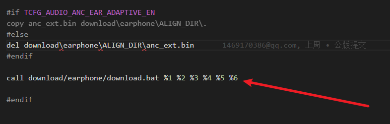

**啥也不用改，把makefile传递过来的六个参数继续往下传即可。**

## 修改makefile构建规则

```makefile
# 有的c语言工程使用makefile和makefile.mk共同构建？分开的好处是啥？
all: pre_build 
    make -f build/Makefile.mk
```

这种分离`Makefile`和`Makefile.mk`的设计模式确实很常见，特别是在大型C/C++项目中。

**职责分离**

```makefile
# 主Makefile - 项目级控制
all: pre_build
	make -f build/Makefile.mk

pre_build:
	@echo "准备构建环境..."
	mkdir -p build/obj
	mkdir -p build/bin
```

```makefile
# Makefile.mk - 具体构建规则
CC = gcc
CFLAGS = -Wall -O2
SOURCES = $(wildcard src/*.c)
OBJECTS = $(SOURCES:.c=.o)

target: $(OBJECTS)
	$(CC) $(OBJECTS) -o $@
```

**模块化管理**

- **主Makefile**：处理项目级任务（环境准备、清理、测试等）
- **Makefile.mk**：专注于编译链接的具体规则

**配置与构建分离**

```makefile
# 主Makefile - 可配置的构建选项
DEBUG ?= 0
PLATFORM ?= linux

all: pre_build
ifeq ($(DEBUG), 1)
	make -f build/Makefile.mk DEBUG=1
else
	make -f build/Makefile.mk RELEASE=1
endif
```

**支持多种构建方式**

```makefile
# 主Makefile
debug: pre_build
	make -f build/Makefile.mk DEBUG=1

release: pre_build  
	make -f build/Makefile.mk RELEASE=1

test: pre_build
	make -f test/Makefile.mk
```

**更好的可维护性**

- 主Makefile通常较短，易于理解项目结构
- 具体的编译规则集中在.mk文件中，便于维护
- 可以有多个.mk文件处理不同的构建任务

### 修改`Makefile`

为什么需要 CFLAGS？

1. 架构相关的预处理：
   - `-target pi32v2 -mcpu=r3` 确保预处理器知道目标架构
   - 某些头文件可能有架构相关的条件编译
2. 宏定义的一致性：
   - `CFLAGS` 中可能包含 `-DCONFIG_XXX` 这样的宏定义
   - **确保预处理时的配置与实际编译时一致**
3. 包含路径：
   - `$(INCLUDES)` 确保能找到所有需要的头文件

实际应用场景：

这是一种**动态构建系统**的实现：

- 根据配置宏动态决定需要编译哪些源文件
- 避免硬编码源文件列表
- 支持条件编译的大型项目管理

所以 `CFLAGS` 在这里不是用来编译，而是用来**预处理生成构建配置**，这是一种很巧妙的元编程技术！

**也就是说配置文件中的宏配置，需要告诉两个地方： 第一个是需要转换符合C语言语法的头文件形式。 第二个就是告诉编译器哪一些是宏，从而可以条件编译，只编译开启的的代码。 这两个地方必须一致**

**C语言头文件形式** (供代码include使用)

```c
// config.h 或 app_config.h
#define _DEBUG_ONOFF 1
#define _IC_Model 1  
#define _KEY_TONE_EN 1
#define _DEC_MP3_ENABLE 1
#define _DEC_AAC_ENABLE 0
```

**编译器命令行宏定义** (供条件编译使用)

```c
# Makefile中
CFLAGS_EX+=-D_DEBUG_ONOFF=1
CFLAGS_EX+=-D_IC_Model=1
CFLAGS_EX+=-D_KEY_TONE_EN=1  
CFLAGS_EX+=-D_DEC_MP3_ENABLE=1
CFLAGS_EX+=-D_DEC_AAC_ENABLE=0
```

**为什么需要两个地方？**

**头文件的作用**：

```c
// 代码中需要包含头文件来获取宏定义
#include "app_config.h"

#if _DEC_MP3_ENABLE  // 这里需要头文件中的宏定义
    void init_mp3_decoder();
#endif
```

**编译器宏的作用**：

```c
# 编译时传递给预处理器
gcc -D_DEC_MP3_ENABLE=1 -D_DEBUG_ONOFF=1 ... source.c
```

**不一致会导致的问题：**

```c
// 头文件中：#define _DEC_MP3_ENABLE 1  
// 编译器：-D_DEC_MP3_ENABLE=0

#include "config.h"
#if _DEC_MP3_ENABLE  // 头文件说是1，这段会编译
    void mp3_decode() { ... }  // 但实际编译时宏是0
#endif

// 在别的文件中：
#if _DEC_MP3_ENABLE  // 编译器宏是0，这段不会编译
    extern void mp3_decode();  // 导致链接错误！
#endif
```

**只使用编译器宏定义**，避免了维护两套配置的复杂性：

- 配置文件 → Makefile变量 → 编译器宏 → 条件编译
- 简单直接，只有一个数据源，不会不一致

这是一种很聪明的设计选择！确保了配置的**单一数据源**原则。

**现在是维护两个，只不过是直接从用户配置文件中同步的。**

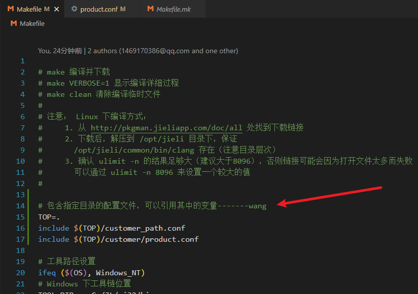

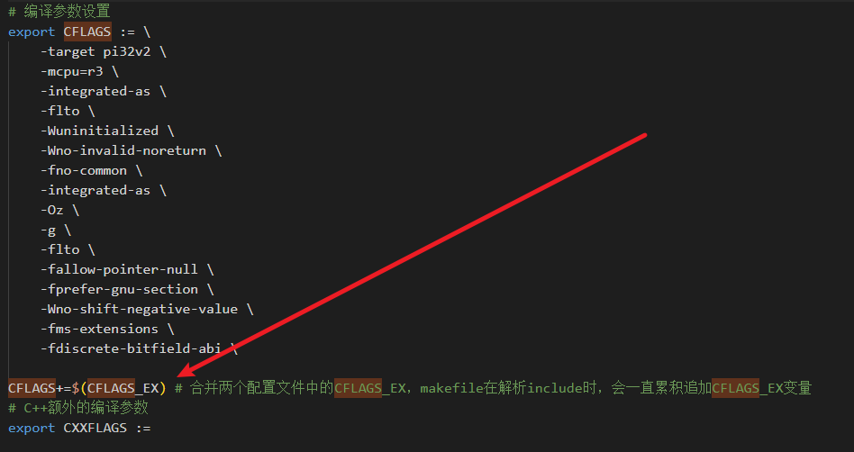

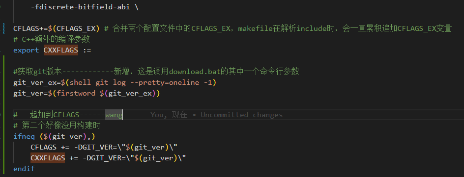

**CXXFLAGS好像构建时没有用到**

#### 疑问？？？

其实宏定义好像有专门的编译参数设置，一改的话，就要修改配置文件了，后期再验证。

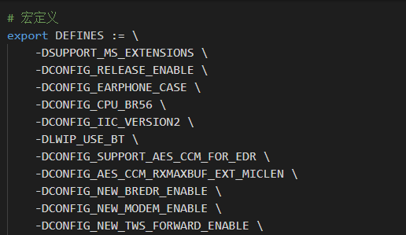

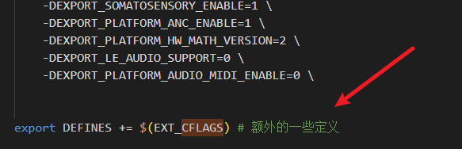

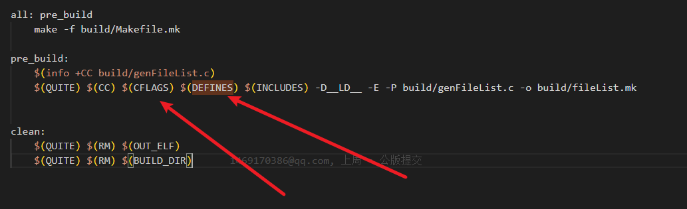

### 修改build\Makefile.mk

**这里就是单纯给脚本传递参数而已。**

```makefile
# 包含指定目录的配置文件，可以引用其中的变量-------wang
TOP=.
include $(TOP)/customer_path.conf
include $(TOP)/customer/product.conf

# 传递IC型号-----wang
ifeq ($(_IC_Model),0) 
  IC_VER=7106
else
  IC_VER=7103
endif

# 获取git版本------------新增，这是调用download.bat的其中一个命令行参数,再获取一次，不然拿不到版本号
git_ver_ex=$(shell git log --pretty=oneline -1)
git_ver=$(firstword $(git_ver_ex))
    
# ...
# 传递六个参数到脚本
all: pre_build $(OUT_ELF)
	$(info +POST-BUILD)
	$(QUITE) $(RUN_POST_SCRIPT) $(CUSTOMER_PATH) $(CUSTOMER_CHIPKEY) $(_SDK_VER) $(IC_VER) $(_HARDWARE_MODEL) $(git_ver)
```

## 确保配置宏与编译器的宏一致

`customer\Left\customer.conf`

```makefile
#***************************************************************************
#                       Customer Configuration
#***************************************************************************

#  IC_Model
#  for selectingIC model:
#   0：   AC7106
#   1：   AC7103
#---------------------------------------------
_IC_Model=0
###------------------------------------------

####*******************************版本号管理************************
#SDK_VERSION
_SDK_VER=V138
#HARDWARE_VERSION
_HARDWARE_VER=V1.0
#HARDWARE_MODEL
_HARDWARE_MODEL=DHF_Y90
```

`customer\product.conf`

```makefile
#***************************************************************************
#                       Product Configuration
#***************************************************************************

CUS_CFG_FILE=$(CUSTOMER_PATH)/customer.conf
include ./customer/$(CUS_CFG_FILE)

#---------------------------------------------
#  IC_Model
#  for selectingIC model:
#   0：   AC7106
#   1：   AC7103
#---------------------------------------------
CFLAGS_EX+=-D_IC_Model=$(_IC_Model)

####*******************************版本号管理************************
#SDK_VERSION
CFLAGS_EX+=-D_SDK_VER=$(_SDK_VER)
#HARDWARE_VERSION
CFLAGS_EX+=-D_HARDWARE_VER=$(_HARDWARE_VER)
#HARDWARE_MODEL
CFLAGS_EX+=-D_HARDWARE_MODEL=$(_HARDWARE_MODEL)
```

## 可配置化BUG

### bug1

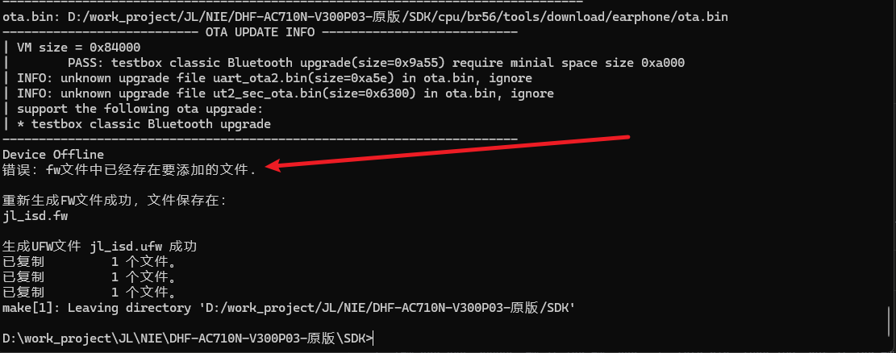

错误"fw文件中已经存在要添加的文件"很可能出现在这两行代码处：

```bat
@rem 将OTA升级文件添加到固件中，类型为100---wang
..\..\fw_add.exe -noenc -fw jl_isd.fw -add ..\..\ota.bin -type 100 -out jl_isd.fw
@rem 将脚本版本信息文件添加到固件中 ---wang
..\..\fw_add.exe -noenc -fw jl_isd.fw -add ..\..\script.ver -out jl_isd.fw
```

**问题分析：**

1. **重复执行脚本**：如果您多次运行这个脚本，而`jl_isd.fw`文件已经存在并且已经包含了要添加的文件（ota.bin或script.ver），再次尝试添加相同类型的文件时就会报错。
2. **文件已存在检查**：`fw_add.exe`工具检测到固件文件中已经存在相同类型（type 100）的文件，因此拒绝重复添加。

虽然报了"错误：fw文件中已经存在要添加的文件"，但是：

1. **脚本继续执行了** - "重新生成FW文件成功"
2. **文件正常生成了** - "生成UFW文件 jl_isd.ufw 成功"
3. **复制操作也成功了** - "已复制 1 个文件"

这说明这个"错误"实际上是一个**警告信息**，`fw_add.exe` 工具检测到重复文件后，可能内部做了处理（比如覆盖或跳过），然后继续完成了后续的操作。

**所以您不需要修改任何代码**，脚本已经能正常工作了。这种设计是合理的，因为：

- 开发过程中反复编译是常见情况
- 工具已经考虑了这种场景并能自动处理
- 最终结果是正确的

您可以放心继续使用原脚本，这个"错误"信息不会影响最终的固件生成。

### bug2

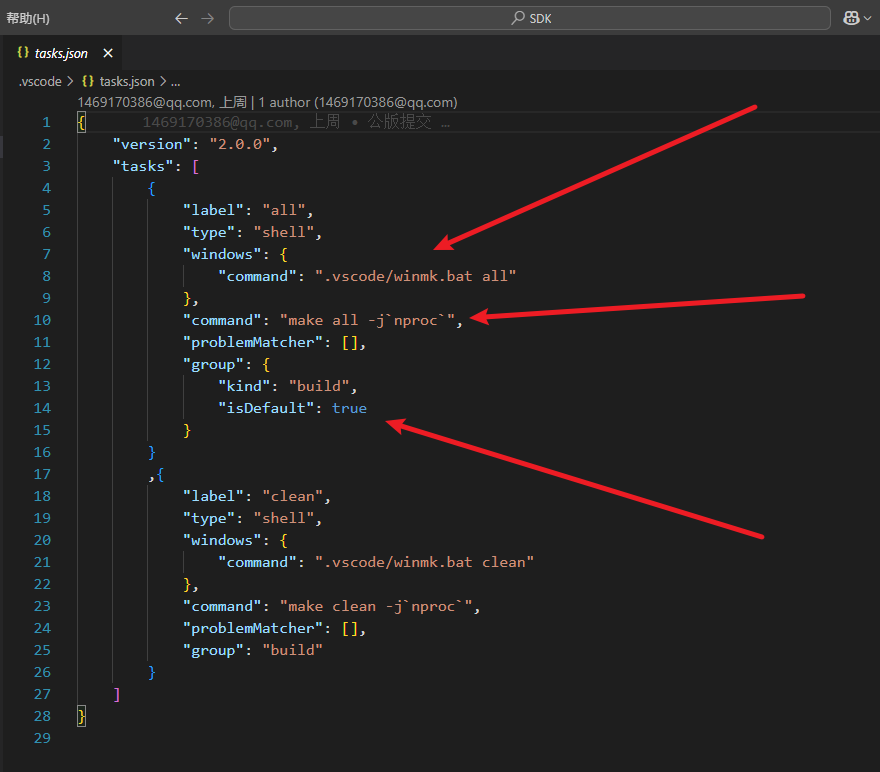

这就意味着调用vscode的终端生成任务时，会先调用`winmk.bat`脚本。

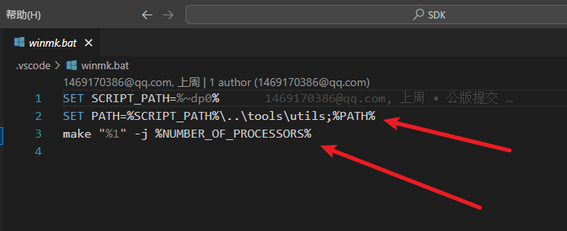

这个脚本在设置工具路径后，直接就调用了makefile。缺失了新架构中的`customer_copy.bat`以及`\apps\earphone\board\br56\output.bat`的功能。导致工程中的配置没有被替换，编译的永远都是同一份配置。

如果 tasks.json 中不传参数，脚本中的 `%para%` 就是空值，那么：

- `"%para%" neq "all"` 为 true（空值不等于"all"）
- `"%para%" neq "clean"` 为 true（空值不等于"clean"）
- 两个条件都满足，就会执行 `start cmd.exe /k "make clean&&make all -j 16"`

```json
{
    "version": "2.0.0",
    "tasks": [
        {
            "label": "all",
            "type": "shell",
            "windows": {
                "command": "product_compile_image.bat"
            },
            "command": "make all -j 16",
            "problemMatcher": [],
            "group": {
                "kind": "build",
                "isDefault": true
            }
        }
    ]
}
```

这样点击 VS Code 的构建按钮就会调用你的脚本，自动执行 `make clean&&make all -j 16` 了。你的脚本已经是 `make clean&&make all -j 16`，先清理再构建，那确实不需要单独的 clean 任务了。

`nproc` 是 Linux/Unix 系统的命令，用来获取当前系统的 CPU 核心数。

在 Linux 下：

- `nproc` 返回可用的处理器核心数
- ``make all -j`nproc``` 会自动使用所有 CPU 核心进行并行编译

推荐使用你现在的 `-j 16`，原因如下：

1. **简单直接**：固定数值，不用考虑系统差异
2. **性能合适**：16 线程对大多数现代 CPU 来说是个不错的并行度
3. **避免过载**：`nproc` 可能返回很大的数（比如 32、64 线程的服务器），过多线程反而会因为内存不足或 I/O 瓶颈导致编译变慢
4. **稳定可控**：你已经测试过 16 线程的效果，知道它工作良好

对于嵌入式 SDK 编译来说，16 线程通常是个很好的平衡点：

- 足够利用多核性能
- 不会占用太多系统资源
- 编译速度和系统响应性都不错

除非你发现编译时 CPU 利用率不高（说明可以加更多线程），或者系统变得很卡（说明线程太多了），否则保持 `-j 16` 就很好。

`command: "make all -j 16"` 是给 Linux/macOS 用的，既然你主要在 Windows 下用你的自定义脚本，这行其实用不到。

但保留着也没问题，万一哪天在 Linux 环境下编译，还能用上。而且和你脚本里的 `-j 16` 保持一致了，很统一。

**报错了：**

这是因为 VS Code 默认用 PowerShell 执行命令，而不是 cmd。需要指定用 cmd 来执行批处理文件。

```json
{
    "version": "2.0.0",
    "tasks": [
        {
            "label": "all",
            "type": "shell",
            "windows": {
                "command": "cmd /c product_compile_image.bat"
            },
            "command": "make all -j 16",
            "problemMatcher": [],
            "group": {
                "kind": "build",
                "isDefault": true
            }
        }
    ]
}
```

### bug3

日志跳出了vscode的终端，在电脑上重新开了一个cmd命令窗口。

问题在于你的脚本中使用了 `start cmd.exe /k`，这会强制打开一个新的 cmd 窗口。

要让编译在 VS Code 终端内执行，需要修改 `product_compile_image.bat`，把这行：

```json
start cmd.exe /k "make clean&&make all -j 16"
```

改为：

```json
make clean&&make all -j 16
```

去掉 `start cmd.exe /k` 就行了。这样编译过程就会在 VS Code 的终端内执行，而不会跳出新窗口。

`start cmd.exe /k` 的作用是：

- `start` - 启动新程序
- `cmd.exe` - 启动命令提示符
- `/k` - 执行命令后保持窗口打开

如果你想在 VS Code 终端内看到编译过程，直接执行 make 命令就可以了。

### bug4

日志：

```json
********************************************************************************
Left output
********************************************************************************
2025/07/03 周四
ECHO 处于关闭状态。
```

这个日志是正常的！这是你的 `product_compile_image.bat` 脚本调用 `output.bat` 时产生的输出。

**"ECHO 处于关闭状态"** - 这是因为脚本中有 `@echo off`，然后又有 `echo` 命令，这个提示是正常的

**@echo off不是会关闭所有命令回显吗？只显示结果吗？**

如果编译能继续进行并最终成功，那就说明一切正常。那个 "ECHO 处于关闭状态。" 只是个无关紧要的提示信息，不影响实际编译过程。

### bug5

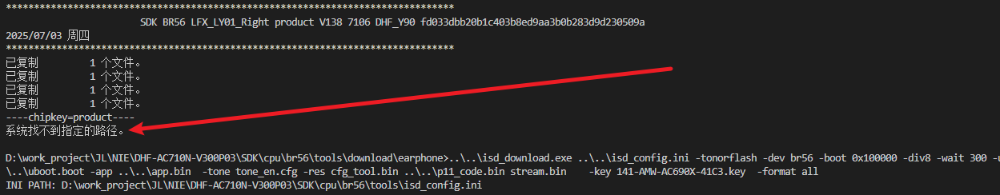

`cpu\br56\tools\download\earphone\download.bat`

没用这个路径，没有赋值，所以会找不到：

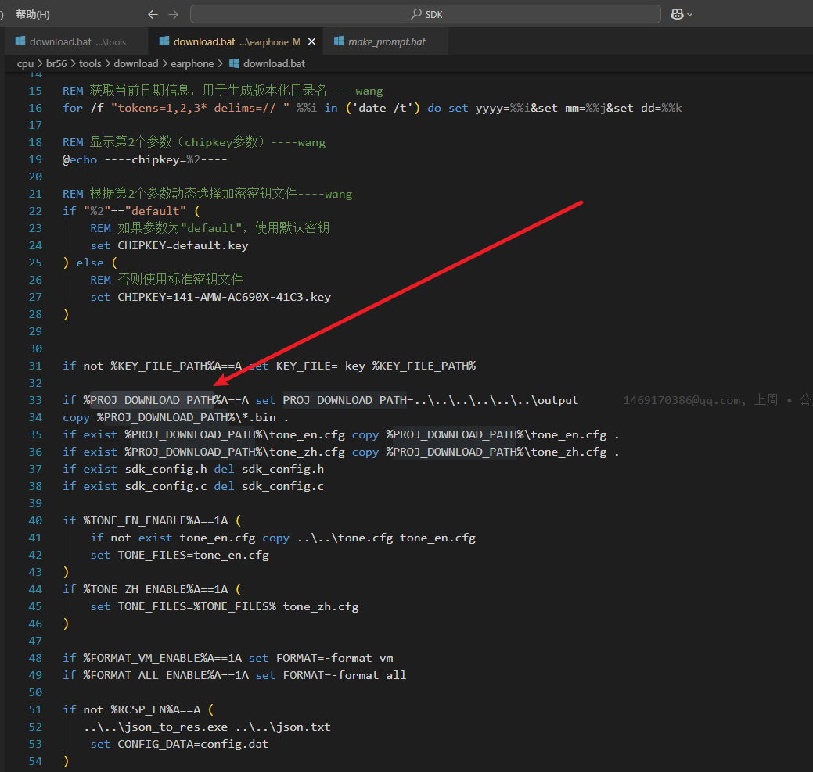

### bug6

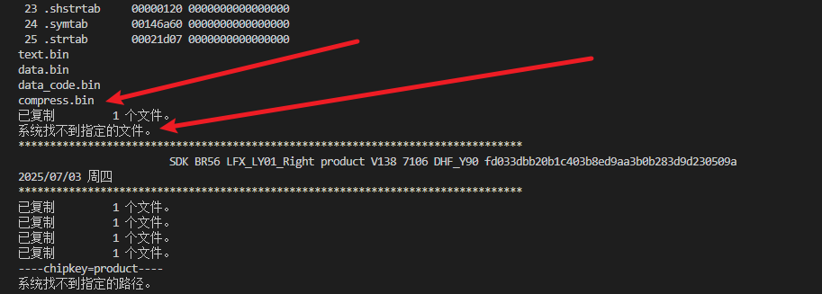

不知道`cpu\br56\tools\download.bat`脚本中的路径没找到

## 7106的宏和配置兼容到新架构

可视化的修改体现在`json`文件中以及`sdk_config.h`以及`sdk_config.c`中（**暂时发现**）

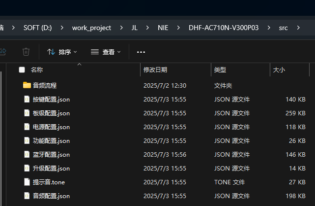

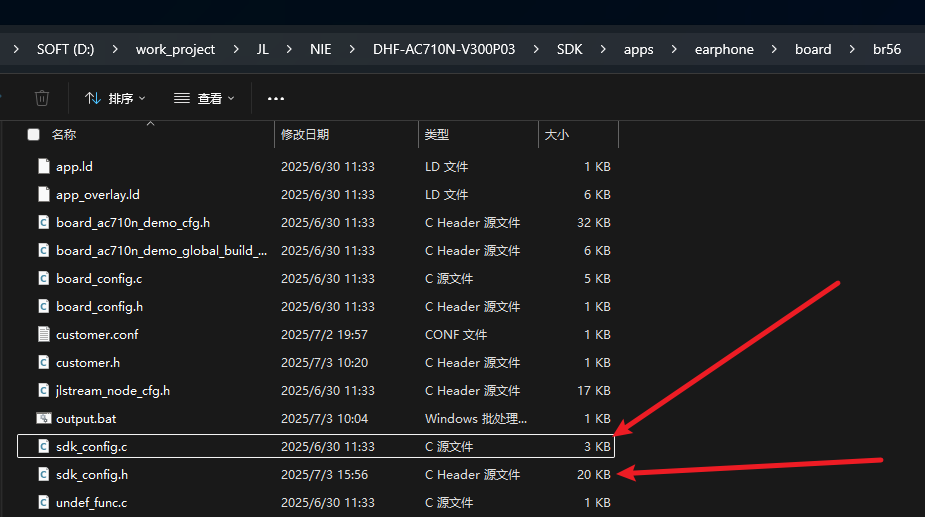

### 改动

**先手动复制到客户文件夹去，使用时利用脚本复制到对应位置**

```bat
copy .\customer\%CUSTOMER_PATH%\sdk_config.h .\apps\earphone\board\br56
copy .\customer\%CUSTOMER_PATH%\sdk_config.c .\apps\earphone\board\br56
copy .\customer\%CUSTOMER_PATH%\src ..\src
```

**问题：**

- `copy` 命令只能复制文件，不能复制目录及其内容

```bat
xcopy ".\customer\%CUSTOMER_PATH%\src" "..\src" /E /Y /I
```

- `xcopy` - 用于复制目录和文件
- `".\customer\%CUSTOMER_PATH%\src"` - 源目录
- `"..\src"` - 目标目录（上一级的src目录）
- `/E` - 复制所有子目录（包括空目录）
- `/Y` - 自动覆盖已存在的文件，不提示确认
- `/I` - 如果目标不存在，将其视为目录创建

在Windows批处理中，双引号**不是必需的**，但**强烈建议使用**。

**什么时候必须用双引号：**

- 路径中包含空格：`"C:\Program Files\MyApp"`
- 路径中包含特殊字符：`"C:\My&App\file.txt"`
- 文件名包含空格：`"my file.txt"`

- **防止意外**：如果 `%CUSTOMER_PATH%` 的值包含空格，不加引号就会出错

- **更规范**：专业的批处理脚本通常都加引号

- **避免特殊字符问题**：路径中可能包含 `&`、`(`、`)` 等特殊字符

### 新发现

`apps\earphone\board\br56\jlstream_node_cfg.h`

```bat
copy .\customer\%CUSTOMER_PATH%\sdk_config.h .\apps\earphone\board\br56
copy .\customer\%CUSTOMER_PATH%\sdk_config.c .\apps\earphone\board\br56
copy .\customer\%CUSTOMER_PATH%\jlstream_node_cfg.h .\apps\earphone\board\br56
xcopy .\customer\%CUSTOMER_PATH%\src  ..\src  /E /Y /I
```

### bug1

移植包含括号的宏时出现报错：

```bat
clang.exe: error: no such file or directory: '60'
clang.exe: error: no such file or directory: '1000)'
```

这表明clang编译器接收到了错误的参数 `'60'` 和 `'1000)'`。这很可能是：

1. **宏定义或参数解析错误** - 某个宏定义中包含了括号，但在Makefile中被错误地解析了
2. **命令行参数构造错误** - 构建脚本在组装编译命令时出现了语法错误
3. **字符串处理问题** - 可能是某个包含数字和括号的字符串被错误地分割了

```markdown
customer\LFX_LY01_Left\customer.conf
# **待验证**
# **虚拟机（VM）区域在进行更新操作时的擦除行为**
# 1- 不执行任何操作(No Operation)
# 0- 擦除(Erase)
_CONFIG_VM_OPT=0
# ****************************

# **低电提醒时间**
_LOW_POWER_WARN_TIME=(5 * 60 * 1000)
# *******************************

customer\product.conf
# **虚拟机（VM）区域在进行更新操作时的擦除行为**
# 1- 不执行任何操作(No Operation)
# 0- 擦除(Erase)
CFLAGS_EX+=-D_CONFIG_VM_OPT=$(_CONFIG_VM_OPT)
# *********************************************

# **低电提醒时间**
CFLAGS_EX+=-D_LOW_POWER_WARN_TIME=$(_LOW_POWER_WARN_TIME)
# **********************************************

这是makefile:
# 编译参数设置
export CFLAGS := \
    -target pi32v2 \
    -mcpu=r3 \
    -integrated-as \
    -flto \
    -Wuninitialized \
    -Wno-invalid-noreturn \
    -fno-common \
    -integrated-as \
    -Oz \
    -g \
    -flto \
    -fallow-pointer-null \
    -fprefer-gnu-section \
    -Wno-shift-negative-value \
    -fms-extensions \
    -fdiscrete-bitfield-abi \

CFLAGS+=$(CFLAGS_EX) # 合并两个配置文件中的CFLAGS_EX，makefile在解析include时，会一直累积追加CFLAGS_EX变量
```

在你的配置中：

```markdown
_LOW_POWER_WARN_TIME=(5 * 60 * 1000)
```

当这个值被传递给编译器时，变成了：

```markdown
-D_LOW_POWER_WARN_TIME=(5 * 60 * 1000)
```

但是shell和make在处理这个参数时，会将括号和空格作为分隔符，导致编译器接收到的参数被错误地分割为：

- `-D_LOW_POWER_WARN_TIME=`
- `(5`
- `*`
- `60`
- `*`
- `1000)`

这就是为什么出现 `'60'` 和 `'1000)'` 错误的原因。

**（使用引号）是最好的选择**：

```markdown
# product.conf
CFLAGS_EX+=-D_LOW_POWER_WARN_TIME="$(_LOW_POWER_WARN_TIME)"
```

这样做的好处：

1. **保持括号**：宏定义中的括号被完整保留
   - **去掉括号确实会有问题，因为宏展开时可能会出现运算符优先级问题。**
2. **避免shell解析问题**：引号防止shell将括号和空格当作分隔符
3. **编译器正确接收**：编译器会收到 `-D_LOW_POWER_WARN_TIME=(5 * 60 * 1000)` 这样的完整参数

### bug2

**_LFX_LY01_Left报错重复定义**

双重定义冲突：

**命令行定义**（来自你的配置）：

```cmd
<command line>:1:9: #define _LFX_LY01_Left 1
```

这是通过 `CFLAGS_EX+=-D_LFX_LY01_Left` 产生的，编译器自动给它赋值为1

**头文件定义**：

```cmd
apps/earphone/board/br56/customer.h:1:10: #define _LFX_LY01_Left
```

这是在头文件中只定义宏名，没有赋值。

#### 根本原因

当你在makefile中使用 `-D_LFX_LY01_Left` 时：

- 如果没有指定值，编译器会自动赋值为 `1`
- 但同时在 `customer.h` 中又定义了同样的宏（只有宏名）
- 这就造成了重复定义

**其他都是有宏体的，但是这个我要作为条件编译使用的，区分不同项目代码。 所以两个编译器和头文件都没有宏体，但是编译器自动赋值为1。没办法。有不有解决方案？**

显式指定空值（推荐）

修改 `customer_path.conf`：

```cmd
# 显式指定空值，避免编译器自动赋值为1
CFLAGS_EX+=-D_LFX_LY01_Left=
```

这样编译器就不会自动赋值为1，而是定义为空值，和头文件中的定义一致。

修改`product_compile_image.bat`

```cmd
echo CFLAGS_EX+=-D_%CUSTOMER_PATH%=>>customer_path.conf
```

**头文件统一管理？可行吗？我是在SDK中修改makefile的。新增宏用作条件编译的话，不需要告诉编译器吗？ 我明白了，如果使用头文件统一管理的话，代码是全部编译的，执行时区分。 如果告诉编译器的话，那么代码就是条件编译的，编译开启的代码。代码执行时在经过宏的二次校验。所以一般如果这样的话，需要维护两个地方的配置一致？**

**编译器定义（条件编译）**

```cmd
# makefile中
CFLAGS_EX+=-D_LFX_LY01_Left=
```

**特点：**

- 代码在**编译时**就被选择性编译
- 不符合条件的代码**不会**被编译进最终的二进制文件
- 生成的可执行文件更小，运行效率更高
- 只需要在makefile中定义

```c
#ifdef _LFX_LY01_Left
    // 这段代码只有在定义了宏时才会被编译
    void left_specific_function() { ... }
#endif
```

**方案2：头文件统一管理（运行时判断）**

```c
// customer.h中
#define _LFX_LY01_Left 1
```

**特点：**

- 所有代码都被编译进二进制文件
- 在**运行时**通过宏值判断执行哪段代码
- 二进制文件更大，但灵活性更高
- 需要维护头文件和makefile两个地方

```c
// 所有代码都被编译，运行时判断
if (_LFX_LY01_Left) {
    // 运行时判断执行
    left_specific_function();
}
```

**两者结合一起**

既能利用IDE的高亮，又能条件编译，减小体积

- IDE智能提示和高亮

```c
// customer.h中
#define _LFX_LY01_Left  // IDE能识别，提供高亮和智能提示
```

- 条件编译优化

```c
# makefile中
CFLAGS_EX+=-D_LFX_LY01_Left=  # 编译器进行条件编译
```

- 代码可读性

```c
#ifdef _LFX_LY01_Left
    // IDE高亮显示这段代码是有效的
    void left_specific_function() {
        // 代码逻辑
    }
#endif
```

### bug3

copy脚本复制客户的`tone_en.cfg`或者`tone_zh.cfg`后会被覆盖导致客户提示音配置不生效。

原因在于后续的`cpu\br56\tools\download\earphone\download.bat`中：

- 这里从可视化导出的cfg文件会被复制到当前脚本的目录中从而覆盖了之前复制过来的配置。
- 也就意味着copy脚本中`tone_en.cfg`以及`tone_zh.cfg`不需要复制，用这里的就行。
- `tone.cfg`也不用copy了，因为他是默认的提示音配置。

所有.bin文件也不用copy了，这里有脚本操作了，不然也是被覆盖：

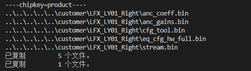

```bat
REM 检查是否设置了密钥文件路径
REM 这里使用了批处理的一个技巧：%变量名%A==A 用来检查变量是否为空
REM 如果变量为空，%变量名%A 会变成 A，所以 A==A 为真
REM 如果变量不为空，%变量名%A 会变成 变量值A，所以 变量值A==A 为假
REM not 表示取反，所以这行的意思是：如果 KEY_FILE_PATH 不为空
if not %KEY_FILE_PATH%A==A set KEY_FILE=-key %KEY_FILE_PATH%

REM 设置项目下载路径的默认值
REM 如果 PROJ_DOWNLOAD_PATH 变量为空，则设置为相对路径 ..\..\..\..\..\..\output
REM 这个路径向上返回6级目录，然后进入output文件夹
REM 直接指向客户文件夹万事大吉！
if %PROJ_DOWNLOAD_PATH%A==A set PROJ_DOWNLOAD_PATH=..\..\..\..\..\customer\%1

REM 复制所有的 .bin 文件到当前目录
REM %PROJ_DOWNLOAD_PATH%\*.bin 表示下载路径中的所有.bin文件
REM . 表示当前目录
copy %PROJ_DOWNLOAD_PATH%\*.bin .	

REM 条件复制配置文件
REM 只有当文件存在时才复制，避免出错
REM tone_en.cfg 是英文音调配置文件
if exist %PROJ_DOWNLOAD_PATH%\tone_en.cfg copy %PROJ_DOWNLOAD_PATH%\tone_en.cfg .	

REM 条件复制中文音调配置文件
REM tone_zh.cfg 是中文音调配置文件
if exist %PROJ_DOWNLOAD_PATH%\tone_zh.cfg copy %PROJ_DOWNLOAD_PATH%\tone_zh.cfg .

REM 清理旧的SDK配置文件
REM 删除可能存在的旧配置文件，确保使用最新的配置
if exist sdk_config.h del sdk_config.h
if exist sdk_config.c del sdk_config.c

REM 处理英文音调功能
REM 如果启用了英文音调功能（TONE_EN_ENABLE=1）
if %TONE_EN_ENABLE%A==1A (
    REM 如果当前目录没有 tone_en.cfg 文件，则从上级目录复制默认配置
    REM ..\..\tone.cfg 是默认的音调配置文件
    REM "如果客户没有，就用默认的并重命名"的备用机制
    if not exist tone_en.cfg copy ..\..\tone.cfg tone_en.cfg
    
    REM 设置音调文件列表，包含英文音调配置
    set TONE_FILES=tone_en.cfg
)

REM 处理中文音调功能
REM 如果启用了中文音调功能（TONE_ZH_ENABLE=1）
if %TONE_ZH_ENABLE%A==1A (
    REM 将中文音调配置文件添加到音调文件列表中
    REM %TONE_FILES% 保留之前的值，然后追加新的文件名
    set TONE_FILES=%TONE_FILES% tone_zh.cfg
)
```

#### 后续的提示音应该是这样流程

**通过路径先把提示音加入，然后导出会生成一个`tone_en.cfg`或者`tone_zh.cfg`文件不同客户手动复制到各自文件夹去。**
