# 结构说明

**各客户的配置文件使用文件夹集中和隔开：**

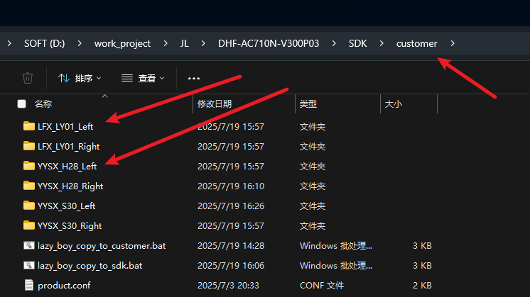

**各客户的功能差异在代码上暂时使用客户文件夹区分：**

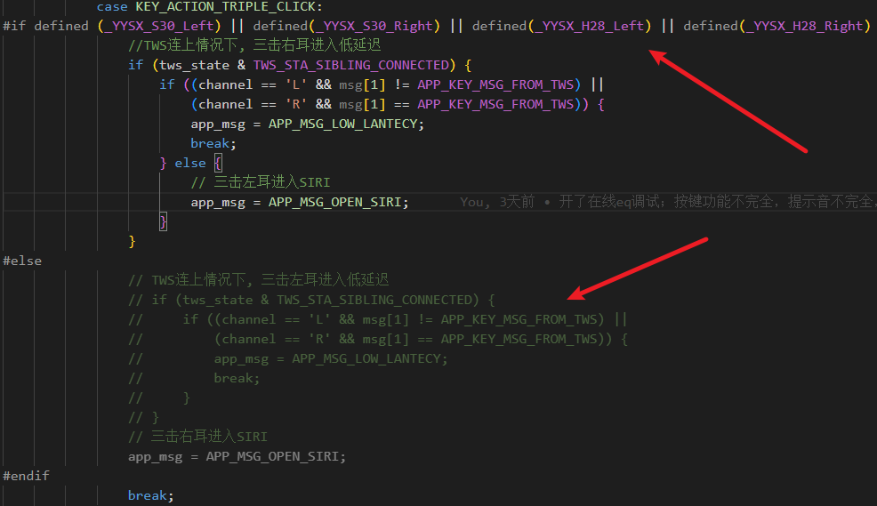

**修改各客户功能时，请先使用`lazy`脚本将专属客户的配置文件copy到SDK正确目录中，以供可视化工具读取：**

​                                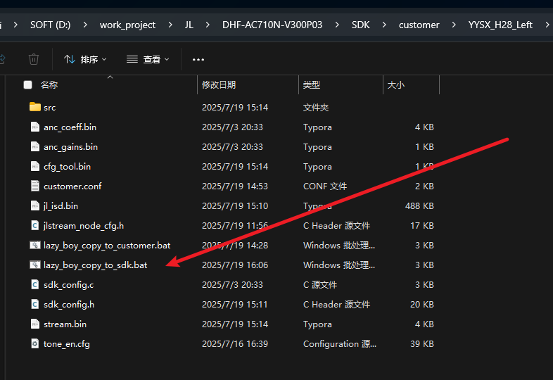 

# 编译

## 选择编译的客户以及`key`

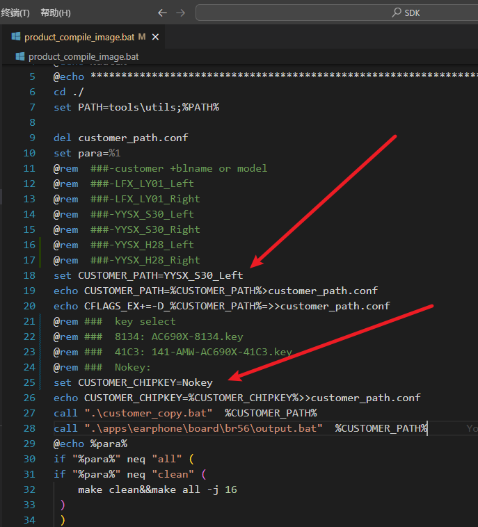

## 客户的其他配置

- 在各自客户文件夹中配置

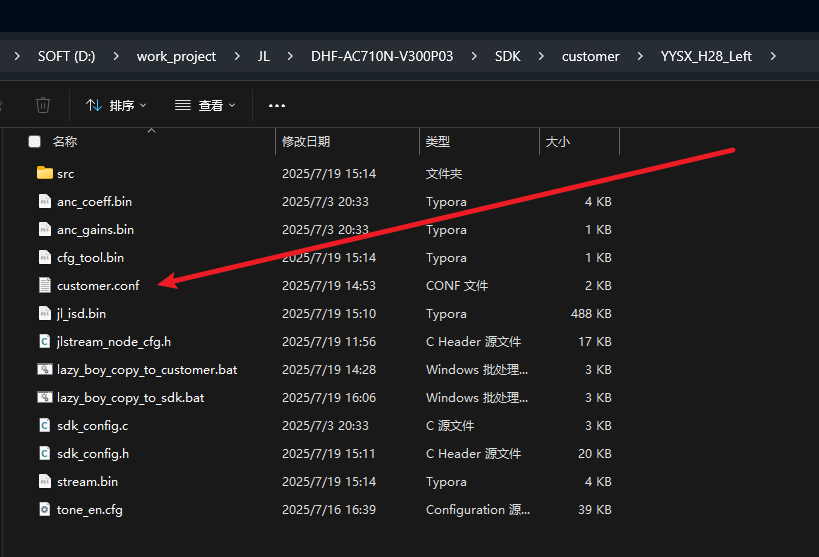

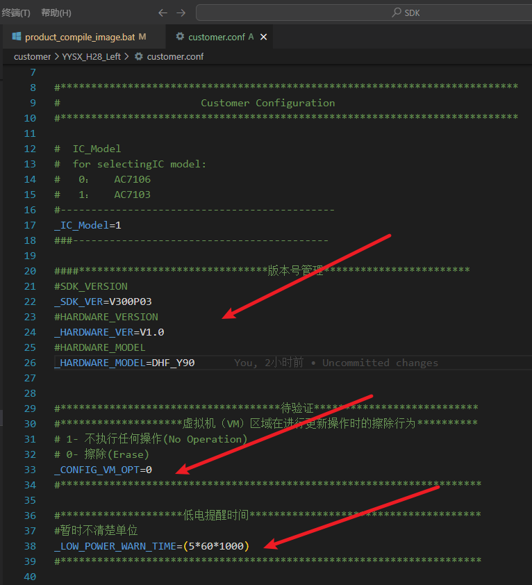

## 编译方式选择

### 请使用`vscode`编译

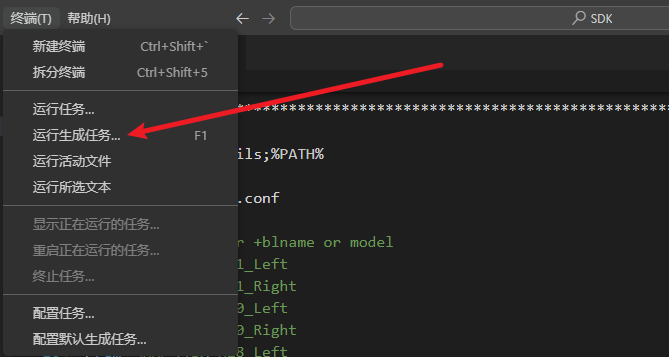

### 直接使用脚本开启编译

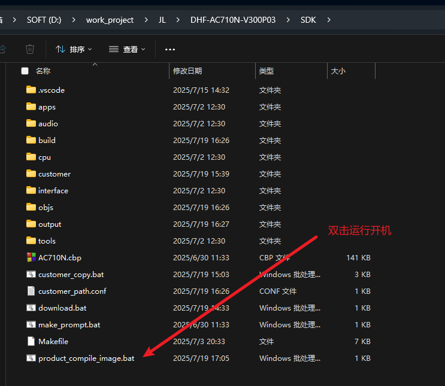

# 可视化工具

**使用可视化工具修改配置后，请先导出配置文件。**

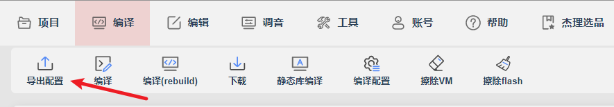

**一旦使用了可视化工具修改配置并导出后，请先使用`lazy`脚本将把配置copy到客户自己的文件夹，以便SDK编译时自动读取对应配置：**

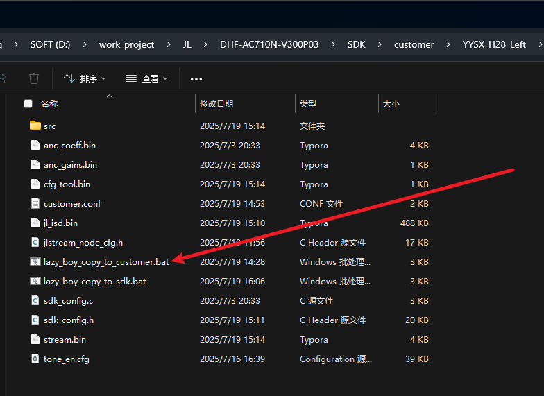

# 出包

正式出包前，请先使用`git`提交。因为固件的校验码来自`git`提交后产生的哈希值。

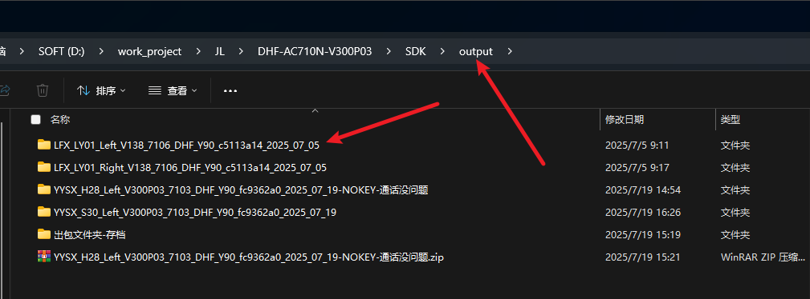

## 存档

正式出包的固件，都放一个文件夹中，使用客户名称命名。存档包含**线烧和无线烧录**。

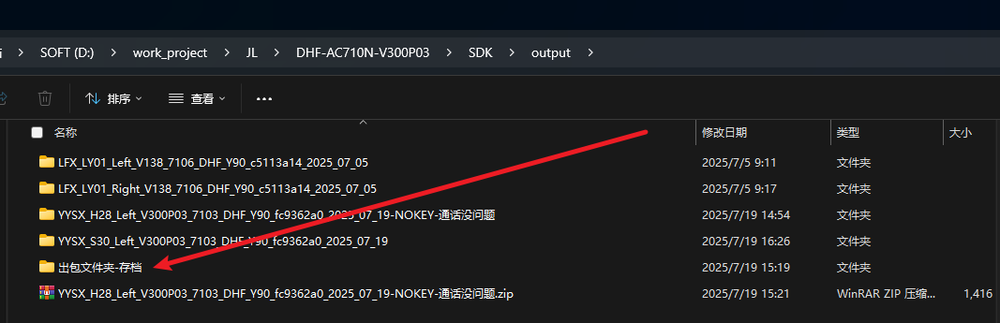

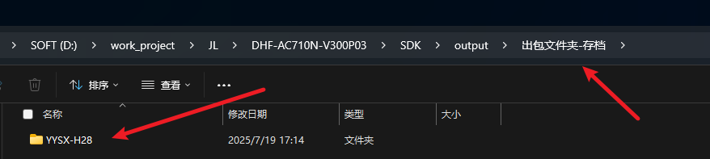

- **一旦领先当前提交后，除了撤销到指定版本是无法再次得到相同校验码的。**

## 校验码

- 如果分左右的话，一边提交一次。有独立的git的hash校验码。
- 最后为了保存两个包，需要再提交一次作为存档。

# 合EQ

可以导入三种格式，一般是bin文件：

选择要合的模块，一般是音乐EQ:
   						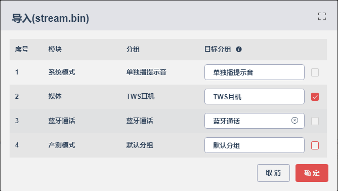	

点击导出配置，然后使用copy_customer脚本复制到客户文件夹中，编译即可。前提是SDK中已经是对应用户的配置了。

# 调通话存档

- 直接存录音文件
- 从工程中copy配置到客户文件夹中，把整个文件夹拖出去即可。
- 建立一个文件夹存档录音文件以及客户配置文件夹

# 2025-07-22

# 2025-07-31