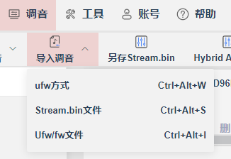

# 结构说明

**各客户的配置文件使用文件夹集中和隔开：**


**各客户的功能差异在代码上暂时使用客户文件夹区分：**


**修改各客户功能时，请先使用`lazy`脚本将专属客户的配置文件copy到SDK正确目录中，以供可视化工具读取：**

​                                 

# 编译

## 选择编译的客户以及`key`


## 客户的其他配置

- 在各自客户文件夹中配置


## 编译方式选择

### 请使用`vscode`编译


### 直接使用脚本开启编译


# 可视化工具

**使用可视化工具修改配置后，请先导出配置文件。**


**一旦使用了可视化工具修改配置并导出后，请先使用`lazy`脚本将把配置copy到客户自己的文件夹，以便SDK编译时自动读取对应配置：**


# 出包

正式出包前，请先使用`git`提交。因为固件的校验码来自`git`提交后产生的哈希值。


## 存档

正式出包的固件，都放一个文件夹中，使用客户名称命名。存档包含**线烧和无线烧录**。


- **一旦领先当前提交后，除了撤销到指定版本是无法再次得到相同校验码的。**

## 校验码

- 如果分左右的话，一边提交一次。有独立的git的hash校验码。
- 最后为了保存两个包，需要再提交一次作为存档。

# 合EQ

可以导入三种格式，一般是bin文件：



选择要合的模块，一般是音乐EQ:
   							

点击导出配置，然后使用copy_customer脚本复制到客户文件夹中，编译即可。前提是SDK中已经是对应用户的配置了。

# 调通话存档

- 直接存录音文件
- 从工程中copy配置到客户文件夹中，把整个文件夹拖出去即可。
- 建立一个文件夹存档录音文件以及客户配置文件夹

# customer.conf文件规范

Customer.conf 文件用于定义产品构建时的宏定义配置。该文件通过 output.bat 脚本自动转换为 customer.h 头文件，供 C/C++ 代码使用。

## 文件格式

### 基本语法

```
KEY=VALUE
```

### 支持的数据类型

#### 1. 数字类型

- **纯整数**：如 `0`, `1`, `300000`, `600000`
- **用途**：用于数值配置、开关标志、计时器值等

```conf
_IC_Model=0
_CONFIG_VM_OPT=1
_LOW_POWER_WARN_TIME=600000
```

#### 2. 字符串类型

- **标识符字符串**：如版本号、模型名称等
- **包含字母、数字、下划线、点号、连字符**

```conf
_SDK_VER=V300P03
_HARDWARE_VER=V1.0
_HARDWARE_MODEL=DHF_Y90
```

### 注释规则

1. **行注释**：以 `#` 开头的行被忽略

```conf
# 这是注释
_CONFIG_VALUE=1
```

2. **分隔注释**：使用 `#` 和 `*` 创建视觉分隔

```conf
#***************************************************************************
#                        硬件配置区域
#***************************************************************************
```

### 宏命名规范

1. **前缀**：所有配置宏必须以下划线 `_` 开头
2. **格式**：使用大写字母和下划线：`_MACRO_NAME`
3. **分类建议**：
   - 硬件配置：`_IC_Model`, `_HARDWARE_VER`
   - 软件版本：`_SDK_VER`
   - 功能开关：`_DAC_PA_EN`, `_CONFIG_VM_OPT`
   - 时间配置：`_LOW_POWER_WARN_TIME`

### 转换结果

配置文件通过 output.bat 脚本转换为 C 头文件：

**输入 (customer.conf)：**

```conf
_IC_Model=0
_SDK_VER=V300P03
```

**输出 (customer.h)：**

```c
#define _GK158_Left
#define _IC_Model 0
#define _SDK_VER V300P03
```

## 脚本特性

### 1. 条件编译支持

- 自动生成客户标识宏（空定义）
- 用法：`#ifdef _GK158_Left ... #endif`

### 2. 健壮性

- 使用 PowerShell 解析，避免批处理特殊字符问题
- 自动跳过注释和空行
- 支持复杂的配置文件结构

### 3. 简洁日志

- 最小化输出，便于查看构建日志
- 专注于实际转换过程

## 最佳实践

### 1. 文件组织

```conf
#***************************************************************************
#                       版本信息
#***************************************************************************
_SDK_VER=V300P03
_HARDWARE_VER=V1.0

#***************************************************************************
#                       硬件配置
#***************************************************************************
_IC_Model=0
_DAC_PA_EN=1

#***************************************************************************
#                       功能开关
#***************************************************************************
_CONFIG_VM_OPT=0
_LOW_POWER_WARN_TIME=600000
```

### 2. 避免的字符

- 不使用圆括号、星号在值中：~~`(5*60*1000)`~~
- 不使用管道符、百分号等批处理特殊字符

### 3. 推荐写法

```conf
# 推荐：直接使用计算结果
_TIMEOUT_MS=300000

# 不推荐：数学表达式
# _TIMEOUT_MS=(5*60*1000)
```

## 兼容性说明

- **Windows 批处理兼容**：确保在 Windows cmd.exe 环境下正常工作
- **PowerShell 增强**：利用 PowerShell 的字符串处理能力
- **C/C++ 兼容**：生成标准的 C 宏定义格式

## 故障排除

### 常见问题

1. **宏定义丢失**
   - 检查是否以 `_` 开头
   - 检查 `=` 号前后是否有特殊字符

2. **转换中断**
   - 避免在注释中使用过多特殊字符
   - 确保文件编码为 UTF-8 或 ANSI

3. **编译错误**
   - 检查生成的 customer.h 是否包含所有必要宏
   - 验证宏值格式是否正确

### 验证方法

```bash
# 检查所有宏定义是否被提取
powershell "Select-String -Path customer.conf -Pattern '^_.*=' | Select -ExpandProperty Line"

# 验证转换结果
type customer.h
```

## 脚本维护

当前 output.bat 脚本已优化为：

- 最小化日志输出
- 支持所有标准宏定义类型
- 使用 PowerShell 确保转换完整性
- 生成适合条件编译的空宏定义

脚本核心逻辑：

1. 生成客户标识的条件编译宏
2. 使用 PowerShell Select-String 提取宏定义
3. 直接转换为 #define 格式
4. 输出到 customer.h 头文件

# 2025-07-22

# 2025-08-12