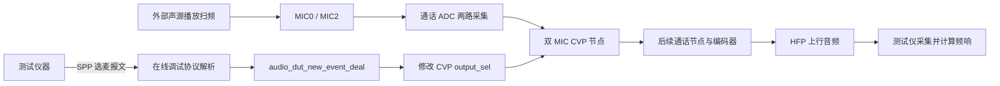

# HFP＋SPP 选麦测试 MIC 频响：配置要点、调用链与流程

> 适用工程：`t2616cc-firmware`，AC701N 平台。本文依据本工程源码重写，核对日期：2026-09-10。
> 本文描述通过 HFP 通话上行采集音频、通过经典蓝牙 SPP 选择 MIC 输出的测试方式。源码分析不等于设备实测；可视化配置重新生成后，还需确保烧录的是配套固件和音频资源。

## 一、测试前必须满足的三个要点

| 要点 | 必须确认的内容 | 本工程的配置目标 |
|---|---|---|
| **1. 开启产测功能** | `TCFG_AUDIO_DUT_ENABLE = 1`，SPP 在线调试可连接，产测命令处理已初始化。 | SPP 发送选麦指令，HFP 通话上行传输待测音频。 |
| **2. ADC 配置正确** | 启用实际接入的物理 MIC，采样率、模拟增益等符合测试条件。 | 使用 **MIC0、MIC2** 两路输入；使能位图为 `BIT(0) \| BIT(2) = 0x05`。 |
| **3. HFP 通话节点与 MIC 配置匹配** | 通话节点要求的输入路数与 ADC 一致，主副麦角色映射正确；硬回采参考通道需另外计算。 | 两路声音 MIC、未开启硬回采时，使用**双 MIC 通话节点**，不能接三 MIC 通话节点。 |

**三个条件缺一不可。SPP 回复成功只能说明命令处理成功，不能单独证明通话音频有效、物理选麦正确或频响曲线可信。**

### 1.1 当前工作区状态

本次重写时，工作区已经从先前三 MIC 配置更新为双 MIC 配置：

```c
// SDK/apps/earphone/board/br28/sdk_config.h
#define TCFG_AUDIO_DUT_ENABLE          1

// SDK/apps/earphone/board/br28/jlstream_node_cfg.h
#define TCFG_AUDIO_CVP_3MIC_MODE        0
#define TCFG_AUDIO_CVP_DMS_ANS_MODE     1
```

`src/音频流程/蓝牙通话.x6flow` 中读取到的 `esco_adc` 参数组选择值为 `[1, 4]`，对应 MIC0、MIC2 的使能位。双 MIC 节点参数也包含对应的通道选择值。该文件包含多个节点/参数组，不能仅通过搜索到某个节点名称判断实际运行链路；应以可视化中启用并连接的流程、生成配置和烧录资源的一致性为准。

下文以双 MIC 通话路径解释正常工作机制。主麦对应 MIC0、副麦对应 MIC2 的报文示例，以可视化中的角色配置确实如此为前提；交换角色配置后，命令对应的物理 MIC 也随之交换。

### 1.2 宏的联动关系

`SDK/apps/earphone/include/app_config.h` 的“需要 spp 调试的配置”分支将 `TCFG_AUDIO_DUT_ENABLE` 作为条件之一，重新定义：

```c
#define TCFG_BT_SUPPORT_SPP  1
#define APP_ONLINE_DEBUG    1
```

因此本工程开启音频产测会联动开启 SPP 在线调试。仍需正常执行初始化、建立 SPP 连接，并让 HFP 的 SCO/eSCO 音频链路真正运行。

## 二、整体架构：控制与音频两条路径



- **SPP 控制路径**：接收命令，选择主麦、副麦或默认算法输出，返回执行状态。
- **HFP 音频路径**：采集 MIC，经过通话流程和编码，向测试仪提供上行音频。
- **测试仪**：控制声源、采集上行音频并计算频响。本路径中的选麦命令本身不计算频响，也不通过 SPP 返回频响曲线。

这里测得的是所选 MIC 经当前通话上行链路后的响应。HFP 编码、带宽、ADC 增益、前级处理及后续节点都会影响结果，不能将其直接等同于裸 MIC 的全带宽响应。

## 三、初始化调用链

### 3.1 产测处理器初始化

源码入口：`SDK/audio/cpu/br28/audio_setup.c`。

```text
音频初始化（TCFG_AUDIO_DUT_ENABLE 开启）
  └─ audio_dut_init()                         [audio/test_tools/audio_dut_control.c]
      ├─ 分配 audio_dut_hdl
      ├─ 默认 mode = CVP_DUT_MODE_ALGORITHM
      ├─ 保存 esco_cfg_mic_ch，供恢复 ADC 使能位使用
      └─ app_online_db_register_handle(DB_PKT_TYPE_DMS,
                                       audio_dut_app_online_parse)
```

`DB_PKT_TYPE_DMS = 0x0B` 是产测命令使用的在线协议类型。名字中有 DMS，不表示只能处理双麦：同一入口根据编译配置分发单麦、双麦或三麦命令。

### 3.2 SPP 初始化与连接

```text
multi_protocol_main.c
  └─ online_spp_init()                        [spp_online_db.c]
      └─ 注册 SPP 接收、连接状态、发送唤醒回调

SPP 连接状态回调
  └─ tws_online_spp_send(ONLINE_SPP_CONNECT, ...)
      └─ tws_online_spp_in_task(...)
          ├─ db_api->init(DB_COM_TYPE_SPP)
          └─ db_api->register_send_data(online_spp_send_data)
```

`tws_online_spp_*` 是当前工程 SPP 在线调试分发实现的一部分，具体同步/本地执行受 TWS 配置和角色影响。连接后在线协议才具备对应的收发上下文。

## 四、HFP 通话音频启动与 MIC 数据路径

### 4.1 打开通话上行流程

普通通话入口在 `SDK/apps/earphone/mode/bt/phone_call.c`；TWS 通话另有 `tws_phone_call.c`，均有调用 `esco_recoder_open()` 的路径。

```text
esco_audio_open(bt_addr)
  ├─ esco_player_open(bt_addr)                通话下行
  └─ esco_recoder_open(COMMON_SCO, bt_addr)    通话上行
      ├─ 获取 "esco" 流程 UUID
      ├─ jlstream_pipeline_parse(uuid, NODE_UUID_ADC)
      ├─ 配置源节点、编码/发送相关参数
      ├─ get_cvp_node_uuid()
      ├─ 向 CVP 节点传入 source_uuid = NODE_UUID_ADC
      ├─ jlstream_set_scene(..., STREAM_SCENE_ESCO)
      └─ jlstream_start(...)
```

`esco_recoder_open()` 位于 `SDK/audio/interface/recoder/esco_recoder.c`。它解析配置中的流程，因此可视化中接入的通话节点会参与实际运行。

### 4.2 ADC 读取配置并生成两路数据

源码：`SDK/audio/framework/plugs/source/adc_file.c`。

- `audio_adc_file_init()` 读取 `esco_adc` 配置。
- `adc_ioc_get_fmt()` 根据节点 UUID/subId 读取节点配置；通话场景使用 `esco_adc_f`。
- `mic_en_map` 决定参与采集的通道；`audio_adc_file_get_esco_mic_num()` 对使能位计数。
- 仅启用 MIC0、MIC2 时，通道数是 **2**。物理编号不连续不影响这个计数。
- ADC 输出会按配置整理有效通道；底层开启全部数字通道不等于上层通话帧自动包含三路声音 MIC。

### 4.3 双 MIC 节点启动与角色分配

源码：`SDK/audio/framework/nodes/cvp_dms_node.c`。

```text
NODE_IOC_START
  └─ cvp_ioc_start()
      ├─ audio_aec_init(...)
      └─ ADC 输入路数检查
          ├─ 未开启硬回采：要求 2 路
          └─ 开启硬回采：要求 3 路（包含参考输入）

ADC 帧到达
  └─ cvp_handle_frame()
      ├─ 未开启硬回采：按两路交织数据拆分
      ├─ 根据 mic_swap 决定主副麦顺序
      ├─ audio_aec_inbuf_ref(...)             副麦数据
      └─ audio_aec_inbuf(...)                 主麦数据，最后送入
```

双麦参数更新函数根据 `talk_mic` 和 `talk_ref_mic` 的顺序计算 `mic_swap`。软回采分支的拆分方式是：

```c
tbuf_0[i] = dat[2 * i];
tbuf_1[i] = dat[2 * i + 1];
```

因此必须同时满足“ADC 输入路数正确”和“主副麦角色配置正确”。SPP 命令选择算法角色，并不携带物理 MIC 编号。

### 4.4 输出回到 HFP 上行

```text
CVP 处理/选定输出
  └─ audio_aec_output(...)                    [audio/CVP/audio_cvp_dms.c]
      └─ cvp_node_output_handle(...)          [framework/nodes/cvp_dms_node.c]
          ├─ 申请输出帧并复制音频
          └─ jlstream_push_frame(...)
              └─ 配置中的后续通话节点 → 编码 → ESCO 发送
                  └─ 测试仪接收 HFP 上行音频
```

下游是否存在其他处理节点，由实际流程决定。选主副麦并不自动移除下游处理。

## 五、SPP 选麦指令的完整调用链

### 5.1 接收与协议分发

```text
online_spp_recieve_cbk(...)
  └─ tws_online_spp_send(ONLINE_SPP_DATA, ...)
      └─ tws_online_spp_in_task(...)
          ├─ 按配置先尝试 ANC 工具/配置工具协议
          └─ db_api->packet_handle(...)
              └─ db_packet_handle()          [online_db_deal.c]
                  ├─ 解析 length / type / seq
                  ├─ type = DB_PKT_TYPE_DMS（0x0B）
                  └─ audio_dut_app_online_parse(...)
                      ├─ 先尝试 audio_dut_spp_rx_packet()：旧 0x55BB 格式
                      └─ 未识别则 audio_dut_new_rx_packet()：新 0x55CC 格式
                          ├─ 检查 magic、CRC
                          ├─ audio_dut_new_event_deal(...)
                          └─ audio_dut_new_tx_packet(...)
```

旧协议兼容实现位于 `audio_dut_control_old.c`。本文统一使用当前解析器支持的新协议报文。

### 5.2 当前双麦分支的实际动作

源码：`SDK/audio/test_tools/audio_dut_control.c`。

| CMD | 名称 | 实际调用 | 含义 |
|---|---|---|---|
| `0x01` | `CVP_DUT_DMS_MASTER_MIC` | `audio_aec_output_sel(DMS_OUTPUT_SEL_MASTER, 0)` | 选主麦输出，关闭 AGC。 |
| `0x02` | `CVP_DUT_DMS_SLAVE_MIC` | `audio_aec_output_sel(DMS_OUTPUT_SEL_SLAVE, 0)` | 选副麦输出，关闭 AGC。 |
| `0x03` | `CVP_DUT_DMS_OPEN_ALGORITHM` | `audio_aec_output_sel(DMS_OUTPUT_SEL_DEFAULT, 1)` | 恢复默认算法输出，开启 AGC。 |

三个分支都会调用 `cvp_dut_mode_set(CVP_DUT_MODE_ALGORITHM)`，恢复保存的通话 ADC 使能位。**选主副麦仍处于算法模式，不等于进入 `CVP_DUT_MODE_BYPASS`。**

`audio_cvp_dms.c` 中 `audio_aec_output_sel()` 的动作是：句柄 `cvp_dms` 存在时更新 `attr.output_sel`，并按第二个参数设置或清除 `AGC_EN`。句柄为空时不执行更新；该函数没有向上层返回“选麦失败”的状态。

如果命令改变了产测模式，上层还会执行 `esco_recoder_reset()` 重建通话上行；切回算法模式后重新执行命令，避免重建使选择失效。正常算法模式下连续切换主副麦只更新输出选择。

### 5.3 回复的含义

新协议状态值：

| 状态 | 含义 |
|---|---|
| `0x01` | 命令处理成功 |
| `0xA1` | 未知命令 |
| `0xA2` | CRC 错误 |

默认回复路径为 `audio_dut_new_tx_packet()` → `app_online_db_send(DB_PKT_TYPE_DMS, ...)` → SPP 发送；如注册了 `ack_hdl`，则转交该回调。

**成功 ACK 不能代替音频验证。** 例如算法句柄为空，选麦函数没有更新输出，上层仍可能返回成功。

## 六、可直接使用的 SPP 报文

按 HEX 原始字节发送，不要发送十六进制字符串的 ASCII 字符。

| 操作 | 完整报文 |
|---|---|
| 选择主麦 | `09 0B 01 CC 55 01 00 01 00 00` |
| 选择副麦 | `09 0B 01 CC 55 01 00 02 00 00` |
| 恢复默认算法输出 | `09 0B 01 CC 55 01 00 03 00 00` |

以选择主麦为例：

| 字节 | 字段 | 解释 |
|---|---|---|
| `09` | 外层 length | 后续字节数，本报文总长 10 字节。 |
| `0B` | type | 在线音频产测协议类型。 |
| `01` | seq | 示例请求序号。 |
| `CC 55` | magic | 小端 `0x55CC`。 |
| `01 00` | CRC | 小端 `0x0001`，当前实现允许该值免算 CRC。 |
| `01` | cmd | 主麦；副麦为 `02`，恢复为 `03`。 |
| `00 00` | 参数长度 | 小端 u16，本命令没有参数。 |

`audio_dut_new_rx_packet()` 明确接受 `head->crc == crc || head->crc == 0x1`。如使用真实 CRC，计算范围为 `CMD + 参数长度 + 参数数据`，不含外层头、magic 和 CRC 字段。

这些报文没有“MIC0/MIC2”参数。只有主副麦角色分别配置为 MIC0/MIC2 时，前两条才分别测试这两只物理麦。

## 七、建议的测试操作顺序

1. **确认并生成配置**：产测宏开启；ADC 为 MIC0、MIC2；双麦通话节点与角色映射正确；未使用硬回采时关闭硬回采。重新生成资源、编译并烧录匹配的产物。
2. **建立 SPP 连接**：确认在线调试通道已经初始化并能收发。
3. **建立 HFP 音频连接**：进入实际 SCO/eSCO 通话音频状态，确认上行启动正常，无 ADC 路数断言。
4. **发送主麦指令**：检查回复和 `dms_output_sel:1` 日志；等待链路输出稳定后，再播放扫频并采集。
5. **发送副麦指令**：检查回复和 `dms_output_sel:2` 日志；保持声源、位置、采样和增益条件一致，采集另一条响应。
6. **核对物理选麦**：用可区分两只 MIC 的局部声源等方法确认角色映射，避免只根据 ACK 判断。
7. **结束测试**：发送恢复指令，再退出 HFP。双麦分支的恢复指令会开启 AGC，频响采集应在恢复之前完成。

稳定等待时间由仪器和设备响应确定，代码中的命令 ACK 没有承诺“从这一帧开始已经稳定”。重开通话会重新初始化算法，下一轮测试应重新发送选麦指令。

## 八、故障分析：两路 ADC 接三 MIC 通话节点

这是本次讨论中的配置问题：**ADC 只有 MIC0、MIC2，但 HFP 通话流程接入了三 MIC 通话节点。** 当前工作区已改为双麦宏配置，此节保留错误机制用于排查。

### 8.1 问题从 HFP 音频启动阶段就可能发生

`cvp_3mic_node.c` 的 `cvp_ioc_start()` 对 ADC 输入要求：

| 节点 | 未开启硬回采 | 开启硬回采 |
|---|---:|---:|
| 双 MIC 通话 | 2 路 | 3 路 |
| 三 MIC 通话 | 3 路 | 4 路 |

三麦节点在算法模式下检测到两路输入，会进入 `ASSERT` 分支。该处日志仍写着 `CVP_DMS`，不要因此误认成双麦节点：

```text
CVP_DMS, ESCO MIC num is 2 != 3
```

具体停机/异常表现受断言实现和构建配置影响；不能未经设备日志就断言一定表现为重启或静音。

### 8.2 若断言未阻止运行，数据拆分仍然错误

三麦软回采分支固定执行：

```c
wlen = in_frame->len / 3 / 2;
tbuf_0[i] = dat[3 * i];
tbuf_1[i] = dat[3 * i + 1];
tbuf_2[i] = dat[3 * i + 2];
```

两路 ADC 实际排列为：

```text
MIC0[0], MIC2[0], MIC0[1], MIC2[1], MIC0[2], MIC2[2], ...
```

按三路步长拆分，会把不同物理 MIC 和不同采样时刻的数据混在一起。后续角色分配也无法凭空补出缺少的第三路输入。

### 8.3 SPP 切麦无法修复输入格式

`0x01/0x02` 只更新 CVP 输出选择，仍在算法模式。它不会把三麦节点改成双麦节点，也不会重写节点内部的数据拆分方式。

因此错误链条是：

```text
两路 ADC → 三 MIC 节点输入要求不满足
          ├─ 启动阶段进入断言分支
          └─ 若继续处理：按三路拆分两路数据 → 选麦输出异常 → 频响不可信
```

三 MIC 节点本身支持 SPP 选麦；故障来自它与实际输入路数不匹配。解决方式是让 ADC、通话节点、角色映射及生成资源保持一致，而不是只改 SPP 报文或绕过断言。

## 九、快速定位表

| 现象 | 优先检查 |
|---|---|
| SPP 没有回复 | SPP 连接、产测初始化、外层 type/length、是否被其他工具协议提前处理。 |
| 回复 `0xA1` | 命令号是否被当前编译的单/双/三麦分支支持。 |
| 回复 `0xA2` | CRC 字节序、计算范围、长度；本文示例使用当前实现支持的 `0x0001`。 |
| 进入通话即异常 | ADC 实际路数、CVP 节点类型、硬回采开关，以及启动断言。 |
| ACK 成功但切麦没变化 | HFP 上行是否运行、CVP 句柄是否存在、`dms_output_sel` 日志、主副麦角色配置。 |
| 两条曲线混乱或明显不合理 | 输入路数和拆分方式是否匹配、物理角色映射、增益/声源条件及后续处理。 |
| 切回默认输出后曲线改变 | 双麦恢复指令开启 AGC；默认算法输出不等同于选麦测试输出。 |

## 十、源码索引与适用边界

| 文件 | 作用 |
|---|---|
| `SDK/apps/earphone/board/br28/sdk_config.h` | 音频产测宏。 |
| `SDK/apps/earphone/board/br28/jlstream_node_cfg.h` | 可视化生成的通话节点宏。 |
| `src/音频流程/蓝牙通话.x6flow` | 可视化通话流程及参数组。 |
| `SDK/apps/earphone/include/app_config.h` | SPP 联动开关、双/三麦编译分支。 |
| `SDK/audio/cpu/br28/audio_setup.c` | 产测初始化入口。 |
| `SDK/apps/common/third_party_profile/jieli/online_db/spp_online_db.c` | SPP 连接与数据接收分发。 |
| `SDK/apps/common/third_party_profile/jieli/online_db/online_db_deal.c` | 外层报文解析、协议类型分发和发送。 |
| `SDK/audio/test_tools/audio_dut_control.c` | 新协议、选麦命令、模式切换、回复。 |
| `SDK/audio/test_tools/audio_dut_control.h` | 命令号和模式定义。 |
| `SDK/audio/interface/recoder/esco_recoder.c` | HFP 上行流程创建、启动、重建。 |
| `SDK/audio/framework/plugs/source/adc_file.c` | 通话 ADC 配置、有效通道与数据整理。 |
| `SDK/audio/framework/nodes/cvp_dms_node.c` | 双麦节点路数检查、拆分、角色分配、输出。 |
| `SDK/audio/CVP/audio_cvp_dms.c` | 双麦 CVP 输出选择和 AGC 控制。 |
| `SDK/audio/framework/nodes/cvp_3mic_node.c` | 三麦输入限制及错误配置分析依据。 |

本文不展开 ANC MIC BYPASS、灵敏度补偿写入和独立 MIC 扫描协议，避免与 HFP 选麦测试混用。独立扫描位于 `aud_mic_dut.c` / `mic_dut_process.c`，使用 `DB_PKT_TYPE_MIC_DUT = 0x20`，受 `TCFG_AUDIO_MIC_DUT_ENABLE` 控制；当前 `audio_config_def.h` 将它设为 0。它与本文的 `TCFG_AUDIO_DUT_ENABLE`、`0x0B` 通话选麦路径是不同功能。
