# RTC 的应用最佳实践

## 1. 概述

本文档描述硬件RTC在T2616CC工程中的实际应用，包括架构设计、初始化流程、时间同步机制、VM备份策略以及APP时间校准。

### 1.1 双路径架构

工程支持两种RTC实现路径，通过宏 `RDX_RTC_PATH_SEL` 切换：

| 路径 | 宏值 | 说明 |
|------|------|------|
| 软件模拟 | `RDX_RTC_PATH_SOFTWARE (0)` | 基于jiffies计时，VM是主要时间源 |
| 硬件RTC | `RDX_RTC_PATH_HARDWARE (1)` | 硬件RTC优先，VM是断电备份 |

**默认配置**：`RDX_RTC_PATH_HARDWARE`

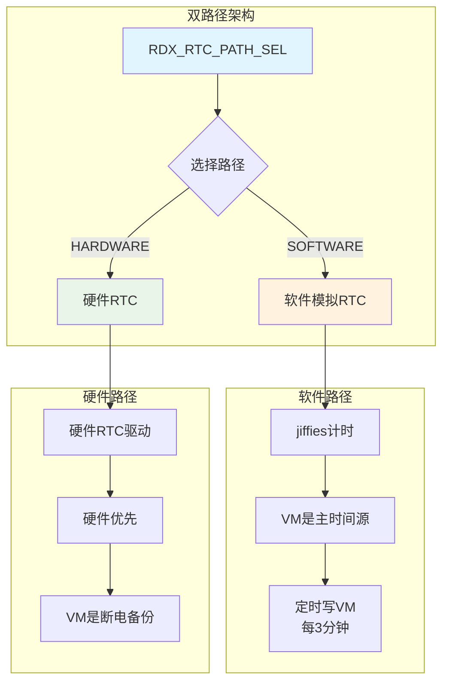

---

## 2. 硬件RTC架构

### 2.1 核心设计原则

**硬件优先，VM是断电备份**

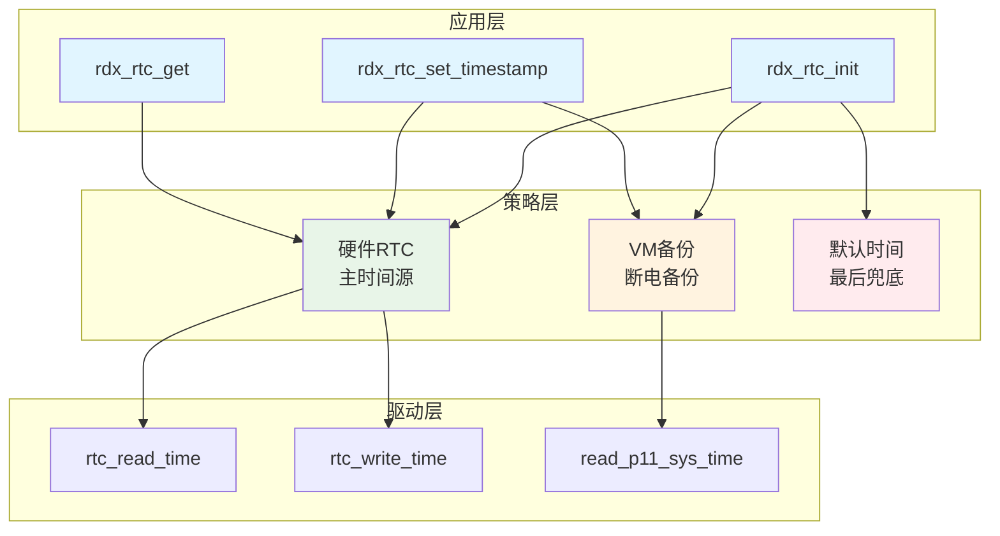

### 2.2 时间来源优先级

| 优先级 | 来源 | 使用场景 |
|--------|------|---------|
| 1 | 硬件RTC | 正常运行，硬件有效且时间可信 |
| 2 | VM备份 | 硬件无效（断电、电池耗尽）或硬件时间回退 |
| 3 | 默认时间 | 硬件无效且VM为空（首次使用） |

### 2.3 RTC 可信判定

硬件 RTC 可读、时间格式有效，**不代表时间就是对的**。嵌入式平台在软关机/低功耗/复位后，RTC 寄存器可能保留一个“看起来像有效时间”的旧值（例如 2002-09-14），这个值既不是默认值，也不是真正当前时间。极端情况下 RTC 也可能因为干扰跳变到未来（例如 2035 年）。

因此引入 **VM 一致性校验**：

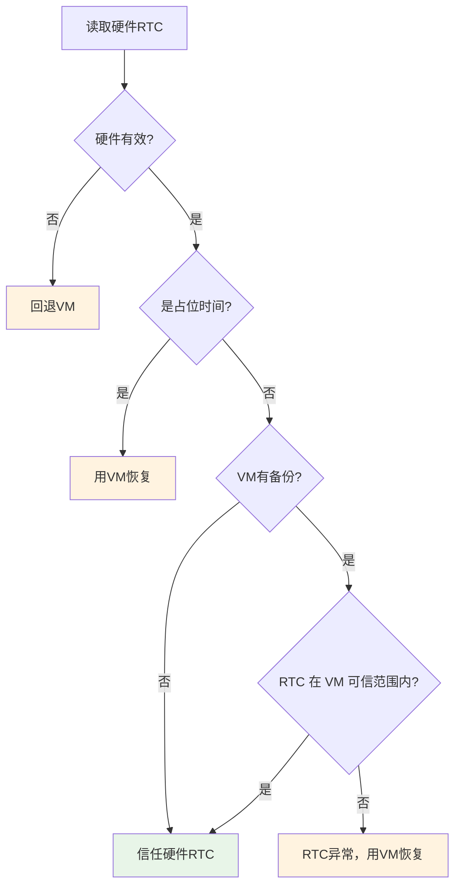

| 判定条件 | 动作 | 原因 |
|---------|------|------|
| 硬件无效 | 回退VM | 硬件本身不可用 |
| 硬件是占位时间 | 用VM恢复 | 硬件已被复位到默认值 |
| 硬件有效，VM无备份 | 信任硬件 | 没有更可信的参考 |
| 硬件有效，VM有备份，RTC 在 `[VM, VM+阈值]` 范围内 | 信任硬件 | 硬件在正常走时 |
| 硬件有效，VM有备份，RTC < VM | 用VM恢复 | 硬件时间回退，VM更可信 |
| 硬件有效，VM有备份，RTC > VM + 阈值 | 用VM恢复 | 硬件时间异常跳变到未来，VM更可信 |

**可信范围定义**：

```c
// 允许 RTC 比 VM 新的最大偏移量，当前为 1 年
#define RDX_RTC_MAX_DRIFT_SEC   (365 * 24 * 3600)

// VM 时间戳有效年份范围，超出则视为无效
#define RDX_RTC_VALID_YEAR_MIN  2000
#define RDX_RTC_VALID_YEAR_MAX  2099
```

即硬件 RTC 允许比 VM 备份新，但不能新超过 1 年。这个阈值覆盖：

- 正常走时累积（远小于 1 年）
- APP 设置时间时的小幅误差（通常秒级）
- 不会覆盖 RTC 正常前跳的场景

> **核心原则**：VM 备份代表系统曾经记录过的“可信时间”。只要 VM 中存在非零备份，硬件 RTC 就不应该显著偏离它。

---

## 3. 初始化流程（rdx_rtc_init）

### 3.1 流程图

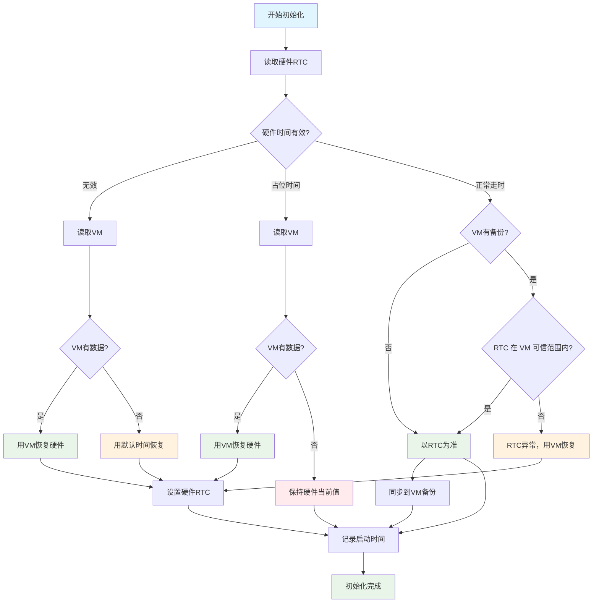

### 3.2 场景详解

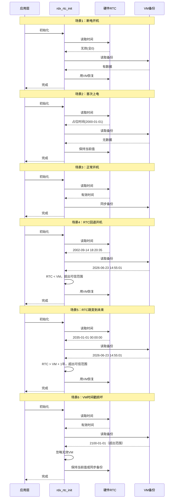

### 3.3 代码实现

> **注意**：当前实现假设单线程调用。如果在RTOS多任务环境下使用，需要添加互斥锁保护，参见 16.4节 多线程安全。

```c
void rdx_rtc_init(void)
{
    struct sys_time current_time = {0};
    time_t rtc_timestamp = 0;
    time_t vm_timestamp = 0;
    char utc_buf[32];

    rdx_rtc_read_hw_time(&current_time);
    
    if (!rdx_rtc_sys_time_valid(&current_time)) {
        // 场景1：硬件无效
        rtc_timestamp = rdx_rtc_read_vm_timestamp();
        if (rtc_timestamp == 0) {
            rtc_timestamp = rdx_rtc_sys_time_to_timestamp(&def_sys_time);
            g_printf("[RDX_RTC][HW] init: hw=invalid vm=empty use=DEFAULT\r");
        } else {
            rdx_rtc_timestamp_to_timezone_string(rtc_timestamp, RDX_RTC_TIMEZONE_OFFSET_SEC, utc_buf);
            g_printf("[RDX_RTC][HW] init: hw=invalid utc=%s src=VM\r", utc_buf);
        }
        rdx_rtc_set_timestamp(rtc_timestamp);
        rdx_rtc_read_hw_time(&current_time);
        
    } else if (rdx_rtc_is_init_placeholder_time(&current_time)) {
        // 场景2：硬件占位时间
        rtc_timestamp = rdx_rtc_read_vm_timestamp();
        if (rtc_timestamp != 0) {
            rdx_rtc_timestamp_to_timezone_string(rtc_timestamp, RDX_RTC_TIMEZONE_OFFSET_SEC, utc_buf);
            g_printf("[RDX_RTC][HW] init: hw=default utc=%s src=VM\r", utc_buf);
            rdx_rtc_set_timestamp(rtc_timestamp);
            rdx_rtc_read_hw_time(&current_time);
        } else {
            g_printf("[RDX_RTC][HW] init: hw=default vm=empty use=HW\r");
        }
        
    } else {
        // 场景3 / 场景4 / 场景5：硬件正常走时，但需校验是否在 VM 可信范围内
        vm_timestamp = rdx_rtc_read_vm_timestamp();
        rtc_timestamp = rdx_rtc_sys_time_to_timestamp(&current_time);

        if (vm_timestamp != 0 &&
            (rtc_timestamp < vm_timestamp ||
             (vm_timestamp <= (time_t)(-1) - RDX_RTC_MAX_DRIFT_SEC &&
              rtc_timestamp > vm_timestamp + RDX_RTC_MAX_DRIFT_SEC))) {
            // 场景4：RTC 回退；场景5：RTC 跳变到未来
            rdx_rtc_timestamp_to_timezone_string(rtc_timestamp, RDX_RTC_TIMEZONE_OFFSET_SEC, utc_buf);
            g_printf("[RDX_RTC][HW] init: hw=running rtc=%s but drift detected\r", utc_buf);
            rdx_rtc_timestamp_to_timezone_string(vm_timestamp, RDX_RTC_TIMEZONE_OFFSET_SEC, utc_buf);
            g_printf("[RDX_RTC][HW] init: hw=running utc=%s src=VM\r", utc_buf);
            if (rdx_rtc_set_timestamp(vm_timestamp) != 0) {
                g_printf("[RDX_RTC][HW] init: WARN: drift restore failed, keep VM backup\r");
            }
            rdx_rtc_read_hw_time(&current_time);
        } else {
            // 场景3：硬件正常走时
            rdx_rtc_timestamp_to_timezone_string(rtc_timestamp, RDX_RTC_TIMEZONE_OFFSET_SEC, utc_buf);
            g_printf("[RDX_RTC][HW] init: hw=running utc=%s src=RTC sync=VM\r", utc_buf);
            rdx_rtc_write_vm_timestamp(rtc_timestamp);
        }
    }

    rdx_rtc_capture_boot_time(&current_time);
}
```

#### 3.3.1 新增场景说明

| 场景 | 触发条件 | 处理逻辑 |
|------|---------|---------|
| 场景4：RTC回退 | 硬件有效、非占位、但 RTC < VM | 用 VM 恢复硬件，防止错误时间覆盖备份 |
| 场景5：RTC跳变到未来 | 硬件有效、非占位、但 RTC > VM + 1年 | 用 VM 恢复硬件，防止异常未来时间 |
| 场景6：VM时间戳损坏 | VM 时间超出 [2000, 2099] 范围 | 忽略 VM，回退到默认时间或信任硬件 |

#### 3.3.2 关键配置

```c
// 允许 RTC 比 VM 新的最大偏移量，当前为 1 年
#define RDX_RTC_MAX_DRIFT_SEC   (365 * 24 * 3600)

// VM 时间戳有效年份范围
#define RDX_RTC_VALID_YEAR_MIN  2000
#define RDX_RTC_VALID_YEAR_MAX  2099
```

#### 3.3.3 防御性增强

| 增强点 | 说明 |
|--------|------|
| VM 范围校验 | `rdx_rtc_read_vm_timestamp()` 会检查 VM 时间是否在 `[2000, 2099]` 内，超出则视为无效 |
| 溢出保护 | `vm_timestamp + RDX_RTC_MAX_DRIFT_SEC` 相加前检查 `time_t` 是否溢出 |
| 恢复失败告警 | `rdx_rtc_set_timestamp(vm_timestamp)` 返回非 0 时打印警告日志 |

> **关键点**：`vm_timestamp != 0` 必须前置判断。若 VM 为空（首次使用），VM 时间戳为 0，此时不应认为 RTC 回退，否则默认时间 `2000-01-01` 会错误覆盖任何有效 RTC。

---

## 4. 运行时读取（rdx_rtc_get）

### 4.1 设计原则

**硬件有效直接读取，不回退VM**

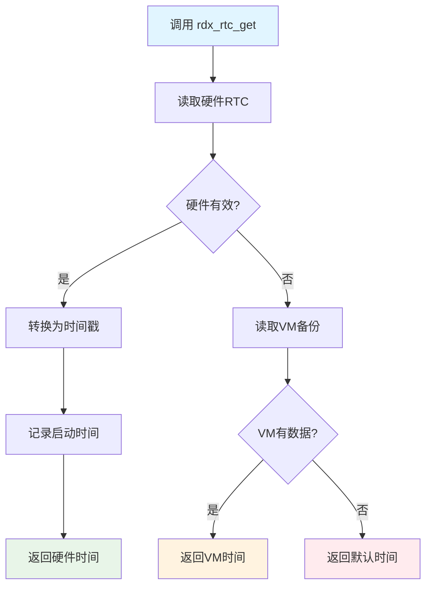

### 4.2 为什么get不处理占位时间（初始化时已处理）

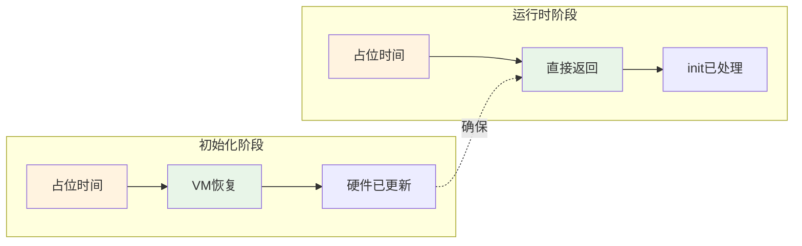

| 阶段 | 行为 | 原因 |
|------|------|------|
| init | 占位时间 → VM恢复 | 断电场景，恢复用户设置 |
| get | 占位时间 → 直接返回 | init已处理，get只管读 |

### 4.3 三级回退策略

运行时读取 `rdx_rtc_get` 的完整回退链：

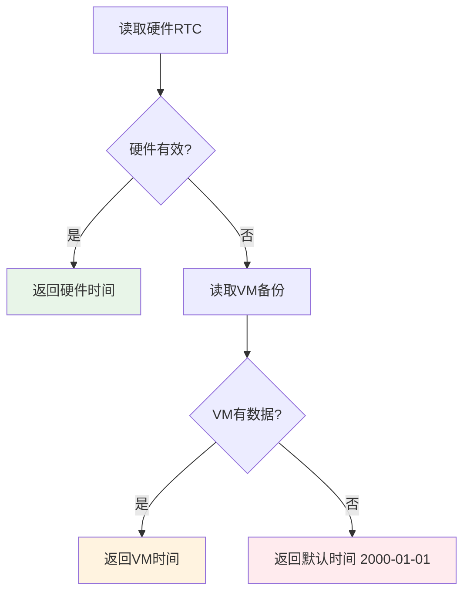

| 优先级 | 来源 | 触发条件 |
|--------|------|---------|
| 1 | 硬件RTC | 正常运行 |
| 2 | VM备份 | 硬件无效 |
| 3 | 默认时间 | 硬件无效且VM为空 |

### 4.4 代码实现

```c
time_t rdx_rtc_get(void)
{
    struct sys_time cur_time;
    time_t time_stamp;
    char utc_buf[32];

    memset(&cur_time, 0, sizeof(cur_time));

    rdx_rtc_read_hw_time(&cur_time);
    if (!rdx_rtc_sys_time_valid(&cur_time)) {
        // 硬件无效，回退VM；VM为空则回退默认时间
        time_stamp = rdx_rtc_read_vm_timestamp();
        if (time_stamp == 0) {
            time_stamp = rdx_rtc_sys_time_to_timestamp(&def_sys_time);
            g_printf("[RDX_RTC][HW] get: hw=invalid vm=empty use=DEFAULT\r");
        }
        rdx_rtc_timestamp_to_timezone_string(time_stamp, RDX_RTC_TIMEZONE_OFFSET_SEC, utc_buf);
        g_printf("[RDX_RTC][HW] utc=%s src=VM\r", utc_buf);
        return time_stamp;
    }

    // 硬件有效，直接使用
    time_stamp = rdx_rtc_sys_time_to_timestamp(&cur_time);

    if (!rdx_rtc_boot_time_valid) {
        rdx_rtc_capture_boot_time(&cur_time);
        if (rdx_rtc_boot_time_valid) {
            rdx_rtc_write_vm_timestamp(time_stamp);
        }
    }

    rdx_rtc_timestamp_to_timezone_string(time_stamp, RDX_RTC_TIMEZONE_OFFSET_SEC, utc_buf);
    g_printf("[RDX_RTC][HW] utc=%s src=RTC\r", utc_buf);
    return time_stamp;
}
```

---

## 5. VM备份机制

### 5.1 VM的作用

VM是**断电备份**，不是主时间源。

但这里有一个关键概念必须区分清楚：**VM 备份不能替代硬件 RTC 自身的关机保存机制**。

在带 P11/低功耗协处理器的 SoC（如杰理平台）上，RTC 硬件通常分两层：

| 层级 | 特点 | 是否需要关机保存 |
|------|------|----------------|
| 主系统维护的 RTC | 运行时在 P11 缓存或高速寄存器里 | 软关机前需要 flush 到掉电保持域 |
| 掉电保持域寄存器 | 软关机/待机时由备用电源维持 | 上电时真正被读取 |

`poweroff_save_rtc_time()` 是 SDK 提供的硬件层关机保存钩子，负责把运行时 RTC 状态同步到掉电保持域。如果注释掉它，主系统时间虽然正确，但软关机时这些状态没有落盘，上电后 RTC 可能读到：

- 上一次成功落盘的老时间
- 某个寄存器复位后的脏值
- P11 缓存和实际 RTC 寄存器不一致的值

这正是出现 2002 年、2035 年等异常 RTC 时间的根本原因。

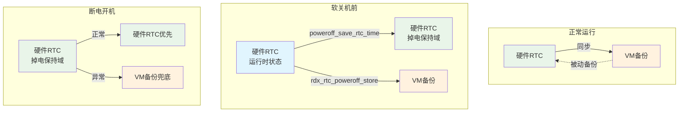

| 机制 | 责任 | 是否可互相替代 |
|------|------|---------------|
| `poweroff_save_rtc_time()` | 硬件 RTC 关机落盘 | 不可替代 |
| `rdx_rtc_poweroff_store()` | 应用层 VM 备份 | 不可替代 |

**最佳实践**：两者必须同时存在。硬件关机保存保证 RTC 本身准确，VM 备份作为硬件异常时的最后防线。

| 场景 | VM的角色 |
|------|---------|
| 正常运行 | 被动备份，硬件时间同步到VM |
| 断电开机 | 主时间源，恢复到硬件RTC |
| APP设置 | 双写（硬件+VM），确保任何路径都能恢复 |

### 5.2 VM写入时机

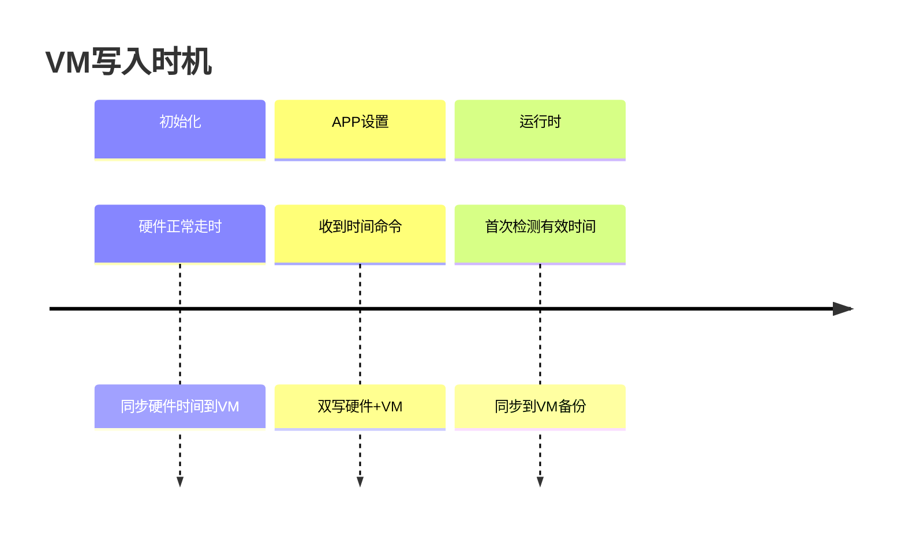

> **注意**：`timeline` 语法较新，部分Markdown渲染器不支持。如遇显示问题，请参考以下纯文本表格：

| 时机 | 触发条件 | 写入内容 | 适用路径 |
|------|---------|---------|---------|
| init | 硬件正常走时 | 硬件当前时间 | 硬件路径 |
| set | APP下发时间设置 | APP下发的时间戳，并回读校验 | 全部 |
| get | 首次检测到有效硬件时间 | 硬件当前时间 | 硬件路径 |
| 软关机 | `power_soff_callback` → `poweroff_save_rtc_time()` + `DO_PLATFORM_UNINITCALL()` → `rdx_rtc_poweroff_store()` | 硬件 RTC 状态落盘 + 当前时间到 VM | 硬件路径 |
| 进入IDLE | `rdx_app_idle_handle` 进入低功耗前 | 当前RTC时间 | 软件路径 |
| 充电准备 | `rdx_app_charge_prepare` 进入充电状态前 | 当前RTC时间 | 软件路径 |
| 恢复出厂设置 | 用户恢复默认参数后复位前 | 当前RTC时间 | 软件路径 |
| cpu_reset | 软件复位前 | 当前RTC时间 | **仅软件路径** |

> **说明**：
> - **软关机**时必须同时调用 `poweroff_save_rtc_time()` 和 `rdx_rtc_poweroff_store()`。
>   - `poweroff_save_rtc_time()` 是杰理 SDK 原生钩子，负责把运行时 RTC 状态同步到掉电保持域，**不可替代**。
>   - `rdx_rtc_poweroff_store()` 通过 `platform_uninitcall()` 在 `DO_PLATFORM_UNINITCALL()` 阶段执行，负责把当前时间写入 RDX 自定义的 VM ID（`VM_RDX_RTC_INIT_VALUE`），作为硬件异常时的兜底备份。
> - 如果误注释 `poweroff_save_rtc_time()`，软关机时 RTC 状态没有落盘，上电后可能读到 2002 年、2035 年等异常时间，只能依赖 VM 一致性校验兜底。
> - **进入IDLE** 是低功耗模式，不会走 `power_soff_callback`，所以软件路径下需要在进入 IDLE 前主动保存。
> - 硬件路径下 RTC 本身掉电保持，`poweroff_save_rtc_time()` 已保证其关机落盘，所以 cpu_reset / 充电准备 / 恢复出厂设置 / 进入 IDLE 都不需要额外写 VM；软件路径下 jiffies 会丢失，这些场景前都要保存。

### 5.3 持久化回读校验

APP 下发时间后，代码会分别回读硬件 RTC 和 VM，确认写入值与期望值一致：

```c
int hw_ok = (rdx_rtc_verify_hw_time(timestamp) == 0);
int vm_ok = (rdx_rtc_verify_vm_timestamp(timestamp) == 0);
return (hw_ok && vm_ok) ? 0 : -1;
```

| 校验项 | 说明 |
|--------|------|
| `rdx_rtc_verify_hw_time` | 回读硬件RTC，校验时间戳是否匹配 |
| `rdx_rtc_verify_vm_timestamp` | 回读VM，校验时间戳是否匹配 |
| 返回值 | 两者都成功返回0，否则返回-1 |

#### 注意：P11 缓存同步问题

在杰理（JL）平台中，硬件 RTC 写入后，P11 协处理器的缓存可能不会立即同步。如果回读校验时走 `read_p11_sys_time()`，可能在写入后几毫秒内读到旧值，导致误判为 MISMATCH。

**解决方案**：回读校验硬件 RTC 时直接调用 `rtc_read_time()` 读取 RTC 寄存器，不走 P11 缓存；正常运行读取时仍优先使用 `read_p11_sys_time()` 以保持效率。

```c
static int rdx_rtc_verify_hw_time(time_t expected)
{
    struct sys_time read_hw_time = {0};
    // ...
    rtc_read_time(&read_hw_time);  // 直接读寄存器，避免 P11 缓存延迟
    // ...
}
```

这是一个嵌入式 RTC 开发中的常见平台级坑点：写入和回读间隔很短时，必须确认读取路径是否经过缓存。

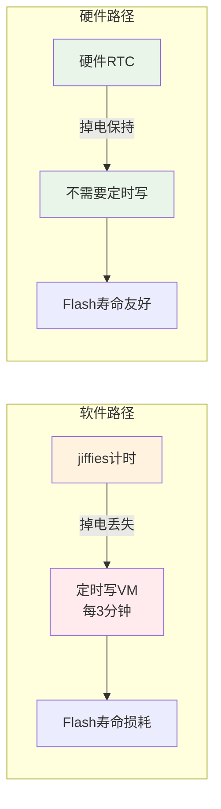

| 路径 | 定时写VM | 原因 |
|------|---------|------|
| 软件路径 | 每3分钟 | 基于jiffies，掉电丢失 |
| 硬件路径 | 不需要 | 硬件RTC掉电保持 |

---

## 6. APP下发时间校准

### 6.1 完整流程

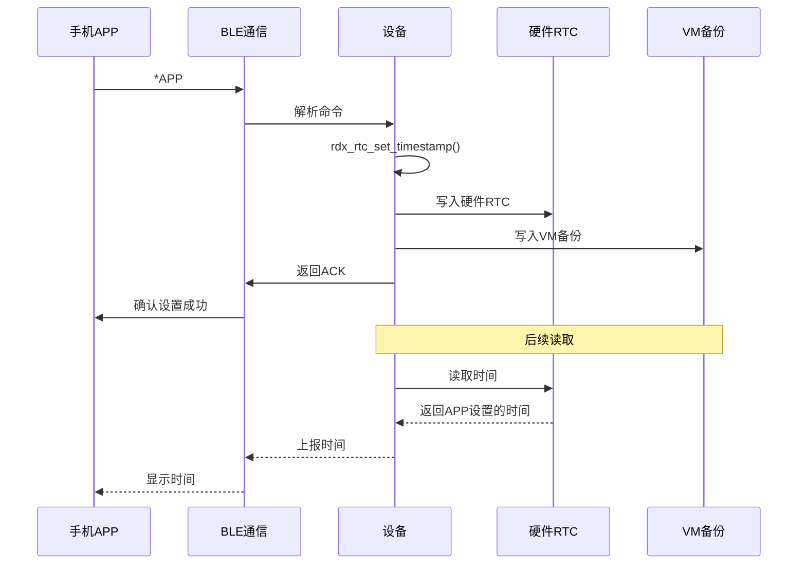

### 6.2 代码实现

```c
int rdx_rtc_set_timestamp(time_t timestamp)
{
    struct sys_time set_cur_time;
    char utc_buf[32];

    rdx_rtc_timestamp_to_timezone_string(timestamp, RDX_RTC_TIMEZONE_OFFSET_SEC, utc_buf);
    g_printf("[RDX_RTC][HW] set: utc=%s\r", utc_buf);

    rdx_rtc_timestamp_to_sys_time_value(timestamp, &set_cur_time);

    rdx_rtc_write_hw_time(&set_cur_time);    // 写入硬件RTC
    rdx_rtc_write_vm_timestamp(timestamp);     // 写入VM备份

    /* 回读校验，确保两条持久化路径都成功 */
    int hw_ok = (rdx_rtc_verify_hw_time(timestamp) == 0);
    int vm_ok = (rdx_rtc_verify_vm_timestamp(timestamp) == 0);

    return (hw_ok && vm_ok) ? 0 : -1;
}
```

### 6.3 时区处理


- APP下发的时间戳是**UTC时间**
- 日志显示使用 `rdx_rtc_timestamp_to_timezone_string` 转换为本地时间
- 当前时区硬编码为 UTC+8（`RDX_RTC_TIMEZONE_OFFSET_SEC = 8 * 3600`）
- 后续可支持动态时区（从APP或配置读取）

---

## 7. 占位时间检测

### 7.1 目的

区分"芯片默认时间"和"用户设置的真实时间"。

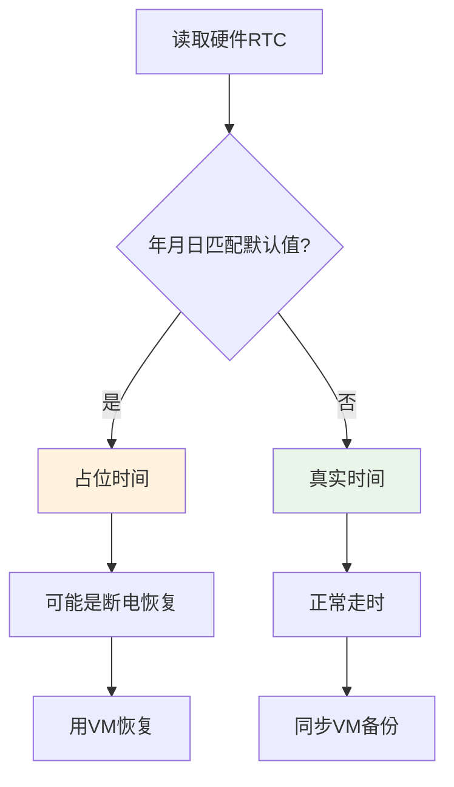

### 7.2 判断逻辑

```c
static int rdx_rtc_is_init_placeholder_time(const struct sys_time *sys_time)
{
    if (!rdx_rtc_sys_time_valid(sys_time)) {
        return 0;
    }

    // 只判断年月日是否匹配默认值
    return (sys_time->year == def_sys_time.year &&
            sys_time->month == def_sys_time.month &&
            sys_time->day == def_sys_time.day);
}
```

### 7.3 默认时间配置

| 配置项 | 值 | 说明 |
|--------|-----|------|
| `def_sys_time` | `2000-01-01 00:00:00` | 硬件RTC平台数据 |
| `RTC_DEFAULT_DATE_AND_TIME` | `"2000-01-01 00:00:00"` | 软件路径默认值 |

**为什么选择2000-01-01？**
- 工程中常见的RTC出厂默认值
- 远离当前时间，避免占位时间检测误判
- 与真实时间有明显区分度

### 7.4 误判风险说明

**场景**：用户在2000-01-01设置时间

**风险**：会被误判为占位时间，触发VM恢复

**权衡**：
- 真实用户不会设置2000年时间
- 产品场景中，2000-01-01只出现在：
  - 芯片出厂默认值
  - RTC电池耗尽后复位
  - 首次上电未设置时间

**结论**：此权衡基于产品实际使用场景，误判概率极低。如果业务场景确实需要支持2000年时间，可修改 `def_sys_time` 为更早的日期（如1980-01-01）。

---

## 8. 日志系统

### 8.1 日志架构

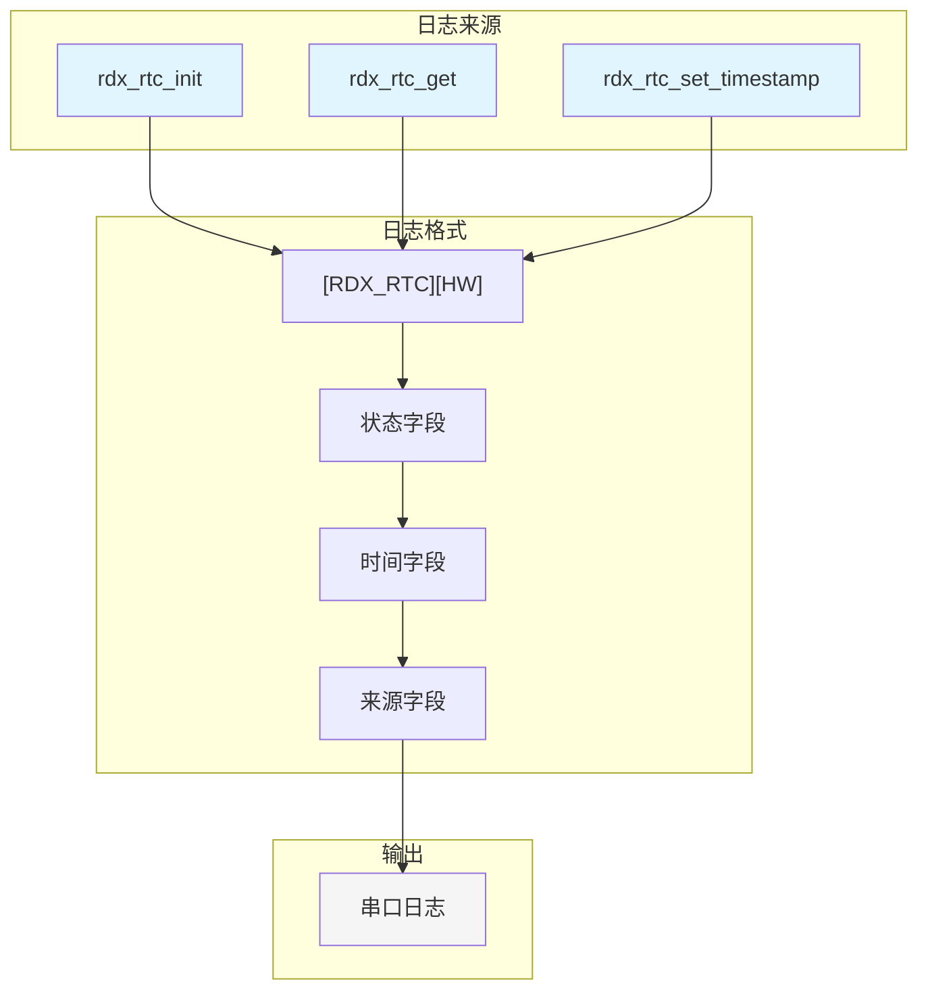

### 8.2 日志类型

| 日志来源 | 格式 | 示例 |
|---------|------|------|
| init | `init: hw=<状态> utc=<时间> src=<来源>` | `init: hw=default utc=2026-06-08 11:14:43 src=VM` |
| get | `utc=<时间> src=<来源>` | `utc=2026-06-08 11:15:17 src=RTC` |
| set | `set: utc=<时间>` | `set: utc=2026-06-09 15:25:08` |

### 8.3 状态说明

| 状态 | 含义 |
|------|------|
| `hw=invalid` | 硬件时间无效（全0或越界） |
| `hw=default` | 硬件是占位时间（2000-01-01） |
| `hw=running` | 硬件正常走时 |
| `src=RTC` | 时间来自硬件RTC |
| `src=VM` | 时间来自VM备份 |
| `use=DEFAULT` | 使用默认时间 |

---

## 9. 实际运行日志分析

### 9.1 断电开机场景

```
[00:00:00.207]rtc_read_sys_time: 2000-1-1 0:0:5
[00:00:01.906][RDX_RTC][HW] init: hw=default utc=2026-06-08 11:14:43 src=VM
[00:00:37.884][RDX_RTC][HW] utc=2026-06-08 11:15:17 src=RTC
```

```mermaid
timeline
    title 断电开机时间线
    section 00:00:00
        硬件RTC读取 : 2000-01-01 00:00:05 (默认值)
    section 00:00:01
        init检测 : hw=default
        VM恢复 : utc=2026-06-08 11:14:43
    section 00:00:37
        运行时读取 : utc=2026-06-08 11:15:17 (走时34秒)
```

> **备用表格**（如timeline无法渲染）：

| 时间 | 事件 | 说明 |
|------|------|------|
| 00:00:00 | 硬件RTC读取 | 2000-01-01 00:00:05 (默认值) |
| 00:00:01 | init检测 | hw=default |
| 00:00:01 | VM恢复 | utc=2026-06-08 11:14:43 |
| 00:00:37 | 运行时读取 | utc=2026-06-08 11:15:17 (走时34秒) |

**分析**：
1. 硬件RTC读取到默认值 `2000-01-01 00:00:05` → 断电场景
2. init检测到占位时间，用VM恢复 → `2026-06-08 11:14:43`
3. 后续读取直接走硬件RTC → `2026-06-08 11:15:17`（走时34秒）

### 9.2 APP校准场景

```
[00:01:14.973]======> *APP#rtc#1780989446# 
[RDX_RTC][HW] set: utc=2026-06-09 15:25:08
[00:01:15.862][RDX_RTC][HW] utc=2026-06-09 15:25:08 src=RTC
```

```mermaid
timeline
    title APP校准时间线
    section 00:01:14
        APP下发 : *APP#rtc#1780989446#
        设置时间 : utc=2026-06-09 15:25:08
    section 00:01:15
        运行时读取 : utc=2026-06-09 15:25:08 src=RTC
```

> **备用表格**（如timeline无法渲染）：

| 时间 | 事件 | 说明 |
|------|------|------|
| 00:01:14 | APP下发 | *APP#rtc#1780989446# |
| 00:01:14 | 设置时间 | utc=2026-06-09 15:25:08 |
| 00:01:15 | 运行时读取 | utc=2026-06-09 15:25:08 src=RTC |

**分析**：
1. APP下发UTC时间戳 `1780989446`
2. 设备设置到硬件RTC和VM
3. 后续读取使用APP设置的时间

---

## 10. 最佳实践总结

### 10.1 设计原则

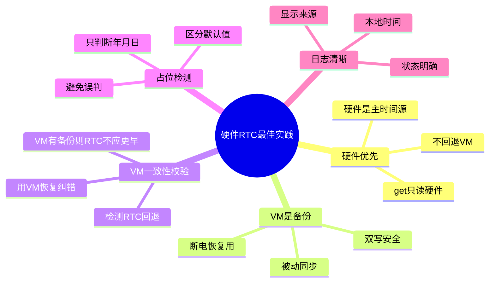

| 原则 | 实现 |
|------|------|
| 硬件优先 | get只读硬件，不回退VM |
| VM是备份 | 在断电、硬件无效、**RTC回退**时使用 |
| VM一致性校验 | init 时比较 RTC 与 VM，RTC < VM 或 RTC > VM + 阈值则用 VM 恢复 |
| VM值校验 | `rdx_rtc_read_vm_timestamp()` 校验年份在 `[2000, 2099]` 内，过滤 Flash 损坏 |
| 溢出保护 | drift 检测加法前校验 `time_t` 不溢出 |
| 恢复失败告警 | drift 恢复时检查 `set_timestamp` 返回值，失败输出警告 |
| 双写安全 | set同时写硬件+VM |
| 占位检测 | 区分默认值和真实时间 |
| 日志清晰 | 显示时间来源和状态 |

### 10.2 关键配置

```c
// 路径选择
#define RDX_RTC_PATH_SEL              RDX_RTC_PATH_HARDWARE

// 默认时间
#define RTC_DEFAULT_DATE_AND_TIME     "2000-01-01 00:00:00"

// 时区偏移（UTC+8）
#define RDX_RTC_TIMEZONE_OFFSET_SEC   (8 * 3600)
```

### 10.3 注意事项

| 项目 | 说明 |
|------|------|
| 时区处理 | 当前硬编码UTC+8，后续需支持动态时区 |
| 占位时间窗口 | 只判断年月日，不判断时分秒 |
| VM写入频率 | 硬件路径不需要定时写VM（软件路径需要） |
| 持久化校验 | APP下发时间后，硬件RTC和VM都会回读校验 |

---

## 11. 软件路径详解

### 11.1 软件路径架构

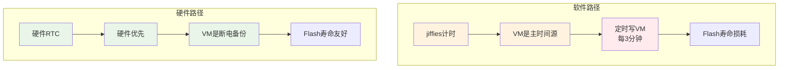

### 11.2 软件路径初始化流程

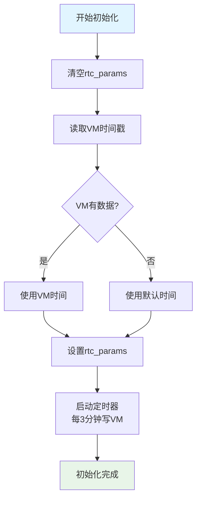

### 11.3 软件路径运行时读取

```mermaid
flowchart TD
    A[调用rdx_rtc_get] --> B{rtc_params.rtc_value == 0?}
    B -->|是| C[从VM读取]
    B -->|否| D[计算时间差]
    C --> D
    D --> E[返回时间戳]

    style A fill:#e1f5ff
    style E fill:#e8f5e8
```

```c
// 软件路径 get 实现
time_t rdx_rtc_get(void)
{
    unsigned long sys_timestamp = jiffies_msec();
    int ms_offset = 0;

    if (rtc_params.rtc_value == 0) {
        rtc_params.rtc_value = rdx_rtc_read_vm_timestamp();
        rtc_params.begin_msec = sys_timestamp;
    }

    if (rtc_params.rtc_value == 0) {
        return 0;
    }

    ms_offset = jiffies_msec2offset(rtc_params.begin_msec, sys_timestamp);
    return rtc_params.rtc_value + ms_offset / 1000;
}
```

### 11.4 软件路径与硬件路径对比

| 特性 | 软件路径 | 硬件路径 |
|------|---------|---------|
| 时间源 | jiffies（系统时钟） | 硬件RTC芯片 |
| 掉电保持 | 不保持 | 保持（电池供电） |
| VM角色 | 主时间源 | 断电备份 |
| 定时写VM | 每3分钟 | 不需要 |
| Flash损耗 | 较高 | 较低 |
| 精度 | 受系统负载影响 | 高精度（晶振） |
| 功耗 | 低（无额外硬件） | 较低（RTC芯片） |
| 适用场景 | 无RTC硬件的设备 | 有RTC硬件的设备 |

---

## 12. 时钟源选择与功耗

### 12.1 时钟源对比

```mermaid
graph TB
    subgraph "时钟源选项"
        A1[CLK_SEL_32K<br/>外部32K晶振]
        A2[CLK_SEL_LRC<br/>内部RC振荡器]
        A3[CLK_SEL_BTOSC<br/>蓝牙时钟分频]
    end

    subgraph "特性"
        B1[高精度<br/>低功耗]
        B2[低精度<br/>超低功耗]
        B3[中等精度<br/>共享时钟]
    end

    A1 --> B1
    A2 --> B2
    A3 --> B3

    style A1 fill:#e8f5e8
    style A2 fill:#fff3e0
    style A3 fill:#e1f5ff
```

| 时钟源 | 精度 | 功耗 | 适用场景 |
|--------|------|------|---------|
| `CLK_SEL_32K` | 高（±20ppm） | 低 | 需要高精度时间 |
| `CLK_SEL_LRC` | 低（±30%） | 超低 | 对精度要求不高 |
| `CLK_SEL_BTOSC` | 中等 | 中等 | 已有蓝牙时钟 |

### 12.2 当前配置

```c
// SDK/apps/earphone/include/app_config.h
#define RTC_CLK_RES_SEL  CLK_SEL_LRC  // 当前使用内部RC

// SDK/apps/earphone/device_config.c
RTC_DEV_PLATFORM_DATA_BEGIN(rtc_data)
    .default_sys_time = &def_sys_time,
    .default_alarm = &def_alarm,
    .rtc_clk = RTC_CLK_RES_SEL,
    .rtc_sel = HW_RTC,
    .cbfun = rtc_test_alarm_callback,
RTC_DEV_PLATFORM_DATA_END()
```

### 12.3 功耗优化建议

```mermaid
graph LR
    A[选择时钟源] --> B{需要高精度?}
    B -->|是| C[CLK_SEL_32K]
    B -->|否| D[CLK_SEL_LRC]
    C --> E[外部晶振成本]
    D --> F[内部RC省成本]

    style C fill:#e8f5e8
    style D fill:#fff3e0
```

| 优化项 | 建议 | 说明 |
|--------|------|------|
| 时钟源选择 | CLK_SEL_LRC | 对精度要求不高时使用 |
| 外部晶振 | 32.768KHz | 需要高精度时使用 |
| 电池选择 | CR2032 | 常见RTC备用电池 |
| 低功耗模式 | 支持 | RTC独立供电，主芯片休眠时仍走时 |
| VM一致性校验 | 开启 | 防止RTC在软关机/复位后时间回退 |

---

## 13. 编译配置与切换

### 13.1 路径切换

```mermaid
graph TB
    A[选择路径] --> B{需要硬件RTC?}
    B -->|是| C[RDX_RTC_PATH_HARDWARE]
    B -->|否| D[RDX_RTC_PATH_SOFTWARE]
    C --> E[硬件优先策略]
    D --> F[VM主时间源策略]

    style C fill:#e8f5e8
    style D fill:#fff3e0
```

**方法1：修改默认配置（全局生效）**

```c
// SDK/apps/common/third_party_profile/rdx_protocol/rdx_app_config.h
#define RDX_RTC_PATH_SEL  RDX_RTC_PATH_HARDWARE  // 改为硬件路径
// 或
#define RDX_RTC_PATH_SEL  RDX_RTC_PATH_SOFTWARE  // 改为软件路径
```

**方法2：Board级配置（针对特定板子）**

```c
// SDK/apps/earphone/board/br28/board_xxx_cfg.h
#define RDX_RTC_PATH_SEL  RDX_RTC_PATH_HARDWARE  // 覆盖默认配置
```

**方法3：编译命令行（临时测试）**

```bash
# 硬件路径
make RDX_RTC_PATH_SEL=1

# 软件路径
make RDX_RTC_PATH_SEL=0
```

### 13.2 时区配置

```c
// SDK/apps/common/third_party_profile/rdx_protocol/rdx_rtc.c
#define RDX_RTC_TIMEZONE_OFFSET_SEC  (8 * 3600)  // UTC+8

// 修改为其他时区
#define RDX_RTC_TIMEZONE_OFFSET_SEC  (9 * 3600)  // UTC+9 (日本)
#define RDX_RTC_TIMEZONE_OFFSET_SEC  (0)          // UTC+0 (伦敦)
#define RDX_RTC_TIMEZONE_OFFSET_SEC  (-5 * 3600) // UTC-5 (纽约)
```

### 13.3 默认时间配置

```c
// 硬件RTC默认时间
// SDK/apps/earphone/device_config.c
const struct sys_time def_sys_time = {
    .year = 2000,
    .month = 1,
    .day = 1,
    .hour = 0,
    .min = 0,
    .sec = 0,
};

// 软件路径默认时间
// SDK/apps/common/third_party_profile/rdx_protocol/rdx_rtc.c
#define RTC_DEFAULT_DATE_AND_TIME  "2000-01-01 00:00:00"
```

---

## 14. 测试方法

### 14.1 单元测试

```c
// SDK/apps/earphone/rtc_test.c
// RTC测试模块，包含以下测试项：

// Test1: RTC时间读取
// Test2: RTC时间写入
// Test3: 走时精度验证
// Test4: 闹钟功能验证
// Test5: 工具函数验证
```

### 14.2 测试配置

```c
// SDK/apps/earphone/include/app_config.h
#define RTC_TEST_ENABLE  0  // 关闭测试（生产环境）
// #define RTC_TEST_ENABLE  1  // 开启测试（开发环境）
```

### 14.3 手动测试流程

```mermaid
flowchart TD
    A[开始测试] --> B[检查init日志]
    B --> C{日志正常?}
    C -->|是| D[等待APP连接]
    C -->|否| E[检查硬件连接]
    D --> F[APP下发时间]
    F --> G[检查set日志]
    G --> H{时间正确?}
    H -->|是| I[断电重启]
    H -->|否| J[检查时区配置]
    I --> K[检查VM恢复]
    K --> L{时间保持?}
    L -->|是| M[测试通过]
    L -->|否| N[检查电池电压]

    style A fill:#e1f5ff
    style M fill:#e8f5e8
    style E fill:#ffebee
    style J fill:#ffebee
    style N fill:#ffebee
```

### 14.4 测试用例

| 测试项 | 步骤 | 预期结果 |
|--------|------|---------|
| 初始化 | 上电开机 | 日志显示 `hw=default` 或 `hw=running` |
| APP校准 | 连接APP下发时间 | 日志显示 `set: utc=xxx`，时间正确 |
| 断电保持 | 断电重启 | 日志显示 `src=VM`，时间恢复 |
| 走时精度 | 等待1小时 | 误差 < 1秒（32K晶振）或 < 1分钟（LRC） |
| 无效时间 | 清除VM和电池 | 使用默认时间 `2000-01-01` |
| RTC回退校验 | APP校准后关机，等待RTC出现回退，再开机 | init 检测到 `RTC < VM`，用 VM 恢复，日志显示 `src=VM` |
| RTC跳变到未来校验 | 手动构造 RTC 未来时间（如 2035 年），VM 为正常时间 | init 检测到 `RTC > VM + 1年`，用 VM 恢复，日志显示 `src=VM` |
| VM 损坏校验 | 手动向 VM 写入超出范围的时间戳（如 2100 年），再开机 | `rdx_rtc_read_vm_timestamp()` 返回 0，日志显示 `vm timestamp out of valid range`，回退到默认时间或信任硬件 |

---

## 15. 常见问题与解决方案

### 15.1 问题排查流程

```mermaid
flowchart TD
    A[RTC异常] --> B{init日志?}
    B -->|无日志| C[检查RTC驱动初始化]
    B -->|有日志| D{日志内容?}
    D -->|hw=invalid| E[检查硬件连接<br/>检查电池电压]
    D -->|hw=default| F[检查VM数据<br/>检查电池断电]
    D -->|hw=running| G[检查get日志]
    G --> H{src=?}
    H -->|src=VM| I[硬件可能失效<br/>检查RTC寄存器]
    H -->|src=RTC| J[正常工作]

    style A fill:#ffebee
    style J fill:#e8f5e8
    style C fill:#ffebee
    style E fill:#ffebee
    style F fill:#fff3e0
    style I fill:#fff3e0
```

### 15.2 常见问题列表

| 问题 | 可能原因 | 解决方案 |
|------|---------|---------|
| init无日志 | RTC驱动未初始化 | 检查 `TCFG_APP_RTC_EN` 配置 |
| 时间始终是2000-01-01 | 电池耗尽/未安装 | 更换电池或检查VBAT供电 |
| 时间不准（LRC） | LRC精度低 | 改用32K晶振 |
| 断电后时间丢失 | VM未同步 | 检查 `rdx_rtc_write_vm_timestamp` 调用 |
| APP下发不生效 | 时区配置错误 | 检查 `RDX_RTC_TIMEZONE_OFFSET_SEC` |
| get返回VM时间 | 硬件RTC失效 | 检查 `rdx_rtc_read_hw_time` 返回值 |
| 占位时间误判 | 默认时间接近真实时间 | 修改 `def_sys_time` 为更早的日期 |
| 关机后再开机时间回退 | RTC 在软关机期间丢失，`poweroff_save_rtc_time()` 被误注释 | 恢复 `poweroff_save_rtc_time()` 调用，并启用 VM 一致性校验 |
| 关机后再开机时间跳到未来 | RTC 寄存器异常跳变 | 启用 VM 一致性校验（RTC > VM + 1 年则用 VM 恢复） |
| VM 时间戳异常（如 2100 年） | Flash bit-flip 或写入中断导致 VM 数据损坏 | `rdx_rtc_read_vm_timestamp()` 自动校验年份范围，超出 `[2000, 2099]` 则视为无效，回退到默认时间或信任硬件 |
| drift 恢复失败 | 硬件 RTC 写入校验不通过 | init 日志输出 `WARN: drift restore failed, keep VM backup`，VM 备份保持不变 |

### 15.3 调试技巧

```c
// 1. 开启详细日志
#define RTC_DEBUG_ENABLE  1

// 2. 手动读取硬件RTC
struct sys_time current_time;
rtc_read_time(&current_time);
printf("HW RTC: %04d-%02d-%02d %02d:%02d:%02d\r\n",
       current_time.year, current_time.month, current_time.day,
       current_time.hour, current_time.min, current_time.sec);

// 3. 手动读取VM时间戳
time_t vm_timestamp = 0;
syscfg_read(VM_RDX_RTC_INIT_VALUE, &vm_timestamp, sizeof(vm_timestamp));
printf("VM timestamp: %ld\r\n", (long)vm_timestamp);

// 4. 检查电池电压（如果有ADC）
int voltage = get_battery_voltage();
printf("Battery: %d mV\r\n", voltage);
```

---

## 16. 扩展建议

### 16.1 动态时区支持

```c
// 从VM读取时区（持久化存储）
int rdx_rtc_get_timezone_offset(void)
{
    int offset = 0;
    
    // 1. 从VM读取用户设置的时区
    if (syscfg_read(VM_RTC_TIMEZONE, &offset, sizeof(offset)) == sizeof(offset)) {
        // 验证时区范围（-12h ~ +14h）
        if (offset >= -43200 && offset <= 50400) {
            return offset;
        }
    }
    
    // 2. 使用默认时区
    return RDX_RTC_TIMEZONE_OFFSET_SEC;
}

// APP下发时区命令
case PROTOCOL_EVENT_CMD_TIMEZONE: {
    int timezone_offset = *(int*)data;
    // 验证时区范围（-12h ~ +14h）
    if (timezone_offset >= -43200 && timezone_offset <= 50400) {
        syscfg_write(VM_RTC_TIMEZONE, &timezone_offset, sizeof(timezone_offset));
        g_printf("[RDX_RTC] timezone updated: %d sec\r", timezone_offset);
    } else {
        g_printf("[RDX_RTC] invalid timezone: %d sec\r", timezone_offset);
    }
    break;
}

// 使用动态时区
rdx_rtc_timestamp_to_timezone_string(timestamp, rdx_rtc_get_timezone_offset(), utc_buf);
```

### 16.2 电池状态检测

```c
// 检测RTC电池状态
typedef enum {
    RTC_BATTERY_OK = 0,
    RTC_BATTERY_LOW,
    RTC_BATTERY_DEAD,
} rtc_battery_status_t;

rtc_battery_status_t rdx_rtc_check_battery(void)
{
    struct sys_time hw_time;
    rdx_rtc_read_hw_time(&hw_time);
    
    // 如果硬件时间无效，可能电池耗尽
    if (!rdx_rtc_sys_time_valid(&hw_time)) {
        return RTC_BATTERY_DEAD;
    }
    
    // 如果是默认时间，可能电池断过
    if (rdx_rtc_is_init_placeholder_time(&hw_time)) {
        return RTC_BATTERY_LOW;
    }
    
    return RTC_BATTERY_OK;
}
```

### 16.3 精度校准

```c
// LRC校准（需要硬件支持）
void rdx_rtc_calibrate_lrc(void)
{
    struct _rtc_trim rtc_trim;
    get_lrc_rtc_trim(&rtc_trim);
    // 应用校准参数
    // ...
}

// 温度补偿（高级功能）
void rdx_rtc_temperature_compensation(int temperature)
{
    // 根据温度调整RTC计数器
    // 温度越高，晶振频率越低
    // 需要硬件支持温度传感器
}
```

### 16.4 多线程安全

```c
// 如果RTOS支持多任务，需要考虑线程安全
// 当前实现是单线程安全的，因为：
// 1. rdx_rtc_init() 在系统启动时调用一次
// 2. rdx_rtc_get() 只读操作，无竞争
// 3. rdx_rtc_set_timestamp() 由APP任务串行调用

// 如果需要多线程保护，可以添加互斥锁
static OS_MUTEX rtc_mutex;

void rdx_rtc_init(void)
{
    os_mutex_create(&rtc_mutex);
    // ...
}

time_t rdx_rtc_get(void)
{
    os_mutex_pend(&rtc_mutex, 0);
    time_t timestamp = /* 读取逻辑 */;
    os_mutex_post(&rtc_mutex);
    return timestamp;
}
```

---

## 17. 参考文档

- `SDK/interface/driver/device/rtc/rtc_dev.h` - RTC驱动接口
- `SDK/apps/earphone/device_config.c` - RTC平台数据配置
- `SDK/apps/common/third_party_profile/rdx_protocol/rdx_rtc.c` - RDX RTC实现
- `SDK/apps/earphone/include/app_config.h` - RTC配置宏定义
- `SDK/apps/earphone/rtc_test.c` - RTC测试模块

---

## 附录A：文件结构

```
SDK/
├── interface/driver/device/rtc/
│   └── rtc_dev.h                 # RTC驱动接口
├── apps/earphone/
│   ├── device_config.c           # RTC平台数据配置
│   ├── rtc_test.c                # RTC测试模块
│   └── include/
│       ├── app_config.h          # RTC配置宏
│       └── rtc_test.h            # RTC测试头文件
└── apps/common/third_party_profile/rdx_protocol/
    ├── rdx_rtc.c                 # RDX RTC实现
    ├── rdx_rtc.h                 # RDX RTC头文件
    └── rdx_app_config.h          # RDX应用配置
```

---

## 附录B：关键宏定义汇总

| 宏 | 位置 | 说明 |
|----|------|------|
| `RDX_RTC_PATH_SEL` | rdx_app_config.h | 路径选择（0=软件，1=硬件） |
| `RDX_RTC_TIMEZONE_OFFSET_SEC` | rdx_rtc.c | 时区偏移（秒） |
| `RTC_DEFAULT_DATE_AND_TIME` | rdx_rtc.c | 软件路径默认时间 |
| `RDX_RTC_MAX_DRIFT_SEC` | rdx_rtc.c | 硬件路径下，RTC 与 VM 的最大允许偏差（秒），当前为 1 年 |
| `RDX_RTC_VALID_YEAR_MIN` | rdx_rtc.c | VM 时间戳有效年份下限 |
| `RDX_RTC_VALID_YEAR_MAX` | rdx_rtc.c | VM 时间戳有效年份上限 |
| `def_sys_time` | device_config.c | 硬件RTC默认时间 |
| `TCFG_APP_RTC_EN` | board_xxx_cfg.h | RTC功能开关 |
| `RTC_CLK_RES_SEL` | app_config.h | 时钟源选择 |
| `RTC_TEST_ENABLE` | app_config.h | 测试功能开关 |

---

**文档版本**：v1.6
**最后更新**：2026-06-23  
**作者**：Felix Wang