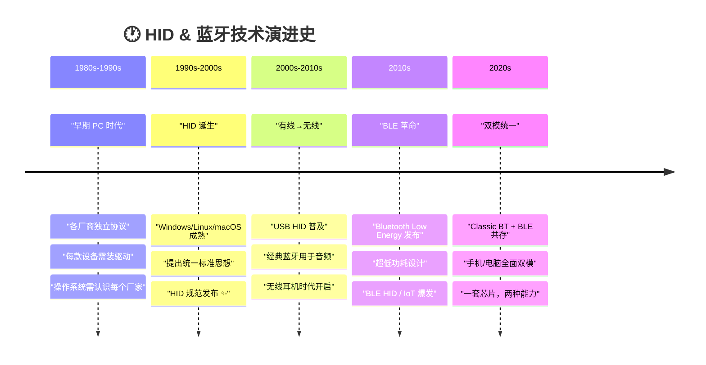
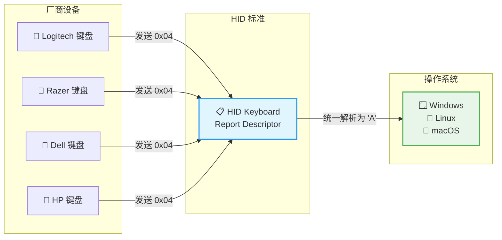
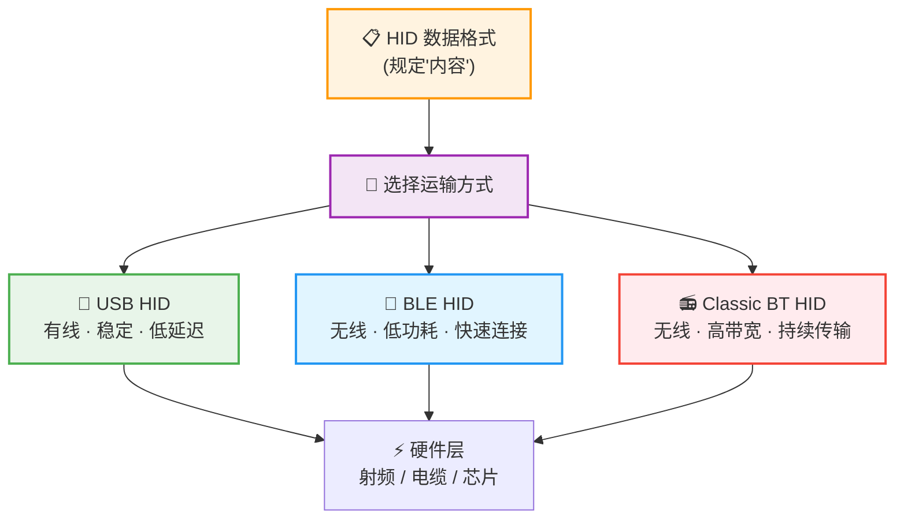
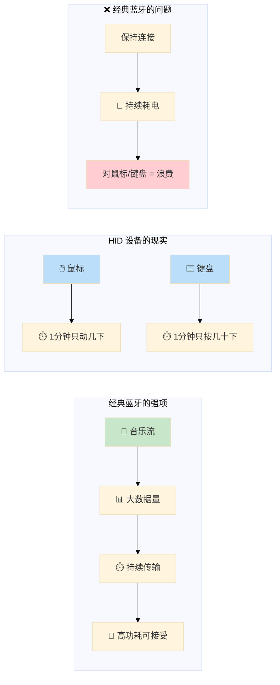
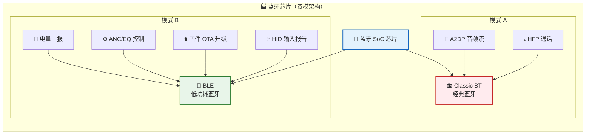
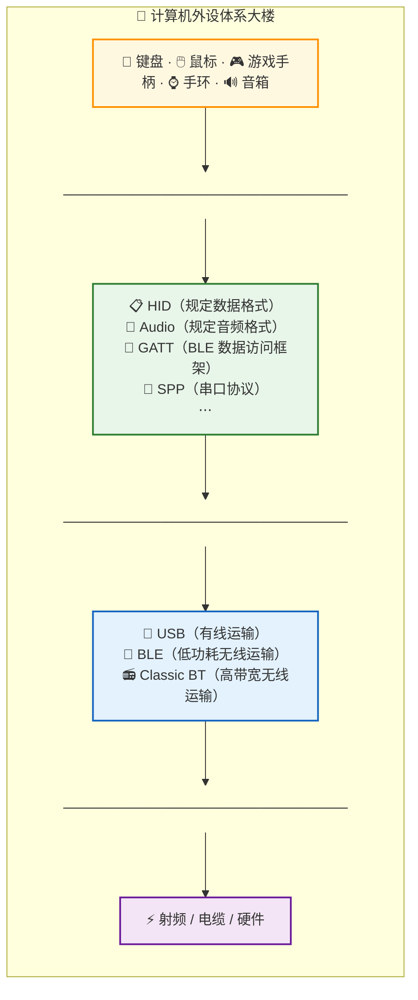
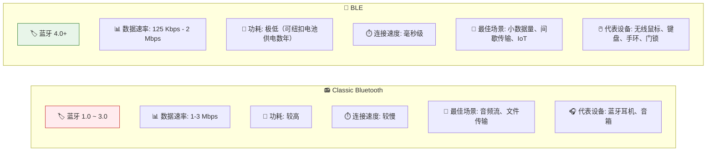
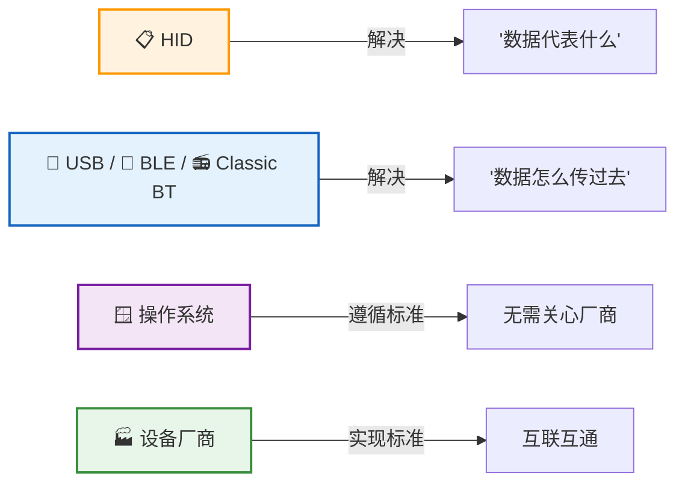

# 🖱️ BLE、HID 与蓝牙：从混沌到统一的演进之路

> **HID 是"语言"，USB / BLE / 经典蓝牙是"交通工具"。**  
> 操作系统和外设只要遵循同一种语言，无论通过哪种交通工具传输，都能正确理解彼此。

---

## 📑 目录

- [核心概念速览](#-核心概念速览)
- [演进时间线](#-演进时间线)
- [六阶段完整演进](#六阶段完整演进)
  - [第一阶段：混沌初开——没有统一标准](#第一阶段混沌初开没有统一标准)
  - [第二阶段：操作系统成熟——"我只关心你是什么"](#第二阶段操作系统成熟我只关心你是什么)
  - [第三阶段：HID 诞生——数据格式的统一](#第三阶段hid-诞生数据格式的统一)
  - [第四阶段：运输层的分化——HID 只是内容规范](#第四阶段运输层的分化hid-只是内容规范)
  - [第五阶段：BLE 登场——低功耗革命](#第五阶段ble-登场低功耗革命)
  - [第六阶段：双模蓝牙——鱼与熊掌兼得](#第六阶段双模蓝牙鱼与熊掌兼得)
- [体系架构全景图](#-体系架构全景图)
- [经典蓝牙 vs BLE 对比](#-经典蓝牙-vs-ble-对比)
- [一句话总结](#-一句话总结)

---

## 🎯 核心概念速览

| 概念 | 全称 | 职责 | 类比 |
|:---:|:---:|:---|:---|
| **HID** | Human Interface Device | 规定「数据代表什么」——键盘、鼠标、手柄的数据格式标准 | 📖 **语言** |
| **USB** | Universal Serial Bus | 有线传输数据 | 🚚 **卡车** |
| **BLE** | Bluetooth Low Energy | 低功耗无线传输，适合小数据量间歇传输 | 🛵 **电动车** |
| **Classic BT** | Classic Bluetooth | 传统蓝牙，适合持续大数据流传输 | 🚂 **火车** |
| **双模蓝牙** | Dual-Mode | 同时支持 Classic BT + BLE | 🚚🛵 **混合车队** |
| **GATT** | Generic Attribute Profile | BLE 的数据访问框架，BLE HID 建立在它之上 | 📦 **包裹服务** |

---

## ⏳ 演进时间线



---

## 六阶段完整演进

### 第一阶段：混沌初开——没有统一标准

最开始，计算机外设世界一片混乱：

```
计算机
 ├── 🎹 键盘（厂家 A）── 通信协议：0x13 0x56 0xAA
 ├── 🖱️ 鼠标（厂家 B）── 通信协议：0x99 0x20 0x31
 ├── 🖨️ 打印机（厂家 C）── 通信协议：???
 └── 🎮 游戏手柄（厂家 D）── 通信协议：???
```

> 每一家厂商都有自己的通信方式。  
> 按下同一个键 `'A'`，厂家 A 和厂家 B 发送的数据完全不同。

**操作系统只能这样处理：**

```c
if (设备 == "厂家A") {
    按厂家A的格式解析;
} else if (设备 == "厂家B") {
    按厂家B的格式解析;
} else if (设备 == "厂家C") {
    按厂家C的格式解析;
}
// ... 重复上千次
```

> ⚠️ **这就是早期为什么每款设备都要安装驱动——因为没有统一标准。**

---

### 第二阶段：操作系统成熟——"我只关心你是什么"

后来，Windows、Linux、macOS 逐渐成熟。这些操作系统开始思考一个问题：

> 🤔 **我为什么要认识几千家外设厂商？**

操作系统只关心：
- 这是**键盘**
- 这是**鼠标**
- 这是**游戏手柄**

> **至于谁生产的，我不关心。**

于是诞生了一个核心思想：

> 💡 **大家不要告诉我你是谁，只告诉我你是什么。**

---

### 第三阶段：HID 诞生——数据格式的统一

**HID（Human Interface Device）** 应运而生。它只做了一件事：

> 📋 **如果你说自己是键盘，那么数据必须这样发送。**

#### HID 键盘数据格式示例

```
┌────────┬────────┬────────┬────────┬────────┬────────┬────────┬────────┐
│ Byte 0 │ Byte 1 │ Byte 2 │ Byte 3 │ Byte 4 │ Byte 5 │ Byte 6 │ Byte 7 │
├────────┼────────┼────────┼────────┼────────┼────────┼────────┼────────┤
│ 修饰键  │  保留  │ KeyCode│ KeyCode│ KeyCode│ KeyCode│ KeyCode│ KeyCode│
│Ctrl/Alt│  0x00  │  #1    │  #2    │  #3    │  #4    │  #5    │  #6    │
│Shift/GUI│       │        │        │        │        │        │        │
└────────┴────────┴────────┴────────┴────────┴────────┴────────┴────────┘
```

- 当 `KeyCode = 0x04` → 所有电脑都知道这是 **`'A'`**
- 无论设备来自 **罗技**、**雷蛇**、**Dell** 还是 **HP**，都必须遵守

> ✅ **Windows 根本不用知道这是哪一家，只知道 "这是 HID Keyboard"。**



---

### 第四阶段：运输层的分化——HID 只是内容规范

> ⚠️ **关键认知：HID 只规定了数据长什么样，没有规定怎么送。**

同一个 `'A'`，可以：

| 运输方式 | 介质 | 特点 |
|:---:|:---:|:---|
| ✈️ 坐飞机 | 无线射频 | 蓝牙 |
| 🚄 坐火车 | USB 线缆 | 即插即用 |
| 🚴 骑自行车 | 串口 | 早期方式 |

> 内容一样，运输方式不同。

#### 三种主流传输方式



**所以真正关系是：**

```
        📋 数据内容（HID 规定）
              │
         ┌────┴────┐
         │    │    │
       USB   BLE  Classic BT
      🔌    📡     📻
         │    │    │
         └────┼────┘
           🚚 发送数据
```

> **USB HID、BLE HID、Bluetooth HID —— 其实都是同一个 HID，只是运输工具不同。**

---

### 第五阶段：BLE 登场——低功耗革命

#### 为什么需要 BLE？

经典蓝牙擅长音频流式传输（🎧 耳机），但 HID 设备的数据特征完全不同：



#### BLE 的设计目标

Bluetooth SIG 重新设计了 **BLE（Bluetooth Low Energy）**：

| 特性 | 说明 |
|:---:|:---|
| 🔋 **功耗极低** | 一颗纽扣电池可用数年 |
| ⚡ **连接快速** | 毫秒级连接建立 |
| 📦 **小数据传输** | 完美匹配 HID 设备的工作模式 |
| 🌐 **为 IoT 而生** | 传感器、手环、门锁的理想选择 |

> 于是：鼠标 → **BLE HID**、键盘 → **BLE HID**、手环 → **BLE**、门锁 → **BLE**

---

### 第六阶段：双模蓝牙——鱼与熊掌兼得

#### 新的用户需求

用户希望耳机：
- 🎵 **播放音乐** → 需要 **经典蓝牙**（高带宽持续传输）
- 📱 **APP 控制** → 查看电量、ANC、EQ、升级固件 → 需要 **BLE**（低功耗控制通道）

#### 解决方案：双模芯片



> **现在：手机、电脑、平板、蓝牙 SoC —— 几乎都是双模。**

---

## 🏢 体系架构全景图

你可以把整个体系理解成一栋楼：



> 📌 **Note:** GATT 并非与 HID、Audio、SPP 完全平级的"应用协议"。对于 BLE 来说，GATT 更像是 BLE 提供的数据访问框架，BLE HID 就是建立在 GATT 之上的一种 Profile；而 USB HID 则建立在 USB 总线之上。不同总线有不同的承载方式，但都可以实现 HID 这套设备规范。

---

## 📊 经典蓝牙 vs BLE 对比



| 维度 | 📻 Classic BT | 📡 BLE |
|:---:|:---:|:---:|
| **蓝牙版本** | 1.0 ~ 3.0 | 4.0+ |
| **数据速率** | 1–3 Mbps | 125 Kbps – 2 Mbps |
| **功耗** | 🔴 较高（持续连接耗电） | 🟢 极低（纽扣电池可用数年） |
| **连接速度** | 🟡 较慢（秒级） | 🟢 毫秒级 |
| **传输模式** | 持续流式 | 间歇小包 |
| **最佳场景** | 🎵 音频、📁 文件传输 | 🖱️ HID、🌡️ 传感器、🏠 IoT |
| **代表设备** | 耳机、音箱、车载 | 鼠标、键盘、手环、门锁 |

---

## 📝 一句话总结

整个计算机行业的发展，本质上就是**分层和标准化**：



| 角色 | 职责 | 核心问题 |
|:---:|:---|:---|
| **HID** | 规定数据格式标准 | "数据代表什么？" |
| **USB / BLE / Classic BT** | 提供传输通道 | "数据怎么传过去？" |
| **操作系统** | 遵循标准解析 | 不需要关心具体厂商 |
| **设备厂商** | 实现相应标准 | 产品与所有系统互联互通 |

> 💡 **最终洞察：HID 是"语言"，USB / BLE / 经典蓝牙是"交通工具"。操作系统和外设只要都遵循同一种语言，无论通过哪种交通工具传输，都能够正确理解彼此。**

---

*本文档采用 Mermaid 图表增强可读性，建议使用支持 Mermaid 渲染的 Markdown 阅读器（如 VS Code、Typora、GitHub）查看完整效果。*
