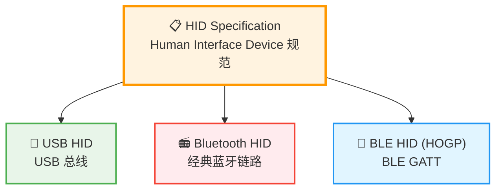
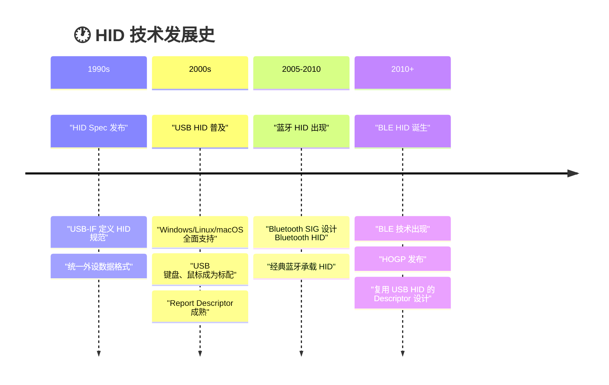
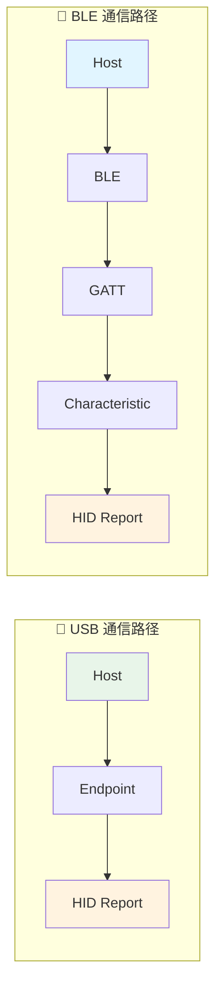
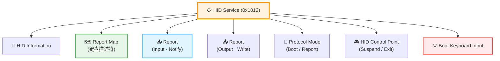
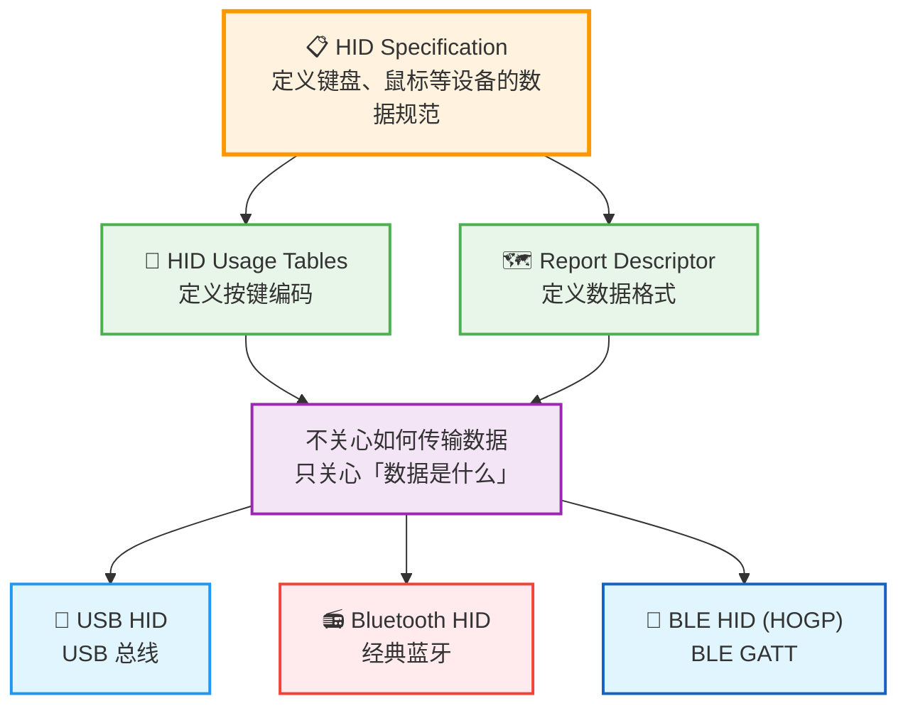
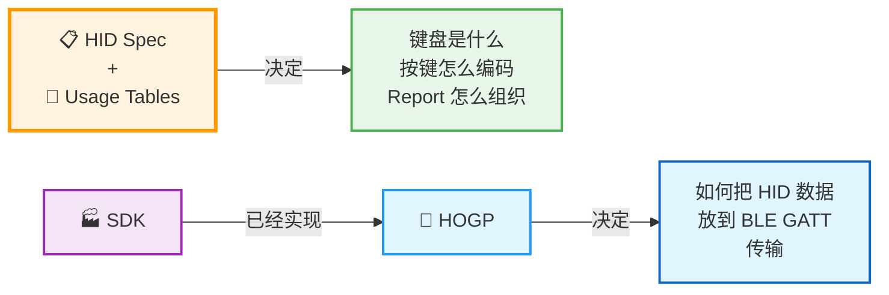

# 🔗 USB HID 与 BLE HID 协议关系：工程师学习路线

> **HID 是规范（Specification），USB、BLE、经典蓝牙只是承载 HID 的通信介质。**

---

## 📑 目录

- [一、核心关系总览](#一核心关系总览)
- [二、USB HID 为什么是"根本"](#二usb-hid-为什么是根本)
- [三、BLE HID 为什么比 USB HID 多一些东西](#三ble-hid-为什么比-usb-hid-多一些东西)
- [四、开发 BLE HID 键盘需要看哪些文档](#四开发-ble-hid-键盘需要看哪些文档)
- [五、使用 SDK 是否还需要全部看](#五使用-sdk-是否还需要全部看)
- [六、知识体系总结图](#六知识体系总结图)

---

## 一、核心关系总览

首先记住一句话：

> 💡 **HID 是规范，USB、BLE、经典蓝牙只是承载 HID 的通信介质。**



### 三种 HID 的本质

| 协议 | 公式 | 承载介质 | 适用场景 |
|:---:|:---:|:---:|:---|
| **USB HID** | HID + USB | 🔌 USB 总线 | 有线键盘、鼠标、游戏手柄 |
| **Bluetooth HID** | HID + 经典蓝牙 | 📻 BR/EDR | 早期无线耳机、音箱 |
| **BLE HID (HOGP)** | HID + BLE GATT | 📡 BLE GATT | 低功耗无线键鼠、手环 |

> 📌 它们都是**同一种 HID 规范**的不同实现方式。

### 真正决定键盘数据内容的不是 USB 也不是 BLE，而是 HID Specification：

- 键盘 Report 格式
- 鼠标 Report 格式
- KeyCode 定义
- Usage Page / Usage
- Report Descriptor 语法

---

## 二、USB HID 为什么是"根本"

这里要区分**历史上的根本**和**技术上的根本**。

### 2.1 技术上的根本

```
        📋 HID Specification
              ↑
         真正的「根」
```

> 从技术上来说，真正的根本是 **HID Specification**。  
> USB HID、BLE HID 都是在实现它。

### 2.2 历史上的根本

USB HID 是最早成功的大规模实现。发展顺序如下：



#### 为什么 BLE HID 大量借鉴 USB HID？

Bluetooth SIG 在设计 BLE HID 时，**没有重新发明一套键盘协议**，而是直接复用了 HID 的大部分内容：

- ✅ Keyboard Report Descriptor
- ✅ Mouse Report Descriptor
- ✅ Usage Page / Usage
- ✅ KeyCode
- ✅ Modifier 修饰键
- ✅ Boot Keyboard 定义

> 🔍 你会发现：**USB HID 和 BLE HID 的 Report Descriptor 几乎完全一样。**

### 2.3 准确的说法

> ❌ 不太准确：USB HID 是 BLE HID 的基础  
> ✅ 更准确：**BLE HID 继承的是 HID Specification，而 USB HID 是最成熟、最经典的 HID 实现，因此 BLE HID 大量借鉴了 USB HID 的设计。**

---

## 三、BLE HID 为什么比 USB HID 多一些东西

### 3.1 根本原因：通信机制不同



USB 直接通过 Endpoint 传输 HID Report，而 BLE 需要经过 **GATT → Characteristic** 的层层映射。

### 3.2 BLE 必须增加的层：HID over GATT Profile（HOGP）

HOGP 负责规定：**如何把 HID 放到 GATT 里面。**



| HOGP 特有的 Characteristic | 说明 |
|:---:|:---|
| **HID Information** | HID 版本、国家码、标志位 |
| **Report Map** | 完整的 Report Descriptor |
| **Protocol Mode** | Boot Protocol / Report Protocol 切换 |
| **HID Control Point** | 主机控制命令（Suspend / Exit Suspend） |
| **Boot Keyboard Input** | BIOS/UEFI 兼容性支持 |

> ⚠️ 这些东西 USB HID **没有**，因为 USB 本身已有对应的 Endpoint 和枚举机制。

---

## 四、开发 BLE HID 键盘需要看哪些文档

实际需要 **三份核心文档**，各自负责不同层面。

### 📄 第一份：HID Specification ★★★★★

这是**最重要**的文档，决定：

- Keyboard Report Descriptor
- Mouse Report Descriptor
- Usage / Usage Page
- KeyCode 定义
- Modifier 修饰键
- Report Format

> 🎯 **你发送什么数据，全靠它。**

### 📄 第二份：HID Usage Tables ★★★★★

很多初学者容易忽略这一份，但它规定的是：

```
A     = 0x04    B      = 0x05    Enter  = 0x28
Esc   = 0x29    Space  = 0x2C    Delete = 0x4C
F1    = 0x3A    F12    = 0x45    GUI    = 0xE3
```

> 🔍 也就是**所有按键编码**。开发键盘几乎天天查这份文档。

### 📄 第三份：HID over GATT Profile（HOGP）★★★★☆

这份文档告诉你 **BLE 应该如何实现 HID**，例如必须有哪些 Characteristic：

```
HID Information
Report Map
Protocol Mode
Report
Control Point
Boot Keyboard Input
```

> 📌 如果没有这些，Windows 就不会认为这是 BLE HID Keyboard。

### 文档获取地址

| 文档 | 发布方 | 下载地址 |
|:---|:---:|:---|
| HID Specification v1.11 | USB-IF | [usb.org/hidpage](https://www.usb.org/developers/hidpage) |
| HID Usage Tables v1.12 | USB-IF | [usb.org/hidpage](https://www.usb.org/developers/hidpage) |
| HOGP v1.0 | Bluetooth SIG | [bluetooth.com](https://www.bluetooth.com/specifications/specs/hid-over-gatt-profile-1-0/) |

> 💡 Bluetooth SIG 需要免费注册 Adopter 会员才能下载 PDF。

---

## 五、使用 SDK 是否还需要全部看

> **答案：不用全部啃。**

### 5.1 主流 SDK 已提供完整 HOGP 实现

```
Nordic     ──→ ble_app_hids_keyboard
Telink     ──→ BLE HID Keyboard Demo
TI         ──→ HID Emu Keyboard
ESP32      ──→ ESP32-BLE-Keyboard (Arduino)
Silicon Labs ─→ Bluetooth HID Keyboard
```

SDK 中 HOGP 基本已经实现好了，你真正需要研究的是：


### 5.2 实际开发学习重点

| 文档 | 重要程度 | 学习建议 |
|:---:|:---:|:---|
| **HID Specification** | ⭐⭐⭐⭐⭐ | 必须理解 Report Descriptor 语法 |
| **HID Usage Tables** | ⭐⭐⭐⭐⭐ | 必须经常查，建议打印贴在桌上 |
| **HID over GATT Profile** | ⭐⭐⭐⭐☆ | 理解整体 GATT 结构即可 |
| **BLE Core Spec** | ⭐⭐☆☆☆ | 一般不用完整阅读，按需查阅 |
| **芯片厂商 SDK 示例** | ⭐⭐⭐⭐⭐ | 实际开发最重要，从 Demo 入手 |

---

## 六、知识体系总结图

整个知识体系浓缩成这张图：



### 🎯 开发 BLE HID 键盘的核心认知



> 💡 **一句话总结**：使用成熟的 BLE SDK 时，HOGP 通常已经实现好了。日常开发你主要面对的是 **HID Report Descriptor、按键编码和发送 Report**，而不是从零实现整个 BLE HID 协议栈。

---

*本文档采用 Mermaid 图表增强可读性，建议使用支持 Mermaid 渲染的 Markdown 阅读器（如 VS Code、Typora、GitHub）查看完整效果。*
