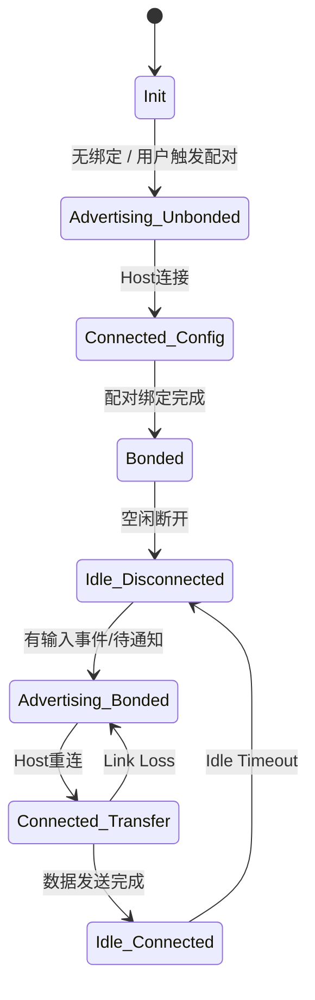
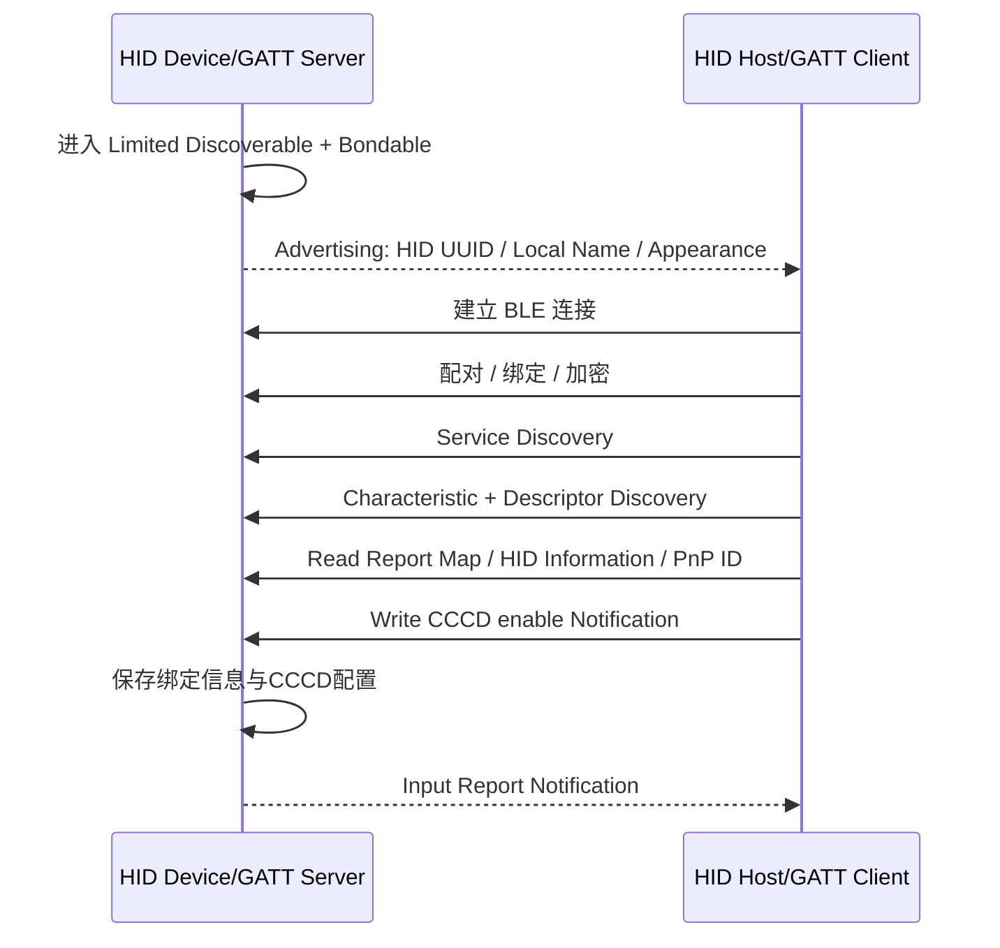
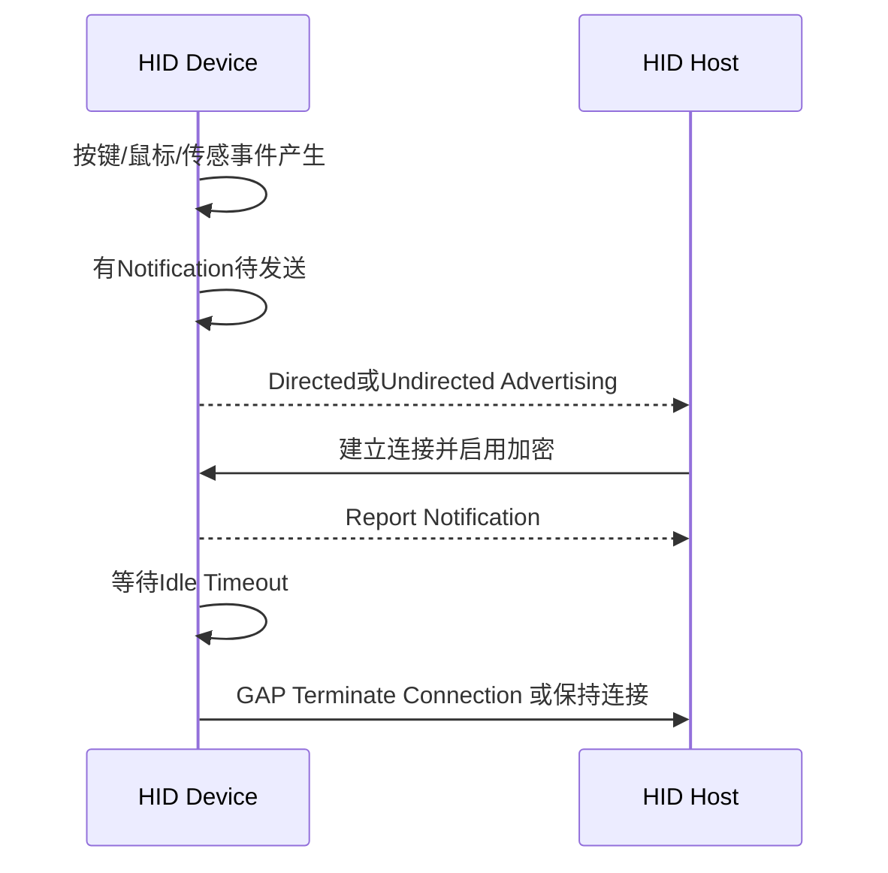

# BLE GATT HOGP 中文实现整理（修订版）

> 基于用户提供的《HID over GATT Profile Specification / HOGP_SPEC / V10r00 / 2011-12-27》整理。本文偏向 **单片机固件实现**，默认实现对象为 BLE HID 外设，例如键盘、鼠标、遥控器、手柄、传感类 HID 设备。

> 修订说明：本版补充了规范术语对照、HID Control Point 的条件必需性、Boot Host / Report Host 信息共享、多个 Battery Service 的区分方式、已绑定设备主动连接广告参数，以及 Scan Parameters Profile 的 Host 侧要求。

---

## 0. 版本、范围与规范术语

### 0.1 版本范围

本文基于 **HID over GATT Profile Specification / HOGP_SPEC / V10r00 / 2011-12-27**。该版本是 Bluetooth SIG Board of Directors adopted 的 HOGP 1.0 规范。

工程使用时应注意：

- 本文用于实现指导，不替代 Bluetooth SIG 官方规范与认证测试用例。
- 如果项目需要做 Bluetooth Qualification，应以当前可获取的官方 HOGP、HIDS、BAS、DIS、Scan Parameters Service、Assigned Numbers 以及对应测试规范为准。
- 若官方规范存在新版本，应核对版本差异，特别是安全、GATT 特征权限、连接参数和互操作要求。

### 0.2 规范术语对照

Bluetooth 规范中的关键词具有严格含义。本文中文表述尽量按下表对应：

| 英文术语 | 中文含义 | 工程理解 |
|---|---|---|
| shall | 必须 | 认证一致性要求，不应偏离 |
| should | 应该 / 推荐 | 强烈建议，除非有明确理由 |
| may | 可以 / 允许 | 可选能力或可选行为 |
| can | 能够 | 表达能力或可能性，不等同于要求 |
| M | Mandatory | 必须支持 |
| O | Optional | 可选支持 |
| C.x | Conditional | 条件满足时必须支持 |
| X | Excluded | 不允许用于该角色或场景 |

### 0.3 和 USB HID / Usage Tables 的关系

HOGP 并不重新定义 HID Report Descriptor 的语法，也不重新定义 Usage Page / Usage ID 的含义。实现时通常这样分工：

| 文档 | 作用 |
|---|---|
| HID USB Device Class Definition | 定义 HID Report Descriptor、Input / Output / Feature Report、Boot Protocol 等 HID 数据模型 |
| HID Usage Tables | 定义键盘、鼠标、消费控制、多媒体键、游戏控制器等 Usage Page / Usage ID 的语义 |
| HOGP + HIDS | 定义如何通过 BLE GATT 暴露 Report Map、Report、Protocol Mode、HID Information、HID Control Point 等服务模型和连接/安全行为 |

---

## 1. 结论先行

HOGP（HID over GATT Profile）是 **BLE 上的 HID Profile**。它定义了 Bluetooth Low Energy HID Device 与 HID Host 如何通过 **GATT** 使用 HID 服务。

本规范明确说明：

- HOGP 使用 **Bluetooth Low Energy transport**。
- HOGP 是 USB HID 规范在 BLE 无线链路上的适配。
- HOGP 只运行在 **LE** 上；如果是 BR/EDR 经典蓝牙，应使用经典 Bluetooth HID Profile。
- 单片机端如果做 BLE 键盘、鼠标、遥控器等，通常应实现 **HID Device 角色**，即 **GAP Peripheral + GATT Server**。

实现 BLE HOGP 时，最核心的是：

1. 建立符合 HOGP 的 GATT 服务集合。
2. 实现 HID Service（HIDS）及其 Report Map / Report / Protocol Mode / HID Information / HID Control Point 等特征。
3. 实现 Battery Service 与 Device Information Service。
4. 正确处理配对、绑定、加密、安全等级。
5. 正确处理 Report Host 与 Boot Host 的发现、通知、读写和连接参数行为。


### 1.1 如果 SDK 已经有 GATT，是否可以构建 HOGP？

可以。只要 SDK 已经提供较完整的 **BLE GAP + GATT + SMP/绑定能力**，就可以按照 HOGP、HIDS、USB HID 和 HID Usage Tables 自行构建 HOGP。需要注意的是：**“有 GATT”只是基础能力，不等于 SDK 已经实现了 HOGP Profile**。

可以按下面的分层理解：

```text
BLE GATT SDK
    ↓ 提供 Service、Characteristic、Descriptor、Read、Write、Notify 等机制
HIDS / HOGP
    ↓ 规定要建立哪些 HID Service、Characteristic、Descriptor，以及连接、安全、发现流程
USB HID + Usage Tables
    ↓ 规定 Report Map / Report Descriptor 和实际数据含义
你的固件业务逻辑
    ↓ 实现键盘、鼠标、消费控制、遥控器、触摸板、手柄等具体 HID 行为
```

因此，实现重点不是重写 GATT，而是**用 SDK 的 GATT API 搭出符合 HOGP/HIDS 的数据库和行为**。

#### SDK 能力确认清单

| SDK 能力 | 是否关键 | 对 HOGP Device 的意义 |
|---|---:|---|
| GAP Peripheral | 必需 | HID Device 在 HOGP 中使用 GAP Peripheral 角色 |
| GATT Server | 必需 | HID Device 是 GATT Server，Host 是 GATT Client |
| Primary Service / Include Service | 必需 | 用于 HID Service、Battery Service、DIS，以及 Report Map 引用外部服务时的 Include |
| Characteristic Read | 必需 | Report Map、HID Information、PnP ID、Battery Level 等需要被 Host 读取 |
| Characteristic Write / Write Without Response | 必需 | Protocol Mode、HID Control Point、Output Report、Feature Report 等需要 Host 写入 |
| Notification | 必需 | Input Report、Boot Keyboard Input Report、Boot Mouse Input Report 通过通知上报 |
| Descriptor 支持 | 必需 | 至少需要 CCCD、Report Reference；复杂场景还需要 External Report Reference、Characteristic Presentation Format |
| Read Long Characteristic Value / 长读 | 强烈建议 | Report Map 很容易超过默认 ATT_MTU，Host 侧 Report Host 也要求支持长读 |
| CCCD 保存与绑定设备配置恢复 | 必需 | Host 使能 Input Report Notify 后，断开重连时应能保持或恢复通知配置 |
| SMP Pairing / Bonding / Encryption | 必需 | HOGP 对绑定和安全等级有要求，不能只做明文 GATT |
| 广播数据配置 | 必需 | 初始发现时建议包含 HID Service UUID、Local Name、Appearance |
| 连接参数更新 | 必需/强烈建议 | 发现阶段使用快连接，稳定工作阶段切换到低功耗参数 |
| 白名单 / Filter Policy / 定向广播 | 推荐 | 已绑定重连、低功耗唤醒和减少误连时有用 |
| Service Changed 处理 | 推荐/按栈能力 | GATT 数据库变化时，Host 需要重新发现服务和重新配置 CCCD |

#### 最小可行 GATT 组成

如果只是实现一个最小 BLE 键盘、鼠标或简单遥控器，通常可以从以下 GATT 组成开始：

```text
Generic Access Service
Generic Attribute Service
Device Information Service
  └─ PnP ID

Battery Service
  └─ Battery Level

Human Interface Device Service
  ├─ HID Information
  ├─ HID Control Point
  ├─ Protocol Mode
  ├─ Report Map
  ├─ Report / Input Report
  │   ├─ CCCD
  │   └─ Report Reference
  ├─ Report / Output Report 或 Feature Report，按设备需要
  │   └─ Report Reference
  └─ 可选 Boot Keyboard / Boot Mouse 特征
```

其中最核心的是 **Report Map** 和 **Report Characteristic**：

- **Report Map** 返回 HID Report Descriptor，用于描述设备能力、Report ID、Report Type、字段大小和 Usage 含义。
- **Input Report Characteristic** 通过 Notify 将按键、鼠标坐标、消费控制等输入数据发给 Host。
- **Output Report Characteristic** 通常用于键盘 LED、主机到设备的控制数据等。
- **Feature Report Characteristic** 通常用于配置、状态查询或厂商自定义数据。

#### 实现难度判断

| 设备类型 | 难度 | 主要风险 |
|---|---:|---|
| 单一键盘 | 低 | Boot/Report 模式、键值矩阵、LED Output Report |
| 单一鼠标 | 低 | 坐标范围、滚轮、连接间隔和上报频率 |
| 键盘 + 鼠标复合设备 | 中 | 多 Report ID、多个 Report Reference、Host 兼容性 |
| 键盘 + 鼠标 + 消费控制 | 中 | Consumer Page Usage、媒体键兼容性、Report ID 分配 |
| 带 Feature Report 的设备 | 中高 | Host 读写路径、权限、安全、厂商自定义协议 |
| 多 HID Service / 多 Battery Service 复合设备 | 高 | Include、External Report Reference、多实例区分、Service Changed |

工程上建议先做 **P0：单一 Report Host 路径的 Input Report 通知**，再补充 Boot Protocol、Output Report、Feature Report、多服务实例和低功耗重连策略。

---

## 2. 规范定位

### 2.1 HOGP 与经典 HID 的区别

| 项目 | BLE HOGP | 经典 Bluetooth HID |
|---|---|---|
| 传输 | LE transport | BR/EDR |
| 上层承载 | GATT / ATT | L2CAP / SDP |
| 服务发现 | GATT Service Discovery | SDP |
| HID 数据承载 | GATT Characteristic | HID Control / Interrupt L2CAP Channel |
| 典型角色 | HID Device = GATT Server | HID Device = L2CAP/SDP HID Device |
| 单片机 BLE 外设实现 | 应参考 HOGP + HIDS | 不适用 |

### 2.2 依赖规范

HOGP 依赖以下规范或服务：

| 依赖项 | 用途 |
|---|---|
| GATT | 用于服务、特征、描述符发现与读写通知 |
| HID Service / HIDS | 定义 HID GATT 服务与核心特征 |
| Battery Service / BAS | 电量上报 |
| Device Information Service / DIS | 厂商、产品、PnP ID 等设备信息 |
| Scan Parameters Profile / Service | Report Host 必须支持 Scan Client 功能；HID Device 可选实现 Scan Parameters Service，用于协商扫描行为、优化重连功耗与延迟 |
| Bluetooth Core 4.0 或更高 | BLE、GAP、ATT、GATT、SMP 等基础能力 |
| USB HID Specification | HID Report Descriptor / Report 格式基础 |
| USB HID Usage Tables | Usage Page / Usage ID 定义 |

---

## 3. HOGP 角色模型

HOGP 定义三个角色：

| HOGP 角色 | BLE/GATT 角色 | 说明 |
|---|---|---|
| HID Device | GATT Server | 外设端，例如 BLE 键盘、鼠标、遥控器；单片机端通常实现此角色 |
| Boot Host | GATT Client | 只支持 Boot Protocol Mode 的主机，不需要 HID Parser |
| Report Host | GATT Client | 支持 HID Parser，可解析任意 HID Report Descriptor |

### 3.1 GAP 拓扑限制

| HOGP 角色 | GAP 角色 |
|---|---|
| HID Device | Peripheral |
| Boot Host | Central |
| Report Host | Central |

### 3.2 Host 角色限制

- Boot Host 不能同时作为 Report Host。
- Report Host 不能同时作为 Boot Host。
- HID Host 也可以同时具备 HID Device 能力，但 Boot Host 与 Report Host 互斥。

### 3.3 Boot Host 与 Report Host 的实现差异

| 项目 | Boot Host | Report Host |
|---|---|---|
| 是否需要 HID Parser | 不需要 | 需要 |
| 是否解析 Report Map | 不允许 / 不使用 | 必须 |
| 支持报告格式 | 预定义 Boot Report | 任意 HID Report Descriptor 描述的 Report |
| 典型用途 | BIOS、极简系统、受限主机 | PC、手机、平板、完整 OS |
| 对固件端影响 | 需要暴露 Boot Keyboard / Boot Mouse 特征 | 需要完整 Report Map 与 Report 特征 |

---

## 4. HID Device 必须提供的服务

HOGP 要求 HID Device 至少包含以下服务：

| 服务 | 是否必须 | 实例数量要求 | 说明 |
|---|---:|---|---|
| HID Service | 必须 | 一个或多个 | HID 主服务，承载 Report Map、Report 等 |
| Battery Service | 必须 | 一个或多个 | 上报电池电量 |
| Device Information Service | 必须 | 只能一个 | 必须包含 PnP ID 特征 |
| Scan Parameters Service | 可选 | 最多一个 | 支持 Report Host 写入扫描参数 |
| 其他服务 | 可选 | 一个或多个 | 例如自定义服务，但不属于 HOGP 本身 |

### 4.1 多 HID Service 的用途

HOGP 允许多个 HID Service 实例，主要用于 **复合 HID 设备**。

典型场景：

- 同一个设备同时包含键盘、鼠标、媒体按键、游戏控制器等功能。
- 单个 Report Map 超过 512 字节，需要拆分为多个 HID Service。

### 4.2 外部服务与 Report Map 的 Include 规则

如果某个非 HID Service 的特征值被 HID Service 的 Report Map 描述，则必须满足：

1. 该非 HID Service 必须通过 `Include` 包含在对应的 HID Service 定义中。
2. 被 Report Map 描述的外部特征必须带有 `Report Reference` 描述符。
3. 一个 HID Service 不应 Include 已被另一个 HID Service Include 的外部服务，避免多个服务引用同 UUID 且同 Report Reference 的特征造成歧义。

典型例子：Battery Level 特征如果被 Report Map 当成 HID Report 描述，则 Battery Service 需要被 Include 到对应 HID Service 中。

---

## 5. 推荐 GATT 数据库结构

> UUID 值来自 Bluetooth Assigned Numbers / HIDS / BAS / DIS / Scan Parameters Service。HOGP 文档本身强调这些服务与特征的关系和行为，具体 UUID 应以对应服务规范和 Assigned Numbers 为准。

### 5.1 最小 Report Host 兼容 HID Device

| Service / Characteristic | UUID | 属性 | 描述符 | 用途 |
|---|---:|---|---|---|
| Generic Access | 0x1800 | - | - | GAP 基础服务 |
| Generic Attribute | 0x1801 | - | Service Changed 可选/按栈要求 | GATT 基础服务 |
| HID Service | 0x1812 | Primary | - | HOGP 核心服务 |
| Protocol Mode | 0x2A4E | Read, Write Without Response | - | Boot / Report Protocol Mode |
| Report Map | 0x2A4B | Read | External Report Reference 可选 | HID Report Descriptor |
| HID Information | 0x2A4A | Read | - | bcdHID、Country Code、RemoteWake、NormallyConnectable |
| HID Control Point | 0x2A4C | Write Without Response | - | Suspend / Exit Suspend |
| Report | 0x2A4D | Read / Write / Write Without Response / Notify，按 Report 类型配置 | CCCD、Report Reference | Input / Output / Feature Report 数据 |
| Battery Service | 0x180F | Primary | - | 电池服务 |
| Battery Level | 0x2A19 | Read, Notify 可选 | CCCD 可选，Report Reference 可选 | 电量百分比 |
| Device Information Service | 0x180A | Primary | - | 设备信息服务 |
| PnP ID | 0x2A50 | Read | - | Vendor ID、Product ID、Version 等 |

### 5.2 如果需要 Boot Keyboard / Boot Mouse 兼容

| Characteristic | UUID | 属性 | 描述符 | 说明 |
|---|---:|---|---|---|
| Boot Keyboard Input Report | 0x2A22 | Read, Notify | CCCD | Boot 键盘输入报告 |
| Boot Keyboard Output Report | 0x2A32 | Read, Write, Write Without Response | - | Boot 键盘 LED 状态输出，例如 NumLock / CapsLock |
| Boot Mouse Input Report | 0x2A33 | Read, Notify | CCCD | Boot 鼠标输入报告 |

### 5.3 如果支持 Scan Parameters Service

| Service / Characteristic | UUID | 属性 | 用途 |
|---|---:|---|---|
| Scan Parameters Service | 0x1813 | Primary | Host 向 Device 告知扫描行为 |
| Scan Interval Window | 0x2A4F | Write Without Response | Report Host 写入自身扫描参数 |
| Scan Refresh | 0x2A31 | Notify | Device 请求 Host 重新写入扫描参数 |

---

## 6. HID Service 内关键特征行为

### 6.1 Report Map

`Report Map` 特征被 Host 读取时，应返回 USB HID Report Descriptor。

固件实现重点：

- Report Map 是主机理解设备能力的核心。
- Report Host 必须读取 Report Map 并读取 Report Map 的相关描述符。
- Report Map 中定义的每一组 `Report ID + Report Type`，都应能映射到一个 Report 特征或外部服务特征。
- 如果使用多个 Report ID，应确保每个 Report 特征的 `Report Reference` 描述符明确指出 Report ID 和 Report Type。

### 6.2 Report

`Report` 特征用于在 HID Device 与 Report Host 之间传输 HID 数据。

Report 类型：

| Report Type | 方向 | GATT 行为建议 |
|---|---|---|
| Input Report | Device → Host | Notify，必须有 CCCD；也可 Read |
| Output Report | Host → Device | Write 或 Write Without Response |
| Feature Report | Host ↔ Device | Read / Write |

Report Host 对所有 Input Report 类型的 Report 特征，应通过 CCCD 使能 Notification。Boot Host 应忽略 Report 特征的 Notification。

### 6.3 Report Reference 描述符

`Report Reference` 描述符用于告诉 Host：这个 Report 特征对应哪个 Report ID 和 Report Type。

常见结构：

| 字节 | 含义 |
|---:|---|
| Byte0 | Report ID |
| Byte1 | Report Type：Input / Output / Feature |

固件需要保证：

- 每个 Report 特征都有正确的 Report Reference。
- Report Map 中声明的 Report ID / Type 与 Report Reference 一致。
- 如果没有 Report ID，也应按 HID Service 规范处理默认 ID 情况。

### 6.4 Translation Layer 行为

HOGP 文档说明，Report Host 可以在 GATT 与 USB HID Class Driver 之间实现 Translation Layer。

对固件端的关键影响是：

- Device → Host：Host 收到 GATT Report 值后，会在交给 USB HID Class Driver 前补上 Report ID。
- Host → Device：Host 从 USB HID Class Driver 得到数据后，会移除 Report ID，再写入对应 GATT Report 特征。

因此固件发送 Report 时，一般不应在 Report 特征值中重复塞入 Report ID，除非你的协议栈或平台文档明确要求。实际要以目标平台的 HOGP 行为和 Report Map / Report Reference 配置验证。

### 6.5 Protocol Mode

`Protocol Mode` 特征用于读取/写入当前 HID Service 的协议模式。

| 值 | 模式 | 说明 |
|---:|---|---|
| 0x00 | Boot Protocol Mode | 使用固定 Boot 报告格式 |
| 0x01 | Report Protocol Mode | 使用 Report Map 描述的报告格式 |

HOGP 要求 Boot Host 在连接建立后，应向每个 HID Service 的 Protocol Mode 写入 Boot Protocol Mode。Report Host 不强制使用 Protocol Mode。

固件建议：

- 默认进入 Report Protocol Mode。
- 收到 Protocol Mode 写入后，切换对应数据路径。
- Boot 模式下使用 Boot Keyboard / Boot Mouse 特征。
- Report 模式下使用 Report Map / Report 特征。

### 6.6 HID Information

`HID Information` 特征包含：

| 字段 | 说明 |
|---|---|
| bcdHID | HID 规范版本 |
| bCountryCode | 国家/地区代码 |
| Flags.RemoteWake | 是否支持远程唤醒 |
| Flags.NormallyConnectable | 是否在空闲时仍可被 Host 主动连接 |

实现关注点：

- `RemoteWake = TRUE` 时，Host 可把该设备纳入可唤醒系统的设备集合。
- `NormallyConnectable = TRUE` 时，Host 可在用户操作前主动连接设备，提高响应性。
- 如果功耗要求极高，通常不建议随意打开 NormallyConnectable。

### 6.7 HID Control Point

`HID Control Point` 是 Host 向 Device 发送电源状态控制命令的特征。

常见命令：

| 值 | 含义 |
|---:|---|
| 0x00 | Suspend |
| 0x01 | Exit Suspend |

规范精确性说明：

- 对 **Report Host**：如果 Host 支持 Suspend Mode，则 HID Control Point 是条件必需；否则是可选。
- 对 **Boot Host**：HID Control Point 是 Excluded，不应由 Boot Host 使用。
- 对 **HID Device 固件**：为了兼容常见 PC/手机/平板等完整 Host，建议实现该特征并处理 Suspend / Exit Suspend。

固件端收到 Suspend 后可降低扫描、传感、LED、矩阵扫描频率或进入更深睡眠；收到 Exit Suspend 或用户输入事件后恢复正常输入路径。

### 6.8 Battery Level

Battery Level 可被 Host 读取，也可通过 CCCD 使能 Notification。

实现建议：

- 电量变化不需要高频上报。
- 电量读取频率应尽量低，避免影响 HID Device 电池寿命。
- 多 Battery Service 实例可以用于复合设备的不同电池来源。
- 当存在多个 Battery Service 实例时，Host 可通过 Battery Level 的 **Characteristic Presentation Format** 描述符区分不同电池来源。
- 如果某个 Battery Level 被 Report Map 作为 HID Report 描述，则该 Battery Level 还应带有 **Report Reference** 描述符；在 HOGP 内部，多个被 Report Map 引用的 Battery Level 也可依靠 Report Reference 区分。

### 6.9 PnP ID

Report Host 初次连接后应读取 PnP ID，并可缓存。Boot Host 可读取并缓存。

PnP ID 可用于：

- 显示厂商/设备图标。
- 加载厂商支持软件。
- 区分外观相似但厂商/产品不同的设备。

### 6.10 Boot Host 与 Report Host 信息共享要求

HOGP 对 Host 侧还有一个容易忽略的强制要求：**Boot Host 与 Report Host 应共享绑定信息以及 Service Changed 指示相关信息**。

工程含义：

- 如果同一套系统中存在 Boot Host 与 Report Host 两个逻辑主机，例如 BIOS / Boot 环境与完整 OS，它们不能各自维护互不相干的绑定状态。
- 任一 Host 删除某个 HID Device 的 bond 时，另一个 Host 也应删除对应 bond。
- 任一 Host 收到 `Service Changed` indication 后，应把该 indication 及其中包含的信息同步给另一个 Host。
- 对 HID Device 固件而言，重点是：GATT 数据库变化后应正确发出 Service Changed；同时要考虑 Host 可能因收到 Service Changed 而重新发现服务、重新读取 Report Map、重新配置 CCCD。

---

## 7. Boot Protocol 与 Report Protocol 实现

### 7.1 Report Protocol Mode

这是完整 HID 模式，适用于大多数 BLE HID 产品。

固件需要：

- 提供 Report Map。
- 提供一个或多个 Report 特征。
- 每个 Report 特征配置 Report Reference。
- Input Report 支持 Notification。
- Output / Feature Report 支持 Host 写入或读取。

### 7.2 Boot Protocol Mode

Boot 模式用于不解析 Report Map 的 Host。

固件需要：

- 支持 Protocol Mode 写入。
- 如果设备是键盘，支持 Boot Keyboard Input Report 和 Boot Keyboard Output Report。
- 如果设备是鼠标，支持 Boot Mouse Input Report。
- Boot Host 对 Boot Input Report 使能 Notification。

### 7.3 键盘 Boot Report 常见格式

Boot Keyboard Input Report 常见 8 字节格式：

| 字节 | 含义 |
|---:|---|
| 0 | Modifier bitmap |
| 1 | Reserved |
| 2~7 | 最多 6 个 KeyCode |

Boot Keyboard Output Report 常见 1 字节格式：

| bit | 含义 |
|---:|---|
| 0 | Num Lock |
| 1 | Caps Lock |
| 2 | Scroll Lock |
| 3 | Compose |
| 4 | Kana |

### 7.4 鼠标 Boot Report 常见格式

Boot Mouse Input Report 常见 3 字节格式：

| 字节 | 含义 |
|---:|---|
| 0 | Button bitmap |
| 1 | X 相对位移 |
| 2 | Y 相对位移 |

实际格式应结合 USB HID Boot Protocol 要求和目标主机兼容性验证。

---

## 8. Host 侧行为对 Device 固件的影响

虽然单片机通常实现 HID Device，但必须理解 Host 会做什么。

### 8.1 Boot Host 行为

Boot Host 必须发现 HID Service。DIS 和 BAS 对 Boot Host 可选。

Boot Host 可发现：

- Protocol Mode
- Boot Keyboard Input Report
- Boot Keyboard Output Report
- Boot Mouse Input Report

如果不支持普通特征发现，Boot Host 会使用 `Read Using Characteristic UUID` 读取 Boot 模式所需特征。

### 8.2 Report Host 行为

Report Host 更完整，必须进行：

1. Primary Service Discovery。
2. HID Service Discovery。
3. Device Information Service Discovery。
4. Battery Service Discovery。
5. HID Service Characteristic Discovery。
6. Characteristic Descriptor Discovery。
7. 读取 Report Map。
8. 为 Input Report 使能 Notification。
9. 读取 HID Information。
10. 读取 PnP ID。

如果 Report Host 支持大于默认 ATT_MTU 的 MTU，应在 Service Discovery 前执行 Exchange MTU。

### 8.3 Host 对 GATT 子过程的最低要求

| GATT 子过程 | Boot Host | Report Host | Device 兼容建议 |
|---|---|---|---|
| Discover All Primary Services | 至少支持一种 Primary Service Discovery | 至少支持一种 Primary Service Discovery | 服务声明必须标准 |
| Discover Primary Services by UUID | 同上 | 同上 | UUID 必须正确 |
| Discover All Characteristics | 可选 | 条件必需 | Characteristic 顺序和 handle 范围应正确 |
| Discover Characteristics by UUID | 可选 | 条件必需 | 支持按 UUID 定位 |
| Discover All Characteristic Descriptors | 必须 | 必须 | CCCD / Report Reference 必须可发现 |
| Find Included Services | 不允许 | 必须 | 如果 Report Map 描述外部服务，Include 必须正确 |
| Write Without Response | 必须 | 必须 | 用于 Protocol Mode、HID Control Point、Output Report 等 |
| Write Characteristic Value | 必须 | 必须 | 用于 Output / Feature Report |
| Notifications | 必须 | 必须 | Input Report 必须可靠通知 |
| Read Characteristic Value | 必须 | 必须 | Report Map、HID Information、PnP ID 等 |
| Read Long Characteristic Value | 不允许 | 必须 | Report Map 较长时必须考虑长读 |
| Read / Write Descriptors | 必须 | 必须 | CCCD 配置与 Report Reference 读取 |

### 8.4 Scan Parameters Profile 的 Host 侧要求

HOGP 明确要求 **Report Host 支持 Scan Parameters Profile 的 Scan Client 功能**；Boot Host 则不支持 Scan Client 角色。

这对 Device 固件的影响是：

- `Scan Parameters Service` 在 HID Device 侧是可选服务，但如果实现，应按 Scan Server 角色处理 Host 写入。
- Report Host 可通过 `Scan Interval Window` 写入自身扫描行为，Device 可据此选择空闲断开、保持连接或调整重连策略。
- Device 可通过 `Scan Refresh` 通知请求 Host 重新写入扫描参数。
- 如果产品追求低功耗重连体验，建议实现 Scan Parameters Service，并把 Host 写入值纳入 Idle Timeout / 重连策略。

---

## 9. 广播与发现

### 9.1 初次连接广播数据建议

HID Device 在初次连接时应进入 GAP Limited Discoverable Mode，并建议在 Advertising Data 或 Scan Response Data 中放入：

| AD Type | 建议 | 作用 |
|---|---|---|
| Service UUIDs | 建议包含 HID Service UUID | Host 可快速识别 HID 设备 |
| Local Name | 建议包含 | 用户界面显示设备名称 |
| Appearance | 建议包含 | Host 可显示键盘/鼠标/遥控器等图标 |

### 9.2 初次连接超时

HID Device 使用 GAP Limited Discoverable Mode 时，`TGAP(lim_adv_timeout)` 可大于 GAP 默认值，但必须小于等于 180 秒。

---

## 10. 连接建立与重连策略

### 10.1 非绑定设备：Device 侧

用于初次配对/绑定。

| 项目 | 推荐值 / 行为 |
|---|---|
| 广播模式 | GAP Limited Discoverable / Connectable |
| 快速连接持续时间 | 180 秒 |
| Advertising Interval | 30 ms ~ 50 ms |
| Bondable | 必须处于 Bondable Mode |
| 连接参数 | 初期接受 Host 的有效 connection interval / latency |
| 服务发现与加密完成后 | Device 可通过 L2CAP Connection Parameter Update 请求切换到自身偏好的连接参数 |
| 绑定后 | 可把 Host 地址写入白名单，并设置广告过滤策略 |

### 10.2 非绑定设备：Host 侧

| 项目 | 推荐值 / 行为 |
|---|---|
| 发现过程 | GAP Limited Discovery Procedure |
| 可用连接过程 | General / Direct / Auto / Selective Connection Establishment |
| 快速扫描持续时间 | 180 秒，电源供电设备可持续 |
| Scan Interval | 22.5 ms |
| Scan Window | 11.25 ms |
| 绑定 | Host 必须与 HID Device 绑定 |
| 绑定后 | 可把 Device 地址写入白名单 |

### 10.3 已绑定设备：Device 主动连接

触发条件：

- 用户操作触发连接。
- Device 有 Notification 待发送。

推荐广播参数：

| 阶段 | 广播模式 | 持续时间 | Advertising Interval |
|---|---|---:|---|
| 低延迟阶段 | Directed | 1.28 秒 | 20 ms ~ 30 ms |
| 较高延迟/省电阶段 | Undirected | 30 秒 | 20 ms ~ 30 ms |

连接建立且有通知待发送时，Device 应发送一个或多个 Notification。

### 10.4 已绑定设备：Host 主动连接

如果希望 Host 能主动连接 Device，Device 应在 HID Information 中把 `NormallyConnectable` 设置为 TRUE。

| 项目 | 推荐值 / 行为 |
|---|---|
| 广播模式 | Undirected Connectable |
| 持续时间 | Permanent / 持续 |
| Advertising Interval | 1 s ~ 2.5 s |
| 适用场景 | Host 需要主动写 LED 状态、配置、或恢复连接 |

注意：`NormallyConnectable = TRUE` 会增加空闲功耗，应按产品场景决定。

### 10.5 Host 扫描参数建议

| 场景 | Scan Interval | Scan Window | 持续时间 |
|---|---:|---:|---:|
| 非绑定设备快速连接 | 22.5 ms | 11.25 ms | 180 秒 |
| 已绑定设备，Device 主动连接 | 1.28 s | 11.25 ms | 持续 |
| 已绑定设备，Host 主动连接 | 30 ms ~ 60 ms | 30 ms | 30 秒 |

### 10.6 Fast Connection Interval

为避免服务发现和加密耗时过长，Host 建议在连接请求中使用：

| 参数 | 推荐值 |
|---|---:|
| Minimum Connection Interval | 7.5 ms |
| Maximum Connection Interval | 50 ms |

在需要低延迟的阶段，例如加密建立、密钥刷新、服务发现，可使用上述快速连接参数，并将 slave latency 设为 0。完成后再由 Device 使用 L2CAP Connection Parameter Update 切回更省电的参数。

### 10.7 Idle Connection

Device 可在连接空闲一段实现自定义时间后执行 GAP Terminate Connection。

如果 Device 支持 Scan Parameters Service：

- Report Host 应按 Scan Parameters Profile 将扫描行为写入 Scan Interval Window。
- Report Host 不应主动断开，而应等待 HID Device 断开。
- Device 可根据 Host 写入的扫描参数决定保持连接还是断开，以平衡功耗与重连延迟。

### 10.8 Link Loss 重连

连接因链路丢失终止后：

- Device 应尝试进入 GAP connectable mode 重新连接 Host，可使用已绑定 Device 主动连接的广告参数。
- Device 也可等到有数据发送或检测到下一次用户操作后再重连。
- Host 可使用 GAP 连接过程尝试重连；如果 Device 的 NormallyConnectable 为 TRUE，Host 可使用 Host 主动连接参数。

---

## 11. NormallyConnectable 行为

HOGP 附录给出了 `NormallyConnectable` 对连接策略的影响。

| NormallyConnectable | Device 行为 | Host 行为 | 典型配置 |
|---|---|---|---|
| FALSE | 有数据时高占空比广播约 5 秒；空闲时关闭无线 | 低占空比扫描 | 最常见，省电优先 |
| TRUE | 有数据时高占空比广播约 5 秒；空闲时低占空比广播 | 有数据时高占空比扫描约 5 秒；空闲时低占空比扫描 | 更适合保持连接或快速主机主动连接 |

对单片机产品的建议：

- 键盘/鼠标通常可优先使用 `FALSE`，由用户动作或待发送通知触发连接。
- 如果产品需要 Host 随时写入数据，例如 LED、配置、控制命令，并且可接受更高功耗，可使用 `TRUE`。
- 如果设置 `TRUE`，需要认真评估广播间隔、电池寿命和主机兼容性。

---

## 12. 安全要求

### 12.1 Device 侧安全要求

HID Device 必须：

- 使用 LE Security Mode 1。
- 使用 Security Level 2 或 Security Level 3。
- 对 HID Service 支持的所有特征设置为 Security Mode 1 Level 2 或 3。
- 与 HID Host 绑定。
- 使用加密链路。
- 可使用 SM Slave Security Request 告知 Host 安全需求。

推荐：

- Device Information Service、Scan Parameters Service、Battery Service 的特征也使用与 HID Service 相同的安全模式和等级。
- 对键盘等可能输入敏感信息的设备，优先使用更强的配对能力和加密策略。

### 12.2 Host 侧安全要求

HID Host 必须：

- 与 HID Device 绑定。
- 支持 LE Security Mode 1 Level 2。
- 可选支持 LE Security Mode 1 Level 3。
- 接受 HID Device 请求的有效 LE Security Mode / Security Level 组合。
- 仅在收到 HID Device 的 SM Slave Security Request 时发起 encryption key refresh。

### 12.3 固件实现注意事项

- CCCD 配置依赖绑定关系时，应在断开后正确保存。
- 如果 Host 重新连接后加密失败，Host 可能要求重新绑定、重新服务发现、重新配置 CCCD。
- 如果 GATT 数据库变化，应正确处理 Service Changed 行为；Host 侧 Boot Host 与 Report Host 之间还应共享 Service Changed indication 信息。
- 绑定信息删除时，应清理对应 CCCD、白名单、隐私解析列表等相关状态；Host 侧如果一个逻辑 Host 删除 bond，另一个逻辑 Host 也应同步删除。

---

## 13. 单片机固件实现状态机建议

### 13.1 主状态机



### 13.2 初次配对流程



### 13.3 已绑定输入事件流程



---

## 14. Report 数据路径实现建议

### 14.1 Input Report

固件发送流程：

1. 检查是否已连接。
2. 检查链路是否已加密。
3. 检查对应 Input Report 的 CCCD 是否已开启 Notification。
4. 按当前 Protocol Mode 选择 Report 特征或 Boot Report 特征。
5. 发送 Notification。
6. 如果是按键释放类事件，必须发送 release report，例如键盘全 0 报告。

伪代码：

```c
void hogp_send_input_report(uint8_t report_id, const uint8_t *data, uint16_t len)
{
    if (!ble_is_connected()) return;
    if (!ble_is_encrypted()) return;
    if (!hogp_cccd_enabled(report_id, HID_REPORT_TYPE_INPUT)) return;

    if (hogp_protocol_mode() == HOGP_PROTOCOL_BOOT) {
        hogp_notify_boot_input(data, len);
    } else {
        hogp_notify_report(report_id, HID_REPORT_TYPE_INPUT, data, len);
    }
}
```

### 14.2 Output Report

常见用途：

- 键盘 LED 状态：NumLock、CapsLock。
- 游戏手柄震动控制。
- 设备配置命令。

固件接收流程：

1. Host 写入 Output Report 特征，或 Boot Keyboard Output Report。
2. 固件根据 Report Reference / 当前 Protocol Mode 解析。
3. 更新设备状态。
4. 如需要，回调应用层。

### 14.3 Feature Report

Feature Report 通常用于非实时配置或状态查询。

建议：

- 使用 Read / Write 方式。
- 不作为低延迟输入数据通道。
- 注意权限与安全等级。

---

## 15. 广播数据建议

### 15.1 键盘示例

```text
Flags: LE General Discoverable / BR/EDR Not Supported
Complete List of 16-bit Service UUIDs: 0x1812, 0x180F, 0x180A
Complete Local Name: "BLE Keyboard"
Appearance: Keyboard
```

### 15.2 鼠标示例

```text
Flags: LE General Discoverable / BR/EDR Not Supported
Complete List of 16-bit Service UUIDs: 0x1812, 0x180F, 0x180A
Complete Local Name: "BLE Mouse"
Appearance: Mouse
```

### 15.3 遥控器 / 复合设备示例

```text
Flags: LE General Discoverable / BR/EDR Not Supported
Complete List of 16-bit Service UUIDs: 0x1812, 0x180F, 0x180A
Complete Local Name: "BLE Remote"
Appearance: Generic HID
```

---

## 16. 连接参数建议

### 16.1 初次发现/配对阶段

| 参数 | 建议 |
|---|---:|
| Advertising Interval | 30 ms ~ 50 ms |
| Advertising Duration | ≤ 180 s |
| Connection Interval | 先接受 Host 参数 |
| Slave Latency | 先接受 Host 参数 |
| 后续优化 | 服务发现和加密完成后再请求低功耗参数 |

### 16.2 数据传输阶段

| 场景 | Connection Interval | Slave Latency | 说明 |
|---|---:|---:|---|
| 低延迟键鼠 | 7.5 ms ~ 30 ms | 0 ~ 小值 | 响应快，功耗高 |
| 普通键盘 | 15 ms ~ 50 ms | 中等 | 平衡功耗与体验 |
| 遥控器/低频输入 | 30 ms ~ 100 ms | 可较大 | 省电优先 |
| 空闲保持连接 | 更长 interval + latency | 较大 | 与 Host 兼容性相关 |

### 16.3 推荐策略

- 初次连接先快：利于服务发现、MTU 交换、配对加密、CCCD 配置。
- 配置完成后再慢：由 Device 请求合适连接参数。
- 有数据传输时临时加快：必要时使用参数更新降低延迟。
- 空闲后断开或保持低功耗连接：依据 `NormallyConnectable` 和产品需求决定。

---

## 17. 实现任务拆解

### 17.1 BLE 栈初始化

- 初始化 GAP Peripheral。
- 初始化 GATT Server。
- 初始化 SMP / Security Manager。
- 配置设备名称、Appearance、广播数据。
- 配置白名单或过滤策略。

### 17.2 GATT 数据库

最小实现：

- GAP Service。
- GATT Service。
- HID Service。
- Battery Service。
- Device Information Service。

可选实现：

- Scan Parameters Service。
- 多 HID Service。
- 其他自定义服务。

### 17.3 HID Service 实现

必须完成：

- Report Map 特征。
- HID Information 特征。
- Protocol Mode 特征。
- Report 特征及 Report Reference 描述符。
- Input Report 的 CCCD。

条件必需 / 强烈建议完成：

- HID Control Point 特征：Report Host 支持 Suspend Mode 时为条件必需；Boot Host 不使用。为兼容主流系统，HID Device 固件通常建议实现。

按产品需要完成：

- Boot Keyboard Input Report。
- Boot Keyboard Output Report。
- Boot Mouse Input Report。
- External Report Reference。
- Include 外部服务。

### 17.4 安全与绑定

- 支持 LE Security Mode 1 Level 2。
- 根据产品要求支持 Level 3。
- 初次连接必须可绑定。
- 绑定后保存 Host 地址、密钥、CCCD 配置。
- 重连后启动加密。
- 绑定删除时清除相关状态。

### 17.5 运行态处理

- 处理 Protocol Mode 写入。
- 处理 HID Control Point 写入。
- 处理 Output Report 写入。
- 处理 Feature Report 读写。
- 处理 Battery Level 读和通知。
- 处理 Service Changed。
- GATT 数据库变化时，确保 bonded Host 重新发现服务、重新读取 Report Map、重新配置 CCCD。
- 处理 Idle Timeout 与断开策略。
- 处理 Link Loss 后重连策略。

---

## 18. 调试检查清单

### 18.1 广播检查

- [ ] Advertising Data 是否包含 HID Service UUID。
- [ ] Scan Response 是否包含 Local Name。
- [ ] Appearance 是否与设备类型匹配。
- [ ] 初次配对是否进入 Limited Discoverable Mode。
- [ ] 初次广播时间是否不超过 180 秒。

### 18.2 GATT 检查

- [ ] HID Service 是否为 Primary Service。
- [ ] Battery Service 是否为 Primary Service。
- [ ] Device Information Service 是否为 Primary Service。
- [ ] DIS 是否包含 PnP ID。
- [ ] Report Map 是否可读。
- [ ] Report Map 长度超过默认 ATT_MTU 时是否支持长读。
- [ ] 每个 Report 特征是否有 Report Reference。
- [ ] Input Report 是否有 CCCD。
- [ ] Boot 特征是否按需要存在。
- [ ] 如果存在多个 Battery Service，是否用 Characteristic Presentation Format 或 Report Reference 明确区分。

### 18.3 配对与安全检查

- [ ] 是否支持 LE Security Mode 1 Level 2。
- [ ] 是否按需要支持 Level 3。
- [ ] HID Service 特征是否要求加密。
- [ ] 绑定信息是否持久化。
- [ ] 删除绑定时是否清理 CCCD、白名单/过滤策略、隐私解析列表等状态。
- [ ] 重连后是否启动加密。
- [ ] 加密失败是否触发重新绑定流程。

### 18.4 Report 检查

- [ ] Host 是否读取 Report Map。
- [ ] Host 是否读取 Report Reference 描述符。
- [ ] Host 是否对 Input Report 写 CCCD。
- [ ] 按键按下是否发送正确 Input Report。
- [ ] 按键释放是否发送全 0 或释放 Report。
- [ ] CapsLock / NumLock 是否通过 Output Report 正确回调应用层。
- [ ] Protocol Mode 切换后是否使用正确特征发送数据。

### 18.5 连接与功耗检查

- [ ] 初次连接广播间隔是否为 30 ms ~ 50 ms。
- [ ] 已绑定主动连接是否按低延迟策略广播。
- [ ] NormallyConnectable 是否按产品需求配置。
- [ ] Idle Timeout 后是否正确断开或保持连接。
- [ ] 断开后是否能通过用户操作快速重连。
- [ ] Link Loss 后是否能重连。
- [ ] 如果实现 Scan Parameters Service，Host 写入的 Scan Interval Window 是否参与重连/断开策略。

---

## 19. 常见问题

### 19.1 为什么手机或电脑能发现设备，但不能识别成键盘/鼠标？

优先检查：

- Advertising Data 是否包含 HID Service UUID。
- Appearance 是否合理。
- HID Service 是否为 Primary。
- Report Map 是否正确。
- Report Reference 是否与 Report Map 匹配。
- DIS 是否包含 PnP ID。
- 安全等级是否满足 Host 要求。

### 19.2 为什么能配对但按键没有输入？

优先检查：

- Host 是否写入 CCCD 使能 Input Report Notification。
- Input Report 是否通过正确 Report 特征发送。
- Report 数据是否与 Report Map 描述一致。
- 是否在未加密状态下发送，被协议栈拦截。
- 是否缺少按键释放 Report。

### 19.3 为什么 CapsLock LED 不工作？

优先检查：

- 是否实现 Output Report 或 Boot Keyboard Output Report。
- Output Report 的 Report Reference 是否为 Output。
- Host 写入时当前 Protocol Mode 是 Report 还是 Boot。
- 应用层是否处理 LED bit。

### 19.4 为什么重连慢或耗电高？

优先检查：

- Advertising Interval 和 Scan Window / Scan Interval 是否合理。
- `NormallyConnectable` 是否被设置为 TRUE。
- Idle Timeout 是否过长。
- 是否长期保持快速连接参数。
- 是否支持 Scan Parameters Service，并正确处理 Host 写入的扫描行为。

---

## 20. 推荐实现优先级

### P0：必须先跑通

- HID Service + Report Map + Input Report。
- Battery Service。
- Device Information Service + PnP ID。
- 配对、绑定、加密。
- Input Report Notification。
- Report Reference / CCCD。

### P1：提升兼容性

- Protocol Mode。
- Boot Keyboard / Boot Mouse 特征。
- Output Report。
- HID Control Point（Report Host 支持 Suspend Mode 时条件必需；通常建议作为 P1 实现）。
- HID Information flags。
- 长 Report Map 读取。

### P2：优化体验与功耗

- 白名单 / 过滤策略。
- Idle Timeout。
- L2CAP Connection Parameter Update。
- Scan Parameters Service。
- Link Loss 重连策略。
- Service Changed 与缓存处理；Host 侧 Boot Host / Report Host 信息共享。

---

## 21. 参考章节索引

| 本文主题 | HOGP 章节 |
|---|---|
| 规范术语 | Document Terminology |
| HOGP 定义、LE-only、依赖 | §1, §1.1 |
| 角色、拓扑、服务关系 | §2.1 ~ §2.5 |
| HID Device 服务要求 | §3 |
| HID Host 要求和行为 | §4 |
| GATT 子过程要求 | §4.1 |
| Report Map / Report / Translation Layer | §4.7, §4.8 |
| HID Control Point / HID Information / Protocol Mode | §4.9 ~ §4.11 |
| Boot Keyboard / Mouse 行为 | §4.12 ~ §4.14 |
| Battery / PnP ID 行为 | §4.15 ~ §4.16 |
| Boot Host / Report Host 信息共享 | §4.17 |
| 连接建立与重连 | §5 |
| 安全要求 | §6 |
| NormallyConnectable 行为 | Appendix A |

---

## 22. 本次修订要点

相对于上一版，重点修订如下：

| 修订点 | 说明 |
|---|---|
| 规范术语 | 增加 shall / should / may / can 以及 M/O/C/X 对照，避免把推荐项误写成强制项 |
| HID Control Point | 明确其对 Report Host 是 Suspend Mode 条件必需，对 Boot Host 是 Excluded；Device 固件建议实现但不把它简单写成无条件必需 |
| Host 信息共享 | 补充 Boot Host 与 Report Host 共享 bonding information 和 Service Changed indication 的要求 |
| 多 Battery Service | 补充 Characteristic Presentation Format 与 Report Reference 的区分方式 |
| 已绑定主动连接 | 将 Directed 与 Undirected 阶段的推荐 Advertising Interval 明确为 20 ms ~ 30 ms |
| Scan Parameters Profile | 强化 Report Host 必须支持 Scan Client，Device 端可选实现 Scan Parameters Service 的关系 |
| 版本风险 | 增加基于 V10r00 的版本声明和新规范差异核对提醒 |
| SDK 构建说明 | 增加“如果 SDK 已有 GATT，如何构建 HOGP”的分层模型、SDK 能力确认清单、最小 GATT 组成和实现难度判断 |

---

## 23. 一句话实现模型

> BLE HOGP 的单片机侧实现，本质上是一个 **基于 SDK BLE GAP/GATT/SMP 能力构建的 GAP Peripheral + GATT Server + 安全绑定 + HID Service 数据模型 + HID Report 状态机**。其中 Report Map 描述能力，Report 特征承载数据，CCCD 控制输入通知，Protocol Mode 区分 Boot/Report 路径，HID Information 和连接策略决定主机侧重连与低功耗行为。
