# 1-4. 录音的数据流向

> 本文档详细描述 Zenchord 耳机项目中 RDX 协议录音的完整音频数据流——从麦克风采集、音频处理、Opus 编码，到 `.raw` 文件存储和 BLE 实时上传的全链路。

---

## 一、总体架构

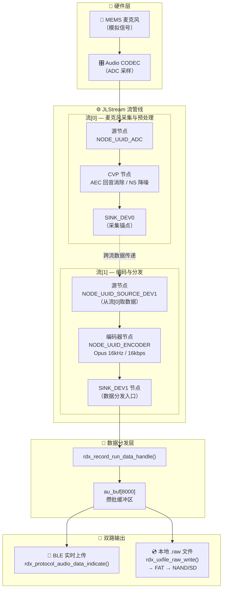

**关键点：**

- **流[0] 和流[1] 是两条独立的 JLStream**，通过 `NODE_UUID_SOURCE_DEV1` 跨流传递数据
- **编码器始终在管线中**，不存在"绕过编码器写 PCM"的路径
- **BLE 和文件拿到的是同一份 Opus 编码数据**，`.raw` 后缀是历史命名遗留——实际内容是 Opus 帧。文件格式由 `fwrite` 写入的数据决定，与后缀名无关

---

## 二、流管线搭建（录音启动）

### 2.1 启动时序

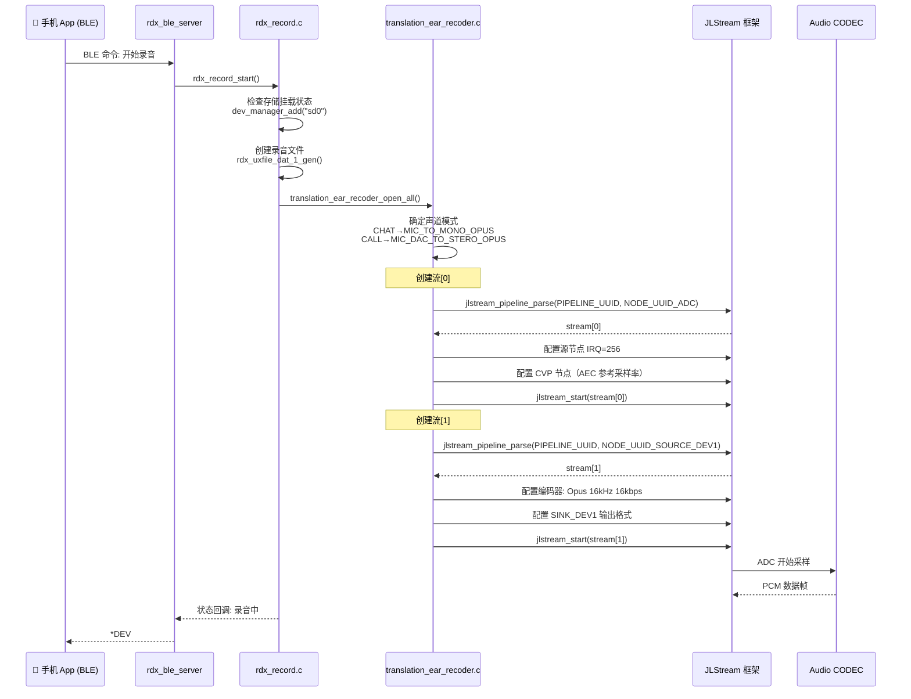

### 2.2 编码参数配置

代码位置：`audio/interface/recoder/translation_ear_recoder.c:100-110`（文件名本身含 typo：`recoder` 应为 `recorder`，但代码中统一使用前者）

```c
// Opus 编码参数
enc_fmt.bit_rate    = 16000;   // 16kbps
enc_fmt.quality     = 1;       // quality 级别
enc_fmt.sample_rate = 16000;   // 16kHz
fmt.sample_rate     = 16000;
fmt.coding_type     = AUDIO_CODING_OPUS;  // 0x00100000
```

### 2.3 场景与声道配置

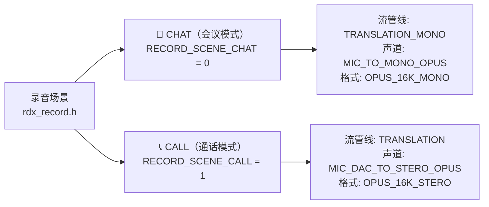

| 场景 | 流水线 UUID | 声道模式 | 格式 | 采样率 |
|:---|:---|:---|:---|:---|
| CHAT（会议） | `PIPELINE_UUID_TRANSLATION_MONO` (0x9463) | MIC 单声道 | `RECORD_FORMATE_OPUS_16K_MONO` | 16kHz |
| CALL（通话） | `PIPELINE_UUID_TRANSLATION` (0x218B) | MIC+DAC 立体声 | `RECORD_FORMATE_OPUS_16K_STERO` | 16kHz |

> **代码 typo 说明**：`RECORD_FORMATE`（应为 FORMAT）、`STERO`（应为 STEREO）、`CHANNAL`（应为 CHANNEL）是 RDX 协议代码中的原始拼写。本文档在引用标识符时保留代码原名以便搜索，正文中使用正确拼写。
>
> Zenchord 项目当前固定使用 **CALL 立体声模式**（`RDX_RECORD_CHANNAL_DUAL` = 1，代码中 `RDX_RECORD_CHANNEL_DUAL` 为本意）。

---

## 三、数据处理链路

### 3.1 流[0] — 麦克风采集与 CVP 处理

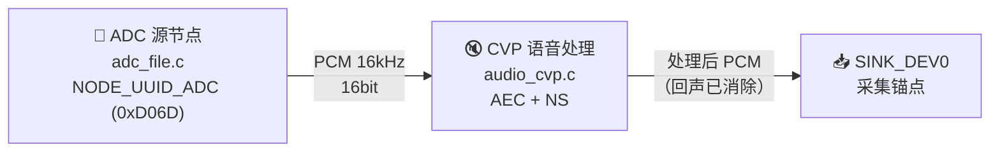

**CVP（Clear Voice Processing）节点**根据编译配置自动选择实现：
- `NODE_UUID_CVP_DEVELOP` (0x76EF) — 开发版
- `NODE_UUID_CVP_SMS_ANS` (0xD0BC) — 量产版 ANS

**处理内容：**
- **AEC**（Acoustic Echo Cancellation）：使用 DAC 输出作为参考信号，从麦克风信号中减去扬声器回音
- **NS**（Noise Suppression）：单麦克风/多麦克风降噪

### 3.2 流[1] — 编码与输出


### 3.3 SINK_DEV1 到数据分发的调用链

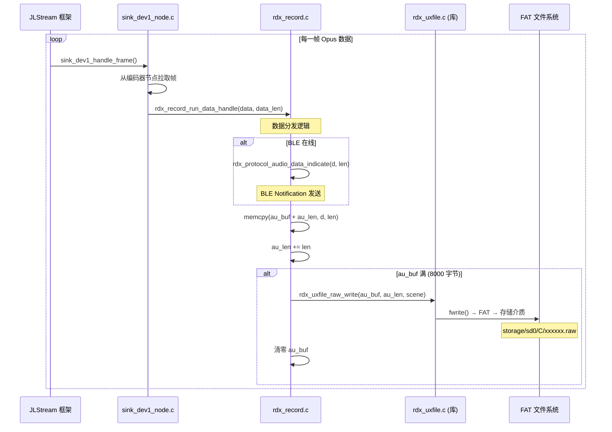

---

## 四、数据分发逻辑

### 4.1 `rdx_record_run_data_handle()` 核心流程

代码位置：`apps/common/third_party_profile/rdx_protocol/rdx_record.c:1659-1708`

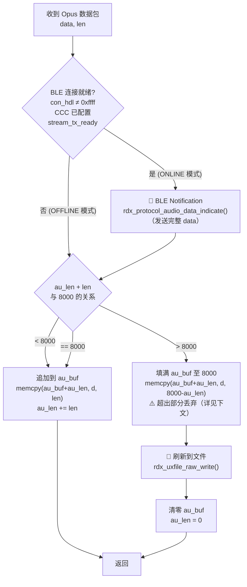

> **⚠️ 截断说明（`au_len + len > 8000` 分支）**
> 
> 当缓冲区剩余空间不足以容纳完整数据包时，代码用 `AUDIO_SEND_BUF_SIZE - au_len` 截断填充至恰好 8000 字节，**超出部分直接丢弃**。
> 
> ```c
> // rdx_record.c:1689-1691
> if(au_len + len > AUDIO_SEND_BUF_SIZE){
>     memcpy(au_buf + au_len, d, AUDIO_SEND_BUF_SIZE - au_len);  // 截断填充
>     au_len = AUDIO_SEND_BUF_SIZE;  // 超出数据丢弃
> }
> ```
> 
> **影响评估：**
> - **BLE 端无损**：`rdx_protocol_audio_data_indicate()` 在缓冲之前已发送完整的 `data` 包
> - **文件端丢尾包的部分字节**：每个 data 包约 40-80 字节（Opus 帧），8000 字节缓冲已远大于单帧，实际溢出概率极低（仅当 `au_len` 接近 8000 时才可能发生）
> - 这不是"主要数据丢失"路径——录音停止时 `rdx_record_run_exit()` 会刷新剩余缓冲，正常场景下不会丢数据

### 4.2 两种录音模式

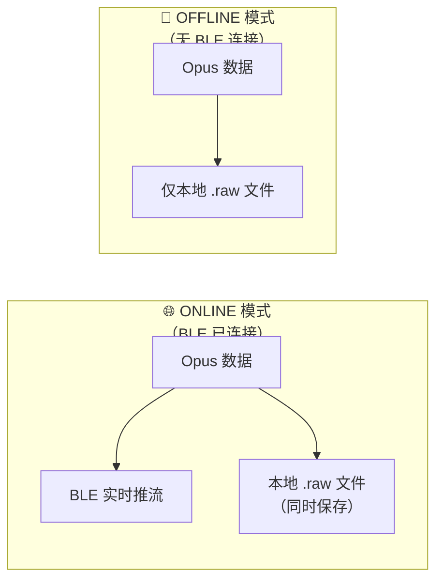

| 模式 | 枚举值 | BLE 推流 | 本地文件 | 触发条件 |
|:---|:---|:---|:---|:---|
| `RECORD_MODE_ONLINE` | 1 | ✅ 实时推送 | ✅ 同时保存 | BLE 已连接 + CCC 已配置 |
| `RECORD_MODE_OFFLINE` | 0 | ❌ 不推送 | ✅ 仅本地保存 | BLE 断开或未连接 |

> 注意：**两种模式都会保存本地 `.raw` 文件**。区别仅在于是否同时通过 BLE 实时推流。

### 4.3 录音停止时的收尾

代码位置：`rdx_record.c:1716-1769`

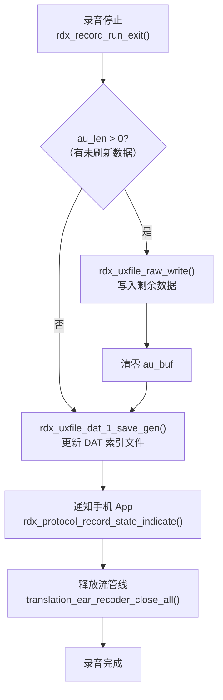

---

## 五、文件存储路径

### 5.1 `.raw` 后缀的误导

**文件格式由写入时的数据内容决定，与文件后缀名无关。** `fwrite` 写的是什么数据，文件就是什么格式。后缀只是一个标签，影响操作系统用哪个默认程序打开，不会改变文件的二进制内容。

本项目的录音文件：
- **后缀名**：`.raw`，暗示无压缩 RAW PCM
- **实际内容**：连续的 Opus 编码帧（16kHz / 16kbps）
- **原因**：历史命名遗留——最早版本可能确实是 RAW PCM，后来增加了 Opus 编码但代码中的后缀名未同步更新。无论后缀改成 `.opus`、`.bin` 还是任何其他名称，文件内容始终是 Opus 比特流

### 5.2 文件存储链路

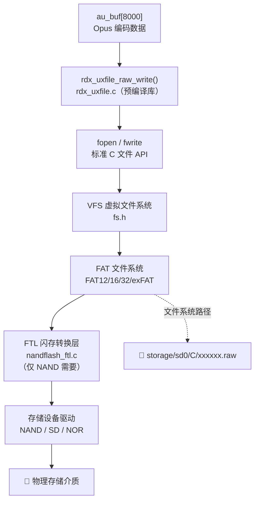

### 5.3 存储介质适配差异

| 存储介质 | 路径前缀 | 写入链路差异 | 说明 |
|:---|:---|:---|:---|
| **SD NAND / eMMC** | `storage/sd0/C/` | `fwrite` → FAT → FTL → NAND 驱动 → 物理芯片 | 当前 Zenchord 项目方案 |
| **SD 卡** | `storage/sd0/C/` | `fwrite` → FAT → SD 驱动 → SD 卡 | 同上路径，拔卡会导致 `fwrite` 失败 |
| **NOR Flash** | `storage/fat_nor/C/` | `fwrite` → FAT → NOR 驱动 → NOR 芯片 | 无 FTL 层，注意擦写寿命 |

> 上层代码（`rdx_record.c`、`rdx_uxfile.c`）不感知底层介质类型——都通过 `dev_reg[].fs_type = "fat"` 和 VFS 接口访问。介质切换只需变更 `dev_reg` 注册表中 `name` 字段对应的设备名和 `storage_path`。

### 5.4 文件命名规则

从日志可见（`COM3_2026-05-26_10-40-25.log`）：

```
filename: storage/sd0/C/49266f.raw
filename: storage/sd0/C/7a65d0.raw
```

- **目录**: `storage/sd0/C/` — 即 SD 卡/存储设备的分区 C 根目录
- **文件名**: 6 位十六进制随机串 + `.raw`，如 `49266f.raw`
- **命名空间**: 6 位十六进制 ≈ 1677 万个文件名，由预编译库内部管理碰撞检测与回绕
- **命名由 `rdx_uxfile.c`（预编译库）内部生成**，源码不可见

### 5.5 DAT 索引文件机制

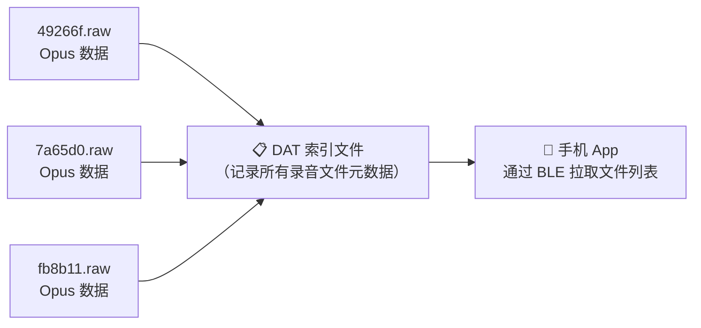

每个录音结束后，`rdx_uxfile_dat_1_save_gen()` 会将文件元信息（序号、文件名、场景、时长等）写入 DAT 索引。手机 App 开机后通过 `UXFILE_MSG_SYNC` 同步文件列表。

### 5.6 断电保护：pending.dat

代码接口（`rdx_uxfile.h:149`）：

```c
void rdx_uxfile_write_pending_marker(void);
```

录音过程中会写入 `pending.dat` 标记（每次 `rdx_uxfile_raw_write()` 刷盘时同步更新，标记当前录音文件的未闭合状态），正常结束时清除。开机扫描时若发现 `pending.dat`，可识别为异常中断的录音文件，App 端可据此决定是否丢弃或修复该文件。

### 5.7 异常与降级策略

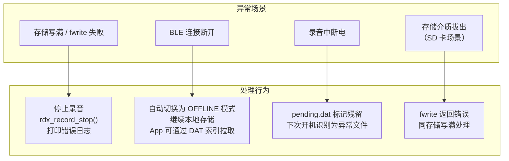

| 异常场景 | 代码行为 | 数据风险 |
|:---|:---|:---|
| `fwrite` 返回错误 | `rdx_uxfile_raw_write()` 返回负值 → `rdx_record_stop()` 停止录音，打印 `"!!! stream write fail, stop record!"` | 当前缓冲段丢失 |
| BLE 断连 | 自动降级为 OFFLINE，文件持续保存，App 后续可通过 DAT 索引发现并拉取离线期间产生的录音文件 | 无丢数据，实时性降级 |
| 存储写满 | 同 `fwrite` 失败，停止录音 | 已写入文件保留，无法继续录音 |
| 录音中死机/断电 | `pending.dat` 标记未清除，开机扫描时识别 | 最后一个缓冲段（≤8000 字节 ≈ 最多 4 秒 Opus）丢失 |

### 5.8 端到端延迟分析

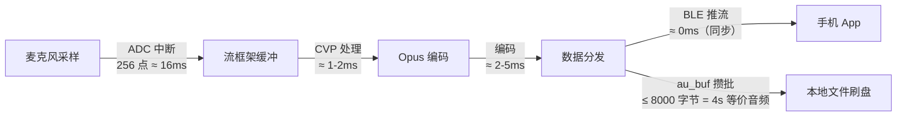

| 环节 | 延迟 | 说明 |
|:---|:---|:---|
| ADC 中断 | ~16ms | 256 点 / 16kHz = 16ms |
| CVP 处理 (AEC+NS) | ~1-2ms | 硬件加速 |
| Opus 编码 (16kbps) | ~2-5ms | 硬件/软件编码 |
| **BLE 推流端到端** | **~20-23ms** | 不含蓝牙链路延迟 |
| **au_buf 攒批延迟** | **0~4000ms** | 最坏情况：buffer 刚从空开始攒 |

> **关键结论：** BLE 推流延迟在 20-25ms 量级，满足实时通话需求。本地文件写入有最多 4 秒的攒批延迟——如果期间断电，此段数据丢失。可通过减小 `AUDIO_SEND_BUF_SIZE` 或增加定时 flush 来权衡 Flash 寿命和掉电安全性。

### 5.9 Opus 帧结构说明

`.raw` 文件内容是连续的 Opus 帧，无外层容器格式（无 Ogg/Matroska 封装）。

**每个 Opus 帧的结构：**

| 字段 | 大小 | 说明 |
|:---|:---|:---|
| TOC 字节 | 1 字节 | 包含立体声/单声道标志、帧时长 |
| Opus 帧数据 | 可变（约 20-80 字节） | 压缩音频载荷 |

**8000 字节缓冲的帧边界：**
- Opus 帧长可变（10/20/40/60ms），编码器输出以帧为单位
- `au_buf` 以字节为单位攒批，**不保证帧边界对齐**
- 解析 `.raw` 文件时需逐帧解析 TOC 字节来确定帧长，不能假设固定帧大小

**正确的 `.raw` 文件解析方式（PC 侧）：**

```bash
# 方案1: 使用 opusdec（需先手动剥离帧边界）
# 方案2: 使用 ffmpeg 的 raw Opus demuxer
ffmpeg -f opus -ar 16000 -ac 2 -i input.raw output.wav

# 方案3: 使用 Python + opuslib（示意代码，需自行实现 TOC 帧边界解析）
# opuslib 不提供 parser 模块，替代方案: pyogg / pydub / 手动按 TOC 解析帧长
import opuslib
import struct

def parse_opus_toc(toc_byte, sample_rate=16000):
    \"\"\"从 TOC 字节提取帧时长（毫秒）。Opus RFC 6716 §3.1.\"\"\"
    toc_config = toc_byte >> 3
    if toc_config < 12:       return 10   # 2.5ms 仅 CELT-only，实际最小 10ms
    elif toc_config < 16:     return 20
    elif toc_config < 20:     return 40
    elif toc_config < 24:     return 60
    else:                     return 0    # 无效配置

decoder = opuslib.Decoder(16000, 2)  # 16kHz, stereo
with open('input.raw', 'rb') as f:
    while True:
        toc = f.read(1)
        if not toc: break
        frame_duration_ms = parse_opus_toc(toc[0])
        if frame_duration_ms == 0: break  # 无效帧，停止
        # Opus 为 VBR，帧大小与码率和帧时长相关（16kbps ≈ 2000 bytes/s）
        # 20ms 帧 ≈ 40 字节，40ms 帧 ≈ 80 字节，此为近似值
        estimated_frame_bytes = frame_duration_ms * 2000 // 1000  # rate=16kbps
        frame = f.read(estimated_frame_bytes)
        pcm = decoder.decode(frame, len(frame))
```

---

## 六、附录

### 6.1 关键文件索引

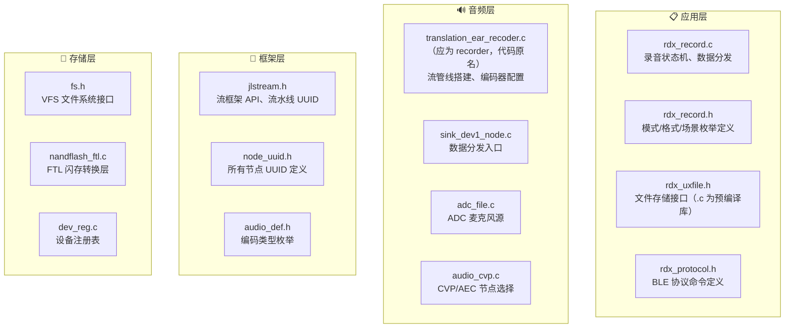

### 6.2 参数速查表

| 参数 | 值 | 定义位置 |
|:---|:---|:---|
| 编码格式 | Opus (`AUDIO_CODING_OPUS` = 0x00100000) | `audio_def.h:188` |
| 采样率 | 16 kHz | `translation_ear_recoder.c:109` |
| 编码比特率 | 16 kbps | `translation_ear_recoder.c:106` |
| 缓冲大小 | 8000 字节 (`AUDIO_SEND_BUF_SIZE`) | `rdx_record.c:89` |
| 文件路径 | `storage/sd0/C/xxxxxx.raw` | `rdx_uxfile.c`（库） |
| 文件后缀 | `.raw`（仅为命名，实际内容为 Opus，格式由写入数据决定） | 历史命名遗留 |
| 流管线 TRANSLATION | 0x218B（立体声） | `jlstream.h:102` |
| 流管线 TRANSLATION_MONO | 0x9463（单声道） | `jlstream.h:103` |
| ADC 源节点 | `NODE_UUID_ADC` (0xD06D) | `node_uuid.h:22` |
| 编码器节点 | `NODE_UUID_ENCODER` | `node_uuid.h` |
| SINK_DEV1 节点 | `NODE_UUID_SINK_DEV1` | `node_uuid.h` |

### 6.3 数据流完整路径（一句话版）

```
麦克风 → ADC(16kHz/16bit) → CVP(AEC+降噪) → SOURCE_DEV1 → Opus编码器(16kbps)
    → SINK_DEV1 → rdx_record_run_data_handle()
        ├── BLE Notification (ONLINE模式)
        └── au_buf攒批(8000字节) → fwrite → FAT文件系统 → storage/sd0/C/xxxxxx.raw
```

---

> **相关文档**
> - [1-1. SPI NAND Flash 接入 JL 平台可行性分析](1-1.SPI_NANDFLASH接入JL平台可行性分析.md)
> - [1-2. JL 平台从闭源 FTL 到开源 FTL 迁移分析](1-2.JL平台从闭源FTL到开源FTL迁移分析.md)
> - [0. 存储介质与文件系统的关系](0.存储介质与文件系统的关系.md)
