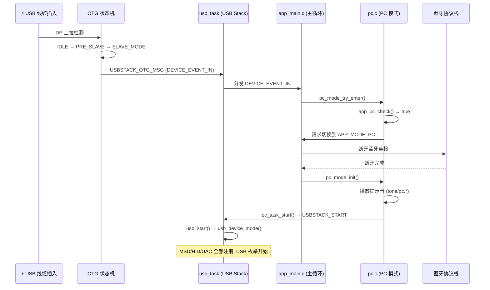
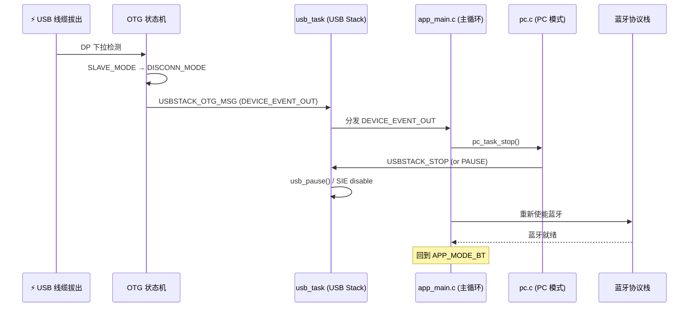
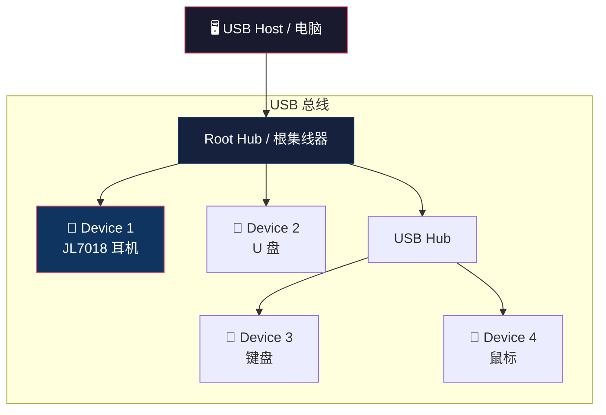
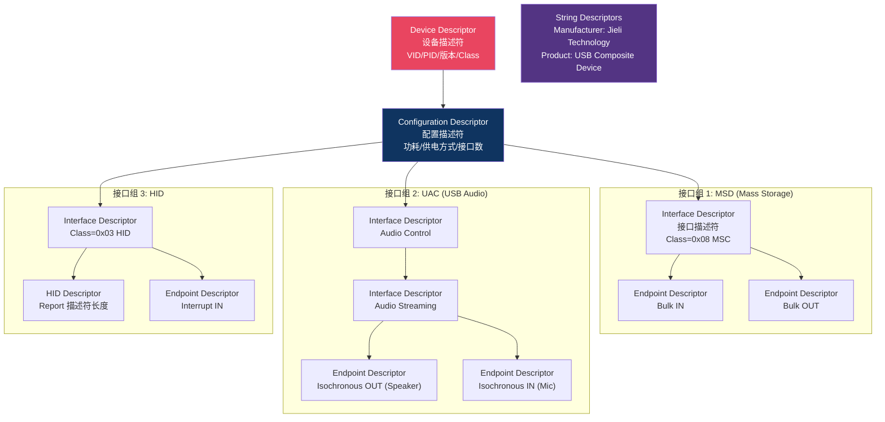
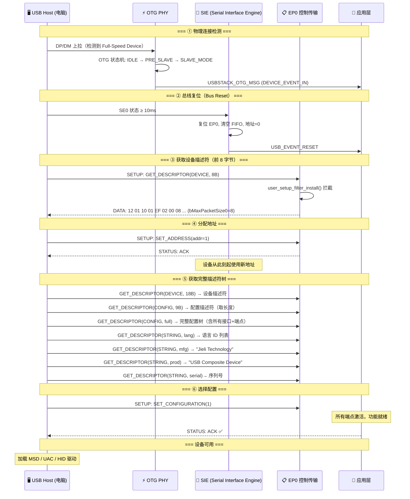
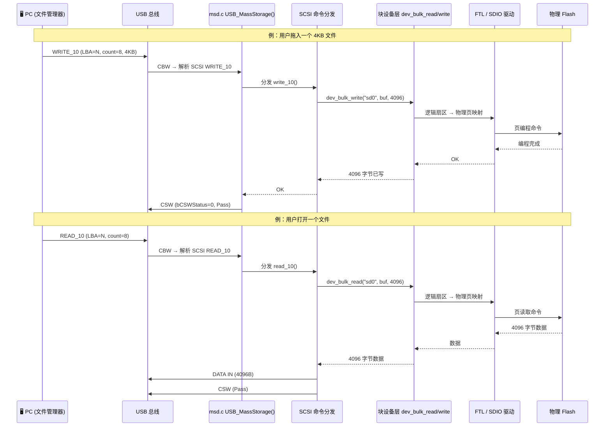
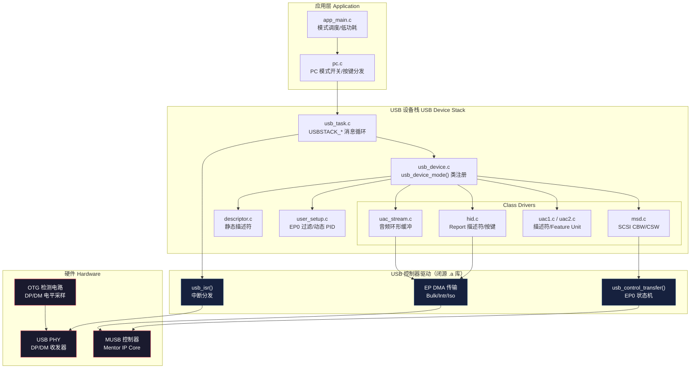
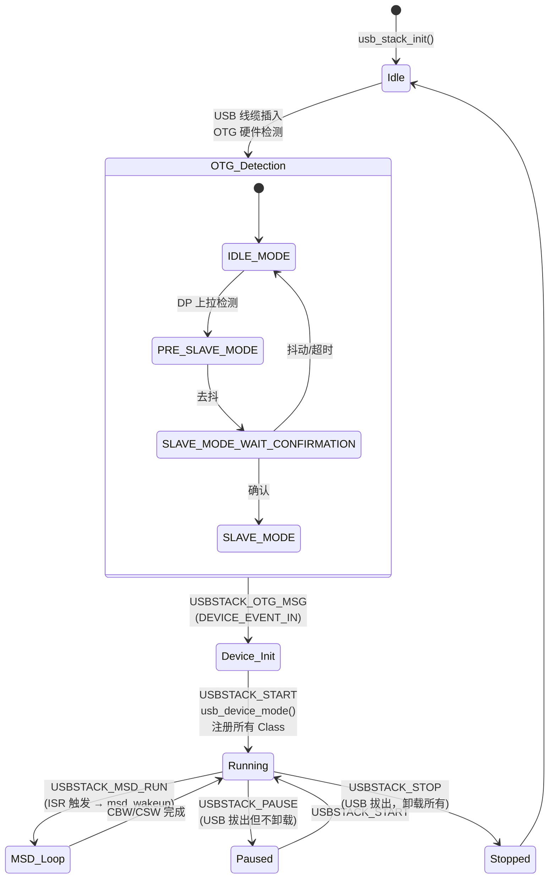

# JL 平台文件系统与 PC 模式

## 一、PC 模式是什么

PC 模式（PC Mode）是 JL7018（AC701N BR28）平台的一种应用运行模式。设备通过 USB 连接到电脑后，作为一个 **USB 复合设备（Composite Device）**，同时向主机提供以下功能：

| USB Class | 说明 | 控制宏 |
|-----------|------|--------|
| **Mass Storage（MSD，大容量存储）** | 将外部 Flash 以 FAT32 可移动磁盘的形式暴露给电脑，可直接读写文件 | `TCFG_USB_SLAVE_MSD_ENABLE` |
| **USB Audio - Speaker（UAC 扬声器）** | 设备作为 USB 音箱播放电脑音频 | `TCFG_USB_SLAVE_AUDIO_SPK_ENABLE` |
| **USB Audio - Microphone（UAC 麦克风）** | 设备作为 USB 麦克风采集音频传给电脑 | `TCFG_USB_SLAVE_AUDIO_MIC_ENABLE` |
| **USB HID** | 设备上的按键（播放/暂停、音量、切歌）作为 HID 键盘事件发送给电脑 | `TCFG_USB_SLAVE_HID_ENABLE` |

> 此外平台还支持 CDC（虚拟串口）、MTP（媒体传输协议）、MIDI、Printer 等 USB Class，但当前项目仅使用上述四种。

---

## 二、PC 模式的场景与能力边界

### 2.1 典型使用场景

1. **U 盘模式 / 读卡器模式**：用户插 USB 线到电脑，耳机/设备变成一个 FAT32 U 盘，直接拖拽音乐文件、升级固件、导出录音文件。
2. **USB 耳麦模式**：设备同时充当 USB 音箱 + USB 麦克风，用于 PC 视频会议、网课、游戏语音。
3. **媒体遥控**：设备按键控制电脑上的音乐播放（播放/暂停/上一首/下一首/音量）。

### 2.2 PC 模式与其他模式的关系

JL 平台的应用模式是互斥的，同一时刻只能处于一种模式：

| 模式 | 宏 | 说明 |
|------|-----|------|
| 蓝牙模式 | `TCFG_APP_BT_EN` | 蓝牙耳机/音箱，当前项目主模式 |
| PC 模式 | `TCFG_APP_PC_EN` | USB 复合设备 |
| LineIn 模式 | `TCFG_APP_LINEIN_EN` | 外部模拟音频输入 |
| 音乐模式 | `TCFG_APP_MUSIC_EN` | 本地播放（SD 卡/U 盘播放器） |

**模式切换逻辑**：
- USB OTG 检测到 Slave 连接 → `app_pc_check()` 返回 true → `pc_mode_try_enter()` 触发切换到 PC 模式
- USB 拔出 → `DEVICE_EVENT_OUT` → 退出 PC 模式，回到蓝牙模式

### 2.3 能力边界

**PC 模式能做的：**
- 将外部 Flash（SD NAND / SPI NAND）以 USB Mass Storage 方式暴露给电脑
- 同步传输 USB Audio（双向：SPK + MIC）
- 发送 HID 媒体控制键
- 插电即自动进入（OTG 检测，无需用户手动切换）

**PC 模式不能做的 / 限制：**
- PC 模式和蓝牙模式**不能同时运行**——进入 PC 模式后蓝牙会断开
- PC 模式下设备**不能同时访问 Flash 文件系统**——电脑以 block device 方式独占了 Flash，设备端文件操作（如录音写文件、音乐播放）在 MSD 激活期间不可用
- PC 模式要求 USB OTG 工作在 **Slave（Device）模式**，不支持作为 USB Host 连接 U 盘
- SD NAND 和 SPI NAND **二选一**，因为共用 PC03/PC04/PC05 引脚

### 2.4 模式切换完整调用链

**蓝牙模式 → PC 模式：**



**PC 模式 → 蓝牙模式：**



> **关键文件**：`app_main.c` 中的 `app_mode_switch()` 是模式切换的调度中心，`pc.c:pc_mode_try_enter()` 和 `pc.c:pc_task_stop()` 是 PC 模式的入口/出口。

---

## 三、外部 Flash 存储方案

PC 模式的 Mass Storage 功能需要底层有外部 Flash 作为存储介质。JL7018 支持两种方案，但**互斥使用**：

### 3.1 SD NAND（SDIO 接口，当前项目启用）

```
TCFG_SD0_ENABLE = 1
```

- **本质**：封装为 SD 卡协议的 NAND Flash 芯片，通过 SDIO 接口通信
- **引脚**：PC03 (DATA0), PC04 (CLK), PC05 (CMD)，1-bit 模式 @ 1MHz
- **MSD 注册名**：`"sd0"`
- **文件系统**：FAT32，挂载路径 `storage/sd0/C/`
- **优缺点**：接口标准化，驱动成熟，但速度受 SDIO 1-bit 模式限制

### 3.2 SPI NAND（SPI 接口，当前项目禁用）

```
TCFG_NANDFLASH_DEV_ENABLE 未定义（默认值 0）
TCFG_SD0_ENABLE = 1
```

- **硬件**：GD5F4GM7UE，512MB，SPI1 单线半双工，内部 8-bit ECC
- **引脚**：PC04 (CLK), PC03 (DO), PC05 (CS)——与 SD0 完全重叠
- **架构**：`nandflash_dev_ops`（裸 NAND 驱动）→ FTL 层 → `ftl_dev_ops`（块设备抽象）
- **MSD 注册名**：`"nandflash_ftl"`，但 `dev_reg.c` 中别名为 logo `"sd0"`
- **优缺点**：时钟频率（2MHz）高于当前 SD NAND 的 1MHz，但受 FTL 层开销、单线半双工模式、片上 ECC 计算等影响，实际有效吞吐需实测，不可仅凭时钟频率判断

> 当前 `board_ac701n_demo_cfg.h` 中没有定义 `TCFG_NANDFLASH_DEV_ENABLE`，因此 SPI NAND 相关代码不编译。

### 3.3 互斥保护

SD0（SD NAND）与 SPI NAND 共用 PC03/PC04/PC05 引脚，因此两者必须二选一。当前项目通过**只启用 SD0、不定义 SPI NAND 宏**实现互斥：

```c
// board_ac701n_demo_cfg.h
#define TCFG_HW_SPI1_ENABLE  0       // SPI1 已关闭
// TCFG_NANDFLASH_DEV_ENABLE 未定义，默认值为 0

// sdk_config.h
#define TCFG_SD0_ENABLE      1       // SD NAND 已启用
```

> 当前代码中**没有** `#error` 编译期断言。若未来需要同时支持两种方案切换，建议在 `board_ac701n_demo_cfg.h` 末尾增加显式检查：
> ```c
> #if (TCFG_SD0_ENABLE && TCFG_NANDFLASH_DEV_ENABLE)
> #error "GPIO conflict: SD0 and SPI NAND share PC03/PC04/PC05, cannot enable both"
> #endif
> ```

### 3.4 别名机制（logo 机制）

SPI NAND 的 `dev_reg.c` 注册项将 `logo` 设为 `"sd0"`（并非 `"nandflash_ftl"`），原因是录音库中硬编码了 `dev_manager_add("sd0")`。JL 的设备管理框架支持 "同一设备、多个 logo"——真实设备名仍是 `"nandflash_ftl"`，但对 `"sd0"` 的查询会被路由到它。这使得预编译库在两种存储方案下无需修改。

---

## 四、如何开启 PC 模式

### 4.1 总开关

在 `apps/earphone/board/br28/sdk_config.h` 中：

```c
#define TCFG_APP_PC_EN  1   // 从 0 改为 1
```

这个宏是关键入口，它驱动了两层推导：

**第一层：应用层推导**（`apps/earphone/include/app_config.h:160-161`）：
```
TCFG_APP_PC_EN = 1
  └── TCFG_PC_ENABLE = TCFG_APP_PC_EN = 1
```
`app_config.h` 的职责仅限于将应用层宏 `TCFG_APP_PC_EN` 透传为驱动层使用的 `TCFG_PC_ENABLE`。

**第二层：USB 驱动层推导**（`apps/common/device/usb/usb_common_def.h:78-132`）：
```
TCFG_PC_ENABLE = 1
  ├── TCFG_OTG_MODE_SLAVE = OTG_SLAVE_MODE  (line 80, 否则为 0)
  └── TCFG_USB_SLAVE_ENABLE = 1             (line 132, 否则为 0)
```
这两个宏的推导**完全在 `usb_common_def.h` 中独立完成**，`app_config.h` 不参与。它们之间并非父子级联，而是**并列受控于** `TCFG_PC_ENABLE`。

**第三层：设备管理器**（`app_config.h:187-188`）：
```
TCFG_APP_PC_EN = 1 → TCFG_DEV_MANAGER_ENABLE = 1
```
### 4.2 关键前提：`TCFG_CHARGE_POWERON_ENABLE` 必须为 1

产品只有一个 USB 物理接口，需要同时承担**充电**和 **PC 模式**两个角色。JL 平台通过 `TCFG_CHARGE_POWERON_ENABLE` 来控制这一行为。

**当前项目状态：**

```c
// sdk_config.h:32
#define TCFG_CHARGE_POWERON_ENABLE  0   // 当前为 0
```

**为什么这个宏是硬前提：**

```
单 USB 口插入
  ├── TCFG_CHARGE_POWERON_ENABLE = 1
  │     → 设备开机 → USB OTG 栈初始化
  │     → 检测 DP/DM 线状态：
  │         ├── PC Host（DP 上拉）→ usb_otg_online() = SLAVE_MODE → 切到 APP_MODE_PC ✅
  │         └── 充电器（DP/DM 短接/浮空）→ 保持在 IDLE_MODE_CHARGE（充电）
  │
  └── TCFG_CHARGE_POWERON_ENABLE = 0
        → 设备不开机 → 只有硬件级充电（充电 IC 自主工作）
        → OTG 栈未运行 → 无法检测 PC Host → 永远进不了 PC 模式 ❌
```

**JL 代码中对此的显式处理**（`app_default_msg_handler.c:318-326`）：

```c
//PC 不响应因为设备上线引发的模式切换
if (true != app_in_mode(APP_MODE_PC)) {

#if (TCFG_CHARGE_ENABLE && (!TCFG_CHARGE_POWERON_ENABLE))
    // 当 TCFG_CHARGE_POWERON_ENABLE = 0 时，如果 USB 在线且目标不是 PC 模式，
    // 拦截模式切换——说明 JL 明确考虑了"关机充电"和"PC 模式"的互斥场景
    if (get_charge_online_flag() && app != APP_MODE_PC) {
        return hdl_ret;
    }
#endif
```

> **结论**：对于只有一个 USB 口的产品，`TCFG_CHARGE_POWERON_ENABLE` 和 `TCFG_APP_PC_EN` **必须同时为 1**，否则插 USB 线到电脑只会关机充电，不会进入 PC 模式。
>
> 当前项目中两者都为 0，因此 PC 模式完全关闭。若要开启，请同时修改 `sdk_config.h`：
> ```c
> #define TCFG_CHARGE_POWERON_ENABLE  1
> #define TCFG_APP_PC_EN              1
> ```

**与 `TCFG_CHARGE_OFF_POWERON_EN` 的配合**

`sdk_config.h:33` 还有一个相关宏：

```c
#define TCFG_CHARGE_OFF_POWERON_EN  0   // 拔出开机
```

两个宏分别控制不同触发条件下的开机行为：

| 宏 | 触发条件 | 当前值 | 作用 |
|---|---|:---:|---|
| `TCFG_CHARGE_POWERON_ENABLE` | USB 插入/入舱 | `0` | 决定是否由充电事件触发设备开机 |
| `TCFG_CHARGE_OFF_POWERON_EN` | USB 拔出/出舱 | `0` | 决定是否由拔出事件触发设备开机 |

对于 PC 模式，**只需要关心 `TCFG_CHARGE_POWERON_ENABLE`**：它必须为 1，否则插 USB 线时设备不会开机，OTG 栈也不会运行。`TCFG_CHARGE_OFF_POWERON_EN` 影响的是拔出开机行为，与 PC 模式无直接关系。当前两者都为 0，意味着无论插入还是拔出都不会自动触发开机。

### 4.3 前提条件：外部 Flash

PC 模式的 Mass Storage 功能依赖外部 Flash 已正确挂载。确认以下之一已启用：

**方案 A — SD NAND（当前已启用，无需改动）：**
```c
#define TCFG_SD0_ENABLE  1   // sdk_config.h:83，已为 1
```

**方案 B — SPI NAND（如需切换）：**
```c
#define TCFG_SD0_ENABLE             0   // 先关闭 SD0
#define TCFG_NANDFLASH_DEV_ENABLE   1   // 在 board_ac701n_demo_cfg.h 或 sdk_config.h 中新增
```

> 注意：当前 `board_ac701n_demo_cfg.h` 中**没有定义** `TCFG_NANDFLASH_DEV_ENABLE`，因此其默认值为 0，SPI NAND 不编译。若要切换到 SPI NAND 方案，需要显式添加该宏定义并将其设为 1，同时关闭 `TCFG_SD0_ENABLE`。

#### 关于 `TCFG_SD0_FORMAT_ON_BOOT` 与 PC 模式的关系

当前项目启用了 `TCFG_SD0_FORMAT_ON_BOOT`（`board_ac701n_demo_cfg.h:103`），用于在 `sd0` 首次 mount 失败时自动格式化。这对 PC 模式的影响：

- **首次上电**：SD NAND 未格式化或文件系统损坏时，系统会自动 `f_format()` 成 FAT32，然后 PC 模式才能正常识别为可移动磁盘。
- **PC 模式下电脑格式化**：用户在电脑上格式化 U 盘后，`TCFG_SD0_FORMAT_ON_BOOT` 的 VM 标志位仍然有效，因此下次开机不会重复格式化，不会误删用户数据。
- **VM 被擦除的风险**：若后续 OTA/烧录升级策略会擦除 VM，则下次 boot 会再次触发自动格式化，需同步调整策略。

**相关测试开关**：

`board_ac701n_demo_cfg.h:107` 还定义了 `TCFG_SD0_FORCE_FORMAT_ON_BOOT`：

```c
#define TCFG_SD0_FORCE_FORMAT_ON_BOOT  DISABLE_THIS_MOUDLE
```

- 该开关用于**调试**：打开后无论 `sd0` mount 是否成功，都会强制进入格式化分支。
- **量产时必须关闭**，否则每次开机都会重新格式化 SD NAND，导致用户数据丢失。
- 仅在排查 mount 失败后的自动格式化路径时临时打开。

### 4.4 子功能开关（按需调整）

`sdk_config.h` 中以下宏控制 PC 模式下具体暴露哪些 USB 功能（当前已全部开启）：

```c
#define TCFG_USB_SLAVE_MSD_ENABLE          1   // U盘/读卡器功能
#define TCFG_USB_SLAVE_AUDIO_SPK_ENABLE    1   // USB 扬声器
#define TCFG_USB_SLAVE_AUDIO_MIC_ENABLE    1   // USB 麦克风
#define TCFG_USB_SLAVE_HID_ENABLE          1   // 媒体按键
```

### 4.5 完整开启步骤总结

| 步骤 | 文件 | 操作 | 说明 |
|------|------|------|------|
| 1 | `sdk_config.h:32` | `TCFG_CHARGE_POWERON_ENABLE` 改为 `1` | 插电开机，PC 模式硬前提（当前为 0） |
| 2 | `sdk_config.h:261` | `TCFG_APP_PC_EN` 改为 `1` | 总开关（当前为 0） |
| 3 | `sdk_config.h:83` | 确认 `TCFG_SD0_ENABLE = 1` | SD NAND 已启用（当前默认） |
| 4 | `sdk_config.h:108-116` | 确认四个 `TCFG_USB_SLAVE_*` 宏为 `1` | USB 子功能（当前默认全开） |
| 5 | 释放 USB DP/DM 引脚 | `sdk_config.h:53`、`sdk_config.h:63-65`、`sdk_config.h:418` | 关闭/移出 UART 调试、在线调试、数据导出对 DP/DM 的占用 | 不开 PC 模式时可跳过 |
| 6 | `sdk_config.h:261` | `TCFG_APP_PC_EN` 改为 `1` | 总开关（当前为 0） | 先验证充电开机时可不改 |
| 7 | `board_ac701n_demo_cfg.h:103` | 确认 `TCFG_SD0_FORMAT_ON_BOOT` 状态 | 建议保持 `ENABLE_THIS_MOUDLE`，兼容首次上电未格式化 | 已启用，保持 |
| 8 | 编译烧录 | — | 插 USB 线到电脑即可自动进入 PC 模式 | |

### 分阶段验证建议

**阶段 1：仅验证充电中开机（不影响打印）**

```c
#define TCFG_CHARGE_POWERON_ENABLE    1
#define TCFG_DEBUG_UART_ENABLE        1
#define TCFG_APP_PC_EN                0
```

- 插 USB 线设备开机
- 打印继续从 DP 输出
- 不会进入 PC 模式

**阶段 2：完整开启 PC 模式**

```c
#define TCFG_CHARGE_POWERON_ENABLE    1
#define TCFG_DEBUG_UART_ENABLE        0   // 或切换到其他 GPIO
#define TCFG_ONLINE_TX_PORT           NO_CONFIG_PORT
#define TCFG_ONLINE_RX_PORT           NO_CONFIG_PORT
#define TCFG_DATA_EXPORT_UART_TX_PORT NO_CONFIG_PORT
#define TCFG_APP_PC_EN                1
```

- 插 USB 线设备开机
- DP/DM 用于 USB 枚举
- 插入电脑后自动进入 PC 模式

### 4.6 为什么当前是关闭的

```
commit 60c55a53: "fix: - 关闭PC模式可以启动到eff verify test"
```

当前 `sdk_config.h` 中：

```c
#define TCFG_CHARGE_POWERON_ENABLE  0
#define TCFG_APP_PC_EN              0
```

PC 模式开启时，USB OTG Slave 的检测逻辑会干扰 EFF（音效验证测试）的启动流程，因此被临时关闭。同时 `TCFG_CHARGE_POWERON_ENABLE` 也保持为 0，进一步确保插 USB 线时不会误触发 PC 模式切换。

**具体干扰机制**：

- EFF 测试通常由特定引脚电平或充电盒/工装触发，启动后会进入音效验证循环。
- 若 `TCFG_APP_PC_EN = 1` 且 `TCFG_CHARGE_POWERON_ENABLE = 1`，插入 USB 线时 OTG 状态机会检测到 DP 上拉，优先进入 `SLAVE_MODE`，触发 `pc_mode_try_enter()`，将当前模式切到 `APP_MODE_PC`。
- 这会导致 EFF 测试还没运行就被打断，蓝牙断开、USB 枚举开始，无法完成音效验证。
- 临时方案就是同时关闭两个宏：
  - `TCFG_APP_PC_EN = 0` 禁用 PC 模式总开关；
  - `TCFG_CHARGE_POWERON_ENABLE = 0` 让 USB 插入不自动开机，OTG 栈不初始化，从根本上避免误判。

**后续若要共存**，可考虑：

1. 在 EFF 测试期间通过软件标志位临时禁用 PC 模式进入；
2. 或增加一个组合条件（如 EFF 引脚有效时不响应 OTG Slave 检测）。

若要重新开启 PC 模式，**必须同时**把 `TCFG_CHARGE_POWERON_ENABLE` 和 `TCFG_APP_PC_EN` 都改为 1。

### 4.7 调试 UART 与 USB DP/DM 的引脚冲突

当前项目为了节省 GPIO，把调试 UART TX 和在线调试 UART 复用到了 USB DP/DM 引脚上：

```c
// sdk_config.h:53-56
#define TCFG_DEBUG_UART_ENABLE    1
#define TCFG_DEBUG_UART_TX_PIN    IO_PORT_DP       // 调试打印 TX

// sdk_config.h:63-65
#define TCFG_ONLINE_TX_PORT       IO_PORT_DP       // 在线调试 TX
#define TCFG_ONLINE_RX_PORT       IO_PORT_DM       // 在线调试 RX
#define TCFG_COMM_TYPE            TCFG_UART_COMM

// sdk_config.h:418
#define TCFG_DATA_EXPORT_UART_TX_PORT  IO_PORT_DM  // 数据导出发送引脚
```

USB Full-Speed 使用 DP（D+）和 DM（D-）作为差分信号线。开启 PC 模式前，**必须释放这两个引脚**，否则电脑无法完成 USB 枚举。

#### 分阶段验证建议

如果只是想先验证"插 USB 线能否充电中开机"，可以只改 `TCFG_CHARGE_POWERON_ENABLE = 1`，保持打印打开：

```c
// sdk_config.h:32
#define TCFG_CHARGE_POWERON_ENABLE    1

// sdk_config.h:53
#define TCFG_DEBUG_UART_ENABLE        1   // 保持打开

// sdk_config.h:261
#define TCFG_APP_PC_EN                0   // 保持关闭
```

此时：
- OTG Slave 功能未启用，不会进入 PC 模式；
- 插 USB 线设备会开机；
- DP 继续作为调试 UART TX 使用，打印输出不受影响；
- 连电脑时电脑端可能检测不到有效 USB 设备，但不会触发模式切换。

#### 完整开启 PC 模式前必须做的修改

确认 `TCFG_APP_PC_EN = 1` 之前，需要先把调试 UART 从 DP/DM 上移开或关闭：

| 宏 | 当前值 | 建议修改 | 说明 |
|---|---|---|---|
| `TCFG_DEBUG_UART_ENABLE` | `1` | `0` | 关闭调试串口打印，或切换到其他 GPIO |
| `TCFG_ONLINE_TX_PORT` | `IO_PORT_DP` | `NO_CONFIG_PORT` | 关闭在线调试 TX |
| `TCFG_ONLINE_RX_PORT` | `IO_PORT_DM` | `NO_CONFIG_PORT` | 关闭在线调试 RX |
| `TCFG_DATA_EXPORT_UART_TX_PORT` | `IO_PORT_DM` | `NO_CONFIG_PORT` | 关闭数据导出 |

修改后：

```c
// sdk_config.h:53
#define TCFG_DEBUG_UART_ENABLE    0

// sdk_config.h:63-65
#define TCFG_ONLINE_TX_PORT       NO_CONFIG_PORT
#define TCFG_ONLINE_RX_PORT       NO_CONFIG_PORT
// #define TCFG_COMM_TYPE         TCFG_UART_COMM   // 注释掉或删除

// sdk_config.h:418
#define TCFG_DATA_EXPORT_UART_TX_PORT  NO_CONFIG_PORT
```

**注意**：关闭 `TCFG_DEBUG_UART_ENABLE` 后将没有串口日志输出。如果还需要看日志，建议把调试 UART 切换到其他空闲 GPIO（如 `IO_PORTA_05`），而不是直接关掉。切换方式：

```c
#define TCFG_DEBUG_UART_TX_PIN    IO_PORTA_05
```

但要确认目标 GPIO 没有被其他外设（如 SPI、I2C、按键）占用。

### 4.8 充电行为说明

`TCFG_CHARGE_POWERON_ENABLE` 只决定是否由 USB 插入事件触发开机，不影响硬件充电本身：

| 状态 | `TCFG_CHARGE_POWERON_ENABLE = 0` | `TCFG_CHARGE_POWERON_ENABLE = 1` |
|---|---|---|
| 硬件充电 | ✅ 正常充电 | ✅ 正常充电 |
| 插 USB 是否开机 | ❌ 不开机 | ✅ 开机 |
| 连电脑能否进 PC 模式 | ❌ 不能 | 还需 `TCFG_APP_PC_EN = 1` |
| 连充电器 | 关机充电 | 开机后走充电模式 |

也就是说：**充电功能不受 `TCFG_CHARGE_POWERON_ENABLE` 影响**，改变的只是系统对 USB 插入事件的响应。

---

## 五、关键代码路径

| 文件 | 职责 |
|------|------|
| `apps/earphone/board/br28/sdk_config.h` | 主配置——`TCFG_APP_PC_EN` 总开关、`TCFG_SD0_ENABLE` 存储开关、USB Slave 子功能开关 |
| `apps/earphone/board/br28/board_ac701n_demo_cfg.h` | 板级配置——`TCFG_NANDFLASH_DEV_ENABLE`（当前未定义/禁用）、`TCFG_SD0_FORMAT_ON_BOOT` |
| `apps/earphone/include/app_config.h` | 级联宏定义——`TCFG_PC_ENABLE`、`TCFG_USB_SLAVE_ENABLE`、`TCFG_OTG_MODE_SLAVE` 的推导 |
| `apps/earphone/mode/pc/pc.c` | PC 模式实现——进入/退出检测、USB Stack 启动/停止、HID 按键处理 |
| `apps/common/device/usb/device/task_pc.c` | USB Slave 启动——`usb_start()` 注册 MSD/MTP 磁盘和所有 USB Class |
| `apps/common/device/usb/device/msd.c` | Mass Storage Class 实现——SCSI 命令处理、block device 读写 |
| `apps/common/device/usb/usb_common_def.h` | USB 公共宏——`TCFG_OTG_MODE_SLAVE`、`TCFG_USB_SLAVE_ENABLE` 的条件推导 |
| `apps/earphone/device_config.c` | 设备注册——SD0 / NAND Flash 的平台数据配置 |
| `apps/common/dev_manager/dev_reg.c` | 设备注册表——logo/name/path/fs_type 映射 |
| `apps/earphone/app_main.c` | 主任务循环——模式调度、睡眠/低功耗逻辑 |

---

## 六、USB 协议：开源标准，闭源实现

### 6.1 结论

| 层面 | 开源/闭源 | 说明 |
|------|-----------|------|
| **USB 协议标准** | **开源** | USB-IF（USB Implementers Forum）维护的公开标准，任何人都可以从 [usb.org](https://www.usb.org) 免费下载全部规范文档 |
| **JL SDK USB 驱动代码** | **闭源** | 珠海杰理科技（Zhuhai Jieli Technology）的专有实现，以 `.a` 库 + 部分 `.c` 源码形式提供。其中 MUSB 控制器寄存器层、OTG 状态机等核心逻辑封装在预编译库中，仅暴露 API 头文件 |

### 6.2 USB 标准文档体系

USB 协议由 USB-IF 发布，核心规范如下：

| 规范 | 版本 | 说明 |
|------|------|------|
| USB 2.0 Specification | 2.0 | 基础框架：电气特性、总线协议、枚举流程、Hub、OTG |
| USB 3.x Specification | 3.0/3.1/3.2 | 超速传输、新增引脚、电源管理 |
| USB Device Class Specifications | 各版本 | 各类设备的标准行为定义 |
| USB Type-C Specification | 2.1+ | Type-C 接口/PD 供电/Alternate Mode |

JL7018 实现的是 **USB 1.1 Full Speed（12 Mbps）**，部分兼容 USB 2.0 协议层。

### 6.3 JL SDK 中开源 vs 闭源的边界

```
开源部分（SDK 提供 .c 源码）:
├── apps/common/device/usb/device/msd.c       SCSI 命令解析
├── apps/common/device/usb/device/hid.c       HID 报告、按键处理
├── apps/common/device/usb/device/uac1.c      UAC1 描述符配置
├── apps/common/device/usb/device/uac_stream.c 音频数据通路
├── apps/common/device/usb/device/descriptor.c  静态描述符
├── apps/common/device/usb/device/user_setup.c  动态描述符、EP0 过滤
├── apps/common/device/usb/device/task_pc.c     usb_start() 类注册
├── apps/common/device/usb/usb_task.c         消息调度循环
└── apps/earphone/mode/pc/pc.c                应用层 PC 模式逻辑

闭源部分（.a 库，仅暴露头文件）:
├── interface/driver/device/usb/usb.h          MUSB 控制器寄存器操作
├── interface/driver/device/usb/usb_phy.h      PHY/SIE 初始化、DMA 传输
├── interface/driver/device/usb/otg.h          OTG 状态机（core 逻辑闭源）
├── interface/driver/device/usb/device/usb_stack.h  EP0 控制传输状态机
└── apps/common/device/usb/usb_config.c        中断服务注册（usb_isr 核心闭源）
```

---

## 七、USB 协议关键原理

### 7.1 总线拓扑：Host-Centric 主从架构

USB 是严格的主从（Host-Device）总线。所有通信由 Host（电脑）发起，Device（设备）只能被动响应。



**JL7018 的能力边界**：JL7018 支持 OTG（On-The-Go），可同时工作在 Host 和 Device 两种角色（分时复用），但**一次只能处于一种角色**。PC 模式使用 Device（Slave）角色。

### 7.2 端点（Endpoint）：通信的基本单元

USB 通信以端点为单位，每个端点是一个单向 FIFO 缓冲区，有唯一的方向和传输类型。

```mermaid
graph LR
    subgraph "JL7018 BR28 USB Device"
        EP0[EP0 IN/OUT<br/>控制传输]
        EP1[EP1 IN + OUT<br/>批量传输 MSD]
        EP2[EP2 IN<br/>中断传输 HID]
        EP3[EP3 IN + OUT<br/>等时传输<br/>SPK OUT + MIC IN]
    end
    
    HOST[USB Host] <-->|"USB 总线"| EP0
    HOST <-->|"Bulk IN/OUT"| EP1
    HOST <--|"Interrupt IN"| EP2
    HOST -->|"Isochronous OUT"| EP3
    HOST <--|"Isochronous IN"| EP3
```

> **端点分配来自 `usb_std_class_def.h`**：MSD = EP1, HID = EP2, UAC Speaker + Mic = EP3。注意 EP3 被 Speaker（OUT）和 Mic（IN）**双向复用**——等时传输允许 IN/OUT 共享同一端点号（方向不同即独立资源）。BR18 上 SPK_ISO_EP_OUT 为 EP2，与 BR28 不同：

| 平台 | EP1 | EP2 | EP3 |
|------|-----|-----|-----|
| **BR28**（当前项目） | MSD (Bulk IN+OUT) | HID (Interrupt IN) | SPK OUT + MIC IN (Isochronous) |
| BR18 | MSD (Bulk IN+OUT) | HID IN + SPK OUT | MIC IN |

**四种传输类型**：

| 传输类型 | 特点 | 速度 | 可靠性 | 用途 | JL7018 使用 |
|----------|------|------|--------|------|-------------|
| **控制传输（Control）** | 固定 EP0，有 Setup/Data/Status 三阶段 | 低速 | 有 CRC + 重试 | 枚举、配置、类请求 | 枚举 + 所有 Class 的控制命令 |
| **批量传输（Bulk）** | 利用总线空闲带宽，无延迟保证 | 理论最高 | 有 CRC + 重试 | 大块数据（U 盘、打印机） | MSD 读写 Flash |
| **中断传输（Interrupt）** | 周期性保留时隙，有延迟上限 | 中等 | 有 CRC + 重试 | 小量周期数据（键鼠） | HID 按键上报 |
| **等时传输（Isochronous）** | 固定带宽，无重试 | 高 | 无重试（丢失就丢失） | 实时流媒体（音频/视频） | UAC 音频流 |

### 7.3 USB 描述符：设备的"身份证"

每个 USB 设备通过**描述符**向 Host 描述自己的能力和身份。描述符是一棵树状结构，Host 在枚举阶段逐级读取。



**JL7018 的关键描述符值**（`descriptor.c` + `user_setup.c` 动态调整）：

| 字段 | 值 | 说明 |
|------|-----|------|
| idVendor | `0x3654` | 珠海杰理科技 |
| idProduct | `0x5541 + BIT(active_classes)` | 动态 PID，根据启用的 Class 变化 |
| bcdUSB | `0x0110` | USB 1.1（FS 12Mbps） |
| bDeviceClass | `0xEF` | 多接口复合设备（macOS 兼容） |
| bMaxPower | `50`（×2mA = 100mA） | 总线供电 100mA |
| bmAttributes | `0xA0` | 总线供电 + Remote Wakeup |

### 7.4 枚举流程：设备如何被电脑"认识"

枚举是 USB 设备从插入到可用的完整握手过程。Host 通过 EP0 的控制传输逐级读取描述符并分配地址。



### 7.5 MSD（大容量存储）协议原理

MSD 使用 **Bulk-Only Transport（BOT）** 协议，所有数据通过 `CBW → DATA → CSW` 三段式交互完成。

```
┌─────────────────────────────────────────────┐
│           CBW (Command Block Wrapper)        │  31 字节
│  dCBWSignature: 0x43425355 ("USBC")         │  固定签名
│  dCBWTag:       递增序号                     │  匹配 CSW
│  dCBWDataTransferLength: 期望传输字节数      │
│  bmCBWFlags:    0x80=IN(设备→主机)           │
│                 0x00=OUT(主机→设备)          │
│  bCBWLUN:       逻辑单元号 (0)               │
│  bCBWCBLength:  SCSI 命令长度                │
│  CBWCB:         SCSI 命令块                  │  ← READ_10 / WRITE_10 / INQUIRY ...
└─────────────────────────────────────────────┘
         │
         ▼
┌─────────────────────────────────────────────┐
│           DATA (可选，按需传输)               │
│  Host → Device: WRITE_10 的扇区数据          │
│  Device → Host: READ_10 的扇区数据           │
└─────────────────────────────────────────────┘
         │
         ▼
┌─────────────────────────────────────────────┐
│           CSW (Command Status Wrapper)       │  13 字节
│  dCSWSignature: 0x53425355 ("USBS")         │
│  dCSWTag:       必须匹配 CBW 的 Tag          │
│  dCSWDataResidue: 未传输的剩余字节数         │
│  bCSWStatus:    0=Pass, 1=Fail, 2=PhaseErr  │
└─────────────────────────────────────────────┘
```

**SCSI 命令映射到 Flash 读写**（JL SDK `msd.c` 实现）：



### 7.6 UAC（USB Audio）协议原理

UAC 定义了音频设备的标准接口。JL SDK 同时支持 UAC 1.0 和 UAC 2.0：

| 特性 | UAC 1.0 | UAC 2.0 |
|------|---------|---------|
| 采样率控制 | 固定或有限离散值 | 连续范围（支持时钟同步） |
| 音量控制 | Feature Unit（Mute + Volume） | 同左 + 更多控制 |
| 时钟同步 | 自适应 / 异步（有限） | 完整异步时钟支持 |
| 描述符格式 | Class-Specific 固定布局 | Class-Specific v2 扩展布局 |
| JL 文件 | `uac1.c` | `uac2.c` |

**UAC 音频拓扑**（JL SDK 标准拓扑）：

```
┌─────────────────────────────────────────────────────┐
│                USB Audio Interface                   │
│                                                      │
│  ┌──────────────────────┐  ┌──────────────────────┐ │
│  │  AC Interface (控制)  │  │  AS Interface (流)    │ │
│  │                      │  │                      │ │
│  │  Speaker 通路:        │  │  EP2 OUT (Isoch)    │ │
│  │  IT ─→ FU ─→ SU ─→ OT│  │  ──→ 音频数据 ──→   │ │
│  │         (Mute+Vol)    │  │      硬件 DAC        │ │
│  │                      │  │                      │ │
│  │  Mic 通路:            │  │  EP3 IN (Isoch)     │ │
│  │  IT ←── FU ←── SU ←─ OT│ │  ←── 音频数据 ←──   │ │
│  │         (Mute+Vol)    │  │      硬件 ADC        │ │
│  └──────────────────────┘  └──────────────────────┘ │
│                                                      │
│  IT = Input Terminal   FU = Feature Unit             │
│  SU = Selector Unit    OT = Output Terminal           │
└─────────────────────────────────────────────────────┘
```

**音频数据通路**（以 Speaker 为例）：

```
USB ISO OUT EP (DMA) → uac_stream.c RX handler → pc_spk_data_isr_cb()
    → 环形缓冲区 → 音频 DAC → 耳机输出
```

### 7.7 HID 协议原理

HID 使用**报告描述符（Report Descriptor）**声明自己能发送/接收哪些数据。JL SDK 的 Consumer 页报告描述符：

```
Usage Page (Consumer)      → 0x0C
Usage (Consumer Control)   → 0x01
Collection (Application)
  Report Size (16 bits)
  Report Count (1)
  Usage Minimum (0x00)
  Usage Maximum (0x03FF)
  Input (Data, Variable, Relative)
End Collection
```

每个 16-bit 按键值映射到标准 USB HID Usage ID：
- `0x00E9` Volume Up
- `0x00EA` Volume Down
- `0x00E2` Mute
- `0x00CD` Play/Pause
- `0x00B5` Scan Next Track
- `0x00B6` Scan Previous Track

---

## 八、JL7018 USB 系统架构

### 8.1 软件分层



### 8.2 消息驱动模型

整个 USB Stack 是消息驱动的，通过 `usb_message_to_stack()` 向 `usb_stack` 任务发送消息：



**消息类型枚举**（`usb_task.h`）：

| 消息 | 值 | 触发源 | 处理 |
|------|-----|--------|------|
| `USBSTACK_OTG_MSG` | `0x80` | OTG 中断 | 线缆插入/拔出，分发 `DEVICE_EVENT_IN/OUT` |
| `USBSTACK_START` | `0x81` | 应用层 `pc_task_start()` | 调 `usb_start()` → `usb_device_mode()` |
| `USBSTACK_PAUSE` | `0x82` | 应用层 `pc_task_stop()` | 暂停 SIE，保持配置 |
| `USBSTACK_STOP` | `0x83` | 应用层 | 完全卸载 USB 设备 |
| `USBSTACK_MSD_RUN` | `0x84` | MSD ISR (`msd_wakeup`) | 执行 `USB_MassStorage()` 循环 |

---

## 九、USB 协议的能力边界

### 9.1 USB 2.0 Full Speed（JL7018 实际速率）

JL7018 是 Full Speed（12 Mbps）设备，实际可用带宽受协议开销影响：

| 传输类型 | 理论带宽 | 协议开销 | 实际可用 | 说明 |
|----------|----------|----------|----------|------|
| **控制传输** | ~832 KB/s | 20%（Setup/Status） | ~650 KB/s | EP0，仅枚举用 |
| **批量传输（MSD）** | ~1216 KB/s | 10%（CBW/CSW） | **~900-1100 KB/s** | Flash 读写上限通常低于此值 |
| **中断传输（HID）** | 64 B/ms | 低 | ~62 KB/s | HID 数据量极小，不构成瓶颈 |
| **等时传输（UAC）** | 1023 B/ms | 低 | **~1000 KB/s** | 48kHz/16bit/2ch = 192 KB/s，完全够用 |

**实际瓶颈不在 USB 总线，而在 Flash 读写速度：**
- SD NAND 1-bit @ 1MHz → 约 100-300 KB/s
- SPI NAND SPI1 @ 2MHz → 时钟高于 SD NAND，但受 FTL 层开销、单线半双工、片上 ECC 等影响，有效吞吐需实测确认
- USB Full Speed Bulk 可以跑满 ~1 MB/s，但 Flash 侧跟不上

### 9.2 协议层面的硬性限制

| 限制项 | 具体值 | 根因 |
|--------|--------|------|
| **最大包长** | EP0: 8B (FS) / 64B (HS) | 由 `bMaxPacketSize0` 决定 |
| **Bulk 最大包长** | 64B (FS) | USB 1.1 限制 |
| **Isochronous 最大包长** | 1023B (FS) | USB 1.1 限制 |
| **单次 Bulk 传输上限** | 无限制（由 CBW 指定） | 但 Flash 端每次最多一个扇区（512B） |
| **最大供电** | 500mA (USB 2.0) | 100mA（未协商）/ 500mA（协商后） |
| **最大电缆长度** | 5m (FS) | 信号衰减 |
| **最多端点** | 16 IN + 16 OUT (MUSB) | 硬件限制 |
| **最多接口** | 无硬限，受描述符大小限制 | 需在单个 Config Descriptor 中容纳 |

### 9.3 JL SDK 实现层面的限制

| 限制项 | 说明 |
|--------|------|
| **MSD 独占 Flash** | MSD 激活期间，设备端文件系统不能同时写 Flash（电脑以 block device 独占） |
| **不支持 UASP** | 仅支持 Bulk-Only Transport（BOT），不支持更高效的 UASP 协议 |
| **UAC 时钟精度** | 依赖于内部 RC 振荡器（非晶振），等时传输时钟同步可能有偏差 |
| **不支持 USB 3.0** | MUSB 控制器仅支持 USB 1.1/2.0（JL7018 为 FS） |
| **HID 仅 Consumer Page** | 不支持标准键盘 Boot Protocol，无法在 BIOS 阶段使用 |
| **不支持 Suspend/Resume 功耗管理** | PC 模式下设备不休眠，持续耗电 |
| **只支持 FAT32** | 文件系统固定 FAT32，不支持 exFAT/NTFS |
| **EP 资源有限** | MUSB 控制器总共约 6-8 个端点，需由 MSD/UAC/HID 共享 |
| **DMA 缓冲区大小** | 受 SRAM 限制，ISO 等时传输缓冲区有限 |

---

## 十、工程验证函数索引

以下按功能模块列出关键函数，供代码走读和调试时快速定位。

### 10.1 OTG 检测与状态

| 函数 | 文件（相对 SDK 根路径） | 用途 |
|------|------------------------|------|
| `usb_otg_online()` | `interface/driver/device/usb/otg.h` (声明) | 获取当前 OTG 状态（IDLE/SLAVE/HOST/CHARGE...） |
| `usb_otg_io_suspend()` | `interface/driver/device/usb/otg.h` | DP/DM 设为高阻态 |
| `usb_otg_io_resume()` | `interface/driver/device/usb/otg.h` | DP/DM 恢复功能 |
| `app_pc_check()` | `apps/earphone/mode/pc/pc.c:56` | 判断 USB 是否在线（PC 模式进入条件） |
| `pc_device_event_handler()` | `apps/common/device/usb/device/task_pc.c` | OTG 事件分发（IN/OUT）→ 模式切换 |

### 10.2 USB Stack 生命周期

| 函数 | 文件 | 用途 |
|------|------|------|
| `usb_task()` | `apps/common/device/usb/usb_task.c` | USB Stack 主循环，消息分发 |
| `usb_message_to_stack()` | `apps/common/device/usb/usb_task.c` | 发送消息到 USB Stack |
| `usb_start()` | `apps/common/device/usb/device/task_pc.c:220` | 配置 USB Class 位图，注册 MSD/MTP 磁盘 |
| `usb_pause()` | `apps/common/device/usb/device/task_pc.c:309` | 暂停 USB（SIE disable + 卸载 MSD） |
| `usb_device_mode()` | `apps/common/device/usb/device/usb_device.c` | 注册所有 Class 驱动，初始化设备模式 |

### 10.3 EP0 控制传输与枚举

| 函数 | 文件 | 用途 |
|------|------|------|
| `usb_control_transfer()` | `interface/driver/device/usb/device/usb_stack.h` (声明) | EP0 控制传输状态机（闭源 .a） |
| `user_setup_filter_install()` | `apps/common/device/usb/device/user_setup.c` | 安装 EP0 Setup 包过滤钩子 |
| `usb_set_interface_hander()` | `interface/driver/device/usb/device/usb_stack.h` | 注册接口的 EP0 类请求处理函数 |
| `usb_set_reset_hander()` | `interface/driver/device/usb/device/usb_stack.h` | 注册 USB Reset 事件回调 |
| `usb_add_desc_config()` | `interface/driver/device/usb/device/usb_stack.h` | 注册 Class 的描述符配置函数 |
| `get_device_descriptor()` | `interface/driver/device/usb/device/descriptor.h` | 获取设备描述符 |
| `get_manufacture_str()` | `interface/driver/device/usb/device/descriptor.h` | 获取制造商字符串（"Jieli Technology"） |
| `get_product_str()` | `interface/driver/device/usb/device/descriptor.h` | 获取产品字符串（"USB Composite Device"） |
| `get_iserialnumber_str()` | `interface/driver/device/usb/device/descriptor.h` | 获取序列号字符串 |
| `usb_get_host_type()` | `apps/common/device/usb/device/user_setup.c` | 检测主机类型（Windows/Android/iOS/macOS/Linux） |

### 10.4 MSD 大容量存储

| 函数 | 文件 | 用途 |
|------|------|------|
| `USB_MassStorage()` | `apps/common/device/usb/device/msd.c:942` | SCSI 主循环 — CBW 解析 → SCSI 分发 → CSW 返回 |
| `msd_register_disk()` | `apps/common/device/usb/device/msd.c:1050` | 注册块设备为 SCSI LUN（"sd0", "nandflash_ftl"...） |
| `msd_unregister_disk()` | `apps/common/device/usb/device/msd.c` | 注销块设备 |
| `msd_desc_config()` | `apps/common/device/usb/device/msd.c` | 构建 MSD 接口 + 端点描述符 |
| `msd_itf_hander()` | `apps/common/device/usb/device/msd.c` | EP0 类请求处理（MAX_LUN, RESET） |
| `msd_wakeup()` | `apps/common/device/usb/device/msd.c` | ISR 回调 → 触发 USBSTACK_MSD_RUN |
| `test_unit_ready()` | `apps/common/device/usb/device/msd.c` | SCSI 0x00：检查设备在线 |
| `inquiry()` | `apps/common/device/usb/device/msd.c` | SCSI 0x12：返回厂商/产品信息（"BR27"/"UDISK"） |
| `read_capacity()` | `apps/common/device/usb/device/msd.c` | SCSI 0x25：返回最大 LBA 和块大小 |
| `read_10()` | `apps/common/device/usb/device/msd.c` | SCSI 0x28：读取扇区（→ `dev_bulk_read()`） |
| `write_10()` | `apps/common/device/usb/device/msd.c` | SCSI 0x2A：写入扇区（→ `dev_bulk_write()`） |
| `mode_sense()` | `apps/common/device/usb/device/msd.c` | SCSI 0x1A：返回写保护状态 |
| `request_sense()` | `apps/common/device/usb/device/msd.c` | SCSI 0x03：返回错误详情 |
| `allow_medium_removal()` | `apps/common/device/usb/device/msd.c` | SCSI 0x1E：允许/禁止弹出 |
| `stop_start()` | `apps/common/device/usb/device/msd.c` | SCSI 0x1B：弹出/加载介质 |
| `read_format_capacity()` | `apps/common/device/usb/device/msd.c` | SCSI 0x23：返回格式化容量 |
| `dev_bulk_read()` | `interface/utils/device/device.h:73` | 块设备扇区读取 |
| `dev_bulk_write()` | `interface/utils/device/device.h:75` | 块设备扇区写入 |

### 10.5 UAC 音频

| 函数 | 文件 | 用途 |
|------|------|------|
| `uac_spk_register()` | `interface/driver/device/usb/device/uac_audio.h` | 分配扬声器 ISO OUT EP DMA 缓冲区 |
| `uac_mic_register()` | `interface/driver/device/usb/device/uac_audio.h` | 分配麦克风 ISO IN EP DMA 缓冲区 |
| `uac_spk_desc_config()` | `interface/driver/device/usb/device/uac_audio.h` | 构建扬声器描述符树（AC+AS Interface） |
| `uac_mic_desc_config()` | `interface/driver/device/usb/device/uac_audio.h` | 构建麦克风描述符树 |
| `uac_audio_desc_config()` | `interface/driver/device/usb/device/uac_audio.h` | 构建扬声器+麦克风联合描述符 |
| `uac_get_cur_vol()` | `interface/driver/device/usb/device/uac_audio.h` | 获取当前音量（Feature Unit GET_CUR） |
| `uac_speaker_stream_open()` | `apps/common/device/usb/device/uac_stream.h` | 打开扬声器流（创建 `pcspk` 音频设备） |
| `uac_speaker_stream_close()` | `apps/common/device/usb/device/uac_stream.h` | 关闭扬声器流 |
| `uac_speaker_stream_write()` | `apps/common/device/usb/device/uac_stream.c` | 音频数据写入口（ISO OUT ISR → 环形缓冲） |
| `uac_mic_stream_open()` | `apps/common/device/usb/device/uac_stream.h` | 打开麦克风流 |
| `uac_mic_stream_read()` | `apps/common/device/usb/device/uac_stream.c` | 麦克风数据读取口（环形缓冲 → ISO IN EP） |
| `pc_spk_data_isr_cb()` | `apps/common/device/usb/device/uac_stream.c` | 扬声器 ISO 数据到达 ISR 回调 |
| `set_uac_speaker_rx_handler()` | `apps/common/device/usb/device/uac_stream.c` | 注册扬声器 RX 回调 |

### 10.6 HID 人机接口

| 函数 | 文件 | 用途 |
|------|------|------|
| `hid_key_handler()` | `apps/common/device/usb/device/hid.c` | 发送 2 字节 HID 按键报告（+ 零包释放） |
| `hid_key_handler_send_one_packet()` | `apps/common/device/usb/device/hid.c` | 发送单包按键（无 zero-packet release） |
| `hid_send_data()` | `apps/common/device/usb/device/hid.c` | 通用 HID 数据发送 |
| `hid_desc_config()` | `apps/common/device/usb/device/hid.c` | 构建 HID 描述符（接口+HID+中断 EP） |
| `hid_itf_hander()` | `apps/common/device/usb/device/hid.c` | EP0 类请求（GET_DESCRIPTOR, SET/GET_IDLE, SET/GET_REPORT） |
| `hid_output_report_handler()` | `apps/common/device/usb/device/hid.c` | 主机→设备的 Output Report 回调 |

### 10.7 中断处理（闭源核心）

| 函数/符号 | 文件 | 用途 |
|-----------|------|------|
| `usb_isr()` | `apps/common/device/usb/usb_config.c` | USB 主中断处理（分发 RESET/SUSPEND/RESUME/EP） |
| `usb_g_isr_reg()` | `apps/common/device/usb/usb_config.h` | 注册 USB 中断处理函数 |
| `usb_sof_isr()` | `apps/common/device/usb/usb_config.c` | SOF（Start of Frame）中断，OTG 检测用 |

### 10.8 应用层入口

| 函数 | 文件 | 用途 |
|------|------|------|
| `pc_mode_try_enter()` | `apps/earphone/mode/pc/pc.c:296` | 尝试进入 PC 模式（外部入口） |
| `pc_mode_init()` | `apps/earphone/mode/pc/pc.c` | PC 模式初始化（播放提示音→启动 USB Stack） |
| `pc_task_start()` | `apps/earphone/mode/pc/pc.c:74` | 启动 USB Stack（发送 USBSTACK_START） |
| `pc_task_stop()` | `apps/earphone/mode/pc/pc.c:98` | 停止/暂停 USB Stack |
| `pc_key_msg_table.c` | `apps/earphone/mode/pc/pc_key_msg_table.c` | PC 模式下的按键→HID 码映射表 |

---

## 十一、故障排查指南

### 11.1 PC 不识别 U 盘（MSD 枚举失败）

**现象**：插 USB 后电脑有提示音但没有出现磁盘，或设备管理器出现黄色感叹号。

排查顺序：

| 步骤 | 检查点 | 方法 |
|------|--------|------|
| 1 | Flash 是否挂载 | 确认 `dev_manager` 日志中 `"sd0"` 已成功 mount；若未挂载，检查 `dev_reg.c` 注册和 `TCFG_SD0_ENABLE`。首次上电可启用 `TCFG_SD0_FORMAT_ON_BOOT` 自动格式化 |
| 2 | `msd_register_disk` 是否调用 | 在 `task_pc.c:usb_start()` 中加日志，确认 `msd_register_disk("sd0", NULL)` 被执行 |
| 3 | 文件系统是否 FAT32 | USB MSD 暴露的是裸 block device，但文件系统层必须已格式化为 FAT32，否则电脑提示"需要格式化" |
| 4 | GPIO 是否冲突 | 确认未同时启用 SD0 和 SPI NAND（当前项目通过不定义 `TCFG_NANDFLASH_DEV_ENABLE` 实现） |
| 5 | USB 描述符是否正确 | 用 USB 分析仪或 `lsusb -v`（Linux）查看枚举时的描述符，确认 MSD Interface 存在于配置描述符中 |

### 11.2 USB 插入后不进入 PC 模式

| 步骤 | 检查点 | 方法 |
|------|--------|------|
| 1 | `TCFG_CHARGE_POWERON_ENABLE` 是否为 1 | 检查 `sdk_config.h:32`；当前为 0，必须改为 1 才能进入 PC 模式 |
| 2 | `TCFG_APP_PC_EN` 是否为 1 | 检查 `sdk_config.h:261` |
| 3 | OTG 检测是否正常 | 在 `app_pc_check()` 中打日志，看 `usb_otg_online(0)` 返回值是否为 `SLAVE_MODE` |
| 4 | `TCFG_PC_BACKMODE_ENABLE` | 此宏若为 1，`app_pc_check()` 强制返回 false |
| 5 | USB 线缆是否为数据线 | 充电线（D+/D- 短接）无法触发 OTG Slave 检测 |

### 11.3 UAC 音频无声音 / 杂音

| 步骤 | 检查点 | 方法 |
|------|--------|------|
| 1 | 采样率匹配 | 确认 `SPK_AUDIO_RATE`（默认 48000）与 PC 端输出设置一致 |
| 2 | ISO 端点 DMA 缓冲区 | 检查 `uac_spk_register()` 分配的 DMA buffer 是否足够（48kHz/16bit/2ch = 192B/ms） |
| 3 | USB 版本 | `USB_AUDIO_VERSION` 默认为 1.0，检查是否需要 2.0（Win10 1703+ 才支持 UAC2） |
| 4 | 声道数 | `SPK_CHANNEL` 默认 2，若 PC 输出单声道可能无声 |

### 11.4 HID 按键无效

| 步骤 | 检查点 | 方法 |
|------|--------|------|
| 1 | 按键映射表 | 检查 `pc_key_msg_table.c` 中按键是否正确映射到 HID Usage ID |
| 2 | HID 描述符 | 确认 Windows 设备管理器中能看到 HID 设备；iOS 使用独立的 `sHIDReportDesc_IOS` |
| 3 | 中断 EP 是否配置 | 确认 `hid_desc_config()` 成功注册，EP2 IN (Interrupt) 已激活 |
