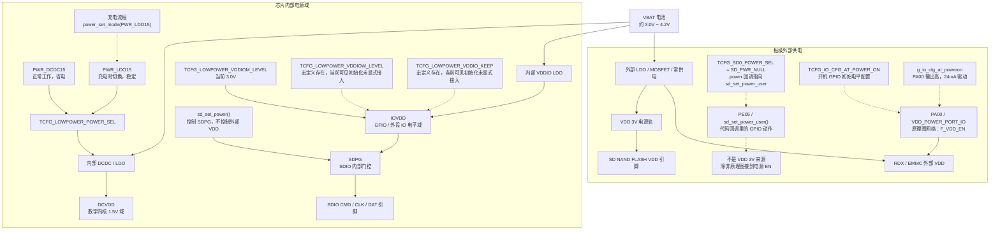
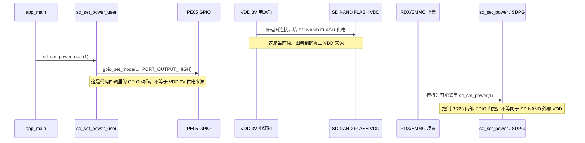

# BR28 电源域与配置宏说明

## 目录

1. [为什么不是只有一个 3.3V？](#为什么不是只有一个-33v)
2. [原理图网络名与代码概念对照](#原理图网络名与代码概念对照)
3. [BR28 电源树](#br28-电源树)
4. [逐个宏/代码片段详解](#逐个宏代码片段详解)
5. [配置速查表](#配置速查表)
6. [常见误区](#常见误区)

---

## 为什么不是只有一个 3.3V？

在 BR28（AC701N）平台上，你熟悉的“VDD 3.3V”其实被拆成了几路不同的电源域。它们可能都来自同一块电池或 LDO，但在芯片内部和板级布线中被分别管理，以兼顾功耗、性能和外设兼容性。

简单来说：

- **DCVDD** 是芯片内核自己的“主粮”。
- **IOVDD** 是 GPIO 和外设接口的“电平标准”。
- **VCC / 外部 VDD** 是板上外部芯片的供电，不一定由同一个 GPIO 控制。

下面先给你一个对照表，再逐个解释代码里的宏。

---

## 原理图网络名与代码概念对照

| 原理图网络名 | 代码/芯片概念 | 产生方式 | 说明 |
|---|---|---|---|
| `DCVDD` | SoC 内部 DCVDD / `PWR_LDO15` / `PWR_DCDC15` | 内部 DCDC 或 LDO | 数字内核主电源，通常对应 1.5V 域；正常 DCDC 省电，充电切 LDO |
| `IOVDD` | VDDIO / VDDIOM / VDDIOW | 内部 LDO | 工作/低功耗模式下的 IO 供电电压 |
| `VDD 3V` | 当前 SD NAND FLASH 的 VDD 供电网络 | 板级 3V 电源轨 | 原理图显示 SD NAND FLASH 接到 `VDD 3V`；真正供电来自这条电源轨，不是 GPIO 本身 |
| `VCC` / 外部 VDD | 外部器件供电 | 外部 LDO/MOSFET，GPIO 控制或常供电 | 板级外设供电；必须以原理图网络为准，不能只凭代码里的 GPIO 名字判断 |
| `F_VDD_EN` | 外部 VDD 使能信号 / `VDD_POWER_PORT_IO` | GPIO 输出控制 | 原理图上的 EN 网络，表示 enable；它是控制脚，不是外设 VDD 电源脚 |

### 一句话总结

- **DCVDD**：芯片自己吃的“主粮”。
- **IOVDD**：GPIO 和外设的“接口电平”。
- **VCC / 外部 VDD**：板上外部芯片的“开关电源”或常供电。

---

## BR28 电源树

把 BR28 平台上的关键电源域串起来看，可以分成三类：芯片内部 DCVDD、芯片内部 IOVDD/SDPG、板级外部 VDD/VCC。

### DCVDD 这一路：DCDC vs LDO

- **PWR_DCDC15**：正常工作时使用。DCDC 效率高，适合电池供电场景，能降低整机功耗。
- **PWR_LDO15**：充电时切换。LDO 纹波小、瞬态响应好，充电时电源波动大，切 LDO 更稳定。
- 代码中的切换点：
  - `SDK/apps/earphone/battery/charge.c:52` 充电开始时 `power_set_mode(PWR_LDO15)`。
  - `SDK/cpu/br28/charge/charge_config.c:94` 充电在线时也切到 LDO。
- 与原理图关系：对应 `DCVDD` 网络。

### IOVDD 这一路：内部 LDO / SDIO 门控

- 由芯片内部 LDO 从 VBAT 降压产生。
- 工作电压由 `TCFG_LOWPOWER_VDDIOM_LEVEL` 配置（当前 3.0V）。
- `TCFG_LOWPOWER_VDDIOW_LEVEL` 和 `TCFG_LOWPOWER_VDDIO_KEEP` 在 `sdk_config.h` 中有定义，但当前可见的 `power_param` 初始化只接入了 `TCFG_LOWPOWER_VDDIOM_LEVEL`。
- SDIO 还有一层内部电源门控 `SDPG`。`sd_set_power()` 控制的是这层门控，影响 SDIO 引脚的 IOVDD 输出，不是 SD NAND 芯片的外部 VDD。
- 与原理图关系：对应 `IOVDD` 网络。

### 外部 VDD/VCC 这一路：板级外设供电

- 给 SD NAND、EMMC、OLED 等**板级外设供电**。
- 当前原理图显示 SD NAND FLASH 的 VDD 引脚接到 `VDD 3V`，所以 SD NAND 的真正外部供电来自这条板级 3V 电源轨。
- 代码里存在 `sd_set_power_user()` -> `IO_PORTE_05` 输出高电平，并在启动流程中主动调用；但在原理图没有证明 PE05 接到 `VDD 3V` 的 EN/开关脚之前，不能把 PE05 写成 SD NAND 的供电来源。
- `VDD_POWER_PORT_IO = IO_PORTA_00` 是 RDX/EMMC 相关代码里的外部 VDD 控制脚；原理图网络名为 `F_VDD_EN`，其中 `EN` 表示 enable，不应直接等同为当前 SD NAND 的主供电脚。
- `TCFG_IO_CFG_AT_POWER_ON` 只负责开机早期按 `g_io_cfg_at_poweron` 初始化 GPIO 电平；当前效果是把 PA00 配成输出高、24mA 驱动。它不是电源源头，真正供电仍应由外部 LDO/MOSFET/电源轨完成。
- 与原理图关系：通常对应外部芯片的 `VCC` / `VDD` 网络，必须结合具体网络名和 GPIO 连接判断。

### 当前 SD NAND 供电与 SDIO 门控

当前 SD NAND 的 `VDD 3V` 外部供电、代码里的 PE05 回调、SDIO 内部 SDPG 是三件不同的事：

### 其他常见 LDO

片上/板上还可能有以下 LDO，但它们通常不由 `TCFG_*` 宏直接配置：

- **MIC 偏置 LDO**：给麦克风提供偏置电压，原理图上常标 `MICBIAS`。
- **PLL/Audio LDO**：给锁相环、音频模块提供低噪声电源，常标 `AVDD`。
- **Flash LDO / SD NAND 外部 VDD**：给外置存储供电；当前原理图显示 SD NAND FLASH 的 VDD 接 `VDD 3V`，所以优先看 `VDD 3V` 这条电源轨及其上游电源电路。

---

## 逐个宏/代码片段详解

### 0. `TCFG_LOWPOWER_POWER_SEL` —— DCVDD 供电模式

- **控制对象**：芯片内部 **DCVDD** 数字内核电源的供电方式。
- **当前配置**：`PWR_DCDC15`，定义于 `SDK/apps/earphone/board/br28/sdk_config.h:16`。
- **可选值**：
  - `PWR_LDO15`：LDO 模式，纹波小、稳定，但效率低。
  - `PWR_DCDC15`：DCDC 模式，效率高，适合电池供电。
- **与原理图关系**：决定 `DCVDD` 网络是由内部 LDO 还是 DCDC 产生。
- **实际影响**：
  - 正常工作时用 `PWR_DCDC15` 省电。
  - 充电时代码会主动切到 `PWR_LDO15`，因为充电时电源波动大，LDO 更稳定。

### 1. `TCFG_LOWPOWER_VDDIOM_LEVEL` —— 强 VDDIO 工作电压

- **控制对象**：芯片内部 **强 VDDIO（VDDIOM）** 域，也就是正常工作模式下 GPIO/外设 IO 的供电电压。
- **当前配置**：`VDDIOM_VOL_30V`（3.0V），定义于 `SDK/apps/earphone/board/br28/sdk_config.h:18`。
- **可选值**：`VDDIOM_VOL_20V` ~ `VDDIOM_VOL_34V`（2.0V ~ 3.4V），定义于 `SDK/interface/driver/cpu/br28/asm/power/p33/p33_api.h:66-74`。
- **与原理图关系**：对应原理图上的 `IOVDD` 网络，决定 GPIO 高电平是多少伏。
- **实际影响**：
  - 影响 GPIO 输出高电平幅度。
  - 影响 DAC 输出电平（`SDK/audio/cpu/br28/audio_setup.c` 有相关注释）。
  - 如果外设要求 3.3V IO，而这里配成 2.8V，可能导致通信异常。

### 2. `TCFG_LOWPOWER_VDDIOW_LEVEL` —— 弱 VDDIO 低功耗保持电压

- **控制对象**：芯片进入低功耗/睡眠模式后，**弱 VDDIO（VDDIOW）** 域的保持电压。
- **当前宏定义**：`VDDIOW_VOL_28V`（2.8V），定义于 `SDK/apps/earphone/board/br28/sdk_config.h:19`。
- **可选值**：`VDDIOW_VOL_20V` ~ `VDDIOW_VOL_34V`。
- **当前接入状态**：当前可见的 `SDK/cpu/br28/power/power_config.c` 只把 `TCFG_LOWPOWER_VDDIOM_LEVEL` 写入 `power_param`；`TCFG_LOWPOWER_VDDIOW_LEVEL` 没有在该初始化结构体中显式接入。`power_api.h` 也说明 `vddiow_lev` 默认不需要配置。
- **与原理图关系**：仍然是 `IOVDD` 网络，但是否按该宏生效，需要结合 SDK 生成逻辑、闭源电源库或实测确认。
- **实际影响**：
  - 越低待机电流越小。
  - 如果太低，按键唤醒、GPIO 状态保持可能会不稳定。
  - 在当前项目里，不能只看到宏定义就判断它一定已经改变了低功耗 VDDIO 电压。

### 3. `TCFG_LOWPOWER_VDDIO_KEEP` —— 关机时是否保持 VDDIO

- **控制对象**：Soft-OFF（软关机）模式下是否继续给 VDDIO 供电。
- **当前宏定义**：`0`，定义于 `SDK/apps/earphone/board/br28/sdk_config.h:20`。
- **取值含义**：从命名看，`1` 表示保持，`0` 表示不保持；但 `power_api.h` 中结构体字段是 `nkeep_vddio`，语义是“softoff 模式下不保持 vddio”，所以实际接入时要确认工具生成或初始化代码如何映射。
- **当前接入状态**：当前可见的 `power_param` 初始化没有显式填写 `nkeep_vddio`。
- **与原理图关系**：影响 soft-off 后 `IOVDD` 网络是否保持，但当前项目不能只凭该宏定义判断关机后一定掉电。
- **实际影响**：
  - 如果外设需要在关机后维持状态（如 LED、某些按键扫描），可能需要置 `1`。
  - 保持会增加关机漏电流，TWS 耳机通常选择不保持。

### 4. `VDD_POWER_PORT_IO` —— RDX/EMMC 外部电源控制 GPIO

- **控制对象**：RDX/EMMC 相关流程里的板级外部电源使能，不是芯片内部电源域。
- **当前配置**：`IO_PORTA_00`（PA00），定义于 `SDK/apps/common/third_party_profile/rdx_protocol/rdx_app.h:42`。
- **原理图网络名**：`F_VDD_EN`。这个名字说明它是外部 VDD 的 enable/使能信号，通常应接外部 LDO、MOSFET 或负载开关的 EN/栅极，而不是外设 VDD 电源输入脚。
- **开机初始状态**：受 `TCFG_IO_CFG_AT_POWER_ON` 生成的 `g_io_cfg_at_poweron` 影响，当前开机早期会把 PA00 配成 `PORT_OUTPUT_HIGH`，驱动强度 `PORT_DRIVE_STRENGT_24p0mA`。
- **与当前 SD NAND 的关系**：当前原理图显示 SD NAND FLASH 的 VDD 接 `VDD 3V`。因此 `VDD_POWER_PORT_IO` / `F_VDD_EN` 不应直接写成 SD NAND 的供电来源，除非继续追到 `VDD 3V` 上游确实由该 EN 控制。
- **与原理图关系**：通常对应 RDX/EMMC 相关外设的 `VCC` / `VDD` 使能网络，通过 GPIO 控制外部 LDO/MOSFET 给外设上电/断电。
- **代码中的典型用法**：
  - 正常关机时设为高阻态（`SDK/apps/common/third_party_profile/rdx_protocol/rdx_app.c:1114`）。
  - EMMC 复位时先拉低再拉高（`SDK/apps/common/third_party_profile/rdx_protocol/rdx_app.c:2514-2516`）。
  - EMMC 上电时拉高，断电时拉低或高阻态。
- **实际影响**：影响 RDX/EMMC 或其他 `F_VDD_EN` 所控制电源路径的上电时序。若调当前 SD NAND 供电，应优先看原理图上的 `VDD 3V` 及其上游电源电路。

### 5. `TCFG_IO_CFG_AT_POWER_ON` —— 开机 GPIO 初始电平配置

- **控制对象**：开机早期是否执行工具生成的 GPIO 初始化表 `g_io_cfg_at_poweron`。
- **当前配置**：`1`，定义于 `SDK/apps/earphone/board/br28/sdk_config.h:130`。
- **当前表项**：`SDK/apps/earphone/board/br28/sdk_config.c:63-70` 中，`g_io_cfg_at_poweron` 当前只配置一项：
  - `.gpio = IO_PORTA_00`
  - `.mode = PORT_OUTPUT_HIGH`
  - `.hd = PORT_DRIVE_STRENGT_24p0mA`
- **执行时机**：`SDK/cpu/br28/power/power_config.c:40` 的 `board_power_init()` 调用 `gpio_config_init()`；随后 `SDK/apps/earphone/board/sdk_board_config.c:194-196` 按表调用 `gpio_config_set(...)`。
- **实际含义**：开机早期把 PA00 设置成输出高电平，驱动强度 24mA。
- **不要误解**：
  - `PORT_DRIVE_STRENGT_24p0mA` 是 GPIO 输出驱动强度，不是外设供电能力。
  - 这个宏不产生新的电源轨，不改变 DCVDD/IOVDD 电压。
  - 原理图网络名 `F_VDD_EN` 中的 `EN` 表示 enable。PA00 只是拉高这个使能信号；真正给片外外设供电的是外部电源电路。

### 6. `sd_set_power_user()` / PE05 —— SD 电源回调里的 GPIO 动作

- **控制对象**：SD 平台数据 `.power` 回调里的用户 GPIO 操作。当前代码会把 PE05 拉高，但原理图显示 SD NAND FLASH 的 VDD 接 `VDD 3V`，所以不能直接认定 PE05 是 SD NAND 的外部 VDD 控制脚。
- **当前代码**：
  - `SDK/apps/earphone/device_config.c:57`：`TCFG_SD0_POWER_SEL = SD_PWR_NULL` 时，SD 平台数据的 `.power` 回调指向 `sd_set_power_user`。
  - `SDK/apps/earphone/app_main.c:372-383`：`sd_set_power_user(1)` 将 PE05 输出高电平；默认不处理 `en=0` 的断电请求。
  - `SDK/apps/earphone/app_main.c:404`：启动流程中主动调用 `sd_set_power_user(1)`。
- **与前几个宏的区别**：
  - `TCFG_LOWPOWER_*` 控制的是芯片内部电源域（DCVDD、IOVDD）。
  - `VDD_POWER_PORT_IO` / `F_VDD_EN` 是另一条外部 VDD 使能控制线。
  - `sd_set_power()` 是闭源库里的 SDPG 控制，管的是 BR28 内部 SDIO 电源门控，不等同于 PE05 外部 VDD。
- **与原理图关系**：只有当 PE05 连接到 `VDD 3V` 上游 LDO/MOSFET/负载开关的 EN/栅极时，它才是 SD NAND 供电控制的一部分。当前已知信息是 SD NAND VDD 接 `VDD 3V`，因此供电判断应以 `VDD 3V` 为准。
- **实际影响**：这是代码层面的 SD `.power` 回调动作，可能是历史遗留、板型兼容或控制其他电路；它不自动等于 SD NAND 真实供电路径。

---

## 配置速查表

| 你想调什么 | 看哪个宏/代码 | 注意点 |
|---|---|---|
| DCVDD 供电模式 | `TCFG_LOWPOWER_POWER_SEL` | 正常用 DCDC 省电，充电自动切 LDO |
| GPIO 高电平电压 | `TCFG_LOWPOWER_VDDIOM_LEVEL` | 影响外设 IO 兼容性 |
| 低功耗 VDDIO 电压 | `TCFG_LOWPOWER_VDDIOW_LEVEL` | 当前可见初始化未显式接入，需结合 SDK 生成/闭源库/实测确认 |
| 关机后是否还能保留 GPIO 状态 | `TCFG_LOWPOWER_VDDIO_KEEP` / `nkeep_vddio` | 当前可见初始化未显式接入；保持会增加漏电流 |
| 当前 SD NAND FLASH 由谁供电 | 原理图 `VDD 3V` | 当前已知硬件显示 SD NAND VDD 接 `VDD 3V`，供电判断以这条电源轨为准 |
| SD `.power` 回调里的 GPIO 动作 | `sd_set_power_user()` / `IO_PORTE_05` | 代码会拉高 PE05；除非原理图证明 PE05 控制 `VDD 3V` 上游 EN，否则不能当作 SD NAND 供电来源 |
| SDIO 内部 IOVDD 门控 | `sd_set_power()` / `SD_PWR_SDPG` | 控制 BR28 内部 SDPG，不等同于外部芯片 VDD |
| RDX/EMMC 外部 VDD 是否上电 | `VDD_POWER_PORT_IO` / `IO_PORTA_00` / `F_VDD_EN` | `F_VDD_EN` 是使能信号，别和外设 VDD 电源脚混淆 |
| 开机早期固定某个 GPIO 电平 | `TCFG_IO_CFG_AT_POWER_ON` / `g_io_cfg_at_poweron` | 当前把 PA00 配成输出高、24mA 驱动；这是 GPIO 初始化，不是电源输出 |
| 某个具体外设使能 | `gpio_set_mode(...)` | 看原理图该 GPIO 接到哪，不能只看函数名判断电源域 |

---

## 常见误区

1. **“VDD 3.3V”其实可能指 DCVDD、IOVDD 或外部 VCC/VDD 中的任意一路。** 看原理图时要先看网络标号，不要默认都是同一条 3.3V。
2. **`VDDIOM` 和 `VDDIOW` 不是两路板级独立电源。** 它们属于 VDDIO 的不同工作/低功耗配置概念；当前项目里 `VDDIOW` 宏是否实际接入还要结合初始化代码和 SDK 行为确认。
3. **`sd_set_power()` 不是给 SD NAND 外部 VDD 上电。** 它控制的是 BR28 内部 SDIO 电源门控 SDPG，影响 SDIO 引脚 IOVDD。
4. **当前 SD NAND FLASH 的 VDD 来源看原理图。** 既然 SD NAND VDD 接到 `VDD 3V`，就应把 `VDD 3V` 视为真实供电来源，而不是把 PE05、PA00 或 SDPG 当成 VDD。
5. **`F_VDD_EN` 里的 EN 是 enable。** 它说明 PA00 是外部 VDD 的使能控制信号，不是 VDD 电源本身；是否影响 SD NAND，要看它是否控制 `VDD 3V` 的上游电源。
6. **`TCFG_IO_CFG_AT_POWER_ON` 不是片外电源。** 它只是在开机早期初始化 GPIO 电平；当前是把 PA00 拉高并设置 24mA 驱动。若 PA00 控制外部电源，也只是控制 EN/开关脚。
7. **`gpio_set_mode(...)` 是动作，不是配置宏。** 它只影响某个 GPIO 的运行时状态，不会修改 DCVDD/IOVDD 这类内部电源域电压。
8. **LDO 和 DCDC 没有绝对好坏。** LDO 稳定但效率低，DCDC 效率高但纹波大。BR28 正常用 DCDC 省电，充电时切 LDO 求稳。
