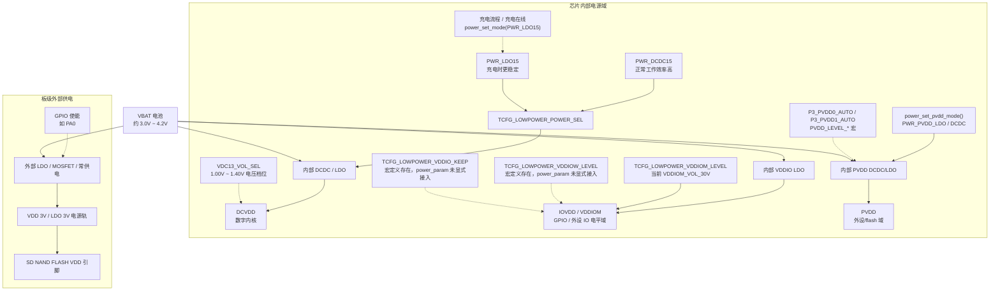

# BR28 电源域与配置宏说明（代码重构版）

## 目录

1. [为什么不是只有一个 3.3V？](#为什么不是只有一个-33v)
2. [原理图网络名与代码概念对照](#原理图网络名与代码概念对照)
3. [BR28 电源树](#br28-电源树)
4. [逐个宏/代码片段详解](#逐个宏代码片段详解)
5. [配置速查表](#配置速查表)
6. [常见误区](#常见误区)
7. [本项目实际配置汇总](#本项目实际配置汇总)

---

## 为什么不是只有一个 3.3V？

在 BR28（AC701N）平台上，你熟悉的“VDD 3.3V”其实被拆成了几路不同的电源域。它们可能都来自同一块电池或 LDO，但在芯片内部和板级布线中被分别管理，以兼顾功耗、性能和外设兼容性。

简单来说：

- **DCVDD** 是芯片内核自己的“主粮”，由内部 DCDC/LDO 产生，默认模式为 DCDC15。
- **IOVDD / VDDIOM** 是 GPIO 和外设接口的“电平标准”。
- **PVDD** 是芯片内部给部分外设/flash 用的独立电源域，和 DCVDD 不是一回事。
- **VCC / 外部 VDD** 是板上外部芯片的供电，不一定由芯片内部 PMU 直接产生。

下面先给你一个对照表，再逐个解释代码里的宏。

---

## 原理图网络名与代码概念对照

| 原理图网络名 | 代码/芯片概念 | 产生方式 | 说明 |
|---|---|---|---|
| `DCVDD` | SoC 内部 DCVDD / `PWR_LDO15` / `PWR_DCDC15` | 内部 DCDC 或 LDO | 数字内核主电源，由 `TCFG_LOWPOWER_POWER_SEL` 选择供电模式；另有 `VDC13_VOL_SEL` 用于调节电压档位 |
| `IOVDD` | VDDIO / VDDIOM / VDDIOW | 内部 LDO | 工作/低功耗模式下的 IO 供电电压 |
| `PVDD` | `PWR_PVDD_LDO` / `PWR_PVDD_DCDC` | 内部 DCDC/LDO | 芯片内部外设/flash 电源域，独立于 DCVDD |
| `VDD 3V` / `LDO 3V` | 板级 3V 电源轨 | 板级 LDO/MOSFET，GPIO 控制或常供电 | 外部芯片（如 SD NAND FLASH）的 VDD 供电网络，不是 GPIO 本身；常由某个 GPIO（如 PA0）控制 EN |
| `VCC` / 外部 VDD | 外部器件供电 | 外部 LDO/MOSFET，GPIO 控制或常供电 | 板级外设供电；必须以原理图网络为准 |

### 一句话总结

- **DCVDD**：芯片内核电源，模式用 `TCFG_LOWPOWER_POWER_SEL` 选，电压档位由 `VDC13_VOL_SEL` 调节。
- **IOVDD**：GPIO 和外设的接口电平，强 VDDIO 用 `TCFG_LOWPOWER_VDDIOM_LEVEL` 配置。
- **VDD 3V / LDO 3V**：板上外部芯片（如 SD NAND）的供电，通常由片外 LDO 产生，并由某个 GPIO（如 PA0）控制使能。
- **PVDD**：芯片内部外设/flash 电源域，独立管理。
- **VCC / 外部 VDD**：板上外部芯片的供电，必须以原理图网络为准；常见由片外 LDO 产生，并由 GPIO 控制 EN。

---

## BR28 电源树

把 BR28 平台上的关键电源域串起来看，可以分成四类：芯片内部 DCVDD、芯片内部 IOVDD、芯片内部 PVDD、板级外部 VDD/VCC。

### DCVDD 这一路：DCDC vs LDO

- **PWR_DCDC15**：正常工作时使用。DCDC 效率高，适合电池供电场景，能降低整机功耗。
- **PWR_LDO15**：充电时切换。LDO 纹波小、瞬态响应好，充电时电源波动大，切 LDO 更稳定。
- **代码中的切换点**：
  - 初始化：`SDK/cpu/br28/charge/charge_config.c:93-97`，若充电在线则 `power_set_mode(PWR_LDO15)`，否则 `power_set_mode(TCFG_LOWPOWER_POWER_SEL)`。
  - LDO5V 插入：`SDK/apps/earphone/battery/charge.c:177`，`charge_ldo5v_in_deal()` 中切到 LDO。
  - LDO5V 拔出：`SDK/apps/earphone/battery/charge.c:234`，`charge_ldo5v_off_deal()` 中切回 `TCFG_LOWPOWER_POWER_SEL`。
  - LDO5V keep：`SDK/apps/earphone/battery/charge.c:140`，`ldo5v_keep_deal()` 中切回 `TCFG_LOWPOWER_POWER_SEL`。
  - 智能仓开盖切蓝牙：`SDK/apps/earphone/battery/charge_store.c:560`，切回 `TCFG_LOWPOWER_POWER_SEL`。
- 与原理图关系：对应 `DCVDD` 网络。

### DCVDD 电压档位：VDC13_VOL_SEL

- `SDK/interface/driver/cpu/br28/asm/clock_hal.h:136` 定义 `dcvdd_vol_sel` 为 `VDC13_VOL_SEL` 的别名。
- `SDK/interface/driver/cpu/br28/asm/power/p33/p33_api.h:46-61` 定义了 `VDC13_VOL_SEL_100V` ~ `VDC13_VOL_SEL_140V`，即 1.00V ~ 1.40V，步进 25mV。
- 注意：`PWR_DCDC15` / `PWR_LDO15` 是**供电模式选择**，`VDC13_VOL_SEL` 是**电压档位选择**，两者是不同维度。当前代码未主动调用 `clk_set_vdc_lowest_voltage()` 或 `VDC13_VOL_SEL()`，实际电压走芯片默认值。

### IOVDD 这一路：内部 LDO / SDIO 门控

- 由芯片内部 LDO 从 VBAT 降压产生。
- 工作电压由 `TCFG_LOWPOWER_VDDIOM_LEVEL` 配置。**本项目当前配置为 `VDDIOM_VOL_30V`（3.0V）。**
- `TCFG_LOWPOWER_VDDIOW_LEVEL` 和 `TCFG_LOWPOWER_VDDIO_KEEP` 在 `sdk_config.h` 中有定义，但当前 `power_param` 初始化只接入了 `TCFG_LOWPOWER_VDDIOM_LEVEL`，未显式写入 `vddiow_lev` 和 `nkeep_vddio`。
- `power_api.h` 注释说明：`vddiow_lev` 默认不需要配置，sleep/softoff 模式会保持电压，除非配置 `nkeep_vddio`。
- 与原理图关系：对应 `IOVDD` 网络。

#### 强 VDDIO（VDDIOM）与 弱 VDDIO（VDDIOW）的区别

- **强 VDDIO（VDDIOM）**：正常工作模式下 GPIO / 外设 IO 的供电电压。由 `TCFG_LOWPOWER_VDDIOM_LEVEL` 配置，当前为 3.0V。它决定 GPIO 输出高电平幅度、外设 IO 兼容性、DAC 输出电平等。
- **弱 VDDIO（VDDIOW）**：芯片进入 sleep / softoff 等低功耗模式后，`IOVDD` 网络的保持电压。由 `TCFG_LOWPOWER_VDDIOW_LEVEL` 配置，当前为 2.8V。设置越低待机电流越小，但可能影响 GPIO 状态保持和唤醒稳定性。
- **关键点**：它们不是两路独立电源，而是同一 `IOVDD` 网络在不同功耗模式下的电压配置。`VDDIOM` 是工作态，`VDDIOW` 是低功耗保持态。

### PVDD 这一路：独立外设电源域

- PVDD 是芯片内部给部分外设/flash 供电的独立域，和 DCVDD 不是同一路。
- 模式选择：`power_api.h:69-72` 定义 `PWR_PVDD_LDO` 和 `PWR_PVDD_DCDC`；`power_api.h:166` 声明 `power_set_pvdd_mode(enum PVDD_MODE mode)`。
- 电压/自动调节：`p33_api.h:88-145` 提供 `PVDD_LEVEL_LOW()`、`PVDD_LEVEL_HIGH()`、`PVDD_LEVEL_AUTO()`、`PVDD_LEVEL_NOW()` 等宏，操作 `P3_PVDD0_AUTO` / `P3_PVDD1_AUTO` 寄存器。
- 与低功耗联动：`lp_ipc.h` 有 `M2P_PVDD_LEVEL_SLEEP_TRIM`、`M2P_RVD2PVDD_EN`、`M2P_PVDD_EXTERN_DCDC` 等 IPC 消息，说明 PVDD 在 sleep 模式下有独立的 trim 和外部 DCDC 控制逻辑。
- 与原理图关系：PVDD 是芯片内部域，不直接对应板级网络；若外设需要稳定供电，仍需看 `VDD 3V` 等外部电源轨。

### 外部 VDD/VCC 这一路：板级外设供电

- 给 SD NAND、EMMC、OLED 等**板级外设供电**。
- 当前项目中 `TCFG_SD0_ENABLE = 1`，SD0 模块已启用，但 `TCFG_SD0_POWER_SEL = SD_PWR_NULL`，所以 `sd_set_power()` / SDIO 内部电源门控路径**并不生效**，外部供电由 `sd_set_power_user()` 控制。
- 如果原理图显示 SD NAND FLASH 的 VDD 接到 `VDD 3V`（或 `LDO 3V`），则其真正外部供电来自**板级 LDO 3V 电源轨**，与芯片内部 SDIO 门控无关。
- **使能控制**：该 LDO 通常由某个 GPIO（如 `PA0`，具体以原理图为准）控制 EN 脚。代码中对应的回调是 `sd_set_power_user()`，示例里操作的是 `PE05`，但实际引脚必须按原理图配置。
- **两种常见供电模式对比**：
  - `SD_PWR_SDPG`：使用芯片内部 SDIO 电源门控 `sd_set_power()`，控制的是 SDIO 引脚上的 IOVDD，**不能替代外部 LDO**。
  - `SD_PWR_NULL` + `sd_set_power_user`：由用户代码控制外部 LDO 的 EN 脚（如 PA0），给 SD NAND 的 VDD 引脚供电。这是本项目当前更贴近实际的供电方式。
- **低功耗注意事项**：进入 sleep / softoff 后，如果控制 LDO EN 的 GPIO 掉电或被拉低，SD NAND 会掉电，唤醒后需要重新初始化；如果希望保持数据，需要确保该 GPIO 状态或 LDO 常开。
- 与原理图关系：通常对应外部芯片的 `VCC` / `VDD` 网络，必须结合具体网络名和 GPIO 连接判断。

---

## 逐个宏/代码片段详解

### 0. `TCFG_LOWPOWER_POWER_SEL` —— DCVDD 供电模式

- **控制对象**：芯片内部 **DCVDD** 数字内核电源的供电方式。
- **当前配置**：`PWR_DCDC15`，定义于 `SDK/apps/earphone/board/br28/sdk_config.h:16`。
- **可选值**：
  - `PWR_LDO15`：LDO 模式，纹波小、稳定，但效率低。
  - `PWR_DCDC15`：DCDC 模式，效率高，适合电池供电。
- **与原理图关系**：决定 `DCVDD` 网络是由内部 LDO 还是 DCDC 产生。
- **实际影响**：
  - 正常工作时用 `PWR_DCDC15` 省电。
  - 充电时/充电在线时代码会主动切到 `PWR_LDO15`，因为充电时电源波动大，LDO 更稳定。

### 1. `TCFG_LOWPOWER_VDDIOM_LEVEL` —— 强 VDDIO 工作电压

- **控制对象**：芯片内部 **强 VDDIO（VDDIOM）** 域，也就是正常工作模式下 GPIO/外设 IO 的供电电压。
- **当前配置**：`VDDIOM_VOL_30V`（3.0V），定义于 `SDK/apps/earphone/board/br28/sdk_config.h:18`。
- **可选值**：`VDDIOM_VOL_20V` ~ `VDDIOM_VOL_34V`（2.0V ~ 3.4V），定义于 `SDK/interface/driver/cpu/br28/asm/power/p33/p33_api.h:66-74`。
- **与原理图关系**：对应原理图上的 `IOVDD` 网络，决定 GPIO 高电平是多少伏。
- **实际影响**：
  - 影响 GPIO 输出高电平幅度。
  - 影响 DAC 输出电平（`SDK/audio/cpu/br28/audio_setup.c:183` 有相关注释）。
  - 如果外设要求 3.3V IO，而这里配成 3.0V，可能导致通信异常。

### 2. `TCFG_LOWPOWER_VDDIOW_LEVEL` —— 弱 VDDIO 低功耗保持电压

- **控制对象**：芯片进入低功耗/睡眠模式后，**弱 VDDIO（VDDIOW）** 域的保持电压。
- **当前宏定义**：`VDDIOW_VOL_28V`（2.8V），定义于 `SDK/apps/earphone/board/br28/sdk_config.h:19`。
- **可选值**：`VDDIOW_VOL_20V` ~ `VDDIOW_VOL_34V`。
- **当前接入状态**：当前 `SDK/cpu/br28/power/power_config.c:13-32` 的 `power_param` 初始化只接入了 `TCFG_LOWPOWER_VDDIOM_LEVEL`，未显式写入 `vddiow_lev`。`power_api.h:17` 说明 `vddiow_lev` 默认不需要配置。
- **与原理图关系**：仍然是 `IOVDD` 网络，但是否按该宏生效，需要结合 SDK 生成逻辑、闭源电源库或实测确认。
- **实际影响**：
  - 越低待机电流越小。
  - 如果太低，按键唤醒、GPIO 状态保持可能会不稳定。
  - 在当前项目里，不能只看到宏定义就判断它一定已经改变了低功耗 VDDIO 电压。

### 3. `TCFG_LOWPOWER_VDDIO_KEEP` —— 关机时是否保持 VDDIO

- **控制对象**：Soft-OFF（软关机）模式下是否继续给 VDDIO 供电。
- **当前宏定义**：`0`，定义于 `SDK/apps/earphone/board/br28/sdk_config.h:20`。
- **取值含义**：从宏命名看，`1` 表示保持，`0` 表示不保持；但 `power_api.h:20` 中结构体字段是 `nkeep_vddio`，语义是“softoff 模式下不保持 vddio”。
- **当前接入状态**：当前 `power_param` 初始化没有显式填写 `nkeep_vddio`，按 C 语言规则默认初始化为 `0`，即“保持 VDDIO”。
- **与原理图关系**：影响 soft-off 后 `IOVDD` 网络是否保持。
- **实际影响**：
  - 如果外设需要在关机后维持状态（如 LED、某些按键扫描），可能需要置 `1`。
  - 保持会增加关机漏电流；当前 `TCFG_LOWPOWER_VDDIO_KEEP` 未接入 `power_param.nkeep_vddio`，由于 `nkeep_vddio` 默认为 `0`，实际行为仍是保持，需要留意漏电流预期。

### 4. `TCFG_IO_CFG_AT_POWER_ON` —— 开机 GPIO 初始电平配置

- **控制对象**：开机早期是否执行工具生成的 GPIO 初始化表 `g_io_cfg_at_poweron`。
- **当前配置**：`0`，定义于 `SDK/apps/earphone/board/br28/sdk_config.h:131`。
- **当前表项**：`SDK/apps/earphone/board/br28/sdk_config.c:63-67` 中，`g_io_cfg_at_poweron` 为空数组（因为 `TCFG_IO_CFG_AT_POWER_ON = 0`，工具未生成具体表项）。
- **执行时机**：`SDK/cpu/br28/power/power_config.c:39` 的 `board_power_init()` 调用 `gpio_config_init()`；随后 `SDK/apps/earphone/board/sdk_board_config.c:213-216` 按表调用 `gpio_config_set(...)`，但当前数组为空，不会实际配置任何 GPIO。
- **实际含义**：当前项目中该功能未启用，开机早期没有通过此机制拉高任何 GPIO。
- **不要误解**：
  - `PORT_DRIVE_STRENGT_24p0mA` 是 GPIO 输出驱动强度，不是外设供电能力。
  - 这个宏不产生新的电源轨，不改变 DCVDD/IOVDD 电压。
  - GPIO 控制外部电源时，它只是控制 EN/开关脚；真正供电仍由外部电源电路完成。

### 5. `sd_set_power()` / `SD_PWR_SDPG` / `sd_set_power_user()` —— SDIO 电源控制

- **`SD_PWR_SDPG` 控制对象**：BR28 内部 SDIO 电源门控 `SDPG`，影响 SDIO 引脚的 IOVDD 输出，**不是**外部 SD NAND 芯片的 VDD。
- **`sd_set_power_user()` 控制对象**：用户自定义的外部 LDO 使能脚（如 PA0 / PE05），用来给 SD NAND 的 VDD 引脚供电，**不是**芯片内部 SDIO 门控。
- **当前配置**：`TCFG_SD0_ENABLE = 1`，`TCFG_SD0_POWER_SEL = SD_PWR_NULL`，定义于 `SDK/apps/earphone/board/br28/sdk_config.h:83-90`。由于电源选择为 `SD_PWR_NULL`，`sd_set_power()` / `SDPG` 路径在本项目中并不生效，真正给 SD NAND 上电的是 `sd_set_power_user()`。
- **可选电源模式**：`SDK/interface/driver/cpu/br28/asm/sdmmc.h:44` 声明 `void sd_set_power(u8 enable)`；`SDK/interface/driver/device/sdmmc/sdmmc.h` 定义 `SD_PWR_SDPG = 0`、`SD_PWR_NULL = 1`。
- **与原理图关系**：
  - 若 `TCFG_SD0_POWER_SEL = SD_PWR_SDPG`，`sd_set_power()` 只控制芯片内部 SDIO 门控；外部 SD NAND 的 VDD 仍由板级 `VDD 3V` / `LDO 3V` 电源轨提供。
  - 若 `TCFG_SD0_POWER_SEL = SD_PWR_NULL`，`.power` 回调指向 `sd_set_power_user()`，由用户代码控制外部 LDO 的 EN 脚。当前代码示例操作的是 `PE05`，但原理图显示由 `PA0` 控制 LDO 3V 使能，**实际引脚以原理图为准**。
- **实际影响**：
  - 内部 `SDPG` 与外部 LDO 是两回事：SDPG 只管 SDIO 引脚的 IOVDD，LDO EN 才管 SD NAND 芯片的 VDD。
  - 如果 SD NAND 由外部 LDO 3V 供电，必须保证 `sd_set_power_user()` 操作的 GPIO 与原理图 EN 脚一致，否则会出现初始化失败、读写错误等问题。
  - 当前项目中 `TCFG_SD0_ENABLE = 1`，`TCFG_SD0_POWER_SEL = SD_PWR_NULL`，标准 SDIO 内部电源门控路径不生效；SD NAND 上电逻辑在 `app_main.c` 的 `sd_set_power_user(1)` 中手动完成。

### 6. `power_set_pvdd_mode()` / PVDD —— 独立外设电源域

- **控制对象**：芯片内部 **PVDD** 电源域，给部分外设/flash 供电，独立于 DCVDD。
- **可选模式**：
  - `PWR_PVDD_LDO`：LDO 模式。
  - `PWR_PVDD_DCDC`：DCDC 模式。
- **电压配置**：`p33_api.h:88-145` 提供 `PVDD_LEVEL_LOW()`、`PVDD_LEVEL_HIGH()`、`PVDD_LEVEL_AUTO()`、`PVDD_LEVEL_NOW()` 等宏，可设置 0.50V ~ 1.25V 范围（步进 50mV）。
- **当前配置**：当前代码未显式调用 `power_set_pvdd_mode()` 或配置 PVDD 电压，走芯片默认行为。
- **低功耗联动**：`lp_ipc.h:39,112-113` 存在 `M2P_PVDD_LEVEL_SLEEP_TRIM`、`M2P_RVD2PVDD_EN`、`M2P_PVDD_EXTERN_DCDC` 等 IPC 消息，说明 sleep 模式下 PVDD 有独立的 trim 和外部 DCDC 支持逻辑。
- **实际影响**：若遇到低功耗唤醒异常、flash 不稳定或录音底噪，可检查 PVDD 模式/电压是否与原理图设计匹配。

---

## 配置速查表

| 你想调什么 | 看哪个宏/代码 | 注意点 |
|---|---|---|
| DCVDD 供电模式 | `TCFG_LOWPOWER_POWER_SEL` | 正常用 DCDC 省电，充电/充电在线自动切 LDO |
| DCVDD 电压档位 | `VDC13_VOL_SEL` / `clk_set_vdc_lowest_voltage()` | 当前未主动配置，走默认值；与供电模式是不同维度 |
| GPIO 高电平电压 | `TCFG_LOWPOWER_VDDIOM_LEVEL` | 当前 `VDDIOM_VOL_30V`，影响外设 IO 兼容性 |
| 低功耗 VDDIO 电压 | `TCFG_LOWPOWER_VDDIOW_LEVEL` | 当前 `VDDIOW_VOL_28V`，但 `power_param` 未显式接入，需结合 SDK/实测确认 |
| 关机后是否还能保留 GPIO 状态 | `TCFG_LOWPOWER_VDDIO_KEEP` / `nkeep_vddio` | 宏为 `0` 且未接入，`power_param.nkeep_vddio` 默认 `0`，实际保持 |
| 开机早期固定某个 GPIO 电平 | `TCFG_IO_CFG_AT_POWER_ON` / `g_io_cfg_at_poweron` | 当前为 `0`，表为空，未配置任何 GPIO |
| 当前 SD0 / SDIO 电源门控 | `TCFG_SD0_ENABLE` / `sd_set_power()` / `SD_PWR_SDPG` | 当前 `TCFG_SD0_ENABLE = 1`，但 `TCFG_SD0_POWER_SEL = SD_PWR_NULL`，内部 SDIO 门控不生效 |
| SD NAND 外部供电 / LDO 3V 使能 | `sd_set_power_user()` / 原理图 GPIO | 外部 LDO 3V 给 SD NAND VDD 供电，GPIO（如 PA0）控制 EN；与芯片内部 SDIO 门控无关 |
| 芯片内部外设/flash 电源域 | `power_set_pvdd_mode()` / `PVDD_LEVEL_*` | PVDD 独立于 DCVDD，低功耗下有独立 trim |
| 某个具体外设使能 | `gpio_set_mode(...)` / 原理图 | 看原理图该 GPIO 接到哪，不能只看函数名判断电源域 |

---

## 常见误区

1. **“VDD 3.3V”其实可能指 DCVDD、IOVDD、PVDD 或外部 VCC/VDD 中的任意一路。** 看原理图时要先看网络标号，不要默认都是同一条 3.3V。
2. **`VDDIOM` 和 `VDDIOW` 不是两路板级独立电源。** 它们属于 VDDIO 的不同工作/低功耗配置概念；当前项目里 `VDDIOW` 宏是否实际接入还要结合初始化代码和 SDK 行为确认。
3. **`sd_set_power()` 不是给 SD NAND 外部 VDD 上电。** 它控制的是 BR28 内部 SDIO 电源门控 SDPG，影响 SDIO 引脚 IOVDD；外部 SD NAND 的 VDD 由板级 LDO 3V 供电，GPIO（如 PA0）控制 EN。
4. **`sd_set_power_user()` 操作的 GPIO 必须与原理图一致。** 当前代码示例用 `PE05`，但原理图可能是 `PA0`，引脚不一致会导致 SD NAND 不上电或时序错误。
5. **当前项目中 `TCFG_IO_CFG_AT_POWER_ON = 0`，`g_io_cfg_at_poweron` 为空。** 开机早期没有通过此机制拉高任何 GPIO，不能把文档中提到的 PA00 输出高当作当前事实。
6. **LDO 和 DCDC 没有绝对好坏。** LDO 稳定但效率低，DCDC 效率高但纹波大。BR28 正常用 DCDC 省电，充电时切 LDO 求稳。
7. **`gpio_set_mode(...)` 是动作，不是配置宏。** 它只影响某个 GPIO 的运行时状态，不会修改 DCVDD/IOVDD/PVDD 这类内部电源域电压。
8. **`TCFG_LOWPOWER_VDDIO_KEEP` 未接入 `power_param.nkeep_vddio`。** 真正生效的是 `power_param.nkeep_vddio`，当前未显式填写，默认 `0`，即实际保持 VDDIO；不要只看宏定义的值判断 soft-off 后是否保持。
9. **`PWR_DCDC15` / `PWR_LDO15` 与 `VDC13_VOL_SEL` 是不同维度。** 前者选供电模式，后者选 DCVDD 电压档位，不要混为一谈。

---

## 本项目实际配置汇总

| 配置项 | 宏/代码 | 当前值 | 生效位置 |
|---|---|---|---|
| DCVDD 供电模式 | `TCFG_LOWPOWER_POWER_SEL` | `PWR_DCDC15` | `sdk_config.h:16` |
| DCVDD 电压档位 | `VDC13_VOL_SEL` | 未主动配置，走默认值 | `clock_hal.h:136` |
| 强 VDDIO 电压 | `TCFG_LOWPOWER_VDDIOM_LEVEL` | `VDDIOM_VOL_30V`（3.0V） | `sdk_config.h:18` |
| 弱 VDDIO 电压 | `TCFG_LOWPOWER_VDDIOW_LEVEL` | `VDDIOW_VOL_28V`（2.8V），未写入 `power_param` | `sdk_config.h:19` |
| 软关机保持 VDDIO | `TCFG_LOWPOWER_VDDIO_KEEP` / `nkeep_vddio` | 宏为 `0` 且未接入，`nkeep_vddio` 默认 `0`，实际保持 | `sdk_config.h:20`、`power_config.c:13-32` |
| 低功耗模式 | `TCFG_LOWPOWER_LOWPOWER_SEL` | `1` | `sdk_config.h:21` |
| 开机 GPIO 配置 | `TCFG_IO_CFG_AT_POWER_ON` | `0`，`g_io_cfg_at_poweron` 为空 | `sdk_config.h:131`、`sdk_config.c:63-67` |
| SD0 使能 | `TCFG_SD0_ENABLE` | `1`，SD0 已启用 | `sdk_config.h:83` |
| SD0 电源选择 | `TCFG_SD0_POWER_SEL` | `SD_PWR_NULL`，由 `sd_set_power_user()` 控制外部 LDO | `sdk_config.h:90` |
| PVDD 模式 | `power_set_pvdd_mode()` | 未主动配置，走默认值 | `power_api.h:166` |

---

*最后更新：基于 `SDK/apps/earphone/board/br28/sdk_config.h`、`SDK/cpu/br28/power/power_config.c`、`SDK/cpu/br28/charge/charge_config.c`、`SDK/apps/earphone/battery/charge.c`、`SDK/interface/driver/cpu/br28/asm/power/power_api.h`、`SDK/interface/driver/cpu/br28/asm/power/p33/p33_api.h`、`SDK/interface/driver/cpu/br28/asm/clock_hal.h` 等实际代码整理。*
