# PT0807-GRB 单线幻彩灯珠通信原理

> **文件定位**：全面说明 XR-PT0807-GRB 灯珠的硬件通信协议 + MCU 通过 SPI 硬件外设仿真该协议的核心原理。  
> **相关代码**：`apps/common/device/led_pt0807/led_pt0807.c/h`（驱动层）、`apps/common/third_party_profile/rdx_protocol/rdx_led_ctrl.c/h`（应用层）  
> **硬件连接**：数据引脚 `IO_PORTC_01`，通过 `SPI2` DO 脚单线驱动（`rdx_app.h:46`）

---

## 一、灯珠概述

项目使用 **XR-PT0807-GRB** 内置驱动型 RGB LED。控制 IC 与 RGB 发光芯片封装在一起，外部仅需**一根数据线（DI/DO）**即可实现全彩控制，无需额外的限流电阻或复杂驱动电路。

| 参数 | 规格 |
|------|------|
| 芯片型号 | XR-PT0807-GRB |
| 数据格式 | 24bit GRB（Green-Red-Blue），MSB 先发 |
| 灰度等级 | 256 级（每通道 8bit，取值 0~255） |
| 工作电压 | 3.5V ~ 5.5V（典型 4.5V） |
| 最大级联 | 本项目支持最多 256 颗（受 RAM 限制） |

---

## 二、核心架构：三层分离

理解整个方案的前提，是把三个独立的层面拆开看：

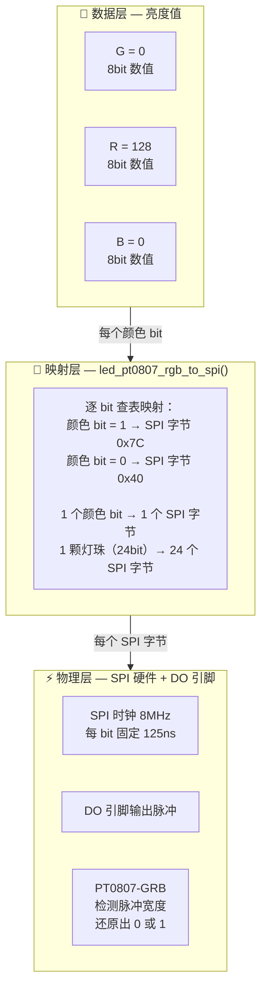

| 层 | 做什么 | 手段 | 类比 |
|----|--------|------|------|
| **数据层** | 控制灯珠亮度和颜色 | 3 个 8bit 数值（GRB），灯珠内部 PWM 按 value/255 占空比驱动 LED | 中文原文的内容 |
| **映射层** | 把颜色 bit 翻译成灯珠能识别的脉冲编码 | `led_pt0807_rgb_to_spi()` 逐 bit 查表映射 | 把中文翻译成莫尔斯电码 |
| **物理层** | 在单根线上可靠传输编码后的脉冲 | SPI 字节中**连续 1 的个数**→ 高电平持续时间，SPI DMA 硬件自动发送 | 电报机发出"嘀"和"哒" |

**SPI 字节 0x40 和 0x7C 只是"信号编码方式"，和亮度完全无关。亮度只由 24bit 颜色数据中的数值（0-255）决定。** 这是整个讨论的基础。

---

## 三、物理编码层：SPI 字节 → 脉冲 → 0/1 码

### 3.1 灯珠只能识别脉冲宽度

PT0807-GRB 的核心通信协议来源于其规格书（`led_pt0807.h:44-56`）：

| 参数 | 符号 | 最小值 | 典型值 | 最大值 | 单位 |
|------|------|--------|--------|--------|------|
| 0 码高电平时间 | T0H | 200ns | 280ns | 350ns | — |
| 1 码高电平时间 | T1H | 650ns | 900ns | 1000ns | — |
| 0 码低电平时间 | T0L | 1.55μs | 1.72μs | 30μs | — |
| 1 码低电平时间 | T1L | 1.10μs | 1.10μs | 30μs | — |
| RESET 低电平时间 | TRST | 100μs | 150μs | — | — |

判别规则：
- 高电平 **200ns ~ 410ns** → IC 判为 **`0` 码**
- 高电平 **640ns ~ 1000ns** → IC 判为 **`1` 码**

灯珠内部没有 SPI/UART 等协议解析器——它只有一个**脉冲宽度检测电路**，仅仅通过高电平持续了多久来区分 0 和 1。

### 3.2 核心原理：固定时钟 × 连续 1 的个数 = 脉冲宽度

SPI 硬件外设的时钟频率一旦设定就精确不变。8MHz 意味着：

```
每个 SPI bit 周期 = 1 / 8MHz = 125ns （固定不变！）
```

时钟是死的，但一个 SPI 字节里连续出现几个 1 是我们说了算的：

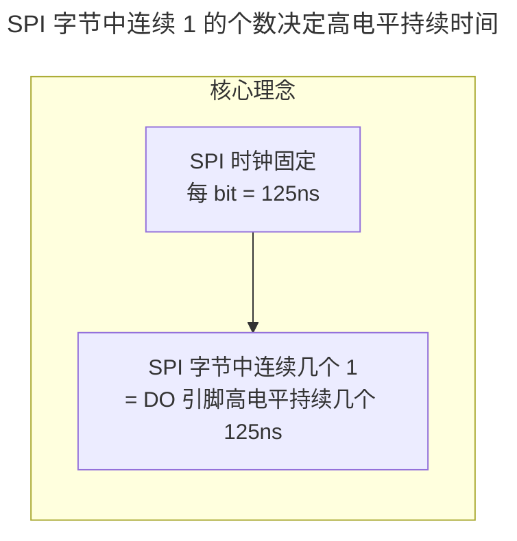

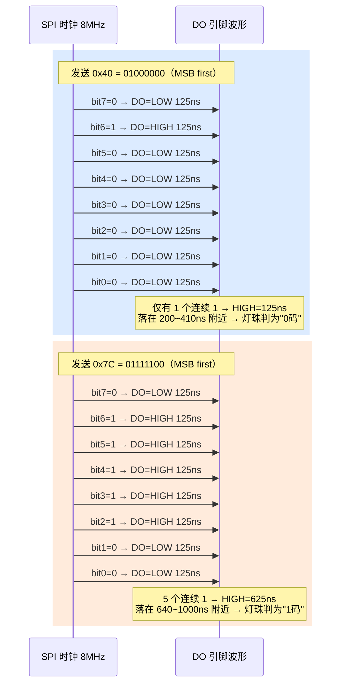

### 3.3 转换码 0x40 和 0x7C 的设计推导

既然 1 个 SPI bit = 125ns，那么需要多少个连续的 1 才能落在灯珠的识别窗口内？

```
0 码需求：高电平 200~410ns
  1 个连续 1 → 125ns   ← 略低于 200ns 最小值，但实测在 IC 容忍范围内
  2 个连续 1 → 250ns   ← 完美匹配 T0H 典型值 (280ns) 附近
  3 个连续 1 → 375ns   ← 超出 350ns 最大值，有被误判为 1 码的风险

1 码需求：高电平 640~1000ns
  4 个连续 1 → 500ns   ← 低于 650ns 最小值，不可用
  5 个连续 1 → 625ns   ← 非常接近 650ns 最小值，实测稳定
  6 个连续 1 → 750ns   ← 匹配良好，但留给低电平的空间不足
  7 个连续 1 → 875ns   ← 匹配良好，但几乎占满整个字节

约束条件：
  - 1 个 SPI 字节只有 8 bit
  - 首 bit 需要用 0 控制发送结束后 DO 的电平状态
  - 0 码和 1 码都要能放进一个字节
```

综合权衡后，最终选择（`led_pt0807.h:79-91`）：

```
原始编码    优化（右移一位，首 bit 强制为 0）
──────────────────────────────────────────────
0 码: 0x80  →  0x40 = 01000000  →  1 个连续 1 → 高 125ns ✓ (实测可行)
1 码: 0xF8  →  0x7C = 01111100  →  5 个连续 1 → 高 625ns ✓ (实测可行)
```

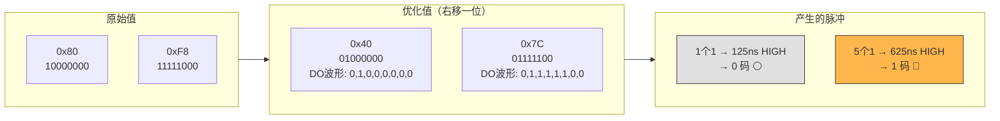

### 3.4 为什么选 8MHz 而不是其他频率？

时钟频率的选择，是 0 码和 1 码识别窗口之间的博弈：

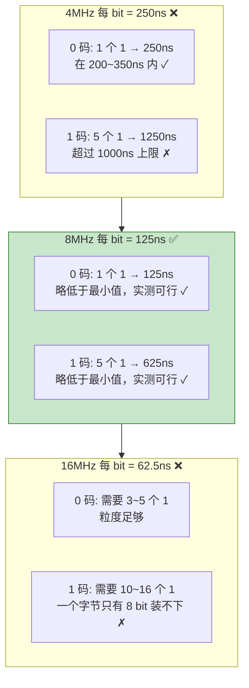

**8MHz 是在"单字节编码"约束下的最优解**——125ns 的粒度足够在 0 码/1 码之间拉开区分度，同时两个转换码都装得进一个 SPI 字节。

### 3.5 为什么不能直接把 24bit 颜色数据发出去？

如果把 R=128、G=0、B=0 的 24bit 颜色数据直接通过 SPI 发出：

```
G 的 8 bit: 0,0,0,0,0,0,0,0
R 的 8 bit: 1,0,0,0,0,0,0,0  ← R=128=0x80
B 的 8 bit: 0,0,0,0,0,0,0,0

DO 引脚上的电平：任何时候连续 1 的个数 ≤ 1
→ 高电平最长只有 125ns
→ 灯珠识别窗口：0 码需要 200~410ns，1 码需要 640~1000ns
→ 灯珠一个 bit 都识别不了！！！
```

这就是数据膨胀 8 倍的根源——**必须把每个颜色 bit 扩展为一个完整的 SPI 字节，才能用字节中连续 1 的个数造出灯珠能识别的脉冲宽度**。

---

## 四、数据层：24bit GRB → 亮度

### 4.1 GRB 数据格式

每颗灯珠接收 24bit 颜色数据，格式固定为 GRB 顺序（注意不是 RGB），高位先发（`led_pt0807.h:64-67`）：

```
[ G7 G6 G5 G4 G3 G2 G1 G0 ] [ R7 R6 R5 R4 R3 R2 R1 R0 ] [ B7 B6 B5 B4 B3 B2 B1 B0 ]
      Green 8bit (0-255)         Red 8bit (0-255)          Blue 8bit (0-255)
```

### 4.2 灯珠内部 PWM

灯珠收到 24bit 数据并 RESET 后，内部处理流程：

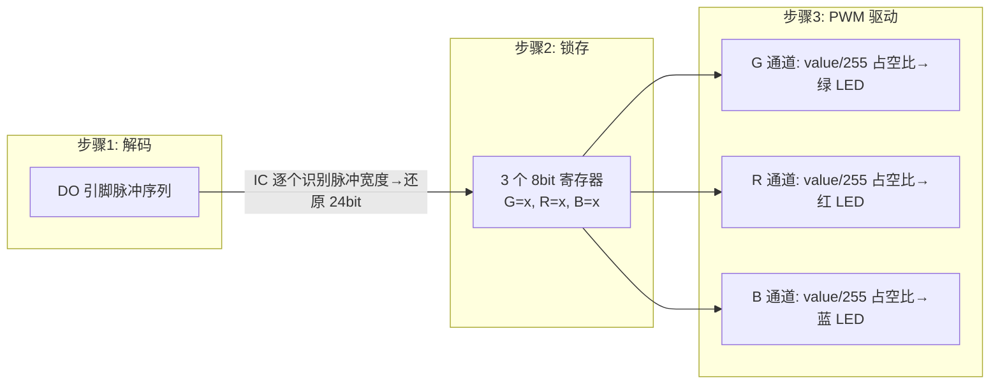

### 4.3 发送一次即可常亮

灯珠锁存数据后，内部 PWM 持续工作，**无需 MCU 循环发送**：

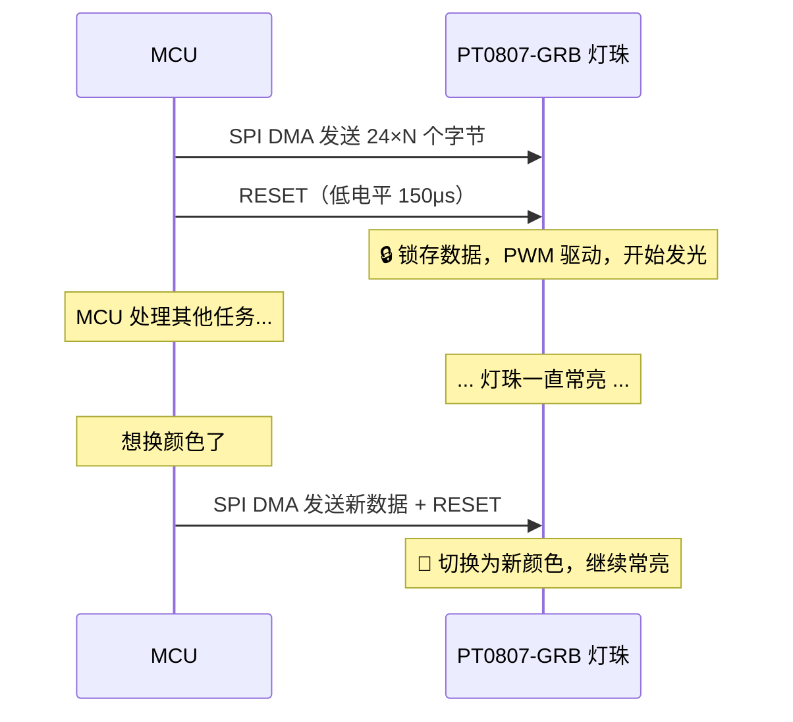

---

## 五、映射层：led_pt0807_rgb_to_spi() 代码详解

### 5.1 函数逻辑

这是连接数据层和物理层的桥梁（`led_pt0807.c:182-201`）：

```c
void led_pt0807_rgb_to_spi(
    const LedPt0807Rgb_t *rgb,      // 输入: RGB 颜色值 {g, r, b}
    LedPt0807Spi_t *spi,            // 输出: 24 个 SPI 字节
    const LedPt0807Code_t *code)    // 转换码表: code_0=0x40, code_1=0x7C
{
    // G 分量: 8 个颜色 bit → 8 个 SPI 字节（高位先发）
    for (int i = 0; i < 8; i++) {
        spi->g[i] = (rgb->g & BIT(7 - i))  // 取出第 (7-i) 位
                        ? code->code_1      // bit=1 → 0x7C
                        : code->code_0;     // bit=0 → 0x40
    }
    // R 分量: 同上
    for (int i = 0; i < 8; i++) {
        spi->r[i] = (rgb->r & BIT(7 - i)) ? code->code_1 : code->code_0;
    }
    // B 分量: 同上
    for (int i = 0; i < 8; i++) {
        spi->b[i] = (rgb->b & BIT(7 - i)) ? code->code_1 : code->code_0;
    }
}
```

数据结构（`led_pt0807.h:112-116`）：

```c
typedef struct {
    u8 g[8];  // 绿色: 8 个 SPI 字节 (G7→G0 各对应 1 个 SPI 字节)
    u8 r[8];  // 红色: 8 个 SPI 字节
    u8 b[8];  // 蓝色: 8 个 SPI 字节
} LedPt0807Spi_t;  // 一颗灯珠 = 24 字节 SPI 数据
```

### 5.2 完整示例：纯红色（R=255）

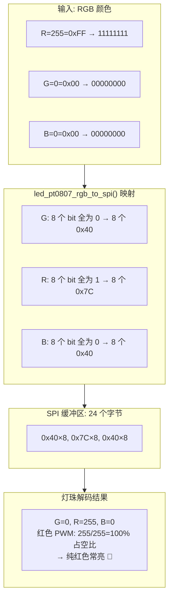

### 5.3 完整示例：半亮红色（R=128）

```
R = 128 = 0x80 = 1 0 0 0 0 0 0 0

映射过程：
  bit7=1 → 0x7C  ← 8 个 SPI 字节中，仅这一位被映射为 0x7C！
  bit6=0 → 0x40
  bit5=0 → 0x40
  bit4=0 → 0x40
  bit3=0 → 0x40
  bit2=0 → 0x40
  bit1=0 → 0x40
  bit0=0 → 0x40

R 通道输出的 8 个 SPI 字节: [0x7C, 0x40, 0x40, 0x40, 0x40, 0x40, 0x40, 0x40]
G 通道: 8 个 0x40
B 通道: 8 个 0x40

灯珠解码: G=00000000=0, R=10000000=128, B=00000000=0
内部 PWM: R 通道以 128/255≈50% 占空比驱动 → 半亮红色 🔴
```

**关键对比**：纯红色时 RSpi 的 8 个字节全是 0x7C；半亮红色时只有 1 个是 0x7C。0x7C 的**个数不直接等于亮度**——是 0x7C 的位置（对应 bit7~bit0 中的哪些位是 1）解码出的 8bit 数值才是亮度。

---

## 六、完整数据流：从 API 调用到灯珠亮起

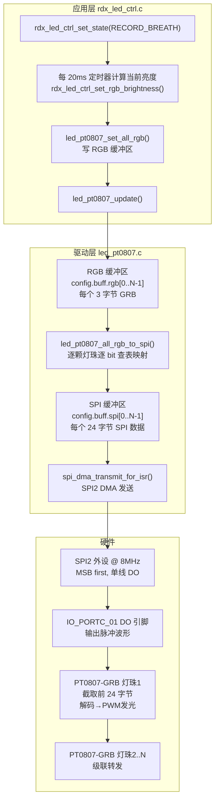

**数据膨胀总结**：

| 层级 | 一颗灯珠的数据量 |
|------|-----------------|
| 颜色数据 | 3 字节 GRB = 24 bit |
| SPI 缓冲区 | 24 字节 = 192 bit（膨胀 8 倍） |
| N 颗灯珠 | 24×N 字节，一次 DMA 完成 |

---

## 七、级联传输

多颗灯珠串联时，采用移位转发机制：

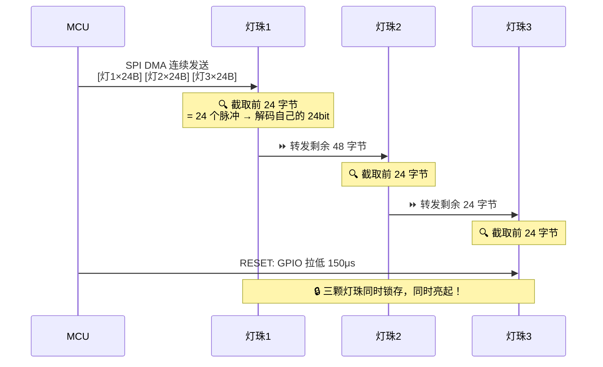

---

## 八、驱动 API 速查

`led_pt0807.h` 核心接口：

| 函数 | 功能 | 立即发送？ |
|------|------|-----------|
| `led_pt0807_init(config, spi, gpio, count)` | 初始化 SPI + 分配内存 + 发 RESET | 初始化 |
| `led_pt0807_set_pixel_rgb(config, idx, rgb)` | 设置第 idx 颗灯珠颜色 | **否**（写缓冲区） |
| `led_pt0807_set_all_rgb(config, rgb)` | 设置所有灯珠为同一颜色 | **否**（写缓冲区） |
| `led_pt0807_update(config)` | RGB→SPI 转换 + DMA 发送 | **是** |
| `led_pt0807_clear_all(config)` | 全部熄灭 | **是** |
| `led_pt0807_hsv_to_rgb(hsv, rgb)` | HSV → RGB 颜色空间转换 | — |
| `led_pt0807_start_test_mode(config)` | 红→绿→蓝 1s 循环测试 | 定时器驱动 |

> **关于 RESET 信号**：`led_pt0807_update()` 内部**不发送显式 RESET**（`led_pt0807.c:456-475`），仅完成 RGB→SPI 转换和 DMA 发送。SPI DMA 完成后 DO 引脚自然保持最后 bit 的低电平；在 20ms 定时器调用场景下，两次 `update()` 之间的间隔远大于 RESET 要求的 100μs，灯珠自动满足锁存条件，无需显式发送 RESET。

**典型调用**（先写缓冲区，再一次发送——批量修改时高效）：

```c
LedPt0807Rgb_t red = {.g = 0, .r = 255, .b = 0};   // 注意 GRB 顺序！
led_pt0807_set_all_rgb(g_led_config, &red);          // 写缓冲区
led_pt0807_update(g_led_config);                     // 一次 DMA 全部发出
```

---

## 九、应用层灯效状态机

`rdx_led_ctrl.c/h` 封装了完整场景灯效，20ms 定时器驱动：

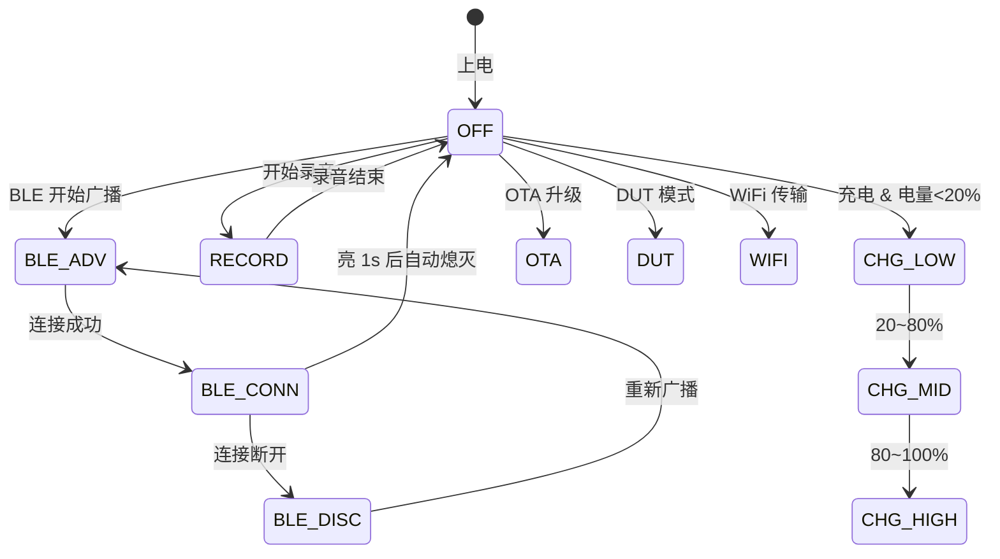

| 状态枚举 | 场景 | 灯效 | 颜色 |
|----------|------|------|------|
| `LED_STATE_OFF` | 熄灭 | — | — |
| `LED_STATE_BLE_ADV_BLINK` | BLE 广播 | 1s 闪烁（亮 200ms） | 蓝色 |
| `LED_STATE_BLE_CONNECTED` | BLE 连接 | 常亮 1s 后灭 | 青色 |
| `LED_STATE_BLE_DISCONNECTED` | BLE 断开 | 1s 闪烁 | 蓝色 |
| `LED_STATE_RECORD_BREATH` | 录音中 | 4s 呼吸 | 红色 |
| `LED_STATE_CHARGE_LOW_BREATH` | 充电 <20% | 呼吸 | 红色 |
| `LED_STATE_CHARGE_MID_BREATH` | 充电 20~80% | 呼吸 | 橙色 |
| `LED_STATE_CHARGE_HIGH_BREATH` | 充电 80~100% | 呼吸 | 紫色 |
| `LED_STATE_CHARGE_FULL` | 充满电 | 常亮 | 绿色 |
| `LED_STATE_OTA_BLINK` | OTA 升级 | 3s 内闪两次（各 100ms） | 白色 |
| `LED_STATE_DUT_BLINK` | DUT 模式 | 1s 闪烁 | 黄色 |
| `LED_STATE_WIFI_BLINK` | WiFi 传输 | 500ms 快闪 | 黄色 |

呼吸灯通过 100 级亮度查表 `g_breath_brightness_table` 实现（`rdx_led_ctrl.c:111-126`）：渐亮 30 点 → 最亮保持 20 点 → 渐暗 30 点 → 熄灭 20 点，4s 周期循环。

> ⚠️ **充电分段逻辑状态**：`rdx_led_ctrl_set_charge_state_by_battery()`（`c:506-526`）中，按电量分段的 `if/else` 逻辑已被注释，当前固定进入 `LED_STATE_CHARGE_HIGH_BREATH`（紫色呼吸）。上表中 `<20%` / `20~80%` / `100%` 的行为为设计意图，待分段逻辑恢复后生效。

---

## 十、硬件连接

实际引脚配置（`rdx_app.h:46`，`led_pt0807.c:230-248`）：

| 信号 | 引脚 | 备注 |
|------|------|------|
| SPI DO | `IO_PORTC_01` | 接 PT0807-GRB 的 DI 引脚 |
| SPI CLK | 不连接 | `NO_CONFIG_PORT` |
| SPI DI | 不连接 | `NO_CONFIG_PORT` |
| SPI CS | 不连接 | `NO_CONFIG_PORT` |
| SPI 模式 | 单线输出 + MSB 先发 | `SPI_MODE_BIDIR_1BIT` |
| SPI 时钟源 | 64MHz | `clk_set_api("spi", 64000000)` |
| SPI 波特率 | 8MHz | `spi_set_baud(port, 8000000)` |

---

## 十一、一句话总结

> **PT0807-GRB 灯珠只能识别脉冲宽度——高电平 200~410ns 判 0，640~1000ns 判 1。MCU 利用 SPI 固定 8MHz 时钟（每 bit=125ns）做"脉冲成型器"：颜色 bit=0 映射为字节 0x40（1 个连续 1 → 125ns 高脉冲），bit=1 映射为字节 0x7C（5 个连续 1 → 625ns 高脉冲）。每颗灯珠的 24bit 颜色数据被膨胀为 24 个 SPI 字节，DMA 一次发完。灯珠逐个识别脉冲宽度还原出 24bit GRB，锁存后用内部 PWM 按数值/255 的占空比驱动 RGB 三路 LED 发光。RESET 后灯珠自己保持常亮，MCU 无需循环发送——想换颜色才需要再发一次新数据。**
