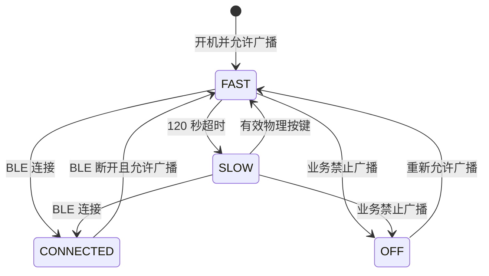
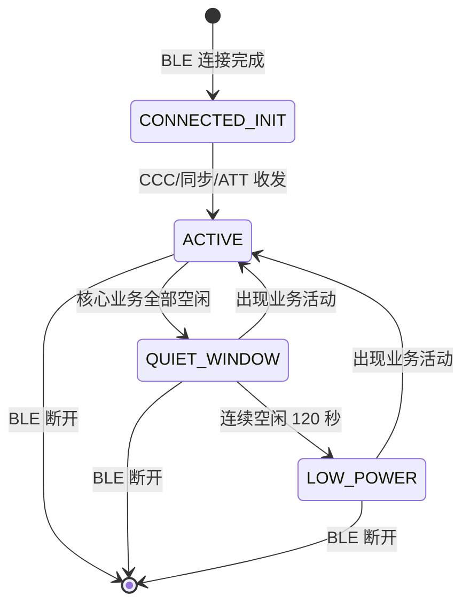

# T2616 CC 开机待机与 BLE 连接功耗优化

> 更新日期：2026-08-24
>
> 当前阶段：未连接广播按键唤醒和 BLE 连接态动态参数管理均已完成代码闭环；正式固件已构建，完整实机回归仍待执行。

## 1. 文档目的

本文档是 T2616 CC 开机待机与 BLE 连接功耗优化的唯一维护入口，统一记录产品决策、目标状态机、功耗目标、当前实现、实测证据、未完成事项和回归计划。

覆盖范围包括：

- BLE 未连接时的快速广播、慢速广播、灯效、按键唤醒和系统睡眠。
- BLE 已连接时的高性能/低功耗连接参数切换和连接待机。
- 影响待机功耗的本地存储、LED 定时器、Debug UART 和系统唤醒源。

优化遵循以下原则：

- 先消除异常外设访问和高频唤醒，再调整广播、连接参数、时钟和电压。
- 每轮只改变一个主要变量，通过 A/B 测试量化收益。
- 功耗优化不能以破坏 BLE 响应、录音、OTA、RTC、产测或 LED 功能为代价。
- 诊断日志版与正式功耗测量版分开构建，不能混用测量结果。

## 2. 产品决策与设计模型

### 2.1 已确认的产品决策

以下行为是当前固定基线，不调整现有时间和参数配置：

- 开机、BLE 断开或慢广播期间发生有效物理按键活动后，进入完整的 `120 s` 快速广播窗口。
- 快速广播期间显示现有紫色 BLE 广播灯效。
- 快速广播满 `120 s` 后切换到慢速广播，同时熄灭 BLE 广播灯。
- 慢广播期间仍保持可发现、可连接；熄灯仅表示进入低功耗待机，不表示关机。
- 慢广播期间用户按键后，重新执行“快速广播＋紫灯 120 秒 → 慢广播＋熄灯”的完整周期。
- 快速广播期间的普通按键不延长当前窗口；只有 `SLOW → FAST` 才重新开启完整窗口。
- BLE 建立连接并出现有效业务活动后，使用现有高性能连接参数。
- BLE 连接业务连续空闲 `120 s` 后，使用现有低功耗连接参数。
- 低功耗连接期间再次发生业务活动时，立即恢复高性能连接参数。

### 2.2 关键设计原则

#### 广播参数与连接参数相互独立

广播间隔仅在 BLE 未连接时生效；连接间隔仅在 BLE 已连接后生效。从慢广播建立连接后，广播立即停止，不会把慢广播间隔“继承”为连接参数。

#### 用户活动与业务活动相互独立

- 用户活动：实体按键产生的有效操作，用于在未连接慢广播时恢复快速广播。
- 业务活动：BLE ATT 收发、同步、录音、文件传输、OTA 等需要连接性能的活动，用于在已连接时恢复高性能参数。

用户活动从原始物理按键入口上报，不依赖按键最终是否被业务映射为 `APP_MSG_SINGLE_CLICK` 或 `APP_MSG_NULL`。

#### 状态是事实来源，LED 是状态投影

LED 不用于反推 BLE 状态。BLE 状态机负责阶段和计时，LED 控制层根据最终系统状态显示效果：

- `FAST`：显示紫色 BLE 广播灯效。
- `SLOW`：熄灭 BLE 广播灯。
- `CONNECTED`：执行现有已连接灯效策略。
- 录音、WiFi、OTA、DUT、充电和低电等更高优先级灯效不得被 BLE 状态覆盖。

### 2.3 未连接广播状态机



### 2.4 已连接参数状态机



## 3. 目标与当前结论

### 3.1 功耗目标

- 初始问题：设备开机稳定待机电流约为 `3 mA`。
- 目标：未连接稳定待机和 BLE 已连接空闲的平均电流均达到 `1.0 mA` 左右。
- 测量口径：状态稳定后连续采样 `60 s`，同一固件至少测量 3 次。

### 3.2 当前实测结果

| 场景 | 优化前 | 当前结果 | 当前结论 |
| --- | ---: | ---: | --- |
| 未连接，慢速 BLE 广播 | 约 `3 mA` | 约 `1.5 mA` | LED 空闲定时器优化收益明显 |
| 未连接，慢速广播 + Endless Sleep + 关闭 Debug UART | 约 `1.5 mA` | 约 `1.3 mA` | 再降低约 `0.2 mA`，仍未达到目标 |
| BLE 已连接空闲，手机初始参数 | 约 `3 mA` | 约 `3 mA` | 关闭打印无明显改善，主要负担是连接事件频率 |
| BLE 已连接空闲，低功耗参数 | 约 `3 mA` | 约 `1.5 mA` | 方向已验证，兼顾体验后采用 `latency = 4` |

### 3.3 当前工程结论

- 未连接态已从约 `3 mA` 降至约 `1.3 mA`。
- BLE 已连接空闲态已从约 `3 mA` 降至约 `1.5 mA`。
- BLE 高性能连接参数、业务运行、业务结束、静默 `120 s`、切换低功耗连接参数的基本闭环已通过实机日志验证。
- 当前 BLE 方案达到代码提交条件，但 Android/iOS、长录音、完整 OTA、异常断链和量化延迟仍属于量产回归项。

## 4. 验收口径

### 4.1 状态定义

| 状态 | 判定条件 | 用途 |
| --- | --- | --- |
| 启动阶段 | 上电至初始化完成 | 观察复位、外设初始化和启动异常 |
| 快速广播待机 | BLE 未连接，快速广播仍在运行 | 单独记录，不计入稳定待机均值 |
| 未连接稳定待机 | BLE 未连接，已切换慢速广播，LED 熄灭且业务空闲 | 未连接功耗验收状态 |
| BLE 连接初始化 | 建链至 CCC、鉴权及初始化同步完成 | 功能阶段，不计入连接空闲均值 |
| BLE 已连接业务 | 录音、OTA、WiFi 或批量传输运行中 | 吞吐和稳定性验收状态 |
| BLE 已连接静默窗口 | 业务已空闲，等待连续 `120 s` 无 BLE 活动 | 体验保持阶段，不计入低功耗连接稳态均值 |
| BLE 已连接空闲 | 低功耗连接参数实际生效，且业务与发送队列均空闲 | 连接功耗验收状态 |

### 4.2 测量条件

- 设备未充电，使用相同硬件、供电电压、仪表和电池状态。
- WiFi 关闭、未录音、非 OTA/DUT，LED 无动态效果。
- 未连接态在慢速广播稳定后开始采样。
- 连接态在 HCI 确认低功耗参数实际生效后等待约 `5 s` 再开始采样。
- 正式测量时关闭并断开 Debug UART，避免 USB、UART 和地线回灌。
- 每次记录 60 秒平均值、峰值、供电电压、手机系统及环境条件。
- 快速广播、连接初始化和连接业务阶段不得与稳定待机数据混算。

### 4.3 硬件约束

`VDD_POWER_PORT_IO` 为 PA0，PA0 同时给 `led_pt0807` 供电。设备开机运行期间 PA0 必须始终保持高电平：

- 不得把 PA0 作为 eMMC/SD 的独立电源开关。
- 存储空闲、复位和异常路径均不得拉低 PA0 或将其配置为高阻。
- 所有功耗优化必须在 PA0 常供电的前提下验证。

## 5. 设计与已落地方案

### 5.1 本地存储能力门控

本地存储统一使用以下能力位判断：

```c
#if IS_SUPPORT_ABILITY(ABILITY_LOCAL_STORAGE)
/* 本地存储业务 */
#endif
```

设计约束：

- `IS_SUPPORT_ABILITY(ABILITY_LOCAL_STORAGE)` 是本地存储业务的唯一门控。
- 当前 `RDX_DEVICE_ABILITY = 0x22`，包含会议录音和 RTC，不包含本地存储能力。
- 当前产品不得初始化 uxfile、挂载 SD0、启动 DAT 同步或激活存储控制器。
- `RDX_MULTI_FUNC_INTERFACE` 只表示硬件接口类型，不能代替业务能力判断。
- 应用层和预编译库必须使用一致的能力配置。
- PA0 常供电要求独立于本地存储能力位。

已完成提交：

```text
8c7a644 fix(rdx)：功耗优化 使用设备能力门控本地存储
```

### 5.2 LED 空闲定时器

LED 控制器原先永久运行 `20 ms` 定时器，即使 LED 熄灭也会持续唤醒 CPU。当前实现：

- `RDX_LED_SCENE_OFF` 时写入灭灯数据并删除定时器。
- 调用 `led_pt0807_run_enable(..., 0)` 停止 LED 驱动运行。
- 常亮场景只更新一次，不保留周期定时器。
- 呼吸、闪烁、彩虹等动态效果按需创建定时器，结束后释放。
- PA0 始终保持高电平，不随 LED 场景切换。

### 5.3 LED 定时器任务归属

在线录音期间曾出现大量以下警告，并导致录音灯效不亮：

```text
timer_no_response: protocol_recv_task, 6010354, 20...
```

根因是 LED 的 `20 ms` 系统定时器由 `protocol_recv_task` 懒创建，JL 的 `sys_timer_add()` 回调跟随创建任务执行；协议任务繁忙时，LED 回调无法及时运行。

修复方式：

- 保留 LED 定时器按需启停，避免恢复常驻唤醒。
- 非 `app_core` 场景通过 JL 原生无参 `Q_CALLBACK` 请求同步。
- LED 定时器统一由 `app_core` 创建和删除。
- 回调执行时读取最新灯效状态，避免处理已经过期的 start/stop 请求。

实机已确认录音灯效恢复正常。

### 5.4 未连接广播与按键唤醒

#### 5.4.1 广播阶段

| 阶段 | 进入条件 | 广播参数 | BLE 灯效 | 退出条件 |
| --- | --- | --- | --- | --- |
| `FAST` | 开机、BLE 断开、慢广播期间有效按键 | `adv_interval_min = 160` | 现有紫色广播灯效 | 连接成功、120 秒超时、广播被关闭 |
| `SLOW` | 快速广播连续运行 120 秒 | `RDX_BLE_ADV_INTERVAL_LOW = 800` | 熄灭 | 连接成功、有效按键、广播被关闭 |
| `OFF` | 关机、WiFi 占用、DUT、格式化或其他禁止广播场景 | 广播关闭 | 由实际业务状态决定 | 重新允许广播 |
| `CONNECTED` | BLE 连接成功 | 广播停止 | 现有连接态策略 | BLE 断开 |

慢广播不是关机状态，设备仍保持可发现和可连接。

#### 5.4.2 按键唤醒规则

原始物理按键入口检测到有效活动后，只有同时满足“BLE 未连接、广播允许、当前阶段为 `SLOW`”才执行：

1. 恢复当前快速广播参数。
2. 重新启动完整的 `120 s` 快速广播定时器。
3. 通过统一灯效恢复入口按实际系统状态仲裁灯效。
4. 没有更高优先级业务状态时，恢复紫色 BLE 广播灯效。
5. `120 s` 后再次进入慢广播并熄灭 BLE 广播灯。

事件过滤规则：

- 短按只按一次物理活动处理。
- 长按首次有效动作可以唤醒，周期性 `HOLD` 和按键抬起事件不能重复触发。
- 快速广播期间的按键不重置或延长当前 `120 s` 窗口。
- 已连接状态不得因按键重新启动广播。

#### 5.4.3 灯效优先级

广播阶段变化只更新 BLE 状态，不得无条件显示紫灯。灯效按当前实际状态仲裁：

```text
低电告警
> 充电/充满
> OTA
> DUT
> 录音
> WiFi/文件传输
> BLE 连接/广播
> OFF
```

低电保护以及录音、WiFi、OTA、DUT、充电等业务灯效不能被快慢广播切换覆盖。

### 5.5 未连接态 Endless Sleep

`eSystemConfirmStopStatus()` 原先在普通运行态返回 `0`，系统即使无任务也可能保持 `100 ms` 周期唤醒。当前门控只在以下条件全部满足时允许 Endless Sleep：

- BLE 已进入慢速广播且没有 BLE/EDR 连接。
- LED 为 `OFF`。
- 未充电、未录音、WiFi 关闭。
- 非 OTA、非 DUT，其他核心业务空闲。

BLE 控制器事件、按键、RTC、充电插拔和业务定时器仍可正常唤醒 CPU。

### 5.6 BLE 连接态动态参数管理

#### 5.6.1 当前参数

| 档位 | interval | latency | timeout | 用途 |
| --- | --- | --- | --- | --- |
| 高性能 | `6~10` | `4` | `600` | App 操作、录音、OTA 和数据传输 |
| 低功耗 | `60~80` | `4` | `2000` | 连续静默 `120 s` 后的连接空闲态 |

单位说明：interval 单位为 `1.25 ms`，timeout 单位为 `10 ms`。手机最终采用值以 HCI 更新完成事件为准。

#### 5.6.2 状态流程

```text
连接建立
  -> 记录手机初始参数
  -> CCC/初始化同步或首次 BLE 收发
  -> 请求高性能连接参数
  -> 业务运行或持续收发
  -> 业务与发送队列全部空闲
  -> 连续 120 秒无 BLE 收发
  -> 请求低功耗连接参数
  -> HCI 确认实际参数
```

关键行为：

- 刚连接时不会由固件主动请求低功耗连接参数。
- 刚建链的初始参数由手机决定；协议通道就绪或产生 BLE 活动后请求高性能连接参数。
- 任意 BLE 收发都会退出 slave latency，并刷新静默时间。
- 静默窗口内再次操作会重新开始完整的 `120 s` 计时。
- 长业务运行期间不累计静默时间；业务真正结束、尾包与发送队列清空后才开始计时。
- 低功耗连接期间收到第一条命令后立即请求高性能连接参数，后续连续操作保持高性能。

#### 5.6.3 统一活跃度入口

连接参数策略统一收口在 `rdx_ble_server.c`：

- 普通协议和 OTA 的 ATT 写入口记录接收活动。
- 普通通知发送和 OTA 发送入口记录发送活动。
- 录音、WiFi、OTA、DUT、文件上传、bulk 和普通发送队列集中参与 busy 判定。
- 新增普通 BLE 协议命令不需要单独调用连接参数切换接口。
- 未来只有“不经过统一 BLE 收发入口且长期依赖 BLE 吞吐”的异步业务，才需要补充统一 busy 状态来源。

预编译 `rdx_lib` 仍引用以下符号，因此保留 ABI 包装：

```c
rdx_ble_server_request_stream_fast_param();
rdx_ble_server_post_transfer_lowpower();
```

两个接口只把旧库通知转交活跃度管理器，不再直接切档或启动旧的 `1 s` 恢复定时器。新增业务不得继续直接依赖这些兼容接口。

#### 5.6.4 并发与异常处理

- 状态机、HCI/L2CAP 事件、静默定时器和参数申请统一由 `app_core` 串行持有。
- 其他任务只在短自旋锁内更新活动时间和序号，并合并投递事件，避免每个数据包产生任务消息。
- 状态以 HCI 实际完成参数驱动，不能把“请求已发出”当成“参数已生效”。
- 手机拒绝或实际参数不匹配时，低功耗申请最多重试 3 次。
- 高性能和低功耗参数请求各有独立 `5 s` watchdog，避免永久停留在 pending。
- 静默定时器和 watchdog 使用代次令牌，旧回调不能修改新连接或新定时器状态。
- L2CAP 拒绝事件校验连接句柄，断开和重连会清理旧状态。
- 控制器立即拒绝与“已接受但无完成事件”分开处理，避免重叠参数请求。

#### 5.6.5 JL 原生 Q_CALLBACK 规则

HCI 连接完成和参数更新完成事件跨任务传递时，采用 JL SDK 原生单指针模式：

```c
rdx_conn_param_event_t *event = malloc(sizeof(*event));
int msg[3] = {
    (int)callback,
    1,
    (int)event,
};
os_taskq_post_type("app_core", Q_CALLBACK, 3, msg);
```

所有权规则：

- 发送端复制事件数据到堆内存。
- 投递失败由发送端释放。
- 投递成功后由回调读取并释放。
- 禁止通过 `Q_CALLBACK` 直接传递 4 个或 5 个独立回调参数。

#### 5.6.6 日志策略

保留状态转折日志，删除高频活动刷新日志：

- 首次进入业务 busy 时打印一次阻塞状态。
- 业务结束时打印一次 `core business idle...`。
- 静默窗口真正开始时打印一次 `BLE quiet window started...`。
- 参数请求、HCI 实际完成、拒绝、超时和最终放弃保留日志。
- 持续活动期间不再每秒打印“刷新 120 秒窗口”。

#### 5.6.7 已连接状态的系统级睡眠边界

当前已实现的是连接参数层面的低功耗。RDX 的 Endless Sleep 准入仍明确要求 BLE 未连接，因此已连接空闲时继续沿用系统周期唤醒策略。

只有在连接低功耗参数仍无法达到整机指标时，才进一步评估已连接 Endless Sleep。放宽前必须验证 BLE 控制器连接事件、ATT 收发、参数更新、断开事件、软件定时器和所有外设 idle query 均能可靠工作。

## 6. 实机验证记录

| 日志或测试 | 关键现象 | 结论 |
| --- | --- | --- |
| `COM3_2026-07-30_15-54-19.log` | 初始开机待机约 `3 mA` | 建立原始问题基线 |
| `COM3_2026-07-30_18-13-11.log` | `00:02:01.470` 切慢速广播，`00:02:01.473` LED 转为 OFF | 未连接稳态测量起点明确，慢速广播约 `1 s` |
| `COM3_2026-07-31_09-49-39.log` | 初始参数 `interval=24, latency=0, timeout=500` | `30 ms` 连接事件是连接空闲约 `3 mA` 的主要来源 |
| `COM3_2026-07-31_10-22-02.log` | 请求 `60~80/19/2000` 后空闲电流约 `1.5 mA` | 低频连接参数方向有效 |
| `COM3_2026-07-31_10-52-34.log` | 录音进入高性能参数，停止后未恢复低功耗参数 | 旧版业务结束恢复逻辑不完整 |
| `COM3_2026-07-31_11-07-48.log` | 停止后仍停留在手机参数 | 不能仅凭请求索引判断档位，必须使用 HCI 实参 |
| `COM3_2026-07-31_11-23-53.log` | 低功耗参数实际 `72/19/2000`，但操作延迟明显 | `latency=19` 不作为量产默认值 |
| `COM3_2026-07-31_12-20-58.log` | 录音停止后有效日志仅约 `8.3 s` | 不足以验证正式 `120 s` 静默窗口 |
| 10 秒诊断版 | 录音结束、队列清空、静默 10 秒后成功切换低功耗参数 | busy -> idle -> 低功耗闭环生效 |
| `COM3_2026-07-31_13-54-32.log` | Q_CALLBACK 后续参数异常并产生虚假超时 | 直接传递多参数不符合 JL 原生 ABI |
| `COM3_2026-07-31_14-18-12.log` | 高性能实参 `9/4/600`；最后活动后约 `119.3 s` 请求低功耗参数，实参 `72/4/2000` | 正式 120 秒闭环通过，无超时、拒绝或二次重试 |

补充说明：`14-18-12` 日志中的 `12/24、latency=0、timeout=500` 是手机主动更新参数。后续 BLE 活动触发状态机重新申请高性能参数，属于预期兼容路径。

## 7. 当前实现状态与下一步

| 优先级 | 项目 | 状态 | 下一步 |
| --- | --- | --- | --- |
| P0 | 本地存储能力门控 | 已完成 | 对有/无本地存储能力的产品配置持续回归 |
| P0 | PA0 常供电约束 | 已落实 | 所有后续版本持续监测 PA0 |
| P1 | LED 空闲定时器 | 已完成 | 回归全部灯效和场景结束后的释放 |
| P1 | LED 定时器任务归属 | 已完成，实机灯效恢复 | 长录音中确认无 `timer_no_response` |
| P1 | 未连接广播阶段与按键唤醒 | 已完成代码闭环并通过正式构建 | 执行完整实机交互回归 |
| P1 | BLE 连接态动态参数 | 基本闭环已通过，可提交 | 完成量产级兼容性和压力回归 |
| P2 | 未连接态 Endless Sleep | 已完成初步 A/B | 回归所有唤醒源 |
| P2 | Debug UART 量产配置 | 已完成初步 A/B | 保留 Audio DUT 和 SPP 产测能力 |
| P2 | BLE 广播与灯效超时来源 | 部分实现 | 后续统一为广播状态机单一 120 秒计时源 |
| P2 | 已连接态系统级 Endless Sleep | 待评估、待验证 | 仅在连接参数优化仍不达标时评估 |
| P2 | 重复软关机/复位 | 待确认 | 记录复位源、按键电平和开机判断 |
| P3 | LRC、VDDIO、RAM 保持 | 未开始 | 仅在业务层优化完成后执行 |

### 7.1 近期执行顺序

1. 回归“快速广播＋紫灯 120 秒 → 慢广播＋熄灯 → 按键恢复完整周期”，覆盖所有高优先级灯效和 PC 模式边界。
2. 完成 Android/iOS 的连接参数、录音、OTA 和异常断链回归。
3. 量化 App 命令 P50、P95、最大延迟，并重复测量未连接与已连接空闲电流。
4. 回归未连接态 Endless Sleep 的全部唤醒源。
5. 后续统一 BLE 广播与 BLE 灯效的 120 秒计时来源。
6. 仍未达到 `1.0 mA` 时，再依次评估已连接 Endless Sleep、LRC、VDDIO 和 RAM 保持策略。

## 8. 回归测试清单

### 8.1 构建与提交门槛

- [x] `.vscode\\winmk.bat all` 全量编译、LTO 链接和固件打包通过。
- [x] `git diff --cached --check` 通过。
- [x] 已连接态正式 `120 s` 高性能到低功耗参数闭环通过。
- [x] 参数日志值正常，无 Q_CALLBACK 参数损坏。
- [x] 录音灯效恢复。
- [x] 高频 `120 s` 活动刷新日志已移除。
- [ ] 使用最终固件确认无 `timer_no_response` 和周期性活动刷新打印。

### 8.2 未连接广播与交互

- [ ] 冷启动后进入快速广播，紫灯按现有效果显示。
- [ ] 运行 `120 s` 后进入慢广播并熄灭紫灯。
- [ ] 慢广播期间手机仍可发现并连接设备。
- [ ] 慢广播期间短按后立即恢复快速广播和紫灯，并重新获得完整 `120 s` 窗口。
- [ ] 快速广播期间按键不延长当前窗口。
- [ ] 长按首次有效动作可以唤醒，周期性 `HOLD` 和抬起事件不重复续期。
- [ ] 再运行 `120 s` 后重新进入慢广播并熄灯。
- [ ] 录音、WiFi、OTA、DUT、充电和低电状态下按键时保留高优先级灯效。
- [ ] 快速广播和慢广播均可正常建立 BLE 连接。
- [ ] BLE 断开后重新进入完整 `120 s` 快速广播窗口。
- [ ] 慢广播、LED 熄灭且业务空闲时能够进入 Endless Sleep，并可被按键、BLE、RTC 和充电事件唤醒。
- [ ] PC 模式单独验证；该模式会主动停止广播切换定时器，不与普通待机结果混算。

### 8.3 BLE 连接功能与兼容性

- [ ] BLE 扫描、首次连接、重连和正常断开。
- [ ] 刚连接后不主动请求低功耗参数；首次业务活动请求高性能参数。
- [ ] 静默窗口内再次操作后重新计算完整 `120 s`。
- [ ] 录音开始、暂停、恢复、停止，停止后恢复低功耗参数。
- [ ] 在线录音连续运行至少 30 分钟，检查丢帧、缓存、超时和吞吐。
- [ ] 完整 OTA 成功、失败和取消路径，确认连接参数恢复。
- [ ] WiFi 开启、传输、关闭和异常超时。
- [ ] 文件上传、bulk 和普通发送队列清空后的低功耗恢复。
- [ ] 参数请求被拒绝、超时、实参不匹配及最多 3 次重试。
- [ ] 参数切换期间断连、快速重连和手机主动更新连接参数。
- [ ] Android/iOS 前台、后台和锁屏场景。
- [ ] 手机主动断开、关闭蓝牙和远离至射频丢失。

### 8.4 体验与功耗

- [ ] 普通 App 命令至少测试 20 次，统计 P50、P95 和最大延迟。
- [ ] 未连接稳定待机和 BLE 已连接空闲分别测量 3 组 60 秒数据。
- [ ] 记录供电电压、平均值、峰值、手机系统和环境条件。
- [ ] 确认高性能连接参数的吞吐满足录音、OTA 和批量传输要求。
- [ ] 确认低功耗连接参数下第一条命令的延迟在产品可接受范围内。

### 8.5 系统功能

- [ ] 冷启动、长按启动、连续复位和自动关机。
- [ ] 按键、RTC、BLE、充电插拔和业务定时器唤醒。
- [ ] LED 全部场景及动态效果结束后的定时器释放。
- [ ] PA0 全程保持高电平，无低脉冲或高阻窗口。
- [ ] RTC 设置、掉电保持、24 小时漂移和 RTC 唤醒。
- [ ] 电机、低电量、高电量、常温及温度边界稳定性。
- [ ] RDX DUT、Audio DUT、SPP 和测试盒产测流程。

## 9. A/B 测试矩阵

### 9.1 未连接态

| 版本 | 主要变量 | 目的 | 当前结果 |
| --- | --- | --- | --- |
| A0 | PA0 安全基线 | 建立原始功耗与硬件安全基线 | 已完成历史验证 |
| A1 | 本地存储能力门控 | 消除无能力产品的存储访问 | 已完成 |
| A2 | LED OFF 停止 20 ms 定时器 | 量化 LED/CPU 唤醒贡献 | 稳态约 `1.5 mA` |
| A3 | A2 + Endless Sleep + 关闭 Debug UART | 消除固定唤醒并隔离打印影响 | 稳态约 `1.3 mA` |
| A4 | A3 + 显式广播阶段与按键唤醒 | 在不修改广播参数的前提下恢复交互闭环 | 代码已完成，待实机回归 |
| A5 | A3 + 临时关闭 BLE 广播 | 仅用于诊断板级底噪 | 待执行 |
| A6 | A3 + LRC/电压评估 | 验证底层优化上限 | 最后执行 |

### 9.2 BLE 已连接态

| 版本 | 主要变量 | 目的 | 当前结果 |
| --- | --- | --- | --- |
| B0 | 手机初始 `30 ms / latency 0` | 建立连接空闲基线 | 约 `3 mA` |
| B1 | 静态低功耗 `60~80/19/2000` | 隔离连接事件频率收益 | 约 `1.5 mA`，但延迟不可接受 |
| B2 | 动态连接参数状态机 | 空闲省电且业务保持吞吐 | 基本闭环已通过 |
| B3 | 低功耗 `latency=4/9/19` A/B | 平衡功耗与响应 | 当前选择 `latency=4`，主观体验可接受 |
| B4 | B3 + 连接态 Endless Sleep | 评估额外系统唤醒收益 | 仅在 B2/B3 完整回归后仍不达标时执行 |

禁止把多个 A/B 变量一次合并后只测一个结果，否则无法定位收益和回归来源。

## 10. 模式边界说明

| 模式 | 作用范围 | 是否参与当前测试 |
| --- | --- | --- |
| 经典蓝牙 Sniff | 已建立的 EDR 连接，降低经典蓝牙监听频率 | 不参与 BLE 广播和 BLE 连接态测试 |
| Endless Sleep | 系统空闲时取消固定兜底唤醒，保留正常中断和蓝牙事件 | 参与未连接稳定待机优化 |
| 软关机 | 停止正常应用和蓝牙协议栈，只保留硬件允许的唤醒源 | 不参与，产品待机必须保持 BLE 可发现 |
| PC 模式 | 会主动停止广播切换定时器，脱离普通快慢广播状态机 | 单独回归，不与普通待机结果混算 |

三者不能互相替代，也不能用一个场景的功耗结果推导另一个场景。

## 11. 历史方案与淘汰原因

### 11.1 每个业务手动切换连接参数

问题：连接参数策略扩散到录音、OTA、WiFi 等业务模块。新增业务容易漏接入，业务短暂停顿也可能提前降档。

结论：已由统一 BLE 活跃度入口和集中 busy 判定替代。

### 11.2 业务结束 1 秒后切低功耗参数

问题：录音停止后仍可能存在尾包或发送队列，单次检查会永久错过恢复；即使成功切换，也会让连续 App 操作产生明显体验波动。

结论：改为业务完全空闲后开始连续 `120 s` 静默窗口。

### 11.3 低功耗 latency = 19

实机参数为 `interval=72, latency=19` 时，理论最坏空闲下行等待约为：

```text
90 ms * (19 + 1) = 1.8 s
```

用户操作延迟感明显，因此不作为量产默认值。当前采用 `latency=4`，后续用量化延迟和功耗数据决定是否评估 `latency=9`。

### 11.4 Q_CALLBACK 直接传递多参数

问题：JL 任务消息取参方式导致后续 interval、latency、timeout 数据损坏，并触发虚假 watchdog 超时。

结论：统一使用“堆复制事件结构体 + 单指针 Q_CALLBACK + 明确释放所有权”的 JL 原生方式。

## 12. 代码位置与构建基线

### 12.1 代码位置

| 功能 | 代码位置 |
| --- | --- |
| 广播阶段、广播参数、120 秒超时和连接参数管理 | `SDK/apps/common/third_party_profile/rdx_protocol/rdx_ble_server.c` |
| 广播阶段枚举和对外接口 | `SDK/apps/common/third_party_profile/rdx_protocol/rdx_ble_server.h` |
| 原始物理按键活动入口 | `SDK/apps/common/third_party_profile/rdx_protocol/rdx_app.c::rdx_app_key_msg_handler()` |
| 正常业务按键映射 | `SDK/apps/common/third_party_profile/rdx_protocol/rdx_key.c` |
| LED 状态恢复与效果引擎 | `SDK/apps/common/third_party_profile/rdx_protocol/rdx_led_ctrl.c` / `rdx_led_cfg.h` |
| 未连接慢广播 Endless Sleep 准入 | `SDK/apps/earphone/app_main.c::rdx_idle_for_endless_sleep()` |

关键入口：

- 快速转慢速广播：`rdx_ble_server_adv_interval_change_timer_cb()`。
- 慢广播按键恢复快速广播：`rdx_ble_server_fast_adv_restart()`。
- 广播开启和重启：`rdx_ble_server_adv_enable()`。
- 连接参数活跃度管理：`rdx_ble_server_conn_activity_touch()` / `rdx_ble_server_conn_activity_process()`。
- 连接空闲转低功耗：`rdx_ble_server_restore_lowpower_cb()`。

### 12.2 当前正式构建

在 `SDK` 目录执行：

```powershell
.vscode\winmk.bat all
```

当前源码已完成全量编译、LTO 链接和固件打包。设备离线时只生成固件，不执行烧录。

```text
固件：output/update.ufw
SHA-256：E62BE5EF2EB12932A101A66A1B9CAE9C7575170D757E36FE99520983D2E62025
```

现有编译和栈尺寸告警属于工程历史告警；本次广播交互改动未引入构建错误。
