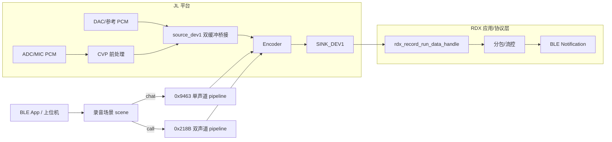
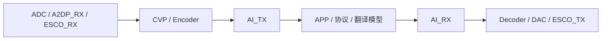
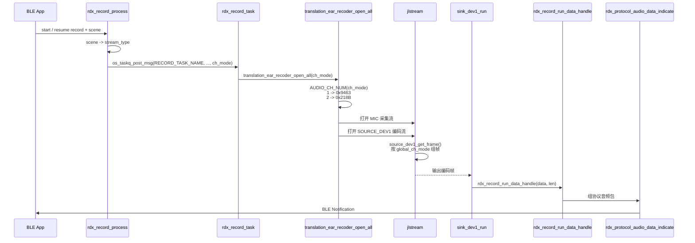
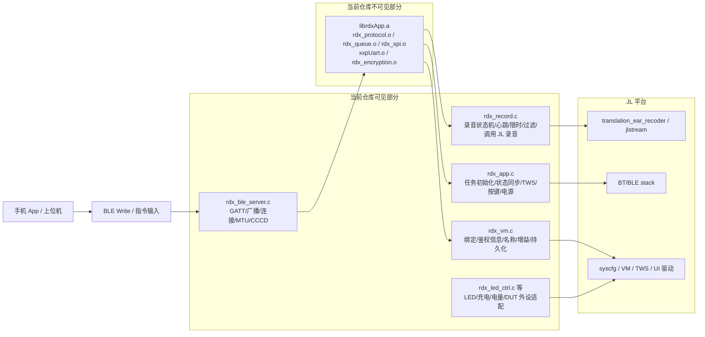

# 开麦录音的全流程分析

> **范围说明**：本文聚焦 JL 平台与 RDX 可见录音链路，覆盖从 `scene / stream_type / pipeline UUID` 选择，到 `SINK_DEV1 -> rdx_record_run_data_handle()` 这一边界为止。不展开更上层业务为什么触发 `start/pause/resume/stop`，也不展开 `librdxApp.a` 内部的协议封包状态机。
>
> 当前工程根目录 `src/音频流程/` 实际保留了对应的 `.x6flow` 流程配置文件，`project.jlproj:123-132` 也显式引用了“翻译耳机_立体声 / 翻译耳机_单声道”两条流程。官方文档通常把它们称作“音频流程 / audio flow”，本文只在需要落到仓库文件名时使用 `.x6flow` 这个扩展名。后文会用这些文件交叉核对流程名、UUID、节点拓扑，以及少量节点配置/布局元数据；但它们不等同于 JL Studio 的完整设计态工程，也不能替代运行时代码对启动条件、参数协商和场景分支的判断。

## 一、先给结论

JL 平台提供的是一套通用音频流框架 `jlstream`，外加一组 source / process / encoder / sink 节点和场景化 recorder 封装。RDX 当前的开麦上传链路不是“单条 ADC 流直达 BLE”，而是“两条 `jlstream` + 一个 `source_dev1` 缓冲桥接”的结构。`SINK_DEV1` 才是 JL 平台把编码帧交给 RDX 的边界；BLE 分包、流控、状态机、心跳、TWS、UI 都属于 RDX 层。

如果把视角再往 JL 原生能力收一层，当前这条“开麦录音”更接近**复用 JL 原生 AI 翻译 / AI 语音上传流程**，而不是另起一套完全独立的录音框架。官方 AI 翻译文档把“录音模式”定义成 `ADC -> AI_TX`，代码里的 `ai_voice_recoder.c` 也正是这样实现；当前 RDX 只是把这个上行出口从 `AI_TX` 换成了 `SINK_DEV1 -> rdx_record_run_data_handle()`，并为了双路输入又增加了一层 `source_dev1` 桥接。



## 二、JL 平台可确认的原生录音能力

### 1. 核心框架：`jlstream`

JL 用 `jlstream` 抽象一切音频处理流程。不管是播放还是录音，都是把多个节点按拓扑连成 pipeline，然后通过统一接口完成配置、启动和释放。

关键 API：

```c
struct jlstream *jlstream_pipeline_parse(u16 pipeline_uuid, u16 source_node_uuid);
int jlstream_node_ioctl(struct jlstream *stream, u16 node_uuid, int cmd, int arg);
int jlstream_start(struct jlstream *stream);
void jlstream_stop(struct jlstream *stream, u16 fade_msec);
void jlstream_release(struct jlstream *stream);
```

当前仓库中能直接确认到的录音 pipeline UUID 只有两条：

| Pipeline | UUID | 说明 |
|----------|------|------|
| `PIPELINE_UUID_TRANSLATION` | `0x218B` | 翻译耳机相关的双声道 pipeline UUID |
| `PIPELINE_UUID_TRANSLATION_MONO` | `0x9463` | 翻译耳机相关的单声道 pipeline UUID |

需要注意的是：当前工程根目录 `src/音频流程/` 实际保留了对应的 `.x6flow` 流程配置文件，且 `project.jlproj:123-132` 显式引用了这两条流程。两份文件在 `src/音频流程/翻译耳机_立体声.x6flow:4` 和 `src/音频流程/翻译耳机_单声道.x6flow:4` 分别写死了 `0x218B` 与 `0x9463`，这又与 `interface/media/framework/include/jlstream.h:102-103` 里的 `PIPELINE_UUID_TRANSLATION` / `PIPELINE_UUID_TRANSLATION_MONO` 宏定义一一对应。因此当前可直接确认的证据链是：**`jlstream.h` 宏定义 -> `.x6flow` 里的 `uuid` 字段 -> `translation_ear_recoder.c` 运行时按 `AUDIO_CH_NUM(enc_type)` 选择对应 pipeline**。本文仍不把 `.x6flow` 单独当作运行时调用链的充分证据，涉及实际启动条件、参数协商和场景分支时，以下分析仍以 `translation_ear_recoder.c`、`rdx_record.c` 等 C 源码为主。

#### 1.1 当前 SDK 仓库可见的 recorder 封装 / 录音流程清单

如果把关注点放回当前 SDK 仓库，本地最直接的入口其实不是某一张流程图，而是 `audio/interface/recoder/` 下面这些 recorder 封装。这里要先把边界写清楚：官方《技术框架》只抽象到“上层是封装好的各种场景下的播放器和录音器集合”这一层；下面列出的 `translation_ear_recoder`、`ai_voice_recoder`、`file_recorder` 等具体名字，来自当前 SDK 仓库 / 方案代码，不应理解成 JL 平台底层统一标准 API 名称。当前代码里能直接确认到的主清单如下：

| recorder 封装 | pipeline 名/入口 | 典型源节点 | 典型输出边界 | `scene` | 主要用途 |
|---------------|------------------|------------|--------------|---------|----------|
| `esco_recoder` | `STREAM_EVENT_GET_PIPELINE_UUID("esco")` | `ADC`，回退可到 `PDM_MIC` / `IIS0_RX` | `NODE_UUID_ESCO_TX` | `STREAM_SCENE_ESCO` | 蓝牙通话上行 |
| `ai_voice_recoder` | `STREAM_EVENT_GET_PIPELINE_UUID("ai_voice")` | `ADC` | `NODE_UUID_AI_TX` | `STREAM_SCENE_AI_VOICE` | AI 语音/翻译类上传 |
| `le_audio_mic_recorder` | `STREAM_EVENT_GET_PIPELINE_UUID("mic_le_audio_call")` | `le_audio_adc` / `ADC` | `NODE_UUID_LE_AUDIO_SOURCE` | `STREAM_SCENE_LEA_CALL` 或 `STREAM_SCENE_MIC` | LE Audio 麦克风上行 |
| `pc_mic_recoder` | `STREAM_EVENT_GET_PIPELINE_UUID("pc_mic")` | `ADC` | 由 `pc_mic` pipeline 下游节点决定 | `STREAM_SCENE_PC_MIC` | PC/UAC 麦克风上行 |
| `translation_ear_recoder` | 直接按 `stream_type` 选 `0x9463 / 0x218B` | 双流：`ADC` 采集流 + `SOURCE_DEV1` 编码流 | 采集流落 `SINK_DEV0`，编码流落 `SINK_DEV1` | `STREAM_SCENE_AI_VOICE` | 翻译耳机双流桥接上传 |
| `file_recorder` | 直接传入 `pipeline_uuid + snode_uuid` | 调用方自定 | 编码输出文件 | `STREAM_SCENE_RECODER` | 通用文件录音封装 |
| `dev_flow_recoder` | `STREAM_EVENT_GET_PIPELINE_UUID("dev_flow")` | 默认示例是 `ADC` | 自定义流程图下游决定 | `STREAM_SCENE_DEV_FLOW` | 自定义数据流录音/导出 |

如果只想抓住“当前 SDK 里暴露了哪些录音封装”，更合理的分法其实是下面这三类：

1. **当前 SDK 的业务固定型 recorder**：`esco_recoder`、`ai_voice_recoder`、`le_audio_mic_recorder`、`pc_mic_recoder`、`translation_ear_recoder`。这几类都已经绑定了明确的业务场景、scene 和流程入口。
2. **当前 SDK 的通用封装型 recorder**：`file_recorder`、`dev_flow_recoder`。它们不直接代表某个产品功能，而是把“给定 pipeline / source 后如何录制、导出、回调”抽象成通用接口。
3. **当前 RDX 实际使用的只是其中一类**：也就是 `translation_ear_recoder`。它不是 JL 平台原生能力的全部，而是当前项目挑中的一条“翻译耳机双流上传”封装实现。

从这张表也能看出一个很重要的边界：当前 SDK 暴露给应用层的并不是“一条统一录音主链”，而是一组按场景封装好的 recorder。它们共同复用 `jlstream`、CVP、编码器、source/sink 节点，但每条 recorder 的 source、sink、scene、IRQ 点数和参考路配置都可能不同。

再和官方文档对照一下，这个分类也和文档结构基本一致：

- 《蓝牙通话流程》对应 `esco_recoder` 这类通话上行 recorder
- 《AI翻译》对应 `ai_voice_recoder` 这类 `ADC -> AI_TX` 上传 recorder
- 《AEC回采方式》解释的是这些 recorder 里 CVP / 参考路配置的共性，而不是某一条 RDX 私有流程

#### 1.2 从 JL 原生角度看：当前录音本质上复用了 AI 翻译上行链

如果只问“当前 RDX 录音最像 JL 原生 SDK 里的哪条能力”，答案其实不是 `esco_recoder`，而是 **AI 翻译 / AI 语音上传链**。

先看官方文档给的定义：

1. 《AI翻译》把 `ai_recorder.c` 定义成“AI 翻译录音控制代码，负责采集音频数据、编码成 opus 数据、发送给 APP”。
2. 同一页又把 `ai_voice_recoder.c` 定义成“智能语音页面，录音数据流（`ADC -> AI_TX`）流程”。
3. 在“录音模式 / 录音翻译模式配置”小节里，官方明确写了：**录音模式仅用到 `ADC -> AI_TX` 流；录音翻译模式则在此基础上再加 `AI_RX -> DAC` 回放流。**

再看当前 SDK 代码对这条原生能力的实现：

- `ai_voice_recoder_open()` 通过 `STREAM_EVENT_GET_PIPELINE_UUID("ai_voice")` 取流程，随后 `jlstream_pipeline_parse(uuid, NODE_UUID_ADC)` 从 ADC 打开流。
- 它把编码参数交给 `NODE_UUID_ENCODER`，把输出格式交给 `NODE_UUID_AI_TX`，再把 `scene` 设成 `STREAM_SCENE_AI_VOICE`。
- 也就是说，JL 原生 AI 语音录音的标准抽象就是：**ADC 采集 + CVP/编码 + AI_TX 上行**。

当前 RDX 录音和它的关系，可以收敛成下面这张对照表：

| 维度 | JL 原生 AI 翻译/AI 语音 | 当前 RDX 录音 |
|------|--------------------------|---------------|
| 录音控制入口 | `ai_recorder.c` / `ai_voice_recoder.c` | `rdx_record.c` |
| recorder 封装 | `ai_voice_recoder_open()` | `translation_ear_recoder_open_all()` |
| 采集起点 | `ADC` | `ADC` |
| 场景标记 | `STREAM_SCENE_AI_VOICE` | `STREAM_SCENE_AI_VOICE` |
| 上行出口 | `AI_TX` | `SINK_DEV1 -> rdx_record_run_data_handle()` |
| 参考路/桥接 | 官方能力里有 AI 翻译、通话、AEC 共用的参考路思想 | 当前项目额外引入 `source_dev1`，把 MIC / DAC 双路桥接后再编码 |
| 协议层 | 官方 AI 翻译协议 / RCSP | RDX 自己的协议层 |

所以，从平台抽象看，当前 RDX 并不是“绕过 JL 原生能力，自己重新写了一套录音框架”，而是：

1. 复用了 JL 原生已经存在的 `AI_VOICE` 场景和录音上传思路。
2. 把原生 `AI_TX` 发送边界替换成了项目自己的 `SINK_DEV1` 边界。
3. 又在采集侧补了一层 `source_dev1` 双缓冲桥接，以适配当前 chat / call 的单双声道需求。

换句话说，**RDX 当前的开麦录音，本质上是“JL 原生 AI 翻译上行链的一个定制变体”**。真正属于 RDX 自己新增的，不是“ADC 采集、CVP、编码、scene 管理”这套基础能力，而是：

- `translation_ear_recoder` 这层双流桥接封装
- `SINK_DEV1 -> rdx_record_run_data_handle()` 这个上传出口
- 录音状态机、首 10 帧过滤、心跳、BLE ready 判断等业务策略

这里还可以把 `apps/common/third_party_profile/rdx_protocol/rdx_app_config.h` 里的固件名 `rdxos_ble_ai_recorder` 当成一个旁证：项目命名本身也沿用了 `ai_recorder` 这套口径。但这只能算旁证，真正的主判断仍然来自上面的流程对照和 recorder 实现。

#### 1.3 完整对照图：从流程图到 recorder、节点、协议出口

如果把“JL 原生 AI 翻译链”和“当前 RDX 录音链”都按同一层次拆开，可以整理成下面这张完整对照图：

```mermaid
flowchart LR
  subgraph NATIVE[JL 原生 AI 翻译 / AI 语音上行链]
    N1[官方流程图/智能语音页面<br/>录音模式: ADC -&gt; AI_TX<br/>证据来自官方文档]
    N2[recorder 封装<br/>ai_recorder.c / ai_voice_recoder.c]
    N3[jlstream 打流<br/>source = ADC<br/>scene = AI_VOICE]
    N4[NODE_UUID_ENCODER<br/>OPUS/SPEEX 编码]
    N5[NODE_UUID_AI_TX]
    N6[ai_tx_node.c<br/>rec_enc_output() 声明与调用点]
    N7[AI translator / RCSP 协议出口<br/>具体实现当前工作区不可见]
    N1 --> N2 --> N3 --> N4 --> N5 --> N6 --> N7
  end

  subgraph RDX[当前 RDX 开麦录音链]
    R1[本地流程图<br/>翻译耳机_单声道.x6flow / 翻译耳机_立体声.x6flow]
    R2[业务入口<br/>rdx_record.c<br/>translation_ear_recoder_open_all()]
    R3[流 0: MIC 采集流<br/>ADC -&gt; CVP -&gt; SINK_DEV0<br/>scene = AI_VOICE]
    R4[source_dev1 双缓冲桥接<br/>idx0 = MIC<br/>idx1 = DAC/ref]
    R5[流 1: 编码上传流<br/>SOURCE_DEV1 -&gt; ENCODER -&gt; SINK_DEV1]
    R6[sink_dev1_node.c<br/>rdx_record_run_data_handle(frame)]
    R7[rdx_protocol_audio_data_indicate()<br/>之后进入 RDX 协议黑盒]
    R1 --> R2 --> R3 --> R4 --> R5 --> R6 --> R7
  end

  N2 -. 复用 AI_VOICE 场景与 recorder 思路 .-> R2
  N5 -. 把原生 AI_TX 上行出口替换成项目自定义出口 .-> R5
  N3 -. 复用 ADC/CVP/编码 这一层平台能力 .-> R3
```

这张图里有两个边界需要明确写出来：

1. **左边的“流程图”证据来自官方文档，不来自当前工程根目录。** 这次检查过 `src/音频流程/`，当前本地只保留了 `翻译耳机_单声道.x6flow`、`翻译耳机_立体声.x6flow` 等流程，没有保留 AI 翻译页面对应的 `.x6flow` 文件。因此左边这条链的“流程图”层，证据来源是官方 SDK 文档的《AI翻译》章节，而不是当前项目里的本地流程文件。
2. **两边的“协议出口可见性”不一样。** `AI_TX` 后面的 `rec_enc_output()` 在当前工作区能直接看到 `ai_tx_node.c` 里的外部声明和调用点，但具体实现仍不可见；RDX 这一侧则能继续看到 `SINK_DEV1 -> rdx_record_run_data_handle() -> rdx_protocol_audio_data_indicate()`，直到再往后进入 RDX 静态库黑盒。

为了避免把这张图画成“概念对照”，下面把每一层的直接代码证据也列出来：

| 层次 | JL 原生 AI 翻译链证据 | 当前 RDX 链证据 |
|------|------------------------|-----------------|
| 流程图 | 官方文档《AI翻译》明确写“录音模式仅用到 `ADC -> AI_TX` 流” | 本地 `src/音频流程/翻译耳机_单声道.x6flow` / `翻译耳机_立体声.x6flow` |
| recorder 入口 | `ai_voice_recoder.c:39` 取 `"ai_voice"` pipeline | `rdx_record.c:1049` 调 `translation_ear_recoder_open_all()` |
| 采集起点 | `ai_voice_recoder.c:49` 从 `NODE_UUID_ADC` 打流 | `translation_ear_recoder.c:265-267` 分别从 `NODE_UUID_ADC` 打开 MIC 流、从 `NODE_UUID_SOURCE_DEV1` 打开编码流 |
| scene | `ai_voice_recoder.c:88` 设 `STREAM_SCENE_AI_VOICE` | `translation_ear_recoder.c:164` 同样设 `STREAM_SCENE_AI_VOICE` |
| 上行节点 | `ai_voice_recoder.c:80` 配 `NODE_UUID_AI_TX` | `translation_ear_recoder.c:131` 配 `NODE_UUID_SINK_DEV1` |
| 节点出口 | `ai_tx_node.c:21-32` 把帧交给 `rec_enc_output()` | `sink_dev1_node.c:156-164` 把帧交给 `rdx_record_run_data_handle()` |
| 协议出口 | `rec_enc_output()` 的声明与调用点可见，具体实现当前工作区不可见 | `rdx_record.c:1457-1479` 继续调用 `rdx_protocol_audio_data_indicate()` |

这样拆完之后，当前关系就比较清楚了：**JL 原生 AI 翻译链提供的是“ADC/CVP/编码/AI_VOICE 场景/上传节点”这一整套平台能力；RDX 当前做的是沿用这套上行框架，再把出口和桥接层换成自己的实现。**

#### 1.4 JL 平台 AI 翻译主流程

如果只保留主流程，JL 原生 AI 翻译可以直接理解成一条“设备侧上行 + APP 侧处理 + 设备侧回传”的闭环：



把这张图换成代码调用链，就是下面这几步：

1. 业务层通过 `ai_recorder.c` / `ai_voice_recoder.c` 这类封装启动 `ai_voice` 流。
2. `ai_voice_recoder_open()` 取 `"ai_voice"` pipeline，并从 `NODE_UUID_ADC` 打开 `jlstream`。
3. 中间仍然走 JL 的通用能力：`CVP -> ENCODER`。
4. 上行出口不是某个“翻译算法节点”，而是 `NODE_UUID_AI_TX`。
5. `ai_tx_node.c` 收到编码帧后，调用 `rec_enc_output()` 把数据交给外部协议层。
6. APP / 协议侧完成真正的翻译或转写后，再把编码音频回送给设备侧 `AI_RX`，后面再解码到 `DAC` 或 `ESCO_TX`。

这里最重要的原理只有两句：

- **AI 翻译不等于设备内单点算法。** 当前可见实现里，设备侧负责的是采集、编码、上传、接收、解码、播放；真正的翻译语义在 APP / 协议侧。
- **AI_TX / AI_RX 是边界节点，不是翻译节点。** `AI_TX` 是上传出口，`AI_RX` 是返回音频的接收入口。

官方文档里虽然区分了录音模式、录音翻译模式、音视频翻译模式、通话翻译模式，但从流程角度看，本质上只是“什么音源接到 `AI_TX`、回来的音频落到哪里”这两个开关不同，这里不再展开各模式细节。

#### 1.5 当前录音复用 JL 原生 AI 翻译的调用链

当前 RDX 录音复用的，主要是 JL 原生 AI 翻译的**上行半链**，只是把上行出口换掉了，并且补了一层双流桥接。把两边直接按调用链并排看，最清楚：

**JL 原生 AI 翻译上行调用链**

`ai_voice_recoder_open()`
-> `STREAM_EVENT_GET_PIPELINE_UUID("ai_voice")`
-> `jlstream_pipeline_parse(uuid, NODE_UUID_ADC)`
-> `NODE_UUID_ENCODER`
-> `NODE_UUID_AI_TX`
-> `ai_tx_handle_frame()`
-> `rec_enc_output()`

**当前 RDX 录音调用链**

`rdx_record_task()`
-> `translation_ear_recoder_open_all(msg[2])`
-> `translation_ear_recoder_open(..., NODE_UUID_ADC, ...)`
-> `translation_ear_recoder_open(..., NODE_UUID_SOURCE_DEV1, ...)`
-> `NODE_UUID_SINK_DEV1`
-> `sink_dev1_run()`
-> `rdx_record_run_data_handle()`
-> `rdx_protocol_audio_data_indicate()`

这两条链放在一起看，RDX 复用关系就很直观了：

1. **复用的部分**：`jlstream`、`AI_VOICE` 场景语义、`ADC + CVP + ENCODER` 这一层平台能力。
2. **替换的部分**：把原生 `AI_TX` 上传出口替换成 `SINK_DEV1`。
3. **新增的部分**：用 `source_dev1` 把 MIC / DAC-ref 两路数据桥接起来，再叠加 RDX 自己的录音状态机、过滤和发送策略。

所以，这里最准确的结论是：**当前录音不是完整复用 JL 原生 AI 翻译闭环，而是复用了它的上行框架，并把出口和桥接层改成了当前项目自己的实现。**

#### 1.6 按评审口径收口的三段式说明

如果按评审场景收口，这条链可以直接概括成下面三段：

1. **JL 原生能力**：JL 平台原生已经提供了完整的 AI 音频框架，核心是 `jlstream + recorder/player + AI_TX/AI_RX` 这一套能力。上行主链可以概括成 `ai_voice_recoder_open() -> jlstream_pipeline_parse(...) -> NODE_UUID_ENCODER -> NODE_UUID_AI_TX -> rec_enc_output()`；也就是说，平台原生已经负责了采集、前处理、编码、上传出口，以及回传音频的接收与播放框架。

2. **当前项目复用点**：当前项目没有绕开 JL 平台另起一套录音框架，而是直接复用了 JL 原生 AI 翻译/AI 语音的上行思路。代码入口是 `rdx_record_task() -> translation_ear_recoder_open_all()`，底层仍然沿用 `jlstream`、`STREAM_SCENE_AI_VOICE`、`ADC + CVP + ENCODER` 这一层平台能力。所以从架构上看，当前录音本质上是建立在 JL 原生上行框架之上的。

3. **当前项目定制点**：当前项目的主要定制不在采集和编码层，而在“桥接层 + 上传出口 + 业务策略层”。具体来说，就是把原生 `AI_TX -> rec_enc_output()` 换成 `SINK_DEV1 -> rdx_record_run_data_handle() -> rdx_protocol_audio_data_indicate()`，再增加 `SOURCE_DEV1` 双流桥接，以及录音状态机、首 10 帧过滤、BLE ready 检查等发送策略。因此，当前方案准确地说是“复用 JL 原生 AI 翻译上行能力的定制录音链”，而不是完整照搬 JL 原生 AI 翻译上下行闭环。

### 2. 可直接确认的 source / process / encoder / sink 节点

#### 2.1 Source 节点

| 节点 | UUID | 作用 |
|------|------|------|
| `NODE_UUID_ADC` | `0xD06D` | 硬件 ADC，负责把麦克风模拟信号变成 PCM |
| `NODE_UUID_ESCO_RX` | `0x8458` | eSCO 下行音频输入 |
| `NODE_UUID_SOURCE_DEV1` | `0x8FC5` | 自定义源节点 1，不是硬件采样源，而是“缓冲桥接源” |

其中 `NODE_UUID_SOURCE_DEV1` 是当前项目里很关键的一层：`effect_dev1` / `effect_dev3` 会把 PCM 写入 `source_dev1_input_write()`，编码流再从 `source_dev1_get_frame()` 取数。也就是说，它更像“内部 PCM 汇聚缓冲区”，不是一个物理外设。

这里再补一个边界：`effect_dev1` / `effect_dev3` 之所以在本文里很重要，是因为当前 `translation_ear_recoder` 路径正好借它们把 PCM 桥接进 `SOURCE_DEV1`。但这两个名字属于当前 SDK 节点实现 / recorder 封装层，不是官方文档单独列出的平台标准节点名。官方文档覆盖的是“存在 source / process / sink 和参考路设计”这一层，不直接承诺这两个桥接点的命名和实现。

ADC 的中断点数在当前工程里至少能看到两种配置：

- `translation_ear_recoder` 的 MIC 采集流把 `NODE_UUID_SOURCE` 配成 `256` 点
- `ai_voice_recoder` 把 `NODE_UUID_SOURCE` 配成 `320` 点

### 2.2 CVP / DMS 语音处理节点

JL 平台提供了较完整的语音前处理节点集合，典型节点如下：

| 类型 | 节点 | UUID | 说明 |
|------|------|------|------|
| 单麦 | `NODE_UUID_CVP_SMS_ANS` | `0xD0BC` | 单麦 ANS |
| 单麦 | `NODE_UUID_CVP_SMS_DNS` | `0xDBF5` | 单麦 DNS |
| 双麦 | `NODE_UUID_CVP_DMS_ANS` | `0x2115` | 双麦 ANS |
| 双麦 | `NODE_UUID_CVP_DMS_DNS` | `0x420E` | 双麦 DNS |
| 双麦 | `NODE_UUID_CVP_DMS_FLEXIBLE_ANS` | `0x90F9` | 灵活双麦 ANS |
| 双麦 | `NODE_UUID_CVP_DMS_FLEXIBLE_DNS` | `0x68F2` | 灵活双麦 DNS |
| 三麦 | `NODE_UUID_CVP_3MIC` | `0x0048` | 三麦方案 |
| 开发 | `NODE_UUID_CVP_DEVELOP` | `0x76EF` | 第三方/开放开发节点 |

这些节点并不是同时启用，而是通过 `get_cvp_node_uuid()` 按板级配置选择。当前板级配置 `apps/earphone/board/br28/jlstream_node_cfg.h:35` 使能了 `TCFG_AUDIO_CVP_3MIC_MODE = 1`，因此当前项目实际会选中 `NODE_UUID_CVP_3MIC`。不过 `audio/CVP/audio_cvp.c:953-978` 也能直接看到，这个函数同时支持 SMS、DMS、3MIC、DEVELOP 等多种分支；换板级配置后，这里不一定仍然落到 `NODE_UUID_CVP_3MIC`。

需要补一个范围说明：上表只列出当前仓库 `get_cvp_node_uuid()` 可直接枚举到的节点分支，不是官方 CVP 能力全集。官方文档 `SDK/audio_cvp/index.html` 和 `SDK/audio_cvp/cvp_algorithm_list.html` 还覆盖了 1MIC、2MIC hybrid、3MIC、CVP-V3、第三方 CVP 等更丰富的算法族；本文只把当前板级配置和当前源码可见项写成事实。

同样地，官方 `SDK/audio_cvp/cvp_2mic_manual.html`、`SDK/audio_cvp/cvp_2mic_hybrid_manual.html`、`SDK/audio_cvp/cvp_3mic_manual.html` 还覆盖了 WNC / JLSP WNC 风噪检测模块，以及 `DMS_GLOBAL_V100` / `DMS_GLOBAL_V200` 这类版本差异。本文没有从当前录音上传链源码继续追到这些风噪分支是否启用，因此只把它们保留在“平台能力边界”层面，不写成当前链路事实。

### 2.3 Encoder 节点 `NODE_UUID_ENCODER`

JL 提供统一的编码器插拔框架，参数结构如下：

```c
struct encoder_fmt {
  u8  quality;
  u8  complexity;
  u8  sw_hw_option;
  u8  ch_num;
  u8  format;
  u8  bit_width;
  u16 frame_dms;
  u32 bit_rate;
  u32 sample_rate;
};
```

在当前仓库里，以下编码能力是可以直接从头文件、静态库或调用点确认的：

| 编码能力 | 入口/证据 | 备注 |
|----------|-----------|------|
| OPUS | `get_opus_enc_ops()` | 单声道 OPUS，`translation_ear_recoder` / `ai_voice_recoder` 都会走到这类配置 |
| OPUS_ST | `get_opus_stenc_ops()` | 双声道 OPUS，和翻译耳机相关场景关系更紧密 |
| SPEEX | `get_speex_enc_obj()` | 接口存在，`translation_ear_recoder` 里也保留了 `AUDIO_CODING_SPEEX` 分支 |
| LC3 | `lib_lc3_codec.a` / `lc3_codec_api.h` | 仓库里能看到库和接口 |
| LDAC | `lib_ldac_enc.a` | 仓库里能看到编码库 |
| MP3 / ADPCM | demo 级入口 | 更偏文件类编码，不在当前 RDX 上传主链路中 |

这里再补一个边界：官方 `SDK/audio_config/codec/encoder_node.html` 作为通用编码器文档，主要列的是 MP3、OPUS、AMR、SPEEX、WAV、LC3、JLA 这类平台标准能力；上表则是**当前仓库里能直接从代码、头文件或静态库确认到的编码入口**，因此会出现 `OPUS_ST`、`LDAC`、`ADPCM` 这类项目 / 仓库可见项，也可能不完整覆盖官方文档中的所有通用格式。这里两张表的口径不同，本文以上表为“当前仓库可证据化”的范围。

对 OPUS 来说，当前代码可确认的封装模式包括：

| mode | 含义 |
|------|------|
| `0` | 无头 raw |
| `1` | eng + range 或 size + range 兼容模式 |
| `2` | OGG |
| `3` | size + rangeFinal 兼容模式 |

当前 RDX 链路使用的是 16kHz OPUS，最终输出到 `SINK_DEV1`。

### 2.4 Sink 节点

| 节点 | UUID | 作用 |
|------|------|------|
| `NODE_UUID_SINK_DEV0` | `0xB328` | 自定义输出 0，当前 MIC 采集流会配置它 |
| `NODE_UUID_SINK_DEV1` | `0xB329` | 自定义输出 1，当前 RDX 的录音上传边界 |
| `NODE_UUID_AI_TX` | `0xDFDA` | AI 语音上传输出 |
| `NODE_UUID_UART_DUMP` | `0xE76E` | UART dump |
| `NODE_UUID_DAC` | `0xDCCD` | 回放/回环相关输出 |

其中最关键的是 `NODE_UUID_SINK_DEV1`。在当前工程里，`sink_dev1_run()` 收到编码帧后会直接调用 `rdx_record_run_data_handle()`，这就是 JL 平台和 RDX 协议层的接缝。

### 3. 当前 SDK 仓库里的 recorder 场景封装

除了底层 `jlstream` 外，当前 SDK 仓库在 `audio/interface/recoder/` 上又封装了一组面向场景的 recorder。这一层属于 SDK / 方案封装层，不是官方框架文档单独定义的底层标准接口：

| 封装 | 文件 | 作用 |
|------|------|------|
| `translation_ear_recoder` | `audio/interface/recoder/translation_ear_recoder.c` | RDX 当前使用的翻译耳机录音封装 |
| `ai_voice_recoder` | `audio/interface/recoder/ai_voice_recoder.c` | AI 语音上传旧方案 |
| `file_recorder` | `audio/interface/recoder/file_recorder.c` | 录音到文件 |
| `pc_mic_recoder` | `audio/interface/recoder/pc_mic_recoder.c` | USB 麦克风 |
| `esco_recoder` | `audio/interface/recoder/esco_recoder.c` | 通话录音 |
| `le_audio_recorder` | `audio/interface/recoder/le_audio_recorder.c` | LE Audio 录音 |

`file_recorder` 这点很重要：JL 平台本身就提供“编码后写文件”的通用能力，不是所有录音都必须走 RDX 上传链路。它会通过 `jlstream_set_enc_file()` 把编码结果交给文件接口，并且会额外创建音频线程处理落盘。

再和官方文档对照一下，`SDK/audio_config/codec/encoder_node.html` 还单独定义了编码器后的封装器（Mux / Packager）能力，用于录音保存时补文件头。因此“编码 -> 封装 -> 写文件”本身就是平台原生能力的一部分，只是当前 RDX 上传主链不走这条支路。

## 三、RDX 当前录音链路的真实结构

### 1. `translation_ear_recoder` 不是单流，而是双流

`translation_ear_recoder` 内部维护的是 `g_translation_ear_recoder[2]`，注释也写明了：

- `g_translation_ear_recoder[0]`：MIC 采样流
- `g_translation_ear_recoder[1]`：收集数据和编码流

更关键的是，`translation_ear_recoder_open_all()` 当前实现会**同时**打开两条流：

- `translation_ear_recoder_open(MIC, NODE_UUID_ADC, ...)`
- `translation_ear_recoder_open(DAC, NODE_UUID_SOURCE_DEV1, ...)`

也就是说，当前代码不是“按模式只开某一条流”，而是“总是开两条流，再由 `global_ch_mode` 和 `source_dev1_get_idx_enable()` 决定哪一路数据真正参与编码”。

```mermaid
flowchart TB
  subgraph S0[流 0：采集 / 前处理流]
    OPEN0[open MIC stream] --> ADC[NODE_UUID_ADC]
    ADC --> CVP[get_cvp_node_uuid<br/>当前板级为 NODE_UUID_CVP_3MIC]
    CVP --> MICBRIDGE[effect_dev3 -> source_dev1_input_write(0)]
  end

  subgraph S1[流 1：编码 / 输出流]
    OPEN1[open encode stream] --> SEL{scene / stream_type}
    SEL -->|chat -> MIC_TO_MONO_OPUS<br/>AUDIO_CH_NUM=1<br/>uuid=0x9463| SRC1[NODE_UUID_SOURCE_DEV1]
    SEL -->|call -> MIC_DAC_TO_STERO_OPUS<br/>AUDIO_CH_NUM=2<br/>uuid=0x218B| SRC1
    SRC1 --> PACK[source_dev1_get_frame<br/>按 global_ch_mode 组帧<br/>LR 下只硬性依赖 idx0，idx1 不足时补 0]
    PACK --> ENC[NODE_UUID_ENCODER / OPUS]
    ENC --> SINK1[NODE_UUID_SINK_DEV1]
  end

  DACPCM[DAC/参考 PCM] --> DACBRIDGE[effect_dev1 -> source_dev1_input_write(1)]
  MICBRIDGE --> SRC1
  DACBRIDGE --> SRC1
  SINK1 --> RDXIN[rdx_record_run_data_handle]
```

上图里有两个需要特别说明的点：

1. `effect_dev3` 到 `SOURCE_DEV1` 左缓冲的桥接可以直接在 `audio/framework/nodes/effect_dev3_node.c:99-127` 看到，最终落到 `source_dev1_input_write(0, data, data_len)`；`effect_dev1` 到右缓冲的桥接可以在 `audio/framework/nodes/effect_dev1_node.c:122-165` 看到，最终落到 `source_dev1_input_write(1, data, data_len)`。编码流从 `audio/framework/plugs/source/source_dev1_file.c:300-318` 的 `source_dev1_get_frame()` 取数。
2. `.x6flow` 文件可以用来交叉核对节点拓扑与 UUID，但“哪条流在什么场景下被启动、参数如何协商、哪些分支会被执行”仍要以 `translation_ear_recoder.c` 和 `rdx_record.c` 这类运行时代码为准。因此“双流 + source_dev1 汇聚 + SINK_DEV1 出口”这一层是可以被代码直接证明的；至于某些节点在不同板型下是否真的参与，则要继续结合编译开关和运行时分支判断。
3. 图里的 `DACBRIDGE --> SRC1` 表示“存在可写入的右路桥接路径”，不等于每 `1` 帧都必然带有 `idx1` 的有效 PCM；在当前实现里，LR 组帧只硬性依赖 `idx0`。

### 2. 模式切换与当前编译配置

先明确一个比 `global_ch_mode` 更底层的选择点：真正决定使用哪条录音 pipeline 的，不是 `formate` 字段，也不是某个隐藏配置，而是 `translation_ear_recoder_open()` 对 `stream_type` 高 4 位声道数的判断：

```c
if (AUDIO_CH_NUM(enc_type) == 2) {
  uuid = PIPELINE_UUID_TRANSLATION;
}
if (AUDIO_CH_NUM(enc_type) == 1) {
  uuid = PIPELINE_UUID_TRANSLATION_MONO;
}
```

而 `stream_type` 本身又是 RDX 在 start / resume 时根据 `record_status.scene` 选择的，所以当前代码里实际生效的“场景 → stream_type → pipeline UUID”关系可以收敛成下表：

| 场景 | `stream_type` | 高 4 位声道数 | Pipeline UUID | 能直接确认的含义 |
|------|---------------|---------------|---------------|------------------|
| `chat` | `MIC_TO_MONO_OPUS` | `1` | `0x9463` | 翻译耳机相关的单声道 pipeline |
| `call` | `MIC_DAC_TO_STERO_OPUS` | `2` | `0x218B` | 翻译耳机相关的双声道 pipeline |

换句话说，**两个录音流程都会用到，只是按场景选择**。这里已经可以把 `翻译耳机_立体声` / `translation_ear` 和 `翻译耳机_单声道` / `translation_ear_mono` 作为工程内事实写出；但涉及运行时到底走哪条分支，仍要以 `rdx_record.c:891-894, 921-924` 和 `translation_ear_recoder.c:80-85` 这类 C 源码为主。

当前工程里 `translation_ear_recoder_open_all()` 支持的模式主要有：

其中，`chat / call` 到 `stream_type` 的映射见 `apps/common/third_party_profile/rdx_protocol/rdx_record.c:891-894, 921-924`，而 `stream_type` 高 4 位到 pipeline UUID 的映射见 `audio/interface/recoder/translation_ear_recoder.c:80-85`。

| 模式 | 语义 | 当前实现里的关键点 |
|------|------|-------------------|
| `MIC_TO_MONO_OPUS` | 单声道上传 | 在当前编译配置 `RDX_SUPPORT_ALGORITHM = 1` 下，会把 `global_ch_mode` 设成 `AUDIO_CH_LR` |
| `DAC_TO_MONO_OPUS` | DAC/参考路单声道上传 | `global_ch_mode = AUDIO_CH_R` |
| `MIC_TO_STERO_OPUS` | MIC 相关立体声模式 | `global_ch_mode = AUDIO_CH_L` |
| `DAC_TO_STERO_OPUS` | DAC 相关立体声模式 | `global_ch_mode = AUDIO_CH_R` |
| `MIC_DAC_TO_STERO_OPUS` | MIC + DAC 立体声上传 | `global_ch_mode = AUDIO_CH_LR` |

因此，文档里如果简单写成“chat = 仅 MIC”，在概念上可以理解，但在**当前编译产物**上并不够精确。更准确的说法应该是：chat 场景最终走 `MIC_TO_MONO_OPUS`，但当前构建会启用 `AUDIO_CH_LR` 的声道策略，不能机械地等同于“只打开 MIC 这一条物理支路”。

为了避免把“场景语义”和“底层声道/桥接实现”混在一起，可以把当前构建下的关键参数直接对照成表：

| 场景 | `rdx_record` 语义 | `translation_ear_recoder_open_all()` 模式 | 当前构建下的 `global_ch_mode` | Pipeline UUID | 编码输出 | 说明 |
|------|-------------------|-------------------------------------------|-------------------------------|---------------|----------|------|
| `chat` | 聊天录音 | `MIC_TO_MONO_OPUS` | `AUDIO_CH_LR` | `0x9463` | 16kHz OPUS mono | 语义上是 chat 单声道上传，但当前构建并不是“只剩 1 条 MIC 物理支路”；编码侧仍按 LR 双输入结构准备数据 |
| `call` | 通话录音 | `MIC_DAC_TO_STERO_OPUS` | `AUDIO_CH_LR` | `0x218B` | 16kHz OPUS stereo | 编码侧按 LR 双输入结构准备数据，`effect_dev3` / `effect_dev1` 都会尝试向 `SOURCE_DEV1` 写入 PCM |

这里还需要补一个边界，避免把“LR 双输入结构”和“每 1 帧都一定有两路有效 PCM”混为一谈：

1. 在 `AUDIO_CH_LR` 模式下，`effect_dev3` 与 `effect_dev1` 确实都具备向 `SOURCE_DEV1` 双缓冲写数的能力。
2. `source_dev1_get_frame()` 在双声道路径下，也确实会尝试从 `idx0` / `idx1` 读取并按 `LLLL...RRRR...` 的形式组帧。
3. 但这条路径只硬性要求 `idx0` 累积到 `1` 帧数据；`idx1` 如果不够，读取会返回 `0`，而输出缓冲在组帧前已经被清零。

因此，当前代码可以确认的是：**编码侧按双路桥接结构准备输入**；但不能把这件事再写成“每 `1` 帧必然同时含有 MIC 和 DAC 两路有效 PCM”。

### 3. 从 App 指令到 BLE 发包的完整调用链



把这条链路拆开以后，可以把责任边界看得很清楚：`sink_dev1_run()` 之前主要是 JL 平台内部的音频流处理，`rdx_record_run_data_handle()` 之后才进入 RDX 协议层。

## 四、JL 平台提供什么，不提供什么

### 1. JL 平台明确提供的能力

- `jlstream` 通用音频流框架
- source / process / encoder / sink 节点体系
- 按板级配置切换的 CVP 前处理节点
- `translation_ear_recoder`、`ai_voice_recoder`、`file_recorder` 等场景封装
- 编码后写文件的通用机制
- 通过 `SINK_DEV1` 把编码帧交给上层协议代码

### 2. 当前项目里属于 RDX 或应用层的能力

- BLE 音频数据分包、MTU 适配和发送流控
- 开始 / 暂停 / 恢复 / 停止状态机
- BLE 连接状态、CCCD、可发送状态判断
- 录音保活心跳
- 最长录音时长限制
- 首 10 帧过滤等业务策略
- TWS 同步和主从切换管控
- LED、提示音、振动等 UI 表现
- chat / call 场景的策略选择和上层状态联动

## 五、RDX 框架到底做了什么

如果只看录音链路，很容易把 RDX 误解成“一个把 OPUS 往 BLE 发出去的协议文件”。但从当前仓库的结构看，RDX 更准确的定义是：

- 一层**可见的集成层源码**，负责把协议需求落到 JL SDK 的录音、BLE、TWS、按键、VM、LED、电源管理上
- 一层**不可见的协议内核库**，负责协议解析、封包、应答、部分传输状态机和加密逻辑

也就是说，RDX 不是单文件，不是纯协议栈，也不是纯业务层，而是“协议内核 + 平台适配层”的组合。



### 1. 当前仓库里“看得见”的部分

这一层的共同特点是：**源码在仓库里，逻辑可以逐行跟**。它们更偏“集成层”和“平台落地层”，不是纯协议核心。

| 模块 | 当前能直接看到它做什么 | 本质角色 |
|------|------------------------|----------|
| `rdx_app.c` | 初始化 RDX 任务、拉起 BLE server、拉起 protocol task、同步通话/播放/录音状态、处理 TWS、按键、开关机、WiFi/EMMC 电源策略 | 总控胶水层 |
| `rdx_record.c` | 维护录音状态机、心跳、超时、首 10 帧过滤、录音任务、MIC 增益、录音 UI/TWS 联动，并调用 `translation_ear_recoder_open_all()` | 录音业务层 |
| `rdx_ble_server.c` | 定义 GATT 表、广播数据、连接参数、MTU/CCCD 状态、`stream_tx_ready` 等 BLE 传输准备条件 | BLE 接入层 |
| `rdx_vm.c` | 绑定状态、鉴权信息、耳机信息、BLE 名称、自动关机时间、MIC 增益等持久化与恢复 | 持久化和设备身份层 |
| `rdx_led_ctrl.c`、`rdx_charge.c`、`rdx_battery.c`、`rdx_key.c`、`rdx_dut.c` | LED 灯效、充电态、电量、按键 remap、工装模式等外设和产品行为 | 外设适配层 |

把这几层合在一起看，RDX 在可见部分里主要承担的是：

1. 把协议命令转换成耳机侧动作。
2. 把耳机侧状态整理后上报给协议层。
3. 把 JL 平台的能力按产品需求编排起来。
4. 把录音、BLE、TWS、UI、VM 这些原本分散的 SDK 能力串成一套产品行为。

### 2. 当前仓库里“看不见”的部分

真正不可见的核心，是 `librdxApp.a`。从当前工程的 map 和 resolution 文件可以确认，它至少包含这些对象：

- `rdx_protocol.o`
- `rdx_queue.o`
- `rdx_spi.o`
- `xxpUart.o`
- `rdx_encryption.o`

这说明 RDX 的黑盒部分不是只封了一点协议文本，而是至少把以下几类东西打包进静态库了：

| 黑盒模块 | 从符号名能推断出的职责 | 为什么说它不可见 |
|----------|------------------------|------------------|
| `rdx_protocol.o` | 协议命令解析、状态上报、ack 组包、录音/电量/绑定/名称/RTC/WiFi 等命令处理 | 仓库里只有 `rdx_protocol.h`，没有对应 `.c` 源文件 |
| `rdx_queue.o` | 协议内部队列与发送缓冲调度 | 只有链接产物，没有源码 |
| `rdx_spi.o` | SPI 侧传输/中断配合 | 当前目录只有头文件，没有 `.c` |
| `xxpUart.o` | UART/WiFi 侧通信桥接 | 当前目录只有头文件，没有 `.c` |
| `rdx_encryption.o` | 算法 key、加密相关处理 | 只有符号名，具体流程不可见 |

换句话说，当前仓库里**看不见的不是“RDX 有没有协议”，而是“协议真正怎么解析、怎么封包、怎么加密、怎么在多传输通道里调度”**。

### 3. 一个很重要的判断：RDX 的“可见层”并不等于“协议层”

很多时候会把 `rdx_record.c`、`rdx_ble_server.c` 误认为就是协议实现本身。实际上它们更多是在给黑盒协议层提供“平台能力”和“产品上下文”。

例如：

- `rdx_record.c` 里可以看到首 10 帧过滤、超时停止、心跳保活、BLE 连接判断、`stream_tx_ready` 检查等业务策略
- 但真正把一帧音频编码成 `*DEV#stream#...` 之类协议数据并发给 APP 的，是 `rdx_protocol_audio_data_indicate()`，这个实现落在黑盒库里
- `rdx_app.c` 会调用 `rdx_protocol_task_create()`、`rdx_protocol_get_version()`
- 但 protocol task 内部如何收命令、如何分发、如何做 ack，并不在可见源码中

所以更准确的说法是：

- **可见层负责“让协议落地”**
- **不可见层负责“协议本身怎么跑”**

### 4. 以“录音”为例看 RDX 的 visible / invisible 分工

在录音场景里，这个边界特别清楚：

#### 可见部分

- `rdx_record_process()` 决定 start / pause / resume / stop 的状态切换
- `rdx_record_task()` 把录音命令交给 `translation_ear_recoder_open_all()`
- `rdx_record_run_data_handle()` 检查连接句柄、CCCD、`stream_tx_ready`、首 10 帧过滤条件
- `rdx_ble_server.c` 维护 BLE 是否就绪、MTU 多大、通知是否开启

#### 不可见部分

- `rdx_protocol_audio_data_indicate()` 如何把音频帧封成协议消息
- 录音状态上报 `rdx_protocol_record_state_indicate()` 如何编码
- 协议 task 如何处理 App 下发的 `*APP#record#...` 命令
- 如果存在校验、加密、分片、重发策略，其细节大多在黑盒库中

因此，录音这件事并不是“RDX 可见源码自己全做完了”，而是：

- 可见源码决定**什么时候录、能不能录、录音时系统怎么配合**
- 黑盒协议决定**录音数据和状态怎么按 RDX 协议发出去**

### 5. 对后续分析最有用的切分方法

后面如果你继续分析 RDX，建议不要按“文件名”切，而要按下面这条边界来切：

#### A. 产品行为层（可见）

- 录音状态机
- BLE 就绪条件
- 按键和场景切换
- TWS 同步
- VM 持久化
- UI / 灯效 / 电机 / 电源管理

#### B. 协议内核层（不可见）

- App 命令解析
- 设备侧协议应答
- 音频流封包
- 传输队列和发送调度
- WiFi / SPI / UART 通道细节
- 算法 key / 加密处理

用这条边界切，后面看问题会更快：

- 如果问题是“录音为什么没启动 / 状态为什么错 / BLE 为什么没 ready / UI 为什么没同步”，优先查可见层
- 如果问题是“协议包格式不对 / 某个 ack 内容不对 / 加密失败 / 黑盒 task 没按预期响应”，就已经进入不可见层

## 六、再用官方 SDK 文档交叉核对

前面的判断主要来自当前工程源码。再对照 JLStudio 标准 TWS 耳机 AC701N 3.0.0 官方 SDK 文档里的《技术框架》《音频流程》《音频流程规范》《蓝牙通话流程》《AEC回采方式》《AI翻译》几个章节后，可以把结论再收紧一层：**官方文档支持本文的总体架构判断，但没有覆盖当前项目的定制节点实现，因此只能作为第二证据链，不能替代源码。**

### 1. 官方文档确认了“流程图 + 音频框架 + 场景化 recorder”这套方法论

《技术框架》明确把音频系统分成三层：底层音效算法、中间层音频框架、上层场景化播放器和录音器集合；应用层通过播放器/录音器 API 开关音频流。这和本文把 `jlstream` 看成底层流程框架、把 `translation_ear_recoder` 看成当前 SDK / 项目里的场景化 recorder 封装的拆分方式是一致的。

### 2. 官方文档确认 `.x6flow` 在 SDK 语义里是“真实流程配置”，不是纯示意图

官方文档通常把这类文件称作“音频流程 / audio flow”。《音频流程规范》明确写了某些节点顺序是固定约束；《蓝牙通话流程》又要求在可视化流程图中选择匹配的清晰语音算法节点，并且 ADC 节点里启用的 MIC 个数必须和算法节点匹配。这说明仓库里的 `.x6flow` 文件在官方语义里确实承载了流程拓扑与配置，不是纯示意图；但本文仍只在需要落到具体文件名时使用 `.x6flow` 这个扩展名。

但这层证据仍然只说明“流程图怎么配置”，不能直接推出“当前工程运行时一定走哪条分支”。场景切换、stream_type 选择、pipeline UUID 选择、recorder 打开顺序，仍然要回到 `rdx_record.c` 和 `translation_ear_recoder.c` 这类运行时代码里确认。

### 3. 官方文档确认参考路 / 回采路是正式设计的一部分

《AEC回采方式》把参考路明确分成两类：

- 软件回采：AEC 参考数据来自数据流 PCM
- 硬件回采：AEC 参考数据来自 ADC 对 Speaker 播放信号的采样

文档还明确写了硬件回采目前最大支持两路。这和本文前面对“录音链路里存在参考路 / 回采路，不能机械地简化成只看 MIC 一路”的判断是一致的。

### 4. 官方文档对“录音上传”也采用“recorder + 发送边界节点”的建模方式

《AI翻译》文档虽然不是当前 RDX 功能本身，但它的建模方式很有参考价值：官方把 `ai_recorder.c` 定义为“录音控制代码，负责采集音频数据、编码成 opus 数据并发送给 APP”，把 `ai_voice_recoder.c` 定义为“ADC -> AI_TX”的录音数据流。

这说明官方对“场景化 recorder + 上传边界节点 + 流程图配置”这套抽象是统一的。RDX 当前项目把上传边界换成 `SINK_DEV1 -> rdx_record_run_data_handle()`，本质上仍属于同一类平台集成思路，只是节点名和协议层实现不同。

### 5. 官方文档没有直接覆盖当前项目的定制细节

这次交叉核对后，也要把边界写清楚。官方文档并没有直接描述当前项目这些细节：

- `translation_ear_recoder.c` 里的 `scene -> stream_type -> pipeline UUID` 选择逻辑
- `effect_dev3` / `effect_dev1` 如何分别写入 `SOURCE_DEV1` 的 `idx0` / `idx1`
- `source_dev1_get_frame()` 在 LR 模式下如何组帧、何时补 0
- `SINK_DEV1` 之后如何进入 RDX 的状态机、封包和发送路径

所以，官方文档能证明的是“这套 SDK 设计上允许并鼓励这样组织录音链路”；而本文真正关于“当前项目现在到底怎么跑”的结论，仍然必须以当前仓库源码为准。

### 6. 官方文档覆盖范围清单

为了避免再把“平台能力”和“项目实现”混在一起，可以把本次实际用到的官方文档覆盖范围收成下面这张表：

| 官方文档 | 能确认的能力范围 | 在本文中的作用 | 当前录音链是否已从源码确认 |
|----------|------------------|----------------|----------------------------|
| `SDK/framework/index.html` | 三层架构、音频框架、播放器/录音器集合 | 证明平台只抽象到框架层和场景封装层 | 是，框架层已确认 |
| `SDK/audio_cvp/index.html` / `SDK/audio_cvp/cvp_algorithm_list.html` | CVP 算法族、mic 形态和调试入口 | 作为 CVP 能力全集的背景边界 | 部分确认，当前板级只直接落到 `NODE_UUID_CVP_3MIC` |
| `SDK/audio_config/codec/encoder_node.html` | 编码器参数、声道、帧长、封装器/Mux | 证明编码参数和“编码 -> 封装 -> 写文件”是平台原生能力 | 编码器已确认，封装器/Mux 不在当前上传主链 |
| `SDK/audio_effects/AGC.html` | AGC 属于平台音效能力的一部分 | 说明官方能力范围比本文当前主链更宽 | 未从当前录音上传链源码确认启用 |
| `SDK/bt/ble/AI翻译.html` | `ai_recorder` / `ai_voice_recoder` / `AI_TX` / `AI_RX` 的上下行模型 | 证明 JL 原生 AI 翻译的主流程与上传边界抽象 | 上行思路已确认，完整上下行闭环未被当前 RDX 全量复用 |

换句话说，官方文档能提供的是“平台能力清单”和“抽象层次边界”；而 `translation_ear_recoder`、`effect_dev1` / `effect_dev3`、`SINK_DEV1 -> rdx_record_run_data_handle()` 这些当前项目独有的实现细节，仍然只能由当前仓库源码来证明。

更广义地说，官方音效 / CVP 文档覆盖范围明显大于本文当前录音主链。像 AGC 这类能力已经能直接在本地官方文档中定位到；其他未从当前录音上传链源码确认启用的附加语音 / 音效能力，本文只把它们保留在“平台能力边界”层面，不把它们写成当前链路事实。

## 七、写这部分文档时应避免的误区

最后总结一下，这类文档后续维护时最容易踩的坑有 3 个：

1. **不要只凭 `.x6flow` 文件就把运行时链路写成既定事实。** 当前工程确实保留了 `.x6flow` 文件，它们适合交叉核对流程名、UUID 和节点拓扑；但涉及实际启动条件、参数协商和场景分支时，仍要回到 C 源码。
2. **不要把 `translation_ear_recoder` 写成单流直通。** 当前代码明确是双流结构，`SOURCE_DEV1` 是汇聚桥接点。
3. **不要把 chat 简化成“仅 MIC”而不加前提。** 在当前构建下，这个说法容易让人误以为编码流只看一条 PCM 输入，和实际代码不完全一致。
