# 建议

1、改蓝牙名

2、改eq（包括开在线调eq）

3、替换anc降噪参数

4、更改提示音

5、各种升级方式了解（无线升级、串口升级）

6、导出软件，校验码打包

7、频偏调试、校验

8、定频软件烧录以及通讯测试

9、串口工具的使用

**备注：优先学习通过配置工具去完成的工作内容，暂时不需要改代码**

# SDK整体介绍

**以AB565XA3芯片为例**

## SDK目录结构

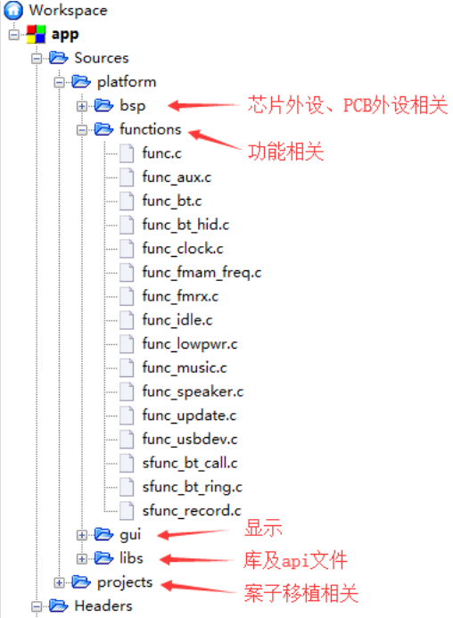

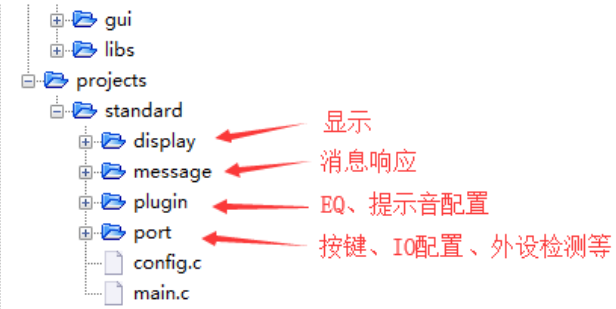

- **Message目录（重要）：主要包括按键消息处理，是蓝牙方案经常需要改动的目录**

## 开发流程


## 新建一个project

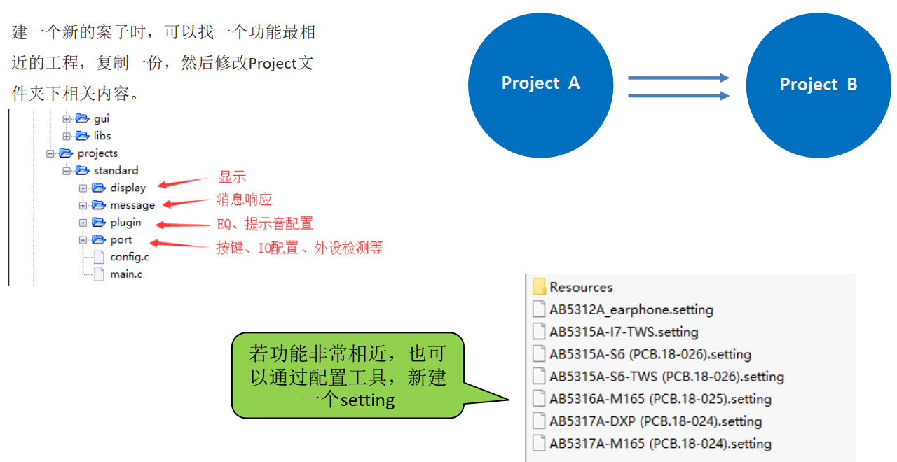

- setting中的配置是通过工具的。
- 相似的功能，需要代码实现的，工程复制在修改。

## 修改配置文件

`projects\earphone\xcfg.h`

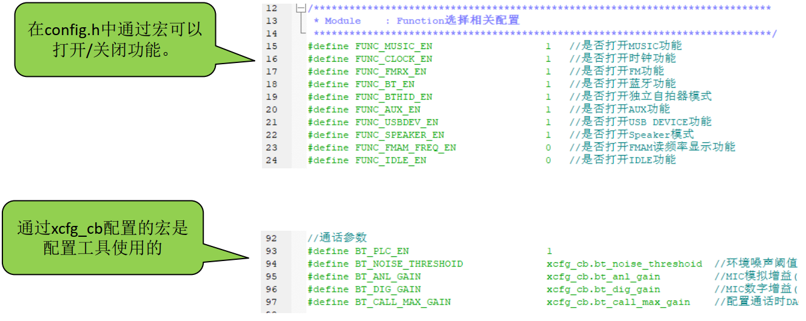

- **配置工具只是用于被程序读取的。**
- **宏是决定代码是否执行的关键，也就是说如果你配置了对应的功能，如果有宏的话，也需要对应打开**

## 修改按键、显示（暂时不懂）

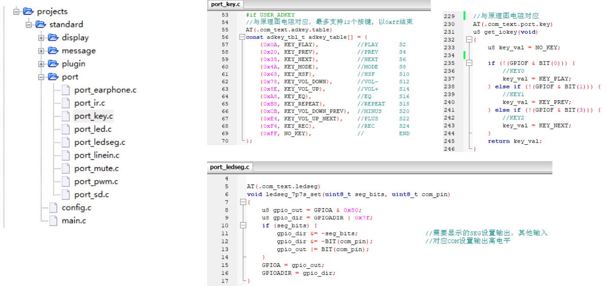

## 替换与新增提示音

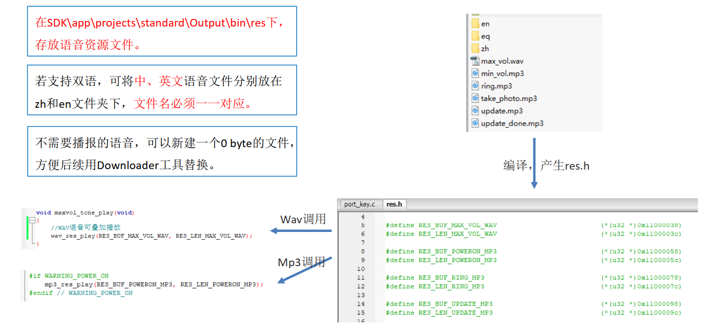

**如果是新建的资源文件夹的话，要跟其他文件夹结构一样**

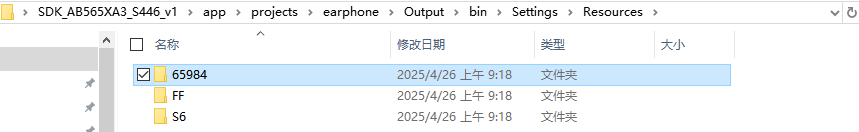

### 替换

默认读取的资源文件位置：

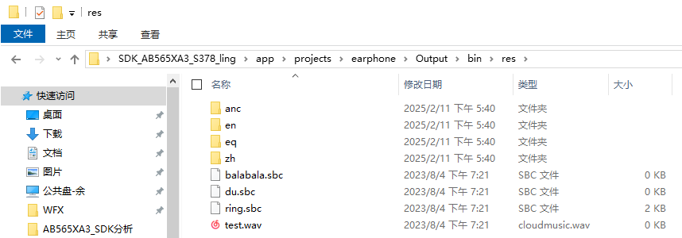

**中英文的提示音以及anc和eq的资源**

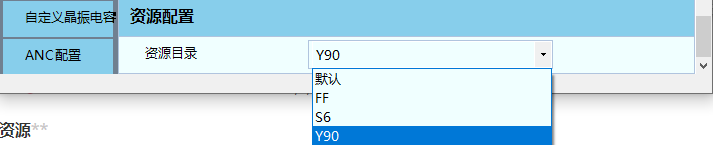

如果需要替换的话，新建一个相同结构文件夹然后去配置工具中选择即可。

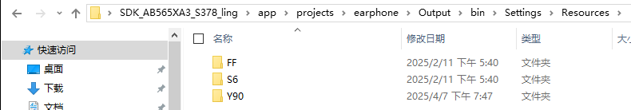

相同命名的sbc会被替换掉，其他还是使用默认的提示音。

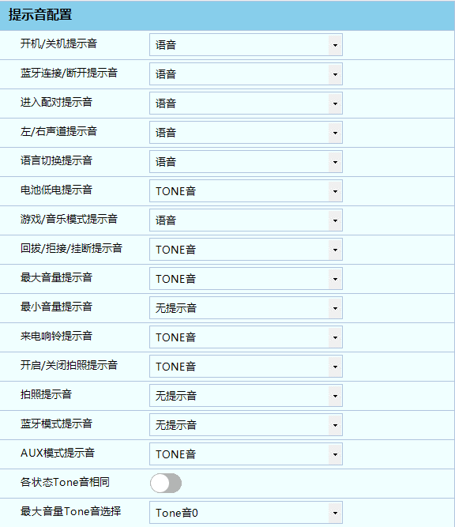

提示音的选择有三种：

- TONE音，电子音
- 语音，有人声的提示音
- 无提示音

#### 问题（未解决）

**同名替换的是TONE音还是语音？**

- 按道理来讲应该是有同一状态下有两种提示音的
- 替换TONE音或者替换语音怎么办？
  - 还是说TONE音是定死的？就是一个声音。
  - 只有语音是导入的？

#### sbc文件的生成

提示音格式：要求转换前应该是wav格式

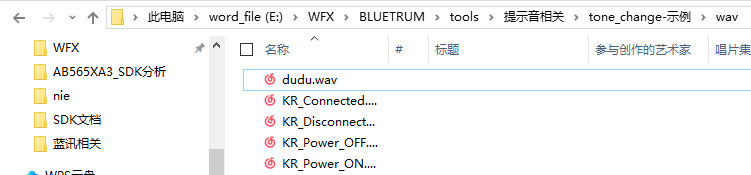

如果不是，需要使用工具转换一下格式，还可以裁剪掉提示音的静默部分，缩小提示音大小


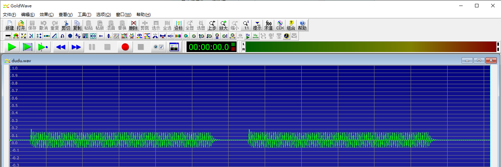

最后使用SBC脚本就可以使用得到SBC文件了，放到对应文件夹即可。

### 新增

之前没有的，属于新增提示音。


增加一个名称为balabala.sbc的提示音，重新编译一下代码就可以在app\projects\earphone\res.h中看到对应的宏定义

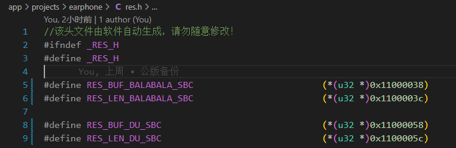

其他定义可以参照下面的音效实现。

app\platform\bsp\bsp_piano.h中定义一种提示音的名称

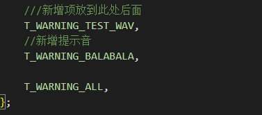

**app\platform\bsp\bsp_warning_play.c绑定对应提示音**

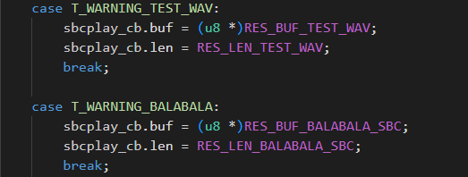

**使用提示音：**

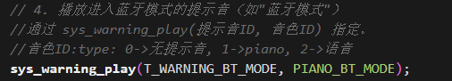

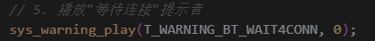

- **后面是提示音的类型，可以在配置工具配置的，会去配置文件中读取。**

- **自己硬编码的应该可以直接指定？**

# SDK代码了解

这是一个基于RISC-V架构处理器的音频设备固件项目，主要包含两个产品方案：

1. ``earphone`` - 耳机方案
2. ``esop8`` - 充电仓方案

项目的主要特点：

- 使用RISC-V架构(rv32imacxbs1)的处理器
- 支持蓝牙功能，包括TWS(真无线立体声)配对
- 包含多种外设支持：
  - LED控制(包括呼吸灯效果)
  - 按键检测
  - 电池管理
  - 音频处理(DAC/EQ等)
  - 充电管理

项目结构：

- ``platform`` - 基础平台代码，包含BSP和通用功能
- ``projects``具体产品方案
  - 每个方案都有自己的配置文件(``config.h``)和插件模块
- 使用CodeBlocks IDE进行开发
- 编译后生成``.rv32``文件，然后通过后处理生成最终的``.bin``和``.dcf``文件

这个SDK看起来主要用于开发蓝牙音频相关的消费电子产品，具有完整的硬件抽象层和功能模块。

### 耳机方案 (Earphone)

这是一个TWS蓝牙耳机的方案，主要特点包括：

- 支持TWS（真无线立体声）功能，可以**实现左右耳机配对使用**
- 支持**蓝牙音乐播放（A2DP）**和**通话（HFP）功能**
- 支持入耳检测功能
- 支持触摸控制（TouchKey）
- 支持充电仓功能
- 支持ANC（主动降噪）功能（可配置）
- 支持语音提示功能
- 支持LED指示灯控制

### 充电仓方案 (ESOP8)

这是一个智能充电仓的方案，主要特点包括：

- 支持**为TWS耳机充电**
- 支持与耳机的通信（通过VUSB_SMART_VBAT_HOUSE_EN功能）
- 支持电池电量检测和管理
- 支持LED指示灯显示充电状态
- 支持按键控制功能

这两个方案是配套使用的，一个用于耳机本身，一个用于充电仓。从配置文件和项目结构来看，这是一个完整的TWS蓝牙耳机解决方案，包含了耳机和充电仓两部分。

耳机方案更加复杂，包含了音频处理、蓝牙连接、触摸控制等多种功能；而充电仓方案相对简单，主要负责为耳机充电和提供基本的状态指示。

两个方案都支持蓝牙功能，**但用途不同：耳机方案的蓝牙主要用于与手机等设备连接以及TWS配对；充电仓方案的蓝牙主要用于与耳机通信，实现智能充电仓功能。**

# 耳机方案

## 启动流程

### 系统初始化阶段

#### 入口点：main函数

`app\projects\earphone\main.c`

```c
int main(void)
{
    printf("Hello AB565XA3: %x\n", LVDCON);
    bsp_sys_init();    // 系统初始化
    func_run();        // 功能运行
    return 0;
}
```

- bsp_sys_init();函数主要包括各种功能的初始化，获取download工具的配置。

- func_run();主要是处理蓝牙消息和硬件的消息。

#### 系统初始化：bsp_sys_init()

```c
void bsp_sys_init(void)
{
    /**
     * @brief 系统初始化函数，是整个耳机SDK的核心初始化入口
     *
     * 该函数完成所有硬件和软件模块的初始化工作，包括配置、IO、变量、电源、时钟、外设等
     * 初始化完成后，会根据配置决定进入哪种功能模式（默认为蓝牙模式）
     */

    /// 1. 配置初始化
    bsp_xcfg_init();                                        // 初始化系统配置，包括电压Trim值、默认配置、蓝牙名称等

    /// 2. IO初始化
    bsp_io_init();                                          // 初始化GPIO端口配置

    /// 3. 变量初始化
    bsp_var_init();                                         // 初始化系统控制块和各种功能模块变量

    /// 4. 电源初始化
    pmu_init(BUCK_MODE_EN*xcfg_cb.buck_mode_en);            // 根据配置初始化电源管理单元，BUCK_MODE_EN默认为1

    /// 5. 时钟初始化
    adpll_init(DAC_OUT_SPR);                                // 初始化音频PLL，要放在pmu_init之后
    sys_clk_set(SYS_CLK_SEL);                               // 设置系统时钟，SYS_CLK_SEL默认为SYS_26M

    /// 6. 外设初始化
    rtc_init();                                             // 初始化实时时钟
#if SYS_PARAM_EEPROM                                        // 默认为0，不启用EEPROM记忆功能
    eeprom_init();                                          // 初始化EEPROM
#endif // SYS_PARAM_EEPROM
    param_init(sys_cb.rtc_first_pwron);                     // 初始化系统参数，包括音量、语言等

#if IODM_TEST_MODE                                          // 默认未启用，工厂测试模式
    iodm_init();
    iodm_reflash_bt_name();
#endif

    sw_reset_flag_get();                                    // 获取软复位标志
    tws_lr_xcfg_sel();                                      // TWS左右声道初始化，放在param_init之后
    plugin_popup_auto_config();                             // 弹窗初始化，放在param_init之后
    x26m_cap_tune();                                        // 26M晶振电容配置

    clkgate_configure();                                    // 配置时钟门控

#if CHARGE_EN                                               // 充电功能使能
    if (xcfg_cb.charge_en) {
        bsp_charge_init();                                  // 初始化充电模块
    }
#endif // CHARGE_EN

#if SYS_SUPPORT_DONGLE_EN                                   // 默认为0，不支持加密狗
    dongle_check_key();
#endif

#if LINEIN_2_PWRDOWN_EN                                     // 默认为0，关闭插入Linein后直接软关机（大耳包功能）
    if (sys_cb.sleep_dac_en) {
        dac_power_off_pulldown_daclr();                     // DAC关闭时下拉DACLR
    }
#endif

    led_init();                                             // 初始化LED
    key_init();                                             // 初始化按键

#if LED_188LED_DISP_EN                                      // 默认未启用，188LED显示功能
    bsp_188led_gpio_init();
    bsp_188led_var_init();
#endif

#if PWM_RGB_EN                                              // 默认为0，不启用PWM RGB三色灯功能
    pwm_init();
#endif // PWM_RGB_EN
    plugin_init();                                          // 初始化插件

    /// 7. 启用用户定时器
    user_tmr_set_enable(1, 1);                              // 启用5ms和1ms定时器，用于显示和DAC

    led_power_up();                                         // 开机LED指示
    motor_enable(MOTOR_PWRON, T_MOTOR_PWRON_SEL);           // 开机马达振动

#if BT_LIGHTNINIG_EN                                        // Lightning接口功能
    if (xcfg_cb.lt_sa_en) {
        lt_uart_tx_auth_start();
        if (xcfg_cb.lt_chg_en) {
            lt_charge_init();                               // 初始化Lightning充电
        }
    }
#endif

    /// 8. 蓝牙初始化
    bt_init();                                              // 初始化蓝牙模块
    bt_work_mode_init();                                    // 初始化蓝牙工作模式
    if (!xcfg_cb.bt_init_fast_dis) {                        // 是否蓝牙提前初始化，可以加速回连
        func_bt_init();                                     // 初始化蓝牙功能
    }

    /// 9. 音频初始化
    dac_init();                                             // 初始化DAC
#if VUSB_TBOX_QTEST_EN                                      // 充电盒快速测试功能
    qtest_create_env();
#endif

#if ANC_EN                                                  // 主动降噪功能
    bsp_anc_init();                                         // 初始化ANC
	bsp_anc_set_mode(1);                                    // 设置ANC模式
#endif

    bsp_change_volume(sys_cb.vol);                          // 设置系统音量

#if LINEIN_2_PWRDOWN_EN                                     // 默认为0，关闭插入Linein后直接软关机（大耳包功能）
    if (xcfg_cb.linein_2_pwrdown_en) {
        delay_5ms(60);
        if (device_is_online(DEV_LINEIN)) {                 // 检测到Linein插入
            sys_cb.pwrdwn_tone_en = LINEIN_2_PWRDOWN_TONE_EN; // 是否播放关机提示音
            func_cb.sta = FUNC_PWROFF;                      // 设置为关机模式
            return;
        }
    }
#endif // LINEIN_2_PWRDOWN_EN

#if WARNING_POWER_ON                                        // 开机提示音
    if ((xcfg_cb.bt_outbox_voice_pwron_en) || (!sys_cb.outbox_pwron_flag)) {
        mic_bias_trim_w4_done_do();
        sys_warning_play(T_WARNING_POWER_ON, PIANO_POWER_ON); // 播放开机提示音
    }
    sys_cb.outbox_pwron_flag = 0;
#endif // WARNING_POWER_ON

#if FUNC_AUX_EN                                             // 默认为0，不启用AUX功能
    if ((xcfg_cb.func_aux_en) && (!xcfg_cb.linein_2_pwrdown_en)) {
        if (device_is_online(DEV_LINEIN)) {                 // 检测到Linein插入
            func_cb.sta = FUNC_AUX;                         // 设置为AUX模式
            return;
        }
    }
#endif // FUNC_AUX_EN

    /// 10. 设置默认功能模式
    func_cb.sta = FUNC_BT;                                  // 默认进入蓝牙模式

#if EQ_DBG_IN_UART || EQ_DBG_IN_SPP                         // EQ调试功能
    eq_dbg_init();                                          // 初始化EQ调试
#endif // EQ_DBG_IN_UART

}
```

系统初始化函数`bsp_sys_init()`是整个启动流程的核心，它完成了以下工作：

1. 配置初始化：`bsp_xcfg_init()`

   - 初始化电压Trim值
   - 设置默认配置
   - 更新蓝牙名称

2. IO初始化：`bsp_io_init()`

   - 配置GPIO端口

3. 变量初始化：`bsp_var_init()`

   - 初始化系统控制块`sys_cb`
   - 初始化音量设置
   - 初始化各种功能模块的变量

4. 电源初始化：`pmu_init()`

   - 根据配置初始化电源管理单元

5. 时钟初始化：

   - `adpll_init()`：初始化音频PLL
   - `sys_clk_set()`：设置系统时钟

6. 外设初始化：

   - `rtc_init()`：实时时钟初始化
   - `eeprom_init()`：EEPROM初始化（如果启用）
   - `param_init()`：参数初始化，包括音量、语言等

7. TWS声道初始化：

   `tws_lr_xcfg_sel()`

   - 初始化TWS左右声道配置

8. **充电初始化**：`bsp_charge_init()`（如果启用）

9. LED和按键初始化：

   - `led_init()`
   - `key_init()`

10. 定时器启用：

    `user_tmr_set_enable(1, 1)`

    - 启用5ms和1ms定时器

11. 蓝牙初始化：

    - `bt_init()`：初始化蓝牙核心
    - `bt_work_mode_init()`：初始化蓝牙工作模式
    - `func_bt_init()`：初始化蓝牙功能（如果未禁用快速初始化）

12. **DAC初始化**：`dac_init()`

13. ANC初始化（如果启用）：

    - `bsp_anc_init()`
    - `bsp_anc_set_mode(1)`

14. **音量设置**：`bsp_change_volume(sys_cb.vol)`

15. 开机提示音播放（如果启用）：

    - `sys_warning_play(T_WARNING_POWER_ON, PIANO_POWER_ON)`

16. 设置初始功能模式：

    - 默认设置为蓝牙模式：`func_cb.sta = FUNC_BT`
    - 如果检测到AUX设备在线，则设置为AUX模式（如果启用）

### 功能运行阶段：func_run()

`func_run()`函数是一个无限循环，根据`func_cb.sta`的值来决定执行哪个功能模式：

`app\platform\functions\func.c`

**这一些宏都在config.h中配置。**

```c
void func_run(void)
{
    /**
     * @brief 功能运行函数，是整个耳机SDK的主循环入口
     *
     * 该函数是一个无限循环，根据func_cb.sta的值来决定执行哪个功能模式
     * 默认情况下，系统会进入蓝牙模式(FUNC_BT)
     * 各功能模式通过条件编译宏在config.h中配置是否启用
     */
    printf("%s\n", __func__);

    func_bt_chk_off();                                      // 蓝牙关闭检查
    while (1) {                                             // 无限循环，永不退出
        func_clear();                                       // 清除功能状态，同步参数，重置睡眠延时等

        // 根据func_cb.sta的值切换到不同的功能模式
        // 进入模式的两个要素：在config.h中进行了宏定义使能，第二个是func_cb.sta的值要是对应的功能才行。
        switch (func_cb.sta) {
#if FUNC_BT_EN 
        //蓝牙宏启用的前提下,默认为1，启用蓝牙功能
        //func_cb.sta的值要是FUNC_BT（枚举值），才会进入蓝牙模式
        //这是状态机轮询模型，蓝牙模式一直保持进入
        //只有内部的小状态机退出时，才会退到大状态机进行模式选择
        case FUNC_BT:
            func_bt();                                      // 进入蓝牙模式
            break;
#endif

#if BT_DUT_TEST_EN                                          // 蓝牙DUT测试模式
        case FUNC_BT_DUT:
            func_bt_dut();                                  // 进入蓝牙DUT测试模式
            break;
#endif

#if FUNC_BTHID_EN                                           // 默认为0，不启用蓝牙HID功能（自拍器模式）
        case FUNC_BTHID:
            func_bthid();                                   // 进入蓝牙HID模式
            break;
#endif // FUNC_BTHID_EN

#if FUNC_AUX_EN                                             // 默认为0，不启用AUX功能
        case FUNC_AUX:
            func_aux();                                     // 进入AUX模式（线路输入模式）
            break;
#endif // FUNC_AUX_EN

#if FUNC_SPEAKER_EN                                         // 默认为0，不启用Speaker模式
        case FUNC_SPEAKER:
            func_speaker();                                 // 进入Speaker模式
            break;
#endif // FUNC_SPEAKER_EN

        case FUNC_PWROFF:                                   // 关机模式，不受条件编译控制，始终可用
            func_pwroff(sys_cb.pwrdwn_tone_en);             // 进入关机模式，参数控制是否播放关机提示音
            break;

#if BT_FCC_TEST_EN                                          // 蓝牙FCC测试模式
        case FUNC_BT_FCC:
            func_bt_fcc();                                  // 进入蓝牙FCC测试模式
            break;
#endif // BT_FCC_TEST_EN

        default:                                            // 未知模式或未启用的模式
            func_exit();                                    // 切换到下一个可用的功能模式
            break;
        }
    }
}
```

### 蓝牙功能模式：func_bt()

初始化之后，进入一个FUN函数，蓝牙耳机的FUN函数基本上都在跑func_bt。（**其他应用模式开启需要去config.h中使能，不然就算状态切换到对应模式应用也不会执行**）

- 循环模型的状态机，只要func_cb.sta的状态不变就会一直跑某一个模式。在某个模式中func_cb.sta发生了改变，就会退到大循环中进行模式选择。前提是对应宏使能了，不然没有用。
- 大循环选择一个模式后，蓝牙模式中是一个小循环。除非func_cb.sta 状态改变退出到大循环中进行模式选择，不然一直在模式的小循环中跑。
- 大状态机是事件驱动的，比如切换了状态才会执行一次模式选择
- **小状态机是轮询模型，只要状态不变的话，会一直执行这两个函数。**
- 在程序跑到func_bt();的时候，SDK留给开发者处理的**只有消息处理和电量检测，来电检测等**，蓝牙耳机接收音频信号，解码那些都是屏蔽起来的。

由于默认进入蓝牙模式，`func_bt()`是最常用的功能函数：

```c
void func_bt(void)
{
    printf("%s\n", __func__);

    func_bt_enter();    // 进入蓝牙模式，初始化资源

    while (func_cb.sta == FUNC_BT) {    // 只要状态没变，就一直在这个循环中
        func_bt_process();  // 处理蓝牙相关的周期性任务，来电状态和通话状态会自己处理。让来电和通话状态有完全独立的处理逻辑，不受主循环的干扰，确保这些重要功能的稳定性和响应速度。
        func_bt_message(msg_dequeue());  // 处理蓝牙相关的消息事件
    }

    func_bt_exit(); // 退出蓝牙模式，清理资源
}
```

蓝牙功能模式的处理流程：

1. 进入蓝牙模式：

   `func_bt_enter()`

   - 初始化蓝牙相关变量
   - 启动蓝牙功能
   - 播放蓝牙模式提示音（如果启用）

2. 蓝牙处理循环：

   - `func_bt_process()`：处理蓝牙状态、连接、音频等
   - `func_bt_message(msg_dequeue())`：处理消息队列中的消息

3. 特殊状态处理：

   - 来电处理：`sfunc_bt_ring()`
     - 这里可以配置来电时的按键操作
   - 通话处理：`sfunc_bt_call()`
     - 这里可以配置通话时的按键操作
   - 低电量处理
   - 睡眠处理
     - **这里可以关闭随眠模式的灯效处理，避免灯效因为进入随眠模式而关闭**

4. 退出蓝牙模式：`func_bt_exit()`

   - 清理蓝牙资源
   - 保存状态

### 蓝牙模式循环

`func_bt_process();`

- 包括响铃，通话两种状态的消息处理，他们也有按键消息处理

  - sfunc_bt_ring();

  - sfunc_bt_call();

`func_bt_message`

- 普通蓝牙模式下的消息处理，音乐播放跟普通模式一样
  - **事件的消息只会在三种状态下被处理**
    - **来电状态，通话状态，普通蓝牙状态下**
  - func_bt_message_do

## 消息处理机制

整个系统通过消息队列来处理各种事件：

1. **消息入队**：各种事件（如按键、蓝牙事件等）会生成消息并入队
2. 消息出队和处理：
   - `msg_dequeue()`：从消息队列中取出消息
   - 各功能模式有自己的消息处理函数，如`func_bt_message()`
     - **不同的模式对应的消息事件处理逻辑肯定不一样。**
     - **比如三种状态下都要不同按键处理逻辑。**
3. 常见消息类型：
   - 按键消息（短按、长按、双击等）
   - 蓝牙连接/断开消息
   - 充电状态消息
   - 低电量消息

### 消息处理

二次开发中修改最多的部分就是消息处理这一块，按键消息处理的修改最多。按键消息有长按，短按，双击，三击，四击，五击等等

`app\projects\earphone\message\msg_bt.c`

```c
void func_bt_message_do(u16 msg)
{
    int klu_flag = 0;
    u8 ku_sel = xcfg_cb.user_def_ks_sel;

    switch (msg) {
    case KU_PLAY:
        ku_sel = UDK_PLAY_PAUSE;
    case KU_PLAY_USER_DEF:
    case KU_PLAY_PWR_USER_DEF:
//        key_voice_play(501, 100, 3);                                        //按键音
        if (!bt_nor_is_connected()) {
            //如果蓝牙未连接，则单击PLAY按键手动配对
            //TWS连接则断开重新搜索从耳，没有连接就直接搜索从耳
            //这样设置很让人怀疑当TWS连接后，主耳才会会自动主动广播，让手机蓝牙可见
            bt_tws_pair_mode(3);                                            //单击PLAY按键手动配对
            break;
        }
        //传递一个播放和暂停的按键事件启动对应的处理
        user_def_key_msg(ku_sel);
        break;

    case KL_PLAY_PWR_USER_DEF:
        if (!xcfg_cb.kl_pwrdwn_dis) {
            klu_flag = 1;                                                   //长按抬键的时候呼SIRI
        }
    case KL_PLAY_USER_DEF:
        f_bt.user_kl_flag = 0;
        if (xcfg_cb.user_def_kl_sel == UDK_GAME_SWITCH) {
            //如果配置项中配置的是长按切换游戏模式的话
            klu_flag = 0;
        }
        if (!bt_tws_pair_mode(4)) {                                         //是否长按配对功能
            if (user_def_lkey_tone_is_enable(xcfg_cb.user_def_kl_sel)) {
                sys_warning_play(T_WARNING_NEXT_TRACK, 1);                  //长按“滴”一声
//                tws_res_play(TWS_RES_TONE);                                 //tws同步播放-------》前者只播放单耳？？？
            }
            if (klu_flag) {
                f_bt.user_kl_flag = user_def_func_is_ready(xcfg_cb.user_def_kl_sel);     //长按抬键的时候再处理
            } else {
                //经过一系列判断才处理的
                user_def_key_msg(xcfg_cb.user_def_kl_sel);
            }
        }
        break;

        //SIRI, NEXT, PREV在长按抬键的时候响应,避免关机前切歌或呼SIRI了
        //不然跟长按关机可能会冲突，那么可以推理出长按关机是不松开到达时间就会触发。
    case KLU_PLAY_PWR_USER_DEF:
        if (f_bt.user_kl_flag) {
            user_def_key_msg(xcfg_cb.user_def_kl_sel);
            f_bt.user_kl_flag = 0;
        }
        break;

        //长按调音量
    case KH_PLAY_PWR_USER_DEF:
        if (!xcfg_cb.kl_pwrdwn_dis) {
            break;
        }
    case KH_PLAY_USER_DEF:
        func_message(get_user_def_vol_msg(xcfg_cb.user_def_kl_sel));
        break;

    ///双击按键处理
    case KD_PLAY_USER_DEF:
    case KD_PLAY_PWR_USER_DEF:
        if (xcfg_cb.user_def_kd_tone_en) {
            sys_warning_play(T_WARNING_NEXT_TRACK, 1);                  //2击“滴”一声
        }
        if ((xcfg_cb.user_def_kd_lang_en) && (!bt_nor_is_connected())) {//没有连接手机的情况下才会切换语言
            bt_switch_voice_lang();
        } else if (user_def_key_msg(xcfg_cb.user_def_kd_sel)) {//里面会有校验，估计是需要连接蓝牙才会执行用户自定义的双击操作
#if BT_TWS_EN
        } else if(bt_tws_pair_mode(2)) {
#endif
        }
        break;

    ///三击按键处理
    case KTH_PLAY_USER_DEF:
    case KTH_PLAY_PWR_USER_DEF:
#if BT_ALG_DBB_KEY_EN
        if(bt_alg_dbb_on) {
            bt_alg_dbb_on = 0;
        }else {
            bt_alg_dbb_on = 1;
        }
#else
        if (xcfg_cb.user_def_kt_tone_en) {
            sys_warning_play(T_WARNING_NEXT_TRACK, 1);                  //3击“滴”一声
        }
        user_def_key_msg(xcfg_cb.user_def_kt_sel);
#endif
        break;

    ///四击按键处理
    case KFO_PLAY_USER_DEF:
    case KFO_PLAY_PWR_USER_DEF:
        if (xcfg_cb.user_def_kfour_tone_en) {
            sys_warning_play(T_WARNING_NEXT_TRACK, 1);                  //4击“滴”一声
        }
        user_def_key_msg(xcfg_cb.user_def_kfour_sel);
        if (xcfg_cb.user_def_kfour_clr_pair_en) {                       //四击清配对信息
            if (!bt_nor_is_connected() && !bt_tws_is_connected()) {
                bt_clr_all_link_info('k');
            }
        }
        break;

    ///五击按键处理
    case KFI_PLAY_USER_DEF:
    case KFI_PLAY_PWR_USER_DEF:
        if (xcfg_cb.bb_dut_test_k5s_en && !bt_nor_is_connected()) {
            func_cb.sta = FUNC_BT_DUT;          //五击进DUT测试模式
        } else if (xcfg_cb.user_def_kfive_sel) {
            user_def_key_msg(xcfg_cb.user_def_kfive_sel);
        }
        break;
```

### 消息来源

以按键为例

void msg_enqueue(u16 msg);//消息队列

- 将不同按键事件放入消息队列，等待调用msg_dequeue取出事件根据所处状态做对应的处理。
- 不同的按键事件根据当前的状态走不同的处理逻辑
  - 单击可能在不同状态下有不同的处理逻辑

```c
u8 bsp_key_scan(void)
{
    u8 key_val;
    u16 key = NO_KEY;

    // 扫描按键
    key_val = key_scan();

    // 电池电量检测
#if VBAT_DETECT_EN
    sys_cb.vbat = get_vbat_val();
#endif // VBAT_DETECT_EN

    // 处理按键值
#if USER_TKEY_SHORT_SLIDE
    key = bsp_key_slide_process(key_val);
#else
    key = bsp_key_process(key_val);
#endif

#if USER_TKEY_SLIDE
    key = bsp_tkey_slide_process(key);
#endif
    // 如果有有效按键，将消息放入队列
    if ((key != NO_KEY) && (!bsp_key_pwron_filter(key))) {
        //防止enqueue多次HOLD消息
        if ((key & KEY_TYPE_MASK) == KEY_LONG) {
            sys_cb.kh_vol_msg = (key & 0xff) | KEY_HOLD;
        } else if ((key & KEY_TYPE_MASK) == KEY_LONG_UP) {
            msg_queue_detach(sys_cb.kh_vol_msg, 0);
            sys_cb.kh_vol_msg = NO_KEY;
        } else if (sys_cb.kh_vol_msg == key) {
            // 将按键消息放入队列
            msg_queue_detach(key, 0);
        }
#if WAV_KEY_VOICE_QUICK_EN
        if (key == K_PLAY_PWR_USER_DEF) {
            sys_cb.tws_res_brk = 1;
        }
#endif
#if LED_188LED_DISP_EN
        if (key == K_PLAY_PWR_USER_DEF) {
            bsp_188led_disp_set_on();
        }
#endif
//        printf(key_msg_str, key);
        msg_enqueue(key);
    }
    return key_val;
}
```

- 从消息队列中取出消息事件做对应的处理
- func_bt_message(msg_dequeue());
- 传递到func_bt_message_do(msg);

#### 按键消息的注意事项

下面的宏都是按键消息：

- 以PLAY按键为例

```c
#define K_PLAY                  (KEY_PLAY | KEY_SHORT) //下降沿

#define KU_PLAY                 (KEY_PLAY | KEY_SHORT_UP) //上升沿

#define KL_PLAY                 (KEY_PLAY | KEY_LONG) //长按

#define KLU_PLAY                (KEY_PLAY | KEY_LONG_UP) //长按上升沿

#define KH_PLAY                 (KEY_PLAY | KEY_HOLD) //长按2秒左右

#define KD_PLAY                 (KEY_PLAY | KEY_DOUBLE) //双击

#define KTH_PLAY                (KEY_PLAY | KEY_THREE) //三击

#define KFO_PLAY                (KEY_PLAY | KEY_FOUR) //四击

#define KFI_PLAY                (KEY_PLAY | KEY_FIVE) //五击
```

除了KU_PLAY按键，配置工具中还可以将**按键消息类型**定义为KU_PLAY_USER_DEF，KU_PLAY_PWR_USER_DEF。但是除了个例好像都是指向同一个处理函数，每一种按键操作的类型都可以分为以上三种，**一般三种都指向同一个处理函数，但是从不同分支进来会做一些处理，可以看下面的代码。**

```c
	case KU_PLAY:
        ku_sel = UDK_PLAY_PAUSE;//从这个分支进来的话，会强制绑定功能代码，覆盖读取到的配置
    case KU_PLAY_USER_DEF:
    case KU_PLAY_PWR_USER_DEF:
//        key_voice_play(501, 100, 3);                                        //按键音
        if (!bt_nor_is_connected()) {
            //如果蓝牙未连接，则单击PLAY按键手动配对
            //TWS连接则断开重新搜索从耳，没有连接就直接搜索从耳
            //这样设置很让人怀疑当TWS连接后，主耳才会会自动主动广播，让手机蓝牙可见
            bt_tws_pair_mode(3);                                            //单击PLAY按键手动配对
            break;
        }
        //传递一个播放和暂停的按键事件启动对应的处理
        user_def_key_msg(ku_sel);
        break;
```

以蓝牙模式为例：

程序先在`user_def_key_msg`函数做判断，如果在该函数没有找到一致的case，则会跑到公共的消息处理函数中 void func_message(u16 msg) 再做判断。

```c
//检查USER_DEF按键消息处理
//根据传入的按键类型消息调用对应的处理函数
bool user_def_key_msg(u8 func_sel)
{
    //当功能选择为UDK_SIRI_REDIALING时，会通过get_user_def_lr_msg进行预处理转换。
    if (func_sel == UDK_SIRI_REDIALING) {
        func_sel = get_user_def_lr_msg(UDK_SIRI, UDK_REDIALING);
    }
    
    //猜测：
    //蓝牙状态依赖：多个功能需要蓝牙连接（如SIRI、回拨需要bt_nor_is_connected()）
    //硬件资源依赖：氛围灯功能需要atmos_gpio.sfr硬件存在
    //功能配置依赖：ANC模式切换需要xcfg_cb.anc_en配置启用
    //电源状态保护：通过sys_cb.poweron_flag防止在关机过程中执行操作
    //全局功能开关：通过xcfg_cb.user_def_en控制是否启用用户自定义功能
    if (!user_def_func_is_ready(func_sel)) {
        return false;
    }

    if (func_sel == UDK_REDIALING) {
        bt_call_redial_last_number();                   //回拨电话
        sys_warning_play(T_WARNING_REDIALING, PIANO_REDIALING);
    } else if (func_sel == UDK_SIRI) {                  //SIRI
        bt_siri_switch();
    } else if (func_sel == UDK_NR) {                    //NR
        bt_ctl_nr_sta_change();                         //发消息通知手机

        sys_cb.anc_user_mode++;
        if (sys_cb.anc_user_mode > 2) {
            sys_cb.anc_user_mode = 0;
        }
#if ANC_EN
        bsp_anc_set_mode(sys_cb.anc_user_mode);
#endif
    } else if (func_sel == UDK_PREV) {                  //PREV
        user_def_track_msg(get_user_def_lr_msg(KU_PREV, KU_NEXT));
    } else if (func_sel == UDK_NEXT) {                  //NEXT
        user_def_track_msg(get_user_def_lr_msg(KU_NEXT, KU_PREV));
    } else if (func_sel == UDK_PHOTO) {
        return bsp_bt_hid_photo(HID_KEY_VOL_UP);        //拍照
    } else if (func_sel == UDK_HOME) {
        return bt_hid_consumer(HID_KEY_IOS_HOME);       //IOS Home按键功能
    } else if (func_sel == UDK_LANG) {
        bt_switch_voice_lang();                         //中英文切换
    } else if (func_sel == UDK_ATMOS_LED) {             //氛围灯开/关
        if (atmos_gpio.sfr) {
            if (atmosphere_led_is_on()) {
                tws_res_play(TWS_ATMOS_LED_OFF);
            } else {
                tws_res_play(TWS_ATMOS_LED_ON);
            }
            return true;
        }
        return false;
    } else if (func_sel == UDK_PLAY_PAUSE) {
        return user_def_play_pause_msg();
    } else if (func_sel == UDK_GAME_SWITCH) {
#if BT_LOW_LATENCY_QUICK_FIX
        if (bt_low_latency_is_busy()) {
            return true;
        }
        bt_low_latency_set_busy();
#endif
        if (bt_is_low_latency()) {
            tws_res_play(TWS_RES_MUSIC_MODE);           //提示音播放的地方更新sys_cb.game_mode变量
        } else {
            tws_res_play(TWS_RES_GAME_MODE);
        }
    } else if (func_sel == UDK_MODE) {                  //MODE
        func_message(KU_MODE);
    } else {                                            //VOL+, VOL-
        func_message(get_user_def_vol_msg(func_sel));//公共消息处理
    }
    return true;
}
```

- if-else if-else if-else结构
  - **else if只会执行一个分支**
  - **如果都不符合条件的话，就执行最后的else**

### 应用：1S消息

在定时器中，每隔一秒发送一个消息MSG_SYS_1S

在蓝牙消息或者公共消息做处理，常用的1秒消息处理有报告电量，连接蓝牙自动播放。

- 一般会在实质消息处理前，会先处理空消息和定时消息

```c
AT(.text.bfunc.bt)
void func_bt_message(u16 msg)
{
    if (msg == NO_MSG || msg == MSG_SYS_1S) {       //减少flash缺页
        func_bt_message_m(msg);
        if (msg == MSG_SYS_1S) {
        }
    } else {
        func_bt_message_do(msg);
    }
}
```

### 蓝牙消息函数

三个状态的消息处理，除了一个func_bt_message还有两个，响铃，通话。

- 先判断当前的状态，根据状态进入不同的处理分支。比如响铃的长按和普通模式下的长按处理不一样。配置工具的设置都不一样。

**响铃:void sfunc_bt_ring_message(u16 msg)**

- **来电响铃**的时候执行消息处理，主要包**括接/挂电话，电量报告和按键消息公共处理**。

**通话中:sfunc_bt_call_message();**

- 通话过程的按键消息处理，主要包括**音量调整，三方通话，电量报告**
  - **通话中进来第二路通话就算第三方通话**


**Music: void func_bt_message(u16 msg)**

- 蓝牙音乐模式的消息处理，上下曲切换，暂停播放，音量调整，报告电池电量等
- 这算普通蓝牙模式下的状态（**音乐状态**）

**所以为什么周期消息是单独处理的，不进入那种switch case语句，可能太费时间。**

- 逻辑比较简单，不必要进入那种复杂的逻辑中。

## C语言的特殊宏

- LINE 表示正在编译的文件的行号

- FILE 表示正在编译的文件的名字

- DATE_ 表示编译时刻的日期字符串，例如： “25 Dec 2007”

- TIME 表示编译时刻的时间字符串，例如： “12:30:55”

```c
#include <stdio.h>

int main(void)
{
        printf("%s\r\n",__FILE__);

        printf("%d\r\n",__LINE__);

        printf("%s\r\n",__DATE__);

        printf("%s\r\n",__TIME__);

        return 0;
}

打印结果：
speci_define.c
6
Jul  6 2019
00:46:39
```


# 耳机方案的默认配置

所有的功能宏都在config,h中定义。

## bsp_sys_init() 函数

这是系统初始化函数，是整个耳机SDK的核心初始化入口。它完成了所有硬件和软件模块的初始化工作，包括：

1. **配置初始化**：加载系统配置，包括电压Trim值、默认配置、蓝牙名称等
2. **IO初始化**：配置GPIO端口
3. **变量初始化**：初始化系统控制块和各种功能模块变量
4. **电源初始化**：根据配置初始化电源管理单元
5. **时钟初始化**：设置系统时钟
6. **外设初始化**：初始化RTC、EEPROM等外设
7. **启用用户定时器**：启用5ms和1ms定时器，用于显示和DAC
8. **蓝牙初始化**：初始化蓝牙模块和工作模式
9. **音频初始化**：初始化DAC和音量设置
10. **设置默认功能模式**：默认进入蓝牙模式

## func_run() 函数

这是功能运行函数，是整个耳机SDK的主循环入口。它是一个无限循环，根据`func_cb.sta`的值来决定执行哪个功能模式：

1. **蓝牙模式(FUNC_BT)**：默认启用，是系统的主要工作模式
2. **蓝牙DUT测试模式(FUNC_BT_DUT)**：默认不启用，用于蓝牙测试
3. **蓝牙HID模式(FUNC_BTHID)**：默认不启用，用于自拍器等功能
4. **AUX模式(FUNC_AUX)**：默认不启用，用于线路输入功能
5. **Speaker模式(FUNC_SPEAKER)**：默认不启用
6. **关机模式(FUNC_PWROFF)**：始终可用，不受条件编译控制
7. **蓝牙FCC测试模式(FUNC_BT_FCC)**：默认不启用，用于FCC认证测试

## 默认开启的功能

根据config.h中的配置，默认开启的主要功能有：

1. **蓝牙功能(FUNC_BT_EN = 1)**：系统默认支持蓝牙功能
2. **BUCK模式(BUCK_MODE_EN = 1)**：电源管理使用BUCK模式
3. **EEPROM记忆(SYS_PARAM_EEPROM = 1)**：支持参数保存到EEPROM
4. **RTCRAM参数保存(SYS_PARAM_RTCRAM = 1)**：支持参数保存到RTCRAM
5. **电池电量检测(VBAT_DETECT_EN = 1)**：支持电池电量检测
6. **Linein检测(LINEIN_DETECT_EN = 1)**：支持Linein插入检测
7. **Linein插入关机(LINEIN_2_PWRDOWN_EN = 1)**：插入Linein后直接软关机（大耳包功能）

## 默认进入的模式

系统默认进入**蓝牙模式(FUNC_BT)**。这是在`bsp_sys_init()`函数的最后设置的：

```c
func_cb.sta = FUNC_BT;  // 默认进入蓝牙模式
```

如果检测到特定条件，系统可能会进入其他模式：

1. 如果启用了LINEIN_2_PWRDOWN_EN并检测到Linein插入，会进入关机模式(FUNC_PWROFF)
2. 如果启用了FUNC_AUX_EN并检测到Linein插入，会进入AUX模式(FUNC_AUX)

**进入模式的两个要素：在config.h中进行了宏定义使能，第二个是func_cb.sta的值要是对应的功能才行。**

# 蓝牙模式主循环入口

`func_run()`函数确实是一个基于状态机的轮询模型，它根据`func_cb.sta`的值来决定执行哪个功能模式。**前提是对应的宏被打开。**

## 状态机工作原理

1. 状态机结构：
   - `func_cb.sta`是状态变量，表示当前的功能模式
   - `switch`语句根据这个状态变量切换到不同的功能处理函数
   - 每个功能处理函数（如`func_bt()`、`func_aux()`等）都是一个**子状态机**
2. 默认状态：
   - 在`bsp_sys_init()`函数的最后，默认设置`func_cb.sta = FUNC_BT;`，所以系统启动后默认进入蓝牙模式
   - 这就是为什么您感觉它"一直都是FUNC_BT，一直都进入蓝牙模式"
3. 状态切换：
   - 虽然默认是蓝牙模式，**但`func_cb.sta`的值可以在运行时改变**
     - 比如在**蓝牙模式**下长按进入**关机模式**
   - **状态切换可以由以下几种方式触发：**
     - **用户按键（如按MODE键切换模式）**
     - **外部事件（如插入Linein线）**
     - **系统事件（如低电量自动关机）**
   - **但是其他的模式宏在config.h中没有定义，就算状态改变了也没用。**

## 状态切换示例

### **按键切换模式**

```c
case KU_MODE:
case KU_MODE_PWR:
#if FUNC_AUX_EN || FUNC_SPEAKER_EN || FUNC_MUSIC_EN
    func_cb.sta = FUNC_NULL;  // 设置为NULL，会通过func_exit()切换到下一个模式
#endif
    break;
```

### **插入Linein切换到AUX模式**

```c
case EVT_LINEIN_INSERT:
    if (device_is_online(DEV_LINEIN)) {
        if (xcfg_cb.linein_2_pwrdown_en) {
            sys_cb.pwrdwn_tone_en = LINEIN_2_PWRDOWN_TONE_EN;
            func_cb.sta = FUNC_PWROFF;  // 切换到关机模式
        } else {
            func_cb.sta = FUNC_AUX;     // 切换到AUX模式
        }
    }
    break;
```

### 长按关机事件

```c
case KLH_POWER:
case KLH_MODE_PWR:
case KLH_PLAY_PWR_USER_DEF:
    if (!xcfg_cb.kl_pwrdwn_dis) {
        func_cb.sta = FUNC_PWROFF;
    }
    break;
```

### **耳机入仓关机**

```c
case EVT_CHARGE_INBOX:
    sys_cb.pwrdwn_tone_en = 0;
    sys_cb.inbox_pwrdwn_flag = 1;
    bsp_charge_inbox_wakeup_enable();
    func_cb.sta = FUNC_PWROFF;  // 切换到关机模式
    break;
```

## 蓝牙模式下的子状态机

每个功能模式（如`func_bt()`）本身也是一个子状态机，例如：

```c
void func_bt(void)
{
    printf("%s\n", __func__);

    func_bt_enter();  // 进入蓝牙模式的初始化

    while (func_cb.sta == FUNC_BT) {  // 只要状态没变，就一直在这个循环中
        func_bt_process();  // 处理蓝牙相关的周期性任务
        func_bt_message(msg_dequeue());  // 处理蓝牙相关的消息
    }

    func_bt_exit();  // 退出蓝牙模式的清理工作
}
```

这个子状态机会一直运行，直到`func_cb.sta`的值被改变（比如用户按了MODE键切换模式），然后它会退出循环，执行清理工作，控制权返回到`func_run()`，然后`func_run()`会根据新的`func_cb.sta`值进入另一个功能模式。

## 总结

1. 是的，这是一个典型的状态机轮询模型
2. 默认情况下，`func_cb.sta = FUNC_BT`，所以系统会进入蓝牙模式
3. 但`func_cb.sta`的值可以在运行时改变，触发状态切换
4. **每个功能模式本身也是一个子状态机，处理该模式下的所有事件和任务**

这种设计使得系统可以灵活地在不同功能模式之间切换，同时保持代码的模块化和可维护性。如果您想添加新的功能模式，只需要：

1. 在` config.h`中添加新的功能使能宏
2. 在` func.h`中添加新的功能模式枚举值
3. 实现新的功能处理函数
4. 在`func_run()`中添加对应的case分支

这样就可以无缝地集成到现有的状态机框架中。

# 父子状态机的exit()作用

## 模式选择中的状态机中的`func_exit()`

`func_exit()`函数的主要作用是**在大状态机中切换到下一个可用的功能模式**。

```c
void func_exit(void)
{
    u8 func_num;
    u8 funcs_total = get_funcs_total();

    // 在功能排序表中找到上一个功能的位置
    for (func_num = 0; func_num != funcs_total; func_num++) {
        if (func_cb.last == func_sort_table[func_num]) {
            break;
        }
    }
    func_num++;                                     // 切换到下一个任务
    if (func_num >= funcs_total) {
        func_num = 0;
    }
    func_cb.sta = func_sort_table[func_num];        // 设置新的任务
}
```

这个函数的工作流程是：

1. 在功能排序表`func_sort_table`中找到上一个功能模式的位置
2. 将索引加1，切换到下一个功能模式
3. 如果已经到达表的末尾，则回到表的开始
4. 将新的功能模式设置为当前状态`func_cb.sta`

**当大状态机遇到未知模式或未启用的模式时，会调用这个函数来切换到下一个可用的功能模式，确保系统不会卡在无效状态。**

## 子状态机中的`func_bt_exit()`

`func_bt_exit()`函数的主要作用是**在退出蓝牙模式时进行清理工作**。

```c
void func_bt_exit(void)
{
    bt_ring_tone_stop(1);                // 停止蓝牙铃声
#if DAC_DNR_EN
    dac_dnr_set_sta(0);                  // 关闭DAC动态降噪
#endif
    bsp_change_volume(sys_cb.vol);       // 恢复系统音量
#if BT_PWRKEY_5S_DISCOVER_EN
    bsp_bt_pwrkey5s_clr();               // 清除长按电源键5秒进入配对模式的标志
#endif
    tws_res_reset();                     // 重置TWS资源
    dis_auto_pwroff();                   // 禁用自动关机
    ble_popup_ctrl(0);                   // 关闭BLE弹窗控制
    bt_disconnect();                     // 断开蓝牙连接

    dac_fade_out();                      // DAC淡出
    bt_audio_bypass();                   // 蓝牙音频旁路
    bt_off();                            // 关闭蓝牙
#if LED_BREATHE_EN
    if (sys_cb.breathe_led_sta >= T_BRE_TWS_CON) {
        breathe_led_stop();              // 停止LED呼吸灯
    }
#endif
    if (get_music_dec_sta() != MUSIC_STOP) {
        music_control(MUSIC_MSG_STOP);   // 停止音乐播放
    }
    func_bt_set_dac(1);                  // 设置DAC
    if (sys_cb.pwroff_tick) {
        bt_exit_wait_ticks(sys_cb.pwroff_tick); // 等待关机计时
        sys_cb.pwroff_tick = 0;
    }
    f_bt.ring_sta = 0;                   // 清除铃声状态
    f_bt.ring_stop = 0;
    f_bt.disp_status = BT_STA_OFF;       // 设置蓝牙状态为关闭
    f_bt.bt_is_inited = 0;               // 清除蓝牙初始化标志
    func_cb.last = FUNC_BT;              // 记录上一个功能模式为蓝牙
}
```

这个函数的工作流程是：

1. 停止所有与蓝牙相关的活动（铃声、音乐播放等）
2. 关闭蓝牙相关的硬件（DAC、蓝牙模块等）
3. 重置蓝牙相关的状态变量
4. 记录上一个功能模式为蓝牙（`func_cb.last = FUNC_BT`）

**当系统从蓝牙模式切换到其他模式时，会调用这个函数来确保蓝牙模式的所有资源都被正确释放，并为下一个模式做好准备。**

## 两者的区别和联系

### 区别

1. 作用范围不同：
   - `func_exit()`作用于大状态机，负责在不同功能模式之间切换
   - `func_bt_exit()`作用于蓝牙子状态机，负责蓝牙模式的清理工作
2. 调用时机不同：
   - `func_exit()`在遇到未知模式或未启用的模式时被调用
   - `func_bt_exit()`在退出蓝牙模式时被调用（无论是切换到其他模式还是关机）
3. 功能不同：
   - `func_exit()`主要是计算下一个功能模式并设置状态变量
   - `func_bt_exit()`主要是清理资源、关闭硬件、重置状态变量

### 联系

1. 状态传递：
   - `func_bt_exit()`会设置`func_cb.last = FUNC_BT`，记录上一个功能模式为蓝牙
   - `func_exit()`会使用`func_cb.last`来确定下一个功能模式
2. 执行顺序：
   - 当从蓝牙模式切换到其他模式时，先执行`func_bt_exit()`进行清理
   - 如果切换到的是未知模式，然后执行`func_exit()`来确定下一个有效的功能模式

## 子状态机的工作原理

蓝牙模式的子状态机（`func_bt()`）是这样工作的：

```c
void func_bt(void)
{
    printf("%s\n", __func__);

    func_bt_enter();  // 进入蓝牙模式，初始化资源

    while (func_cb.sta == FUNC_BT) {  // 只要状态没变，就一直在这个循环中
        func_bt_process();  // 处理蓝牙相关的周期性任务
        func_bt_message(msg_dequeue());  // 处理蓝牙相关的消息
    }

    func_bt_exit();  // 退出蓝牙模式，清理资源
}
```

1. **进入阶段**：`func_bt_enter()`初始化蓝牙模式所需的资源
2. **运行阶段**：循环执行`func_bt_process()`和`func_bt_message()`，处理蓝牙相关的任务和消息
3. 退出阶段：当func_cb.sta`不再是` FUNC_BT`时，退出循环并执行func_bt_exit()`清理资源

子状态机的退出条件是`func_cb.sta != FUNC_BT`，这通常是由某个消息处理函数改变`func_cb.sta`的值触发的，例如：

```c
case KU_MODE:  // 按下MODE键
    func_cb.sta = FUNC_NULL;  // 将状态设置为NULL，会触发退出蓝牙模式
    break;
```

## 总结

1. 大状态机的`func_exit()`：
   - 作用：在不同功能模式之间切换
   - 调用时机：遇到未知模式或未启用的模式时
   - 工作原理：根据上一个功能模式计算下一个有效的功能模式
2. 子状态机的`func_bt_exit()`：
   - 作用：清理蓝牙模式的资源
   - 调用时机：退出蓝牙模式时
   - 工作原理：停止活动、关闭硬件、重置状态变量、记录上一个模式

这种设计使得系统可以灵活地在不同功能模式之间切换，同时确保每个模式的资源都被正确管理。大状态机负责模式之间的切换，子状态机负责各自模式内的运行和资源管理。

# 蓝牙子状态机中的轮询处理函数

## `func_bt_process()` - 蓝牙模式的周期性任务处理函数

这个函数负责处理蓝牙模式下的周期性任务，主要包括：

1. 通用功能处理：
   - 喂狗（防止系统复位）
   - 电池电量检测
   - 按键检测等
2. 蓝牙特有功能处理：
   - 蓝牙状态更新
   - TWS（真无线立体声）连接管理
   - 电量信息同步等
3. 来电/通话状态处理：
   - 检测来电状态，进入来电子状态机
   - 检测通话状态，进入通话子状态机
   - 重置睡眠和关机延时
4. 自动关机处理：
   - 检测关机延时是否到期
   - 如果蓝牙未连接且延时到期，则进入关机模式
5. 睡眠处理：
   - 检测是否满足睡眠条件
   - 如果满足，则设置特殊状态值触发状态更新

这个函数是蓝牙模式下的"心脏"，负责维持蓝牙功能的正常运行，并处理各种状态变化。

## `func_bt_message()` - 蓝牙模式的消息处理函数

这个函数负责处理蓝牙模式下的各种消息，主要包括：

1. 按键消息处理：
   - 播放/暂停控制
   - 音量调节
   - 通话控制（接听、挂断、拒接等）
   - 语音助手（Siri）控制
   - 多击功能（双击、三击、四击、五击）
2. 系统消息处理：
   - 定时消息（如1秒定时消息）
   - 电池电量报告
3. 蓝牙事件消息处理：
   - 连接/断开事件
   - 音乐播放/停止事件
   - 来电/通话事件

这个函数是蓝牙模式下的"大脑"，负责响应用户操作和系统事件，执行相应的功能。

## 工作原理

蓝牙子状态机的工作原理是：

1. 轮询模式：
   - `func_bt()`函数中的主循环不断调用`func_bt_process()`和`func_bt_message(msg_dequeue())`
   - `func_bt_process()`处理周期性任务
   - `func_bt_message()`处理消息队列中的消息
2. 消息驱动：
   - 按键、定时器和蓝牙事件会产生消息
   - 消息进入消息队列
   - `msg_dequeue()`从队列中取出消息
   - `func_bt_message()`处理这些消息
3. 状态转换：
   - 根据消息和当前状态，可能会改变`func_cb.sta`的值
   - 当`func_cb.sta != FUNC_BT`时，退出蓝牙模式的主循环
   - 执行`func_bt_exit()`清理资源
   - 控制权返回到大状态机，进入新的功能模式

这种设计使得系统可以灵活地响应各种事件和用户操作，同时保持代码的模块化和可维护性。

## 两个函数的协同工作关系

`func_bt_process()`和`func_bt_message()`确实是相互配合的两个函数，它们共同构成了蓝牙模式下的状态机处理机制。我来详细解释一下它们的关系，并**以耳机内置触摸按键**为例说明它们是如何协同工作的。

### 基本职责分工

1. `func_bt_process()`：
   - 负责**检测和监控**系统状态
   - 执行周期性任务（如电量检测、状态更新等）
   - 检查是否有特定条件触发（如来电、低电量等）
   - 不直接处理用户输入，而是关注系统状态变化
2. `func_bt_message()`：
   - 负责**响应和处理**各种消息
   - 处理用户输入（如按键操作）
   - 处理系统事件（如蓝牙连接/断开）
   - 执行相应的功能逻辑（如播放/暂停音乐、接听/挂断电话等）

## 触摸按键处理的完整流程示例

让我以耳机内置触摸按键为例，详细说明这两个函数如何协同工作：

### 触摸按键检测阶段（硬件 → 消息队列）

当用户触摸耳机上的触摸区域时：

1. **硬件中断**：触摸传感器产生中断信号
2. **按键扫描**：`bsp_key_scan()`函数（在`func_bt_process()`中通过`func_process()`调用）检测到触摸事件
3. **消息生成**：根据触摸的时长和模式，生成相应的消息代码（如`KU_PLAY`表示短按播放键）
4. **消息入队**：将消息放入消息队列中

### 消息处理阶段（消息队列 → 功能执行）

消息进入队列后：

1. **消息出队**：`msg_dequeue()`函数从队列中取出消息
2. **消息分发**：`func_bt_message()`接收消息并进行处理
3. **功能执行**：根据消息类型执行相应的功能

## 具体例子：单击触摸区域播放/暂停音乐

### 按键检测阶段

在SDK中，触摸按键的检测是通过`bsp_key_scan()`函数完成的，该函数在`func_process()`中被调用：

```c
// 在func.c中的func_process函数
AT(.text.func.process)
void func_process(void)
{
    WDT_CLR();  // 喂狗
    
    // 电池电量检测
#if VBAT_DETECT_EN
    lowpower_vbat_process();
#endif

    // 其他系统处理...
    
    // 注意：这里没有直接调用bsp_key_scan()
    // 按键扫描是在系统的其他部分定期调用的
}
```

实际上，按键扫描是在系统的定时器中断中进行的，或者在主循环的其他部分调用。触摸按键的检测流程如下：

`app\platform\bsp\bsp_key.c`

- 定义在平台公共代码部分

```c
// 在bsp_key.c中
AT(.com_text.bsp.key)
u8 bsp_key_scan(void)
{
    u8 key_val;
    u16 key = NO_KEY;

    // 扫描按键
    key_val = key_scan();
    
    // 电池电量检测
#if VBAT_DETECT_EN
    sys_cb.vbat = get_vbat_val();
#endif

    // 处理按键值
#if USER_TKEY_SHORT_SLIDE
    key = bsp_key_slide_process(key_val);
#else
    key = bsp_key_process(key_val);
#endif

#if USER_TKEY_SLIDE
    key = bsp_tkey_slide_process(key);
#endif

    // 如果有有效按键，将消息放入队列
    if ((key != NO_KEY) && (!bsp_key_pwron_filter(key))) {
        // 防止重复发送HOLD消息的处理...
        
        // 将按键消息放入队列
        msg_enqueue(key);
    }
    return key_val;
}

// 触摸按键扫描函数
AT(.com_text.bsp.key)
u8 key_scan(void)
{
    u8 key_val = NO_KEY;

    if (!get_adc_val()) {
        return NO_KEY;
    }

#if USER_TKEY
#if USER_TKEY_SHORT_SLIDE
    key_val = bsp_short_slide_tkey_scan();
#else
    key_val = bsp_tkey_scan();  // 触摸按键扫描
#endif
#endif

    // 其他类型按键的扫描...
    
    return key_val;
}

// 触摸按键扫描的具体实现
AT(.com_text.bsp.tkey)
u8 bsp_tkey_scan(void)
{
    u8 key = NO_KEY;

    if (tkey_is_pressed()) {  // 检测触摸按键是否被按下
        // 根据配置返回不同的按键值
        key = (sys_cb.tkey_pwrdwn_en) ? KEY_PLAY_PWR_USER_DEF : KEY_PLAY_USER_DEF;
    }
#if (USER_TKEY_SLIDE || USER_TKEY_MULTI_EN)
    else {
        key = bsp_tkey_multi_scan();  // 多点触摸或滑动检测
    }
#endif
    return key;
}
```

### 消息处理阶段

一旦按键消息被放入队列，它会在蓝牙模式的主循环中被处理：

```c
// 在func_bt.c中
AT(.text.bfunc.bt)
void func_bt(void)
{
    printf("%s\n", __func__);

    func_bt_enter();  // 进入蓝牙模式

    while (func_cb.sta == FUNC_BT) {
        func_bt_process();  // 处理周期性任务
        func_bt_message(msg_dequeue());  // 从队列中取出消息并处理
    }

    func_bt_exit();  // 退出蓝牙模式
}

// 蓝牙模式的消息处理函数
AT(.text.bfunc.bt)
void func_bt_message(u16 msg)
{
    if (msg == NO_MSG || msg == MSG_SYS_1S) {
        func_bt_message_m(msg);  // 处理特殊消息
    } else {
        func_bt_message_do(msg);  // 处理普通消息
    }
}

// 蓝牙模式的具体消息处理
void func_bt_message_do(u16 msg)
{
    int klu_flag = 0;
    u8 ku_sel = xcfg_cb.user_def_ks_sel;

    switch (msg) {
    case KU_PLAY:  // 播放键短按
        ku_sel = UDK_PLAY_PAUSE;
    case KU_PLAY_USER_DEF:
    case KU_PLAY_PWR_USER_DEF:  // 触摸按键短按
        if (!bt_nor_is_connected()) {
            bt_tws_pair_mode(3);  // 未连接时尝试TWS配对
            break;
        }
        user_def_key_msg(ku_sel);  // 调用用户定义的按键处理函数
        break;
        
    // 其他消息处理...
    }
}

// 用户定义的按键处理函数
bool user_def_key_msg(u8 func_sel)
{
    // ...
    if (func_sel == UDK_PLAY_PAUSE) {
        return user_def_play_pause_msg();  // 播放/暂停功能
    }
    // ...
}

// 播放/暂停功能实现（底层实现，不可见）
bool user_def_play_pause_msg(void)
{
    if (bt_get_status() >= BT_STA_CONNECTED) {
        if (bt_get_sco_status() == 0) {
            if (bt_music_is_playing()) {
                bt_music_pause();  // 如果正在播放，则暂停
            } else {
                bt_music_play();   // 如果已暂停，则播放
            }
            return true;
        }
    }
    return false;
}
```

### 状态更新阶段

在执行完功能后，系统会更新状态并反馈给用户：

```c
// 在func_bt_process()中通过func_bt_sub_process()调用
void func_bt_disp_status(void)
{
    uint status = bt_get_disp_status();

    if(f_bt.disp_status != status) {
        f_bt.disp_status = status;
        func_bt_disp_status_do();  // 更新显示状态
    }
    // ...
}

void func_bt_disp_status_do(void)
{
    // ...
    switch (f_bt.disp_status) {
    // ...
    case BT_STA_PLAYING:
        led_bt_play();  // 更新LED显示为播放状态
        break;
    // ...
    }
}
```

## 完整流程总结

基于实际代码，触摸按键处理的完整流程是：

1. 触摸检测：
   - 系统定期调用`bsp_key_scan()`
   - `bsp_key_scan()` → `key_scan()` → `bsp_tkey_scan()` → `tkey_is_pressed()`检测触摸事件
   - 如果检测到触摸，生成`KEY_PLAY_USER_DEF`或`KEY_PLAY_PWR_USER_DEF`消息
   - 通过`msg_enqueue()`将消息放入队列
2. 消息处理：
   - 在`func_bt()`的主循环中，`msg_dequeue()`从队列取出消息
   - `func_bt_message()` → `func_bt_message_do()`处理消息
   - 根据消息类型调用相应的处理函数，如`user_def_key_msg()` → `user_def_play_pause_msg()`
   - 执行具体功能，如播放/暂停音乐
3. 状态更新：
   - 功能执行后，状态变化会在下一个循环中被`func_bt_process()` → `func_bt_sub_process()` → `func_bt_disp_status()`检测到
   - 更新LED显示或其他用户界面反馈

这个流程清晰地展示了`func_bt_process()`和`func_bt_message()`如何协同工作：前者负责检测状态变化和执行周期性任务，后者负责处理用户输入和系统事件，两者共同构成了一个完整的事件-响应循环。

在这个SDK中，触摸按键是通过专门的触摸检测硬件实现的，支持单点触摸、多点触摸和滑动手势，可以根据配置实现不同的功能。

# 消息事件的运行机制

[前置传送门](###消息处理机制)

**蓝牙模式下的主循环**

```c
AT(.text.bfunc.bt)
void func_bt(void)
{
    printf("%s\n", __func__);

    func_bt_enter();    // 进入蓝牙模式，初始化资源

    while (func_cb.sta == FUNC_BT) {    // 只要状态没变，就一直在这个循环中
        func_bt_process();  // 处理蓝牙相关的周期性任务，来电状态和通话状态会自己处理。让来电和通话状态有完全独立的处理逻辑，不受主循环的干扰，确保这些重要功能的稳定性和响应速度。
        func_bt_message(msg_dequeue());  // 处理蓝牙相关的消息
    }

    func_bt_exit(); // 退出蓝牙模式，清理资源
}
```

## 在蓝牙模式下的主循环中，他的消息事件的机制是什么？都有什么消息类型？

### 消息队列基本结构

虽然我没有找到消息队列的具体实现代码，但通过分析代码中的调用情况，可以推断出消息队列的基本工作机制：

1. 消息队列相关函数：
   - `msg_queue_init()` - 初始化消息队列
   - `msg_enqueue()` - 将消息放入队列
   - `msg_dequeue()` - 从队列中取出消息
   - `msg_queue_clear()` - 清空消息队列
   - `msg_queue_detach()` - 从队列中移除特定消息
2. 消息类型：
   - 消息使用16位无符号整数(` u16`)表示
   - `NO_MSG`(0)表示空消息
   - 系统定义了多种消息类型，如按键消息、系统消息和蓝牙事件消息

### 消息事件处理流程

在蓝牙模式下，消息处理的主要流程如下：

```c
while (func_cb.sta == FUNC_BT) {
    func_bt_process();  // 处理蓝牙相关的周期性任务
    func_bt_message(msg_dequeue());  // 处理蓝牙相关的消息
}
```

**消息分发机制**：

```c
void func_bt_message(u16 msg)
{
    if (msg == NO_MSG || msg == MSG_SYS_1S) {
        func_bt_message_m(msg);  // 处理空消息和1秒定时消息
    } else {
        func_bt_message_do(msg);  // 处理其他所有消息
    }
}
```

### 状态感知的消息处理

- 在不同状态下(普通状态、来电状态、通话状态)，同一消息会被不同的处理函数处理
- 例如，在来电状态下，消息由`sfunc_bt_ring_message()`处理
- 在通话状态下，消息由`sfunc_bt_call_message()`处理

### 主要消息类型

1. **按键消息：**
   - 单击消息：`KU_PLAY`, `KU_PLAY_USER_DEF`, `KU_PLAY_PWR_USER_DEF`等
   - 长按消息：`KL_PLAY_USER_DEF`, `KL_PLAY_PWR_USER_DEF`等
   - 双击消息：`KD_PLAY_USER_DEF`, `KD_PLAY_PWR_USER_DEF`等
   - 三击消息：`KTH_PLAY_USER_DEF`, `KTH_PLAY_PWR_USER_DEF`等
   - 四击消息：`KFO_PLAY_USER_DEF`, `KFO_PLAY_PWR_USER_DEF`等
   - 五击消息：`KFI_PLAY_USER_DEF`, `KFI_PLAY_PWR_USER_DEF`等
2. 系统消息：
   - 定时消息：`MSG_SYS_1S`, `MSG_SYS_500MS`
   - 设备插拔消息：`EVT_SD_INSERT`, `EVT_SD_REMOVE`, `EVT_UDISK_INSERT`, `EVT_UDISK_REMOVE`等
   - 音频控制消息：`EVT_A2DP_MUSIC_PLAY`, `EVT_A2DP_MUSIC_STOP`等
3. 蓝牙事件消息：
   - 蓝牙控制消息：`BT_MSG_ON`, `BT_MSG_OFF`, `BT_MSG_CONNECT`, `BT_MSG_DISCONNECT`等
   - 音乐控制消息：`BT_MSG_PLAY`, `BT_MSG_PAUSE`, `BT_MSG_STOP`, `BT_MSG_PREV`, `BT_MSG_NEXT`等
   - 通话控制消息：`BT_MSG_CALL_REDIAL`, `BT_MSG_CALL_ANSWER_INCOM`, `BT_MSG_CALL_TERMINATE`等

### 消息处理的特点

1. 状态感知：
   - 同一个按键在不同状态下执行不同功能
   - 例如，`UDK_PLAY_PAUSE`在音乐播放状态表示播放/暂停，在来电状态表示接听电话，在通话状态表示挂断电话
2. 消息复用：
   - 通过先判断当前状态，然后将消息交给不同的处理函数来实现按键复用
   - 这种设计使得有限的按键可以在不同状态下执行不同的功能
3. 优化处理：
   - 对于常见的空消息和定时消息，使用专门的处理函数，以减少flash缺页
   - 对于不同状态下的消息处理，使用不同的处理函数，提高代码的模块化和可维护性
4. 消息队列机制：
   - 使用队列存储消息，确保消息按顺序处理
   - 通过`msg_dequeue()`从队列中取出消息，通过`msg_enqueue()`将消息放入队列

### 消息来源

1. 按键输入：
   - 通过按键扫描检测到按键事件，生成对应的消息并放入队列
   - 例如，在`bsp_key.c`中，检测到有效按键后调用`msg_enqueue(key)`
2. 系统事件：
   - 系统定时器产生的定时消息
   - 设备插拔检测产生的设备消息
3. 蓝牙事件：
   - 蓝牙模块产生的连接、断开、音乐播放等事件
   - 通过`bt_send_msg()`函数发送蓝牙消息
4. 外部接口：
   - 通过UART、SPP等接口接收到的命令，转换为相应的消息
   - 例如，在`huart_eq_rx_done()`函数中，接收到EQ命令后调用`msg_enqueue(EVT_ONLINE_SET_EQ)`

## 如何与配置工具的配置结合的？

**因为三个单击类型消息似乎都是相同的处理，而且好像是硬编码的**

```c
void func_bt_message_do(u16 msg)
{
    int klu_flag = 0;
    u8 ku_sel = xcfg_cb.user_def_ks_sel;

    switch (msg) {
    case KU_PLAY:
        ku_sel = UDK_PLAY_PAUSE;
    case KU_PLAY_USER_DEF:
    case KU_PLAY_PWR_USER_DEF:
//        key_voice_play(501, 100, 3);                                        //按键音
        if (!bt_nor_is_connected()) {
            bt_tws_pair_mode(3);                                            //单击PLAY按键手动配对
            break;
        }
        user_def_key_msg(ku_sel);
        break;
```

### 单击消息类型

首先，代码中有几种不同的单击消息类型：

- ` KU_PLAY`标准播放键单击
- ` KU_PLAY_USER_DEF`用户定义的多功能键单击
- ` KU_PLAY_PWR_USER_DEF`用户定义的电源/多功能组合键单击

### 消息处理流程

在 `func_bt_message_do`函数中，这些单击消息的处理如下：

```c
case KU_PLAY:
    ku_sel = UDK_PLAY_PAUSE;
case KU_PLAY_USER_DEF:
case KU_PLAY_PWR_USER_DEF:
    if (!bt_nor_is_connected()) {
        bt_tws_pair_mode(3);    // 单击PLAY按键手动配对
        break;
    }
    user_def_key_msg(ku_sel);   // 调用用户定义的按键处理函数
    break;
```

这段代码的关键点：

1. 对于` KU_PLAY`，设置`ku_sel = UDK_PLAY_PAUSE`（这是一个功能代码）
2. 然后通过`user_def_key_msg(ku_sel)`函数处理这个功能代码
3. 对于` KU_PLAY_USER_DEF`和` KU_PLAY_PWR_USER_DEF`，它们会使用之前设置的` ku_sel`值或配置工具中设置的值

### 配置工具的作用

配置工具的作用体现在以下几个方面：

1. 功能代码映射：
   - `xcfg_cb.user_def_ks_sel`变量存储了配置工具中设置的单击功能代码
   - 在代码开始处有`u8 ku_sel = xcfg_cb.user_def_ks_sel;`，这就是从配置工具读取的设置
2. 状态感知处理：
   - 在` user_def_key_msg`函数中，会根据当前状态和功能代码执行不同的操作
   - 例如，` UDK_PLAY_PAUSE`在音乐播放状态下是播放/暂停，在来电状态下是接听，在通话状态下是挂断

### 来电和通话状态的单击处理

来电和通话状态下的单击处理也是类似的模式：

来电状态（在 sfunc_bt_ring_message_do函数中）：

```c
case KU_HSF:                // 接听
    ku_sel = UDK_PLAY_PAUSE;
case KU_PLAY_USER_DEF:
case KU_PLAY_PWR_USER_DEF:
    user_def_key_msg(ku_sel);
    break;
```

通话状态（在 sfunc_bt_call_message_do函数中）：

```c
case KU_HSF:
    ku_sel = UDK_PLAY_PAUSE;
case KU_PLAY_USER_DEF:
case KU_PLAY_PWR_USER_DEF:
    user_def_key_msg(ku_sel);
    break;
```

### 触摸按键的处理

耳机的触摸按键产生的单击事件（ KU_PLAY、 KU_PLAY_USER_DEF、 KU_PLAY_PWR_USER_DEF）是一起处理的。这些消息可能来自不同的物理按键或触摸区域，但在软件层面上它们被统一处理。

### 配置工具的实际作用

配置工具的作用主要体现在以下几个方面：

1. 设置功能代码：

   - 配置工具允许用户设置各种按键（单击、双击、长按等）对应的功能代码

   - 这些设置被保存在 xcfg_cb结构体中，如xcfg_cb.user_def_ks_sel（单击）、xcfg_cb.user_def_kd_sel（双击）、xcfg_cb.user_def_kl_sel（长按）等

2. 功能代码的实际执行：

   - 在 user_def_key_msg函数中，根据功能代码执行相应的操作

   - 例如，如果功能代码是 UDK_PLAY_PAUSE，则调用user_def_play_pause_msg()函数

   - 如果功能代码是UDK_NEXT_TRACK，则调用user_def_track_msg(MSG_NEXT_SONG)函数

3. 状态感知的功能实现：

   - 同一个功能代码在不同状态下会执行不同的操作

   - 例如，user_def_play_pause_msg()函数会根据当前状态决定是播放/暂停音乐，还是接听/挂断电话

## 配置工具的配置与硬编码

```c
/**
 * @brief 蓝牙模式下主循环中除了空消息和1秒定时消息外的消息处理函数
 * 
 * @param msg 动作被捕获后，从对队列中取出的消息对应的处理
 */
void func_bt_message_do(u16 msg)
{
    int klu_flag = 0;
    u8 ku_sel = xcfg_cb.user_def_ks_sel; // 从配置工具读取单击功能设置

    switch (msg) {
    //如果是标准播放键消息的话，就强制执行UDK_PLAY_PAUSE功能代码，覆盖之前读取的配置，前提是蓝牙已经连接，不然就是手动配对
    /*
        * 重要说明：此处的功能代码覆盖机制
        * -----------------------------
        * 1. 此行代码仅在处理KU_PLAY消息时执行，会覆盖从配置工具读取的功能代码
        * 2. 由于C语言case穿透特性，执行完此行后会继续执行下面KU_PLAY_USER_DEF和KU_PLAY_PWR_USER_DEF的代码
        * 
        * 功能代码处理逻辑：
        * 1. 如果按键产生KU_PLAY消息：
        *    - 无论配置工具如何设置，功能代码都会被强制设置为UDK_PLAY_PAUSE（播放/暂停）
        *    - 在蓝牙已连接的情况下，最终会执行播放/暂停功能
        * 
        * 2. 如果按键产生KU_PLAY_USER_DEF或KU_PLAY_PWR_USER_DEF消息：
        *    - 不会执行此行代码，功能代码保持为配置工具中设置的值
        *    - 在蓝牙已连接的情况下，会执行配置工具中设置的功能
        * 
        * 3. 对于所有这三种消息，如果蓝牙未连接，都会执行手动配对功能
        * 
        * 注意：如果您希望自定义单击功能，应确保按键配置为产生KU_PLAY_USER_DEF
        * 或KU_PLAY_PWR_USER_DEF消息，而不是KU_PLAY消息
        */
    case KU_PLAY:
        ku_sel = UDK_PLAY_PAUSE;
    
    //如果是用户定义的多功能键单击或者用户定义的电源/多功能组合键单击的话在蓝牙连接的前提下，就会使用配置中的功能代码
    case KU_PLAY_USER_DEF:
    case KU_PLAY_PWR_USER_DEF:
//        key_voice_play(501, 100, 3);                                        //按键音
        if (!bt_nor_is_connected()) {
            bt_tws_pair_mode(3);                                            //单击PLAY按键手动配对
            break;
        }
        user_def_key_msg(ku_sel);
        break;
```

**这完全看配置工具时，配置按键会产生什么功能**


那么PWEKEY按键就会产生包含PLAY/PAUSE,PWR以及USER_DEF关键词的消息：`KU_PLAY_PWR_USER_DEF`


这种配置就会产生`KU_PLAY_USER_DEF`这种类型的消息。**第一个分支同理**。

### 当我按下触摸的单击时


会产生一个`KU_PLAY_PWR_USER_DEF`类型的消息，直接走第三条分支逻辑，不会被强制覆盖掉。利用初始化读取的配置进入`user_def_key_msg(ku_sel);`匹配各种功能代码进入对应的处理函数。

# 蓝牙耳机的触摸按键的复用机制

## 基本工作原理

蓝牙耳机上的单一触摸按键复用是通过以下几个关键步骤实现的：

1. **按键事件检测**：系统首先检测物理按键动作（单击、双击、长按等）并生成对应的按键事件
2. **状态判断**：系统判断当前耳机所处的状态（如音乐播放（普通蓝牙模式）、通话中、来电等）
3. **消息分发**：根据当前状态，将按键事件分发到不同的处理函数
4. **功能执行**：对应的处理函数执行特定功能

## 详细实现流程

### 按键事件检测与生成

触摸按键的检测主要在 `bsp_tkey.c`和`bsp_key.c`中实现：

- 系统通过`bsp_tkey_scan()`函数扫描触摸按键状态
- 按键事件根据按下时长和方式被分类为：
  - 单击（KEY_SHORT）
  - 双击（KEY_DOUBLE）
  - 三击（KEY_THREE）
  - 四击（KEY_FOUR）
  - 五击（KEY_FIVE）
  - 长按（KEY_LONG）
  - 长按释放（KEY_LONG_UP）
  - 持续按住（KEY_HOLD）

这些事件会被转换为特定的消息代码，如`KU_PLAY_USER_DEF`（单击播放键）、`KD_PLAY_USER_DEF`（双击播放键）、`KL_PLAY_USER_DEF`（长按播放键）等。

### 消息队列机制

检测到的按键事件会通过消息队列机制传递给系统：

```c
// 如果有有效按键，将消息放入队列
if ((key != NO_KEY) && (!bsp_key_pwron_filter(key))) {
    // 防止enqueue多次HOLD消息的处理...
    msg_enqueue(key);  // 将按键消息放入队列
}
```

系统的主循环会不断从消息队列中获取消息并处理：

```c
while (func_cb.sta == FUNC_BT) {
    func_bt_process();  // 处理蓝牙相关的周期性任务
    func_bt_message(msg_dequeue());  // 处理蓝牙相关的消息
}
```

### 状态判断与消息分发

系统根据当前状态将消息分发到不同的处理函数：

- **普通蓝牙模式**：消息由`func_bt_message()`处理
- **来电状态**：消息由`sfunc_bt_ring_message()`处理
- **通话状态**：消息由`sfunc_bt_call_message()`处理

这是在`func_bt_process()`函数中实现的：

```c
// 来电/通话状态处理
if(f_bt.disp_status == BT_STA_INCOMING) {
    // 来电状态：进入来电子状态机
    sfunc_bt_ring();
    // ...
} else if(f_bt.disp_status >= BT_STA_OUTGOING) {
    // 通话状态：进入通话子状态机
    sfunc_bt_call();
    // ...
}
```

### 不同状态下的按键处理

每个状态下的消息处理函数都有自己的消息处理逻辑：

#### 普通蓝牙模式（音乐播放状态）

在`func_bt_message_do()`中处理按键消息

```c
switch (msg) {
case KU_PLAY:
    ku_sel = UDK_PLAY_PAUSE;
case KU_PLAY_USER_DEF:
case KU_PLAY_PWR_USER_DEF:
    if (!bt_nor_is_connected()) {
        bt_tws_pair_mode(3);  // 单击PLAY按键手动配对
        break;
    }
    user_def_key_msg(ku_sel);  // 播放/暂停音乐
    break;

// 双击按键处理
case KD_PLAY_USER_DEF:
case KD_PLAY_PWR_USER_DEF:
    // 处理双击...
    user_def_key_msg(xcfg_cb.user_def_kd_sel);
    break;

// 长按按键处理
case KL_PLAY_USER_DEF:
case KL_PLAY_PWR_USER_DEF:
    // 处理长按...
    user_def_key_msg(xcfg_cb.user_def_kl_sel);
    break;
    
// 其他按键事件处理...
}
```

#### 来电状态

在`sfunc_bt_ring_message_do()`中处理按键消息：

```c
switch (msg) {
case KU_HSF:                // 接听
    ku_sel = UDK_PLAY_PAUSE;
case KU_PLAY_USER_DEF:
case KU_PLAY_PWR_USER_DEF:
    user_def_key_msg(ku_sel);  // 接听电话
    break;

case KL_PLAY_USER_DEF:
case KL_HSF:
    if (xcfg_cb.user_def_kl_reject_en || msg == KL_HSF) {
        bt_ring_reject();  // 拒接电话
    } else {
        user_def_key_msg(xcfg_cb.user_def_kl_sel);
    }
    break;

// 其他按键事件处理...
}
```

#### 通话状态

在`sfunc_bt_call_message_do()`中处理按键消息：

```c
switch (msg) {
case KU_HSF:
    ku_sel = UDK_PLAY_PAUSE;
case KU_PLAY_USER_DEF:
case KU_PLAY_PWR_USER_DEF:
    user_def_key_msg(ku_sel);  // 挂断电话
    break;

case KD_PLAY_USER_DEF:
case KD_PLAY_PWR_USER_DEF:
    // 处理双击（如切换通话）
    if (call_status == BT_CALL_INCOMING) {
        bt_call_answer_incoming();  // 接听第2路通话
    } else if(call_status == BT_CALL_3WAY_CALL) {
        bt_call_swap();  // 切换两路通话
    }
    break;

// 其他按键事件处理...
}
```

### 功能执行

最终，按键事件会通过`user_def_key_msg()`函数执行具体功能：

```c
bool user_def_key_msg(u8 func_sel)
{
    // 检查功能是否可用
    if (!user_def_func_is_ready(func_sel)) {
        return false;
    }
    
    // 根据功能选择执行不同操作
    if (func_sel == UDK_NEXT_TRACK) {
        // 下一曲
        bt_music_next();
    } else if (func_sel == UDK_PREV_TRACK) {
        // 上一曲
        bt_music_prev();
    } else if (func_sel == UDK_PLAY_PAUSE) {
        // 播放/暂停
        return user_def_play_pause_msg();
    }
    // 其他功能...
    
    return true;
}
```

## 配置系统

耳机的按键功能是可配置的，通过`xcfg_cb`结构体中的配置项来决定不同按键事件的功能：

- `xcfg_cb.user_def_ks_sel`：单击按键功能
- `xcfg_cb.user_def_kd_sel`：双击按键功能
- `xcfg_cb.user_def_kl_sel`：长按按键功能
- `xcfg_cb.user_def_kt_sel`：三击按键功能
- `xcfg_cb.user_def_kfour_sel`：四击按键功能
- `xcfg_cb.user_def_kfive_sel`：五击按键功能


# 灯效的架构

## 配置工具层

### 配置项

配置工具（如 xcfg.xm 文件）中有如下配置项：

- 这个配置项会呈现在配置工具中

```c
config(LISTVAL, "开机状态", "开机状态LED灯配置", LED_PWRON_XCFG, 	BIT, 5, 11, 28, ("红蓝灯全灭", 0), ("红蓝灯全亮", 1), ("蓝灯亮", 2), ("蓝灯慢闪(1秒周期)", 3), ("蓝灯快闪(300ms周期)", 4), ("蓝灯5秒闪烁1下", 5), ("蓝灯5秒连闪2下", 6), ("蓝灯5秒连闪3下", 7), ("蓝灯闪烁1下(500ms)", 8), ("蓝灯闪烁1下(1秒)", 9), ("蓝灯闪烁2下", 10), ("蓝灯闪烁3下", 11), ("红灯亮", 12), ("红灯慢闪(1秒周期)", 13), ("红灯快闪(300ms周期)", 14), ("红灯5秒闪烁1下", 15), ("红灯5秒连闪2下", 16), ("红灯5秒连闪3下", 17), ("红灯闪烁1下(500ms)", 18), ("红灯闪烁1下(1秒)", 19), ("红灯闪烁2下", 20), ("红灯闪烁3下", 21), ("红蓝交替闪(快闪)", 22), ("红蓝交替闪(慢闪)", 23), ("红蓝灯同时闪烁1下", 24), ("红蓝灯同时闪烁2下", 25), ("红蓝灯同时闪烁3下", 26), ("无LED灯显示效果", 31));
```


- 这个配置项会生成一个参数 LED_PWRON_XCFG，用于描述开机时LED的显示效果（如蓝灯亮、红蓝交替等）。
  - 在配置工具中配置后，参数LED_PWRON_XCFG就会有一个值，代表一种灯效

### 配置导出

- 配置工具生成的参数会被导出到 xcfg.h、xcfg.c、xcfg.bin 等文件，最终在编译时被编译进固件。
  - 不改动源代码，不需要再编译一次，可以直接烧录

## 参数定义层

### 结构体定义

在 xcfg.h 或 Output/bin/xcfg.h 里有如下定义：

- **这是已经读取后的值还是本来就是这样？**

```c
  u32 led_pwron_xcfg : 5; // 开机状态灯效
  struct {
      u8 redpat;
      u8 bluepat;
      u8 unit;
      u8 cycle;
  } led_poweron; // 开机闪灯控制
```

- 这些参数会在系统初始化时被读取，作为LED控制的依据。

## 代码调用链路

### 初始化流程

- 系统上电或开机时，初始化流程会读取 led_pwron_xcfg，并调用LED控制相关函数设置灯效。

### 主要调用链

1. 配置参数读取

由 xcfg_cb.led_pwron_xcfg 读取配置工具导出的参数。

2. LED状态设置

通过 `led_set_sta()` 或类似函数设置LED状态。

- 这个API可以直接设置两个灯的亮灭以及周期和亮灯的时间间隔

3. 具体灯效实现

   - 普通闪烁/常亮：直接控制IO电平。

   - 呼吸灯：调用 breathe_led_start() 等函数，利用PWM实现渐变效果。

### 关键文件和函数

- port_led.c：LED控制的主要实现文件。

- 典型函数有：

  - led_set_sta(red, blue, unit, cycle)：设置红蓝灯的状态、周期等。

  - bled_set_on() / bled_set_off()：控制蓝灯开关。

  - rled_set_on() / rled_set_off()：控制红灯开关。

  - breathe_led_start(type, mode)：启动呼吸灯效果。

- port_breathe_led.h/c：呼吸灯相关的结构体和函数。

## 运行时使用

### 状态切换

- 不同的系统状态（如开机、关机、配对、连接等）会调用不同的LED控制函数，参数由配置工具决定。

- 例如，开机时会调用 led_set_sta()，参数为 led_poweron 结构体的内容。

### 用户自定义

- 如果SDK支持，可以通过 user_led_cfg_set_on() 等用户自定义函数扩展灯效。

- 如果没有，需要在 port_led.c 相关流程中插入自定义代码。

```c
[配置工具] 
   ↓
[生成 xcfg.xm/xcfg.h/xcfg.bin 等]
   ↓
[编译进固件，初始化时读取参数]
   ↓
[系统状态切换时调用 led_set_sta()/breathe_led_start() 等]
   ↓
[LED IO 或 PWM 控制实际灯效]
```


# 问题（待整理）

## 触摸按键点击事件的复用

**但是我配置了音乐播放状态下的按键功能为双击是暂停和播放，为什么同事说在通话状态下双击是挂断和接听？**
**他们是怎么联系在一起的？如果我使用配置工具配置音乐状态下的暂停和播放为单击的话，那么通话状态下的接听和挂断也是单击？**

### 配置工具与状态功能的关系

从代码中可以看出，配置工具主要配置的是音乐播放状态下的按键功能，但这些配置会影响通话状态下的按键行为。这是通过以下机制实现的：

1. **功能复用**：通话状态下的按键处理函数会参考音乐状态下的配置
2. **状态判断**：系统会根据当前状态选择不同的处理函数
3. **配置传递**：音乐状态的配置会被传递到通话状态的处理函数

### 具体关联规则

从代码分析来看，主要有以下关联规则：

#### **单击按键的关联**

在音乐状态下，单击按键的功能由`xcfg_cb.user_def_ks_sel`配置（通常是播放/暂停）。在通话状态下，系统会使用相同的配置值来决定功能：

```c
// 来电状态下的单击处理
case KU_PLAY_USER_DEF:
case KU_PLAY_PWR_USER_DEF:
    user_def_key_msg(ku_sel);  // ku_sel = xcfg_cb.user_def_ks_sel
    break;
```

这意味着：**如果您在配置工具中将音乐状态下的播放/暂停设置为单击，那么通话状态下的接听/挂断也会是单击**。

#### 双击按键的关联

类似地，双击按键的功能由`xcfg_cb.user_def_kd_sel`配置。在通话状态下：

```c
// 来电状态下的双击处理
case KD_PLAY_USER_DEF:
case KD_PLAY_PWR_USER_DEF:
    if (xcfg_cb.user_def_kd_reject_en) {
        //这个是配置工具中可以单独配置的
        bt_ring_reject();  // 拒接电话
    } else {
        user_def_key_msg(xcfg_cb.user_def_kd_sel);
    }
    break;
```

这表明：**如果您在配置工具中将音乐状态下的播放/暂停设置为双击，那么通话状态下的接听/挂断也会是双击**。

### 特殊情况与优先级

代码中还有一些特殊情况处理：

**拒接电话的优先级**：

```c
if (xcfg_cb.user_def_kd_reject_en) {
    bt_ring_reject();  // 拒接电话的优先级高于普通功能
} else {
    user_def_key_msg(xcfg_cb.user_def_kd_sel);
}
```

**通话状态下的特殊处理**：

```c
if (call_status == BT_CALL_INCOMING) {
    bt_call_answer_incoming();  // 接听第2路通话
} else if(call_status == BT_CALL_3WAY_CALL) {
    bt_call_swap();  // 切换两路通话
}
```

### 具体代码实现

`app\projects\earphone\message\msg_bt.c`

#### 在音乐播放状态下

```c
case KU_PLAY:
    ku_sel = UDK_PLAY_PAUSE;
case KU_PLAY_USER_DEF:
case KU_PLAY_PWR_USER_DEF:
    if (!bt_nor_is_connected()) {
        bt_tws_pair_mode(3);                                            
        break;
    }
    user_def_key_msg(ku_sel);
    break;
```

在来电响铃状态下：

```c
case KU_HSF:                //接听
    ku_sel = UDK_PLAY_PAUSE;
case KU_PLAY_USER_DEF:
case KU_PLAY_PWR_USER_DEF:
    user_def_key_msg(ku_sel);
    break;
```

在通话状态下：

```c
case KU_HSF:
    ku_sel = UDK_PLAY_PAUSE;
case KU_PLAY_USER_DEF:
case KU_PLAY_PWR_USER_DEF:
    user_def_key_msg(ku_sel);
    break;
```

从代码可以看出：

1. 是的，你的理解是正确的。音乐状态和通话状态的按键处理是统一的：
   - 如果在配置工具中设置单击为播放/暂停，那么通话状态下的接听/挂断也是单击
   - 如果在配置工具中设置双击为播放/暂停，那么通话状态下的接听/挂断也是双击
2. 这种统一性体现在：
   - 所有状态下都是通过 `user_def_key_msg(ku_sel)` 来处理
   - 都使用相同的 `ku_sel = UDK_PLAY_PAUSE` 设置
   - 处理相同的按键消息类型（` KU_PLAY_USER_DEF`,`KU_PLAY_PWR_USER_DEF`）
3. 这样设计的好处是：
   - 保持了用户操作的一致性
   - 简化了代码逻辑
   - 便于通过配置工具统一配置按键功能

所以无论是在音乐播放状态还是通话状态，按键的操作方式（单击/双击）都是由配置工具中的设置统一决定的。

### 来电拒接的逻辑

拒接电话的逻辑是独立的，不是和播放/暂停共用的。从代码中可以看到拒接电话的处理：

```c
//来电响铃时拒接操作(长按/双击)
void bt_ring_reject(void)
{
    bt_ring_stop();
    bt_call_terminate();                //拒接
    sys_warning_play(T_WARNING_REJECT, PIANO_REJECT);
}

// 在来电状态下的处理
case KL_PLAY_PWR_USER_DEF:
    //PWRKEY松开前不产生KLH_PLAY_PWR_USER_DEF消息。按键松开自动清此标志。
    if (!xcfg_cb.user_def_kl_call_pwrdwn_en) {
        sys_cb.poweron_flag = 1;
    }
case KL_PLAY_USER_DEF:
case KL_HSF:
    if (xcfg_cb.user_def_kl_reject_en || msg == KL_HSF) {  // 通过配置决定是否启用长按拒接
        bt_ring_reject();
    } else {
        user_def_key_msg(xcfg_cb.user_def_kl_sel);
    }
    break;

case KD_PLAY_USER_DEF:
case KD_PLAY_PWR_USER_DEF:
    if (xcfg_cb.user_def_kd_reject_en) {   // 通过配置决定是否启用双击拒接
        bt_ring_reject();
    } else {
        user_def_key_msg(xcfg_cb.user_def_kd_sel);
    }
    break;
```

从代码可以看出：

1. 拒接电话可以通过配置工具单独配置：
   - ` user_def_kl_reject_en`: 控制是否启用长按拒接
   - ` user_def_kd_reject_en`: 控制是否启用双击拒接
2. 拒接的处理逻辑是独立的：
   - 调用 `bt_ring_reject()` 函数
   - 包含停止铃声、拒接电话、播放提示音等操作
3. 如果没有启用拒接功能，则会执行正常的按键功能：
   - 长按：执行 ` user_def_kl_sel`配置的功能
   - 双击：执行` user_def_kd_sel`配置的功能
   - **执行用户触摸按键定义的事件功能**

所以拒接电话确实是一个独立的功能，可以通过配置工具灵活设置是使用长按还是双击来触发，不会和播放/暂停的功能冲突。

## 增加USER_DEF的最大长按时间（默认最大2.6秒）

### 原理概述

在这个SDK中，长按时间的计算是基于一个计数器实现的，而不是直接以毫秒为单位。具体来说：

1. **基础计数值**：在`bsp_key.h`中定义了`KEY_LONG_TIMES`为160，这是长按检测的基础计数值。
2. 配置选择：通过配置工具，用户可以选择`kl_time_sel`的值（0-3），对应不同的长按时间：
   - 0: 0.8秒
   - 1: 1.4秒
   - 2: 2秒
   - 3: 2.6秒（原来的最大值）
3. **计算公式**：原来的代码中，长按时间的计算公式是

```c
key_cb.filter.long_cnt = KEY_LONG_TIMES + (u32)xcfg_cb.kl_time_sel*120;
```

当`kl_time_sel`为3时，计算结果是：160 + 3*120 = 520，这对应2.6秒的长按时间。

### 修改方案

我们的修改方案是创建一个预定义的长按时间值数组，直接映射`kl_time_sel`的值到对应的计数值：

```c
u32 long_time_values[4] = {160, 280, 400, 600}; // 对应0.8秒, 1.4秒, 2秒, 3秒
key_cb.filter.long_cnt = long_time_values[xcfg_cb.kl_time_sel];
```

这样，当`kl_time_sel`为3时，长按时间的计数值变为600，对应3秒的长按时间。

### 为什么不需要修改配置

您不需要修改配置工具或更改配置值的原因是：

1. **保持接口一致**：我们没有改变配置工具的选项或界面，用户仍然选择0-3的值，保持了向后兼容性。
2. **内部逻辑修改**：我们只修改了内部的计算逻辑，将`kl_time_sel`为3时对应的时间从2.6秒调整为3秒。
3. **无需重新配置**：由于我们的修改是在代码层面实现的，用户只需要保持选择最大值（`kl_time_sel`=3）即可获得3秒的长按时间，不需要重新配置或学习新的设置方式。

### 时间与计数值的关系

在这个SDK中，长按时间的计数值与实际时间的关系大约是：

- 每200个计数单位对应约1秒
- 因此，600的计数值对应约3秒的长按时间

### 总结

这个方案的优点是：

1. **简单直接**：直接修改代码中的计算逻辑，不需要修改配置工具或界面
2. **向后兼容**：保持了与现有配置的兼容性，用户不需要学习新的设置方式
3. **精确控制**：通过预定义的数组，我们可以精确控制每个选项对应的时间
4. **易于维护**：如果将来需要调整其他长按时间值，只需修改数组中的对应值即可

通过这种方式，您可以在不改变用户体验的情况下，将最大长按识别时间从2.6秒增加到3秒，满足您的需求。

### 疑问

**这个方案区分左右耳吗？我的配置文件你也看到了是分左右耳的。当然目前没有针对左右耳的长按时间有不一样**

### 关于左右耳区分

1. 代码实现层面： 我们修改的`key_init()`函数在` app\platform\bsp\bsp_key.c`文件中是一个通用的初始化函数，它会被系统在启动时调用，用于初始化按键相关的参数。这个函数本身不区分左右耳，它适用于所有设备。
2. 配置文件： 您的配置文件` AB5656A3-TWS-R.setting`中的"R"后缀确实表明这是右耳的配置。通常TWS耳机会有左耳(L)和右耳(R)两个不同的配置文件。
3. 长按时间设置： 在您的配置文件中，长按时间的设置（` kl_time_sel`值为3）是针对右耳的。如果左耳也需要相同的长按时间，那么左耳的配置文件中也应该有相同的设置。

##### 对左右耳的影响

1. **相同的代码**： 左右耳使用的是相同的代码，我们修改的`key_init()`函数会在两个耳机上都执行。
2. 各自的配置： 每个耳机会读取自己的配置文件。如果左右耳的配置文件中` kl_time_sel`的值相同（都是3），那么它们的长按时间也会相同（都是3秒）。
3. 不同配置的情况： 如果左右耳的配置文件中`kl_time_sel`的值不同，那么它们的长按时间也会不同。例如，如果左耳的` kl_time_sel`值为2，右耳为3，那么左耳的长按时间会是2秒，右耳会是3秒。

##### 结论

我们的修改方案不会自动区分左右耳，而是根据各自的配置文件来设置长按时间。如果您希望左右耳的长按时间一致，需要确保两个配置文件中的 `kl_time_sel`值相同。

如果您需要查看或修改左耳的配置，可以查找类似 `AB5656A3-TWS-L.setting`的文件。如果您希望左右耳有不同的长按时间，可以分别设置它们的 `kl_time_sel`值，我们的修改会根据各自的配置值生效。

目前，根据您的描述，您没有针对左右耳设置不同的长按时间的需求，所以只要确保左右耳的配置文件中`kl_time_sel`值都是3，它们就会有相同的3秒长按时间。

##### 注意事项

**改了源代码的话，需要重新编译一下再烧录。在烧录时会根据不同的配置文件来定义各种配置和功能。**

##### 公用的计算长按时间代码

`app\platform\bsp\bsp_key.c`中的这段代码：

```c
key_cb.filter.long_cnt = long_time_values[xcfg_cb.kl_time_sel];
```

是一个公用的计算长按时间的代码，它会根据各自配置文件中的 `kl_time_sel`值来计算对应的长按时间。这个机制的工作方式如下：

1. 代码共享：左右耳机使用相同的代码库，包括这个`bsp_key.c`文件。

2. **配置独立**：但每个耳机会读取自己的配置文件（左耳读取L配置，右耳读取R配置）。

3. 运行时计算：当耳机启动时，`key_init()`函数会被调用，它会读取配置文件中的`xcfg_cb.kl_time_sel`

   值，然后根据我们定义的` long_time_values`数组计算出对应的长按时间。

4. 各自生效：因此，即使左右耳的配置文件中` kl_time_sel`值不同，代码也会根据各自的值计算出相应的长按时间。

### 直接修改配置文件

**虽然配置工具没有更大的选项了，但是我可以直接修改配置工具生成的配置文件啊。kl_time_sel我可以直接在对应文件中修改**

确实可以直接修改配置文件中的 `kl_time_sel`值，而不必受限于配置工具的界面选项。

直接修改配置文件的方法

如果您想通过直接修改配置文件来实现3秒的长按时间，而不是修改代码，您可以这样做：

1. 找到配置文件：您已经找到了配置文件` AB5656A3-TWS-R.setting`
2. 修改`kl_time_sel`值：在配置文件中找到这一行：

```c
<add key="kl_time_sel" value="3" />
```

**将值修改为4**：根据我们之前的计算，要达到3秒的长按时间， `kl_time_sel`需要约为3.67。由于这是一个整数值，您可以将其修改为4：

```c
<add key="kl_time_sel" value="4" />
```

**保存文件**：保存修改后的配置文件

#### 代码兼容性

关键是，您需要确认代码能够正确处理这个超出预期范围的值。让我们看看您选中的代码部分：

```c
if (xcfg_cb.kl_time_sel) {
```

这段代码只是检查 `kl_time_sel`是否非零，所以值为4也会通过这个检查。然后，原始的计算公式是

```c
key_cb.filter.long_cnt = KEY_LONG_TIMES + (u32)xcfg_cb.kl_time_sel*120;
```

如果 `kl_time_sel`为4，那么计算结果将是：160 + 4*120 = 640，这甚至会超过3秒，大约为3.2秒。

#### 注意事项

1. 类型检查：确保代码中没有对`kl_time_sel`的值范围进行硬编码的检查，否则可能会导致意外行为。
2. **左右耳一致性**：如果您也想修改左耳的长按时间，别忘了同样修改左耳的配置文件。
3. **备份**：在修改前，最好先备份原始配置文件，以防需要恢复。
4. **测试**：修改后，务必进行测试，确保长按功能正常工作，并且时间确实达到了3秒。

这种方法的优点是不需要修改和重新编译代码，只需修改配置文件。如果您的设备允许直接更新配置文件而不需要重新烧录固件，这将是一个更简单的解决方案。

#### 问题

感觉直接修改配置文件的话，不是很好，因为根据原有公式没有办法得到精准的时间，不如直接修改源代码

直接修改配置文件虽然简单，但确实存在一些问题：

**修改配置文件的缺点**

1. **精度问题**：如您所说，根据原有公式无法精确得到3秒的时间。使用`kl_time_sel=4`会得到约3.2秒，这与您需要的3秒有偏差。
2. **超出设计范围**：配置工具设计时只考虑了0-3的值范围，直接设置为4可能会导致其他依赖这个值的功能出现意外行为。
3. **维护困难**：如果将来升级SDK或重新使用配置工具，您的手动修改可能会被覆盖，需要重新修改。
4. **不够健壮**：这种方法依赖于代码对超出预期范围的值的宽容处理，不够健壮。

**修改源代码的优势**

相比之下，我们之前提出的修改源代码的方案有以下优势：

1. **精确控制**：通过修改计算逻辑，可以精确设置长按时间为3秒。
2. **保持兼容性**：不需要修改配置文件，保持与配置工具的兼容性。
3. **明确的意图**：代码中明确表达了当`kl_time_sel=3`时长按时间为3秒的意图，更易于理解和维护。
4. **健壮性**：不依赖于代码对超出预期范围的值的处理，更加健壮。

## 无论蓝牙是否连接都可以实现游戏模式与普通音乐模式的切换

从代码中可以看出，游戏模式与普通音乐模式的切换是通过`UDK_GAME_SWITCH`功能实现的，主要涉及以下几个关键部分：

**切换逻辑实现**： 在`msg_bt.c`文件中，当用户触发`UDK_GAME_SWITCH`功能时，系统会检查当前是否处于低延迟模式（游戏模式），然后播放相应的提示音：

```c
if (bt_is_low_latency()) {
    tws_res_play(TWS_RES_MUSIC_MODE);           //提示音播放的地方更新sys_cb.game_mode变量
} else {
    tws_res_play(TWS_RES_GAME_MODE);
}
```

**低延迟模式检查**： 通过`bt_is_low_latency()`函数检查当前是否处于游戏模式（低延迟模式）。这个函数在`api_btstack.h`中有声明，但我们没有看到具体实现。

**模式切换实现**： 当播放提示音时，会在`tws_set_sta_for_res`函数中更新`sys_cb.game_mode`变量，从而实际切换模式

**延迟设置**： 在配置文件`xcfg.xm`中，有关于游戏模式延迟的配置：

```c
config(LISTVAL, "蓝牙音乐游戏模式延时", "蓝牙音乐游戏模式延时, 需要配合<Game切换>按键使用", A2DP_GAME_MODE_LATENCY, BIT, 2, 0, 4, ("80ms", 1), ("100ms", 0), ("120ms", 2), ("140ms", 3), BT_A2DP_EN);
```

这表明游戏模式主要是通过调整音频延迟来实现的。

### 关于蓝牙连接状态的依赖分析

从代码中，我们可以得出以下结论：

1. **没有明确的连接状态检查**： 在`UDK_GAME_SWITCH`的处理代码中，没有看到对蓝牙连接状态的直接检查。代码直接调用`bt_is_low_latency()`和`tws_res_play()`，没有先检查蓝牙是否连接。
2. **底层实现可能有依赖**： 虽然在切换逻辑中没有明确检查连接状态，但底层的`bt_is_low_latency()`和`tws_res_play()`函数可能内部依赖蓝牙连接状态。
3. **功能定义与按键绑定**： 游戏模式切换功能（`UDK_GAME_SWITCH`）是通过按键配置绑定的，在`func_bt.h`中定义为值15：

```c
#define UDK_GAME_SWITCH 15
```

### 结论

根据现有代码分析，游戏模式与普通音乐模式的切换功能本身在代码逻辑上没有明确要求蓝牙必须处于连接状态。但是，由于：

1. 游戏模式主要是调整A2DP音频流的延迟，这本质上是针对蓝牙音频传输的优化
2. 在没有蓝牙连接的情况下，调整音频延迟没有实际意义
3. 底层函数可能有内部检查，不允许在未连接状态下切换模式

因此，虽然代码中没有明确检查蓝牙连接状态，但从功能设计和实际使用角度来看，游戏模式切换功能很可能需要蓝牙处于连接状态才能正常工作。

如果您想确认是否可以在未连接状态下切换模式，可以尝试在蓝牙未连接时触发相应按键，看是否能听到模式切换的提示音。如果能听到提示音但没有实际效果，说明切换在逻辑上允许但没有实际意义；如果完全没有反应，则说明底层实现确实依赖蓝牙连接状态。

## 拒接电话的三击按键实现

### 配置定义层面

~~在 xcfg.h 中定义配置变量~~

```c
u32 user_def_kt_reject_en : 1;   //USER_DEF键三击来电拒接
```

~~这是一个1位的位域变量，用于存储三击拒接功能的开关状态（0表示关闭，1表示开启）。~~

**前者不需要，因为在文件头部已经说明，是自动生成的。只需要在后者中使能即可。**


**在 xcfg.xm 中添加配置项**

```c
config(CHECK, "USER_DEF键三击来电拒接", "是否来电响铃时三击拒接", USER_DEF_KT_REJECT_EN, 1);
```

这个配置项定义了在配置工具中显示的选项，包括名称、描述、对应的变量名和默认值（1表示默认开启）。

### 消息处理层面

#### 按键消息定义

系统定义了特定的消息码来表示三击操作：

- ` KTH_PLAY_USER_DEF`：普通USER_DEF键的三击消息
- ` KTH_PLAY_PWR_USER_DEF`：带电源功能的USER_DEF键的三击消息
  - 在配置工具种=中，给触摸按键1定义的功能类型有`PP/PWR/USER_DEF`

#### 消息处理函数

在 `sfunc_bt_ring_message_do`函数中处理来电响铃时的按键消息：

```c
case KTH_PLAY_USER_DEF:
case KTH_PLAY_PWR_USER_DEF:
    if (xcfg_cb.user_def_kt_reject_en) {
        bt_ring_reject();
    } else {
        user_def_key_msg(xcfg_cb.user_def_kt_sel);
    }
    break;
```

这段代码的逻辑是：

1. 当接收到三击消息时
2. 检查` user_def_kt_reject_en`配置是否启用
3. 如果启用，调用 `bt_ring_reject()` 函数拒接电话
4. 如果未启用，则执行默认的三击功能（由` user_def_kt_sel`配置决定）

### 功能执行层面

##### 拒接电话函数

```c
void bt_ring_reject(void)
{
    bt_ring_stop();
    bt_call_terminate();                //拒接
    sys_warning_play(T_WARNING_REJECT, PIANO_REJECT);
}
```

这个函数执行三个操作：

1. 停止来电铃声
2. 终止通话（拒接）
3. 播放拒接提示音

### 工作流程

完整的三击拒接功能工作流程如下：

1. 配置阶段：
   - 在配置工具中启用"USER_DEF键三击来电拒接"选项
   - 系统将` user_def_kt_reject_en`变量设置为1
2. 运行阶段：
   - 当有来电时，系统进入来电响铃状态
   - 用户在USER_DEF键上执行三击操作
   - 系统生成` KTH_PLAY_USER_DEF` 或 `KTH_PLAY_PWR_USER_DEF`消息
3. 处理阶段：
   - 消息被传递到` sfunc_bt_ring_message_do`函数
   - 函数检查` user_def_kt_reject_en`是否为1
   - 如果为1，调用 `bt_ring_reject()` 函数
4. 执行阶段：
   - `bt_ring_reject()` 函数停止铃声
   - 调用蓝牙协议栈函数拒接来电
   - 播放拒接提示音给用户

这种实现方式与长按拒接和双击拒接保持一致，遵循了SDK的设计模式，使得代码结构清晰、易于维护。通过配置工具，用户可以灵活地启用或禁用此功能，而无需修改代码。

## 原有SDK上扩展类似功能

### 理解原有实现

首先，最关键的是理解原有SDK的实现方式：

- 分析代码结构和设计模式
- 了解关键数据结构和函数
- 掌握命名规则和编码风格

就像我们分析的六击功能，通过观察原有的2-5击实现，很容易理解其模式和规则。

### 照猫画虎

扩展功能时，严格遵循原有的实现模式：

- 保持相同的命名风格
- 遵循相同的数据结构
- 维持相同的处理逻辑

## 四击进入DUT模式并修改灯效

找到五击进入DUT模式的代码，仿造实现，加上条件宏

```c
///四击按键处理
    case KFO_PLAY_USER_DEF:
    case KFO_PLAY_PWR_USER_DEF:
        if (xcfg_cb.user_def_kfour_tone_en) {
            sys_warning_play(T_WARNING_NEXT_TRACK, 1);                  //4击“滴”一声
        }
        user_def_key_msg(xcfg_cb.user_def_kfour_sel);
        if (xcfg_cb.user_def_kfour_clr_pair_en) {                       //四击清配对信息
            if (!bt_nor_is_connected() && !bt_tws_is_connected()) {
                bt_clr_all_link_info('k');
            }
        }
#if T87
        //四击如果配置工具没有配置的话，应该不会进入
        //只有当设备未连接到手机时，才能进入DUT模式
        if (bb_dut_test_k4s_en && !bt_nor_is_connected()) {
            func_cb.sta = FUNC_BT_DUT;          //新增四击进DUT测试模式
        }
#endif
        break;

    ///五击按键处理
    case KFI_PLAY_USER_DEF:
    case KFI_PLAY_PWR_USER_DEF:
        //由配置工具打开前一个条件
        if (xcfg_cb.bb_dut_test_k5s_en && !bt_nor_is_connected()) {
            func_cb.sta = FUNC_BT_DUT;          //五击进DUT测试模式
        } else if (xcfg_cb.user_def_kfive_sel) {
            user_def_key_msg(xcfg_cb.user_def_kfive_sel);
        }
        break;
```

DUT模式的灯效定义在 `app\platform\functions\func_bt.c`文件中，通过`led_bt_dut_tbl`数组定义：

```c
AT(.rodata.bt.cbt)
const u8 led_bt_dut_tbl[] = {
    0xff, 0x00, 0x02, 0x00,
    0xff, 0x00, 0x02, 0x00,
    0xff, 0x00, 0x02, 0x00,
};
```

这个数组定义了DUT模式下的LED灯效，并在进入DUT模式时被应用：

```c
memcpy(&xcfg_cb.led_reconnect, led_bt_dut_tbl, sizeof(led_bt_dut_tbl));    //红灯常亮
```

### LED灯效格式解析

```c
typedef struct {
    u8 redpat;     // 红灯的闪烁模式
    u8 bluepat;    // 蓝灯的闪烁模式
    u8 unit;       // 时间单位，单位为50ms
    u8 cycle;      // 循环周期
} led_cfg_t;
```

对于`led_bt_dut_tbl`数组，它包含三组灯效配置，每组4个字节，对应上述结构：

1. 第一组：

   `0xff, 0x00, 0x02, 0x00`

   - `redpat = 0xff`：红灯的闪烁模式为0xFF，表示红灯常亮
   - `bluepat = 0x00`：蓝灯的闪烁模式为0x00，表示蓝灯常灭
   - `unit = 0x02`：时间单位为2，即100ms
   - `cycle = 0x00`：循环周期为0，表示持续执行

2. 第二组和第三组与第一组相同，是为了确保配置的稳定性。

### 灯效工作原理

LED灯效的工作原理是通过位模式来控制灯的亮灭：

- `redpat`和`bluepat`是8位的位模式，每一位对应一个时间单位内灯的亮灭状态
- 例如，`0xff`表示所有位都为1，即灯在所有时间单位内都亮
- `0x00`表示所有位都为0，即灯在所有时间单位内都灭
- 其他模式如`0xaa`（二进制10101010）表示灯交替亮灭

在DUT模式下，配置为红灯常亮（`redpat = 0xff`），蓝灯常灭（`bluepat = 0x00`），这样可以明确标识设备处于DUT测试模式。

### 注意事项

要去app\projects\earphone\config.h把**DUT使能**。DUT是一个应用模式，需要打开对应的宏或者定义对应的宏。不然大状态机进行模式切换时，不能进入对应的模式分支，即使在蓝牙模式下切换到了DUT模式

```c
#if BT_DUT_TEST_EN
        case FUNC_BT_DUT:
            func_bt_dut();
            break;
#endif

#if BT_DUT_TEST_EN
//DUT测试模式, 红灯常亮
AT(.text.func.bt)
void func_bt_dut(void)
```

## 产生的消息事件如何区分左右耳从而读取左右耳配置

从烧录方式得出，代码是公共的，左耳会用左耳的配置文件生成的upd文件烧录。所以耳机运行的是公共代码+单耳的配置。烧录的都不是同一份，区分左右是人为的，而不是代码。

## 恢复出厂设置就是清空配对信息吗？(待定)

不完全等同。

- “恢复出厂设置”通常指恢复设备到出厂时的所有默认状态，可能包括但不限于：清空蓝牙配对信息、重置音量、清除用户自定义设置、恢复默认EQ等。

- “清空配对信息”只是其中一项，指的是删除所有已保存的蓝牙连接记录。

在SDK中，清空配对信息是“恢复出厂设置”中的一部分，但恢复出厂设置可能还会做更多事情。

### 实现

1. 判断蓝牙和TWS未连接

```c
   if (!bt_nor_is_connected() && !bt_tws_is_connected()) {
```

- 只有在蓝牙和TWS都未连接时，才允许恢复出厂设置，防止误操作。

2. 播放提示音

```c
   sys_warning_play(T_WARNING_NEXT_TRACK, 1); // 6击"滴"一声
```

- 给用户一个操作反馈。

3. 清除蓝牙配对信息

```c
   bt_clr_all_link_info('5');
```

- 清除所有蓝牙配对记录。

4. 生成出厂参数

```c
   u8 buf[250];
   cm_factory(buf, SYS_CM_PAGE_NUM);
```

- 调用cm_factory，把出厂默认参数写入buf数组。

5. 写入参数区

```c
   param_write(buf, 0, 250);
```

- 把buf里的出厂参数写入系统参数区（起始地址0，长度250字节）。

6. 同步到Flash

```c
   param_sync();
```

- 把参数区的内容写入Flash，永久保存。

### 原理说明

- 参数存储机制
  - SDK采用“参数缓存区+Flash”机制。所有参数先写入RAM缓存区，只有调用param_sync才会真正写入Flash。

- cm_factory作用
  - 负责生成一份“出厂参数”，但只是放在临时buf里。

- param_write作用
  - 把buf里的参数写入到SDK的参数缓存区（系统参数区起始地址为0）。

- param_sync作用
  - 把参数缓存区的内容写入到Flash，实现永久保存。

- 配对信息清除

- bt_clr_all_link_info会清除蓝牙配对记录，保证恢复后设备无配对历史。

## 怎么增加新灯效

### 新增灯效的实现流程

- 明确触发场景
  - 例如：六击按键触发恢复出厂设置时需要一个专属灯效。

- 选择合适的插入点
  - 在你的自定义case（如KSI_PLAY_USER_DEF）的处理代码块中插入灯效控制代码。

- 调用LED控制函数

  - 直接调用led_set_sta()函数设置你想要的灯效。

  - 该函数可在任何需要的地方调用，无需改动SDK核心代码。

- 参数配置
  - 根据需求设置红灯/蓝灯的闪烁模式、速度和循环次数。

- 测试与调整
  - 编译、烧录、测试实际灯效表现，根据需要调整参数。

### led_set_sta参数原理

```c
led_set_sta(rled, bled, unit, period);
```

- rled：红灯闪烁模式（8位，每位代表一个时间片，1亮0灭）

- bled：蓝灯闪烁模式（同上）

- unit：每一位的时间长度（单位50ms，0x04=200ms）

- period：循环次数（如0x03=3次，0xFF=一直循环）

**具体说明**

- rled/bled

  - 8位二进制，每一位代表一个时间片（unit），1=亮，0=灭。

  - 例如0xAA（10101010）表示亮灭亮灭交替。

- unit

  - 每一位持续的时间，单位为50ms。

  - 例如0x04=200ms，0x02=100ms。

- period

  - 总共循环几次。

  - 例如0x03=3次，0xFF=无限循环。

红灯闪烁3次，蓝灯全灭，200ms一闪：

```c
  led_set_sta(0xAA, 0x00, 0x04, 0x03);
```

蓝灯快闪5次，红灯全灭，100ms一闪：

```c
  led_set_sta(0x00, 0xAA, 0x02, 0x05);
```

红蓝同时慢闪，400ms一闪，循环10次：

```c
  led_set_sta(0xF0, 0xF0, 0x08, 0x0A);
```

## 修改已有灯效

这和TWS组队以及蓝牙配对统一灯效的实现是一样的。

就看是否区分左右耳了，两个耳朵一样，直接写。
两个耳朵灯效不一样的话，需要调用函数区分一下左右耳。

## TWS的手动与自动配对并存？

以双击按键处理为例：

```c
	///双击按键处理
    case KD_PLAY_USER_DEF:
    case KD_PLAY_PWR_USER_DEF:
        if (xcfg_cb.user_def_kd_tone_en) {
            sys_warning_play(T_WARNING_NEXT_TRACK, 1);                  //2击“滴”一声
        }
        if ((xcfg_cb.user_def_kd_lang_en) && (!bt_nor_is_connected())) {
            bt_switch_voice_lang();
        } else if (user_def_key_msg(xcfg_cb.user_def_kd_sel)) {//在这里读取双击配置的功能代码
#if BT_TWS_EN
        } else if(bt_tws_pair_mode(2)) {
#endif
        }
        break;
```

逻辑解释：

- 双击按键时，首先判断是否需要播放按键音。
- 如果配置了“双击切换语言”且未连接手机，则切换语言。
- 否则，尝试执行用户自定义的双击功能（user_def_key_msg）。
  - **感觉只要配置了双击功能的话，就一定会执行**
  - **user_def_key_msg(xcfg_cb.user_def_kd_sel)**在以下情况下会返回`false`：
    1. **双击功能未定义时**： 当传入的`func_sel`参数是`UDK_SIRI_REDIALING`（双击SIRI+重拨功能）时，函数会先将其拆分为`UDK_SIRI`和`UDK_REDIALING`，然后调用`user_def_func_is_ready(func_sel)`进行功能有效性检查。
    2. **功能未就绪时**： 如果`user_def_func_is_ready(func_sel)`返回`false`，表示当前功能未就绪（例如对应功能未启用/配置），此时函数直接返回`false`。
- 如果上述都没有执行（即没有配置或未满足条件），最后才会尝试进入TWS配对模式，即 bt_tws_pair_mode(2)。
  - **问题在于客户既要开机自动配对，又要手动双击强制配对。**
  - **可是配置工具只能选一个？**
  - 

为什么要这样设计？

- 用户体验：很多TWS耳机的“双击”操作，除了常规的“下一曲/播放暂停”等功能外，还常被用作“手动TWS配对”入口。这样用户可以通过双击某个按键，让两只耳机重新配对，解决TWS断开、主从切换等问题。

- 防止误操作：只有在没有连接手机时，才允许进入TWS配对，避免在正常使用时误触导致TWS断开。

- 多功能复用：通过配置，双击可以有多种功能（切歌、切语言、TWS配对等），而TWS配对通常作为“兜底”功能放在最后。

**耳机是人为区分左右的，因为有左右耳两份配置文件生成的upd文件，BT_TWS_EN就会让两个孤立的耳机可以实现TWS配对了？**

1. 左右耳区分与配置文件

你说的“人为区分左右”，是指通过不同的配置文件（比如左耳和右耳各自的upd文件）来烧录到不同的耳机上，这样每只耳机在出厂时就已经被指定为“左”或“右”。这种方式下，耳机本身通过配置参数（如LR标志位、不同的蓝牙名称、TWS主从优先级等）来决定自己是左耳还是右耳。

- 配置工具中设置了左声道还是右声道的。

2. BT_TWS_EN的作用

BT_TWS_EN 是一个编译开关，启用后，SDK会编译进TWS（True Wireless Stereo，真无线立体声）相关的代码。TWS的核心作用是让两只耳机（无论是同一份固件还是左右耳不同固件）能够通过蓝牙互相发现、配对、组网，实现主从分工、音频同步等功能。

3. TWS配对流程

   - 当BT_TWS_EN开启后，耳机固件会包含TWS配对、连接、同步等协议实现。

   - 两只耳机（左/右）在没有连接手机时，会自动或手动进入TWS配对模式（比如你看到的bt_tws_pair_mode()相关代码）。

   - 配对成功后，一只耳机会成为主机（Master），另一只是从机（Slave），主机负责与手机通信并同步音频/控制信号给从机。

4. 孤立耳机变成TWS对

   - 如果没有TWS功能，两只耳机就是“孤立”的，各自只能单独与手机配对，无法组成一对立体声耳机。

   - 开启TWS后，即使左右耳是两份不同配置的固件（人为区分），只要都支持TWS协议，就可以互相发现并配对，组成一对TWS耳机，实现立体声播放。

### bt_tws_pair_mode(2) 这个函数在干嘛？

bt_tws_pair_mode(u8 method) 这个函数的作用是：根据传入的 method 参数，判断当前是否可以进入TWS配对模式，并执行相应的TWS配对操作。

```c
bool bt_tws_pair_mode(u8 method)
{
    if ((xcfg_cb.bt_tws_en) && (xcfg_cb.bt_tws_pair_mode == method) && (!bt_nor_is_connected())) {
        if(bt_tws_is_connected()) {
            bt_tws_disconnect();
        } else {
            bt_tws_search_slave();
        }
        return true;
    }
    return false;
}
```

- 只有在TWS功能开启（xcfg_cb.bt_tws_en），且当前TWS配对模式等于传入的 method，并且耳机没有连接手机（!bt_nor_is_connected()）时，才会执行TWS配对相关操作。
  - 要实现双击实现TWS配对的话，`xcfg_cb.bt_tws_pair_mode`要配置了双击进行配对TWS才能与method的2相等，才会进入TWS配对流程。

- 如果当前已经TWS连接，则先断开TWS；否则就开始搜索TWS从机（即发起TWS配对）。

- 返回值表示是否成功进入TWS配对流程。

### if-else if-else 结构的执行流程

```c
if (条件1) {
    // 代码块1
} else if (条件2) {
    // 代码块2
} else if (条件3) {
    // 代码块3
} else {
    // 代码块4
}
```

- 程序会从上到下依次判断每个条件。

- 只要有一个条件成立，就会执行对应的代码块，然后整个if-else结构就结束了，不会再判断后面的分支。

- 如果所有条件都不成立，才会执行else里的内容（如果有的话）。

```c
if ((xcfg_cb.user_def_kd_lang_en) && (!bt_nor_is_connected())) {
    bt_switch_voice_lang();
#if KT03
} else if(!bt_tws_is_connected()){
    user_def_key_msg(UDK_PREV);
} else if (user_def_key_msg(xcfg_cb.user_def_kd_sel)) {
#else
} else if (user_def_key_msg(xcfg_cb.user_def_kd_sel)) {
#endif
#if BT_TWS_EN
} else if(bt_tws_pair_mode(2)) {
#endif
}
```

- 先判断第一个if，如果成立，执行bt_switch_voice_lang();，后面的else if和else都不会再执行。

- 如果第一个if不成立，才会判断第一个else if，如果成立，执行user_def_key_msg(UDK_PREV);，后面的分支也不会再执行。

- 依此类推，只会执行第一个满足条件的分支。

### 解决方案

```c
///双击按键处理
    case KD_PLAY_USER_DEF:
    case KD_PLAY_PWR_USER_DEF:
        //双击提示音
        if (xcfg_cb.user_def_kd_tone_en) {
            sys_warning_play(T_WARNING_NEXT_TRACK, 1);                  //2击“滴”一声
        }

        //双击切换语言
        if ((xcfg_cb.user_def_kd_lang_en) && (!bt_nor_is_connected())) {
            bt_switch_voice_lang();
        } 
#if TS20
        //优先判断是否连接手机蓝牙以及是否使能TWS,没有连接手机蓝牙且使能TWS的情况下，进行双击TWS配对流程
        else if((xcfg_cb.bt_tws_en) && (!bt_tws_is_connected()) && (!bt_nor_is_connected())){
            //直接搜索从机
            bt_tws_search_slave();
        }else if(user_def_key_msg(xcfg_cb.user_def_kd_sel)){
            //TWS没有配对以及没有连接手机蓝牙的情况下，优先双击TWS配对
            //单耳连接手机后，这部分逻辑不会触发，正常流程
        }
#else
        else if (user_def_key_msg(xcfg_cb.user_def_kd_sel)) {//已经定义了双击功能
#if BT_TWS_EN
        } else if(bt_tws_pair_mode(2)) {//上面的双击功能没有设置的话，且TWS配对方式选择为双击配对，才执行配对流程
#endif
        }
#endif
        break;
```

