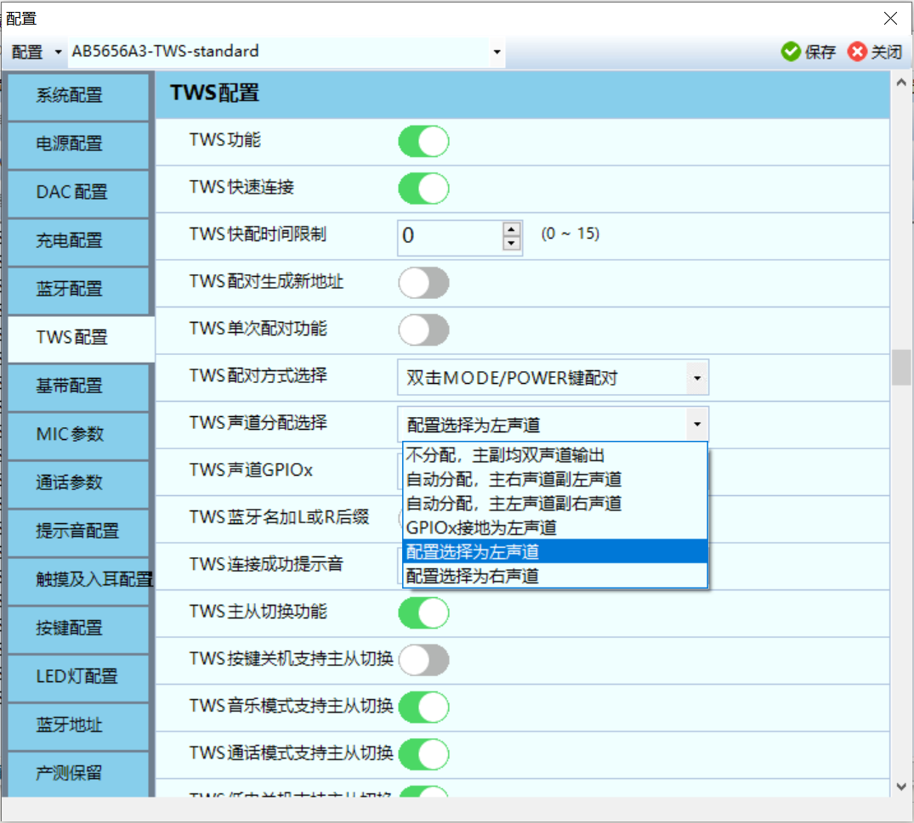
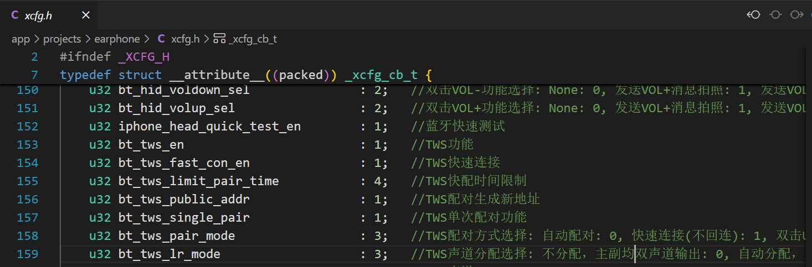
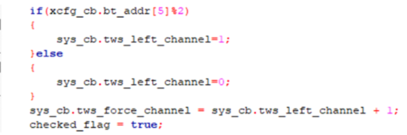

# SDK介绍

**以AB5656A3芯片为例**

## SDK目录结构


## 开发流程


## 新建一个project


- setting中的配置是通过工具的。
- 相似的功能，需要代码实现的，工程复制在修改。

## 修改配置文件

`projects\earphone\xcfg.h`


## 修改按键、显示


## 修改提示音


- 如果是新建的资源文件夹的话，要跟其他文件夹结构一样


# SDK代码解析

## SDK目录结构

```c
└─app

    ├─platform       

    │  ├─bsp        //底层外设相关

    │  ├─functions    //功能相关

    │  ├─gui        //显示功能

    │  ├─header

    │  └─libs

    └─projects //调用API

        └─earphone

            ├─display    //显示

            ├─message  //消息处理

            ├─Output    //文件输出

            │  └─bin    //音乐文件，配置

            │      ├─res

            │      │  ├─en

            │      │  ├─eq

            │      │  └─zh

            │      └─Settings

            │          └─Resources

            │              ├─S6

            │              │  ├─en

            │              │  └─zh

            │              └─TWS

            │                  ├─en

            │                  └─zh

            ├─plugin //插件

            └─port //移植
```

### bsp目录

该目录下，包含一些和底层硬件相关的数据，函数初始化

```c
├─bsp

│      bsp.h

│      bsp_audio.c

│      bsp_audio.h

│      bsp_aux.c

│      bsp_aux.h

│      bsp_ble.c

│      bsp_ble.h

│      bsp_bpap.c

│      bsp_bt.c

│      bsp_bt.h

│      bsp_charge.c

│      bsp_charge.h

│      bsp_cm.c

│      bsp_dac.c

│      bsp_dac.h

│      bsp_dump_buf_huart.c

│      bsp_eq.c

│      bsp_eq.h

│      bsp_fmrx.c

│      bsp_fmrx.h

│      bsp_fmtx.c

│      bsp_fmtx.h

│      bsp_fs.c

│      bsp_fs.h

│      bsp_hdmi.c

│      bsp_hdmi.h

│      bsp_hdmi_cec_msg.c

│      bsp_i2c.c

│      bsp_i2c.h

│      bsp_i2s.c

│      bsp_i2s.h

│      bsp_i2s_ta5711.c

│      bsp_i2s_ta5711.h

│      bsp_i2s_wm8978.c

│      bsp_i2s_wm8978.h

│      bsp_iap.c

│      bsp_id3_tag.c

│      bsp_id3_tag.h

│      bsp_iic_putchar.c

│      bsp_iis_ext.c

│      bsp_iis_ext.h

│      bsp_ir.c

│      bsp_ir.h

│      bsp_karaok.c

│      bsp_karaok.h

│      bsp_key.c

│      bsp_key.h

│      bsp_led.c

│      bsp_led.h

│      bsp_lrc.c

│      bsp_lrc.h

│      bsp_map.c

│      bsp_music.c

│      bsp_music.h

│      bsp_param.c

│      bsp_param.h

│      bsp_piano.c

│      bsp_piano.h

│      bsp_record.c

│      bsp_record.h

│      bsp_spiflash1.c

│      bsp_spiflash1.h

│      bsp_spiflash1_music_bin.c

│      bsp_spi_audio.h

│      bsp_spp.c

│      bsp_sys.c

│      bsp_sys.h

│      bsp_tkey.c

│      bsp_tkey.h

│      bsp_uart.c
```

### functions目录

```c
├─functions

│      func.c

│      func.h

│      func_aux.c

│      func_aux.h

│      func_bt.c

│      func_bt.h

│      func_bt_dut.c

│      func_bt_dut.h

│      func_bt_hid.c

│      func_bt_hid.h

│      func_clock.c

│      func_clock.h

│      func_exspiflash_music.c

│      func_exspiflash_music.h

│      func_fmrx.c

│      func_fmrx.h

│      func_hdmi.c

│      func_hdmi.h

│      func_i2s.c

│      func_i2s.h

│      func_idle.c

│      func_idle.h

│      func_lowpwr.c

│      func_lowpwr.h

│      func_music.c

│      func_music.h

│      func_spdif.c

│      func_spdif.h

│      func_speaker.c

│      func_speaker.h

│      func_update.c

│      func_update.h

│      func_usbdev.c

│      func_usbdev.h

│      sfunc_bt_call.c

│      sfunc_bt_ota.c

│      sfunc_bt_ring.c

│      sfunc_record.c

│      sfunc_record.h

│      sfunc_record_play.c

│      sfunc_record_play.h
```

### Message目录（重要）

主要包括按键消息处理，是蓝牙方案经常需要改动的目录

```c
 ├─message

    │      msg_aux.c

    │      msg_bt.c

    │      msg_clock.c

    │      msg_exspiflash_music.c

    │      msg_fmrx.c

    │      msg_hdmi.c

    │      msg_i2s.c

    │      msg_idle.c

    │      msg_music.c

    │      msg_record.c

    │      msg_spdif.c

    │      msg_speaker.c

    │      msg_usbdev.c

```

### Plugin目录

```c
音乐文件的调用，基本不会去修改这里

    ├─plugin

    │      eq_table.c

    │      multi_lang.c

    │      multi_lang.h

    │      plugin.c

    │      plugin.h

```

### Port目录

主要包括硬件外设的调用，mani函数

```c
└─port

            port_earphone.c

            port_earphone.h

            port_ir.c

            port_key.c

            port_led.c

            port_led.h

            port_ledseg.c

            port_linein.c

            port_linein.h

            port_mic.c

            port_mic.h

            port_mute.c

            port_pwm.c

            port_pwm.h

            port_sd.c

            port_sd.h

            port_sd1.c

            port_tkey.c

            port_tkey.h

            port_update.c
```

## 代码运行流程

### 初始化

`app\projects\earphone\main.c`

```c
//正常启动Main函数
int main(void)
{
    printf("Hello AB565XA3: %x\n", LVDCON);
    bsp_sys_init();
    func_run();
    return 0;
}
```

- bsp_sys_init();函数主要包括各种功能的初始化，获取download工具的配置。

- func_run();主要是处理蓝牙消息和硬件的消息。

### 各模式循环

初始化之后，进入一个FUN函数，蓝牙耳机的FUN函数基本上都在跑func_bt。（**其他应用模式开启需要去config.h中使能，不然就算状态切换到对应模式应用也不会执行**）

- 循环模型的状态机，只要func_cb.sta的状态不变就会一直跑某一个模式。在某个模式中func_cb.sta发生了改变，就会退到大循环中进行模式选择。前提是对应宏使能了，不然没有用。

```c
AT(.text.func)
void func_run(void)
{
    printf("%s\n", __func__);

    func_bt_chk_off();
    while (1) {
        func_clear();

        switch (func_cb.sta) {
#if FUNC_BT_EN
        case FUNC_BT:
            func_bt();
            break;
#endif

#if BT_DUT_TEST_EN
        case FUNC_BT_DUT:
            func_bt_dut();
            break;
#endif

#if FUNC_BTHID_EN
        case FUNC_BTHID:
            func_bthid();
            break;
#endif // FUNC_BTHID_EN

#if FUNC_AUX_EN
        case FUNC_AUX:
            func_aux();
            break;
#endif // FUNC_AUX_EN

#if FUNC_SPEAKER_EN
        case FUNC_SPEAKER:
            func_speaker();
            break;
#endif // FUNC_SPEAKER_EN

        case FUNC_PWROFF:
            func_pwroff(sys_cb.pwrdwn_tone_en);
            break;

#if BT_FCC_TEST_EN
        case FUNC_BT_FCC:
            func_bt_fcc();
            break;
#endif // BT_FCC_TEST_EN

        default:
            func_exit();
            break;
        }
    }
}
```

### 蓝牙模式

蓝牙功能函数

- 大循环选择一个模式后，模式中是一个小循环。除非func_cb.sta 状态改变退出到大循环中进行模式选择，不然一直在模式的小循环中跑。

```c
AT(.text.bfunc.bt)
void func_bt(void)
{
    printf("%s\n", __func__);

    func_bt_enter();

    while (func_cb.sta == FUNC_BT) {
        func_bt_process();
        func_bt_message(msg_dequeue());
    }

    func_bt_exit();
}
```

在程序跑到func_bt();的时候，SDK留给开发者处理的**只有消息处理和电量检测，来电检测等**，蓝牙耳机接收音频信号，解码那些都是屏蔽起来的。

- **感觉修改的都是UI界面，和定制化的各种消息处理以及灯效处理**

#### 进入蓝牙模式

- 蓝牙入口函数

  - func_bt_enter();

  - 主要执行蓝牙初始化，播报提示音

#### 蓝牙模式大循环

`func_bt_process();`

- 包括响铃，通话两种状态的消息处理，他们也有按键消息处理

  - sfunc_bt_ring();

  - sfunc_bt_call();

`func_bt_message`

- 普通蓝牙模式下的消息处理，音乐播放感觉也在这
  - func_bt_message_do

#### C语言的特殊宏

- LINE 表示正在编译的文件的行号

- FILE 表示正在编译的文件的名字

- DATE_ 表示编译时刻的日期字符串，例如： “25 Dec 2007”

- TIME 表示编译时刻的时间字符串，例如： “12:30:55”

```c
#include <stdio.h>

int main(void)
{
        printf("%s\r\n",__FILE__);

        printf("%d\r\n",__LINE__);

        printf("%s\r\n",__DATE__);

        printf("%s\r\n",__TIME__);

        return 0;
}

打印结果：
speci_define.c
6
Jul  6 2019
00:46:39
```

##### 开启打印

**去config.h中打印配置中选一个串口的引脚，常用PB3，但是有一个灯效也是用PB3所以使用时需要避免冲突，不需要打印时，把宏修改回去。**

### 消息

经常需要改动的部分

#### 消息处理

二次开发中修改最多的部分就是消息处理这一块，按键消息处理的修改最多。按键消息有长按，短按，双击，三击，四击，五击等等

```c
void func_bt_message_do(u16 msg)
{
    int klu_flag = 0;
    u8 ku_sel = xcfg_cb.user_def_ks_sel;

    switch (msg) {
    case KU_PLAY:
        ku_sel = UDK_PLAY_PAUSE;
    case KU_PLAY_USER_DEF:
    case KU_PLAY_PWR_USER_DEF:
//        key_voice_play(501, 100, 3);                                        //按键音
        if (!bt_nor_is_connected()) {
            bt_tws_pair_mode(3);                                            //单击PLAY按键手动配对
            break;
        }
        user_def_key_msg(ku_sel);
        break;

    case KL_PLAY_PWR_USER_DEF:
        if (!xcfg_cb.kl_pwrdwn_dis) {
            klu_flag = 1;                                                   //长按抬键的时候呼SIRI
        }
    case KL_PLAY_USER_DEF:
        f_bt.user_kl_flag = 0;
        if (xcfg_cb.user_def_kl_sel == UDK_GAME_SWITCH) {
            klu_flag = 0;
        }
        if (!bt_tws_pair_mode(4)) {                                         //是否长按配对功能
            if (user_def_lkey_tone_is_enable(xcfg_cb.user_def_kl_sel)) {
                sys_warning_play(T_WARNING_NEXT_TRACK, 1);                  //长按“滴”一声
//                tws_res_play(TWS_RES_TONE);                                 //tws同步播放
            }
            if (klu_flag) {
                f_bt.user_kl_flag = user_def_func_is_ready(xcfg_cb.user_def_kl_sel);     //长按抬键的时候再处理
            } else {
                user_def_key_msg(xcfg_cb.user_def_kl_sel);
            }
        }
        break;

        //SIRI, NEXT, PREV在长按抬键的时候响应,避免关机前切歌或呼SIRI了
    case KLU_PLAY_PWR_USER_DEF:
        if (f_bt.user_kl_flag) {
            user_def_key_msg(xcfg_cb.user_def_kl_sel);
            f_bt.user_kl_flag = 0;
        }
        break;

        //长按调音量
    case KH_PLAY_PWR_USER_DEF:
        if (!xcfg_cb.kl_pwrdwn_dis) {
            break;
        }
    case KH_PLAY_USER_DEF:
        func_message(get_user_def_vol_msg(xcfg_cb.user_def_kl_sel));
        break;
```

#### 消息来源

以按键为例

void msg_enqueue(u16 msg);//消息队列

- 将不同按键事件放入消息队列，等待调用msg_dequeue取出事件根据所处状态做对应的处理。

```c
放入消息队列，使用定时器定时扫描app\platform\bsp\bsp_sys.c
AT(.com_text.bsp.key)
u8 bsp_key_scan(void)
{
    u8 key_val;
    u16 key = NO_KEY;

    key_val = key_scan();
#if VBAT_DETECT_EN
    sys_cb.vbat = get_vbat_val();
#endif // VBAT_DETECT_EN

#if USER_TKEY_SHORT_SLIDE
    key = bsp_key_slide_process(key_val);
#else
    key = bsp_key_process(key_val);
#endif

#if USER_TKEY_SLIDE
    key = bsp_tkey_slide_process(key);
#endif
    if ((key != NO_KEY) && (!bsp_key_pwron_filter(key))) {
        //防止enqueue多次HOLD消息
        if ((key & KEY_TYPE_MASK) == KEY_LONG) {
            sys_cb.kh_vol_msg = (key & 0xff) | KEY_HOLD;
        } else if ((key & KEY_TYPE_MASK) == KEY_LONG_UP) {
            msg_queue_detach(sys_cb.kh_vol_msg, 0);
            sys_cb.kh_vol_msg = NO_KEY;
        } else if (sys_cb.kh_vol_msg == key) {
            msg_queue_detach(key, 0);
        }
#if WAV_KEY_VOICE_QUICK_EN
        if (key == K_PLAY_PWR_USER_DEF) {
            sys_cb.tws_res_brk = 1;
        }
#endif
#if LED_188LED_DISP_EN
        if (key == K_PLAY_PWR_USER_DEF) {
            bsp_188led_disp_set_on();
        }
#endif
//        printf(key_msg_str, key);
        msg_enqueue(key);
    }
    return key_val;
}

从消息队列中取出消息事件做对应的处理
func_bt_message(msg_dequeue());
传递到func_bt_message_do(msg);
```

#### 按键消息的注意事项

下面的宏都是按键消息：

以PLAY按键为例

```c
#define K_PLAY                  (KEY_PLAY | KEY_SHORT) //下降沿

#define KU_PLAY                 (KEY_PLAY | KEY_SHORT_UP) //上升沿

#define KL_PLAY                 (KEY_PLAY | KEY_LONG) //长按

#define KLU_PLAY                (KEY_PLAY | KEY_LONG_UP) //长按上升沿

#define KH_PLAY                 (KEY_PLAY | KEY_HOLD) //长按2秒左右

#define KD_PLAY                 (KEY_PLAY | KEY_DOUBLE) //双击

#define KTH_PLAY                (KEY_PLAY | KEY_THREE) //三击

#define KFO_PLAY                (KEY_PLAY | KEY_FOUR) //四击

#define KFI_PLAY                (KEY_PLAY | KEY_FIVE) //五击
```

除了KU_PLAY按键，配置工具中还可以将按键消息类型定义为KU_PLAY_USER_DEF，KU_PLAY_PWR_USER_DEF。但是除了个例好像都是指向同一个处理函数，每一种按键操作的类型都可以分为以上三种，一般三种都指向同一个处理函数，但是从不同分支进来会做一些处理，可以看上面的代码。

**注意！每次按键都会触发下降沿。**

以蓝牙模式为例：

程序先在func_bt_message函数做判断，如果在该函数没有找到一致的case，则会跑到公共的消息处理函数中 void func_message(u16 msg) 再做判断。

- 在`user_def_key_msg`没有符合的功能代码，就会进入公共消息处理函数

```c
    } else if (func_sel == UDK_MODE) {                  //MODE
        func_message(KU_MODE);
    } else {                                            //VOL+, VOL-
        func_message(get_user_def_vol_msg(func_sel));
```

#### 应用：1S消息

在定时器中，每隔一秒发送一个消息MSG_SYS_1S

在蓝牙消息或者公共消息做处理，常用的1秒消息处理有报告电量，连接蓝牙自动播放。

- 一般会在实质消息处理前，会先处理空消息和定时消息

```c
AT(.text.bfunc.bt)
void func_bt_message(u16 msg)
{
    if (msg == NO_MSG || msg == MSG_SYS_1S) {       //减少flash缺页
        func_bt_message_m(msg);
        if (msg == MSG_SYS_1S) {
        }
    } else {
        func_bt_message_do(msg);
    }
}
```

#### 蓝牙消息函数

三个状态的消息处理，蓝牙模式比较特殊，除了一个func_bt_message还有两个，响铃，通话。

- 先判断当前的状态，根据状态进入不同的处理分支。比如响铃的长按和普通模式下的长按处理不一样。配置工具的设置都不一样。

**响铃:void sfunc_bt_ring_message(u16 msg)**

- 来电响铃的时候执行消息处理，主要包括接/挂电话，电量报告和按键消息公共处理。

**通话中:sfunc_bt_call_message();**

- 通话过程的按键消息处理，主要包括音量调整，三方通话，电量报告

**Music: void func_bt_message(u16 msg)**

- 蓝牙音乐模式的消息处理，上下曲切换，暂停播放，音量调整，报告电池电量等

**所以为什么周期消息是单独处理的，不进入那种switch case语句，可能太费时间。**

## TWS左右声道分配

### SDK setting 配置左右声道



- 第一种“不分配”，即不对耳机声道进行指定，均可以输出双声道，**这种方式在 TWS 耳机中通常不会采用，可以用做蓝牙音箱的开发；**
  - 这相当于两个耳机各放各的，互不打扰

- 第二种“自动分配”，这种方式也没有对耳机的声道进行直接的指定，根据选择“主右声道副左声道”或“主左声道副右声道”，通过 TWS 之间主副耳机来确定声道，**但是使用这种方式没法保证稳定的主从关系就会导致左右耳机之间声道混乱，也不适合 TWS 耳机的使用；**
  - 机器的左右耳是固定的，主从也应该定下来，到时候把灯效修改一下即可。

- 第三种“硬件选择”，这种方式在硬件设计时，通过左右耳机的硬件上的连接来做左右声道的分配，其中又可以通过两种配置来确定，一个是在左耳的 PWRKEY 引脚接 820K 欧姆的电阻到地，另一种是使用较多的方式，即选择一个 IO 脚位接地，来配置为左，对应的 IO 没有接地的一侧则为右，IO 口的配置同样可以在 setting 中选择，硬件上设计上可以在该 IO 口预留一个 0 欧姆电阻接地，左边耳机焊接，右边耳机 NC。
- 第四种“固定配置”，除了硬件上做选择，还有软件上做选择，在声道分配中，选择“配置选择为左声道”或“配置选择为右声道”，软件烧录后会固定该耳机的声道分配，**这种方式需要分两个配置文件，即两版烧录软件，对应左右耳机，但不需要在硬件上做更改**，上一种方式**通过硬件来做区分则是可以左右耳机烧录同一版软件**，但在设计上会占用一个 IO 资源，在 IO 口有空余时可以使用。
  - 第三种需要使用一个IO口。第四种使用两版烧录软件即可。

### 根据蓝牙地址配置左右声道（不可行）

以上四种方式在 SDK 中可以找到对应的检测的位置，在 xcfg.h 中可以看到配置的变量，在工程代码中追这个变量就可以找到配置生效的地方；



可以看到在软件中不过是读取了 setting 中配置的内容，从而进行相应的硬件 IO 检测或软件设置；


在AB5656A3中，此函数不可见。在bsp_sys_init初始化函数中调用。TWS声道初始化。

~~那么同样的在这里也可以增加一种新的左右声道分配方式，使用蓝牙地址去配置，使用过蓝讯芯片的小伙伴应该知道，芯片的蓝牙地址是可以在 setting 中配置，烧录后生效。~~

- **现在函数不可见，此方法无效**

蓝牙地址的配置方式也有几种，这里不做赘述，主要可以看蓝牙地址的单次递增方式，或区间循环方式，这样在烧录配置蓝牙地址的时候，耳机蓝牙地址会根据配置形成一定的奇偶关系；


xcfg.h 中，同样可以找到对应配置里的蓝牙地址项；

app\projects\earphone\xcfg.h

```c
u8 bt_addr[6];                              //蓝牙地址
```

在 tws_lr_xcfg_sel() 中可以去掉 SDK 中原有的配置，添加通过耳机蓝牙地址的奇偶性质来对左右声道进行分配，如下；



**这样的话确实就可以烧录一版软件，但是还是不方便，因为有时候左右耳机的触摸按键不是完全相同的。烧录同一版软件的话，无法区分左右的个性化操作。**

# 工具使用

## X-link连接


啥设备有USB接口。。。有个3.5耳机接口就不错了。

## EQ工具


## 测试盒


# 耳机充电配置

## 电池充电过程

在TWS耳机中，通常使用锂电池。锂电池的充电过程可以分为四个阶段:

1. **涓流充电**: 当电池电压过低（如过放后）时，使用较小的电流进行预充电.
2. **恒流充电**: 当电池电压涓流充电到一定电压阈值（2.9V或3V）时，进入恒流充电模式，此时电压范围通常是3V - 4.2V.
3. **恒压充电**: 当电压达到4.2V后进入恒压充电模式，此时充电电流会逐步降低.
4. **充电截止**: 充电停止.

充电停止的判断通常有两种方式:

1. **定时涓流充电时间**: 恒压充电电压达到后开始计时恒压充电的时间，达到设定时间后停止充电.
2. **根据电流判断**: 在恒压充电过程中，电流会逐步降低，当电流低于设定的低阈值时停止充电.

## SDK 中充电配置

**中科蓝讯芯片中内置了 charger，相关的充电配置已经给出来，可以看到 config.h 中这里定义了充电相关参数的配置，值对应 xcfg_cb 中的值，所以充电实际上可以在 Downloader 上位机中去配置。**


基本的充电配置都可以在这个页面中进行，例如前面介绍锂电池充电过程时提到的几个充电阶段电流的配置，以及相对应的充电截止电流的阈值。其他的配置则可以根据实际的功能需求改动，**建议都使能涓流充电控制**，当锂电池过放时，必须使用涓流进行预充，避免电池损坏；插入 DC 复位和插入 DC 禁止软开机，则按照实际需求配置，这里的 DC 插入通常指芯片 VUSB 引脚接入 5V。同样的满电自动关机和充电仓的类型都是根据需求的功能来进行配置 。

在这里实际上判断充电结束的方式是前面提到的两种方式的结合，即芯片在**充电截止电压到达后，会去计时，同时判断充电截止电流，当充电截止电流达到后，停止充电，或充电截止电流没达到，充电截止的时间达到了，同样停止充电**。

## 充电控制

除了前面提到的基础充电配置，实际上对于充电有时候会有其他的控制需求，在耳机中的体现就是 NTC 功能，**根据充电环境的温度，去控制充电达到保护电池延长电池使用的目的**。通常通过 ADC 功能去采集热敏电阻的电压，换算得到相应的温度值，实现比较简单，**只要得出 ADC 值对应的温度列表就可以实现**，这里主要讲充电的调整控制部分，例如在某温度下需要对充电电流进行调控，通常采用的实现方式如下，实际上就是先停止充电，在修改恒流充电的电流配置在重新初始化进行充电。

- **检测到温度过高后，把充电电流改小降低发热？**
