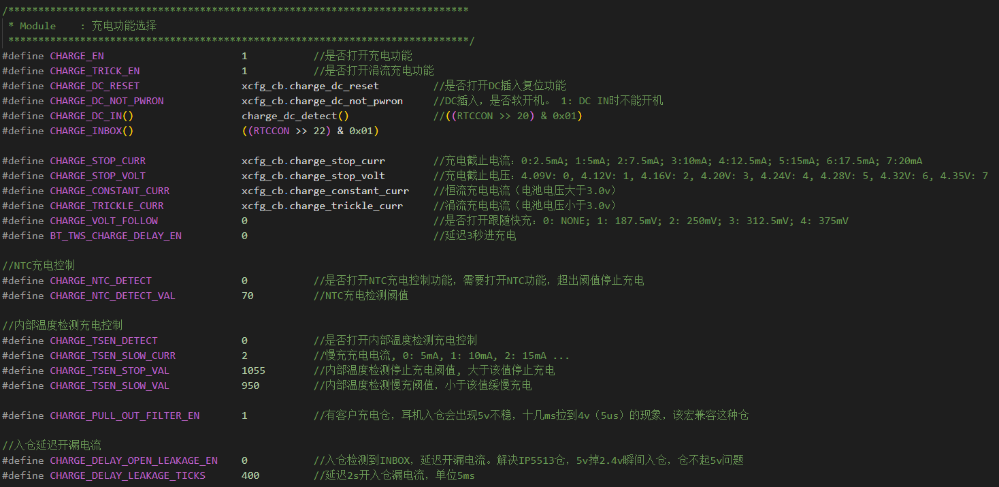
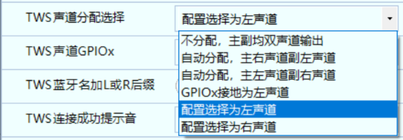
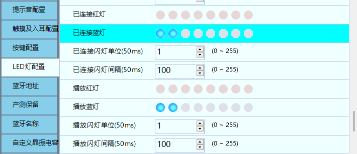

# 可视化工具的使用

## DownLoader功能简述

- DownLoader 集"下载"和"打印调试"在一起, 方便开发人员使用. 下载时一般用串口作为下载口.

- Downloader 串口下载和打印均使用1.5M (1500000)波特率.

编译器最终生成的下载文件是dcf文件, 下载时, 把dcf文件拖入DownLoader即可:

- 只能使用**codeblocks**编译？**是的**

`SDK_AB565XA3_S446_20250331\app\projects\earphone\Output\bin`

注意下载程序时, 一定要选中一个配置选项, 否则程序可能有未知情况出现

开发人员一般选中下图中的"开发",  可以方便下载后查看打印信息

**有程序加密的KEY的话要选择，否则会打开失败。**

## 工具配置描述

### 系统配置

#### 提示音配置

**1.中英文语言选择**

- 选择“中英文”配置， 

- 需要打开“USER_DEF 双击切语言”，否则生产时单英文和单中文机型串配后，只能掉电或重烧改回语音语言

- 去哪个文件夹寻找提示音资源，看选择
  - **如果选择默认的话，就会去对应文件夹寻找资源**

- 如果是定制的音效的话，可以新建一个与默认文件夹相同结构的文件夹，做同名音效的替换
  - **不同名的音效的话，需要修改源代码**
  - **可以借鉴之前的实现，在对应位置加上**

**2.提示音类型配置(语音， Tone 音，无提示音)**

- 如下图所示每个状态下提示音可以单独控制选择 Tone 音，语音或者关闭提示音。 

- Flash 芯片需要首先使用 0KB 同名文件替换，此处的提示音配置才能有效。

- **配置工具只能选择使用电子音还是人声或者无提示音**
  - **具体使用那一条提示音，需要在代码中指定，特别是之前没有的提示音。**

**3.提示音的音量配置**

- 提示音跟随系统音量打开后，提示音播放使用当前系统的音量。但开机/关机/最小音量提示音还是使用配置的提示音播放音量（如下图 28 级）。

- 提示音跟随系统音量关闭后，提示音播放音量固定为配置的音量级数（如下图 28 级）。

**4.SBC 语音文件替换**  

- 仅 Flash 版本的芯片，如 AB5656A2、 AB5656C2， 支持 SBC 语音文件替换。

- SBC 语音文件替换方法如下：
  - 16 位的 16K 或 8K 采样率 Windows PCM 格式 xxx.wav 文件放入 wav 文件夹下，如下所示：

运行 sbc.exe 工具，自动生成 xxx.sbc 文件放于 sbc 文件夹, 如下所示：  

生成的 xxx.sbc 文件放到 Settings\Resources 下新建目录替换，**文件名必须保持 res 下的语音文件名相同**。  

替换语音后需要确认.prd 文件大小， AB5656A2 的.prd 文件大小不能超过 248KB， AB5656C2 的.prd 文件大小不能超过 120KB  

不需要的语音提示音，使用 0KB 同名文件替换， 可减小.prd 文件大小， 例如：  

0KB 文件替换后，会默认使用 Tone 音，如果 Tone 音也不需要，进行 Tone 音配置。  

##### 添加新提示音（不是替换）

- **新增balabala的提示音在默认资源文件夹**

- **codebook编译之后，会生成一个特定的宏定义**
  - app\projects\earphone\res.h

- **参照默认提示音的实现，去添加对应的代码**
  - **部分示例**：
  - app\platform\bsp\bsp_piano.h
  - app\platform\bsp\bsp_warning_play.c

##### 生成提示音

- 提示音一般来自客户

- 比如.wav后缀格式

- 如果不是需要先打开工具转换后缀格式以及属性

- 生成sbc后缀格式，清空原文件夹，运行脚本即可

- 移动到对应位置即可

#### 开关机相关配置

##### 软开关机功能

PWRKEY 的软开关机功能，硬开关方案需要关闭此选项。

##### POWKEY 10s 复位系统

长按 PWRKEY 10 秒触发硬复位，预留耳机异常死机时复位手段，**建议开启。**

##### 第一次上电直接开机

电池第一次接通直接开机，用于产线快速开机测试  

##### 自动休眠时间

蓝牙已连接且无任何蓝牙操作，多长时间后自动进入休眠，根据需求配置时间

##### 自动关机时间

耳机蓝牙与手机未连接，多长时间后自动关机，根据需求配置时间。

##### 软开关机长按时间

使能软开关机功能后，此处配置长按多长时间开机，关机。 长按开机最短 100ms， 关机最短1.5s。

- **POWKEY复位的区别？？？**
- **点击屏幕吗？**

##### PWRKEY 模拟硬开关（不懂作用）

使用 PWRKEY 软开关模拟硬开关功能，打开此选项后， PWRKEY 只能用于开关机功能，且需要同时打开软开关机配置选项。  

- PWRKEY 低于 0.9v 为逻辑低。复位源与开机触发有效。

- PWRKEY 内部上拉 90K 到 2.4V。

##### NTC 功能

打开 NTC 功能打开 NTC 功能，高于 55 度自动关机，可以调整 ADC 的值改变需要关机的温度。

- NTC 使用内部 10K 上拉

- 是否使用内部 10K 上拉，否则使用外部 10K 上拉。

NTC 的 ADC 通路选择

- 选择 NTC 的 ADC 检测通路。

NTC 关机的 ADC 阈值

- 配置 NTC 关机的 ADC 阈值，可以改变需要关机的温度

##### 低电相关配置

低电语音提示电压  

- 电池电压低于配置值，播报低电提示音  

低电关机电压

- 电池电压低于配置值，自动关机。  

低电语音播报周期  

- 配置低电提示音播报周期。  

**低电播报几次后关机**  

- 播报低电提示音几次后自动关机， None 表示以播报周期一直循环播报到关机电压。  

#### 音量配置

##### 系统默认音量配置

- 系统的实际音量总是比内部的“配置值”高 1。

- 第一次开机没有记忆时，音量是 默认配置值 + 1。

- 后续开机时，音量如何设定取决于 音量阈值 (threshold_value) 的设置：如果 阈值 = 0：无论上次关机音量是多少，开机都强制设为 默认配置值 + 1。

  - 如果 阈值 > 0：如果上次关机音量 (sys_vol) 低于 阈值：开机时音量会被提升到 阈值 + 1。

  - 如果上次关机音量 (sys_vol) 等于或高于 阈值：通常会保留上次关机的音量（这是推断，但符合逻辑）。
  - 音量阈值就相当于每次开机的最小音量值，大于保留小于则丢弃使用这个音量阈值

这个逻辑允许系统管理员或用户配置设备的开机音量行为：可以选择每次都固定到一个默认值，或者在音量设置过低时强制恢复到一个最低可用级别。

##### 提示音默认音量固定为配置值，不随系统音量的改变而改变。 

- **一般提示音：** 大部分提示音的音量是否会随着主系统音量的调节而改变，取决于一个叫做“提示音跟随系统音量”的功能开关。打开此功能，提示音音量就跟随；关闭则可能不跟随（有独立设置或固定）。

- **特定提示音（如 PianoTone 类型）：** 有一部分特定的提示音（例如警告音、电量音等）被设置为**固定**跟随系统音量。这意味着无论那个总的跟随开关状态如何，这些特定的提示音的音量都会强制地、始终地与主系统音量同步变化。 

#### 其它系统配置

##### 功放 MUTE 功能

"功放 MUTE 功能" 指的是 **功率放大器 (Power Amplifier)** 上的 **静音 (MUTE)** 功能。

它的主要作用是：

1. **快速切断音频输出：** 启用 MUTE 功能后，功率放大器会立即停止放大输入的音频信号，从而使连接的扬声器不再发出声音。这是一种快速实现静音的方式。
2. **抑制杂音：** 在某些操作（如开关机、切换音源）时，功放可能会产生电流冲击声或杂音（俗称“pop”声或“thump”声）。MUTE 功能常被用于在这些瞬间自动激活，以避免这些不愉快的噪音通过扬声器播放出来。

简单来说，它就是一个让功放“闭嘴”的功能，用于临时或在特定情况下停止声音输出。

**高 MUTE**

- 功放是否为高 MUTE，否则为低 MUTE。

- **意思：** 这指的是控制功放 MUTE 功能的 **信号逻辑电平**。

  **高 MUTE (High MUTE)：** 表示当控制信号是**高电平**时（例如 3V 或 5V），功放进入静音状态。

  **低 MUTE (Low MUTE)：** 表示当控制信号是**低电平**时（例如 0V 或接地），功放进入静音状态。

  **作用：** 这个配置告诉控制芯片（比如微控制器）应该输出高电平还是低电平才能让功放静音。这取决于功放芯片的设计。

**功放 MUTE 的 IO 选择**  

- 选择控制 MUTE 的 IO， None 为不控制

- **意思：** 这配置了系统使用 **哪一个具体的输入/输出 (IO) 引脚** 来发送控制信号到功放的 MUTE 脚。

  **选择控制 MUTE 的 IO：** 你需要从系统中可用的 IO 引脚列表中选择一个，将它连接到功放的 MUTE 引脚上。

  **None 为不控制：** 如果选择“None”，意味着系统将不通过任何 IO 引脚控制功放的 MUTE 功能，或者该功能被禁用。

  **作用：** 这是硬件连接和软件配置的映射。告诉系统应该操作哪个物理引脚来实现静音控制。

**功放 MUTE 延时**  

- 功放 MUTE 的延时控制，单位 50ms，防止解 MUTE 时间不够导致声音不全。

- 如果配置是“高 MUTE”，这意味着：

  - 控制引脚输出 **高电平** 时，功放进入 **静音** 状态。
  - 控制引脚输出 **低电平** 时，功放进入 **解除静音** 状态。

  而那个“功放 MUTE 延时”功能，正是应用在 **从静音状态（高电平）切换到解除静音状态（低电平）时** 的那个过程。

  也就是说，当控制引脚从高电平（静音信号）变为低电平（解除静音信号）后，系统不会立即让完整的音频信号送达并被功放输出，而是会等待你设定的那个延迟时间（以 50ms 为单位），然后再完全解除对音频信号的抑制，让声音正常播放。

  这个延迟就是为了确保功放电路在接收完整的音频信号前有足够的时间稳定下来，避免在解除静音的瞬间出现声音不全或杂音。

##### EQ 配置（不用管）

设备中 **均衡器 (EQ - Equalizer)** 功能的配置和使用。均衡器是一种调节音频信号中不同频率声音强度（高音、中音、低音等）的工具，用来改变声音的音色或风格。

这些配置让你能够首先决定是否使用 EQ 功能（**是否使能**）。如果启用了，你可以通过面向用户的 **EQ 配置菜单** 进行简单的手动调整，或者通过面向专业人员的 **EQ 调试** 接口进行更详细和精密的调音。最终目的都是为了让你能够根据自己的需求来改变和优化设备输出的声音音色。

**是否使能** 

- EQ打开后可以使用 EQ 相关功能

- **作用：** 这是一个 **总开关**，用来决定是否启用设备的均衡器功能。

  **用途：** 如果你想使用 EQ 来调整声音效果，就必须把这个选项打开。如果关闭，即使有相关的设置，EQ 也不会起作用，声音将是原始的、未经均衡处理的。它控制着后续所有 EQ 相关功能是否可用。

**EQ 调试**

- 可以选择蓝牙串口或 UART 调试 EQ，需要配合调试工具 Equalizer 使用。   

- **作用：** 这是为开发者或高级用户提供的 **专业调音接口和方式**。

  **用途：** 它允许通过蓝牙串口或 UART 这些通信接口连接到电脑，配合专门的“Equalizer”调试工具，在播放音频时 **实时、精细地调整** EQ 的各项参数（例如每个频率点的增益、Q值等），以针对特定的硬件（如扬声器、耳机）或听音环境，达到最佳的音质效果。这通常用于产品开发、测试或对音质有极致要求的专业调音。

**EQ 配置菜单**   

- 打开“是否使能 EQ”选项后，会多出一个“EQ 配置”菜单，可以对 EQ 进行手动配置。  

- **作用：** 这是在启用 EQ 功能（即打开“是否使能 EQ”选项）后，系统界面中会额外出现的一个 **用户手动配置界面或选项**。

  **用途：** 用户可以通过这个菜单来访问和修改 EQ 的设置。这可能包括选择不同的预设音效模式（如流行、摇滚、古典等），或者允许用户手动调整某些频率段的增益。这是提供给普通用户，让他们可以根据自己的听感偏好来定制声音风格的途径。

##### **马达控制**  

关于设备中 **振动马达**（通常用于提供触觉反馈或振动提示）的控制和配置。

马达控制 IO 选择

- 选择控制马达的 IO， None 为不控制

- **作用：** 这个配置用来指定系统使用 **哪个具体的输入/输出 (IO) 引脚** 来发送信号，从而控制振动马达的开关（即让马达启动或停止）。

  **用途：** 设备内部的微控制器或芯片需要通过某个物理引脚来连接并驱动振动马达。这个选项就是告诉系统软件，马达的控制线连接到了哪个引脚上。选择“None”通常表示系统不通过 IO 引脚控制马达（可能马达没有连接、使用了其他控制方式，或者振动功能被软件层禁用）。

马达振动时间配置

- 打开后会显示“马达配置”菜单，可以自定义马达振动的时间，关闭为默认时间。

- **作用：** 这个配置决定了振动马达在被触发时，**每次振动会持续多久**。

  **用途：**

  - 如果 **打开** 这个选项，系统界面会弹出一个专门的“马达配置”菜单，用户可以在里面 **手动设置** 振动的持续时间（例如，让振动持续 500 毫秒、1 秒等）。这提供了用户自定义振动时长的能力。
  - 如果 **关闭** 这个选项，振动时间将使用设备内部预设的一个**默认值**，用户无法更改。

##### 氛围灯控制  

氛围灯控制配置主要用于 OTP 方案实现 IO 控制灯， 且可以通过按键开关灯的状态。  

**意思：** 这是一个总体性的说明，指出氛围灯的控制主要是通过系统的一个 **输入/输出（IO）引脚** 来实现的（尤其是在某些 **OTP**，即一次性可编程的芯片或方案中），并且用户通常可以通过按下设备上的某个 **按键** 来开启或关闭这个灯。

**用途：** 解释了氛围灯控制的**技术基础**（IO控制）和**用户操作方式**（按键开关）。

**氛围灯控制 IO 选择**

- 选择控制氛围灯的 IO， None 为不控制。

- **意思：** 这个配置选项用来让你指定系统应该使用 **哪一个具体的 IO 引脚** 来发送控制信号，从而控制氛围灯的亮灭。

  **用途：** 这是硬件连接和软件配置之间的桥梁。你需要告诉系统氛围灯的控制线连接到了设备主控芯片的哪个引脚上。选择“None”通常表示系统不通过某个特定的 IO 引脚来控制氛围灯（可能意味着该功能被禁用，或者控制方式不是简单的 IO 开关）。

**氛围灯上电默认亮**

- 是否上电开机默认亮氛围灯。

- **意思：** 这是一个简单的开关选项，用来设定设备在 **刚启动或上电开机时**，氛围灯的默认状态是亮着还是灭的。

  **用途：** 控制氛围灯的初始状态。用户可以根据自己的偏好或产品需求，设置开机时灯是自动亮起还是保持熄灭。

**按键控制开关灯的状态**  

**意思：** 这明确说明设备上的某个特定的 **按键** 被指定了控制氛围灯开启和关闭的功能。

**用途：** 提供给用户一个方便的、物理的操作方式，可以随时通过按下这个按键来切换氛围灯的亮灭状态。

### 电源配置

关于设备中 **电源管理** 相关的配置。它们决定了设备内部不同部分的供电方式、电压以及一些硬件设计的选择，以达到性能、功耗和成本的平衡。

#### BUCK MODE

**意思：** 这选择设备内部用来产生稳定电压的 **电压转换器类型**。

**BUCK MODE (降压模式)：** 使用 BUCK 转换器。它是一种高效的降压方式，尤其在输入电压（如电池电压）远高于输出电压时，能显著节省电量，但电路相对复杂，输出可能略有纹波。

**LDO MODE (线性稳压模式)：** 使用 LDO 稳压器。它是一种简单的稳压方式，输出电压比较干净稳定，但效率相对较低，多余的电能会以热量的形式消耗掉，在输入输出压差较大时功耗较高。

**作用：** 这个配置是核心的电源模式选择，决定了后续一些硬件优化（如是否能省电容）和功耗表现。

打开选择 BUCK MODE，否则选择 LDO MODE。  

#### VDDIO 省电容

**意思：** 配置是否允许在 **VDDIO** 这个电源引脚（通常是给数字输入/输出电路供电的电压）上 **不外接或少外接滤波电容**（即 Capless 设计）。

**打开此配置选项：** 启用 VDDIO 脚的省电容功能。

**注意...：** **非常重要** 的限制条件是：**只有在选择了 LDO MODE 时，这个省电容功能才有效。如果选择了 BUCK MODE，必须关闭此选项，并在 VDDIO 引脚外接必要的电容。** BUCK 转换器固有的输出纹波需要外接电容来平滑。

**作用：** 在 LDO 模式下，如果芯片设计支持，开启此选项可以减少外部元器件数量，降低成本和 PCB 空间，但需要满足特定的电源模式条件。

VDDIO 脚省电容，打开此配置选项。 注意只有 LDO 模式才能 Capless， BUCK MODE 不能省VDDIO 电容，要关闭此选项。  

#### VDDBT 省电容

**意思：** 配置是否允许在 **VDDBT** 这个电源引脚（通常是给蓝牙模块供电的电压）上 **不外接或少外接滤波电容**。

**打开此配置选项：** 启用 VDDBT 脚的省电容功能。

**注意...：** **非常重要** 的限制条件与 VDDIO 省电容类似：**只有在选择了 LDO MODE 时，这个省电容功能才有效。如果选择了 BUCK MODE，必须关闭此选项，并在 VDDBT 引脚外接必要的电容。**

**作用：** 与 VDDIO 省电容类似，用于在满足 LDO 模式条件时减少外部元器件，优化成本和空间。

VDDBT 脚省电容，打开此配置选项。 注意只有 LDO 模式才能 Capless， BUCK MODE 不能省VDDBT 电容，要关闭此选项。  

#### VDDIO 电压

**意思：** 配置 VDDIO 电源域输出的 **具体电压值**（例如可能是 1.8V、3.0V、3.3V 等）。

**配置默认值是推荐配置：** 提示你系统提供的默认电压值是经过测试和推荐使用的，通常能保证稳定性和最佳性能。

**作用：** 设定数字 IO 电路的工作电压，影响性能和功耗。一般按照芯片规格书或推荐值配置。

VDDIO 电压配置，配置默认值是推荐配置  

#### VDDBT 电压  

**意思：** 配置 VDDBT 电源域输出的 **具体电压值**（例如可能是 1.1V、1.2V 等）。

**配置默认值是推荐配置：** 提示你系统提供的默认电压值是推荐使用的，通常能保证蓝牙性能和功耗。

**作用：** 设定蓝牙模块的工作电压，影响其性能、功耗和射频特性。一般按照芯片规格书或推荐值配置。

VDDBT 电压配置，配置默认值是推荐配置  

#### LVD 电压  

**意思：** 配置 **低电压检测 (LVD - Low Voltage Detection)** 的 **阈值电压**。

**LVD 复位电压：** 当设备的供电电压（通常是电池电压 VBAT）降低到这个设定的阈值以下时，芯片内部的 LVD 电路会触发，通常会导致系统自动复位或进入低功耗关机状态。

**配置默认值是推荐配置：** 提示默认的 LVD 电压是推荐设置。

**作用：** 防止设备在电量过低、电压不稳定时继续运行，避免数据错误或工作异常，保护系统稳定性。

LVD 复位电压，配置默认值是推荐配置。  

#### VBAT 省电容  

**意思：** 配置是否允许在 **VBAT** 这个主电源输入引脚（通常直接连接电池）上 **不外接或少外接滤波电容**。

**一系列条件：** 这部分描述了开启 VBAT 省电容功能所需要满足的非常复杂的硬件和软件条件：

- **必须是 LDO 模式。**
- **必须同时确保 VDDIO 引脚是加了电容的**（即“VDDIO 省电容”配置是关闭的）。
- **只有 FLASH 存储器的芯片版本才可能支持**（EEPROM 和某些特定的 OTP 版本不支持）。
- 在配置界面中，必须先选择 LDO 模式并关闭 VDDIO 省电容后，VBAT 省电容的选项才可能显示出来。
- EEPROM 版本需要特定的软件版本才支持。
- 列出了几个**明确不支持** VBAT 省电容的特定芯片型号（如 AB5656T2, AB5657T2, AB5659T2 OTP 版本，AB5659C2 ESOP8 版本），这些型号**必须**外接电容，甚至给出了推荐的电容值（105 通常指 1uF 或 0.1uF 类型的陶瓷电容）。

**作用：** 这是在满足极多前提条件下的一个硬件优化，旨在进一步减少外部元器件（VBAT 输入端的大电容），降低成本和体积。但由于 VBAT 是主电源，省电容的设计需要芯片内部有非常强的电源管理和滤波能力，所以支持它的芯片版本和配置条件非常苛刻。

只有 LDO 模式才能 VBAT 省电容，且 VDDIO 需要有电容  

- 只有 FLASH 版本才能在配置开启“VBAT 省电容”。 需要关掉“BUCK MODE”，即 LDO 模式下，“VDDIO 省电容”配置保持关闭，“VBAT 省电容”配置才会在“其他配置”菜单中显示。

- EEPROM 版本，分有 VBAT 省电容和 VBAT 不省电容两版软件， VBAT 省电容需要用专用的软件  
- OTP 版本的芯片 AB5656T2、 AB5657T2、 AB5659T2， 不支持 VBAT 省电容，必须加电容。  
- ESOP8 版本的 AB5659C2， 不支持 VBAT 省电容， VBAT 需要外接一个 105 以上的电容到地。  

### DAC 配置 

关于设备中 **数字-模拟转换器 (DAC - Digital-to-Analog Converter)** 的相关配置。DAC 是音频系统中非常重要的组成部分，它负责将处理后的数字音频信号转换成我们耳朵能听到的模拟电信号。这些配置项控制着 DAC 的工作模式、输出特性、音量调节以及一些相关的电源和降噪功能。

#### DAC 声道选择  

**意思：** 这配置了 DAC 模拟输出的 **通道数**（单声道或双声道）和 **输出方式/电路结构**（差分或 VCMBUF）。

**差分输出 (Differential Output)：** 每声道的信号使用两根线传输（正相和反相），抗干扰能力强，输出幅度通常较大。

**VCMBUF 输出：** 可能是一种单端输出方式，使用一个缓冲器来处理共模电压。

**用途：** 这个设置**必须**根据设备外部连接 DAC 输出的电路设计来选择，以确保信号连接正确并获得预期的音频输出。选错了模式会导致声音异常或无声。

差分单声道、差分双声道、 VCMBUF 单声道、 VCMBUF 双声道此选项需要根据电路设计来选择。  

#### DAC 单端输出

**意思：** 这是一个**仅在芯片的 Flash 存储器版本上才支持**的配置选项，用来启用 DAC 的 **单端输出** 模式。

**单端输出 (Single-Ended Output)：** 每声道的信号使用一根信号线和一根地线传输。相比差分输出更简单，但更容易受到噪声干扰。

**用途：** 为支持此功能的 Flash 版本芯片提供单端输出的选择，これも外接电路设计相对应。非 Flash 版本没有这个选项。

该配置仅 Flash 版本支持，在“其他配置”菜单下可选“DAC 单端单声道”或“DAC 单端双声道”。其他版本暂未支持。  

#### VDDPA 电压

**意思：** 配置供给音频**功率放大器 (PA)** 的电源电压 **VDDPA**。

**用途：** 可以在 1.25V 到 1.4V 之间调节 PA 的工作电压，默认是 1.25V。较高的电压通常能提供更大的输出功率，但会显著增加功耗，所以**不建议随意调整**。

**注意：** VDDPA 的电源来源于 VDDBT（通常是蓝牙模块的电源），所以设定的 VDDPA 电压**不能高于** VDDBT 电压，这是硬件限制。  

功放电压 1.25V~1.4V 可调，默认 1.25V, 不建议调整，影响功耗。 注意 VDDPA 从 VDDBT 取电，故必须小于 VDDBT 电压。  

#### VDDPA BYPASS  

**意思：** 这是一个关于 VDDPA 供电路径的特殊设置，配置是否 **绕过 (Bypass)** 标准的 VDDPA 生成电路。

**用途：** 启用 Bypass 后，VDDPA 的参考电压可能改为使用 AVDD（模拟电源）作为参考。这样做的一个**好处是**，原本为了满足 VDDPA 供电所需的 VDDBT 电压限制可能会解除，从而允许将 VDDBT 电压设置得更低，进一步**降低整体功耗**（特别是蓝牙部分的功耗）。这是一个更高级的电源优化选项。

是否 VDDPA BYPASS, vref select AVDD。 bypass 后 VDDBT 可以调更低  

#### DAC 输出采样率 48K  

**意思：** 配置 DAC 将数字信号转换成模拟信号的 **速率（采样率）**。

**用途：** 可选 48KHz，默认是 44.1KHz（CD 标准采样率）。选择合适的采样率有助于保证音频信号的质量。

**重要提示：** 如果使用 EQ 调试工具，必须确保工具中选择的采样率与这里配置的采样率一致，否则 EQ 效果会不正确。

DAC 输出采样率是否 48K，默认 44.1K 采样率输出。 EQ 工具上需要选择对应的采样率。  

#### DAC 动态降噪  

**意思：** 一个自动化的**降噪功能**。

**用途：** 当系统检测到当前没有音频信号（比如暂停播放或静音时），它会自动将 DAC 后级的模拟电路静音，以消除模拟电路固有的微弱背景噪声（底噪），从而在无声时提供更“干净”的听觉体验。

检测到无音乐播放时，会自动 mute 模拟电路，降低底噪  

#### 蓝牙未连接时关闭 DAC  

**意思：** 一个**仅在 Flash 版本芯片上支持**的省电和降噪功能。

**用途：** 当设备**未连接蓝牙**时，自动关闭 DAC 电路。这可以节省电量，并且避免在蓝牙连接建立或维持过程中，DAC 电路可能产生的噪声对系统造成干扰。特别是对于 **ESOP8 封装的方案，建议开启** 此功能以优化性能。

该功能仅 Flash 版本支持。 蓝牙未连接时关闭 DAC，降低蓝牙连接过程中 DAC 的噪声。 ESOP8 方案需要开启此功能  

#### DAC 左右声道交换 

**意思：** 配置是否将 DAC 输出的左右声道的信号进行**互换**。

**用途：** 这是一个便捷功能，用于纠正外部电路左右声道接反的情况，或者满足用户的个人偏好。 

是否交换 DAC 的左右声道。  

#### DAC 最大音量

**意思：** 配置设备在**音乐播放模式下**，通过 DAC 输出的最大音量级别。

**用途：** 可以在 0dB 到 -7dB 范围内调节（通常是每步 1dB）。这是在数字域进行的增益调整（数字衰减）。

**注意：** 这个调整是数字层面的，它改变的是数字信号的幅度。降低这个值可以减小最大音量，但**不会**改善 DAC 或后续模拟电路本身的底噪水平。要降低底噪通常需要在模拟部分进行处理。  

音乐模式下的输出幅度， 0~-7dB 可调，调整 DAC 的输出幅度。此选项为数字增益，降低此增益对底噪无改善。  

#### 通话最大音量  

- **意思：** 配置设备在**通话模式下**，通过 DAC 输出的最大音量级别。
- **用途：** 与音乐模式类似，但在通话场景下单独设置，可以在 0dB 到 -7dB 范围内调节 DAC 的输出幅度。

通话模式下的输出幅度， 0~-7dB 可调，调整 DAC 的输出幅度。  

#### 模拟增益选择（DAC 后级数字增益选择）

**意思：** 这是一个 **数字增益** 调节选项（尽管描述中提到了“模拟增益选择”，但括号里的“数字增益选择”和调节范围 0~31 表明它本质上是在数字域进行更精细的增益控制）。

**用途：** 提供 0 到 31 共 32 级的步进，可以对 DAC 输出幅度进行更细致的调整。这个调整对**通话和音乐**两种模式都有效。它可能是在前述的“最大音量”设置之后或之前，提供另一级的音量控制。  

0~31 可调，调整 DAC 的输出幅度，通话和音乐均有效。  

#### PianoTone 音量控制  

**意思：** 专门用来调节 **PianoTone 类型提示音**（例如按键音、警告音等）的音量大小。

**用途：** 允许用户或开发者单独控制这类系统提示音的响度，而不影响主要的音乐或通话音量。

设置 PianoTone 提示音的音量。  

### 充电配置  

**实际上客户给出充电电流时，实际上改的是恒流充电电流，其他没有说明就是用标准即可。**

#### 电池充电过程

在TWS耳机中，通常使用锂电池。锂电池的充电过程可以分为四个阶段:

1. **涓流充电**: 当电池电压过低（如过放后）时，使用较小的电流进行预充电.
2. **恒流充电**: 当电池电压涓流充电到一定电压阈值（2.9V或3V）时，进入恒流充电模式，此时电压范围通常是3V - 4.2V.
3. **恒压充电**: 当电压达到4.2V后进入恒压充电模式，此时充电电流会逐步降低.
4. **充电截止**: 充电停止.

充电停止的判断通常有两种方式:

1. **定时涓流充电时间**: 恒压充电电压达到后开始计时恒压充电的时间，达到设定时间后停止充电.
2. **根据电流判断**: 在恒压充电过程中，电流会逐步降低，当电流低于设定的低阈值时停止充电.

**中科蓝讯芯片中内置了 charger，相关的充电配置已经给出来，可以看到 config.h 中这里定义了充电相关参数的配置，值对应 xcfg_cb 中的值，所以充电实际上可以在 Downloader 上位机中去配置。**

基本的充电配置都可以在这个页面中进行，例如前面介绍锂电池充电过程时提到的几个充电阶段电流的配置，以及相对应的充电截止电流的阈值。其他的配置则可以根据实际的功能需求改动，**建议都使能涓流充电控制**，当锂电池过放时，必须使用涓流进行预充，避免电池损坏；插入 DC 复位和插入 DC 禁止软开机，则按照实际需求配置，这里的 DC 插入通常指芯片 VUSB 引脚接入 5V。同样的满电自动关机和充电仓的类型都是根据需求的功能来进行配置 。

在这里实际上判断充电结束的方式是前面提到的两种方式的结合，即芯片在**充电截止电压到达后，会去计时，同时判断充电截止电流，当充电截止电流达到后，停止充电，或充电截止电流没达到，充电截止的时间达到了，同样停止充电**。

#### 充电控制

除了前面提到的基础充电配置，实际上对于充电有时候会有其他的控制需求，在耳机中的体现就是 NTC 功能，**根据充电环境的温度，去控制充电达到保护电池延长电池使用的目的**。通常通过 ADC 功能去采集热敏电阻的电压，换算得到相应的温度值，实现比较简单，**只要得出 ADC 值对应的温度列表就可以实现**，这里主要讲充电的调整控制部分，例如在某温度下需要对充电电流进行调控，通常采用的实现方式如下，实际上就是先停止充电，在修改恒流充电的电流配置在重新初始化进行充电。

#### 通用充电配置  

##### 充电使能

开启/关闭芯片内部充电功能，总使能位  

##### 插入 DC 复位系统 

VUSB 接入 5V 充电将复位系统，根据应用需求配置，充电仓方案开启  

##### 插入 DC 禁止软开关机  

开启后充电过程中不允许开机，根据应用需求配置，充电仓方案开启。  

##### 充电时间限制   

限制充电的时长，最大可选 5 小时。  

##### 充电截止配置  

配置充电截止电流和电压，根据应用需求配置。  

##### 充电电流配置  

充电电流配置，根据耳机电池容量选择合适的充电电流  

##### 充电时进入低功耗模式  

该配置可以减少充电状态主控的耗电，增加仓给耳机的充电次数。 充电呼吸灯模式下不建议开启，会引起呼吸灯抖动。  

##### 充满电自动关机  

充满电自动关机功能，如果开了充满亮蓝灯，将在亮蓝灯结束后关机。充电仓给耳机充电的常用功能  

#### 充电仓配置  

##### 充电仓功能  

充电仓功能总开关，开启后会显示充电仓相关配置选项。  

##### 充电仓类型选择及仓允许最低维持电压  

允许最低维持电压 1.1V 或 1.8V 可选，充电仓可以归纳为如下 4 种类型：  

- 5V 短暂掉 0V 后维持电压：耳机充满关机后充电仓从 5V 掉 0V，几百毫秒后恢复成 1.1V以上的维持电压。用示波器测量好此仓 0V 的维持时间，配置合适的稳定检测时间。
- 5V 不掉电充电仓：耳机充满关机后充电仓维持 5V 电压， VUSB 充满关机功耗 4.36uA。  
- 5V 掉电但有维持电压的仓：耳机充满关机后充电仓维持电压小于 5V，且大于 1.1V。 VUSB充满关机功耗 6.86uA。此仓 5V 到维持电压不能存在掉 0V 的过程。
- 5V 完全掉电的仓：耳机充满关机后充电仓维持电压小于 1.1V， VUSB 充满关机无耗电。  

根据充满后仓的维持电压在配置上选择合适的仓类型。  

##### 出入仓 VUSB 漏电配置  

入仓 VUSB 漏电主要用于唤醒电池仓，出仓 VUSB 漏电主要用于加速拿起开机。默认入仓 VUSB漏电电流 180uA，出仓 VUSB 漏电电流 0uA。  

##### 从充电仓拿出自动开机  

耳机从充电仓拿出自动开机功能。 注意 5V 完全掉电的仓，耳机在仓内充满关机后拿起不会开机，而充电过程中拿起才能自动开机。  

##### 短暂掉 0V 的仓稳定检测时间  

此配置用于第 1 种仓类型（5V 短暂掉 0V 后维持电压）稳定维持电压的检测时间。检测时间为500+N*100 毫秒，其中 N 为配置值。  

##### 入仓耳机关机  

当充电仓的电池低电时，耳机入仓时不能升压提供 5V，只有维持电压。该功能可以实现仓低电无法起 5V 时入仓后耳机关机。  

##### 充满关机前等仓休眠的时间  

- 5V 掉电但有维持电压的仓需要打开此功能。 未开启该功能， 若仓未进休眠电压维持 5V，耳机先充满，耳机则会不开启 5V 唤醒关机，关机后对 VUSB 给 5V 无法唤醒耳机。

- 该配置时间需要大于耳机充满后到仓休眠掉电的时间，用于解决充满关机后按充电仓按键无法唤醒耳机进入充电的问题。当在配置时间内仓休眠掉电，耳机会打开 5V 唤醒并关机，否则耳机会不开启 5V 唤醒关机。

##### 昇生微智能充电仓  

智能充电仓，通过 VUSB 通信，用于实现三真电量弹窗  

### 蓝牙配置

#### 蓝牙名称配置

蓝牙名称可以选择配置里预设的蓝牙名称，也可以配置上直接自定义需要的名字。  

**预设蓝牙名称选择**  

**蓝牙名称配置**  

蓝牙名称配置总开关，打开会出现蓝牙名称菜单，可以输入需要修改的蓝牙名称。  

#### OTP 蓝牙名称重烧  

OTP 蓝牙名称重烧原理：充分利用蓝牙名称的剩余空间，通过分隔符增加新的蓝牙名。 OTP 重烧只能按 BIT 由 0 烧为 1，而 1 不能烧为 0。**上次已使用的蓝牙名字数据需要保持不变，只能通过分隔符增加新的蓝牙名称。**  

分隔符在键盘的位置：  

用例一： I9 重烧成 I9S  

原来的名称为 I9，用了 I9(2byte)+结束符(1byte)共 3byte。还剩下 29byte 可以使用，名称需要改为I9S。 需要继续耗费 I9S(3byte)+结束符(1byte)共 4byte，蓝牙名称改为 I9`I9S。软件会自动选择蓝牙名称  配置的最后一个作为最新的蓝牙名称。

用例二：原来使用的 ROM 内置蓝牙名 I9_TWS，需要重烧成 I9

首先打开蓝牙名称的配置  

然后蓝牙名称配置框填入 I9  

如果 I9 需要再重烧一次改为 I9S，继续用例一的方法再烧录一次即可。

重烧蓝牙名称注意事项：

- 要保持其它配置都不改变。

- 最终的蓝牙名称配置不能超过名称空间大小。

###### 场景

来理解一下“OTP 蓝牙名称重烧”这个功能在什么应用场景下会使用，以及为什么需要用这种特殊的方式，而不是简单的“修改”。

**OTP 内存的特性：**

- OTP 是一种**一次性可编程**的存储器。你可以把它想象成一系列微小的保险丝。
- 每根保险丝（或每个存储单元的位）在出厂时通常是“0”状态（例如保险丝是连通的）。
- 你可以通过烧录过程，把某些“0”状态的位变成“1”状态（把保险丝熔断）。
- **关键限制：一旦位被烧成“1”，就永远不能再变回“0”了。**

**为什么需要“OTP 蓝牙名称重烧”这个功能？**

这是因为在这种方案中，设备的蓝牙名称被存放在了 **OTP 内存区域**。

在这种情况下：

1. **你不能像修改普通文件或 Flash 内存那样，直接删除或覆盖旧的蓝牙名称。** 因为覆盖一个名称通常需要将一些原本是“1”的位改回“0”，而 OTP 做不到这一点。
2. **你总不能为了改个蓝牙名称就换掉整个芯片吧？** 那成本太高了。

因此，“OTP 蓝牙名称重烧”就是为了解决这个问题而设计的一种**变通方法**，它利用了 OTP 只能由 0 变 1 的特性。

**“重烧”的工作原理：**

它不是修改原来的名字，而是在存放蓝牙名称的 OTP 空间里，紧跟在原有的名字数据后面，**写入一个新的名字和分隔符**。软件在读取蓝牙名称时，被设定为**只识别最后一个有效的分隔符后面的名字**作为当前使用的蓝牙名称。

这样，旧的名字数据虽然还在 OTP 里占着空间，但因为被分隔符隔开了，软件会忽略它，而去使用后面新写入的名字。整个过程只涉及将未使用的 OTP 空间中的位由 0 烧录为 1。

**在什么应用场景下会用到这个功能？**

这个功能主要用于设备在 **出厂后、已烧录好原始固件和配置后**，需要更改蓝牙名称的情况，例如：

1. **生产或烧录失误：** 某批次产品出厂前烧录的蓝牙名称有误，需要纠正。
2. **产品小版本更新或变种：** 同一个硬件平台（使用同一个 OTP 芯片），产品推出了新的小版本（比如从“智能音箱 I9”升级到“智能音箱 I9S”），名称需要体现变化。
3. **客户定制化：** 针对特定客户或市场，需要使用不同的蓝牙名称，但硬件平台不变。
4. **固件更新后的名称变更：** 在某些情况下，固件更新需要修改蓝牙名称，如果名称存在 OTP 中且没有其他可写区域存放，就可能需要使用这种方式。

**为什么不能直接修改？**

就像上面说的，因为数据存在 OTP 里，物理上无法将已经烧成“1”的位恢复成“0”，所以无法像修改普通存储器那样直接覆盖旧数据。**“重烧”是通过追加新数据并改变软件的读取逻辑来达到“看起来”像修改了名称的效果。**

###### 疑问

**这样的话当OTP空间使用完了的话，也是不能更换蓝牙名称是吗？因为旧名称一直占用空间？**

既然“重烧”的原理是**在旧名称数据后面追加新的名称和分隔符**，而旧名称的数据会一直保留在 OTP 空间里（只是软件读取时会跳过），那么用于存放蓝牙名称的这块 OTP 空间是**有限的资源**。

每次“重烧”都会消耗一部分剩余的 OTP 空间来存储新的名称和分隔符。当这块专门用于蓝牙名称的 OTP 区域**被写满**，没有剩余的“0”位可以用来烧录新数据时，你就**无法再通过这种“重烧”的方式来更改蓝牙名称了**。

此时，设备的蓝牙名称就会**固定**在最后一次成功烧录进去的那个名字上，因为它已经占用了该区域的最后一个有效位置，并且由于空间已满，无法追加新的名字来替代它。

这是 OTP（一次性可编程）存储器的固有特性所决定的限制。它的优点是成本低、数据一旦烧录非常稳定，缺点就是一旦空间用尽或烧录错误（除了能由0变1进行局部追加），就无法更改，除非更换芯片。

#### 蓝牙地址配置  

蓝牙地址配置项关闭，表示使用芯片硬件随机蓝牙地址。打开此配置项，表示使用工具生成对应地址模式的蓝牙地址。推荐打开蓝牙地址配置，并使用随机地址模式  

#### 蓝牙音乐播放相关配置  

- 音乐播放功能 

蓝牙音乐播放功能总开关，默认打开。关闭后连接蓝牙不连接 A2DP，**播放音乐只会从手机放出。 蓝牙音乐方案，如 TWS、音响方案， 需要打开此选项。**

- DELAY REPORT 功能

是否支持 AVDTP DELAY REPORT 功能。向手机报告同步音频/视频播放所需的初始延迟， 用于音画同步，需要手机播放器也支持 AVDTP DELAY REPORT 功能。  

- AAC 蓝牙音乐 

是否支持 AAC 蓝牙音乐音频编码，默认打开。 5656 支持 SBC 格式和 AAC 格式的蓝牙音乐音频编码，关闭此选项后仅支持 SBC 格式编码。  

**手机蓝牙页面会有AAC标识？** 

- 蓝牙音乐延时  

蓝牙音乐正常模式延时： 蓝牙音乐正常模式下的延时配置，延时越小对 RF 性能要求越高。

蓝牙音乐游戏模式延时：进入游戏模式时，蓝牙音乐的延时配置，需要配合<Game 切换>按键使用。

- 蓝牙连接自动播放功能  

打开此配置项， 蓝牙连接后会自动播放音乐。  

- 关闭断线回连恢复播放功能  

远距离断线回连成功后，默认是恢复播放。打开此配置项，关闭此功能。  

#### 蓝牙通话相关配置  

- 通话功能  

蓝牙 HFP 通话功能总使能位，默认打开。  

- mSBC 高清通话  

16K 采样率的 mSBC 高清通话使能开关，默认打开。  

- 强制私密接听功能  

打开此选项，表示通话接通后，声音强制从手机端出来，不能切回蓝牙耳机端。打开此功能可以用于实现不需要通话，但需要电量显示的功能。  

- 手机与耳机通话切换  

打开此选项，实现通过长按 HSF 相关按键，进行手机端与耳机端通话切换。  

- 通话静音开启与关闭  

是否使能通话静音开启与关闭(静音就是远端听不到声音), 双击 HSF 类按键切换  

- 通话最小级音量时静音  

手机通话时，无法通过减小音量关闭通话声音（蓝牙音乐可以）。打开此选项，通话时调整到最低音量静音  

- 来电拨号功能  

开启后可以配置来电拨号功能相关配置，来电时会有语音播报当前来电的号码。 **当与“来电播放手机铃声”功能同时开启时，仅“来电播放手机铃声”功能有效。**  

**拨号前先响几次铃声**  

来电拨号前先响几次铃声。  

**来电响铃间隔**  

来电响铃之间的时间间隔，多长时间响铃一次。  

- 来电播放手机铃声  

打开此选项，来电播放手机铃声，如 iPhone 的手机铃声，部分安卓手机不支持。 当与“来电拨号功能”同时开启时，仅“来电播放手机铃声”功能有效  

- 电量显示功能  

是否支持蓝牙电量显示功能，开启后手机端实时显示耳机电池电量。  

电量非线性变化： 支持电量显示功能时，是否需要电量非线性变化，否则电量显示线性变化

电量计算的满电电压：手机显示电量 100%的电压配置，此配置影响计算传给手机的电量比例。 

该值需要小于电池的满电电压配置， 避免电池多次充放电后衰减导致显示电量不满的问题

#### 蓝牙音量同步功能  

- 手机音量同步功能  

是否支持 A2DP 蓝牙音乐与手机音量同步功能。

支持 A2DP 音量同步的手机，打开该配置后耳机与手机音量进行同步，耳机端修改音量会同步修改手机的音量，手机会显示音量修改的弹窗。

部分 IOS 手机会有不兼容的情况，需要同时开启“蓝牙 HID 方式音量同步”保证兼容性。

开启蓝牙音量同步功能后，建议同时开启“断开手机连接后恢复默认音量”功能。当连接上支持音量同步的手机并将音量调的较低时，断开连接去连接另一部不支持音量同步功能的手机，若未开启“断开手机连接后恢复默认音量”功能，耳机未恢复到默认音量，会出现耳机音量偏小的情况

- 蓝牙 HID 方式音量同步  

通过蓝牙 HID 按键 Report 的方式调节手机音量，“模拟”手机侧边音量调节按键调节手机音量，可以兼容不支持 A2DP 音量同步的手机，需要打开“拍照功能”。  

- 断开手机连接后恢复默认音量  

打开手机音量同步的情况时，是否断开手机连接后恢复默认音量。 默认音量以及恢复默认音量的阈值配置在系统配置下可配置。

某些不支持音量同步的手机，若耳机连接的上一部手机支持音量同步，并在音量调的很低的情况下断开连接，重新连接另一部不支持音量同步的手机，就会出现音量小的情况，因此建议打开音量同步功能后一并打开此选项，断开手机连接后会恢复到默认音量，避免不支持音量同步的手机出现音量小的情况。

#### 蓝牙 HID 拍照功能  

- 拍照功能  

蓝牙 HID 功能总使能位， 需要 HID 操作及拍照功能都需要打开此选项。  

- 按键 HID 连接/断开功能  

是否支持蓝牙 HID 服务按键(双击 VOL-或 VOL+)连接/断开， 实现按键切换 HID Profile 的连接与断开  

- HID 默认不连接  

打开拍照功能后，蓝牙连接成功会默认也连接上 HID 服务，打开此选项，默认将不连接 HID 服务  

- HID 兼容模式  

只需要拍照功能时，建议选择第一项，可以兼容手机软键盘。如果需要发送标准键盘键值时，才会用到列表框后面两项。  

- 双击 VOL-/VOL+功能选择  

HID 拍照及 HID 服务连接/断开的功能，仅实现在 VOL 相关的按键双击上。列表框可以选择发送拍照的消息类型或服务连接/断开功能， None 表无此按键双击功能。  

#### 蓝牙其他配置  

- 长按几秒开机进配对状态  

打开此功能后，一直按着开机键 N 秒不松开直接进入配对状态并播报配对提示音， N 秒时间未到松开了按键，则进入回连状态。关闭此功能，则上电后就进回连状态  

- 长按 N 秒进配对后清配对信息  

关机状态长按 N 秒开机进配对后清除全部配对信息。  

- 关闭蓝牙提前初始化  

是否关闭蓝牙提前上电初始化，提前初始化可以加速上电回连。某些无功放 MUTE 的音箱可能需要关闭。默认提前蓝牙初始化，可复用 DAC 的初始化时间，加快回连速度，会稍微减慢 DAC 的初始化过程。有 2 种应用功能需要打开此选项：  

无功放 MUTE 的音箱方案，用于减轻开机噪声  

需要区分上电初始化与蓝牙回连的 LED 灯状态  

- 未连接允许进休眠模式  

默认蓝牙未连接时不进休眠，打开后，未连接也进休眠，蓝灯的闪灯状态也会改变。  

- 是否支持一直回连手机  

此选项用于实现 iPhone 手机端开关蓝牙后，可以自动回连上手机蓝牙。  

- 远距离断开后超时回连时间  

远距离断开之后，超时回连的时间配置。 超过该时间后远距离断开则不发起回连。  

- 配对提示音  

此选项实现上电进入蓝牙模式后，立即播报一声配对提示音。  

- 连接两部手机功能  

是否支持连接两部手机功能，可同时连接两部手机。  

- 串口功能  

蓝牙 SPP 串口功能总开关， 需要 SPP 在线调 EQ、 SPP 在线调通话参数或者内置触摸 SPP 调试时，需要打开此选项。  

- SPP 调试通话参数  

是否支持蓝牙 SPP 在线调试通话参数功能，需要配合 Equalizer 或 BTControl 手机 APP 使用。  

### TWS 配置

#### TWS 功能配置

- TWS 功能  

TWS 功能总开关，需要 TWS 功能打开此选项。  

- TWS 快速连接  

是否打开 TWS 快速连接功能，默认打开，可加速 TWS 连接。  

- TWS 快配时间限制  

TWS 上电、出仓配对限制时间, 单位 200ms, 0 为不限制，耳机上电、出仓超过该时间则不进行TWS 配对。在产线上很难确定是否有其他耳机已经开机了，可以利用该功能限制双耳上电、出仓的TWS 配对时间，这样只会在该时间段内上电开机或出仓的双耳才会进行 TWS 配对，避免其他已经提前开机的耳机串配。  

- TWS 单次配对功能  

TWS 配对后需要按键清除配对信息后，才能再次配对， 已经 TWS 配对过的耳机只会连接配对的另一只耳机， 可以防止已 TWS 配对过的耳机配对上其他的耳机。  

- TWS 配对匹配扩展字  

TWS 配对匹配扩展字选项用于实现同一机型不同蓝牙名可配对功能。打开此选项后， TWS 配对时忽略蓝牙名匹配，只匹配扩展字，只要扩展字相同即可 TWS 配对连接。  

- 连接 TBOX 保持 TWS 连接  

耳机连接测试盒是否保持 TWS 连接，用于测试盒快速判断是否 TWS 配对。  

- TWS 连接成功提示音  

对耳配对成功，有 2 种播放提示音选项：

a) 异步播声道提示音：先播报“左声道”语音，延时 1 秒后再播报“右声道”语音。

b) 同步播连接成功提示音：左右耳同步一起播放“Connected” 语音

- TWS 双边语音(提示音)  

TWS 提示音双边同时播报，否则单独播报各耳的提示音。  

#### TWS 配对方式选择  

- 自动配对  

该方式会优先回连配对过的耳机，否则发起 TWS 配对和回连已配对的手机。

该方式的优点在于 TWS 回连速度足够快， TWS 回连失败再发起 TWS 配对。但若产线上有多台耳机同时开机， 会随机进行配对。

使用该方式进行 TWS 配对， 建议同时开启“TWS 快配时间限制”及“TWS 单次配对功能”来避免串配，并且开启“USER_DEF 键四击清配对”功能，确保最终交到终端消费者手中能成功进行 TWS 配对。产线可在最后增加一道测试盒 VUSB 快配的流程，以确保 TWS 耳机都能正确配对。

- 快速连接（不回连）  

该方式只会发起 TWS 搜索配对，不发起 TWS 回连。

该方式的有点在于加快 TWS 配对的速度，不必先等待 TWS 回连的时间，直接进行配对。缺点是在生产中若有多只耳机同时开机，会存在更为严重的串配问题。

在生产中该配对方式最难把控， 建议开启“TWS 快配时间限制”、 “TWS 单次配对功能”和“USER_DEF 键四击清配对”功能，并配合测试盒的 VUSB 快配功能生产，确保 TWS 耳机正常配对

- 按键配对  

配置里提供了四种按键 TWS 配对方式，可以根据实际需要选择。该配对方式在配对时需要通过按键发起 TWS 配对，上电、出仓并不会自动发起 TWS 配对，只会在 TWS 配对过或配对过手机后自动发起 TWS 回连和手机回连。该配对方式关闭了 TWS 的自动配对，需要通过按键发起 TWS 配对后才能配对，是产线上最安全的 TWS 配对方式。缺点是触摸多击的操作需要时间，且该方式也是会有小概率串配的情况，比如同时有两对耳机按键，这四只耳机配对就有概率会串配了 

#### TWS 声道分配选择  

- 第一种“不分配”，即不对耳机声道进行指定，均可以输出双声道，**这种方式在 TWS 耳机中通常不会采用，可以用做蓝牙音箱的开发；**
  - 这相当于两个耳机各放各的，互不打扰

- 第二种“自动分配”，这种方式也没有对耳机的声道进行直接的指定，根据选择“主右声道副左声道”或“主左声道副右声道”，通过 TWS 之间主副耳机来确定声道，**但是使用这种方式没法保证稳定的主从关系就会导致左右耳机之间声道混乱，也不适合 TWS 耳机的使用；**
  - 机器的左右耳是固定的，主从也应该定下来，到时候把灯效修改一下即可。

- 第三种“硬件选择”，这种方式在硬件设计时，通过左右耳机的硬件上的连接来做左右声道的分配，其中又可以通过两种配置来确定，一个是在左耳的 PWRKEY 引脚接 820K 欧姆的电阻到地，另一种是使用较多的方式，即选择一个 IO 脚位接地，来配置为左，对应的 IO 没有接地的一侧则为右，IO 口的配置同样可以在 setting 中选择，硬件上设计上可以在该 IO 口预留一个 0 欧姆电阻接地，左边耳机焊接，右边耳机 NC。
- 第四种“固定配置”，除了硬件上做选择，还有软件上做选择，在声道分配中，选择“配置选择为左声道”或“配置选择为右声道”，软件烧录后会固定该耳机的声道分配，**这种方式需要分两个配置文件，即两版烧录软件，对应左右耳机，但不需要在硬件上做更改**，上一种方式**通过硬件来做区分则是可以左右耳机烧录同一版软件**，但在设计上会占用一个 IO 资源，在 IO 口有空余时可以使用。
  - 第三种需要使用一个IO口。第四种使用两版烧录软件即可。

**TWS 声道分配，实现主副耳的声道选择，可以通过 GPIO 或不同配置固定主副耳的声道：**  

a) 不分配，主副均双声道输出：主副耳都输出(L+R)/2。

b) 自动分配，主右声道副左声道：自动分配主副耳，主耳右声道输出，副耳左声道输出。

c) 自动分配，主左声道副右声道：自动分配主副耳，主耳左声道输出，副耳右声道输出。

d) GPIOx 接地为左声道：自动分配主副耳， GPIOx 接地耳机左声道输出。

e) 配置选择为左声道：配置中固定为左声道输出，左右耳需要不同的程序。

f) 配置选择为右声道：配置中固定为右声道输出，左右耳需要不同的程序。

注意：只能固定左右声道，不能固定主副，双发机制已经淡化主副关系。

- TWS 声道 GPIO  

选择 GPIO 实现 IO 固定主副耳声道功能， None 表示无此功能。需要配合 TWS 声道分配选项使用  

- TWS 蓝牙名加 L 或 R 后缀  

打开此选项，实现主副耳蓝牙名称加后缀 L 或 R，需要与固定主副耳声道相关配置一同使用。例如使用 PB3 接地为左声道主耳，自定义蓝牙名称为“TWS-I7-”，对耳配对后，主耳蓝牙名称为“TWS-I7-L”，副耳的蓝牙名称为“TWS-I7-R”。  

#### TWS 主从切换选择  

a) TWS 主从切换：支持无缝主从切换，未连接超时自动关机时，主副耳会同步一起关机。

b) TWS 按键关机支持主从切换：按键关机时自动主从切换，关闭则主副耳同步关机。

c) TWS 音乐模式支持主从切换：蓝牙音乐播放时，根据主副耳的信号强度自动将信号好的耳机作为主耳。 可以改善远距离时听音乐的用户体验。

d) TWS 通话模式支持主从切换：蓝牙通话时， 根据主副耳的信号强度自动将信号好的耳机作为主耳。 可以改善远距离时通话用户体验。

e) TWS 低电关机支持主从切换：低电关机自动主从切换，关闭则主副耳同步关机。  

#### TWS 充电仓配置  

- TWS 耳机入仓充电复位

 TWS 耳机入仓主从切换后是否复位。  

- TWS 耳机出仓播放开机音  

TWS 耳机出仓是否播放开机音。  

#### VUSB 快测快配  

VUSB 快测快配功能利用蓝牙测试盒的 USB 有线通信方式，通过耳机 VUSB 脚进行数据传输，可实现快速测试（4S 内完成连接测试和 TWS 配对）和 TWS 快速配对（2S 内完成 TWS 配对）功能，在产线上可加快生产速度，并避免 TWS 耳机串配的问题。具体使用说明可参考资料《中科蓝讯蓝牙测试盒使用说明.pdf》。  

- VUSB 快测快配功能  

VUSB UART 快速测试及快速配对功能使能，打开后才可以使用快测快配功能  

- VUSB 快测连接后打开 5V 复位  

VUSB UART 快速/快配通信成功后，是否打开 5V 复位。  

#### TWS 配对的生产问题及建议  

- 开启按键清除配对功能

开启配置中的“USER_DEF 键四击清配对”功能，或者使用其他按键方式清除配对，确保终端消费者拿到的 TWS 耳机最终都能成功进行 TWS 配对。

- 合理使用 TWS 配对扩展字

开启 TWS 配对扩展字后，会关闭蓝牙名配对的功能，仅扩展字相同的耳机才会进行配对。若有同一机型但是不同蓝牙名需要配对，可以设置相同的 TWS 配对扩展字，实现不同蓝牙名也可以相互配对。同样的，也可以利用 TWS 配对扩展字，限制某一类机型才能相互配对。

- 使用测试盒 VUSB 快测快配功能  

三种 TWS 配对方式均有可能出现串配的情况，使用测试盒的 VUSB 快测快配功能，通过 VUSB 有线通信的方式进行 TWS 配对， 可在 2S 内完成配对，并且不会出现串配。

需要注意，使用 VUSB 快测快配功能， PCB 的 VUSB 不要挂载电容，否则会影响与测试盒的 VUSB通信。

- TWS 出现不配对或者掉配对的现象  

可以利用测试盒或者手机分别连接两只耳机，查看耳机的蓝牙 MAC 地址是否一致，若地址不一致，说明其中一只耳机或者都与其他耳机发生了 TWS 配对，可以尝试清除配对后再进行配对  

### 蓝牙基带(天线参数)配置

#### 基带参数配置  

AB5656T2 参考配置：  

配置说明（**一般只修改PA_GAIN0 ，MIX_GAIN0，DIG_GAIN0**  ）：	

- VDDBT 电压 1.35V。

  - **作用**：为蓝牙基带模块的核心电源电压，通常用于为数字基带处理器（如 ARM Cortex-M 系列）供电。

    **数值变化影响**：

    - **增加**：可能导致功耗增加，影响电池续航；过高的电压可能引起芯片过热或损坏。
    - **减少**：可能导致处理器性能下降，系统不稳定，甚至无法正常启动。

- PA_GAIN0 默认设置为 7。

  - **作用**：功率放大器（PA）的增益设置，影响蓝牙发射端的输出功率。

    **数值变化影响**：

    - **增加**：提高输出功率，增加通信距离，但可能增加功耗和干扰。
    - **减少**：降低输出功率，减少干扰，但可能缩短通信距离。

- MIX_GAIN0 为 MIX 的增益， 3dB/Step，默认为 6。

  - **作用**：混频器（Mixer）的增益设置，影响射频信号转换为中频信号的质量。

    **数值变化影响**：

    - **增加**：提高信号强度，改善接收灵敏度，但可能增加噪声。
    - **减少**：降低信号强度，可能导致接收灵敏度下降。

- DIG_GAIN0 为 DIG 的增益， 0.5dB/Step，默认为 55。

  - **作用**：数字增益设置，影响接收到的信号强度。

    **数值变化影响**：

    - **增加**：提高信号强度，改善接收灵敏度，但可能增加噪声。
    - **减少**：降低信号强度，可能导致接收灵敏度下降。

- CAPTUNE_VL 为低 channel CAPTUNE，默认为 7。

  - **作用**：低频通道的 CAPTUNE 设置，用于调节接收信号质量。

    **数值变化影响**：

    - **增加**：可能改善接收性能，但可能增加功耗。
    - **减少**：可能降低接收性能，导致信号质量下降。

- CAPTUNE_VH 为高 channel CAPTUNE，默认为 8。

  - **作用**：高频通道的 CAPTUNE 设置，用于调节接收信号质量。

    **数值变化影响**：

    - **增加**：可能改善接收性能，但可能增加功耗。
    - **减少**：可能降低接收性能，导致信号质量下降。

- 通话 RF 参数设置， 通话 MIX_GAIN0 默认为 6，通话 DIG_GAIN0 默认为 55。

  - **作用**：在蓝牙语音通信模式下，优化 MIX_GAIN0 和 DIG_GAIN0 的设置，以确保通话质量。

    **数值变化影响**：

    - **增加**：可能提高语音信号质量，但可能增加功耗。
    - **减少**：可能降低语音信号质量，导致通话不清晰。

- 降低未连接时 TX 功率，用于降低回连过程对蓝牙干扰。单耳建议设置为降低 3dBm，对耳建议设置为降低 6dBm。

  - **作用**：在未连接状态下，降低发射功率以减少对其他蓝牙设备的干扰。

    **数值变化影响**：

    - **增加**：可能增加对其他设备的干扰，影响回连过程。
    - **减少**：减少对其他设备的干扰，优化回连过程。

AB5659T2 参考配置： 

AB5659T2 推荐配置  

配置说明：

a) AB5659T2 无法调节 VDDBT 电压，默认 VDDBT 电压 1.5V。

b) PA_GAIN0 默认设置为 7。

c) MIX_GAIN0 为 MIX 的增益， 3dB/Step，默认为 5。

d) DIG_GAIN0 为 DIG 的增益， 0.5dB/Step，默认为 55。

e) CAPTUNE_VL 为低 channel CAPTUNE，默认为 7。

f) CAPTUNE_VH 为高 channel CAPTUNE，默认为 8。

g) 通话 RF 参数设置， 通话 MIX_GAIN0 默认为 6，通话 DIG_GAIN0 默认为 55。

h) 降低未连接时 TX 功率，用于降低回连过程对蓝牙干扰。单耳建议设置为降低 3dBm，对耳

建议设置为降低 6dBm。

#### DUT 测试配置  

- 打开 DUT 模式  

有两种方式进入 DUT 测试模式：  

正常连接模式使能 DUT 测试：打开后 CBT 模式一直常开，适用于测试程序。  

五击按键进 DUT 模式： 五击按键进 DUT 测试配置项打开，适用于生产程序，需要时 5 击按键(PLAY 类按键)进入 DUT 测试，进入后红灯常亮，测试完成后只需再次开机恢复正常模式。

- DUT 测试模式固定蓝牙地址  

打开此选项， 5 击按键进入 CBT 测试模式时，固定蓝牙地址为 66:66:66:66:66:66。  

- DUT 测试模式使能 EDR 3M 包  

打开后， DUT 测试模式支持 EDR 3M 包。  

- 兼容 CRY 测试仪连接  

是否优化 CRY 蓝牙测试仪连接速度，部分 CRY 测试仪需要打开此选项。  

#### FCC 测试配置  

只有 FLASH 版本芯片与程序支持 FCC 的测试。 可以选择 PB3、 PA7、 PF2 或 VUSB 作为 UART 通信口，通过 XLINK 连接电脑，使用 BT_TOOL 工具进行 FCC 相关测试。配置选项如下：  

### MIC 及通话参数配置  

#### MIC 偏置电路

- MIC 去直流 Fliter 配置  

MIC 高通 filter，去掉直流信号。 MIC 省电容电阻接法时，修改此项可以等效调整电容参数。不省电容方案时，此项用默认值 CutOff 30Hz 即可。  

- MIC 偏置电路配置  

MIC 偏置电路有三种接法：外部电容电阻（None 配置项）、省外部电容电阻、只省外部电阻。对应的 MIC 电路接法如下，并与 MIC 偏置电路配置项一一对应。  

- MIC 内部偏置电阻大小  

选择 MIC 只省外部电阻接法时，可以调整此偏置电阻大小。 0~7 表示 0~7K 阻值，推荐配置 3。  

#### MIC EQ 配置  

- MIC EQ 衰减  

MIC EQ 衰减配置， 0~-15DB 可调  

- MIC EQ 增益  

OTP 版本只能固定 200Hz、 600Hz、 1000Hz、 1600Hz、 2500Hz、 5000Hz 六个频点的增益调节，增益调节只有-8DB~7DB 可选。

Flash 版本直接将 res\eq 目录下的 MIC EQ 文件通过 Equalizer 工具拉 EQ 曲线, 然后生成文件并替换到 res\eq 目录下即可

MIC EQ 低通/高通配置  

MIC EQ 低通频率、高通频率选择，关闭则为不开启低通/高通。  

#### 通话参数配置  

#### MIC 增益配置  

MIC 增益有 3 种：模拟增益、数字增益、后置数字增益，一般情况下模拟增益+数字增益不会超过 30dB， 如果增益太大，会有环境噪音大的问题； 为了增大 MIC 增益、减少环境噪声，在模拟、数字增益超过 30dB 后，可以适当增大后置数字增益进行补偿。  

- MIC 模拟增益  

MIC 模拟增益档位选择， 0~15 可选， 模拟增益一个步进 3bB， 放大范围+3DB ~+42DB， 一般优先调节放大器的模拟增益，建议参数 8-12，模拟增益过小会影响声音大小和通话清晰度， 过大会出现声音削顶失真和回声问题。  

- 通话 MIC 数字增益  

通话 MIC 数字增益挡位选择， 0~63 可选， 放大范围 0~32DB, 步进 0.5DB。数字增益主要作为模拟增益的细调补充。

数字增益与模拟增益都是 mic 的算法前级增益，建议优先调节模拟增益，后微调数字增益，一般建议参数 20 左右。

- 通话 MIC 后置数字增益  

数字后置增益是在回声消除算法之后对数据进行放大处理的增益，挡位选择 0~7 可选，放大范围 0~7DB，步进 1DB，默认配置为 1。

当通话音量偏小，可适当提高。如果通话 MIC 数字增益调太高，可能会导致输出失真，即破音，有损音质。增大后置数字增益的作用是将经过算法的声音整体放大，同时也会将噪声部分放大，会导致声音变闷，清晰度变差，一般只有在调节数字增益和模拟增益后声音仍然小，才考虑条件这个参数，建议调节范围 0-5 。

#### 近端降噪功能  

近端降噪现阶段使用的是 DNN 算法，降噪量越大，对噪声的抑制能力越强，但同时也会对人声有抑制效果。 Flash 版本可选“近端 AINS2 降噪”功能，替代 DNN 算法， AINS2 人声还原度更好，但非平稳噪声抑制能力会变差。 但调试的时候，建议从小调起，比如 6， 先保证正常环境下的通话效果，再慢慢把降噪量往上加。  

a) 近端降噪级别： 近端降噪级别范围在 0-31 范围，级别越大降噪性能越好，但级别越高对人声损失越大，人声越不清晰。

b) 近端噪声谱选择： 近端噪声谱选择是噪声谱更新速度，主要影响噪声收敛速度。

c) 近端降噪去喇叭声： 喇叭声降噪主要是针对比较尖锐的高频噪声做处理，对喇叭声有比较好的压制效果。

d) 近端降噪去风声：近端的去风噪功能主要是针对近端的风声进行处理。 建议使用的风噪检测阈值是 1，风噪降噪强度是 4800，可根据实际的情况去调节风噪检测阈值跟风噪降噪强度。

近端 AINS2 降噪： 该功能仅 Flash 版本支持。 使用 AINS2 算法替代 DNN 算法，提高人声还原度，但非平稳噪声抑制能力会变差，可根据需要选择。  

e) 近端 AINS2 降噪： 该功能仅 Flash 版本支持。 使用 AINS2 算法替代 DNN 算法，提高人声还原度，但非平稳噪声抑制能力会变差，可根据需要选择。  

#### 远端降噪功能  

远端降噪主要是针对下行的数据进行降噪处理，即针对远端的数据进行降噪处理，一般对近端耳机听到稳态噪声（沙沙声）有较好的处理效果。

远端降噪级别， 0~15 级可调，值越大降噪越强。

#### ALC 功能  

ALC 功能选项， AEC 和 ALC 只能二选一，同时开启仅 AEC 有效。音响方案建议使用 ALC。  

#### AEC 功能及腔体隔离  

前腔和后腔做好隔离，防止喇叭的声音回传到麦克风，导致回音。 AEC 回声消除级别越高，会降低人声的语音质量。如果隔离做得好， AEC 级别建议调 0，远端补偿值默认 178。 AEC 级别调得越高，也会影响双讲， 即两边同时说话时，远端声音会被压。

想要提升双讲效果，可以适当减小 AEC 的回声消除级别，级别越小，双讲效果越好，回抑制能力越差，可根据实际情况进行调节

NLP 模式可以选择三档：最弱、推荐和最强，可根据实际需求选择

#### 通话 DUMP 数据功能  

利用通话 DUMP 数据功能，可以将 MIC 采集的声音直接 DUMP 出来，而不需要通过录音等操作获取 MIC 的数据，方便调试 MIC 和解决 MIC 相关的问题。操作如下：  

- 打开“是否使能 EQ”配置， EQ 调试（UART）选择 VUSB。  

- 开启通话 dump 的数据功能
  - 若是开启 AEC 算法，则需要选择 AEC 输入及输出；若是开启远端降噪，则需要选择远端降噪数据输入输出；若只是开启近端降噪功能，选择近端降噪输入及输出即可

- 将充电口的 VUSB 和 GND 连线出来  
  - VUSB PCB 走线上的电容器件会影响波特率，需要去掉。  

- 使用 XINLK dump 数据。 RX 连接 VUSB， GND 连接 GND  

- 打开 bluetrum_voice_record_v1.3.4.exe 工具。  

选择串口，打开串口，点击开始，然后再打电话。关掉电话后，点停止，数据会保存在软件当前文件夹。  

- 获取到数据文件后，可以直接听 WAV 文件主观判断，或者使用 Adobe Audition 音频分析工具对数据进行分析

MIC 通话效果可以通过 SPP 在线调试。  

### 音乐 EQ 配置  

通过蓝牙 SPP 或 UART 连接后，在 Equalizer 上在线调好 EQ 曲线。

Flash 版本可以直接替换 EQ 文件实现更新音乐 EQ，不需要配置工具上配置。 OTP 版本需要将 EQ 工具上每个频点的增益手动填到 EQ 配置框。

- 打开 EQ 功能  

- 配置工具上每条 EQ BANK 的频点固定，故需要从 EQ 工具指定的频点取出增益手动填入配置。  

EQ 衰减对应 EQ 增益滑动块

### 内置触摸及入耳配置  

#### 内置触摸配置  

内置触摸推荐配置如下：  

**配置说明**

a) 内置触摸 SPP 调试：打开后可以通过 BTControl APP 实时显示 touchkey 相关调试数据。

b) 内置触摸按键功能：打开后使用 PWRKEY 脚用于触摸输入，可选择是否要触摸开关机功能。

c) 触摸按键 CDPR 参数：通过触摸 SPP 调试，调整 CDPR 参数，确保(TKCNT – TKBCNT) >TKPTHRESH。

d) 触摸按键 FILTER 参数：调节触摸灵敏度，值越大就越不灵敏。

e) TKPTHRESH 参数： TKCNT – TKBCNT > TKPTHRESH 判断为按下动作， TKPTHRESH = 配置值*2。

f) TKRTHRESH 参数： TKCNT – TKBCNT < TKRTHRESH 判断为按键释放， TKRTHRESH = 配置值*2。

大部分应用方案调整 CDPR 参数，使满足(TKCNT – TKBCNT) > TKPTHRESH 条件即可。

**内置触摸原理**  

a) 触摸与未触摸状态硬件会自动 timer 计数(TKCNT), 未触摸状态的 TKCNT 运算后当作基准BCNT。

b) 触摸 Press 及 Release 状态是判断相应的阈值条件进行输出，阈值定义为相对于 TKBCNT 的偏移值。

c) 触摸 Press 阈值 TKPTHRESH， 触摸 Release 阈值 TKRTHRESH。

d) TKCNT > (TKBCNT + TKPTHRESH)识别为触摸 Press 状态， TKCNT < (TKBCNT + TKRTHRESH)识别为触摸 Release。

#### 内置触摸调试方法  

- 打开“内置触摸 SPP 调试”配置， 使用 BTControl android APP 接收 SPP 串口数据  

- 如上图，固定参数 CDPR 为 8，触摸充电电流为 20， TKPTHRESH 为 12， TKRTHRESH 为 8

  - 当 TK 的 State 为 0（释放状态），此时的 TKCNT 为 0x823， TKBCNT 为 0x82C， TKCNTTKBCNT = -9 < TKPTHRESH，因此判断为释放。

  - 当 TK 的 State 为 1（触摸状态），此时的 TKCNT 为 0x848， TKBCNT 为 0x82C， TKCNTTKBCNT = 28 > TKPTHRESH，因此判断为触摸。

- 正常情况下为了良好的触摸灵敏度，以及触摸误触的考虑，建议 TKCNT-TKBCNT 为 40 左右是合适的， TKPTHRESH 的值为 12~14，此时 TKCNT-TKBCNT 显然偏小，可以采取增加CDPR、或者减小触摸充电电流增加 TKCNT-TKBCNT 的值。

- 触摸参数建议是， CDPR 的值为 8~12，触摸充电电流的值为 12~24， TKPTHRESH 的值为12~14， TKRTHRESH 的值为 8~10。 TKPTHRESH 要大于 TKRTHRESH，且两者的差值大于 4为佳。

#### 滑动触摸配置  

**配置说明**

- AB565x 支持滑动触摸功能。 该功能需要使用两个 IO 判断滑动， 其中一个 IO 固定为 PB5， 可

选的另一个 IO 有 PB3、 PB4、 PA7。 Flash 版本可修改滑动触摸所需两个 IO。

- 当“内置触摸滑动功能”的值不为“None”，开启滑动触摸功能。

- 需要调试内置触摸正常，滑动功能才能正常使用。

- 内置触摸滑动功能最小间隔选择：选择可识别的最快滑动间隔时间，当两个 IO 判断按下的
  - 时间间隔小于该时间则不判断滑动，可区分两铜柱间距小的情况下，单击和滑动的判断。

- 内置触摸滑动功能定义：选择上滑音量加，则下滑音量减，反之亦然。 Flash 版本可自定义上下滑动的功能。

#### 入耳配置

入耳检测常用配置：  

配置说明

- 入耳检测： None 表示关闭入耳检测。入耳检测有外接光感/触摸，内置触摸 2 种方式。外接入耳检测时需要关闭“内置触摸入耳检测”配置，输出信号到 GPIO 上，低电平表示入耳，高电平表示出耳。

- 内置触摸入耳检测：通过触摸 SPP 调试， 调试方式和内置触摸一致。 调整 CDPR 参数，确保(TKCNT – TEBCNT) > TEPTHRESH。 内置触摸入耳检测只支持 PB4, PB3, PA7 三个 GPIO。

- TEPTHRESH 参数： TKCNT – TEBCNT > TEPTHRESH 判断为入耳动作， TEPTHRESH = 配置值*2。*

- *TERTHRESH 参数： TKCNT – TEBCNT < TERTHRESH 判断为出耳动作， TERTHRESH = 配置值*2。

- PP 控制的通用入耳功能：使用发送 PLAY/PAUSE 的 AVCTP 命令方式实现，可兼容android 手机。关闭此配置项后， 3D 菜单的真入耳功能。 

### 按键配置  

#### 按键方式选择  

按键配置支持 PWRKEY， IOKEY， ADKEY 共三种按键方式，可以混合使用。每一类按键都有一个总使能位，关闭后将自动隐藏相关配置。  

- PWRKEY 最多支持 5 个按键，按键控制耳机开关机需要打开此功能。

- IOKEY 最多支持 2 个 IO， 3 个按键配置。

- ADKEY 的 ADC 通路可以配置，最多支持 6 个按键的配置，需要外部 10K 上拉。OTP 芯片由于空间问题，使用 IOKEY 和 ADKEY 需要专门的 SDK。 

#### ADKEY 按键  

6 个 ADKEY 按键的电路图及配置项对应关系如下：  

**Flash 方案 SDK 可以修改支持 5 击以上的多击功能，修改方法如下：**

- 修改 key_multi_tbl，注意数组大小和值对应，越界会出现值异常的情况。

- 修改 key_cb.times 的值，与需要的多击次数对应。  

- 打印键值，确保键值与多击按键相对应。  

#### 按键功能配置

- 按键支持短按、长按、双击、三击、四击、五击，选择 USER_DEF 自定义按键后，可以独立配置单击、长按、双击、三击、四击、五击功能。  

使用 USER_DEF 按键，需要在按键功能选择带有 USER_DEF 的选项。或者关闭按键定制选项，默认按键配置为 PP/PWR/USER_DEF。  

- 按键长按时间选择  

选择按键长按的时间，按下后超过该时间判断长按。  

- 多击响应时间选择

选择多击响应的时间，在该时间内完成多击的操作才能识别多击。 该选项会影响单击的响应速度，例如选择 400ms，则单击后需要过 400ms 才能识别。

- 按键音  

打开选项，当执行相应的操作时，会播放按键音。  

- USER_DEF 双击切语言  

蓝牙未连接手机时，双击切换中英文语音，“语音语言选择”配置需要选择中英文。  

- USER_DEF 键四击清配对  

蓝牙未连接, TWS 未配对时，按键 4 击清蓝牙配对信息  

- USER_DEF 键区分左右耳  

USER_DEF 键区分左右耳的功能，配置值为左耳功能， 例如左耳上一曲，则右耳为下一曲，音量加减同理，用于左右耳烧同一份固件。  

- USER_DEF 键长按来电拒接  

是否来电响铃时长按 USER_DEF 键拒接。  

- USER_DEF 键双击来电拒接  

是否来电响铃时双击 USER_DEF 键拒接。  

- USER_DEF 键允许通话关机  

是否允许来电响铃/通话过程中长按关机功能。  

- 关闭按键长按关机功能  

关 PWRKEY/触摸长按关机功能, 只能按键开机。用于实现一直长按进行音量调节。  

### 提示音配置  

提示音自定义功能，需要打开“配置提示音”选项  

可以根据需求，自定义各提示音的类型为 Tone 音、语音或和弦音，选择无提示音则关闭该提示音。  

- 各状态 Tone 音相同  

是否使用相同的 Tone 音，打开后各个状态的 Tone 音均一致。  

- 音量 Tone 音选择  

选择最大最小音量时的 Tone 音。  

### LED 灯配置  

#### LED 灯基本配置  

可根据需要，选择开启系统指示灯和电源状态灯，并可以选择对应灯的 IO。当蓝灯和红灯 IO 一致时，开启 1 个 IO 推两个灯的功能，此时可以选择是否省电阻 1 个 IO 推两个灯  

- 呼吸灯仅亮灯过程缓变  

打开此选项， 呼吸灯仅在亮灯过程中, 否则亮灯及灭灯过程都缓慢变化。  

- 系统指示灯配置

可以在配置中配置各系统状态的闪灯方式， OTP 芯片仅支持该指示灯配置方式

- 1 个 IO 推两个 LED  

1 个 IO 推两个 LED，只需要蓝灯与红灯配置上选择同一个 GPIO 即可。

有两种电路接法， 

省电阻接法不能兼容 UART 下载功能。对应的配置项及电路图如下：

PE0 没有内部 300R 上接，需要外部串 330R 电阻推灯，不建议使用 PE0 推灯。  

#### 闪灯周期配置方法  

仅 FLASH 芯片支持自定义 LED 闪灯状态。需要打开“自定义 LED 闪灯状态”配置  

闪灯配置的基本思路：  

**以 T1 时间为单元， 8 个 T1 单元时间组成一次扫描周期，间隔 T2 时间后循环下一次扫描周期**。 T1 单元时间灯状态可以是亮或灭， T2 时间保持最一个单元 LED 灯状态。如果 T2=255， 则只执行一次扫描周期就结束，不会继续循环。

例子：

回连闪灯配置：

T1： 6 * 50ms = 300ms， T2： 0*50ms，表示蓝灯 300ms 周期闪，红灯常灭。  

配对闪灯配置：

T1： 50ms, T2: 0ms， 此配置表示亮 150ms，灭 250ms 的蓝红交替闪。  

**相当于8个时间片，每一个时间片，1就是亮，0就是熄灭。在配置工具中就是点亮与熄灭效果。**

**时间片的持续时间有闪灯单位统一决定，50ms蓝灯亮三时间片个的话就是150。闪灯间隔就是进入下一次循环前的等待时间，如果为0的话，就是一个时间片轮询完直接进入下一次。**

**五秒蓝灯一闪配置（重点）：**

- 不知道为什么亮灯放在后面不行？？？**会常亮**
  - 放前面的话，八个时间片亮两个50ms熄灭6个50ms，下一次时间片要等5秒才开始。那么就可以实现五秒一亮。
    - 这等待下一次时间片来到是熄灭状态？
  - 放后面的话，八个时间片先熄灭6个50ms后亮两个50ms的话，在进入下一次时间片是都是保持开灯的状态？？？
    - **相当于使用0和1赋值了。如果最后以1结尾的话，那么下一次时间片开始之前都是开灯状态**
    - **这就是为什么闪灯配置时，红蓝切换时会有一个共同的熄灯状态时间线**

#### 配置工具LED与实际状态的对应关系

**出仓开机的话，首先双耳进入开机灯效。然后是双耳配对与蓝牙回连的流程同时进行？**

- 先**开机状态灯效**后直接进入**回连状态灯效**
  - 回连对耳成功：双耳配对后未连接手机蓝牙状态的灯效是**主耳为配对状态灯效，副耳为连接状态灯效**
  - 回连手机成功：**主耳连接手机蓝牙后，双耳进入连接状态灯效。**
- 回连不成功
  - **进入配对状态灯效，主耳没有连接手机蓝牙之前都是配对状态灯效。副耳在配对状态灯效配对成功后就会进入连接状态灯效**
- 如果是单耳的话就走主机流程。

**总结：**

为了让灯效不突兀，建议配对状态灯效与回连状态灯效一致，这样的话主机连接手机之前都是一个灯效。副机也是一个灯效。后续如果需要统一灯效的话，只需要手动修改副机的连接灯效逻辑中**判断是否连接手机蓝牙即可**

### 产测保留  

仅 Flash 版本支持 1 拖 24 产测频偏校准功能。 OSC 电容影响蓝牙频偏。产测保留配置可以直接写入OSC 电容值。原先 AB561x 配置中的频偏电容，在 AB565x 中已移至 “自定义晶振电容”配置中。产测电容值通过 1 拖 24 烧录器产测功能写入到保留值中。  

#### 产测保留配置  

若未使用蓝牙测试盒校准频偏，则使用产测保留值，否则使用蓝牙测试盒校准的频偏。直接烧录的频偏值需要通过部分样机的频偏值去确定。

OTP 版本的“产测保留”配置等同 AB561x 配置中的频偏电容，用于手动修改 OSC 电容值。

#### 自定义晶振电容  

可选“不使用产测电容值”， 使用配置中自定义的电容值。  

