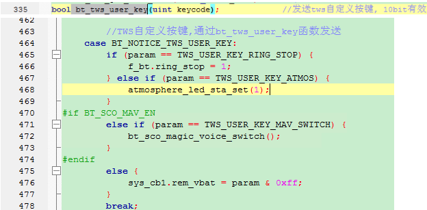
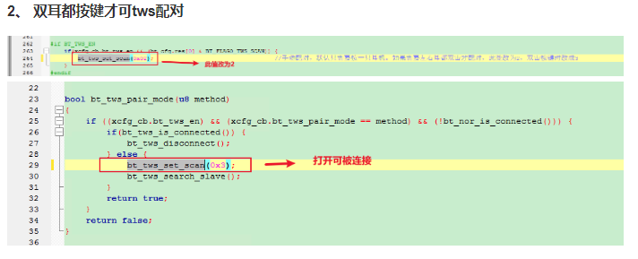
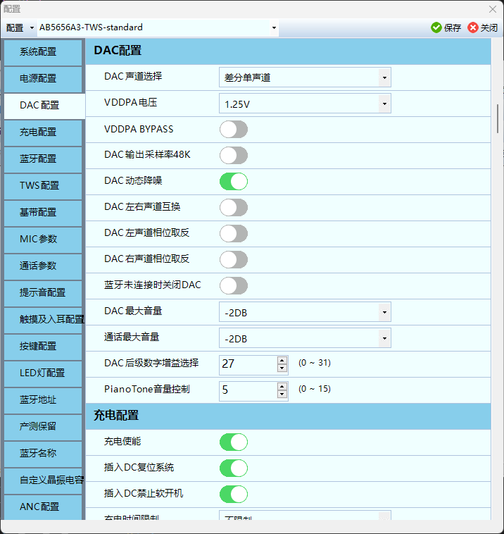

# 定频烧录是干嘛的

定频烧录是指在蓝牙耳机的生产过程中，将特定的蓝牙通信频率信息写入耳机的蓝牙模块硬件中。这个频率通常是**耳机与蓝牙设备（如手机、电脑等）进行配对和数据传输时所使用的无线电波频率**。简单来说，它是一个将预设频率“烧录”到耳机中的技术步骤，确保耳机能够按照设计要求与外部设备通信。

定频烧录在蓝牙耳机开发中起到了以下几个重要作用：

1. **确保通信兼容性**
    蓝牙技术使用2.4GHz ISM频段进行通信，这个频段内有多个频道。定频烧录通过设定正确的频道和频率，确保耳机能够与各种蓝牙设备顺利配对和通信，避免因频率不匹配而导致的连接问题。
2. **提高连接稳定性**
    在2.4GHz频段内，存在许多其他无线设备（如Wi-Fi路由器、其他蓝牙设备等）的信号干扰。定频烧录通过设置特定的频率和参数（如跳频序列），减少干扰，从而提升耳机与设备连接的稳定性。
3. **满足法规要求**
    不同国家和地区对无线电频率的使用有严格的法律法规。**定频烧录确保耳机使用的频率符合目标市场的无线电管理规定，避免因违规而无法上市销售。**
4. **支持个性化设置**
    在某些情况下，定频烧录还可以用来调整耳机的特定功能或性能参数，以优化用户体验或满足不同用户的需求。

## 疑问

**那就是说如果我在中国使用美国版本的耳机，因为频率不一样，是有可能存在于耳机连接不上的蓝牙设备的？对吗？**

蓝牙设备使用的是 **2.4GHz ISM频段**，这个频段在全球范围内是通用的。但不同国家和地区对这个频段内的具体使用规则（比如频道分配和发射功率）有各自的法规要求：

- **中国**：由国家无线电管理委员会监管，可能对某些频道的使用有限制，或者对发射功率有更严格的要求。
- **美国**：由FCC（联邦通信委员会）制定标准，可能允许不同的频道或功率范围。

如果美国版本的耳机在设计时没有完全符合中国的法规要求，比如使用了在中国受限的频道或超过了允许的发射功率，那么在连接蓝牙设备时可能会出现问题，比如连接不稳定或完全无法连接。

**实际情况**

不过，在现实中，这种情况发生的概率很低，原因如下：

- **全球兼容性**：大多数蓝牙耳机（尤其是知名品牌的产品）在设计时会考虑到全球市场的需求，确保频率设置符合多个国家和地区的法规要求。因此，美国版本的耳机通常也能在中国正常使用。
- **自适应跳频（AFH）**：蓝牙技术内置了自适应跳频功能，可以自动检测周围的无线电干扰并跳到可用的频道。这意味着即使某些频道在某个国家不可用，耳机也能调整自己以适应当地环境，提高连接的稳定性。

### 是否存在万精油频率

**定频烧录的作用**

在蓝牙耳机开发中，**定频烧录**是指将特定的蓝牙通信频率信息写入耳机的蓝牙模块硬件中。这个过程的目的是让耳机具备基本的通信能力，确保它能够与蓝牙设备（如手机、电脑等）进行配对和数据传输。蓝牙技术使用的是**2.4GHz ISM频段**，这个频段在全球范围内是通用的，因此理论上可以为硬件烧录一个基础的频率设置。

**“万精油频率”是否可行？**

您提到的“万精油频率”，可以理解为一个通用的频率设置，让蓝牙耳机在全球范围内都能正常工作，而无需针对不同国家和地区的法规要求进行调整。表面上看，这似乎是可行的，因为2.4GHz ISM频段是全球通用的。然而，实际情况要复杂一些：

- 法规差异：不同国家和地区对2.4GHz频段内的具体使用规则（如频道分配和发射功率）有各自的法规要求。例如：
  - 在中国，国家无线电管理委员会可能限制某些频道的使用，或对发射功率有严格要求。
  - 在美国，FCC（联邦通信委员会）制定的标准可能允许不同的频道或功率范围。
- **实际操作**：虽然可以烧录一个基础的频率信息，但仅仅依靠这个“万精油频率”无法完全满足所有地区的法规要求，也无法保证在各种使用环境下的最佳性能。

**定频烧录的局限性与补充机制**

定频烧录只是为硬件提供了一个**基本的频率起点**，但蓝牙耳机的实际兼容性和稳定性并不完全依赖于此。以下因素在实际使用中起到了关键作用：

- **自适应跳频（AFH）功能**：蓝牙技术内置了这一功能，可以自动检测周围的无线电干扰，并动态调整到可用的频道。这种机制大大增强了耳机在不同环境下的连接稳定性。
- **设计与固件支持**：大多数蓝牙耳机在设计时会考虑全球市场的需求，通过硬件和软件的配合，确保频率设置能够适配多个国家和地区的法规要求。
- **其他影响因素**：设备之间的兼容性、固件版本以及周围的无线干扰等，也会影响耳机的性能。

# 软件开发问题

## 提示音

### 替换

默认读取的资源文件位置：


**中英文的提示音以及anc和eq的资源**


如果需要替换的话，新建一个相同结构文件夹然后去配置工具中选择即可。


相同命名的sbc会被替换掉，其他还是使用默认的提示音。


提示音的选择有三种：

- TONE音，电子音
- 语音，有人声的提示音
- 无提示音

#### 问题

**同名替换的是TONE音还是语音？**

- 按道理来讲应该是有同一状态下有两种提示音的
- 替换TONE音或者替换语音怎么办？

**同名替换的是语音。tone是内部自带的，不能替换。**

##### 配置工具没有语音类型但是SDK中有语音的SBC文件

**替换了max_val的提示音，是语音类型，但是配置工具中没有，只有tone音和无提示音。选择无提示音就可以播报语音了。**

#### sbc文件的生成

提示音格式：要求转换前应该是wav格式


如果不是，需要使用工具转换一下格式，还可以裁剪掉提示音的静默部分，缩小提示音大小


最后使用SBC脚本就可以使用得到SBC文件了，放到对应文件夹即可。

### 新增

之前没有的，属于新增提示音。


增加一个名称为balabala.sbc的提示音，重新编译一下代码就可以在app\projects\earphone\res.h中看到对应的宏定义


其他定义可以参照下面的音效实现。

app\platform\bsp\bsp_piano.h中定义一种提示音的名称


**app\platform\bsp\bsp_warning_play.c绑定对应提示音**


**使用提示音：**


- **后面是提示音的类型，可以在配置工具配置的，会去配置文件中读取。**

- **自己硬编码的应该可以直接指定？**

### 替换TWS同步相关提示音？？？？？


## 如何把打印打开（需要开发板）

### 开启打印

**去config.h中打印配置中选一个串口的引脚，常用PB3，但是有一个灯效也是用PB3所以使用时需要避免冲突，不需要打印时，把宏修改回去。**

硬件的配置：

- app\platform\header\config_define.h


选中一个引脚（**一般使用PB3**）做打印，在配置中开启：

- app\projects\earphone\config.h
- 在配置工具中把有关灯效关闭，避免冲突。


- 不使用时，把宏改回来。打印信息在配置工具中可以看到。

## 扩展多击按键处理

**在配置工具中只能看到USER_DEF按键最多支持五击的设置，而没有六击的配置选项。这正是为什么需要通过代码修改来扩展六击功能的原因。**

### 六击的宏定义

```c
#define KEY_SHORT               0x000
#define KEY_SHORT_UP            0x800
#define KEY_LONG                0xA00
#define KEY_LONG_UP             0xC00
#define KEY_HOLD                0xE00
#define KEY_LHOLD               0x1E00
#define KEY_DOUBLE              0x1800      //2击
#define KEY_THREE               0x1900      //3击
#define KEY_FOUR                0x1A00      //4击
#define KEY_FIVE                0x1B00      //5击
#if Y90_UI_EN
#define KEY_SIX                 0x1C00
#endif
```

从这些定义可以看出：

1. **按键类型使用16位值的高字节部分**：所有按键类型都是在高字节部分定义的掩码值
2. 有序递增模式：
   - 多击按键从`KEY_DOUBLE`(0x1800)开始
   - 每增加一击，值增加0x100
   - 2击 = 0x1800
   - 3击 = 0x1900
   - 4击 = 0x1A00
   - 5击 = 0x1B00
   - 6击 = 0x1C00（遵循同样的模式）
3. **掩码用途**：这些值与`KEY_TYPE_MASK`(0x1f00)一起使用，用于从完整的按键消息中提取按键类型

### 六击宏定义的选择原则

因此，`KEY_SIX`的值`0x1C00`并不是随意选择的，而是遵循了以下原则：

1. **遵循现有序列**：按照2击到5击的递增模式，6击自然应该是0x1C00
2. **避免冲突**：确保这个值不会与其他按键类型定义冲突
3. **与掩码兼容**：确保这个值可以被`KEY_TYPE_MASK`(0x1f00)正确识别

### 扩展按键组合定义

为需要支持六击的按键添加组合定义：

```c
// 在bsp_key.h文件中
#define KFI_PLAY_USER_DEF       (KEY_PLAY_USER_DEF | KEY_FIVE)
#define KSI_PLAY_USER_DEF       (KEY_PLAY_USER_DEF | KEY_SIX)  //添加六击组合

#define KFI_PLAY_PWR_USER_DEF   (KEY_PLAY_PWR_USER_DEF | KEY_FIVE)
#define KSI_PLAY_PWR_USER_DEF   (KEY_PLAY_PWR_USER_DEF | KEY_SIX)  //添加六击组合
```

### 修改按键检测数组

`app\platform\bsp\bsp_key.c`

```c
AT(.com_rodata.multi.key)
#if Y90_UI_EN
const u16 key_multi_tbl[5] = {
    KEY_DOUBLE, KEY_THREE, KEY_FOUR, KEY_FIVE, KEY_SIX
#else
const u16 key_multi_tbl[4] = {
    KEY_DOUBLE, KEY_THREE, KEY_FOUR, KEY_FIVE
#endif
};
```

### 调整最大检测次数

修改按键初始化中的最大检测次数：

```c
// 在bsp_key.c文件中的key_init函数或类似函数中
AT(.text.bsp.key.init)
void key_init(void)
{
    int adc_ch = 0;
    key_var_init();

    memcpy(&key_cb.filter, &key_filter_tbl, sizeof(key_filter_t));
    if (xcfg_cb.kl_time_sel) {
        key_cb.filter.long_cnt = KEY_LONG_TIMES + (u32)xcfg_cb.kl_time_sel*120;  //配置长按时间
        key_cb.filter.hold_cnt = key_cb.filter.long_cnt + KEY_HOLD_TIMES;
    }

    key_cb.delay = ((u8)xcfg_cb.double_key_time + 2) * 20 + 1;
#if Y90_UI_EN
	key_cb.times = 6;
#else
    key_cb.times = 5;                                                           //按键最多检测几击？
#endif
    key_cb.tbl   = key_multi_tbl;
    memset(&key_multi_cb, 0, sizeof(key_multi_cb));

```

### 添加消息处理逻辑

在相关的消息处理函数中添加对六击消息的处理：

```c
// 在msg_bt.c或其他消息处理文件中
case KSI_PLAY_USER_DEF:
case KSI_PLAY_PWR_USER_DEF:
    // 添加您想要的六击功能
    if(!bt_tws_is_connected()){
        bt_tws_pair_mode(5);  // 例如：进入TWS配对模式
    }
    break;
```

### 注意事项

1. 配置工具兼容性：
   - 由于配置工具不支持六击设置，您可能需要在代码中硬编码六击功能，而不是通过配置工具配置
   - 或者考虑修改配置工具，添加六击的配置选项
2. 时间窗口设置：
   - 六击需要更长的时间窗口，确保`double_key_time`参数设置合理
   - 可能需要调整公式：`key_cb.delay = ((u8)xcfg_cb.double_key_time + 3) * 20 + 1;`，增加一些余量
3. 用户体验考虑：
   - 六击操作对用户来说可能较为复杂，确保用户能够理解并正确操作
   - 考虑为六击功能添加适当的反馈（如LED闪烁或提示音）
4. 代码兼容性：
   - 如果您的修改需要在多个项目间共享，考虑使用条件编译（如Y90_UI_EN）来控制功能
   - 确保修改不会影响现有功能的正常运行

## 恢复出产设置？？？

给从机发消息：

```c
		bt_tws_user_key(0x16);
        bt_clr_all_link_info('k');
        sys_cb.pwrdwn_tone_en = 1; //提示音
        sys_cb.discon_reason = 1; 
        func_cb.sta = FUNC_PWROFF;
```

关机的实现位置：

platform\functions\func.c

```c
		sys_cb.pwrdwn_tone_en = 1;
        func_cb.sta = FUNC_PWROFF;
```

发送给从机的消息：

platform\libs\api_btstack.h

```c
//自定义的USER KEY
#define TWS_USER_KEY_RING_STOP      0x101
#define TWS_USER_KEY_ATMOS          0x102
```

可以直接硬编码

platform\bsp\bsp_bt.c从机的消息处理逻辑：

```c
 //TWS自定义按键,通过bt_tws_user_key函数发送
    case BT_NOTICE_TWS_USER_KEY:
        if (param == TWS_USER_KEY_RING_STOP) {
            f_bt.ring_stop = 1;
        } else if (param == TWS_USER_KEY_ATMOS) {
            atmosphere_led_sta_set(1);
        } else if(0x16) {
            msg_enqueue(KFO_PLAY_PWR_USER_DEF);
        }
        break;
```

### TWS相关应用和接口

TWS之间传递信息

方法一:发送数据给对耳



方法二：bt_send_msg(BT_MSG_TWS_SYNC_INFO); 更新tws信息

```c
bool bt_get_tws_info(uint8_t *param);发送给对耳的信息
void bt_set_tws_info(uint8_t *param);设置获取到的对耳的信息
```

与手机端的相关应用和接口

自定义被发现和连接

在使用以下两个函数时需设置变量bt_cfg.scan_ctrl = 1;或者打开宏BT_DISCOVER_CTRL_EN
两个函数的区别，bt_set_scan_ctrl可以细化控制是否可被发现




## TWS

### TWS 组队和蓝牙配对灯效分析

#### 灯效函数分析

- **TWS 组队和蓝牙配对灯效函数**`func_bt_disp_status()` 函数将显示 TWS 组队和蓝牙配对各个阶段的灯效，每个阶段的灯效通过该函数 switch 语句中的对应 case 下的灯效函数进行显示，又分主副耳灯效。

`app\platform\functions\func_bt.c`

```c
AT(.text.bfunc.bt)
static void func_bt_disp_status(void)
{
    uint status = bt_get_disp_status();

    if(f_bt.disp_status != status) {
        f_bt.disp_status = status;
        func_bt_disp_status_do();
    }
    func_bt_dac_ctrl();
    func_bt_tws_bre_led_ctl();
}
```

- 先获取当前蓝牙显示状态 bt_get_disp_status()

- **如果状态有变化**，更新 f_bt.disp_status 并调用 func_bt_disp_status_do()

- 然后分别调用 func_bt_dac_ctrl() 和 func_bt_tws_bre_led_ctl()

##### 关键：func_bt_disp_status_do() 里的灯效处理

- **烧录两版软件，这个不用担心找不到左右耳自己的灯效子函数**

```c
void func_bt_disp_status_do(void)
{
    if(!bt_is_connected()) {
        en_auto_pwroff();
        sys_cb.sleep_en = BT_PAIR_SLEEP_EN;
    } else {
        dis_auto_pwroff();
        sys_cb.sleep_en = 1;
    }

    switch (f_bt.disp_status) {
    case BT_STA_CONNECTING:
        led_bt_reconnect();
        break;
    case BT_STA_INITING:
    case BT_STA_IDLE:
        led_bt_idle();
        // ... 省略 ...
        break;
    case BT_STA_SCANNING:
        led_bt_scan();
        break;
    case BT_STA_DISCONNECTING:
        led_bt_connected();
        break;
    case BT_STA_CONNECTED:
        led_bt_connected();
        break;
    case BT_STA_INCOMING:
        led_bt_ring();
        break;
    case BT_STA_PLAYING:
        led_bt_play();
        break;
    case BT_STA_OUTGOING:
    case BT_STA_INCALL:
        led_bt_call();
        break;
    }
    // ... 省略 ...
}
```

- 这里根据不同的蓝牙状态，调用不同的LED灯效函数（如 led_bt_reconnect()、led_bt_idle()、led_bt_scan()、led_bt_connected() 等）。

- 这些状态包括：正在连接、空闲、扫描、已连接、来电、播放、通话等。

##### TWS组队和配对的灯效

- TWS组队和蓝牙配对的过程，都会导致蓝牙状态的变化（如从“空闲”到“配对/连接/组队”）。

- 这些状态变化会触发 `func_bt_disp_status_do()`，从而调用不同的LED灯效函数。

- 例如：

  - 配对时，状态可能是 BT_STA_IDLE 或 BT_STA_CONNECTING，对应 led_bt_idle() 或 led_bt_reconnect()。

  - 组队成功后，状态变为 BT_STA_CONNECTED，对应 led_bt_connected()。

##### TWS专用灯效

- func_bt_tws_bre_led_ctl() 也会在 func_bt_disp_status() 里被调用，用于TWS呼吸灯等特殊效果。

- 但具体TWS组队的灯效，通常还是通过状态变化间接实现。

##### 总结

- func_bt_disp_status() 通过状态机机制，间接实现了TWS组队和蓝牙配对各阶段的灯效显示。

- 你可以通过扩展或重载 led_bt_xxx() 相关函数，来实现自定义的组队/配对灯效，而无需修改SDK核心流程。

#### 灯效函数流程

1. TWS 组队和蓝牙配对过程在左右耳机都**新下程序**的情况下：
   - 首次上电左右耳机首先显示**开机灯效**，然后进入 case BT_STA_SCANNING（func_bt_disp_status() 函数中的 case 语句）调用 led_bt_scan() 函数，**TWS 未组队和蓝牙未配对灯效**，亮300ms灭450ms，蓝红交替闪：
   - **这属于默认的回连操作？回连手机与对耳**
   - 如果有对耳朵有配对记录或者与手机有连接记录的话，都会回连。
     - 没有的话，两个耳机都是处于可发现可连接的状态，也就是BT_STA_SCANNING状态，被手机连接后会直接进入BT_STA_CONNECTED状态
2. 双击 USER_DEF 键将进行 TWS 组队（**主动**）：
   - 在配置工具中开启双击配对
   - 如果是双击MODE/POWER按键配对的话
     - 对应`bt_tws_pair_mode`要修改为5

```c
    ///双击按键处理
    case KD_PLAY_USER_DEF:
    case KD_PLAY_PWR_USER_DEF:
        if (xcfg_cb.user_def_kd_tone_en) {
            sys_warning_play(T_WARNING_NEXT_TRACK, 1);                  //2击“滴”一声
        }
        if ((xcfg_cb.user_def_kd_lang_en) && (!bt_nor_is_connected())) {
            bt_switch_voice_lang();
        } else if (user_def_key_msg(xcfg_cb.user_def_kd_sel)) {
#if BT_TWS_EN
        } else if(bt_tws_pair_mode(2)) {
#endif
        }
        break;

```

- 注意，此时耳机的蓝牙模块亦同时打开，**即 TWS 组队与蓝牙配对是同时进行的**。
  - 当 TWS 组队完成，蓝牙未配对，主耳（双击按键一方，最终将调用函数 bt_tws_search_slave(15000) ，然后被判定为主耳）
    - **烧录两版软件，谁双击开启搜索谁就是主机**
    - TWS匹配方式选择**如果是自动分配的话，主副是不确定的**。
    - **回连的话不知道主副是不是固定的？**
  - 主机进入 case BT_STA_IDLE 调用 led_bt_idle() 函数，亮300ms灭450ms，蓝红交替闪；并播放 TWS 组队提示音。
  - 副耳进入 case BT_STA_CONNECTED 调用 led_bt_connected() 函数，蓝灯亮100ms, 灭5S：
    - 从机已经连接上主机了

3. 当 TWS 组队完成，且蓝牙配对完成，主副耳都进入 case BT_STA_CONNECTED 调用 led_bt_connected() 函数，蓝灯亮100ms, 灭5S。
   - **这个时候可能有统一灯效的需求，可能想蓝牙配对之前都是一个灯效，不管TWS是否组队完成**

##### 相关函数

- bt_tws_is_connected() 函数用于**判断 TWS 组队是否完成**；

- bt_nor_is_connected() 函数用于**判断蓝牙配对是否完成**

- 蓝牙断开将进入 `case BT_NOTICE_DISCONNECT`

### 没有连接手机蓝牙之前统一灯效（实现）

#### 背景

- 配置工具中可以设置对耳的连接LED灯效。但是TWS配对成功时，会导致一个耳机处于连接状态（**TWS连接成功了**）一个处于未连接状态（**未连接手机**），从而导致灯效不一致。
- 正常来讲的话，应该是以连接手机为准，没有连接手机时的灯效一样。

#### 解决方案概述

通过在原有代码基础上增加四个关键部分的逻辑，实现了TWS连接后左右耳机灯效的统一显示**。**

1.**灯效显示逻辑改进（app\platform\functions\func_bt.c）**

**原有逻辑**：

```c
static void func_bt_disp_status(void)
{
    uint status = bt_get_disp_status();
    
    if(f_bt.disp_status != status) {
        f_bt.disp_status = status;
        func_bt_disp_status_do();
    }
    func_bt_dac_ctrl();
    func_bt_tws_bre_led_ctl();
}
```

- 先获取当前蓝牙显示状态 bt_get_disp_status()

- **如果状态有变化**，更新 f_bt.disp_status 并调用 func_bt_disp_status_do()

- 然后分别调用 func_bt_dac_ctrl() 和 func_bt_tws_bre_led_ctl()

**改进逻辑**：

- 之前是只有蓝牙显示状态改变时才执行灯效处理函数
- 现在扩大范围：把手机蓝牙的连接状态也加进来，手机蓝牙连接状态改变时也会执行灯效处理函数

```c
AT(.text.bfunc.bt)
static void func_bt_disp_status(void)
{   
    //获取当前的蓝牙显示状态
    uint status = bt_get_disp_status();

#if Y90_UI_EN
    //静态变量，用于保存上一次的手机蓝牙连接状态
    static bool nor_connect_disp_sta = 0;
    //获取当前的手机蓝牙连接状态
    bool nor_connect_sta = bt_nor_is_connected();
    //如果当前的蓝牙显示状态与上一次不同，或者当前的手机蓝牙连接状态与上一次不同，则更新灯效
    if(f_bt.disp_status != status || nor_connect_disp_sta != nor_connect_sta) {
        //更新手机蓝牙状态
        nor_connect_disp_sta = nor_connect_sta;
#else
    if(f_bt.disp_status != status) {
#endif
        //更新蓝牙显示状态
        f_bt.disp_status = status;
        //执行灯效显示状态处理
        func_bt_disp_status_do();
    }
    //执行蓝牙DAC控制
    func_bt_dac_ctrl();
    //执行蓝牙TWS呼吸灯控制
    func_bt_tws_bre_led_ctl();
}
```

2.**特定状态下的灯效统一（app\platform\functions\func_bt.c）**

**原有逻辑**：

```c
case BT_STA_IDLE:
    led_bt_idle();
    break;
    
case BT_STA_CONNECTED:
    led_bt_connected();
    break;
```

- TWS配对但是没有连接手机蓝牙的状态
  - 主机进入BT_STA_IDLE灯效
    - **主从机都没有连接TWS的话，最后也会进入BT_STA_IDLE？？？**
  - 从机进入BT_STA_CONNECTED灯效

**改进逻辑**：

- **双耳分左右烧录，不用区分4和5也行。**

```c
case BT_STA_IDLE:
#if FA11_UI_EN
	//双重保证
    if(bt_tws_is_connected()) {
        // TWS已连接但未连接手机时的灯效处理（主耳会进入）
        if(xcfg_cb.bt_tws_lr_mode == 4) {
            led_set_sta(0x00,0x60,0x04,0x19);
        } else if (xcfg_cb.bt_tws_lr_mode == 5) {
            led_set_sta(0x00,0x60,0x04,0x19);
        }
    } else {
        //没有配对成功，回连逻辑执行后，也会进入此状态
        led_bt_idle();
    }
#else
    led_bt_idle();
#endif
    break;
    
case BT_STA_CONNECTED:
#if FA11_UI_EN
	//这里副耳TWS组队成功后也会进入BT_STA_CONNECTED
	//主耳连接手机蓝牙后也会进入BT_STA_CONNECTED
    if(!bt_nor_is_connected()) {
        // TWS已连接但未连接手机的情况（副耳会进入这个）
        if(xcfg_cb.bt_tws_lr_mode == 4) {
            led_set_sta(0x00,0x60,0x04,0x19);
        } else if (xcfg_cb.bt_tws_lr_mode == 5) {
            led_set_sta(0x00,0x60,0x04,0x19);
        }
        break;
    }
#endif
	//这是主耳会进入的逻辑
    led_bt_connected();
    break;
```

**原本逻辑（未使能 Y90_UI_EN）**

- TWS配对但未连接手机蓝牙时：

- 主机（主耳）会进入BT_STA_IDLE，显示led_bt_idle()灯效。

- 从机（副耳）会进入BT_STA_CONNECTED，显示led_bt_connected()灯效。

- 这样左右耳在未连接手机蓝牙前，灯效是不一样的。

**修改后逻辑**

- 只要TWS已连接，且bt_tws_lr_mode为4或5：
  - 无论主机还是从机，只要处于BT_STA_IDLE、BT_STA_INITING、BT_STA_CONNECTED，且没有连接手机蓝牙（!bt_nor_is_connected()），都会统一调用led_set_sta(0x00,0x60,0x04,0x19)。

- 也就是说，只要TWS配对成功但还没连手机蓝牙，左右耳都会显示同一个灯效（即led_set_sta(0x00,0x60,0x04,0x19)）。

**3.强制更新灯效显示（app\platform\bsp\bsp_bt.c）**？？？？？？？？？？？？

**0xff的意义**

```c
void func_bt_status(void)
{
    while(1) {
        func_bt_disp_status();

        {
            func_bt_warning();
        }

        if(f_bt.disp_status != 0xff) {
            break;
        }
    }
}
```

- 这个函数是蓝牙主循环的一部分。

- 每次循环都会调用func_bt_disp_status()和func_bt_warning()。

- 只有当f_bt.disp_status != 0xff时，才会跳出循环，否则会一直循环。
  - func_bt_disp_status中状态发生变化时就会更新灯效。

**f_bt.disp_status = 0xff的意义**

- 0xff通常是一个无效/未初始化的状态，用来标记“需要重新获取和刷新状态”。

- 当某些情况下（比如休眠、异常、状态切换等），代码会把f_bt.disp_status设为0xff，表示“当前状态未知，需要强制刷新”。

**为什么会触发灯效更新？**

- 当f_bt.disp_status = 0xff时，下一次func_bt_disp_status()执行时：

- 会重新获取当前的蓝牙状态status。

- 由于f_bt.disp_status（0xff）和实际的status一定不同，所以会进入更新分支，调用func_bt_disp_status_do()，刷新灯效。

- 这样可以保证在状态不明或需要强制刷新的情况下，灯效能及时、准确地反映当前蓝牙状态。

**原有逻辑**：

**这是蓝牙消息？？？？？**

```c
case BT_NOTICE_DISCONNECT:
    bt_emit_notice_disconnect((u8 *)param);
    break;

case BT_NOTICE_CONNECTED:
    bt_emit_notice_connected((u8 *)param);
    break;

case BT_NOTICE_TWS_DISCONNECT:
    f_bt.tws_status &= ~0xc0;
    f_bt.warning_status |= BT_WARN_TWS_DISCON;
    break;

case BT_NOTICE_TWS_CONNECTED:
    bt_emit_notice_tws_connected((u8 *)param);
    break;
```

**改进逻辑**：

```c
case BT_NOTICE_DISCONNECT:
    bt_emit_notice_disconnect((u8 *)param);
#if FA11_UI_EN
    // 蓝牙断开连接时，强制更新灯效显示
    f_bt.disp_status = 0xff;
#endif
    break;

case BT_NOTICE_CONNECTED:
    bt_emit_notice_connected((u8 *)param);
#if FA11_UI_EN
    // 蓝牙连接成功时，强制更新灯效显示
    f_bt.disp_status = 0xff;
#endif
    break;

case BT_NOTICE_TWS_DISCONNECT:
    f_bt.tws_status &= ~0xc0;
    f_bt.warning_status |= BT_WARN_TWS_DISCON;
#if FA11_UI_EN
    // TWS断开连接时，强制更新灯效显示
    f_bt.disp_status = 0xff;
#endif
    break;

case BT_NOTICE_TWS_CONNECTED:
    bt_emit_notice_tws_connected((u8 *)param);
#if FA11_UI_EN
    // TWS连接成功时，强制更新灯效显示
    f_bt.disp_status = 0xff;
#endif
    break;
```

**改进说明**：

- 在四个关键的蓝牙状态变化事件中添加了强制更新灯效的代码
- 通过设置`f_bt.disp_status = 0xff`（无效值），强制在下一次调用func_bt_disp_status函数时更新灯效
- 这确保了在状态变化时，左右耳机都会更新灯效，保持一致

**函数名：bt_emit_notice**

- 这是一个蓝牙事件通知处理函数，用于响应蓝牙协议栈/驱动层发出的各种事件（如连接、断开、TWS连接/断开等）。

- 其作用是：当蓝牙底层发生关键事件时，通知上层做出相应处理，比如更新状态、刷新灯效、同步数据等。

**事件类型举例**

- BT_NOTICE_INIT_FINISH：蓝牙初始化完成

- BT_NOTICE_DISCONNECT：蓝牙断开

- BT_NOTICE_CONNECTED：蓝牙连接

- BT_NOTICE_TWS_DISCONNECT：TWS断开

- BT_NOTICE_TWS_CONNECTED：TWS连接

- ...（还有其他事件）

#### 为什么在这里赋值f_bt.disp_status = 0xff？

**作用**

- 赋值f_bt.disp_status = 0xff的目的是强制让上层的显示/灯效逻辑在收到这些关键事件后，立即刷新一次。

- 这是因为：

  - 蓝牙底层的事件变化有时不会直接改变f_bt.disp_status，而是通过事件通知机制让上层感知。

  - 如果不强制刷新，可能会出现状态已经变化但灯效没变的情况，导致用户体验不一致。

**具体流程**

1. 蓝牙底层发生事件（如断开、连接、TWS变化等）。

2. 调用bt_emit_notice，进入对应的case分支。

3. 在#if FA11_UI_EN下，赋值f_bt.disp_status = 0xff。

4. 上层主循环（如func_bt_status）检测到f_bt.disp_status == 0xff，会强制刷新一次灯效和显示状态。

#### “各状态变化不是原本就有吗？”——为什么还要这样做？

- 原本的状态变化（比如func_bt_disp_status里根据bt_get_disp_status()自动切换）是定期轮询的。

- 但有些底层事件（比如TWS断开、TWS连接、蓝牙断开等）是异步发生的，可能不会立刻被上层感知。

- 通过事件通知+强制刷新，可以保证所有关键状态变化都能第一时间反映到灯效和UI上，避免遗漏。

#### 方案工作原理

1. **全面的状态检测**：不仅检测蓝牙状态变化，还检测手机连接状态变化，确保在任何状态变化时都能更新灯效
2. **统一的灯效参数**：在TWS连接的情况下，为左右耳机设置相同的灯效参数，确保视觉一致性
3. **强制更新机制**：在关键状态变化点强制更新灯效显示，避免因状态不同步导致的灯效不一致

#### 原始灯效与改进后灯效的区别

##### 原始灯效行为

在原始SDK中，TWS耳机的灯效显示完全基于每个耳机自身的状态，导致以下情况：

1. TWS配对阶段：
   - 两只耳机都显示配对/搜索状态的灯效（通常是快速闪烁）
2. TWS连接成功但未连接手机阶段：
   - **主耳机**：显示为"已连接TWS但未连接手机"的状态，通常是某种特定的闪烁模式
   - **从耳机**：显示为"已连接"状态，因为从耳机视角它已经连接到了主耳机
   - **结果**：两只耳机显示不同的灯效，用户会看到不一致的视觉反馈
3. 连接手机阶段：
   - 只有主耳机与手机建立连接
   - **主耳机**：显示为"已连接手机"的状态
   - **从耳机**：仍然只显示"已连接TWS"的状态
   - **结果**：两只耳机可能仍然显示不同的灯效
4. 完全连接阶段：
   - 当主耳机成功与手机连接，并且信息同步到从耳机后
   - 两只耳机才会显示相同的"已连接"状态灯效
5. 休眠影响：
   - 在某些状态下，一只耳机可能进入休眠模式而关闭LED灯，而另一只保持活跃状态
   - 这进一步加剧了灯效的不一致性

##### 改进后灯效行为

改进后的方案通过多种机制确保TWS耳机在各个阶段都显示一致的灯效：

1. TWS配对阶段：
   - 与原来相同，两只耳机都显示配对/搜索状态的灯效
2. TWS连接成功但未连接手机阶段：
   - **关键改进点**：无论主从耳机，都显示相同的统一灯效
   - 通过`led_set_sta(0x00,0x60,0x04,0x19)`设置特定的灯效参数
   - 两只耳机显示完全相同的灯效，提供一致的视觉反馈
3. 连接手机阶段：
   - **关键改进点**：强制更新机制确保状态变化时两只耳机同步更新灯效
   - 通过设置`f_bt.disp_status = 0xff`触发灯效更新
   - 两只耳机显示相同的"已连接手机"状态灯效
4. 完全连接阶段：
   - 两只耳机显示相同的"已连接"状态灯效，与原来相同

##### 具体灯效差异示例

##### 场景一：TWS连接成功但未连接手机

**原始行为**：

- 主耳机：可能显示蓝灯慢闪（表示待连接状态）
- 从耳机：可能显示蓝灯常亮或特定模式闪烁（表示已连接状态）
- 用户体验：看到两只耳机灯光不同，可能误以为有一只耳机出现问题

**改进后行为**：

- 主耳机和从耳机：都显示相同的灯效模式（由`led_set_sta(0x00,0x60,0x04,0x19)`设置）
- 用户体验：看到两只耳机灯光一致，理解为TWS已连接但等待连接手机的状态

##### 场景二：主耳机连接手机过程中

**原始行为**：

- 主耳机：可能显示蓝灯快闪（表示正在连接状态）
- 从耳机：可能仍显示之前的状态灯效
- 用户体验：看到不同步的灯效变化，感到困惑

**改进后行为**：

- 通过强制更新机制，两只耳机同步更新灯效状态
- 用户体验：看到两只耳机同步变化的灯效，理解为系统正在连接手机

### TWS回连对耳和手机都是默认的？（证）

将TWS的配对方式都改为双击触发配对后，查看开机后是否进入回连配对，新烧录的情况下：

- 刚烧录的话，对耳都没有记录，开机灯效之后就是都属于**手机可发现可连接状态**，都是独立的个体。
  - 这个时候谁主动双击开启TWS搜索程序，谁就是主机，另一个就是副机。
  - 配对过，连接手机过之后，开机之后，首先就是回连（这是默认的）。

如果是将TWS的配对方式改为自动配对的话，一开机之后就会进入TWS搜索状态，但是主从不确定是左还是右边。

- 有对耳配对记录后，回连时就可以固定下来。

## 低功耗

### 灯效会消失，进入低功耗？（证）

#### 问题

**无论是手机连接状态还是未连接状态，灯光生效一部分时间后就没有了，经过了解是进入了低功耗状态，把灯光灭了。**

**app\platform\functions\func_lowpwr.c**

```c
    printf("sleep\n");
#if !USER_LED_SLEEP_EN
    bt_enter_sleep();

    led_off();
    rled_off();
#endif
```

**在什么条件下什么地方被调用？**

- `sfunc_sleep()` 是核心休眠实现函数
- 通常通过 [sleep_process()](javascript:void(0)) 包装函数调用
- 最终调用链：`app\platform\functions\func_bt.c的func_bt_process` -> [sleep_process()](javascript:void(0)) -> `sfunc_sleep()`
- 唤醒后会从 `sfunc_sleep()` 函数继续执行后续恢复操作

```c
	// 5. 睡眠处理
    if(sleep_process(bt_is_sleep)) {//bt_is_sleep判断蓝牙是否在睡眠状态
        /**
         * @brief 设置特殊状态值0xff，触发状态更新机制
         *
         * 这里的0xff是一个特殊的状态标志值，不是实际的蓝牙状态。
         * 当系统从睡眠状态唤醒时，需要重新获取当前的蓝牙状态并更新显示。
         *
         * 工作原理：
         * 1. 设置f_bt.disp_status = 0xff作为一个特殊标记
         * 2. 在func_bt_status()函数中，会检测到这个特殊值
         * 3. func_bt_status()会进入一个循环，不断调用func_bt_disp_status()直到状态更新完成
         * 4. func_bt_disp_status()会调用bt_get_disp_status()获取实际的蓝牙状态
         * 5. 当检测到状态变化时，会调用func_bt_disp_status_do()更新LED显示
         *
         * LED状态更新机制：
         * - 在func_bt_disp_status_do()中，根据不同的蓝牙状态调用不同的LED显示函数：
         *   * BT_STA_IDLE: led_bt_idle() - 蓝牙空闲状态LED显示
         *   * BT_STA_CONNECTED: led_bt_connected() - 蓝牙已连接状态LED显示
         *   * BT_STA_PLAYING: led_bt_play() - 音乐播放状态LED显示
         *   * BT_STA_INCOMING: led_bt_ring() - 来电状态LED显示
         *   * BT_STA_INCALL: led_bt_call() - 通话状态LED显示
         *
         * 因此，设置f_bt.disp_status = 0xff会触发整个状态更新链，最终导致LED状态根据当前蓝牙状态更新。
         */
        f_bt.disp_status = 0xff;                  // 设置特殊状态值，触发状态更新
    }
```

- 把核心随眠函数中的关灯函数注释掉也没用。
- `f_bt.disp_status = 0xff;` 灯效更新状态注释掉也没用
- 两者一起注释掉也没用。

#### 解决

把自定义休眠同步闪灯宏**USER_LED_SLEEP_EN**打开。默认休眠关灯那一部分逻辑就不会执行了。

## DAC输出

### 耳机的音量输出与手机实际显示比例不匹配（证）

手机的音量显示是一个很低的比例，但是耳机的起始音量很大了，先当与最大音量的上限提高了，导致调控比例的音量涨幅很大。

**标准**



把最大音量的上限降低，那么每次增加的音量幅度以及起始音量会处在一个合适的位置。


## 三方通话

### 二路来电时，挂断当前通话接听二路通话

当第二路通话进来时，耳机处于call状态。所以逻辑在`app\projects\earphone\message\msg_bt.c`的`sfunc_bt_call_message_do`函数中

```c
///挂断当前通话，或者结束当前通话并接听第2路通
    case KU_HSF:
        ku_sel = UDK_PLAY_PAUSE;
    case KU_PLAY_USER_DEF:
    case KU_PLAY_PWR_USER_DEF:
#if TS20
        //第二路来电时，单击挂断当前通话接听第二路，第二路来电时，耳机处于call状态
        //user_def_key_msg(BT_MSG_CALL_ANSWER_INCOM_REJ_OTHER);不行
        bt_call_answer_incom_rej_other();
#else
        user_def_key_msg(ku_sel);
#endif
        break;
```

从KU_HSF分支进来的话，功能被强制覆盖为`UDK_PLAY_PAUSE`，就是挂起当前通话接听二路通话。

`app\platform\libs\api_btstack.h`中有蓝牙通话的API可以直接使用：

```c
//蓝牙通话
#define bt_call_redial_last_number()            bt_send_msg(BT_MSG_CALL_REDIAL)     //电话回拨（最后一次通话）
#define bt_call_answer_incoming()               bt_send_msg(BT_MSG_CALL_ANSWER_INCOM) //接听电话，三通时挂起当前通话
#define bt_call_answer_incom_rej_other()        bt_send_msg(BT_MSG_CALL_ANSWER_INCOM_REJ_OTHER)	//接听电话，三通时挂断当前通话
#define bt_call_terminate()                     bt_send_msg(BT_MSG_CALL_TERMINATE)  //挂断电话
#define bt_call_swap()                          bt_send_msg(BT_MSG_CALL_SWAP)       //切换三通电话
#define bt_call_private_switch()                bt_send_msg(BT_MSG_HFP_PRIVATE_SWITCH)       //切换三通电话
#define bt_siri_switch()                        bt_send_msg(BT_MSG_SWITCH_SIRI)     //开关SIRI, android需要在语音助手中打开“蓝牙耳机按键启动”, ios需要打开siri功能
#define bt_siri_on()                            bt_send_msg(BT_MSG_SIRI_ON)         //打开语音助手

#define bt_ctl_ear_sta_change()                 bt_send_msg(BT_MSG_EAR_STA_CHANGE)
#define bt_ctl_nr_sta_change()                  bt_send_msg(BT_MSG_NR_STA_CHANGE)
```

## NTC

### 打开NTC的相关配置

`app\projects\earphone\config.h`使能相关配置并设置阈值

```c
//NTC充电控制
#define CHARGE_NTC_DETECT               1//0           //是否打开NTC充电控制功能，需要打开NTC功能，超出阈值停止充电
#define CHARGE_NTC_DETECT_VAL           45//70          //NTC充电检测阈值
```

在可视化工具中配置具体参数：

## 主从切换

### 方案一（从机不播pairing）

- **直接不播pairing的话直接在config中把提示音关掉即可。**

双耳TWS配对后，如果主机断开连接（比如进仓），此时发生主从切换。从机会变成主机，似乎状态会改变，从connect变成配对状态会播报pairing提示音（**这个只在普通连接模式下，音乐模式下并不会出现提示音播报**）。

客户要求主机断开后，从机不要播报pairing提示音。

`app\platform\functions\func_bt.c` 的`func_bt_warning`似乎有体现：

```c
static void func_bt_warning(void)
{
    u16 tws_warning;
#if Y90_UI_EN
    //记录当前耳机的主从状态，1：主，0：从
    static u8 ear_role = 1;//默认单耳主机
    //如果tws连接的话，就要分主从
    if(bt_tws_is_connected()){
        if(bt_tws_is_slave()){
            ear_role = 0;
        }
    }
#endif

    while(tws_res_is_busy()) {
        tws_res_proc();
    }

#if BT_TWS_EN
    tws_warning = func_bt_chkclr_warning(BT_WARN_TWS_DISCON | BT_WARN_TWS_CON);
    if(tws_warning) {
        func_bt_tws_status_update(tws_warning);
    }
#endif

    if(func_bt_chkclr_warning(BT_WARN_DISCON)) {
        func_bt_warning_discon();
    }

	if(func_bt_chkclr_warning(BT_WARN_CON)) {
        func_bt_warning_conn();
    }

#if BT_TWS_EN
    if(xcfg_cb.bt_tws_en) {
        u16 tws_warning = func_bt_chkclr_warning(BT_WARN_TWS_SCON | BT_WARN_TWS_MCON );
        if (tws_warning != 0) {
            func_bt_warning_tws_con(tws_warning);
        }
    }
#endif

    if(func_bt_chkclr_warning(BT_WARN_PAIRING)) {
        if (bt_tws_is_sync_voice()) {
            tws_res_play(TWS_RES_PAIRING);                          //左右耳同步播放pairing提示音
        } else {
            if (f_bt.w4_tws_warning) {                              //先等TWS Connected同步提示音播完
                f_bt.warning_status |= BT_WARN_PAIRING;
            } else {
#if Y90_UI_EN
                //如果单耳之前是从机的话，就不播报提示音
                if(ear_role == 0){
                    //没有动作
                } else {
                    //如果单耳之前是主机的话，才播报提示音
                    sys_warning_play(T_WARNING_PAIRING, PIANO_PAIR);
                }
#else
                sys_warning_play(T_WARNING_PAIRING, PIANO_PAIR);
#endif
            }
        }
    }
    ........
```

#### 疑问

**从机变成主机后，如果另一个耳机出仓连接上了，主从会切换回来吗？**

- 主从是针对tws来说的，不连接tws，走的是主机逻辑。

### 方案二（无论主从tws断开都要播放特定提示音）

**tws断开无论左右主从都要播报提示音**

在`platform\bsp\bsp_bt.c` 的bt_emit_notice中新增外部提示音（**语音**），但是不行。增加tone音类型就可以。

```c
void bt_emit_notice(uint evt, u32 param)
{
    switch(evt) {
    case BT_NOTICE_INIT_FINISH:
        bt_emit_notice_init_finish();
        break;

    case BT_NOTICE_DISCONNECT:
        bt_emit_notice_disconnect((u8 *)param);
#if Y90_UI_EN
        f_bt.disp_status = 0xff;
#endif
        break;

    case BT_NOTICE_CONNECTED:
        bt_emit_notice_connected((u8 *)param);
#if BT_RF_POWER_BALANCE_EN
        bt_power_balance_reconnect(0);
#endif
#if Y90_UI_EN
        f_bt.disp_status = 0xff;
#endif
        break;

    case BT_NOTICE_TWS_DISCONNECT:
        f_bt.tws_status &= ~0xc0;
        f_bt.warning_status |= BT_WARN_TWS_DISCON;
#if Y90_UI_EN
        //printf("进入BT_NOTICE_TWS_DISCONNECT");
        f_bt.disp_status = 0xff;
        //TWS断开单边提示音嘟嘟
        //sys_warning_play(T_WARNING_DUDU, 2);---------->不行，会进入未知状态
        //sys_warning_play(T_WARNING_NEXT_TRACK, 1);------->可以
#endif
        break;
```

### 方案三（最佳实践）

`platform\functions\func_bt.c`中的`func_bt_tws_status_update`。

```c
void func_bt_tws_status_update(u16 tws_warning)
{
    if(xcfg_cb.bt_tws_en) {
        func_bt_status_update();
        if(sys_cb.bt_tws_lr_mode != 0) {
            func_bt_tws_set_channel();
        }
#if LED_BREATHE_EN
        if ((tws_warning & BT_WARN_TWS_DISCON) && (sys_cb.breathe_led_sta >= T_BRE_TWS_CON)) {
            breathe_led_stop();
        }
#endif

#if Y90_UI_EN
        //编译报错&& (!bt_is_calling())
        // if ((tws_warning & BT_WARN_TWS_DISCON) && (!bt_is_playing()) && (!bt_is_ring())){
        //     sys_warning_play(T_WARNING_DUDU, 2);
        // }
        //包含bt_is_calling()
        if ((tws_warning & BT_WARN_TWS_DISCON) && (f_bt.disp_status <= BT_STA_CONNECTED)){
            sys_warning_play(T_WARNING_DUDU, 2);
        }
#endif

    }
}
```

在这里调用`sys_warning_play(T_WARNING_DUDU, 2);`就不会出现未知问题。

- 理论上pairing不关的话，TWS的主机断开后，从机进行主从切换后会播报pairing，但是这里没有播放。
- 具体原因不清楚，可能提示音不能被打断，先播放嘟嘟，这时即使进入pairing逻辑也不播报。
  - 由上面的代码就可以知道，调用的先后顺序。
- **UI没有明确要求pairing的话，安全起见把pairing的提示音关掉。**


## 单耳超距离后，不会自动配对回连

此后必现：**耳机配对成功后有个耳机灯还在交替闪烁，3S后才进入慢闪**

## DUT模式

先把模式在config中使能，不然状态切换后，逻辑代码不生效。

- **直接修改模式状态即可**

```c
#define BT_DUT_TEST_EN                  1//0   //蓝牙DUT测试使能-----DUT也是一个应用模式FUNC_BT_DUT，需要使能宏定义

#if FA11
    //六击按键进入DUT模式
    case KSI_PLAY_USER_DEF:
    case KSI_PLAY_PWR_USER_DEF:
        //手机不连接就可以进入DUT模式
        if (!bt_nor_is_connected()) { 
            tws_res_play(TWS_RES_TONE);//双耳同步嘟一声
            delay_5ms(100);
            //sys_warning_play(T_WARNING_NEXT_TRACK, 1);//单耳才行
            bt_tws_user_key(0x16);//给对耳发送信息同步进入DUT模式
            func_cb.sta = FUNC_BT_DUT;          //6击进DUT测试模式
        }
        break;
#endif


        //TWS自定义按键,通过bt_tws_user_key函数发送
    case BT_NOTICE_TWS_USER_KEY:
        if (param == TWS_USER_KEY_RING_STOP) {
            f_bt.ring_stop = 1;
        } else if (param == TWS_USER_KEY_ATMOS) {
            atmosphere_led_sta_set(1);
        }
#if FA11
        //不能实现同步进入DUT模式
        else if(param == 0x16){
            //对耳进入DUT模式
            //sys_warning_play(T_WARNING_NEXT_TRACK, 1);
            //delay_5ms(100);
            func_cb.sta = FUNC_BT_DUT;
        }
#endif 
        break;
```

- **必须要加延迟才可以同步进入DUT模式**

