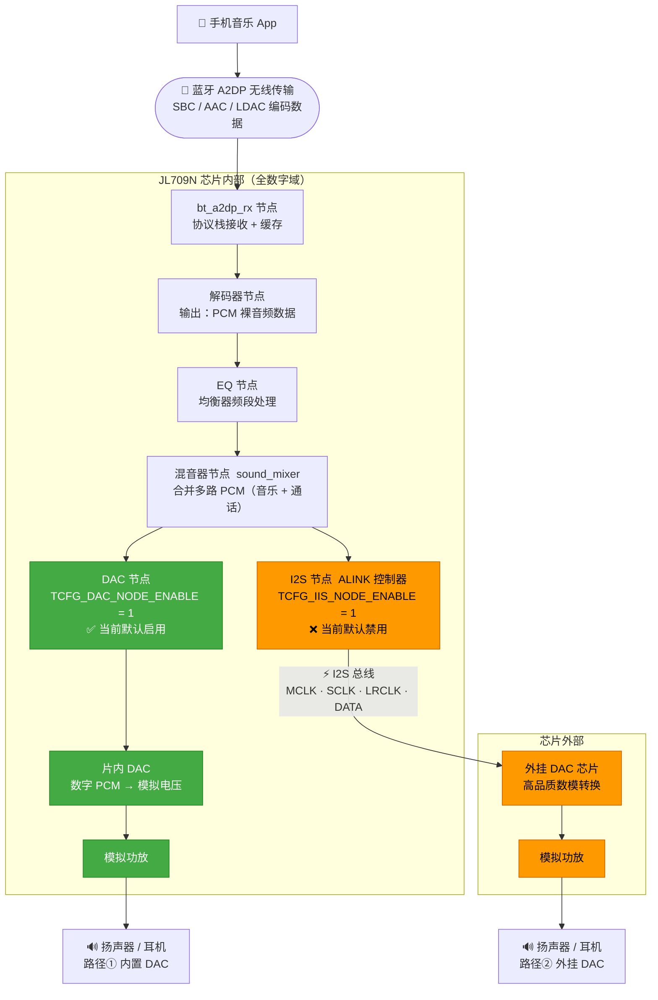
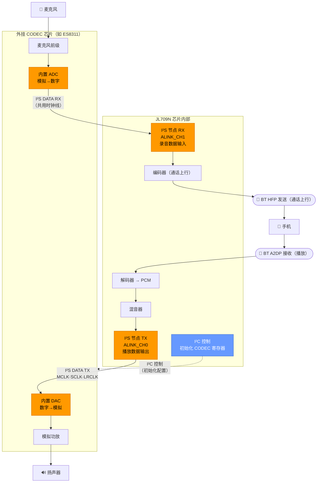
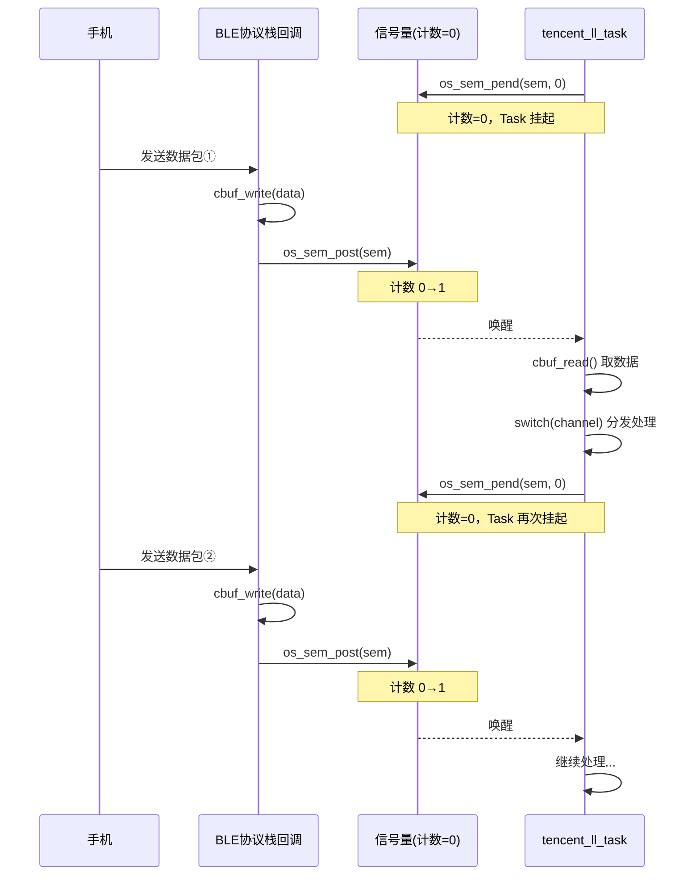
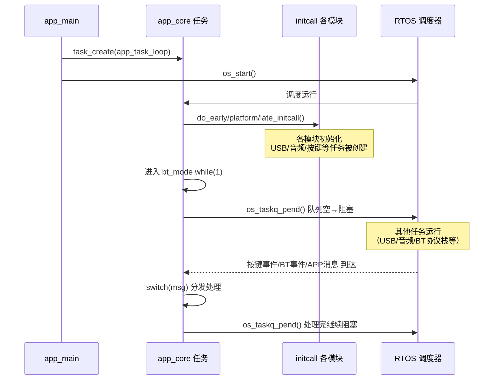

# UART 串口通信

## 基本概念

UART（Universal Asynchronous Receiver-Transmitter）是一种**异步串行通信协议**，数据一位一位按顺序传输，收发双方不共享时钟信号，靠约定好的波特率来同步。

- **异步通信**：没有时钟线，这是它与 SPI、I2C 的重要区别
- **波特率**：每秒传输的符号数，单位 bps。波特率 9600 代表每秒传输 9600 位，每位持续约 104 μs。接收方检测到起始位下降沿后，按波特率定时依次采样后续每一位。**双方波特率必须一致**，否则采样错位导致数据错误。常用波特率：9600、115200
- **三根线**：TX（发送）、RX（接收）、GND（共地），两设备之间交叉连接（A 的 TX 接 B 的 RX，A 的 RX 接 B 的 TX）
- **全双工**：TX 专门发送，RX 专门接收，两线互不干扰，可同时收发

## 数据帧结构

UART 以**帧**为单位传输，一帧是一次完整的通信单元：

```
空闲状态  起始位    数据位           校验位    停止位     空闲状态
高电平    1bit低   5~9bit（常8）    可选1bit  1~2bit高   高电平
```

| 字段     | 内容              | 说明                                                   |
| -------- | ----------------- | ------------------------------------------------------ |
| 空闲状态 | 高电平            | 无数据时总线保持高，接收方等待                         |
| 起始位   | 1 bit 低电平      | 一帧开始标志，接收方检测到下降沿后开始按波特率定时采样 |
| 数据位   | 5~9 bit（通常 8） | 低位（LSB）先发，逐位串行传输，合在一起才是要传的字节  |
| 校验位   | 可选 1 bit        | 奇校验或偶校验，也可不用                               |
| 停止位   | 1~2 bit 高电平    | 一帧结束标志，总线回到空闲状态，准备下一帧             |

发送方把字节按帧格式打包逐位发出；接收方从起始位开始逐位采样，采完停止位后将数据位重新拼成一个字节。连续传输多个字节就是连续发送多帧。

## 奇偶校验

### 计算方式

以数据位 `01101001` 为例（含 4 个 1）：

- **奇校验**：要求数据位 + 校验位中 1 的总个数为**奇数**，4 个 1 是偶数，所以校验位填 `1`，凑成 5 个（奇数）
- **偶校验**：要求总个数为**偶数**，4 个 1 已是偶数，校验位填 `0`，保持 4 个（偶数）
- 在数据帧里额外加一位，使得"数据位 + 校验位"里1的总个数满足奇/偶的约定。

### 接收方验证

接收方收到数据位和校验位后，自己数一遍 1 的个数，看是否符合约定规则。不符合则说明传输中某一位发生了翻转。

### 局限性

校验位只能检测**奇数个位**出错的情况。若同时有两位翻转，奇偶性不变，校验位无法发现错误。可靠性要求高的场合需配合上层 CRC 校验。

## 电平标准与物理层扩展

RS232 和 RS485 本质上都是基于 UART 的串口通信：数据层面（帧格式、波特率、起始/停止位）完全不变，唯一不同的是**物理层电平标准**。单片机只需在 IO 口外加一颗转换芯片，内部照常操作普通 UART，不需要改任何代码逻辑。

### TTL 电平

UART 本身使用 TTL 电平（0V/3.3V 或 0V/5V）：

| -            | 发送方输出         | 接收方判定       |
| ------------ | ------------------ | ---------------- |
| **高电平**   | > 2.4 V            | > 2.0 V 为逻辑 1 |
| **低电平**   | < 0.4 V            | < 0.8 V 为逻辑 0 |
| **噪声容限** | 中间区域不确定     | 不确定           |

与 PC 通信通常通过 CH340、CP2102 等 USB 转 UART 桥接芯片完成协议和电平转换。

### RS232

RS232 将电压幅度提高到 **±12V** 以增强抗干扰能力，但逻辑定义与 TTL **完全相反**：

| 逻辑   | TTL 电平 | RS232 电平       |
| ------ | -------- | ---------------- |
| 逻辑 1 | 高电平   | **-3V \~ -15V**  |
| 逻辑 0 | 低电平   | **+3V \~ +15V**  |

MAX232 做了两件事：**升降压 + 逻辑取反**（TTL 高电平 → -12V，TTL 低电平 → +12V）。通信距离约 15m，点对点。

### RS485

RS485 改用**差分信号**，靠 A/B 两线的电压差表示逻辑，与绝对电位无关：

- A - B > +200 mV → 逻辑 1
- A - B < -200 mV → 逻辑 0

"差分±7V"是总线共模电压的**容忍范围**（A、B 绝对电位可在 -7V \~ +12V 之间浮动，不是逻辑定义本身），这保证了长线上两端接地电位不同时差分信号仍能正确识别。MAX485 完成单端转差分 + 电平转换。通信距离约 1200m，支持一主多从（最多 32 个节点）。

### 三种接口对比

| 协议        | 电平           | 逻辑极性    | 通信距离      | 拓扑              |
| ----------- | -------------- | ----------- | ------------- | ----------------- |
| UART（TTL） | 0V / 3.3V 或 5V | 正逻辑     | 几十厘米～几米 | 点对点           |
| RS232       | ±12V           | **反逻辑**  | 约 15 m       | 点对点            |
| RS485       | 差分（共模±7V）| 差分正逻辑  | 约 1200 m     | 一主多从（32节点）|

## 硬件 UART vs 软件 UART

实现 UART 通信有两种方式：使用 MCU 内置的 UART 外设（硬件 UART），或用普通 GPIO 手动模拟时序（软件 UART / Bit-bang）。

### 硬件 UART

MCU 内部集成了专用的 UART 硬件外设，TX/RX 引脚由外设自动控制，CPU 只需把数据写入**发送寄存器**或从**接收寄存器**读出，其余全部由硬件完成。

**工作机制：**

- **发送**：CPU 把字节写入 TDR（发送数据寄存器），硬件自动加起始位、逐位移出、加停止位
- **接收**：硬件检测起始位下降沿，按配置的波特率自动采样，拼好后存入 RDR（接收数据寄存器），触发中断或 DMA 通知 CPU 来取
- **波特率**：由波特率发生器（BRG）分频系统时钟产生，精度高，与 CPU 负载无关
- **中断 / DMA**：接收完成、发送缓冲空等事件均可触发中断，也可配 DMA 实现零 CPU 占用的数据搬运

**GPIO 配置（以 STM32 为例）：**

| 引脚 | GPIO 模式                 | 原因                                       |
| ---- | ------------------------- | ------------------------------------------ |
| TX   | **复用**推挽输出（AF_PP） | 由 UART 外设接管驱动，推挽保证输出驱动能力 |
| RX   | 浮空输入 或 上拉输入      | 接收外部信号，上拉防止引脚悬空引入噪声     |

### 软件 UART（Bit-bang）

用普通 GPIO 口，在软件中按 UART 时序手动翻转电平，完全由 CPU 执行。硬件 UART 外设不够用时的备选方案。

**GPIO 配置：**

| 引脚 | GPIO 模式      | 原因                                         |
| ---- | -------------- | -------------------------------------------- |
| TX   | 推挽输出（PP） | 初始化为高电平（空闲状态），按帧格式逐位翻转 |
| RX   | 上拉输入       | UART 空闲为高，上拉防悬空，软件定时采样      |

**发送端核心逻辑（以 8N1 为例）：**

```c
gpio_write(TX, 0);                    // 起始位，拉低
delay_us(bit_time);
for (int i = 0; i < 8; i++) {
    gpio_write(TX, (data >> i) & 1);  // LSB 先发，每位保持 1 个 bit 时间
    delay_us(bit_time);
}
gpio_write(TX, 1);                    // 停止位，拉高
delay_us(bit_time);
```

**接收端核心逻辑：**

```c
wait_falling_edge(RX);       // 检测起始位下降沿
delay_us(bit_time * 1.5);    // 延迟 1.5 个 bit，跳到第 1 数据位中间采样
for (int i = 0; i < 8; i++) {
    data |= gpio_read(RX) << i;
    delay_us(bit_time);      // 每隔 1 个 bit 采样一次
}
```

接收端延迟 **1.5 个 bit 时间**而不是 1 个，目的是在每个数据位的**中间位置**采样，避开边沿跳变的不稳定区域；之后每隔 1 个 bit 时间采样后续位。

### 硬件 UART vs 软件 UART 对比

| 对比项       | 硬件 UART                      | 软件 UART（Bit-bang）              |
| ------------ | ------------------------------ | ---------------------------------- |
| 实现方式     | MCU 内置外设自动处理时序       | CPU 手动控制 GPIO 翻转             |
| CPU 占用     | 低（中断/DMA，发送期间 CPU 空闲）| 高（发送期间 CPU 忙等，无法响应其他任务）|
| 波特率精度   | 高（硬件分频，与 CPU 负载无关）| 受系统时钟精度和中断延迟影响       |
| 最高波特率   | 可达数 Mbps                    | 通常 ≤ 115200，越高越不可靠        |
| 引脚限制     | 只能用固定的 UART 复用引脚     | 任意 GPIO 均可                     |
| 抗中断干扰   | 强（硬件不受中断影响）         | 弱（中断打断可导致时序错乱）       |
| 适用场景     | 正式产品、高波特率、多路串口   | 硬件资源不足时的临时补充、低速低要求场合 |

# I2C通信

## 基本概念

I2C（Inter-Integrated Circuit）是一种**同步、半双工**的串行通信协议，由飞利浦公司（现 NXP）发明，广泛用于连接低速外设（传感器、EEPROM、显示屏控制器等）。

- **两根线**：SDA（Serial Data，数据线）和 SCL（Serial Clock，时钟线），比 SPI 省线
- **多主多从**：总线上可以挂多个主机和多个从机，靠 7 位或 10 位地址区分从机
- **半双工**：SDA 是双向数据线，收发共用同一根线，不能同时收发
- **同步通信**：**主机**提供 SCL 时钟，**从机**跟随时钟采样数据
- **需要上拉电阻**：SDA 和 SCL 都是开漏输出，必须接上拉电阻到 VCC（常用 4.7kΩ）

## 速率等级

| 模式     | 速率      |
| -------- | --------- |
| 标准模式 | 100 kbps  |
| 快速模式 | 400 kbps  |
| 高速模式 | 3.4 Mbps  |

**SCL 时钟由谁产生？**

SCL 始终由**主机**产生，从机没有时钟输出能力，只负责跟随 SCL 采样数据。SCL 并不是 MCU 的系统时钟（晶振频率，如 72MHz），而是由 MCU 内部的 I2C 外设对系统时钟（APB 总线时钟）**分频**后得到的较低频率，即上表中 100kHz / 400kHz 这些配置的目标值。从机完全不需要知道主机的系统时钟是多少，只需跟随 SCL 脉冲工作即可。软件模拟 I2C 时，SCL 的高低电平由 CPU 手动翻转 GPIO 产生，频率由延时决定。

## 时序与信号定义

I2C 所有信号都基于 SCL 和 SDA 两根线的状态变化。**空闲状态**：SDA 和 SCL 都保持高电平（由上拉电阻拉高）。

### 起始信号（START）

**SCL 为高时，SDA 从高变低。**

这是每次通信的开始标志。**总线上所有从机**检测到这个变化就知道通信要开始了，**进入监听状态**。

### 停止信号（STOP）

**SCL 为高时，SDA 从低变高。**

这是每次通信的结束标志，总线释放回空闲状态。

> 关键：START 和 STOP 是 I2C 中唯一允许在 SCL 高时改变 SDA 的情况，其他时候 SCL 高时 SDA 必须稳定。

### 数据传输规则

**SCL 低时才能改变 SDA；SCL 高时 SDA 必须稳定，此时接收方采样数据。**

- 因为在SCL为高时，SDA的变化会被识别为起始信号或者结束信号导致通信不完整。

每次传输 **8 位数据**，高位（MSB）先发。发完 8 位后，**发送方**释放 SDA（置高），等待**接收方**在第 9 个时钟周期给出应答。

### ACK / NACK 应答机制

每传输完 8 位数据，接收方必须给出一个应答位（第 9 个时钟周期）：

- **ACK（应答，低电平）**：**接收方主动拉低 SDA** → 表示"收到了，继续"
- **NACK（非应答，高电平）**：SDA 保持高电平（发送方释放，无人拉低）→ 表示"没收到 / 不接受 / 传完了"

**写操作**时从机给 ACK；**读操作**时每字节由主机给 ACK（最后一字节给 NACK 告知从机停止）。

## 数据帧格式

### 写操作（主机→从机）

- 先会有一个寻地址（找目标从机），从机回复ACK之后，就建立起通信实现点对点通信。
- 从机只有对寻址回复ACK之后才能对具体数据进行回复ACK

**寻址操作详细说明**：主机发送起始信号（START）后，紧接着发送7位从机地址和1位读写方向位（0表示写，1表示读），共8位。**所有从机都会接收这个地址，并与自身地址比较。**只有地址匹配的从机在第9个时钟周期拉低SDA（发送ACK），表示应答。如果地址不匹配，从机不会拉低SDA，主机将检测到NACK（高电平）。收到ACK后，主机与从机之间建立起点对点连接，随后可以传输数据字节。每个数据字节后都有ACK/NACK应答。如果主机收到NACK，可以发送停止信号（STOP）结束通信或重新尝试。

```
START → [7位地址 + W(0)] → ACK(从机)
      → [数据字节1]       → ACK(从机)
      → [数据字节2]       → ACK(从机)
      → ...
      → STOP
```

### 读操作（从机→主机）

```
START → [7位地址 + R(1)] → ACK(从机)
      ← [数据字节1]       → ACK(主机，继续读)
      ← [数据字节2]       → NACK(主机，最后一字节)
      → STOP
```

### 复合读操作（先写寄存器地址，再读数据）

大多数传感器需要先指定寄存器地址，再读取数据，需要用到**重复起始（Repeated START）**：

```
START → [地址 + W] → ACK → [寄存器地址] → ACK
      → Repeated START → [地址 + R] → ACK
      ← [数据字节]    → NACK → STOP
```

中间的 Repeated START 不需要先发 STOP，可以直接切换读写方向，避免总线被其他主机抢占。

## 地址机制

I2C 通过 **7 位地址**区分从机，理论上支持 128 个地址，但其中保留了部分特殊地址（如 0x00 广播地址、0x78\~0x7F 用于 10 位地址扩展），实际可用 **112 个从机地址**。

从机地址由芯片型号决定，部分芯片提供 ADDR 引脚，通过接高/低可改变地址低位，允许同一总线挂多颗相同型号的芯片（例如 ADDR 引脚接 GND 是 0x48，接 VCC 是 0x49）。

## 开漏输出与上拉电阻（重要）

I2C 的 SDA 和 SCL 都使用**开漏（Open-Drain）输出**：设备只能主动拉低总线，不能主动拉高，上拉电阻负责将总线恢复到高电平。

**为什么用开漏而不用推挽？**

1. **线与（Wired-AND）逻辑**：任何一个设备拉低总线，总线就是低电平。ACK 机制和多主仲裁都依赖这个特性。
2. **避免短路**：多个设备同时操作总线时，不会出现一个输出高、另一个输出低导致的电流对冲短路。
3. **电压兼容**：只要上拉电阻接到合适电压，3.3V 和 5V 设备可以共用同一总线（需注意电平兼容性）。

**上拉电阻选取：** 阻值过小功耗大但上升沿快；阻值过大上升沿慢影响速率。标准模式常用 4.7kΩ，高速模式需要更小的上拉电阻（1\~2kΩ）。

## 多主仲裁机制

当多个主机同时发起通信时，I2C 通过**总线仲裁**自动决定谁继续通信：

- 每个主机在发送数据的同时，监测总线实际电平
- 若主机发高电平，但总线实际是低电平（说明另一主机拉低了），该主机**立即停止发送**，退出仲裁
  
- 继续发低电平的主机感知不到任何异常，正常继续通信
- **结果：低电平优先，不会产生数据冲突，且通信不会中断**

**仲裁机制详细说明**：I2C总线采用“线与”逻辑，任何设备都可以拉低总线，但只能释放总线（靠上拉电阻拉高）。主机在发起起始信号前应检测总线空闲状态（SCL和SDA都为高），确保符合起始信号条件。当多个主机同时发起通信时，它们首先都会发送起始信号（START），起始信号时序相同，不会冲突。**仲裁发生在地址和数据传输阶段**。每个主机在发送每一位时都会检测SDA线的实际电平。如果主机尝试发送高电平（释放SDA），但检测到SDA为低电平（说明另一个主机正在发送低电平），则该主机立即知道自己失去仲裁，停止驱动SDA并切换为从机模式，监听获胜主机发送的后续数据。发送低电平的主机不受影响，继续通信。仲裁按位进行，直到只剩一个主机。**如果两个主机发送的地址和数据完全相同，则它们会继续同步传输，直到出现不同位**。低电平优先的仲裁机制确保不会产生数据冲突，且通信不会中断。注意：仲裁只发生在SCL为高电平时，因为此时SDA必须稳定；SCL为低时允许改变SDA，不会触发仲裁。

**总线含义**：I2C总线是共享的通信线路，所有设备的SCL引脚都连接到同一根SCL线上，所有SDA引脚连接到同一根SDA线上，形成公共通信通道。

**仲裁细节澄清**：

1. **多个主机同时发出起始信号**：起始信号完全相同（SCL高时SDA从高变低），不会发生仲裁，所有主机会同步开始。
2. **寻址阶段的仲裁**：在SCL为高时，如果不同主机发送的SDA电平不同（一个发高，一个发低），则发高电平的主机检测到总线实际为低，失去仲裁。
3. **已有主机通信时新主机介入**：起始信号要求SCL为高、SDA从高变低。规范要求主机在发起起始信号前检测总线空闲状态（SCL和SDA都为高）。在旧主机传输过程中，当传输数据位为1（SDA为高）且SCL为高时，新主机可能检测到SCL和SDA都为高并发起起始信号。此时两主机的SCL通过"线与"逻辑同步，仲裁从寻址阶段开始：若地址不同，寻址阶段即决出胜负；若地址相同，仲裁延续到数据阶段，按位比较直到出现不同位（发高电平的主机退出）。

## I2C 优缺点

**优点：**
- 只需两根线，硬件成本低，PCB 走线简单
- 支持多主多从，寻址灵活，一条总线可挂多个设备
- 有 ACK/NACK 应答机制，具备基本的通信确认能力

**缺点：**
- 半双工，速率低于 SPI
- 总线电容限制了挂载设备数量和通信距离（总线电容通常不超过 400pF）
- 软件模拟时序相对 UART 复杂，需要精确控制时序


# SPI 通信

## 基本概念

SPI（Serial Peripheral Interface）是一种**同步、全双工**的串行通信协议，由摩托罗拉公司发明，广泛用于高速外设（Flash、ADC/DAC、显示屏驱动、无线模块等）。

- **四根线**：MOSI（主发从收）、MISO（主收从发）、SCK（时钟）、CS/SS（片选），比 I2C 多线但速率更高
- **主从架构**：只有一个主机，可以有多个从机，主机提供时钟、控制通信节奏
- **全双工**：MOSI 和 MISO 各自独立，可以同时发送和接收数据
- **同步通信**：主机提供 SCK 时钟，收发双方按时钟边沿同步采样
- **无地址机制**：靠 CS（片选）引脚选中目标从机，每个从机需要独立一根 CS 线
- **无应答机制**：主机发完数据不会收到从机确认，与 I2C 的 ACK/NACK 不同

## 信号线说明

| 信号线 | 全称                       | 方向  | 说明                                               |
| ------ | -------------------------- | ----- | -------------------------------------------------- |
| MOSI   | Master Out Slave In        | 主→从 | 主机发送数据，从机接收                             |
| MISO   | Master In Slave Out        | 从→主 | 从机发送数据，主机接收                             |
| SCK    | Serial Clock               | 主→从 | 主机提供时钟，驱动收发双方在同一时钟边沿采样       |
| CS/SS  | Chip Select / Slave Select | 主→从 | 低电平有效，主机拉低选中目标从机；高电平时从机忽略总线 |

**SCK 时钟由谁产生？**

SCK 始终由**主机**产生，方向永远是主→从，从机没有时钟输出能力。SCK 并不是 MCU 的系统时钟，而是由 MCU 内部的 SPI 外设对系统时钟（APB 总线时钟）**分频**后输出的。从机自身即使有晶振，也与 SPI 通信时钟无关——从机只是被动地跟随主机送来的 SCK 边沿采样数据，完全听从主机的节奏。软件模拟 SPI 时，SCK 靠 CPU 手动翻转 GPIO 产生，速率由软件延时决定。

## 工作原理

SPI 通信的核心是**移位寄存器**机制：主机和从机各有一个移位寄存器，两者通过 MOSI 和 MISO 首尾相连，构成一个**环形**结构。

- 主机拉低 CS，选中目标从机
- 主机产生 SCK 时钟，每个时钟周期：MOSI 将主机移位寄存器最高位移出送入从机，同时 MISO 将从机移位寄存器最高位移出送入主机
- 经过 8 个时钟周期后，主机发出了一字节数据，同时也收到了从机的一字节数据——**收发同时完成**
- 传完一帧后，主机拉高 CS 释放从机

**全双工的含义**：每个时钟沿，主从双方各发一位、各收一位，是真正意义上的同时收发。即使主机只想**读数据**，也必须发送（通常发 0x00 或 0xFF 作为"哑字节"）来驱动时钟，从机才能把数据送出来。

**为什么 SPI 必须全双工，而 UART 可以单线单向？**

根本原因在于**时钟的归属不同**。SPI 的 SCK 由主机产生，从机要发数据，必须靠主机的 SCK 来驱动它的移位寄存器移位——没有 SCK 从机根本无法输出数据。而 SCK 一旦产生，就同时推动了主从两侧的移位寄存器，MOSI 和 MISO 上的数据必然同步流动，**收和发在物理上不可分离**，这是 SPI 全双工的硬性约束。

UART 则完全不同：TX 和 RX 两根线**互相独立、没有任何关联**，各自靠自己这一侧的波特率发生器计时，发送方按波特率移出数据，接收方按波特率采样，两者只靠"约定好相同的波特率"来对齐，不存在共享信号。因此 UART 可以只用 TX 单向发送，或只用 RX 单向接收，不需要另一根线的配合。

## 四种工作模式（CPOL 与 CPHA）

SPI 的时序由两个参数决定：

理解这两个参数之前，先明确每个时钟周期内的两个动作：

- 因为是同一个时钟周期内会发出与接收到一个二进制。
- **采样（Latch）**：在某个时钟边沿读取数据线上的电平，锁存为当前位的值

- **移位（Shift）**：在另一个时钟边沿将移位寄存器移位，同时在数据线上**准备好下一位**数据

每个时钟周期有两个跳变沿，一个用来**采样**，另一个用来**移位**，交替进行。

- **CPOL（时钟极性）**：定义 SCK 空闲时的电平，决定了哪个沿是"第一个沿"
  - CPOL = 0：SCK 空闲为**低电平** → 第一个有效边沿是**上升沿**
  - CPOL = 1：SCK 空闲为**高电平** → 第一个有效边沿是**下降沿**

- **CPHA（时钟相位）**：定义采样在哪个边沿发生
  - CPHA = 0：在**第一个**边沿**采样**，在**第二个**边沿**移位**（第一位数据在 CS 拉低时就已准备好）
  - CPHA = 1：在**第一个**边沿**移位**，在**第二个**边沿**采样**（第一位数据在第一个边沿才推出）
  - 同一个周期内一个用来采样，另一个肯定用来移位。不能在同一个边沿进行两种操作，CPU干不过来！

### 以 Mode 0（CPOL=0, CPHA=0）为例

Mode 0 最为常见，以此说明一次完整的通信流程：SCK 空闲低电平，**上升沿采样，下降沿移位**。

```
CS  :  ‾‾‾|___________________________|‾‾‾

SCK :  ____|‾|_|‾|_|‾|_|‾|_|‾|_|‾|_|‾|_|____
            ↑ ↓ ↑ ↓ ↑ ↓ ↑ ↓ ↑ ↓ ↑ ↓ ↑ ↓ ↑ ↓
           采 移 采 移 采 移 采 移 ...（采=采样，移=移位换下一位）

MOSI:  ____[b7  |b6  |b5  |b4  |b3  |b2  |b1  |b0]____
            ↑CS↓时准备好b7，每个↓沿换下一位

MISO:  ____[b7  |b6  |b5  |b4  |b3  |b2  |b1  |b0]____
            ↑从机CS↓时准备好b7，主机在每个↑沿采样
```

完整流程：
1. **CS 拉低** → 从机被选中，主机与从机立即将各自要发的字节最高位（b7）放到 MOSI / MISO 上，等待第一个时钟沿
2. **SCK 第一个上升沿** → 双方同时**采样**：主机读 MISO 上的 b7，从机读 MOSI 上的 b7
3. **SCK 下降沿** → 双方同时**移位**：各自将下一位（b6）放到数据线上
4. 重复步骤 2~3，经过 **8 个上升沿**，1 字节收发同时完成
5. **CS 拉高** → 通信结束，从机释放 MISO（回到高阻态）

### 四种模式对照

| 模式   | CPOL | CPHA | SCK 空闲 | 采样边沿        | 移位边沿        | 常见应用                 |
| ------ | ---- | ---- | -------- | --------------- | --------------- | ------------------------ |
| Mode 0 | 0    | 0    | 低       | 上升沿（第1沿） | 下降沿（第2沿） | **最常用**，Flash、SD 卡 |
| Mode 1 | 0    | 1    | 低       | 下降沿（第2沿） | 上升沿（第1沿） | 部分 ADC                 |
| Mode 2 | 1    | 0    | 高       | 下降沿（第1沿） | 上升沿（第2沿） | -                        |
| Mode 3 | 1    | 1    | 高       | 上升沿（第2沿） | 下降沿（第1沿） | 部分 ADC                 |

> Mode 0 和 Mode 3 的采样边沿都是上升沿，Mode 1 和 Mode 2 的采样边沿都是下降沿。两对模式是"镜像"关系，区别只是 SCK 空闲极性相反。

**主从双方必须使用相同的模式**，否则采样错位导致数据错误。实际使用时查从机芯片手册确认它支持哪种模式，主机配置成一致即可。

## 多从机管理

SPI 没有地址机制，多从机时靠 **CS 引脚**区分。

### 独立片选（最常用）

**每个从机占用主机一根独立 GPIO 作为 CS**，主机同一时刻只拉低一根 CS，其余从机 CS 保持高电平、忽略总线：

```
主机 CS0 ──→ 从机1
主机 CS1 ──→ 从机2
主机 CS2 ──→ 从机3
（MOSI / MISO / SCK 三根总线所有从机共享）
```

**代价**：每增加一个从机就需要一根额外的 CS 引脚，从机数量多时主机引脚压力大。这是 SPI 相比 I2C 的主要缺点之一。

## CS 片选时序

- **CS 拉低（选中）**：从机进入工作状态，MISO 引脚从高阻态（三态）切换为输出，开始响应 SCK 和 MOSI
- **CS 拉高（释放）**：从机忽略总线，MISO 重新进入**高阻态**，不影响其他从机使用总线
- 部分从机要求 CS 拉低后需等待一段建立时间才能开始 SCK；每次片选结束后也需要保持 CS 高电平一段时间才能发起下一次通信——具体时序参考芯片手册

**高阻态的意义**：多个从机共用 MISO 线，未被选中的从机 MISO 必须处于高阻（相当于断开连接），否则多个输出同时驱动同一根线会产生冲突。

### 为什么只有MISO需要高阻态？

| 维度 | MOSI（主→从） | MISO（从→主） | 理论依据 |
|------|---------------|---------------|----------|
| **信号方向** | 主机→从机（单向） | 从机→主机（单向） | SPI全双工但方向固定 |
| **驱动源** | **唯一主机**驱动 | **多个从机**可能驱动 | 一主多从架构 |
| **多从机竞争** | ❌ 无竞争（主机独占） | ✅ 有竞争（多从机共享） | 总线共享拓扑 |
| **CS释放后** | 从机MOSI保持输入态 | 未选中从机MISO**必须高阻** | 避免总线冲突 |

**核心理论要点：**
1. **MOSI无竞争**：主机是MOSI线的**唯一驱动源**，所有从机MOSI引脚仅为输入，不存在多个驱动源竞争。
2. **MISO有竞争**：多个从机共享同一根MISO线，若未被选中的从机不进入高阻态，会导致：
   - 多个输出同时驱动同一根线
   - 逻辑电平冲突（一个拉高、一个拉低 → 短路风险）
   - 主机无法正确识别数据来源
3. **高阻态 = 电气隔离**：相当于从物理上"断开"未被选中从机与MISO总线的连接，确保**点对点**通信。

**面试回答要点：**
"SPI一主多从时，MISO需要高阻态而MOSI不需要，因为MOSI由主机单向驱动，无竞争；而MISO被多个从机共享，为避免多个输出同时驱动同一根线导致总线冲突，未被选中的从机必须将MISO置为高阻态。"

## 硬件 SPI vs 软件 SPI

| 对比项     | 硬件 SPI                           | 软件 SPI（Bit-bang）              |
| ---------- | ---------------------------------- | --------------------------------- |
| 实现方式   | MCU 内置 SPI 外设，自动处理时序    | CPU 手动控制 4 根 GPIO 翻转       |
| CPU 占用   | 低（中断 / DMA，传输期间 CPU 空闲）| 高（传输期间 CPU 忙等）           |
| 速率       | 高（可达主频的 1/2）               | 低，受 CPU 速度和中断延迟限制     |
| 引脚灵活性 | 只能用固定的复用引脚               | 任意 GPIO 均可                    |
| 适用场景   | 正式产品、高速传输（Flash、屏幕）  | 硬件 SPI 不足时的临时补充、低速场合 |

## SPI 优缺点

**优点：**
- 全双工，速率高，可达数十甚至数百 Mbps
- 时序简单，无起始/停止位，没有地址开销
- 数据帧长度灵活，不限于 8 位，支持连续数据流
- 从机硬件实现极简，只需移位寄存器

**缺点：**
- 需要 4 根线，多从机时每个从机额外占用一根 CS，引脚消耗大
- 无应答机制，主机无法确认从机是否正确接收
- 只支持一主多从，不支持多主（与 I2C 不同）
- 传输距离短，通常只用于板级通信

## SPI vs I2C 选型参考

| 对比项     | SPI                              | I2C                                |
| ---------- | -------------------------------- | ---------------------------------- |
| 线数       | 4 线（+每从机 1 根 CS）          | 2 线                               |
| 速率       | 高（可达数十 / 百 Mbps）         | 较低（标准 100k，快速 400k，高速 3.4M）|
| 双工模式   | **全双工**                       | 半双工                             |
| 从机选择   | CS 片选引脚（硬件选择）          | 7 / 10 位地址（软件寻址）          |
| 应答机制   | 无                               | 有 ACK / NACK                      |
| 多主支持   | 不支持                           | 支持                               |
| 适用场景   | 高速外设（Flash、屏幕、无线模块）| 低速传感器、EEPROM、配置总线       |

> **选型口诀**：要速度选 SPI，要省线选 I2C，要长距离选 RS485。

# CAN通信

## 基本概念

CAN（Controller Area Network）是一种**多主、差分串行通信协议**，最初由博世公司为汽车电子系统设计，现已广泛应用于工业控制、医疗设备等领域。

- **多主架构**：任何节点都可以主动发起通信，通过仲裁机制避免冲突
- **差分信号**：使用 CAN_H 和 CAN_L 两根线，抗干扰能力强，适合电磁环境恶劣的场合
- **非破坏性仲裁**：优先级高的报文自动胜出，失败节点稍后重试，无数据损坏
- **强大的错误检测**：内置 CRC、ACK、位填充等多种校验机制，可靠性极高
- **广播通信**：所有节点都能收到同一报文，靠标识符（ID）区分报文含义

## 物理层

### "总线"是什么

"总线"是一个**抽象概念**，指所有节点共享的同一条通信媒介。物理上，CAN 总线就是两根导线（CAN_H 和 CAN_L），通常绞合在一起（双绞线）。网络中所有节点的 CAN_H 引脚都接在同一根线上，所有 CAN_L 引脚都接在另一根线上——这就是"总线"，本质上就是一对共享导线。

### 差分信号与逻辑判决

CAN 不靠单根线的绝对电压表示逻辑，而靠 **CAN_H 与 CAN_L 的电压差**：

| 逻辑 | 典型电压 | 差分电压（H − L） |
|------|---------|-----------------|
| **显性（0）** | CAN_H ≈ 3.5 V，CAN_L ≈ 1.5 V | 约 +2 V |
| **隐性（1）** | CAN_H ≈ CAN_L ≈ 2.5 V | 约 0 V |

**电压不是固定死的**——接收方看的是差值是否超过阈值（ISO 11898 定义：差值 > 0.9 V 判为显性，< 0.5 V 判为隐性）。线缆上难免有噪声，但共模噪声会同等叠加到 H 和 L 两根线上，两线相减后噪声抵消，差值依然准确，这正是差分信号抗干扰的核心原理。

**隐性状态**是总线"无人驱动"时由终端电阻拉到的自然平衡状态（H = L）；只要任意节点驱动两线产生差分，总线立即变为显性。**显性（0）天然优先于隐性（1）**，这是仲裁机制的物理基础。

**终端电阻**：总线两端各接 **120 Ω**（并联后 60 Ω），有两个作用：
1. **阻抗匹配**：消除长线末端的信号反射（这是主要作用，短线可以省略但长线不行）
2. **恢复隐性状态**：无节点驱动时，120 Ω 将 CAN_H 和 CAN_L 拉到同一电位（均约 2.5 V），差分为 0，总线自然回到隐性（1）

**这一点和 I2C 的上拉电阻本质相同**：都是在"没有设备主动驱动"时，靠外部电阻把总线恢复到逻辑 1（空闲状态）。区别在于实现方式：

| 对比项 | I2C 上拉电阻 | CAN 终端电阻 |
|--------|------------|------------|
| 接法 | 每根线（SDA、SCL）各接一个上拉电阻到 VCC | 接在 CAN_H 与 CAN_L 之间，装在总线两端 |
| 恢复方式 | 线上无人拉低 → 上拉到 VCC → 高电平（逻辑 1） | 无人驱动差分 → H 和 L 被拉到同一电位 → 差分为 0 → 隐性（1） |
| 去掉会怎样 | 总线永远无法回到高电平，通信完全失效 | 短距离可能仍能工作，长距离信号严重反射失真 |
| 主要作用 | 开漏输出的必要条件 | 长线阻抗匹配（"恢复隐性"是附带效果） |

### 与 RS485 对比

CAN 和 RS485 都使用双绞线差分信号，物理层原理相同，但定位不同：

| 对比项 | CAN | RS485 |
|--------|-----|-------|
| 判决阈值 | 差值 > 0.9 V 为显性 | 差值 > 200 mV 为逻辑 1 |
| 多主支持 | 内置非破坏性仲裁，天然支持多主 | 无内置仲裁，需上层协议（如 MODBUS）协调 |
| 通信模式 | 广播，所有节点同时收到同一报文 | 通常主从轮询 |
| 错误处理 | 内置 CRC、ACK、错误帧 | 无内置，依赖上层协议 |
| 典型应用 | 汽车网络、工业实时控制 | 工业 MODBUS、仪表通信 |

RS485 判决门限（200 mV）低于 CAN（900 mV），CAN 在恶劣电磁环境中的抗干扰裕量更大；RS485 配合 MODBUS 等协议更适合简单的主从场景。

## 帧类型

CAN 定义了四种帧类型：

| 帧类型 | 用途 |
|--------|------|
| **数据帧** | 携带实际数据，最常见 |
| **远程帧** | 请求其他节点发送指定 ID 的数据帧 |
| **错误帧** | 节点检测到错误时主动发出，通知全网 |
| **过载帧** | 节点处理不过来时请求延迟下一帧 |

## 数据帧结构（标准帧，11 位 ID）

```
帧起始 → 仲裁域 → 控制域 → 数据域 → CRC域 → ACK域 → 帧结束
```

| 域 | 说明 |
|----|------|
| **帧起始（SOF）** | 显性电平（0），同步所有节点开始接收 |
| **仲裁域** | 报文 ID，决定发送优先级；ID 越小（显性位越多）优先级越高 |
| **控制域** | 数据长度码（DLC），指定数据域字节数（0~8） |
| **数据域** | 实际有效载荷，最多 8 字节 |
| **CRC域** | 循环冗余校验，接收方验证数据完整性 |
| **ACK域** | 发送方发隐性 1，接收正确的节点回显显性 0 表示确认 |
| **帧结束（EOF）** | 连续隐性位，标志帧结束，总线释放 |

## 非破坏性仲裁

### 与 I2C 的共同本质

CAN 的仲裁和 I2C 的多主仲裁**本质完全相同**——都依赖**线与（Wired-AND）逻辑**和**"0 优先"原则**：

- 任何节点只要发出显性（0），总线就被"压"到显性；隐性是总线无人驱动时的自然状态
- 发出隐性（1）却读回显性（0）的节点，知道有更高优先级的节点存在，**立即退出**，不会破坏对方数据

区别在于**仲裁发生在哪里、用什么来仲裁**：

| 协议 | 仲裁阶段 | 仲裁内容 | 优先级规则 |
|------|---------|---------|-----------|
| **I2C** | 寻址阶段或数据阶段（哪位首先出现差异就在哪里决出） | 从机地址或数据 | 发低电平（0）的主机胜出 |
| **CAN** | 数据帧中专门的**仲裁域**（ID 字段） | 报文 ID | ID 值越小（高位 0 越多）优先级越高 |

CAN 的设计更系统：ID 被明确赋予优先级含义，工程师在分配 ID 时就能规划各类报文的传输优先级（例如把安全气囊报文 ID 分配为最小值，仪表盘报文 ID 分配为较大值）。

### 仲裁过程

所有节点检测到总线空闲后**同时**发出帧起始（SOF，显性 0），随后逐位发送报文 ID：

- 发送**隐性（1）**却读回**显性（0）** → 立即停止发送，转为接收模式，待总线空闲后重试
- 发送**显性（0）**的节点感知不到任何异常，继续发送后续位

经过 11 位 ID 的逐位竞争，唯一胜出者完成本次报文传输，失败节点的数据没有丢失——这就是"非破坏性"的含义。

## CAN 与其他串行协议对比

| 对比项 | CAN | UART | I2C | SPI |
|--------|-----|------|-----|-----|
| 线数 | 2（差分） | 2（TX/RX） | 2（SDA/SCL） | 4（MOSI/MISO/SCK/CS） |
| 拓扑 | 多主，总线型 | 点对点 | 多主多从，总线型 | 一主多从，总线型 |
| 最大速率 | 1 Mbps（经典 CAN）<br>8 Mbps（CAN FD） | 数 Mbps | 3.4 Mbps | 数十 Mbps |
| 错误检测 | CRC、ACK、位填充 | 可选奇偶校验 | ACK/NACK | 无 |
| 仲裁机制 | 非破坏性（ID 优先级） | 无（靠波特率同步） | 线与（低电平优先） | 无（靠 CS 片选） |
| 典型应用 | 汽车网络、工业控制 | 调试、设备间通信 | 传感器、EEPROM | Flash、显示屏 |

# I2S（IIS）接口

## 一、基本概念

I2S（Inter-IC Sound，芯片间音频数字接口）是飞利浦制定的一种串行音频总线协议，专门用于在**芯片之间**传输**数字 PCM 音频数据**，与 SPI 结构类似但多了一根字时钟线。

物理上只需四根线：

| 信号线 | 方向        | 作用                                                         |
| ------ | ----------- | ------------------------------------------------------------ |
| MCLK   | 主机 → 从机 | 主时钟（Master Clock），通常是采样率的 256 倍或 384 倍，给外挂 DAC 提供时钟参考 |
| SCLK   | 主机 → 从机 | 位时钟（Bit Clock），每个时钟边沿传输一个 bit                |
| LRCLK  | 主机 → 从机 | 左右声道时钟（Word Select），高电平=右声道，低电平=左声道    |
| DATA   | 双向        | 串行 PCM 数据，按 SCLK 节拍移位传输                          |

## 二、内置 DAC vs 外挂 DAC（通过 I2S）

JL709N 芯片内部集成了 DAC（模数转换器），正常开发不需要外挂。但芯片也通过 **ALINK 控制器**对外提供标准 I2S 接口，**可以连接高品质外部 DAC 芯片**。

```
┌─────────────────────────────────────────────────────────┐
│                      JL709N / BR56                       │
│                                                          │
│  [解码器] → [EQ] → [混音器]                              │
│                        │                                  │
│              ┌─────────┴──────────┐                      │
│              │                    │                       │
│         [DAC节点]           [I2S节点]                    │
│         (内置DAC)          (ALINK控制器)                  │
│              │                    │                       │
│         [模拟放大]         MCLK/SCLK/LRCLK/DATA ──────► 外挂DAC芯片
│              │                                            │
└──────────────│────────────────────────────────────────────┘
               ▼
            扬声器/耳机                               外挂DAC→模拟放大→扬声器
```

## 三、完整音频数据流（以蓝牙音乐播放为例）

两条路径共享上游的无线接收、解码、EQ、混音阶段，在最后的输出节点分叉：路径①走片内 DAC，路径②经 **I2S 总线**传输给外挂 DAC。



> **橙色**节点 = I2S 外挂 DAC 路径；**绿色**节点 = 内置 DAC 路径（当前默认）。
> I2S 只参与最后一段传输：从芯片内 ALINK 控制器，把 PCM 数字信号通过四根信号线送到芯片外的 DAC，芯片内部的解码、EQ、混音全程不涉及 I2S。

整条链路在框架层（`jlstream`）用"节点"抽象：每个节点是一个处理单元，通过 `stream_open/connect/start` 依次串联，数据从上游节点自动流向下游节点，开发者不需要手动管理每一步数据搬运。

## 四、外挂方案选择：单独 DAC 还是 CODEC？

JL709N 通过片内 **ALINK（Audio Link）控制器**对外暴露标准 I2S 接口，最多支持 4 个独立通道（ALINK_CH0 ~ ALINK_CH3），每个通道可单独配置为 TX（输出）或 RX（输入）。**SDK 同时支持单独 DAC 和 CODEC 两种外挂方案**，选哪种取决于产品需求：

| 外挂方案 | 典型芯片 | I2S 方向 | 是否需要 I2C 控制 | 适用场景 |
|---------|---------|---------|----------------|---------|
| **单独 DAC**（只播放）| PCM5102A、ES9023 | TX 单向输出 | 无需（引脚电平配置）| 高保真播放、蓝牙音箱 |
| **CODEC**（播放+录音）| ES8311、WM8960、ES8388 | TX + RX 双向 | 需要（寄存器初始化）| 通话耳机、带录音场景 |

两种方案在 SDK 框架层的区别**只是配置宏的差异**，底层 ALINK 硬件完全相同。

## 五、外挂单独 DAC 配置步骤（只播放）

需要改动**三个地方**，全部是配置项，**不涉及业务逻辑改动**：

**① 打开 IIS 功能开关 + 切换音频输出节点**

SDK 里用两组宏控制输出路径走向。第一组在板级配置头文件里，把 IIS 模块从禁用改为启用，同时指定方向（TX 输出）、通道编号、采样率（与外挂 DAC 型号匹配，通常 44.1k 或 48k），录音方向保持禁用。第二组在流媒体节点配置文件里，把内置 DAC 节点关掉、把 I2S 节点打开——两个节点互斥，音频流只能从其中一条路走到终点。

**② 把 MCU 设为主机**

外挂 DAC 本身不产生时钟，MCU 必须作主机（Master），向外输出 MCLK、SCLK、LRCLK 三路时钟，外挂 DAC 跟随时钟采样 DATA 线上的 PCM 数据。这同样通过一个枚举配置项设定，SDK 的 ALINK demo 里已有现成模板。

**③ 在板级初始化里绑定 GPIO 引脚**

把 ALINK 模块的四根信号线（MCLK、SCLK、LRCLK、TX DATA）各自对应到一个 GPIO 编号，引脚号根据实际 PCB 原理图填写，SDK 提供了结构体模板，只需填引脚号和方向（TX）即可。

配置完成后的数据流：


> 纯 DAC 芯片（如 PCM5102A）通常用引脚电平选择采样率，**不需要 I2C 控制**，接线只需 4 根 I2S 信号线，是外挂方案里改动最小的一种。

## 六、外挂 CODEC 配置步骤（播放 + 录音）

### 6.1 CODEC 的两套接口

CODEC（如 ES8311、WM8960）内部同时集成 DAC 和 ADC，对外暴露**两套接口**，职责完全分离：

```
                    ┌──────────────────────────────────┐
                    │           CODEC 芯片              │
                    │                                  │
MCU ──── I²C ──────►│ 控制接口（寄存器配置）             │
         （写寄存器  │  采样率 / 增益 / 电源 / 路由      │
          配置内部  │                                  │
          参数）    │                                  │
                    │                                  │
MCU ── I²S TX ─────►│ 数字音频接口                      ├──► 内置 DAC → 扬声器
MCU ── I²S RX ◄─────│  TX：PCM 播放数据（MCU→CODEC）    │◄── 内置 ADC ← 麦克风
         MCLK       │  RX：PCM 录音数据（CODEC→MCU）    │
         SCLK       │  时钟线三根共用                   │
         LRCLK      │                                  │
                    └──────────────────────────────────┘
```

- **I²C**：慢速控制总线，只在初始化时写一次寄存器（采样率、音量、麦克风增益、上下电顺序等）
- **I²S**：高速数据总线，实时传输 PCM 样本；MCLK/SCLK/LRCLK 三根时钟线 TX 和 RX **共用**，DATA 线各一根

### 6.2 需要改动的地方

与单独 DAC 相比，SDK 框架层的改动量几乎相同，**差异只有两点**：

**① RX 方向同时打开**：在功能开关里，TX（播放）和 RX（录音）都要启用，并分别指定各自的通道编号（如 TX 用通道 0，RX 用通道 1）。I2S 节点天然支持双向，SDK 框架不需要额外修改。

**② 多一根 DATA 线**：时钟三根线（MCLK/SCLK/LRCLK）TX 和 RX 共用同一组引脚，无需重复配置；DATA 线需要绑定两路——TX DATA 连到 CODEC 的 DAC 输入端（播放），RX DATA 连到 CODEC 的 ADC 输出端（录音），共 5 根线。

**③ 额外编写 I2C 初始化驱动（CODEC 独有）**：I2S 数据通路 SDK 已完整支持，但 CODEC 还需要在系统启动时，通过 I2C 向芯片写一批寄存器，配置采样率、麦克风增益、音频路由、上下电时序等。这部分 SDK 没有内置，需查对应芯片的 Datasheet 自行实现，也是接入外挂 CODEC 唯一需要从零写的部分。I2C 操作只在初始化时执行一次，运行期间不再操作。

### 6.3 接入工作量对比

| 工作项 | 是否 SDK 框架已支持 | 工作量 |
|--------|-------------------|--------|
| I²S TX 数据通路（播放） | ✅ 改宏即可 | 极少 |
| I²S RX 数据通路（录音） | ✅ 改宏即可 | 极少 |
| GPIO 引脚配置（5 根线）| ✅ 板级配置，填 IO 号 | 少 |
| I²C 控制驱动（CODEC 寄存器初始化）| 需自写 | 中等 |
| CODEC 寄存器手册阅读与调试 | 查芯片 Datasheet | 中等 |

数据通路本身改动极少，主要工作量在 I²C 控制驱动——需按 CODEC 芯片手册依次配置采样率、增益、路由和上下电时序，这部分与 I²S 传输无关，属于纯粹的 I²C 寄存器操作。

### 6.4 完整双向数据流



> I²S 负责高速实时的 PCM 数据搬运（橙色节点）；I²C 只在启动时做一次慢速寄存器配置（蓝色节点），两者职责完全分离。

## 七、主机 / 从机模式

| 模式                              | 场景                             | 时钟提供者                 |
| --------------------------------- | -------------------------------- | -------------------------- |
| 主机（Master，`TCFG_IIS_MODE=0`） | MCU 连外挂 DAC / ADC             | MCU 提供 MCLK、SCLK、LRCLK |
| 从机（Slave，`TCFG_IIS_MODE=1`）  | MCU 连另一颗主控芯片（双核场景） | 对端芯片提供时钟，MCU 跟随 |

双核 SDK（BR52）中，DSP 核与 MCU 核之间传递音频数据，也可以通过 I2S 从机模式实现（MCU 作为从机，接收 DSP 核提供的音频时钟和数据）。

## 八、音频初始化（`platform_initcall`）

音频框架在 `platform` 层统一初始化（`audio_setup.c`）：

```c
static int audio_init() {
    audio_volume_mixer_init(&vol_mixer);  // 音量混合器
    audio_common_initcall();              // ALINK 时钟、CLASSH 等通用配置
    wl_audio_clk_on();                   // 打开无线音频时钟（蓝牙同步用）
    audio_general_init();                // 通用初始化
    audio_input_initcall();              // ADC / MIC 输入初始化
    audio_dac_initcall();                // 内置 DAC 初始化（或 I2S 节点注册）
    return 0;
}
platform_initcall(audio_init);           // 注册到 platform 层，早于蓝牙/按键就绪
```

放在 `platform_initcall` 保证音频链路早于业务模块（蓝牙、触摸按键）就绪，蓝牙连上后能立刻播放，不需要等待音频初始化。


#  在 SDK 中的体现

## UART —— 调试打印输出

### 硬件 UART 还是软件模拟？

SDK 使用的是 **BR52 片内硬件 UART 控制器（UART0）**，不是 GPIO 软件模拟。

硬件控制器负责帧的拼装与移位，CPU 只需把字节写入寄存器，其余（起始位、逐位移出、停止位）全部由硬件完成。发送期间 CPU 可以去做其他事情，支持 DMA 搬运，不会因为中断打断而产生时序错位。

### DP 脚作为 TX 输出

调试 UART 的 TX 固定配置为 **DP 脚**（IO_PORT_DP，即 USB D+ 复用引脚）。连接方式极简：耳机板的 DP 脚 → USB 转 UART 模块的 RX，再加一根共地线，PC 端打开串口即可收到打印。

| 配置项 | 值 | 说明 |
|--------|-----|------|
| 使用的控制器 | UART0 | 片内硬件外设 |
| TX 引脚 | `IO_PORT_DP` | USB D+ 复用为 UART TX |
| RX 引脚 | `-1`（不接） | 只输出打印，不接收 |
| 波特率 | **1,000,000 bps**（1M） | 高速，需串口工具支持 |
| 当前状态 | **默认关闭** | `TCFG_DEBUG_UART_ENABLE = 0` |

> 想打开调试输出，只需在 `SDK/customer/DB_Mcdodo_ZENO_Pro_N5/sdk_config.h` 第 60 行把 `TCFG_DEBUG_UART_ENABLE` 改为 `1`，重新编译即可。

### 初始化位置

系统上电后，`system_main()` 在任何应用代码之前就调用 `debug_uart_init()`，因此从 Boot 阶段开始就能输出打印：

```c
// SDK/cpu/br52/setup.c
void system_main() {
    debug_uart_init();   // 最早期就初始化，之后的任何 printf 都能输出
    ...
}
```

`debug_uart_init()` 内部就是用一个结构体把 TX 引脚和波特率传给驱动：

```c
// SDK/apps/common/debug/debug_uart_config.c
void debug_uart_init() {
    const struct uart_config debug_uart_config = {
        .baud_rate    = TCFG_DEBUG_UART_BAUDRATE,  // 1000000
        .tx_pin       = TCFG_DEBUG_UART_TX_PIN,    // IO_PORT_DP
        .rx_pin       = -1,                         // 只发不收
        .tx_wait_mutex = 0,
    };
    uart_init(DEBUG_UART_NUM, &debug_uart_config);  // DEBUG_UART_NUM = 0
}
```

### printf 是怎么到 UART 的

```
printf(...)
  └─→ putbyte(char a)               // SDK/apps/common/debug/debug_uart_config.c
        └─→ __putbyte(a)
              └─→ uart_log_putbyte(0, a)   // 调用预编译库，写入 UART0 硬件寄存器
```

整个链路只走硬件寄存器，CPU 把字节塞进去就完事了，其余由 UART0 控制器完成串行发送。

## I2C —— 驱动心率芯片

### 软件模拟还是硬件控制器？

SDK **两种都支持**，通过同一套宏 API 抽象，上层驱动代码不感知底层差异：

```c
// SDK/apps/common/device/sensor/hr_sensor/hrSensor_manage.c
#if TCFG_HRSENOR_USER_IIC_TYPE
#define _IIC_USE_HW          // 定义此宏 → iic_api.h 的所有操作走硬件控制器
#endif
#include "iic_api.h"         // 无论软件还是硬件，上层调用的函数名完全一样
```

| `TCFG_HRSENOR_USER_IIC_TYPE` | 实现方式 |
|---|---|
| `0`（默认） | **软件模拟（Bit-bang）**，CPU 手动翻转 SCL/SDA |
| `1` | **硬件 I2C 控制器**，外设自动处理时序 |

**当前配置默认选软件模拟（0）**，原因是 GPIO 引脚选择更灵活，不受硬件控制器固定引脚的限制。

### 软件模拟的底层实现

软件 I2C 的核心就是用宏直接操作 GPIO 电平，和前面「软件 UART」的道理完全一样：

```c
// SDK/cpu/components/iic_soft.c
#define IIC_SCL_H(scl)    gpio_set_mode(...)   // SCL 拉高
#define IIC_SCL_L(scl)    gpio_set_mode(...)   // SCL 拉低
#define IIC_SDA_H(sda)    gpio_set_mode(...)   // SDA 拉高（释放，靠上拉电阻）
#define IIC_SDA_L(sda)    gpio_set_mode(...)   // SDA 拉低（开漏输出）
#define IIC_SDA_READ(sda) gpio_read(sda)       // 读 SDA 电平（用于 ACK 和接收）
```

发送一个字节时，CPU 循环 8 次，每次先拉低 SCL 把当前位放到 SDA，再拉高 SCL 让对方采样，然后再拉低——这就是软件模拟 I2C 时序的本质。

### 引脚配置

```
软件 I2C：SCL = IO_PORTC_06，SDA = IO_PORTC_07，延时计数 = 50（控制时钟频率）
硬件 I2C：SCL = IO_PORTC_04，SDA = IO_PORTC_05，时钟 = 100 kHz
```

两组引脚分开定义，切换 `TCFG_HRSENOR_USER_IIC_TYPE` 的同时引脚也随之切换。

### 支持的心率芯片

SDK 内置了两款 天翼核心 PPG 心率芯片的驱动：

| 芯片型号 | 路径 | 功能 |
|----------|------|------|
| **HX3011** | `SDK/apps/common/device/sensor/hr_sensor/hx3011/` | 心率、SpO₂、HRV、血压、佩戴检测 |
| **HX3918** | `SDK/apps/common/device/sensor/hr_sensor/hx3918/` | 同上，算法更新，SpO₂精度更高 |

两款芯片都是 **PPG（光电容积脉搏波）原理**：芯片内置绿光/红光/红外 LED 照射皮肤，用光传感器检测反射光强度变化，从而提取心率和血氧。

### I2C 读写流程

心率驱动的所有寄存器访问都走 `hrSensor_manage.c` 里的两个函数，体现了 I2C 的标准「复合读」模式（与前面 I2C 章节中的 Repeated START 完全对应）：

**写寄存器：**
```
START → [设备地址 + W] → ACK → [寄存器地址] → ACK → [数据] → ACK → STOP
```

**读寄存器（复合读）：**
```
START → [设备地址 + W] → ACK → [寄存器地址] → ACK
  → Repeated START → [设备地址 + R] → ACK
  ← [数据字节 1] → ACK  ← [数据字节 N] → NACK → STOP
```

代码里能清晰看到 Repeated START 的写法：先发写地址指定寄存器，再发 `iic_start()` 切换为读方向，最后一字节给 `NACK` 通知芯片停止输出：

```c
// SDK/apps/common/device/sensor/hr_sensor/hrSensor_manage.c
iic_start(iic_hdl);
iic_tx_byte(iic_hdl, dev_addr & ~0x01);   // 写地址，指定寄存器
iic_tx_byte(iic_hdl, reg_addr);
iic_start(iic_hdl);                        // Repeated START，切换为读
iic_tx_byte(iic_hdl, dev_addr | 0x01);    // 读地址
for (i = 0; i < len - 1; i++)
    buf[i] = iic_rx_byte(iic_hdl, 1);     // 每字节回 ACK，继续读
buf[len-1] = iic_rx_byte(iic_hdl, 0);    // 最后一字节回 NACK，通知芯片停
iic_stop(iic_hdl);
```

### Spinlock 保护 I2C 总线

#### 问题场景：双核 + 一主多从

BR52 是**双核处理器**（`CPU_CORE_NUM = 2`），两个核可以真正同时运行不同任务。当系统里挂了多个 I2C 从机（心率芯片、陀螺仪(头部追踪实现空间音效的)等），不同任务分别负责与不同从机通信，就可能出现两个核**同时进入同一段 I2C 函数**的情况。

**临界区**是从 `iic_start()` 到 `iic_stop()` 的**完整 I2C 事务**——这段过程必须原子执行，中途不能被另一个核插入。

#### 软件模拟 I2C：问题出在波形层

软件 I2C 的本质是 CPU 手动翻转 GPIO 电平。如果两个核同时执行 bit-bang，争的是**同一个 GPIO 寄存器的写入权**：

- 一个想写1，一个想写0

```
Core 0（Task A）：认为自己在发 START，把 SDA 拉低
Core 1（Task B）：同时认为自己在发数据位，把 SDA 拉高
→ 同一根引脚被两个核交替写入 → 从机收到的波形是乱码 → I2C 通信失败
```

spinlock 把整个 START→STOP 事务锁住，保证同一时刻只有一个核在翻转 SCL/SDA：

```c
spin_lock(&sensor_iic);
// iic_start() → 发地址 → 发/收数据 → iic_stop()  ← 临界区，另一个核在此期间空转
spin_unlock(&sensor_iic);
```

即使两个核心分别访问**不同的 I2C 从机**（例如 Core 0 读心率芯片、Core 1 写加速度计），它们仍然共享同一组 SCL/SDA 引脚（GPIO 寄存器）。因此，当 Core 0 已持有锁进行 I2C 事务时，Core 1 执行到 `spin_lock(&sensor_iic)` 会发现锁已被占用，随即进入**忙等循环**（空转），直到 Core 0 完成事务并调用 `spin_unlock`。这种设计保证了波形不会被交叉破坏，但要求临界区尽量短（I2C 单次事务通常仅几十~几百 µs）。

#### 硬件 I2C 控制器：问题上移到寄存器层

硬件控制器一旦启动事务，SCL/SDA 由控制器内部状态机驱动，CPU 不再直接操作引脚，**波形层的冲突不复存在**。但控制器本身是两个核共享的外设，其配置寄存器（目标地址、数据寄存器、启动位）是普通内存映射地址，硬件不阻止两个核同时写：

```
Core 0：往控制器写目标地址 0x44，准备发 START
Core 1：同时往同一控制器写目标地址 0x68
→ 寄存器被两次写入，最终发出哪个地址不确定 → 访问了错误的从机
```

所以硬件控制器**同样需要锁**，只是保护范围从"整个事务"缩小到"配置寄存器 + 启动事务"阶段，事务一旦跑起来硬件自己保证波形完整。

理论上，硬件控制器的状态机一旦启动，SCL/SDA 的时序便由硬件自动产生，CPU 不再参与。因此锁的范围可以缩小到**配置寄存器 + 启动事务**的阶段（即写目标地址、数据长度、触发 START 等）。然而，为了代码统一和简化，SDK 中的实际驱动（如 `hrSensor_manage.c`）仍使用同一个 `spin_lock` 保护整个 `iic_start()` 到 `iic_stop()` 的事务。这样做虽然稍保守，但避免了在事务中途检查硬件状态可能引入的复杂度，且由于硬件事务本身很快，额外锁定时长的影响可忽略。

| | 软件模拟 I2C | 硬件 I2C 控制器 |
|--|--|--|
| 竞争发生层面 | GPIO 寄存器（波形直接损坏） | 外设配置寄存器（访问错误从机） |
| 事务中 CPU 是否参与 | 全程参与 | 不参与，硬件状态机独立运行 |
| 需要锁的范围 | 整个 START→STOP 事务 | 仅配置 + 启动阶段 |

综上，**无论软件模拟还是硬件控制器，只要双核共享同一组 I2C 总线（引脚或外设），就必须用 spinlock 保护临界区**。区别仅在于竞争发生的层面：软件竞争在 GPIO 寄存器（波形级），硬件竞争在外设配置寄存器（控制级）。

#### Spinlock 的底层实现

Spinlock 不是 mutex 也不是 semaphore，三者都是同步原语但实现方式不同。Spinlock 直接依赖一条**硬件原子指令 `testset`**：

```c
// SDK/interface/driver/cpu/br52/asm/cpu.h
static inline void q32DSP_testset(u8 volatile *ptr)
{
    asm volatile(
        " 1:            \n\t "
        " testset b[%0] \n\t "   // 一个时钟周期内原子完成：读取并置位
        " ifeq goto 1b  \n\t "   // 已被占（置位失败）→ 跳回继续轮询
        : : "p"(ptr) : "memory"
    );
}
```

`testset` 在单个不可中断的时钟周期内完成"读→判断→写"：读到 0 就写 1 并退出（获锁成功），读到 1 就不写继续循环（空转等待）。芯片电路保证两个核绝不可能同时读到 0，原子性由硬件保证。

#### 为什么 spinlock 而不是 mutex

| 原语 | 等待方式 | 适用场景 |
|------|---------|---------|
| **Spinlock** | 忙等（CPU 空转轮询） | **多核** + 临界区极短；等待者和持有者在不同核上真正并行 |
| **Mutex** | 阻塞（OS 挂起任务） | 临界区较长，或单核 RTOS（spinlock 在单核任务竞争中会导致死锁） |
| **Semaphore** | 阻塞 | 任务间信号通知，不强调所有权 |

I2C 单次事务只需几十到几百微秒，Core 1 空转的时间极短，代价几乎可以忽略。反过来，如果用 mutex，每次都要触发 OS 调度切换（保存上下文→挂起→唤醒→恢复），开销反而比空转更大。**双核 + 极短临界区，spinlock 是最轻量的正确选择。**

## 信号量场景

### 信号量是什么

信号量（Semaphore）解决的是**"任务 A 需要等任务 B 做完某件事才能继续"**的问题。它让任务进入**阻塞态**，OS 可以调度别的任务，CPU 不浪费——这是它与 spinlock（忙等）的根本区别。

SDK 使用的 API（`interface/system/os/os_api.h`）：

```c
os_sem_create(OS_SEM *, int init_cnt); // init_cnt=0 → 初始不可用
os_sem_pend(OS_SEM *, int timeout);    // 阻塞等待，timeout=0 永久等
os_sem_post(OS_SEM *);                 // 发信号，唤醒等待方
```

### 事件循环（BLE 数据接收）

**文件**：`apps/common/third_party_profile/Tencent_LL/tencent_ll_demo/ll_task.c`（单核、双核代码完全一致）

**背景**：手机通过 BLE 发来数据包（设备信息、业务数据、OTA 升级包），MCU 需要及时处理。不能让处理任务一直轮询"有没有新数据"——那会白白占用 CPU。信号量在这里当**事件旗标**：没数据就进入阻塞态，数据到了才被唤醒。

#### 三个角色

- **初始化**：创建信号量和处理任务
- **生产者**：BLE 协议栈回调，数据到了写缓冲区 + `post`
- **消费者**：`tencent_ll_task`，循环 `pend`，醒了就取数据处理

#### 代码

```c
// ── 初始化 ──
int tencent_ll_task_init(void) {
    os_sem_create(&__this->ll_sem, 0);          // 计数器=0
    cbuf_init(&__this->cbuf, buf, size);        // 初始化环形缓冲区
    os_task_create(tencent_ll_task, ...);       // 创建处理任务
}

// ── 消费者：处理任务 ──
static void tencent_ll_task(void *arg) {
    while (1) {
        os_sem_pend(&__this->ll_sem, 0);        // 没数据时永久挂起

        // 被唤醒，从环形缓冲区取出数据包
        cbuf_read(&__this->cbuf, &head, HEAD_LEN);
        cbuf_read(&__this->cbuf, buffer, head.len);

        switch (head.packet_channel) {
            case LL_DEVICE_INFO_MSG_CH:
                ble_device_info_msg_handle(buffer, head.len);
                break;
            case LL_DATA_MSG_CH:
                ble_lldata_msg_handle(buffer, head.len);
                break;
            case LL_OTA_MSG_CH:
                ble_ota_msg_handle(buffer, head.len);
                break;
        }
        free(buffer);
        // 处理完，回到 while 顶部继续 pend
    }
}

// ── 生产者：BLE 协议栈回调 ──
void tencent_ll_packet_recieve(void *buf, u16 len) {
    cbuf_write(&__this->cbuf, buf, len);        // 数据写入环形缓冲区
    os_sem_post(&__this->ll_sem);               // 计数 0→1，唤醒处理任务
}
```

#### 时序图



这是经典的**生产者-消费者**模式。处理任务不轮询，不占 CPU，完全由数据到达事件驱动。

### 信号量 vs 互斥量

互斥量（Mutex）表面上是"初始值为 1 的二值信号量"，但 RTOS 把它们分开实现，原因是两个本质区别：

#### 区别一：所有权

| | 信号量 | 互斥量 |
|--|--|--|
| 谁能 release | **任何任务**都能 post | **只有加锁的那个任务**才能解锁 |
| 典型用途 | A 做完事通知 B | 保护临界资源，用完自己解锁 |

用信号量模拟互斥时，没有所有权约束，任何任务都可以意外 `post` 解锁，破坏临界区保护。

#### 区别二：优先级继承（解决优先级反转）

这是 mutex 最重要的存在理由。

**用信号量做互斥时，会发生优先级反转：**

```
任务优先级：H（高）> M（中）> L（低）

1. L 拿到信号量，进入临界区
2. H 来了，拿不到信号量，挂起等待
3. M 来了，抢占 L 开始运行（M 优先级比 L 高）
4. L 被卡住，无法释放信号量
→ 结果：H 要等 M 跑完才能继续——高优先级任务被中优先级任务卡死
```

**mutex 的优先级继承机制：**

```
1. L 拿到 mutex，进入临界区
2. H 来了，拿不到 mutex，挂起
   → OS 自动把 L 的优先级临时提升到 H 的级别
3. M 来了，发现 L 优先级和 H 一样高，抢不了
4. L 正常跑完，释放 mutex，优先级恢复原值
5. H 立刻拿到 mutex 继续执行
```

信号量没有所有权概念，OS 不知道"谁持有它"，自然无法做优先级继承。

#### 结论

> **互斥量 = 二值信号量 + 所有权 + 优先级继承**

用信号量"模拟"互斥在功能上勉强能跑，但在实时系统里会有优先级反转的隐患。RTOS 单独提供 mutex 接口，不是重复造轮子，是解决信号量在互斥场景下的先天缺陷。

## 阻塞态 vs 挂起态（重要概念澄清）

使用信号量、互斥量、消息队列等待时，任务进入的是**阻塞态（Blocked）**，不是挂起态（Suspended）。两者是不同的 RTOS 状态：

```
任务状态机：

          创建
           │
           ▼
         就绪态  ←─────────────────────────────┐
      (Ready)                                   │
           │  调度器选中                        │ 条件满足（信号量post/消息到达/互斥量释放）
           ▼                                    │
         运行态  ──os_sem_pend──────────→  阻塞态（Blocked）
      (Running)  ──os_taskq_pend────────→  等待某个条件，OS 自动唤醒
                 ──os_mutex_pend────────→

                 ──os_task_suspend──────→  挂起态（Suspended）
                                           不等任何条件，必须显式 resume
```

| | 阻塞态（Blocked） | 挂起态（Suspended） |
|--|--|--|
| **进入方式** | `os_sem_pend` / `os_taskq_pend` / `os_mutex_pend` | `os_task_suspend`（显式挂起） |
| **唤醒方式** | 条件满足时 OS **自动**唤醒 | 必须由另一个任务调用 `os_task_resume` |
| **等待目标** | 有明确的等待对象（信号量/队列/互斥量） | 无，纯粹被暂停 |
| **SDK 使用频率** | 极高，到处都是 | 极低，几乎不用 |

**结论**：信号量 `pend`、互斥量 `lock`、消息队列 `pend` 三者条件不满足时，都走同一套阻塞机制——OS 把任务从就绪队列移走放入等待列表，直到条件满足再自动放回。挂起是另一套机制，SDK 里几乎不用。

## 消息队列场景

### 消息队列是什么

消息队列（Message Queue）= **信号量的功能 + 携带数据**。信号量只传"有/没有"（计数），消息队列传的是具体的消息内容。队列为空时 `pend` 同样进入阻塞态，有消息时自动唤醒——底层机制与信号量相同，只是多了数据载体。

### SDK 整体框架：消息驱动架构

#### 入口：为什么只有一个主任务？

`app_main` 里只创建了一个任务：

```c
void app_main() {
    task_create(app_task_loop, NULL, "app_core");  // 只创建这一个
    os_start();  // 启动 RTOS 调度器，不返回
}
```

其他十几个任务不在这里创建，而是通过 **initcall 机制**在 `app_task_init()` 里批量注册：

```c
// 各模块在自己的 .c 文件里用宏注册初始化函数
late_initcall(usb_stack_init);        // usb_task.c，内部会 task_create(usb_task)
platform_initcall(audio_init);        // audio_setup.c
early_initcall(clock_manager_init);   // clock_manager.c
late_initcall(touch_key_init);        // sdk_board_config.c
```

`app_task_init()` 按顺序遍历调用这些函数：

```c
static struct app_mode *app_task_init() {
    // ...
    do_early_initcall();     // 最早期：时钟、配置工具
    do_platform_initcall();  // 平台级：音频框架、充电、LED
    do_initcall();           // 通用模块
    do_module_initcall();    // 功能模块
    do_late_initcall();      // 最后：USB任务、触摸按键
    dev_manager_init();      // 设备管理器（内部有信号量握手）
    // ...
}
```

这是从 Linux 内核借鉴的设计——各模块自己注册初始化函数，不需要改 `app_main`，解耦且按依赖顺序分层。

#### 初始化完成后：消息驱动主循环

所有模块和任务创建完毕后，主任务进入模式循环，核心就是不断 `os_taskq_pend` 等消息：

```c
// app_task_loop → app_enter_bt_mode → app_get_message → app_core_get_message
int app_core_get_message(int *msg, int max_num) {
    while (1) {
        int res = os_taskq_pend(NULL, msg, max_num);  // 队列空→阻塞态
        if (res != OS_TASKQ) { continue; }
        if (msg[0] & Q_MSG) { return 1; }             // 有消息→返回
    }
}

// BT 模式的主循环
struct app_mode *app_enter_bt_mode(int arg) {
    bt_mode_init();
    while (1) {
        app_get_message(msg, ...);        // 阻塞等消息

        switch (msg[0]) {
            case MSG_FROM_BT_STACK:
                bt_connction_status_event_handler(event);
                break;
            case MSG_FROM_KEY:
                // 按键处理
                break;
            case MSG_FROM_APP:
                bt_app_msg_handler(msg + 1);
                break;
        }
        // 处理完，回到 while 顶部继续 pend
    }
}
```

#### 完整框架时序



### 信号量 vs 消息队列对比

| | 信号量 | 消息队列 |
|--|--|--|
| **传递内容** | 只有计数（有/没有） | 携带具体消息数据 |
| **空时行为** | 计数=0，`pend` 进入阻塞态 | 队列空，`pend` 进入阻塞态 |
| **底层机制** | 相同，都是 OS 阻塞/唤醒 | 相同，都是 OS 阻塞/唤醒 |
| **典型用途** | 事件通知（"发生了"） | 消息分发（"发生了什么、参数是什么"） |
| **SDK 体现** | BLE 数据到达通知 | 主任务消息循环（按键、蓝牙状态等） |

## initcall 机制

### 背景：app_main 只创建一个任务

`app_main` 里只显式创建了 `app_core` 这一个任务。其余所有模块（USB、LED、音频、充电等）的初始化——包括它们各自任务的创建——都集中在 `app_task_init()` 里完成，而 `app_task_init` 使用的就是 initcall 机制统一管理。

### 原理

initcall 借鉴自 Linux 内核。**每个模块在自己的 `.c` 文件末尾用一行宏声明"我要在哪个层级初始化"，`app_task_init` 启动时按层级顺序统一调用所有已注册的函数，不需要改 `app_main`。**

### 五个层级

`app_task_init()` 按固定顺序调用五个层级：

| 调用顺序 | 层级宏 | SDK 中实际注册的模块 |
|--|--|--|
| 1（最早） | `early_initcall` | 时钟管理、配置工具 SPP/TWS、模式管理器 |
| 2 | `platform_initcall` | 音频框架、充电管理、**LED 驱动**、IIS 节点 |
| 3 | `initcall` | 通用模块 |
| 4 | `module_initcall` | 功能模块 |
| 5（最晚） | `late_initcall` | **USB 任务**、触摸按键、蓝牙频偏存储、电源管理 |

> GPIO、PMU 等寄存器级的硬件初始化在启动代码里更早完成，不属于 initcall 体系。

**LED 驱动（platform 层）**：开机状态灯需要尽早能亮，所以注册在较早的 `platform` 层，不能等到 `late` 阶段业务模块都起来了才初始化：

```c
// led_ui_api.c
int pwm_led_early_init() {
    __this = zalloc(sizeof(struct pwm_led_handler));
    led_effect_board_init(&board_cfg_hw_data);  // 内部创建 led_driver_task
                                                // 并用信号量做初始化握手（见前文场景一）
    return 0;
}
platform_initcall(pwm_led_early_init);
```

**触摸按键（late 层）**：触摸按键一旦初始化完成，用户随时可以交互。如果在 `platform` 层就初始化，用户按下按键，事件会沿调用链一路发到 `app_core`，但此时蓝牙协议栈和音频框架尚未启动，消息无法被正确处理。

实际调用链（sdk 实测，`bt_key_msg_table.c`）：

```
用户单击触摸板
  → ISR → os_taskq_post → lp_touch_key_task 醒来
  → lp_touch_key_ctmu_res_deal() → lp_touch_key_state_event_deal()
  → lp_touch_key_short_click_handle() → key_event_handler()
  → app_send_message_from(MSG_FROM_KEY, ...)
  → app_core 主任务从 os_taskq_pend() 醒来，根据 BT 状态分发：
      通话中：KEY_ACTION_CLICK → 接听/挂断电话  ← 需要蓝牙协议栈就绪
      音乐中：KEY_ACTION_CLICK → 暂停/播放      ← 需要音频框架就绪
```

将触摸按键放在 `late` 层，保证蓝牙、音频等核心模块全部初始化之后再启用按键，用户按下时功能必然可以正常响应：

```c
// sdk_board_config.c
static int touch_key_init(void) {
    lp_touch_key_init(&lp_touch_key_pdata);
    return 0;
}
late_initcall(touch_key_init);  // 触摸按键的初始化要在 PMU 和充电初始化之后
```

### 前后对比

**不用 initcall**——每加一个模块都要进 `app_task_init` 改一次，所有模块耦合在同一个文件：

```c
void app_task_init() {
    clock_manager_init();
    audio_init();
    pwm_led_early_init();
    usb_stack_init();
    touch_key_init();
    // 新增模块就在这里继续加...
}
```

**用 initcall**——各模块只管自己，`app_task_init` 的代码永远不变：

```c
// clock_manager.c
early_initcall(clock_manager_init);

// led_ui_api.c
platform_initcall(pwm_led_early_init);

// usb_task.c
late_initcall(usb_stack_init);

// sdk_board_config.c
late_initcall(touch_key_init);
```

### 好处

**一、代码简洁，模块解耦**：新增或删除一个模块，只需在该模块自己的 `.c` 文件中加或删一行宏，`app_main` 完全不用动。

**二、分层初始化，天然解决依赖顺序问题**：只需根据依赖关系选择合适的层级，框架保证 `early` 全部跑完才跑 `platform`，`platform` 全部跑完才跑 `late`，不需要人工排列调用顺序。

