# 蓝牙协议栈相关知识储备

## 面试定位：怎么谈蓝牙协议栈

蓝牙协议栈整体很复杂，直接背分层没有意义。面试时围绕 **TWS 耳机项目的三条链路** 来讲，让面试官听到的是真实的项目经验，而不是背书。

> 核心定位：**我对协议栈的理解是自上而下的——从业务需要出发，知道每个场景用哪条链路、哪个 Profile；链路层和基带层的细节在芯片 SDK 里封装好了，我更多是在事件回调和状态机这一层做业务逻辑。**

---

## 一、三条链路总览

TWS 耳机项目里，蓝牙通信本质上就是三条链路，每条用了不同协议：

```
手机   ──── 经典蓝牙（BR/EDR）────  主耳机    管"听"和"说"
手机   ──── BLE ────────────────  主耳机    管"配置"
主耳机  ─── TWS 私有协议 ──────── 副耳机    管"同步"
```

---

## 二、第一条链路：手机 ↔ 耳机，经典蓝牙，管"听"和"说"

### 音乐播放：A2DP

- 手机作为 **Source**，耳机作为 **Sink**
- 手机把 PCM 音频压缩成 **SBC 或 AAC** 通过经典蓝牙发过来
- 耳机芯片内解码还原成 PCM，送入 DAC 输出
- A2DP 走的是**异步链路**，允许重传，适合大数据量传输

### 通话：HFP

- HFP 建立的是 **SCO 同步链路**，专为语音设计
- 带宽固定、延迟低，不允许重传（丢了就丢了，和音乐传输机制不同）
- 耳机在 HFP 里扮演 HF（Hands-Free）角色，手机是 AG（Audio Gateway）

### A2DP 与 HFP 的切换

来电时需要从音乐模式切到通话模式，这是实际开发里接触最多的场景：
- 收到来电事件 → 挂起 A2DP 音频流 → 建立 SCO 通道 → 切到通话模式
- 挂断 → 释放 SCO → 恢复 A2DP 音频流

这个切换涉及两个 Profile 的状态协调，是 TWS 耳机业务逻辑的核心之一。

### AVRCP（附属于音乐场景）

- 媒体控制协议，负责耳机上的播放 / 暂停 / 上下曲等按键操作
- 也可以从手机同步获取当前歌曲信息（歌名、艺术家）

---

## 三、第二条链路：App ↔ 耳机，BLE，管"配置"

### 连接过程

1. 耳机上电后持续 **BLE 广播**（Advertising），让手机 App 能扫描到
2. App 发起连接，完成 **GAP 连接**
3. 连接建立后，App 和耳机通过 **GATT 自定义 Profile** 双向通信

### RCSP（Jieli 私有协议）

- 跑在 BLE 上，是芯片厂封装的一层私有协议
- 用途：EQ 调节、降噪模式切换、固件 OTA 升级、设备信息读取等控制类功能
- 本质是在 BLE 的 GATT 通道上定义了一套自己的命令格式

### SPP

- 和 RCSP 功能相近，但跑在**经典蓝牙**上，相当于经典蓝牙的串口透传
- 部分老款 Android 设备或特定场景下走这条路

### BLE 的核心概念

| 概念 | 作用 |
|------|------|
| **GAP**（Generic Access Profile）| 定义设备如何广播、扫描、建立连接 |
| **GATT**（Generic Attribute Profile）| 定义连接后数据如何组织和读写（Service / Characteristic） |
| **Advertising**（广播）| 设备未连接时持续发出的可被发现的信标 |

---

## 四、第三条链路：主耳 ↔ 副耳，TWS，管"同步"

### 数据转发

- 主耳从手机收到 A2DP 音频数据后，需要把数据**转发给副耳**
- 两只耳机基于同一份数据各自解码输出，保证双耳音频一致

### 时钟同步

- 两只耳机出声必须高度对齐（几十微秒内），否则有回声感
- 通过 TWS 私有协议同步**音频时钟**，而不是靠简单的数据复制

### 状态同步

除了音频，以下状态也需要在两耳间同步：
- 音量
- 降噪 / 通话模式
- 按键事件（副耳按键操作要同步到主耳再上报给手机）
- 入耳检测状态

### 主从角色切换

- 正常情况：主耳负责和手机连接，副耳挂在主耳下面
- 触发切换场景：主耳电量低、主耳入盒、用户手动切换
- 切换时副耳接管主耳角色，重新和手机建立经典蓝牙连接

---

## 五、连接管理（贯穿整个产品）

### 开机自动回连

上电后自动搜索并连接上次配对的设备，连接失败时有重试策略。

### 一拖二

同时维护两部手机的经典蓝牙连接，两条 A2DP 链路独立管理，来电 / 音乐的优先级由业务逻辑决定。

### 低功耗管理

- 经典蓝牙：sniff 模式，无数据时降低唤醒频率
- BLE：连接参数协商（连接间隔、从机延迟），App 断连后恢复广播

---

## 六、协议栈架构（背景理解，面试时不主动展开）

```
┌─────────────────────────────────────────────────────┐
│                    应用 / 业务层                      │
│  A2DP Sink │ HFP HF │ AVRCP │ GATT/RCSP │ TWS      │
├─────────────────────────────────────────────────────┤
│                  Profile 层                          │
├───────────────────────┬─────────────────────────────┤
│     经典蓝牙 Host      │        BLE Host             │
│  L2CAP / RFCOMM / SDP │  ATT / SM / L2CAP-LE        │
├───────────────────────┴─────────────────────────────┤
│              HCI（Host Controller Interface）         │
│        Host 与 Controller 的分界线                    │
├─────────────────────────────────────────────────────┤
│                  Controller                          │
│    Link Layer / Baseband / RF（射频、跳频、加密）     │
└─────────────────────────────────────────────────────┘
```

- **HCI 以上**：我在项目里实际接触和使用的层
- **HCI 以下**：芯片 SDK 封装好的库，不需要改，只需理解行为

---

## 七、面试回答模板

**问：你对蓝牙协议栈了解多少？**

> "我的了解主要来自 TWS 耳机项目，围绕三条链路建立起来的。第一条是手机和耳机之间的经典蓝牙——音乐走 A2DP，通话走 HFP，AVRCP 做媒体控制，实际开发里接触最多的是这两个 Profile 的状态切换，比如来电打断音乐、挂断后恢复。第二条是 BLE，主要是 App 连耳机做参数配置，耳机广播、App 连接后通过 GATT 自定义 Profile（RCSP）交互，OTA 升级也走这条路。第三条是两只耳机之间的 TWS 私有协议，做音频转发、时钟同步、状态同步和主从角色切换。协议栈底层的实现在芯片 SDK 里是封装好的，我更多是在事件回调和状态机这一层做业务逻辑。"

# 面经

## 手机蓝牙与耳机的连接过程？

连接过程分两种场景：**首次配对**（新设备，需要用户参与）和**自动重连**（已配对设备，开盖/上电自动完成）。在看具体流程之前，先理解蓝牙设备的几种工作状态。

---

### 蓝牙的几种工作状态

蓝牙设备在不同阶段处于不同的工作状态，理解这些状态是理解整个连接流程的基础：

| 状态 | 所属方 | 触发时机 | 通俗理解 |
|------|--------|---------|---------|
| **Inquiry**（查询） | 手机 | 点击"搜索蓝牙设备" | 手机在广播：**周围有没有设备？** |
| **Inquiry Scan**（查询扫描）| 耳机 | 上电初期开启，有超时，超时后自动关闭 | 耳机在监听：**有人找我吗？找到了就回应** |
| **Page**（寻呼） | 手机 | 用户选定目标后发起连接 | 手机在**呼叫某个具体 MAC 地址**的设备 |
| **Page Scan**（寻呼扫描）| 耳机 | 有配对记录时持续开启 | 耳机在等待：**我的主人快来连我了** |
| **Sniff**（嗅探省电）| 双方 | 连接后无数据传输时 | 双方约好只定期"打招呼"，**中间时间睡眠省电** |

> **Inquiry 和 Page 是两个独立阶段**：Inquiry 让手机"知道你在哪"，Page 才正式"建立连接"。已配对的设备重连时跳过 Inquiry，直接进入 Page。

耳机在不同场景下的状态切换（已由 SDK 中 `tws_dual_conn.c` 的逻辑验证）：

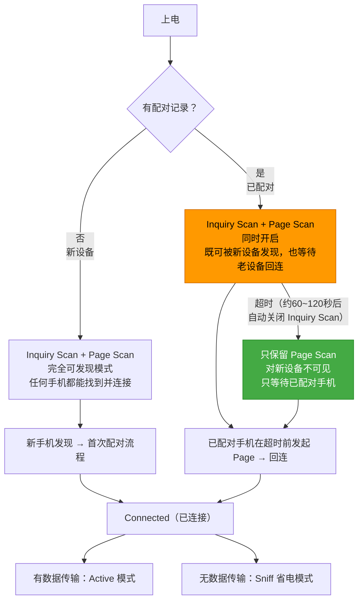

> 关键：有配对记录时，耳机**不是直接进 Page Scan**，而是先同时开 Inquiry Scan + Page Scan，给一段时间窗口让新设备也能发现它（比如换手机配对的场景）。超时后 Inquiry Scan 自动关闭，只保留 Page Scan 省电。橙色 = 短暂的双扫描窗口，绿色 = 常态的等待回连。

---

### 场景一：首次配对

用户第一次把耳机和手机配对，全程分三个阶段：**发现 → 配对 → Profile 连接**。

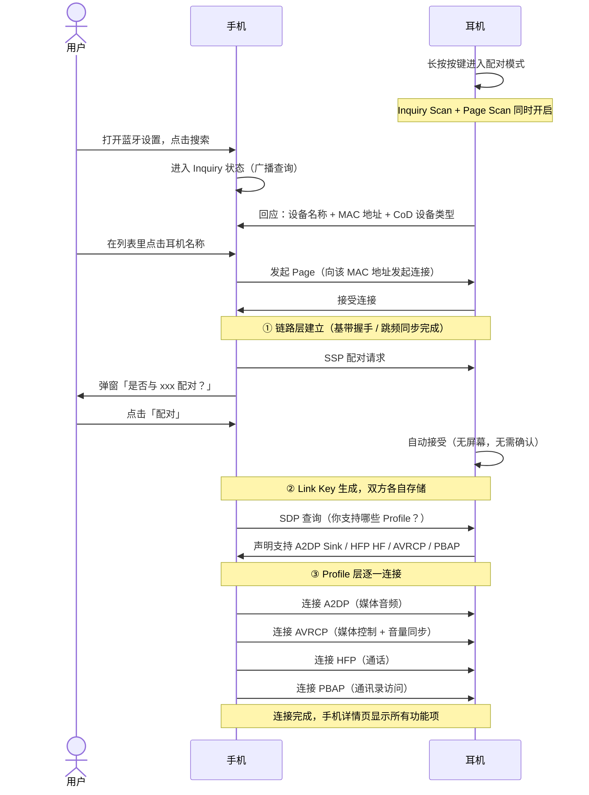

---

### SSP 配对：为什么不同场景弹窗不一样？

SSP 根据两端设备有没有屏幕和键盘，自动选择配对方式，所以用户看到的弹窗形式不同：

**① 手机 + 耳机 → 只有手机弹窗（Just Works 模式）**

耳机没有屏幕也没有键盘，协议判定它"没有能力做交互验证"，退化为单边确认。值得注意的是，弹窗里还附带了一个 **PBAP 授权选项**，用户在这里决定是否允许耳机访问联系人——这是 PBAP Profile 能否正常工作的前提，而不是连上之后才设置。

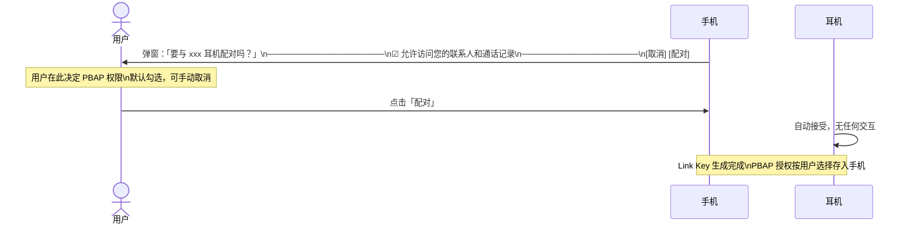

> PBAP 授权一旦在这里关掉，连接完成后详情页里"允许访问通讯录和通话记录"就是关闭状态，来电时耳机只能报号码不能报姓名。可以在详情页里随时重新开启。

**② 手机 + 手机 → 双方弹窗显示相同数字（Numeric Comparison 模式）**

两端都有屏幕和键盘，协议要求双方用户都确认，防止中间人伪装。

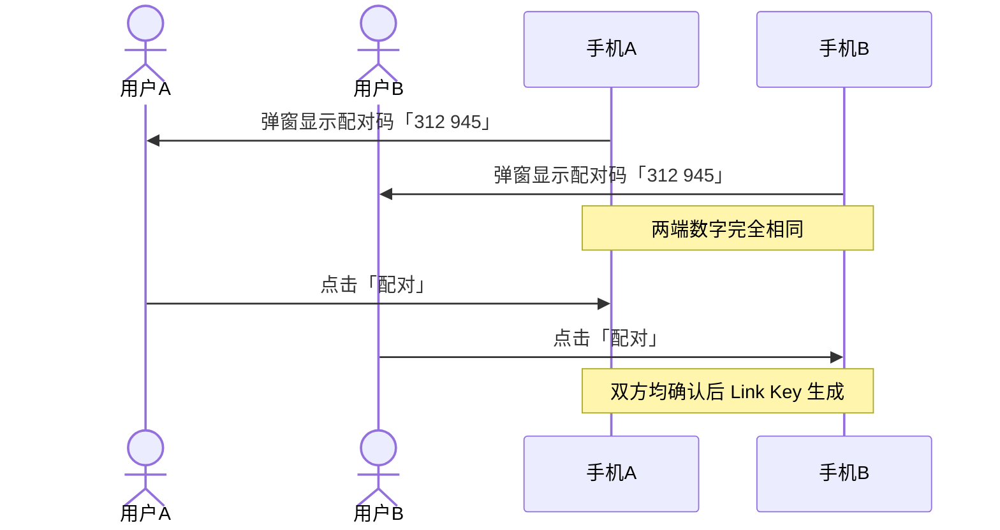

> 两台手机互传文件、蓝牙键盘首次连电脑，都是这个模式。数字必须一致，有人伪装数字就会对不上。

**③ 已配对设备重连 → 完全无感知**

Link Key 已存储，直接认证，无弹窗，用户不知道发生了什么。

---

### 场景二：自动重连

耳机出盒或上电，检测到配对记录，开启 Inquiry Scan + Page Scan，手机发起 Page 后底层走一轮 **Link Key 挑战-应答（Challenge-Response）** 完成认证，全程用户无感知。

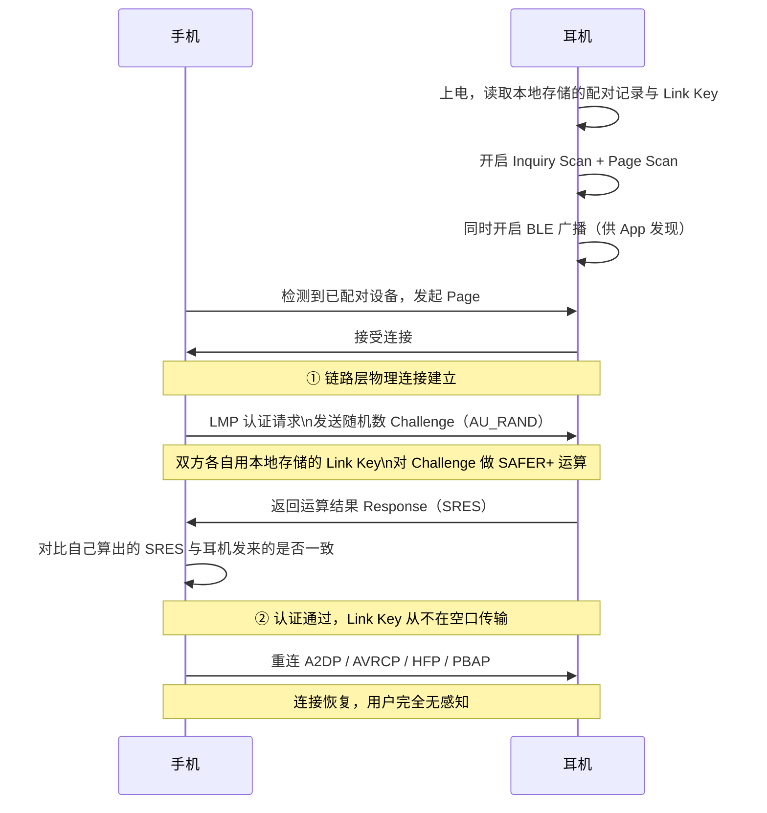

> **Link Key 认证的本质**：手机发一个随机数（Challenge），双方各自用本地存的 Link Key 对它做运算，耳机把结果（Response）发回来，手机对比"我算出来的"和"耳机发来的"是否一致。**Link Key 本身从不在空口传输**，即使有人抓到全部报文也无法还原密钥。
>
> **Link Key 是怎么来的**：首次配对时双方不是互传密钥，而是通过 ECDH 各自交换公钥，再独立推算出同一个共享密钥，最终从共享密钥派生 Link Key 存入本地 VM。公钥可以公开传，私钥从不离开设备。配对完成后双方各自存了一份 Link Key，后续重连直接取用。
>
> **耳机恢复出厂的场景**：耳机出厂重置后 VM 清空，Link Key 丢失。重连时耳机无法响应 Challenge，回复 Negative Reply，手机收到后触发重新 SSP 配对——弹窗重新出现，这也是为什么耳机重置后需要重新配对的原因。

---

### 连接完成后：手机界面与协议的对应

连上之后打开 Android 蓝牙详情页，界面上每一项都有对应的协议含义：

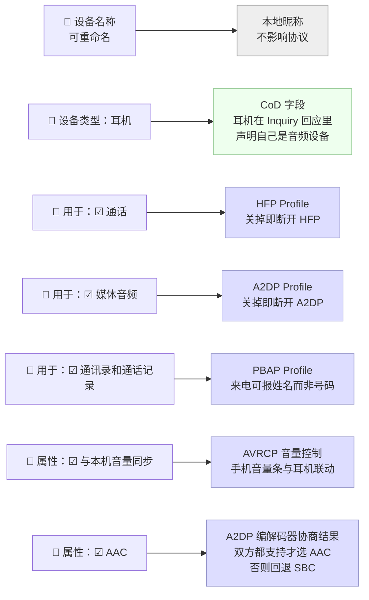

几个细节值得记住：

- **设备类型自动判断**：耳机在 Inquiry 回应时会在 CoD 字段里声明"我是音频设备"，手机收到后自动显示耳机图标，不需要用户选
- **"用于"的开关本质是 Profile 的启停**：每个 Profile 是独立的逻辑通道，关掉"通话"就是断开 HFP，关掉"媒体音频"就是断开 A2DP，互不影响
- **AAC 是协商出来的**：A2DP 连接时双方各自报支持的编码格式（SBC / AAC / LDAC 等），取交集里质量最高的。耳机只支持 SBC 的话，这里根本不会出现 AAC
- **PBAP 经常被忽略**：它让耳机或车机可以同步手机联系人，这样来电时耳机报的是"张三来电"而不是一串号码

---

### 两阶段本质：链路层 vs Profile 层

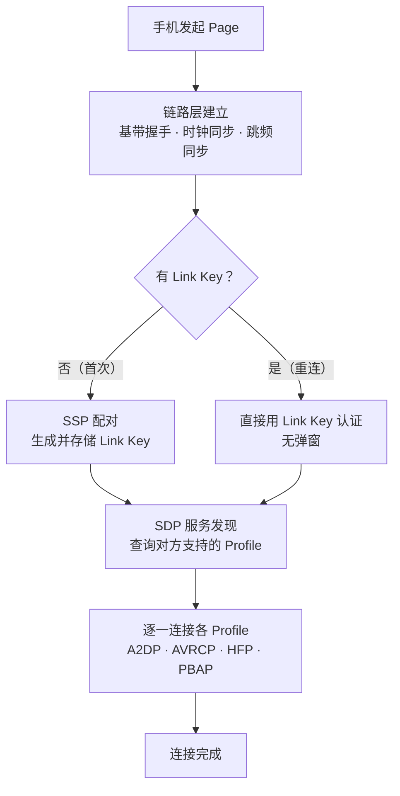

- **链路层**：解决「能不能通」——建立物理信道，完成跳频同步
- **Profile 层**：解决「用来干什么」——每个 Profile 是独立逻辑通道，互不干扰

---

### TWS 场景：双耳的连接顺序

TWS 耳机比普通耳机多一个环节——主耳连上手机之后，还要把副耳「拉进来」。

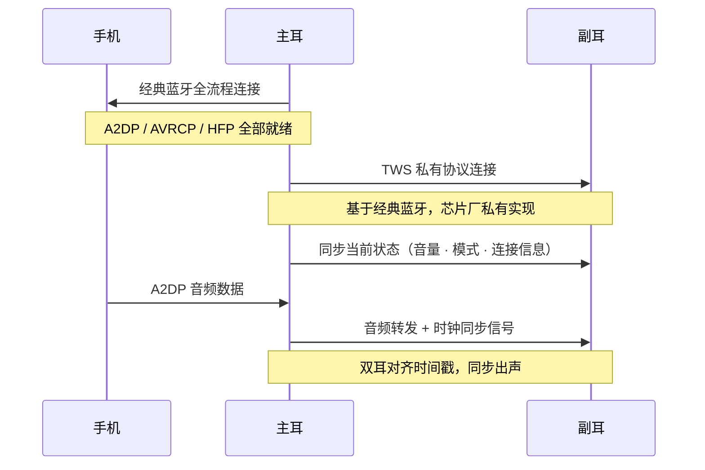

> 副耳**不直接和手机连接**，只和主耳通信。手机视角里只有一个蓝牙设备，副耳的存在对手机透明。

---

### 面试怎么讲

> "连接分两层。第一层链路层，手机先 Inquiry 广播找设备，耳机开着 Inquiry Scan 回应，手机拿到 MAC 后再 Page 发起点对点连接。有意思的是，耳机有配对记录时上电并不是只开 Page Scan，而是先同时开 Inquiry Scan 和 Page Scan，给一段时间窗口让新设备也能发现它，超时后 Inquiry Scan 自动关闭，只保留 Page Scan 等回连。首次配对走 SSP，耳机没屏幕所以只有手机单边弹窗，弹窗里还有一个 PBAP 授权勾选框，用户在这里决定是否允许访问联系人，这个权限决定了连上之后来电能不能报姓名。手机和手机配对就不一样，两边都弹窗显示相同的数字，两端都要确认，防止中间人伪装。重连时不是直接跳过认证，而是走一轮挑战-应答：手机发一个随机数，双方各自用本地存的 Link Key 对它做运算，耳机把结果发回来，手机对比一致才算通过——Link Key 从不在空口传输，安全的地方在这里。第二层 Profile 层，手机通过 SDP 查询耳机支持的功能，A2DP 媒体音频、HFP 通话、AVRCP 音量同步、PBAP 通讯录各自独立连接，手机详情页那几个开关就是这几个 Profile 的状态。AAC 是 A2DP 建立时双方协商编解码格式的结果，两端都支持才选 AAC。TWS 的话主耳连上手机后，芯片私有协议把副耳拉进来，手机只看到一个设备。"

---


## 有没有遇到过蓝牙相关的问题？怎么解决的？

蓝牙问题排查有三种手段，按获取成本从低到高排列：

| 手段 | 获取成本 | 看到什么 | 适合场景 |
|------|---------|---------|---------|
| **耳机串口日志** | 最低，USB 转串口接上即可 | 耳机 SDK 内部状态机、事件、buffer 水位 | 耳机侧逻辑问题，最先看 |
| **手机 HCI 日志** | 低，adb 命令或开发者选项 | Host ↔ Controller 之间的命令/事件/数据 | 手机侧 Profile 协商、断连原因码 |
| **蓝牙分析仪（空中抓包）** | 高，需专用硬件 | 射频空口的原始 Link Layer / LMP / L2CAP 报文 | 连接建立失败、射频干扰、双方行为对比 |

三者定位不同：串口日志看耳机内部，HCI 日志看手机侧协议，空中抓包看双方空口全貌。

---

### 一、三种工具的层次定位

```
┌────────────────────────────────────────────────────────────┐
│  应用 / 业务层  bt_event_func.c / tws_phone_call.c          │  ← putchar 单字符日志、printf 事件日志
├────────────────────────────────────────────────────────────┤
│  Profile 层（A2DP / HFP / AVRCP …）                        │  ← a2dp_streamctrl.c 里的 buffer 统计
├────────────────────────────────────────────────────────────┤
│              HCI（Host ↔ Controller 分界线）                 │  ← HCI 日志就抓这一层
├────────────────────────────────────────────────────────────┤
│  Link Layer / LMP / Baseband / RF                           │  ← 蓝牙分析仪抓这一层（空口）
└────────────────────────────────────────────────────────────┘
```

- **耳机串口日志**：最贴近代码，SDK 用 `putchar` 单字符和 `printf` 语句直接打印内部状态，信息量最大、获取最快
- **HCI 日志**：手机 Host 发给 Controller 的命令、Controller 上报的事件，断连 reason code 就在这里
- **蓝牙分析仪**：第三方视角，连接都没建立时唯一能同时看到手机和耳机双方空口行为的工具

---

### 二、耳机串口日志：如何读懂 JL SDK 的日志

JL 双核 SDK 大量使用 **`putchar` 单字符日志**来标记关键事件，日志刷屏快但很精简，理解这些字符含义是排查的第一步。

#### `tws_dual_conn.c` — 连接状态字符

> 源文件注释（`JL双核SDK/apps/earphone/mode/bt/tws_dual_conn.c:24`）：
>
> ```
> /*** tws快连page:             打印 'c'（小写）
>  *** tws快连page_scan:        打印 'p'（小写）
>  *** 等待被发现inquiry_scan:   打印 'I'（大写）
>  *** 回连手机page:             打印 'C'（大写）
>  *** 等待手机连接page_scan:    打印 'P'（大写）
>  *** 共享从share快连page_scan: 打印 'q'（小写）
>  *** 共享主share快连page:      打印 's'（小写）***/
> ```

| 字符 | 含义 | 出现场景 |
|------|------|---------|
| `c` | 主耳正在 Page 副耳（TWS 快连） | 上电后主耳主动寻找副耳 |
| `p` | 副耳开启 Page Scan 等待主耳 | 上电后副耳等待主耳来连 |
| `I` | 开启 Inquiry Scan，等待被新手机发现 | 可发现状态，新设备首次配对窗口 |
| `C` | 主耳正在 Page 手机（回连） | TWS 握手完成后，主耳开始回连手机 |
| `P` | 开启 Page Scan，等待手机来连 | 已完成 TWS 握手，等手机发起 Page |
| `q` | 共享从机开启 Page Scan | 一拖二场景下的从机等待 |
| `s` | 共享主机发起 Page | 一拖二场景下的主机主动连接 |

**重要：TWS 耳机上电后正常连接的打印序列应该是：**

```
上电
→ c（主耳 Page 副耳）同时 p（副耳 Page Scan）
→ TWS 内部握手成功
→ C（主耳开始回连手机）同时 P（主耳开启 Page Scan 等手机）
→ I（开启 Inquiry Scan，如果有需要）
→ 手机发起 Page → 连接建立
```

如果打印序列卡在 `c` 一直没出现 `C`，说明主副耳握手没完成；如果出现了 `C` 但没完成，说明手机没有响应 Page。

#### `a2dp_streamctrl.c` — A2DP 音频 buffer 状态字符

> 源文件（`JL双核SDK/audio/framework/plugs/source/a2dp_streamctrl.c`）：

| 字符 | 含义 | 打印位置 |
|------|------|---------|
| `X` | A2DP buffer underrun（欠载） | `a2dp_stream_underrun_handler()`，buffer 空了，用静音帧填充 |
| `n` | underrun 后数据到位，reload 正常帧 | `a2dp_stream_overrun_handler()` 中恢复正常 |
| `o` | overrun（溢出） | `a2dp_stream_overrun_handler()`，buffer 积压太多，丢帧 |

**开启详细统计日志：** 在 `app_config.h` 里打开 `A2DP_STREAM_INFO_DEBUG_ENABLE`，SDK 会定期打印：

```
a2dp stream info :
latency : 200ms, adaptive : 200ms, max : 300ms
underrun : 3, 1          ← 两种 underrun 计数
packet missed : 5        ← 丢包数
rf_quality : 2, -65, -70, 3    ← PER(%), RSSI(dBm), TWS RSSI, 质量等级
rx buffer : 8            ← 当前 buffer 中的包数量
bitrate : 328 kbps
```

其中 `rf_quality` 里的 **PER（Packet Error Rate）** 和 **RSSI** 是判断射频质量的核心指标，直接从 `lmp_get_rssi_end_per_for_edr_address()` 获取，省去了空中抓包的步骤。

---

### 三、手机 HCI 日志：抓取与分析

HCI 日志是手机蓝牙 Host 和 Controller 之间的通信记录，Android 原生支持开启，格式为标准 btsnoop，可直接用 Wireshark 打开。

#### 抓取步骤

**方法一：开发者选项（推荐，问题可稳定复现时用）**

1. `设置 → 关于手机`，连点版本号 7 次开启开发者模式
2. `设置 → 开发者选项 → 启用蓝牙 HCI 信息收集日志`，打开
3. **关蓝牙再开**（必须重启蓝牙才生效）
4. 复现问题
5. 关闭开关（触发落盘），立即导出（重启蓝牙会覆盖文件）

```bash
adb pull /sdcard/btsnoop_hci.log ./            # 原生 Android / 小米
adb pull /data/misc/bluetooth/logs/btsnoop_hci.log ./  # 部分机型
adb pull /data/log/bt/btsnoop_hci.log ./       # 华为/荣耀
```

**方法二：adb 命令（问题不稳定复现时用，保持日志持续开启）**

```bash
adb shell settings put secure bluetooth_hci_log 1
# 重启蓝牙后生效，复现完成后直接拉取，不要再重启蓝牙
adb pull /sdcard/btsnoop_hci.log ./
```

#### Wireshark 分析要点

**常用过滤器：**

```
hci_evt.code == 0x05            # 只看断连事件（Disconnection Complete）
btl2cap.psm == 0x0019           # AVDTP（A2DP）
btl2cap.psm == 0x0003           # RFCOMM（HFP AT 命令）
btavdtp                         # A2DP 编解码协商
bluetooth.addr == aa:bb:cc:dd:ee:ff  # 指定设备
```

**断连 reason code 速查：**

找到 `HCI Event: Disconnection Complete`，展开看 `Reason`：

| Reason | 含义 | 指向 |
|--------|------|------|
| `0x08` | Connection Timeout（监督超时） | 射频链路中断，去抓空口 |
| `0x13` | Remote User Terminated | 手机主动断，看前面手机发了什么 |
| `0x16` | Connection Terminated by Local Host | 耳机主动断，看串口日志触发了什么 |
| `0x22` | LMP Response Timeout | 链路层无响应，配合空中抓包 |

**A2DP 编解码协商：** 过滤 `btavdtp`，找 `AVDTP Set Configuration`，展开 `Media Codec` 字段，能直接看到协商出的格式（SBC / AAC）和 bitpool 值。如果看到 `AVDTP Reconfigure`，说明手机在播放中途降了 codec，通常因为链路质量下降。

---

### 四、蓝牙分析仪（空中抓包）：使用方法

#### 常用硬件

| 设备 | 支持协议 | 特点 |
|------|---------|------|
| **Ellisys Bluetooth Analyzer** | BR/EDR + BLE | 业界标准，功能最全，价格最高 |
| **Frontline ComProbe** | BR/EDR + BLE | 国内常见，功能全面 |
| **Ubertooth One** | BLE 仅 | 开源，成本低，不支持经典蓝牙 |
| **nRF Sniffer（Nordic）** | BLE 仅 | 免费，配 Wireshark，不支持经典蓝牙 |

> TWS 耳机主要走经典蓝牙（BR/EDR），必须用支持 BR/EDR 的分析仪，Ubertooth / nRF Sniffer 不适用。

#### 关键配置步骤

经典蓝牙采用 AFH 自适应跳频，分析仪必须同步到目标设备的跳频序列才能完整捕获报文：

1. **填入耳机 BD_ADDR**：分析仪软件里配置目标 MAC，用于跟踪跳频节拍
2. **填入 Link Key（可选）**：仅在需要解密 ACL 数据内容时需要；看 LMP 握手和连接建立过程不需要解密
3. **先开录制，再触发连接**：确保从 Page 阶段就开始捕获，不要漏掉连接建立的前几帧

#### 核心报文层次

```
┌─────────────────────────────────┐
│  L2CAP / RFCOMM / AVDTP …       │  A2DP、HFP 命令在这一层
├─────────────────────────────────┤
│  LMP（Link Manager Protocol）    │  认证、加密、参数协商、连接建立
├─────────────────────────────────┤
│  Baseband / Link Layer          │  帧结构、重传（NACK）、跳频序列
└─────────────────────────────────┘
```

#### 关键报文速查

**连接建立（LMP 层）：**

| 报文 | 含义 |
|------|------|
| `LMP_io_cap_req / res` | SSP 配对能力交换 |
| `LMP_au_rand` | 认证挑战（Challenge） |
| `LMP_sres` | 认证应答（Response） |
| `LMP_not_accepted` (reason=0x06) | 认证失败，Link Key 不匹配 |
| `LMP_setup_complete` | 链路层握手完成 |
| `LMP_detach` | 主动断开，reason 字段说明原因 |

**SCO/eSCO 语音通道：**

| 报文 | 含义 |
|------|------|
| `LMP_esco_link_req` | 建立 eSCO 通道（对应 SDK `esco_player.c` 的 open 流程） |
| `LMP_esco_alter_req` | 修改参数，如从 CVSD 切换为 mSBC（对应 `TCFG_BT_MSBC_EN`） |
| `LMP_remove_esco_link_req` | 关闭语音通道（挂断通话） |

**射频质量判断（Baseband 层）：**

- **NACK 比例**：超过 5% 说明射频差。但 SDK 的 `a2dp_stream_info` 日志里已经有 PER 值，可以不用空中抓包就能拿到这个数据
- **重传次数**：同一包多次重传才成功，典型信号弱表现
- **LMP_detach 有无**：有则是主动断开（看 reason），无则是射频链路直接中断（supervision timeout）

---

### 五、四种故障场景的排查路径

#### 场景 1：歌曲播放卡顿

**工具优先级：耳机串口日志 → 空中抓包（射频差时） → HCI 日志（codec 协商问题时）**

```
Step 1：耳机串口日志
    看是否打印了 'X'（underrun）
    ├── 频繁出现 'X'
    │     开启 A2DP_STREAM_INFO_DEBUG_ENABLE，观察周期统计：
    │     ├── PER > 5% 或 RSSI < -80dBm → 射频质量差，转 Step 2
    │     ├── PER 正常但 underrun_num 持续累加 → 手机发包不稳定
    │     │     → 换手机测试，或检查 A2DP buffer 大小配置
    │     │       （CONFIG_A2DP_MAX_BUF_SIZE / CONFIG_A2DP_SBC_MAX_BUF_SIZE）
    │     └── adaptive_latency 频繁变化 → 自适应 jitter buffer 在调整
    │           说明网络质量波动，看 RSSI 是否有规律性变化
    │
    └── 没有 'X' 但有卡顿感
          → 可能是解码/DAC 问题，不是链路问题，不在本节范围

Step 2：空中抓包（PER 高时）
    看 Baseband 层 NACK 比例：
    ├── NACK 集中出现 → 特定时间段干扰（关 WiFi 或远离微波炉重测）
    └── NACK 持续 → 信号覆盖不足，TWS 场景下还要看
          TWS 内部通信（'c'/'p' 时隙）是否挤占了 A2DP 时隙

Step 3：HCI 日志（排查 codec 降级问题）
    过滤 btavdtp，找 AVDTP Reconfigure：
    ├── 出现 Reconfigure → 手机在播放中途降 codec
    │     展开看 bitpool 变化（正常 43，降级后可能 < 30）
    └── 无 Reconfigure → codec 稳定，卡顿不在此处
```

#### 场景 2：连不上

**工具优先级：耳机串口日志 + 空中抓包并行**

> HCI 日志在连接建立失败时价值有限（手机侧可能根本没走到 HCI 层）。

```
Step 1：耳机串口日志
    观察连接状态字符序列：
    ├── 只有 'c'/'p' 循环，没出现 'C'/'P'
    │     → 主副耳 TWS 握手失败，连不到对方
    │     → 两只耳机是否都在正确的配对模式？副耳是否已入盒放电？
    │
    ├── 出现了 'C'（主耳在 Page 手机）但很快停止
    │     → 主耳发起回连，手机没响应
    │     → 手机是否开了蓝牙？是否有其他设备占用了手机蓝牙资源？
    │
    └── 出现了 'P' 但手机一直没连上
          → 耳机开了 Page Scan 在等手机，但手机没有发起 Page
          → 手机蓝牙详情页这台设备是否被设置为不自动连接？

Step 2：空中抓包（串口日志无法判断时）
    ├── 1. 有没有 Inquiry 回应（新设备首次配对场景）？
    │     耳机无回应 → 耳机没开 Inquiry Scan
    │
    ├── 2. 手机发了 Page，耳机有没有回应？
    │     耳机无回应 → Page Scan 没开 或 时序冲突（TWS 两耳正在握手中）
    │
    ├── 3. LMP 认证阶段
    │     LMP_not_accepted（reason=0x06）→ Link Key 不匹配
    │     → 耳机恢复出厂后手机未清除配对记录，需手机侧重新配对
    │
    └── 4. SDP / Profile 连接阶段
          L2CAP Connect 被拒绝 → 对应 Profile 的 SDP 记录不存在
          → 检查 sdk_config.h 里对应 Profile 的宏是否开启
```

#### 场景 3：断连（连上后掉线）

**工具优先级：HCI 日志（首选） → 空中抓包（射频原因时）**

```
Step 1：HCI 日志
    找 HCI Event: Disconnection Complete，看 Reason：

    0x08 Connection Timeout（监督超时）
    → 射频链路中断，supervision_timeout 耗尽
    → 转 Step 2 空中抓包看掉线前 NACK 趋势

    0x13 Remote User Terminated
    → 手机主动断
    → 往前看手机发了什么：音频路由切换？系统省电断开后台蓝牙？

    0x16 Connection Terminated by Local Host
    → 耳机主动断，看串口日志：
      ├── 低电量触发关机断连
      ├── 入盒检测触发断连
      └── 看门狗复位（串口会打印复位原因）

    0x22 LMP Response Timeout
    → 链路层有通信但 LMP 无响应，转空中抓包确认

Step 2：空中抓包（针对 0x08 / 0x22）
    ├── 有 LMP_detach → 正常主动断开，看 reason
    └── 无 LMP_detach，通信突然消失
          → 最后一帧到恢复之间 = supervision_timeout（默认 20s）
          → 是射频链路中断
          看掉线前 NACK 趋势：
          ├── NACK 急剧增加后断 → 信号逐渐变差
          └── 突然消失，无预兆 → 物理遮挡（如耳机塞进包里）

    周期性断连排查：
    ├── 间隔固定（3~5 分钟）→ 耳机定时器触发了不该触发的逻辑
    │     看串口日志里有没有配套的定时器事件
    └── 与 WiFi 传输高峰重合 → 2.4G 共道干扰
          BT/WiFi coexistence 是否生效（看芯片方案配置）
```

#### 场景 4：回连不上

**工具优先级：耳机串口日志 → 空中抓包 → HCI 日志**

> 回连失败比连不上更隐蔽，设备明明已配对，核心原因要么是状态机没到 Page Scan，要么是 Link Key 失配，要么是手机侧不自动重连。

```
Step 1：耳机串口日志
    上电后是否出现 'P'（等待手机连接 Page Scan）？
    ├── 没出现 'P'
    │     再看 'C' 有没有出现：
    │     ├── 'C' 也没有 → 主副耳握手未完成，卡在 'c'/'p' 阶段
    │     │     副耳是否开机？两耳是否相互能感应到（距离/遮挡）？
    │     └── 'C' 出现了但之后没转到 'P'
    │           → 主耳 Page 手机失败后，auto_close_page_scan() 被触发
    │             关闭了 Page Scan（tws_dual_conn.c:77）
    │             → 检查 page_scan_timer 超时时间配置
    │
    └── 出现了 'P' → 耳机在等，手机没来，转 Step 2

Step 2：空中抓包
    手机有没有向耳机 MAC 发出 Page？
    ├── 没有发 Page
    │     → 手机侧不自动重连，检查手机蓝牙设置，删除配对记录重配
    │
    └── 发了 Page，耳机有没有回应？
          ├── 无回应 → Page Scan 时序冲突
          │     TWS 主耳正在 Page 副耳（'c' 阶段），Page Scan 被暂时关闭
          │     → 调整策略：主副耳握手完成后再开 Page Scan 等手机
          │
          └── 耳机回应了但连接失败
                → LMP 认证阶段看是否有 LMP_not_accepted
                → 耳机出厂重置但手机 Link Key 未清除

Step 3：HCI 日志（补充手机侧）
    找 Connection Complete Event：
    ├── Status 非 0 → 手机认为连接失败，看 Status code
    └── 没有此 Event → 手机根本没有发起连接
```

---

### 六、排查工具选择速查表

```
故障现象               首选工具              关键看什么
─────────────────────────────────────────────────────────────────
歌曲卡顿               耳机串口日志          'X' 字符频率 + A2DP stream info
                                           （PER、RSSI、underrun 计数）
                       空中抓包（射频差时）  NACK 比例、时隙占用
连不上                  耳机串口日志          连接状态字符序列（c/p/C/P/I）
                       空中抓包              Inquiry/Page 阶段、LMP 认证
断连                   HCI 日志              Disconnection Complete reason
                       串口日志（0x16 时）   耳机主动断的触发原因
                       空中抓包（0x08 时）   最后几帧 NACK、有无 LMP_detach
回连不上               耳机串口日志          'P' 是否出现、auto_close_page_scan
                       空中抓包              手机有无发 Page、耳机有无响应
Profile 功能异常        HCI 日志              SDP 查询结果、Profile 连接报文
通话质量差              串口日志              eSCO 通道建立日志、codec 类型
                       空中抓包              LMP_esco_alter_req（mSBC/CVSD）
```

---

### 面试怎么讲

> "蓝牙排查我按三层手段来。第一层是耳机串口日志，成本最低，JL SDK 里有大量 `putchar` 单字符日志，比如 `tws_dual_conn.c` 里用 `'C'` 表示主耳正在回连手机、`'P'` 表示在等手机来连，看字符序列就能判断连接在哪个阶段卡住了。音频卡顿的话，`a2dp_streamctrl.c` 里 `'X'` 表示 underrun，开启详细统计还能周期性打印 PER、RSSI、buffer 里的包数，很多时候不用抓包就能定位射频质量问题。第二层是手机 HCI 日志，Android 开发者选项开启，导出用 Wireshark 分析，最大价值是断连的 reason code：0x08 是监督超时说明射频断了，0x13 是手机主动断，0x16 是耳机主动断，直接定位是哪一侧的问题。第三层是蓝牙分析仪做空中抓包，成本最高，但连接建立失败的场景没有它没法排查——手机有没有发 Page、LMP 认证有没有通过、是不是 Link Key 失配，只有空口报文能证明。实际排查一般先串口日志，再根据判断方向选 HCI 日志或空中抓包来确认。"

---

# SDK 中 Profile 层可以控制手机详情页？蓝牙协议栈哪些部分是开放的？

## 结论先说

**可以。** 手机蓝牙详情页展示的内容，本质上来自耳机在 SDP（服务发现协议）里注册了哪些 Profile 记录。SDK 把这层控制权通过宏开关暴露出来，开发者通过修改配置宏，就能决定手机详情页显示哪些功能项。

---

## 控制链路：从宏开关到手机 UI

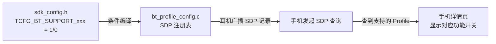

整个控制链路只有**四跳**，每一跳都可以定位到具体文件：

| 层次 | 文件 | 作用 |
|------|------|------|
| 开关定义 | `apps/earphone/board/br52/sdk_config.h` | 控制每个 Profile 是否编译进固件 |
| SDP 注册 | `apps/common/config/bt_profile_config.c` | 根据宏判断是否向协议栈注册 SDP 记录 |
| 协议栈通告 | `btstack.a`（已编译库） | 存储 SDP 数据库，连接时响应手机查询 |
| 手机 UI | 系统蓝牙设置 | 根据 SDP 查询结果渲染详情页 |

---

## 当前项目的 Profile 默认状态

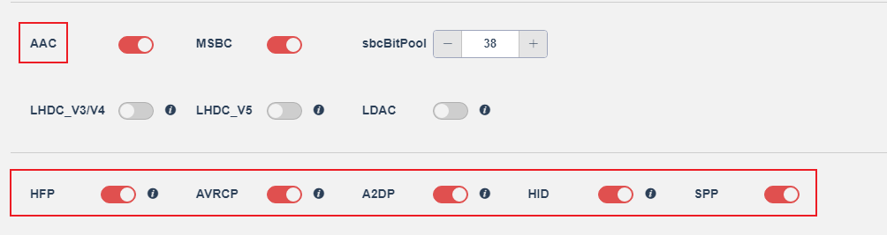

| Profile | 宏开关 | 默认值 | 手机详情页表现 |
|---------|--------|--------|---------------|
| A2DP | `TCFG_BT_SUPPORT_A2DP` | **开启** | 显示「媒体音频」开关（默认开） |
| HFP | `TCFG_BT_SUPPORT_HFP` | **开启** | 显示「通话音频」开关（默认开） |
| AVRCP | `TCFG_BT_SUPPORT_AVCTP` | **开启** | 显示「与本机音量同步」 以及音乐控制有关协议 |
| HID | `TCFG_BT_SUPPORT_HID` | **开启** | 辅助音量控制功能 |
| SPP | `TCFG_BT_SUPPORT_SPP` | **开启** | 串口透传通道（后台，不在 UI 显示） |
| PBAP | `TCFG_BT_SUPPORT_PBAP` | **关闭** | 关闭时详情页无通讯录权限开关 |
| MAP | `TCFG_BT_SUPPORT_MAP` | **关闭** | 关闭时不显示短信同步功能 |
| AAC | `TCFG_BT_SUPPORT_AAC` | **开启** | A2DP 详情页显示「AAC」属性标签 |

> PBAP 的特殊性：即使宏关闭，手机在 SSP 弹窗时仍可能出现通讯录勾选框（这是手机系统行为）；但如果宏关闭，耳机 SDP 里没有 PBAP 记录，连接后手机会发现查不到对应服务，通讯录开关会自动灰掉或不显示。
>
> - 关闭AAC宏就没有标识了（详情页也没有开关了），就会显示SBC，这时应该是MSBC，都关闭，还是会显示SBC。
>   - 用户手动关闭是显示SBC，音质听不出变化。
>   
> - 用户在播放歌曲时，与本机音量同步是强制不可操作的。后台无音乐时则可以选择开关。
>
> - `TCFG_BT_INBAND_RING`与`TCFG_BT_PHONE_NUMBER_ENABLE`拿到的信息恐怕都是来自`TCFG_BT_SUPPORT_PBAP`，特别是来电报号的号码信息。
>
> - 关闭HFP宏的话，通话时不会出现耳机图标让用户选择，也没有详情页可以开关。通话时，耳机可以听到来电方的声音，但是接收方没有耳机图标选择，所以无法使用耳机跟来电方通话，只能使用手机，即使耳机是显示蓝牙连接的。
>
> - HID宏关闭直接连接上就死机复位了。
>
> - AVRCP宏关闭
>
>   - ```c
>     [00:01:36.654][LP_KEY]touch key0 RAISING !
>     [00:01:37.155][LP_KEY]notify key:0 short event, cnt: 1
>     [00:01:37.156]app_send_message_from(MSG_FROM_KEY, 8, msg);----err-22
>     [00:01:37.157]rcsp_key_event_remap() 317
>     [00:01:37.157]get_adv_key_event_status() 115
>     [00:01:37.158]disable_adv_key_event
>                     
>     [00:01:37.159]app_key_event_remap key_value = 0, key_action = 0
>                     
>     [00:01:37.160]bt_key_msg_remap, key_action: 0, app_msg: 99
>     [00:01:37.161][APP]>>>>>key_msg = 99
>     [00:01:37.162]APP_MSG_MUSIC_PP  //执行到这里没有往下执行了。
>     ```
>
>   - `APP_MSG_MUSIC_NEXT`, `APP_MSG_VOL_UP`跟音乐有关的操作全部失效
>
>   - 可以呼出Siri，游戏模式。
>
> - A2DP宏关闭后，手机详情页没有开关选项。连接后手机播放歌曲，耳机没有声音，是手机扬声器发出声音。看手机连接状态显示使用的是通话而不是媒体。
>
>   - 用户手动关闭媒体音频，歌曲直接中断，连接直接断开，无法连接上，只能再手动打开媒体音频，重启耳机才会回连手机。

---

## 现象背后的代码依据

### PBAP 关闭后 SSP 弹窗仍可能出现通讯录勾选框

这是**手机系统行为**，不受耳机 SDK 控制。Android 在 SSP 配对弹窗里显示通讯录授权选项，是根据设备 CoD 判断"这是音频设备"后的默认策略，与耳机有没有注册 PBAP 的 SDP 记录无关。

耳机 SDK 能控制的是**连接完成之后**：`TCFG_BT_SUPPORT_PBAP=0` 时，`bt_profile_config.c` 的整个 PBAP 注册块不编译：

```c
#if (TCFG_BT_SUPPORT_PBAP==1)
u8 pbap_profile_support = 1;
SDP_RECORD_HANDLER_REGISTER(pbap_sdp_record_item) = { ... };
#endif
```

手机连接后做 SDP 查询，找不到 PBAP 服务记录，通讯录开关自动灰掉或消失。**弹窗时出现勾选框是 Android 的事，连接后开关消失是 SDK 的事，两者时机不同。**

---

### AAC 关闭后只显示 SBC，MSBC 宏与此无关

AAC 不是独立的 SDP 服务，而是 A2DP 连接时双方交换 codec 列表的协商结果。SDK 用两处代码共同控制它：

**编译期（`a2dp_file.c`）**：`case A2DP_CODEC_MPEG24` 整段被 `#if` 包住，宏关闭时从二进制里消失：

```c
switch (type) {
case A2DP_CODEC_SBC:       // 无任何 #if 保护，永远编译进去
    fmt->coding_type = AUDIO_CODING_SBC;
    break;
#if (defined(TCFG_BT_SUPPORT_AAC) && TCFG_BT_SUPPORT_AAC)
case A2DP_CODEC_MPEG24:    // 整个 case 被 #if 包住
    fmt->coding_type = AUDIO_CODING_AAC;
    break;
#endif
```

**运行期（`earphone.c:434`）**：`bt_set_support_aac_flag(0)` 告知协议栈库不把 AAC 加入 A2DP 编解码协商列表。

两者联动：耳机在 A2DP 握手时只上报 SBC → 手机只看到 SBC → 详情页只显示 SBC 标识。

`TCFG_BT_MSBC_EN` 和 `TCFG_BT_SUPPORT_AAC` 控制的是**两条完全不同的链路**，`avctp_user.h` 的注释直接说明了这一点：

```c
/*配置通话使用16k的msbc还是8k的cvsd*/
extern void bt_set_support_msbc_flag(bool flag);
/*配置协议栈使用支持AAC的信息*/
extern void bt_set_support_aac_flag(bool flag);
```

```
A2DP 链路（音乐）：SBC / AAC / LDAC … ← TCFG_BT_SUPPORT_AAC 控制
HFP 链路（通话）：mSBC（16kHz）/ CVSD（8kHz） ← TCFG_BT_MSBC_EN 控制
```

关闭 AAC 后 A2DP 上播放的依然是**标准 SBC**，与 mSBC 毫无关系。两个宏同时关闭时 SBC 也永远存在，因为 `A2DP_CODEC_SBC` 的 case 没有任何 `#if` 保护——SBC 是 A2DP 规范强制要求的 mandatory codec，协议栈库永远把它加入协商列表。

| 场景 | A2DP codec（音乐） | HFP codec（通话） | 详情页显示 |
|------|-------------------|-----------------|-----------|
| AAC=1，MSBC=1 | **AAC**（双方支持时协商选出） | **mSBC**（16kHz 宽带） | AAC 标签 |
| AAC=0，MSBC=1 | **SBC**（AAC case 编译期消失） | **mSBC**（16kHz 宽带） | SBC 标签 |
| AAC=0，MSBC=0 | **SBC**（同上） | **CVSD**（8kHz 窄带） | SBC 标签 |

MSBC 影响的是**通话音质**，与音乐 codec 显示完全无关，关闭后听歌感受不到变化完全符合预期。

---

### 用户手动关闭 AAC 后听感无差异

`sdk_config.h:204`：

```c
#define TCFG_BT_SBC_BITPOOL   43   // sbcBitPool
```

SBC 音质主要由 bitpool 值决定，43 属于中高档，日常听歌已经足够。用户从手机设置关掉 AAC，Android 断开并重建 A2DP 连接，协商结果变为 SBC（bitpool 43），和 AAC 的感知差距几乎可以忽略。

---

### 播放歌曲时"与本机音量同步"开关变灰不可操作

这是 **Android 系统 UI 的保护行为**，与 SDK 的 AVRCP TG（Target）注册逻辑联动。`bt_profile_config.c:85–90`：

```c
#if TCFG_BT_VOL_SYNC_ENABLE
SDP_RECORD_HANDLER_REGISTER(arp_ta_sdp_record_item) = {
    .service_record = (u8 *)sdp_avctp_ta_service_data,  // AVRCP TG 记录
    .service_record_handle = 0x00010005,
};
#endif
```

AVRCP TG 是"耳机接受手机下发音量"的角色，对应 `vol_sync.c` 里由 `BT_STATUS_AVRCP_VOL_CHANGE` 事件驱动的音量同步回调。A2DP 媒体流激活（`BT_STATUS_A2DP_MEDIA_START`）时，Android 判断正在主动传输音频，主动锁定该开关避免播放中途意外改变路由配置。后台无音乐时 AVRCP 连接仍在，Android 解锁开关，可以自由切换。

---

### TCFG_BT_INBAND_RING 和 TCFG_BT_PHONE_NUMBER_ENABLE 与 PBAP 的关系

三个宏管的是三件完全独立的事：

| 宏 | 控制内容 | 依赖协议 |
|----|---------|---------|
| `TCFG_BT_INBAND_RING` | 来电时是否把手机的铃声音频流传到耳机播放 | HFP（`BT_STATUS_INBAND_RINGTONE` 事件） |
| `TCFG_BT_PHONE_NUMBER_ENABLE` | 来电时是否通过 HFP CLCC 命令获取号码并朗读 | **HFP** |
| `TCFG_BT_SUPPORT_PBAP` | 是否允许手机推送联系人数据库，用于报**姓名** | **PBAP** |

`tws_phone_call.c:870–872`：

```c
#if TCFG_BT_PHONE_NUMBER_ENABLE
    bt_cmd_prepare(USER_CTRL_HFP_CALL_CURRENT, 0, NULL); // 通过 HFP 取号码
#endif
```

`phone_call.c:577–581`：

```c
case BT_STATUS_PHONE_NAME:   // 联系人姓名，来自 PBAP 查询结果
    u8 *phone_name = (u8 *)bt->value;
    log_info(">>name:%s\n", phone_name);
    break;
```

**来电号码走 HFP，来电姓名走 PBAP**，两者独立。关闭 `TCFG_BT_PHONE_NUMBER_ENABLE` 只是让耳机不去请求号码；`TCFG_BT_SUPPORT_PBAP=0` 则永远拿不到姓名。

---

### 关闭 HFP 后通话行为：能听到对方声音但无法用耳机通话

当 `TCFG_BT_SUPPORT_HFP=0` 时，`bt_profile_config.c` 中的 HFP 注册块不编译：

```c
#if (TCFG_BT_SUPPORT_HFP==1)
u8 hfp_profile_support = 1;
SDP_RECORD_HANDLER_REGISTER(hfp_sdp_record_item) = { ... };
#endif
```

HFP SDP 记录不注册 → 手机找不到 HFP 服务 → 无法建立 SCO 信道 → 手机通话 UI 里不出现耳机音频路由选项。

但 A2DP 仍然连接，A2DP 是单向数据流（手机→耳机）。部分 Android 机型在通话中若检测到 A2DP 存在且 HFP 不可用，会通过 A2DP 把对端语音单向推过来（仅下行），因此耳机能听到来电方声音。由于没有 SCO 信道，耳机麦克风语音（上行）无法传回手机，用户无法用耳机说话，只能拿手机接听。

---

### HID 宏关闭直接死机复位

`bt_profile_config.c:158–160`：

```c
/*注意hid_conn_depend_on_dev_company置1之后，安卓手机会默认断开HID连接 */
/*注意hid_conn_depend_on_dev_company置2之后，默认不断开HID连接 */
const u8 hid_conn_depend_on_dev_company = 1;
```

当前值为 1，Android 连接时会在检测到 HID 后**主动断开它**。这个机制依赖 `hid_profile_support = 1` 标志位告知协议栈"HID 已初始化，可以安全处理断开流程"。

关闭 `TCFG_BT_SUPPORT_HID=0` 后，`hid_profile_support` 不被赋值，HID 内部状态未初始化；Android 连上后仍会触发 HID 断开流程（因为历史配对记录里有 HID SDP），协议栈尝试处理一个未初始化的 HID 连接 → 访问未初始化内存 → ASSERT / 死机复位。本质是：**HID SDP 记录消失了，但 Android 的历史配对记录还记得有 HID，重连时触发了协议栈里未被保护的代码路径。**

---

### AVRCP 关闭后音乐按键全部失效，但 Siri 和游戏模式正常

`bt_key_func.c:483–512`：

```c
case APP_MSG_MUSIC_PP:
    puts("APP_MSG_MUSIC_PP\n");
    // ...
    bt_cmd_prepare_for_addr(bt_addr, USER_CTRL_AVCTP_OPID_PLAY, 0, NULL);  // AVRCP 命令
    break;
case APP_MSG_MUSIC_NEXT:
    bt_cmd_prepare_for_addr(bt_addr, USER_CTRL_AVCTP_OPID_NEXT, 0, NULL);  // AVRCP 命令
    break;
```

`TCFG_BT_SUPPORT_AVCTP=0` 时，`acp_profile_support` 不赋值，AVRCP 连接从未建立。`bt_cmd_prepare_for_addr` 找不到 AVCTP 信道，静默返回失败。log 里的 `err-22` 正是这个 AVCTP 发送失败的返回码，`APP_MSG_MUSIC_PP` 的 puts 能打印出来但后续命令发出去即丢，表现为"执行到这里没有往下执行了"。

**Siri 和游戏模式走的是完全不同的路径：**

- **Siri**：`bt_key_func.c:377` → `bt_cmd_prepare(USER_CTRL_HFP_GET_SIRI_OPEN, ...)` — 走 HFP 的 `AT+BVRA` 指令，与 AVRCP 无关，HFP 连接正常所以能用。
- **游戏模式**：`app_config.h:469` 的 `CONFIG_A2DP_GAME_MODE_ENABLE` 控制 A2DP 内部延迟参数（`CONFIG_A2DP_GAME_MODE_DELAY_TIME = 35ms`），通过 SDK 内部 A2DP 缓冲区逻辑调整，不经过 AVRCP，所以不受影响。

---

### A2DP 关闭后手机显示"通话"而非"媒体"，以及手动断连后无法自动重连

`bt_profile_config.c:72–78`：

```c
#if (TCFG_BT_SUPPORT_A2DP==1)
u8 a2dp_profile_support = 1;
SDP_RECORD_HANDLER_REGISTER(a2dp_sdp_record_item) = { ... };
#endif
```

A2DP SDP 记录消失 → 手机找不到媒体音频服务 → 详情页无"媒体音频"开关，播放歌曲时 A2DP 信道无法建立，音频由手机扬声器输出。HFP 信道仍然建立，手机蓝牙音频状态只剩通话（HFP）可用，连接状态页因此显示"通话"。

用户手动从 Android 详情页关掉"媒体音频"开关时，Android 主动发送 `A2DP_DISCONNECT`，耳机收到 `BT_STATUS_DISCON_A2DP_CH` 事件，A2DP 信道断开。耳机 SDK 的自动回连机制随后尝试重新发起 A2DP 连接，但手机侧已将该设备的 A2DP 标记为"禁用"，每次回连请求都被拒绝，形成死循环。重新打开开关让 Android 解除禁用，再重启耳机触发完整回连流程，才能恢复正常。

---

## 设备类型也是可配的：CoD

手机搜索到耳机时，设备列表里显示的图标（耳机图标 vs 手机图标 vs 电脑图标）来自 **CoD（Class of Device）** 字段：

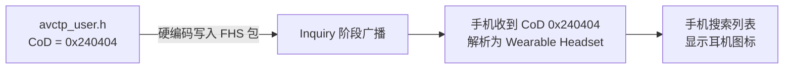

`0x240404` 的含义：
- `Major Service Class 0x24`：Audio / Rendering
- `Major Device Class 0x04`：Audio/Video
- `Minor Device Class 0x04`：Wearable Headset Device

如果想让手机把耳机识别成其他设备类型（比如 HID 键盘），修改 CoD 值即可，手机图标和分类就会跟着变。

### 由谁决定显示哪种设备图标

**由耳机决定，手机只是被动读取。**

CoD 是耳机在 Inquiry 阶段主动广播出去的信息，写在 FHS（Frequency Hopping Synchronization）包里。手机扫描到这个值之后解析它，按照 Bluetooth 规范的设备类型定义渲染对应的图标和分类，手机自身对这个值没有任何修改权。

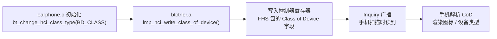

默认值 `BD_CLASS_WEARABLE_HEADSET`（`0x240404`）在 `btctrler.a` 初始化时写入控制器，无需主动调用也生效。`bt_change_hci_class_type()` 是运行时覆盖接口，目前仅在 LE Audio 模式下被调用（`earphone.c:480`）。

### 可修改的设备类型清单

`avctp_user.h:733–747` 提供了完整的 API 和预定义常量：

```c
/* 提供接口修改设备类型信息，修改什么的类型，会影响到手机显示的图标 */
extern void bt_change_hci_class_type(u32 class);
```

| 宏名 | CoD 值 | 手机显示效果 |
|------|--------|------------|
| `BD_CLASS_WEARABLE_HEADSET` | `0x240404` | 耳机图标（当前默认，iOS 10.2+ 显示 headset 图标） |
| `BD_CLASS_HANDS_FREE` | `0x240408` | 蓝牙图标（iOS 显示通用蓝牙图标） |
| `BD_CLASS_MICROPHONE` | `0x240410` | 麦克风 |
| `BD_CLASS_LOUDSPEAKER` | `0x240414` | 扬声器 |
| `BD_CLASS_HEADPHONES` | `0x240418` | 头戴式耳机（over-ear） |
| `BD_CLASS_CAR_AUDIO` | `0x240420` | 车载音频（**苹果手机连接时会自动弹出确认框**） |
| `BD_CLASS_HIFI_AUDIO` | `0x240428` | HiFi 音频设备 |
| `BD_CLASS_MOUSE` | `0x002580` | 鼠标 |
| `BD_CLASS_KEYBOARD` | `0x002540` | 键盘 |
| `BD_CLASS_KEYBOARD_MOUSE` | `0x0025C0` | 键盘+鼠标组合 |
| `BD_CLASS_REMOTE_CONTROL` | `0x00254C` | 遥控器 |
| `BD_CLASS_PAN_DEV` | `0x020118` | 个人局域网设备 |
| `BD_CLASS_TRANSFER_HEALTH` | `0x10091C` | 医疗健康设备 |

CoD 的三字节结构：

```
Byte 2 (bits 23–16)  Byte 1 (bits 15–8)   Byte 0 (bits 7–0)
┌──────────────────┐ ┌──────────────────┐ ┌─────────────────┐
│ Major Service    │ │  Major Device    │ │  Minor Device   │
│  Class           │ │   Class          │ │   Class         │
│  0x24 = Audio+   │ │  0x04 = Audio/   │ │  0x04 = Wearable│
│  Rendering       │ │  Video           │ │  Headset        │
└──────────────────┘ └──────────────────┘ └─────────────────┘
```

- **Major Service Class**：`0x24` 对所有音频类设备都一样，表示该设备提供 Audio 和 Rendering 服务
- **Major Device Class**：`0x04` = Audio/Video，`0x05` = Peripheral（鼠标/键盘），`0x09` = Health
- **Minor Device Class**：在同一个 Major Class 下细分具体类型（耳机/扬声器/麦克风等）

### 如何修改

在 `earphone.c` 蓝牙初始化阶段调用一次即可，建议放在其他 bt_set_xxx 调用的同一位置：

```c
// 示例：改成头戴耳机类型
bt_change_hci_class_type(BD_CLASS_HEADPHONES);

// 示例：改成车载音频（会触发苹果弹窗）
bt_change_hci_class_type(BD_CLASS_CAR_AUDIO);
```

> 注意：修改 CoD 只影响手机**搜索时**显示的图标和设备分类，不影响任何 Profile 的连接行为。Profile 的实际功能由 SDP 注册记录决定，与 CoD 无关。改成"键盘"的 CoD 但不注册 HID SDP，手机仍然按音频设备建立 A2DP/HFP 连接，只是图标显示不一致。

---

## SDK 蓝牙协议栈：开放区 vs 封闭区

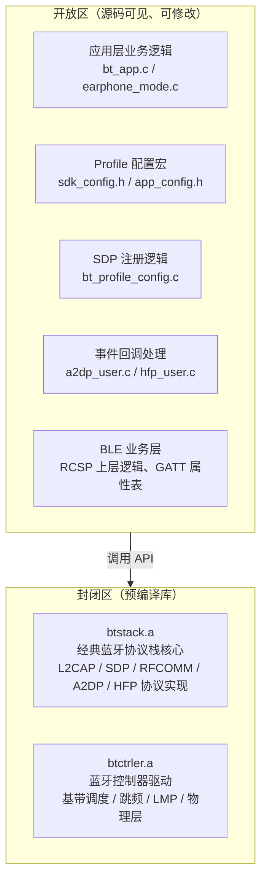

| 分类 | 内容 | 是否可改 |
|------|------|----------|
| 应用层回调 | A2DP 数据到来 / HFP 来电 / 按键事件等业务逻辑 | **完全开放** |
| Profile 开关 | 通过宏控制哪些 Profile 编译进去 | **完全开放** |
| SDP 注册内容 | 修改注册的服务属性、CoD 值 | **开放** |
| BLE GATT 属性表 | 自定义 characteristic、UUID | **开放** |
| RCSP 上层命令 | 自定义 App 与耳机的交互协议 | **开放** |
| 经典蓝牙协议栈 | L2CAP / SDP / RFCOMM / A2DP / HFP 的协议实现 | **封闭** (`btstack.a`) |
| 控制器驱动 | 基带、跳频、LMP、RF 物理层 | **封闭** (`btctrler.a`) |

> 封闭库是厂商核心 IP，开发者无法修改协议行为本身。但通过开放的 API 和事件回调，已经可以实现绝大多数产品差异化功能。

---

## 面试怎么讲

> "手机详情页那些开关——媒体音频、通话、通讯录——其实就是耳机在 SDP 里注册了哪些 Profile 服务记录的体现。SDK 里每个 Profile 对应一个宏开关，比如关掉 PBAP 的宏，bt_profile_config.c 就不会向协议栈注册 PBAP 的 SDP 记录，手机查询时找不到这个服务，详情页的通讯录权限开关就不出现了。同理，CoD 值控制手机搜索时显示的设备图标和类型，改一个数字，手机就认为你是耳机还是 HID 设备。\n\n至于蓝牙协议栈的开放程度：应用层是完全开放的，所有业务逻辑、事件回调、Profile 配置都有源码；协议栈核心和控制器驱动是预编译好的静态库，底层协议行为不能改，但这也是合理的——芯片厂把协议正确性保证在库里，我们在上面做产品逻辑就行。"

