# 蓝牙协议栈相关知识储备

## 面试定位：怎么谈蓝牙协议栈

蓝牙协议栈整体很复杂，直接背分层没有意义。面试时围绕 **TWS 耳机项目的三条链路** 来讲，让面试官听到的是真实的项目经验，而不是背书。

> 核心定位：**我对协议栈的理解是自上而下的——从业务需要出发，知道每个场景用哪条链路、哪个 Profile；链路层和基带层的细节在芯片 SDK 里封装好了，我更多是在事件回调和状态机这一层做业务逻辑。**

---

## 一、三条链路总览

TWS 耳机项目里，蓝牙通信本质上就是三条链路，每条用了不同协议：

```
手机   ──── 经典蓝牙（BR/EDR）────  主耳机    管"听"和"说"
手机   ──── BLE ────────────────  主耳机    管"配置"
主耳机  ─── TWS 私有协议 ──────── 副耳机    管"同步"
```

---

## 二、第一条链路：手机 ↔ 耳机，经典蓝牙，管"听"和"说"

### 音乐播放：A2DP

- 手机作为 **Source**，耳机作为 **Sink**
- 手机把 PCM 音频压缩成 **SBC 或 AAC** 通过经典蓝牙发过来
- 耳机芯片内解码还原成 PCM，送入 DAC 输出
- A2DP 走的是**异步链路**，允许重传，适合大数据量传输

### 通话：HFP

- HFP 建立的是 **SCO 同步链路**，专为语音设计
- 带宽固定、延迟低，不允许重传（丢了就丢了，和音乐传输机制不同）
- 耳机在 HFP 里扮演 HF（Hands-Free）角色，手机是 AG（Audio Gateway）

### A2DP 与 HFP 的切换

来电时需要从音乐模式切到通话模式，这是实际开发里接触最多的场景：
- 收到来电事件 → 挂起 A2DP 音频流 → 建立 SCO 通道 → 切到通话模式
- 挂断 → 释放 SCO → 恢复 A2DP 音频流

这个切换涉及两个 Profile 的状态协调，是 TWS 耳机业务逻辑的核心之一。

### AVRCP（附属于音乐场景）

- 媒体控制协议，负责耳机上的播放 / 暂停 / 上下曲等按键操作
- 也可以从手机同步获取当前歌曲信息（歌名、艺术家）

---

## 三、第二条链路：App ↔ 耳机，BLE，管"配置"

### 连接过程

1. 耳机上电后持续 **BLE 广播**（Advertising），让手机 App 能扫描到
2. App 发起连接，完成 **GAP 连接**
3. 连接建立后，App 和耳机通过 **GATT 自定义 Profile** 双向通信

### RCSP（Jieli 私有协议）

- 跑在 BLE 上，是芯片厂封装的一层私有协议
- 用途：EQ 调节、降噪模式切换、固件 OTA 升级、设备信息读取等控制类功能
- 本质是在 BLE 的 GATT 通道上定义了一套自己的命令格式

### SPP

- 和 RCSP 功能相近，但跑在**经典蓝牙**上，相当于经典蓝牙的串口透传
- 部分老款 Android 设备或特定场景下走这条路

### BLE 的核心概念

| 概念 | 作用 |
|------|------|
| **GAP**（Generic Access Profile）| 定义设备如何广播、扫描、建立连接 |
| **GATT**（Generic Attribute Profile）| 定义连接后数据如何组织和读写（Service / Characteristic） |
| **Advertising**（广播）| 设备未连接时持续发出的可被发现的信标 |

---

## 四、第三条链路：主耳 ↔ 副耳，TWS，管"同步"

### 数据转发

- 主耳从手机收到 A2DP 音频数据后，需要把数据**转发给副耳**
- 两只耳机基于同一份数据各自解码输出，保证双耳音频一致

### 时钟同步

- 两只耳机出声必须高度对齐（几十微秒内），否则有回声感
- 通过 TWS 私有协议同步**音频时钟**，而不是靠简单的数据复制

### 状态同步

除了音频，以下状态也需要在两耳间同步：
- 音量
- 降噪 / 通话模式
- 按键事件（副耳按键操作要同步到主耳再上报给手机）
- 入耳检测状态

### 主从角色切换

- 正常情况：主耳负责和手机连接，副耳挂在主耳下面
- 触发切换场景：主耳电量低、主耳入盒、用户手动切换
- 切换时副耳接管主耳角色，重新和手机建立经典蓝牙连接

---

## 五、连接管理（贯穿整个产品）

### 开机自动回连

上电后自动搜索并连接上次配对的设备，连接失败时有重试策略。

### 一拖二

同时维护两部手机的经典蓝牙连接，两条 A2DP 链路独立管理，来电 / 音乐的优先级由业务逻辑决定。

### 低功耗管理

- 经典蓝牙：sniff 模式，无数据时降低唤醒频率
- BLE：连接参数协商（连接间隔、从机延迟），App 断连后恢复广播

---

## 六、协议栈架构（背景理解，面试时不主动展开）

```
┌─────────────────────────────────────────────────────┐
│                    应用 / 业务层                      │
│  A2DP Sink │ HFP HF │ AVRCP │ GATT/RCSP │ TWS      │
├─────────────────────────────────────────────────────┤
│                  Profile 层                          │
├───────────────────────┬─────────────────────────────┤
│     经典蓝牙 Host      │        BLE Host             │
│  L2CAP / RFCOMM / SDP │  ATT / SM / L2CAP-LE        │
├───────────────────────┴─────────────────────────────┤
│              HCI（Host Controller Interface）         │
│        Host 与 Controller 的分界线                    │
├─────────────────────────────────────────────────────┤
│                  Controller                          │
│    Link Layer / Baseband / RF（射频、跳频、加密）     │
└─────────────────────────────────────────────────────┘
```

- **HCI 以上**：我在项目里实际接触和使用的层
- **HCI 以下**：芯片 SDK 封装好的库，不需要改，只需理解行为

---

## 七、面试回答模板

**问：你对蓝牙协议栈了解多少？**

> "我的了解主要来自 TWS 耳机项目，围绕三条链路建立起来的。第一条是手机和耳机之间的经典蓝牙——音乐走 A2DP，通话走 HFP，AVRCP 做媒体控制，实际开发里接触最多的是这两个 Profile 的状态切换，比如来电打断音乐、挂断后恢复。第二条是 BLE，主要是 App 连耳机做参数配置，耳机广播、App 连接后通过 GATT 自定义 Profile（RCSP）交互，OTA 升级也走这条路。第三条是两只耳机之间的 TWS 私有协议，做音频转发、时钟同步、状态同步和主从角色切换。协议栈底层的实现在芯片 SDK 里是封装好的，我更多是在事件回调和状态机这一层做业务逻辑。"

# 面经

## 手机蓝牙与耳机的连接过程？

连接过程分两种场景：**首次配对**（新设备，需要用户参与）和**自动重连**（已配对设备，开盖/上电自动完成）。在看具体流程之前，先理解蓝牙设备的几种工作状态。

---

### 蓝牙的几种工作状态

蓝牙设备在不同阶段处于不同的工作状态，理解这些状态是理解整个连接流程的基础：

| 状态 | 所属方 | 触发时机 | 通俗理解 |
|------|--------|---------|---------|
| **Inquiry**（查询） | 手机 | 点击"搜索蓝牙设备" | 手机在广播：**周围有没有设备？** |
| **Inquiry Scan**（查询扫描）| 耳机 | 上电初期开启，有超时，超时后自动关闭 | 耳机在监听：**有人找我吗？找到了就回应** |
| **Page**（寻呼） | 手机 | 用户选定目标后发起连接 | 手机在**呼叫某个具体 MAC 地址**的设备 |
| **Page Scan**（寻呼扫描）| 耳机 | 有配对记录时持续开启 | 耳机在等待：**我的主人快来连我了** |
| **Sniff**（嗅探省电）| 双方 | 连接后无数据传输时 | 双方约好只定期"打招呼"，**中间时间睡眠省电** |

> **Inquiry 和 Page 是两个独立阶段**：Inquiry 让手机"知道你在哪"，Page 才正式"建立连接"。已配对的设备重连时跳过 Inquiry，直接进入 Page。

耳机在不同场景下的状态切换（已由 SDK 中 `tws_dual_conn.c` 的逻辑验证）：

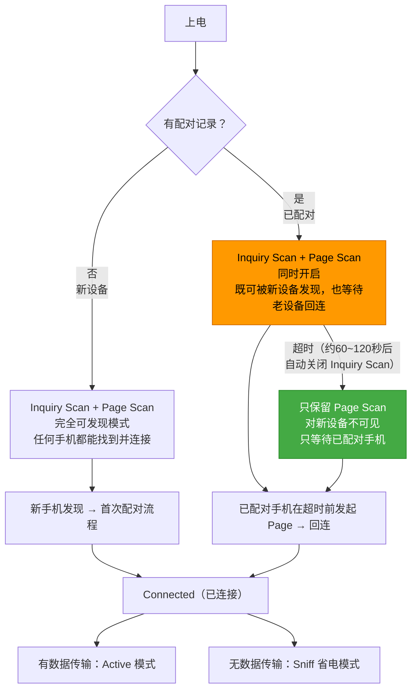

> 关键：有配对记录时，耳机**不是直接进 Page Scan**，而是先同时开 Inquiry Scan + Page Scan，给一段时间窗口让新设备也能发现它（比如换手机配对的场景）。超时后 Inquiry Scan 自动关闭，只保留 Page Scan 省电。橙色 = 短暂的双扫描窗口，绿色 = 常态的等待回连。

---

### 场景一：首次配对

用户第一次把耳机和手机配对，全程分三个阶段：**发现 → 配对 → Profile 连接**。

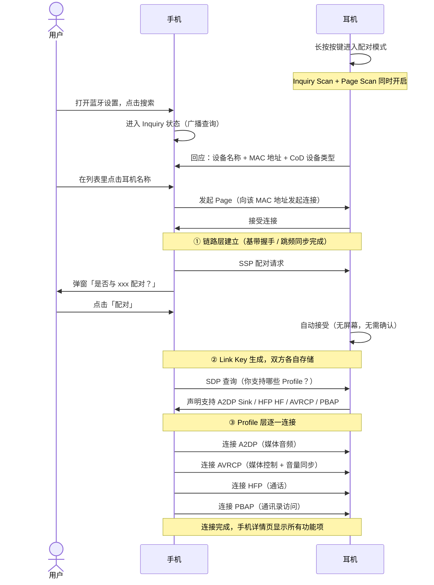

---

### SSP 配对：为什么不同场景弹窗不一样？

SSP 根据两端设备有没有屏幕和键盘，自动选择配对方式，所以用户看到的弹窗形式不同：

**① 手机 + 耳机 → 只有手机弹窗（Just Works 模式）**

耳机没有屏幕也没有键盘，协议判定它"没有能力做交互验证"，退化为单边确认。值得注意的是，弹窗里还附带了一个 **PBAP 授权选项**，用户在这里决定是否允许耳机访问联系人——这是 PBAP Profile 能否正常工作的前提，而不是连上之后才设置。

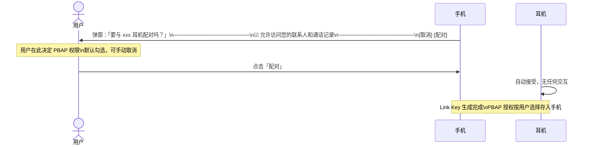

> PBAP 授权一旦在这里关掉，连接完成后详情页里"允许访问通讯录和通话记录"就是关闭状态，来电时耳机只能报号码不能报姓名。可以在详情页里随时重新开启。

**② 手机 + 手机 → 双方弹窗显示相同数字（Numeric Comparison 模式）**

两端都有屏幕和键盘，协议要求双方用户都确认，防止中间人伪装。

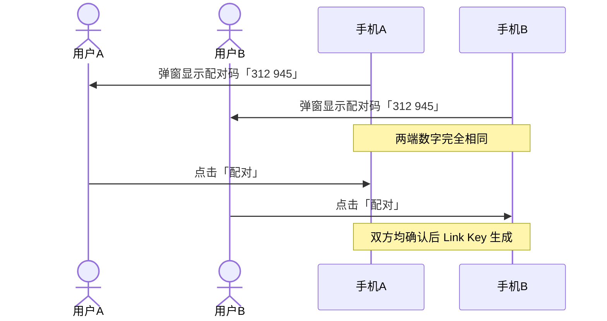

> 两台手机互传文件、蓝牙键盘首次连电脑，都是这个模式。数字必须一致，有人伪装数字就会对不上。

**③ 已配对设备重连 → 完全无感知**

Link Key 已存储，直接认证，无弹窗，用户不知道发生了什么。

---

### 场景二：自动重连

耳机出盒或上电，检测到配对记录，开启 Inquiry Scan + Page Scan，手机发起 Page 后底层走一轮 **Link Key 挑战-应答（Challenge-Response）** 完成认证，全程用户无感知。

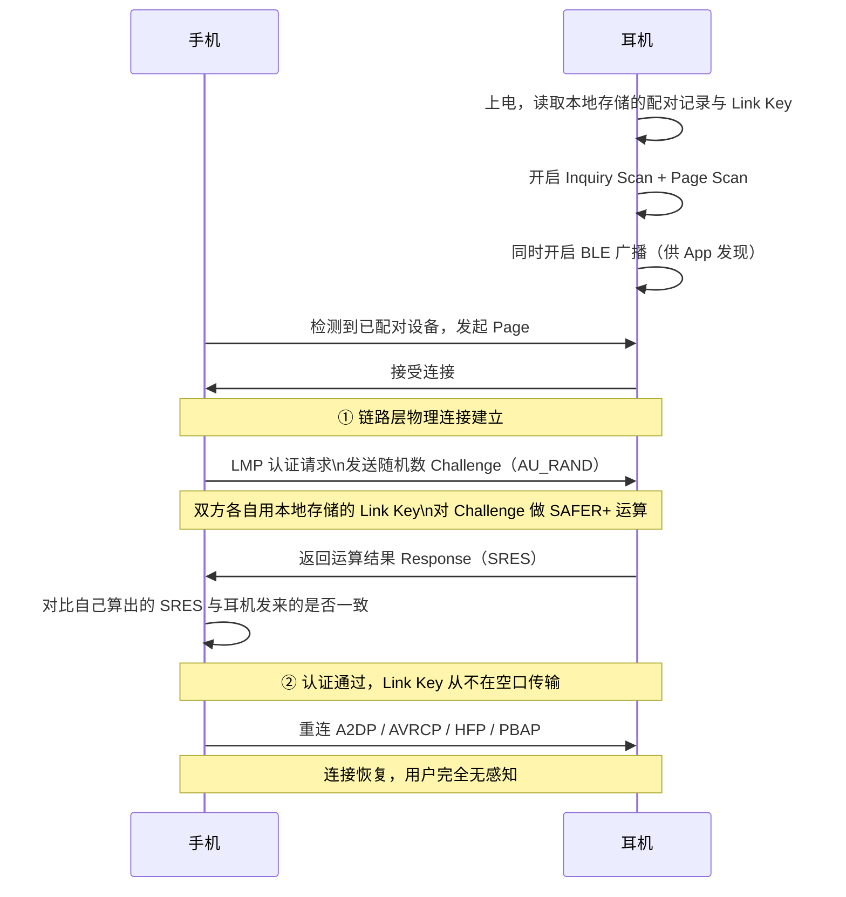

> **Link Key 认证的本质**：手机发一个随机数（Challenge），双方各自用本地存的 Link Key 对它做运算，耳机把结果（Response）发回来，手机对比"我算出来的"和"耳机发来的"是否一致。**Link Key 本身从不在空口传输**，即使有人抓到全部报文也无法还原密钥。
>
> **Link Key 是怎么来的**：首次配对时双方不是互传密钥，而是通过 ECDH 各自交换公钥，再独立推算出同一个共享密钥，最终从共享密钥派生 Link Key 存入本地 VM。公钥可以公开传，私钥从不离开设备。配对完成后双方各自存了一份 Link Key，后续重连直接取用。
>
> **耳机恢复出厂的场景**：耳机出厂重置后 VM 清空，Link Key 丢失。重连时耳机无法响应 Challenge，回复 Negative Reply，手机收到后触发重新 SSP 配对——弹窗重新出现，这也是为什么耳机重置后需要重新配对的原因。

---

### 连接完成后：手机界面与协议的对应

连上之后打开 Android 蓝牙详情页，界面上每一项都有对应的协议含义：

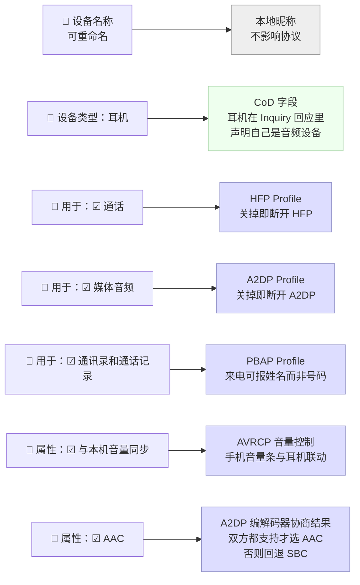

几个细节值得记住：

- **设备类型自动判断**：耳机在 Inquiry 回应时会在 CoD 字段里声明"我是音频设备"，手机收到后自动显示耳机图标，不需要用户选
- **"用于"的开关本质是 Profile 的启停**：每个 Profile 是独立的逻辑通道，关掉"通话"就是断开 HFP，关掉"媒体音频"就是断开 A2DP，互不影响
- **AAC 是协商出来的**：A2DP 连接时双方各自报支持的编码格式（SBC / AAC / LDAC 等），取交集里质量最高的。耳机只支持 SBC 的话，这里根本不会出现 AAC
- **PBAP 经常被忽略**：它让耳机或车机可以同步手机联系人，这样来电时耳机报的是"张三来电"而不是一串号码

---

### 两阶段本质：链路层 vs Profile 层

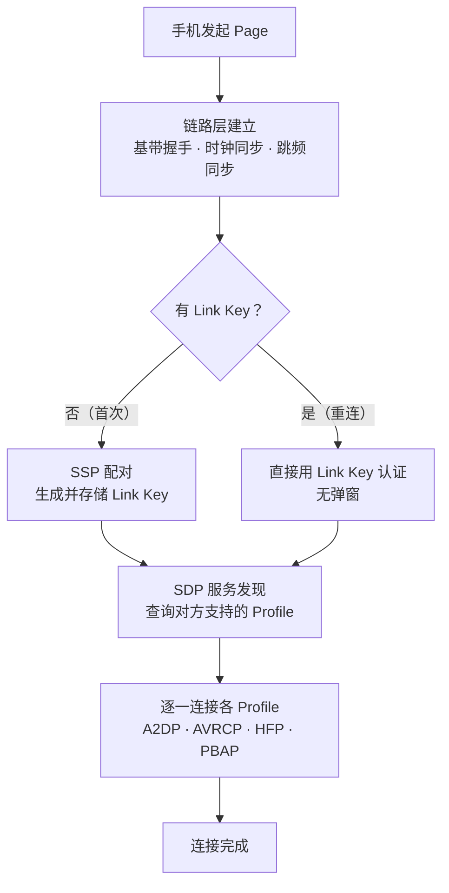

- **链路层**：解决「能不能通」——建立物理信道，完成跳频同步
- **Profile 层**：解决「用来干什么」——每个 Profile 是独立逻辑通道，互不干扰

---

### TWS 场景：双耳的连接顺序

TWS 耳机比普通耳机多一个环节——主耳连上手机之后，还要把副耳「拉进来」。

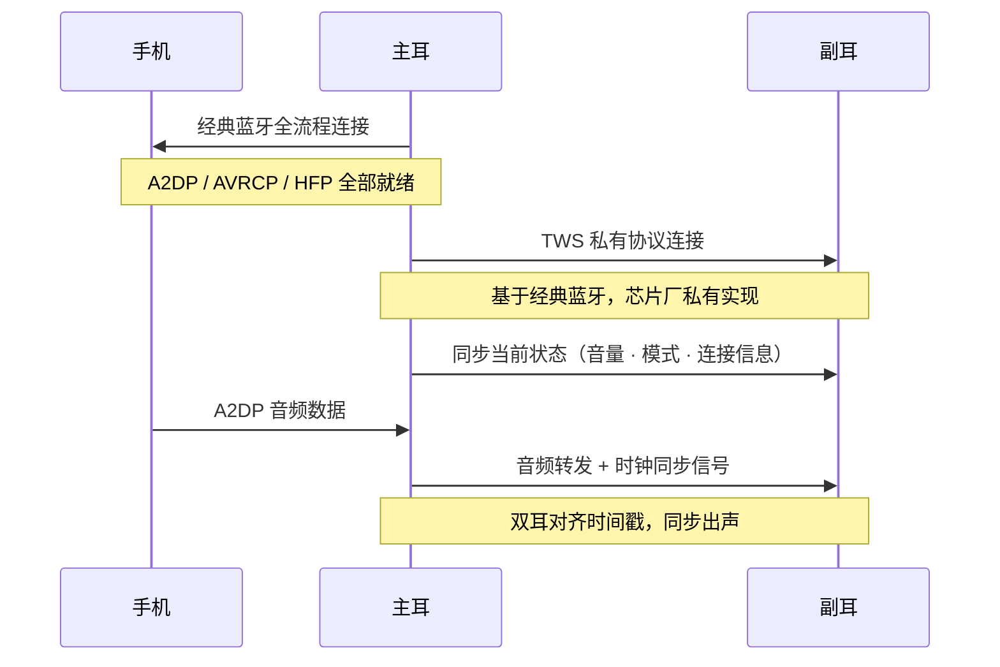

> 副耳**不直接和手机连接**，只和主耳通信。手机视角里只有一个蓝牙设备，副耳的存在对手机透明。

---

### 面试怎么讲

> "连接分两层。第一层链路层，手机先 Inquiry 广播找设备，耳机开着 Inquiry Scan 回应，手机拿到 MAC 后再 Page 发起点对点连接。有意思的是，耳机有配对记录时上电并不是只开 Page Scan，而是先同时开 Inquiry Scan 和 Page Scan，给一段时间窗口让新设备也能发现它，超时后 Inquiry Scan 自动关闭，只保留 Page Scan 等回连。首次配对走 SSP，耳机没屏幕所以只有手机单边弹窗，弹窗里还有一个 PBAP 授权勾选框，用户在这里决定是否允许访问联系人，这个权限决定了连上之后来电能不能报姓名。手机和手机配对就不一样，两边都弹窗显示相同的数字，两端都要确认，防止中间人伪装。重连时不是直接跳过认证，而是走一轮挑战-应答：手机发一个随机数，双方各自用本地存的 Link Key 对它做运算，耳机把结果发回来，手机对比一致才算通过——Link Key 从不在空口传输，安全的地方在这里。第二层 Profile 层，手机通过 SDP 查询耳机支持的功能，A2DP 媒体音频、HFP 通话、AVRCP 音量同步、PBAP 通讯录各自独立连接，手机详情页那几个开关就是这几个 Profile 的状态。AAC 是 A2DP 建立时双方协商编解码格式的结果，两端都支持才选 AAC。TWS 的话主耳连上手机后，芯片私有协议把副耳拉进来，手机只看到一个设备。"

---

# SDK 中 Profile 层可以控制手机详情页？蓝牙协议栈哪些部分是开放的？

## 结论先说

**可以。** 手机蓝牙详情页展示的内容，本质上来自耳机在 SDP（服务发现协议）里注册了哪些 Profile 记录。SDK 把这层控制权通过宏开关暴露出来，开发者通过修改配置宏，就能决定手机详情页显示哪些功能项。

---

## 控制链路：从宏开关到手机 UI

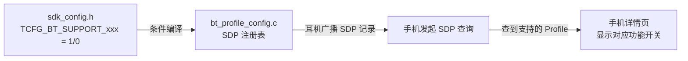

整个控制链路只有**四跳**，每一跳都可以定位到具体文件：

| 层次 | 文件 | 作用 |
|------|------|------|
| 开关定义 | `apps/earphone/board/br52/sdk_config.h` | 控制每个 Profile 是否编译进固件 |
| SDP 注册 | `apps/common/config/bt_profile_config.c` | 根据宏判断是否向协议栈注册 SDP 记录 |
| 协议栈通告 | `btstack.a`（已编译库） | 存储 SDP 数据库，连接时响应手机查询 |
| 手机 UI | 系统蓝牙设置 | 根据 SDP 查询结果渲染详情页 |

---

## 当前项目的 Profile 默认状态

| Profile | 宏开关 | 默认值 | 手机详情页表现 |
|---------|--------|--------|---------------|
| A2DP | `TCFG_BT_SUPPORT_A2DP` | **开启** | 显示「媒体音频」开关（默认开） |
| HFP | `TCFG_BT_SUPPORT_HFP` | **开启** | 显示「通话音频」开关（默认开） |
| AVRCP | `TCFG_BT_SUPPORT_AVCTP` | **开启** | 显示「与本机音量同步」 |
| HID | `TCFG_BT_SUPPORT_HID` | **开启** | 某些 Android 显示「输入设备」 |
| SPP | `TCFG_BT_SUPPORT_SPP` | **开启** | 串口透传通道（后台，不在 UI 显示） |
| PBAP | `TCFG_BT_SUPPORT_PBAP` | **关闭** | 关闭时详情页无通讯录权限开关 |
| MAP | `TCFG_BT_SUPPORT_MAP` | **关闭** | 关闭时不显示短信同步功能 |
| AAC | `TCFG_BT_SUPPORT_AAC` | **开启** | A2DP 详情页显示「AAC」属性标签 |

> PBAP 的特殊性：即使宏关闭，手机在 SSP 弹窗时仍可能出现通讯录勾选框（这是手机系统行为）；但如果宏关闭，耳机 SDP 里没有 PBAP 记录，连接后手机会发现查不到对应服务，通讯录开关会自动灰掉或不显示。

---

## 设备类型也是可配的：CoD

手机搜索到耳机时，设备列表里显示的图标（耳机图标 vs 手机图标 vs 电脑图标）来自 **CoD（Class of Device）** 字段：

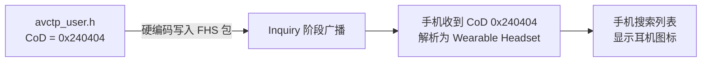

`0x240404` 的含义：
- `Major Service Class 0x24`：Audio / Rendering
- `Major Device Class 0x04`：Audio/Video
- `Minor Device Class 0x04`：Wearable Headset Device

如果想让手机把耳机识别成其他设备类型（比如 HID 键盘），修改 CoD 值即可，手机图标和分类就会跟着变。

---

## SDK 蓝牙协议栈：开放区 vs 封闭区

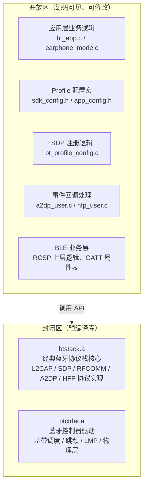

| 分类 | 内容 | 是否可改 |
|------|------|----------|
| 应用层回调 | A2DP 数据到来 / HFP 来电 / 按键事件等业务逻辑 | **完全开放** |
| Profile 开关 | 通过宏控制哪些 Profile 编译进去 | **完全开放** |
| SDP 注册内容 | 修改注册的服务属性、CoD 值 | **开放** |
| BLE GATT 属性表 | 自定义 characteristic、UUID | **开放** |
| RCSP 上层命令 | 自定义 App 与耳机的交互协议 | **开放** |
| 经典蓝牙协议栈 | L2CAP / SDP / RFCOMM / A2DP / HFP 的协议实现 | **封闭** (`btstack.a`) |
| 控制器驱动 | 基带、跳频、LMP、RF 物理层 | **封闭** (`btctrler.a`) |

> 封闭库是厂商核心 IP，开发者无法修改协议行为本身。但通过开放的 API 和事件回调，已经可以实现绝大多数产品差异化功能。

---

## 面试怎么讲

> "手机详情页那些开关——媒体音频、通话、通讯录——其实就是耳机在 SDP 里注册了哪些 Profile 服务记录的体现。SDK 里每个 Profile 对应一个宏开关，比如关掉 PBAP 的宏，bt_profile_config.c 就不会向协议栈注册 PBAP 的 SDP 记录，手机查询时找不到这个服务，详情页的通讯录权限开关就不出现了。同理，CoD 值控制手机搜索时显示的设备图标和类型，改一个数字，手机就认为你是耳机还是 HID 设备。\n\n至于蓝牙协议栈的开放程度：应用层是完全开放的，所有业务逻辑、事件回调、Profile 配置都有源码；协议栈核心和控制器驱动是预编译好的静态库，底层协议行为不能改，但这也是合理的——芯片厂把协议正确性保证在库里，我们在上面做产品逻辑就行。"

