# BLE 应用层框架学习指南

> 本文从通用 BLE 原理出发，最后落到 JL SDK 的具体实现。
> 前七章的知识与芯片无关，换任何平台都适用。

---

## 一、BLE 是什么？为什么耳机用它？

BLE（Bluetooth Low Energy，低功耗蓝牙）是蓝牙 4.0 引入的无线通信技术。它与经典蓝牙（BR/EDR）是两套独立的技术，共用蓝牙这个品牌，但底层完全不同。

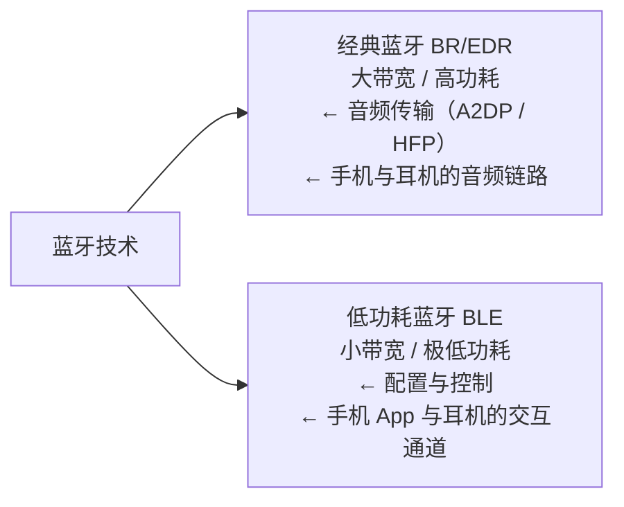
```mermaid
graph LR
  BT["蓝牙技术"]
  BT --> EDR["经典蓝牙 BR/EDR\n大带宽 / 高功耗\n← 音频传输（A2DP / HFP）\n← 手机与耳机的音频链路"]
  BT --> BLE["低功耗蓝牙 BLE\n小带宽 / 极低功耗\n← 配置与控制\n← 手机 App 与耳机的交互通道"]
```

耳机选择 BLE 做 App 通信的原因：

| 需求 | BLE 的答案 |
|------|-----------|
| 手机 App 随时能连上耳机 | 耳机持续广播，App 扫描即连，建立连接极快（< 1 秒） |
| 不能太费电 | BLE 连接功耗极低，连接间隔可达 1 秒，绝大多数时间休眠 |
| iOS 和 Android 都要支持 | 两个系统均原生支持 BLE，无需额外驱动 |
| 传输的是控制命令，不是音频 | BLE 带宽够用（几百 kbps），控制命令体积小 |

---

## 二、BLE 的两大支柱：GAP 和 GATT

所有 BLE 通信都建立在两个核心规范之上，它们由蓝牙 SIG 制定，**任何 BLE 芯片都必须实现**：

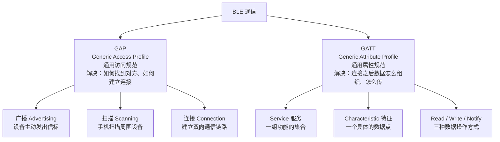
```mermaid
graph TD
  BLE["BLE 通信"]
  BLE --> GAP["GAP\nGeneric Access Profile\n通用访问规范\n解决：如何找到对方、如何建立连接"]
  BLE --> GATT["GATT\nGeneric Attribute Profile\n通用属性规范\n解决：连接之后数据怎么组织、怎么传"]

  GAP --> G1["广播 Advertising\n设备主动发出信标"]
  GAP --> G2["扫描 Scanning\n手机扫描周围设备"]
  GAP --> G3["连接 Connection\n建立双向通信链路"]

  GATT --> T1["Service 服务\n一组功能的集合"]
  GATT --> T2["Characteristic 特征\n一个具体的数据点"]
  GATT --> T3["Read / Write / Notify\n三种数据操作方式"]
```

可以用一个比喻来理解：
- **GAP** 是"找到服务员"的过程——餐厅门口放菜单（广播），顾客进门（连接）
- **GATT** 是"点菜和上菜"的过程——菜单的结构（Service/Characteristic），顾客点菜（Write），服务员上菜（Notify）

---

## 三、GAP：设备如何被发现和连接

### 3.1 角色定义

BLE 通信中，两端设备扮演不同角色：


```mermaid
graph LR
  P["外设 Peripheral\n← 耳机\n负责广播，被动等待连接"]
  C["中心设备 Central\n← 手机 App\n负责扫描，主动发起连接"]
  P -- "广播 ADV_IND" --> C
  C -- "连接请求 CONNECT_REQ" --> P
  P <-- "双向 GATT 通信" --> C
```

### 3.2 广播包的结构

广播包最大 31 字节，是设备对外"自我介绍"的信息，App 根据广播包内容决定要不要连接：

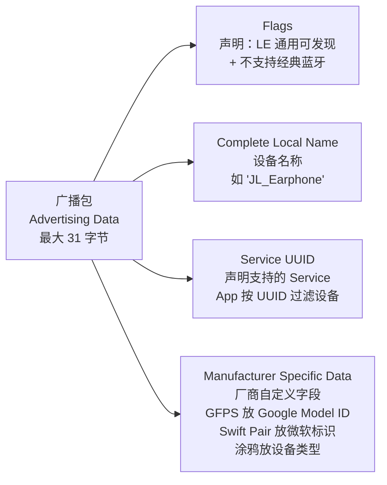
```mermaid
graph LR
  ADV["广播包\nAdvertising Data\n最大 31 字节"]
  ADV --> F["Flags\n声明：LE 通用可发现\n+ 不支持经典蓝牙"]
  ADV --> N["Complete Local Name\n设备名称\n如 'JL_Earphone'"]
  ADV --> U["Service UUID\n声明支持的 Service\nApp 按 UUID 过滤设备"]
  ADV --> M["Manufacturer Specific Data\n厂商自定义字段\nGFPS 放 Google Model ID\nSwift Pair 放微软标识\n涂鸦放设备类型"]
```

> 扫描响应包（Scan Response）是广播包的补充，结构相同，App 主动查询时才返回。用来放广播包放不下的内容，比如完整设备名。

### 3.3 GAP 连接的完整流程

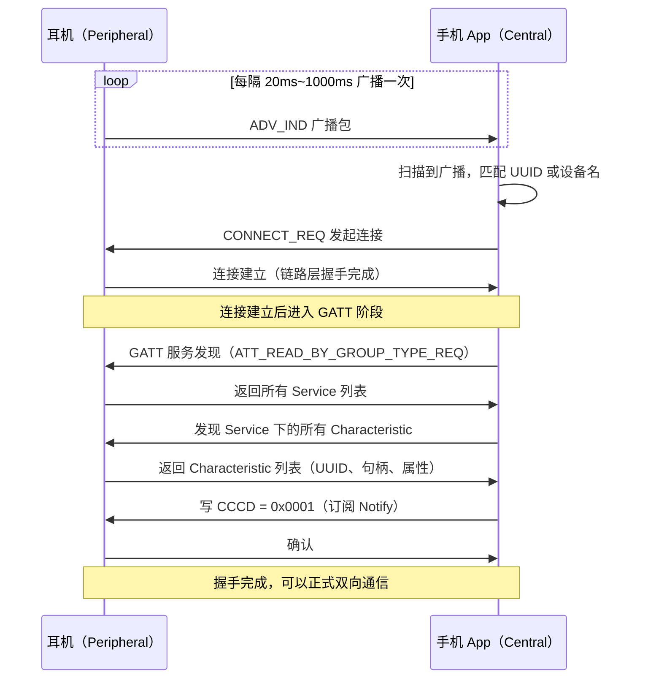
```mermaid
sequenceDiagram
  participant 耳机 as 耳机（Peripheral）
  participant App as 手机 App（Central）

  loop 每隔 20ms~1000ms 广播一次
    耳机->>App: ADV_IND 广播包
  end

  App->>App: 扫描到广播，匹配 UUID 或设备名
  App->>耳机: CONNECT_REQ 发起连接
  耳机->>App: 连接建立（链路层握手完成）

  Note over 耳机,App: 连接建立后进入 GATT 阶段
  App->>耳机: GATT 服务发现（ATT_READ_BY_GROUP_TYPE_REQ）
  耳机->>App: 返回所有 Service 列表

  App->>耳机: 发现 Service 下的所有 Characteristic
  耳机->>App: 返回 Characteristic 列表（UUID、句柄、属性）

  App->>耳机: 写 CCCD = 0x0001（订阅 Notify）
  耳机->>App: 确认

  Note over 耳机,App: 握手完成，可以正式双向通信
```

---

## 四、GATT：连接后数据如何组织和交换

### 4.1 GATT 数据模型

GATT 定义了一套树形的数据组织方式，设备把自己的所有能力都用这个结构来描述：

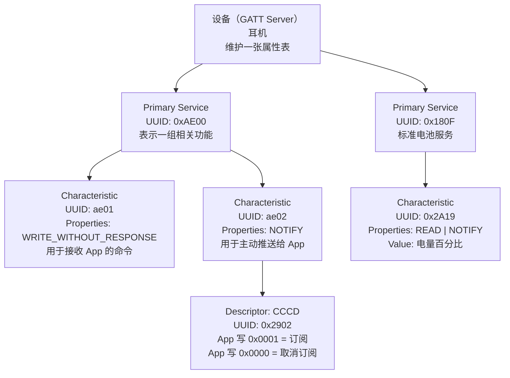
```mermaid
graph TD
  Server["设备（GATT Server）\n耳机\n维护一张属性表"]

  Server --> S1["Primary Service\nUUID: 0xAE00\n表示一组相关功能"]
  Server --> S2["Primary Service\nUUID: 0x180F\n标准电池服务"]

  S1 --> C1["Characteristic\nUUID: ae01\nProperties: WRITE_WITHOUT_RESPONSE\n用于接收 App 的命令"]
  S1 --> C2["Characteristic\nUUID: ae02\nProperties: NOTIFY\n用于主动推送给 App"]
  C2 --> D["Descriptor: CCCD\nUUID: 0x2902\nApp 写 0x0001 = 订阅\nApp 写 0x0000 = 取消订阅"]

  S2 --> C3["Characteristic\nUUID: 0x2A19\nProperties: READ | NOTIFY\nValue: 电量百分比"]
```

每个节点都有一个**句柄（Handle）**——一个 16-bit 整数，是访问这个属性的唯一地址。App 读写数据时，用句柄而不是 UUID 来定位具体的 Characteristic。

### 4.2 四种核心操作

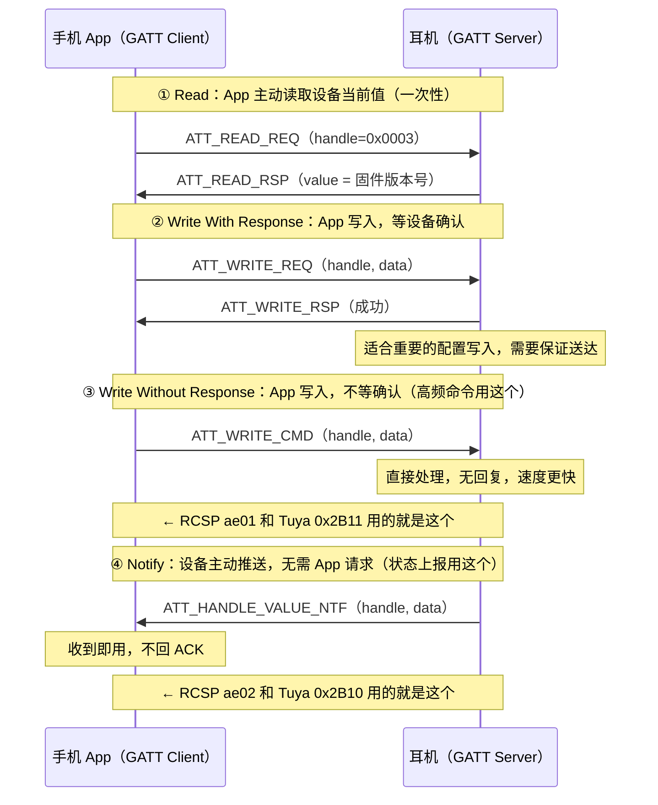
```mermaid
sequenceDiagram
  participant App as 手机 App（GATT Client）
  participant 耳机 as 耳机（GATT Server）

  Note over App,耳机: ① Read：App 主动读取设备当前值（一次性）
  App->>耳机: ATT_READ_REQ（handle=0x0003）
  耳机->>App: ATT_READ_RSP（value = 固件版本号）

  Note over App,耳机: ② Write With Response：App 写入，等设备确认
  App->>耳机: ATT_WRITE_REQ（handle, data）
  耳机->>App: ATT_WRITE_RSP（成功）
  Note over 耳机: 适合重要的配置写入，需要保证送达

  Note over App,耳机: ③ Write Without Response：App 写入，不等确认（高频命令用这个）
  App->>耳机: ATT_WRITE_CMD（handle, data）
  Note over 耳机: 直接处理，无回复，速度更快
  Note over App,耳机: ← RCSP ae01 和 Tuya 0x2B11 用的就是这个

  Note over App,耳机: ④ Notify：设备主动推送，无需 App 请求（状态上报用这个）
  耳机->>App: ATT_HANDLE_VALUE_NTF（handle, data）
  Note over App: 收到即用，不回 ACK
  Note over App,耳机: ← RCSP ae02 和 Tuya 0x2B10 用的就是这个
```

> **实际开发最常用的组合：Write Without Response（下行命令）+ Notify（上行上报）**
> 下行不等 ACK 速度快，上行设备主动推送不占用 App 轮询资源，两者配合完成双向通信。

### 4.3 UUID 体系

UUID 是 GATT 里每个 Service 和 Characteristic 的"身份证"：

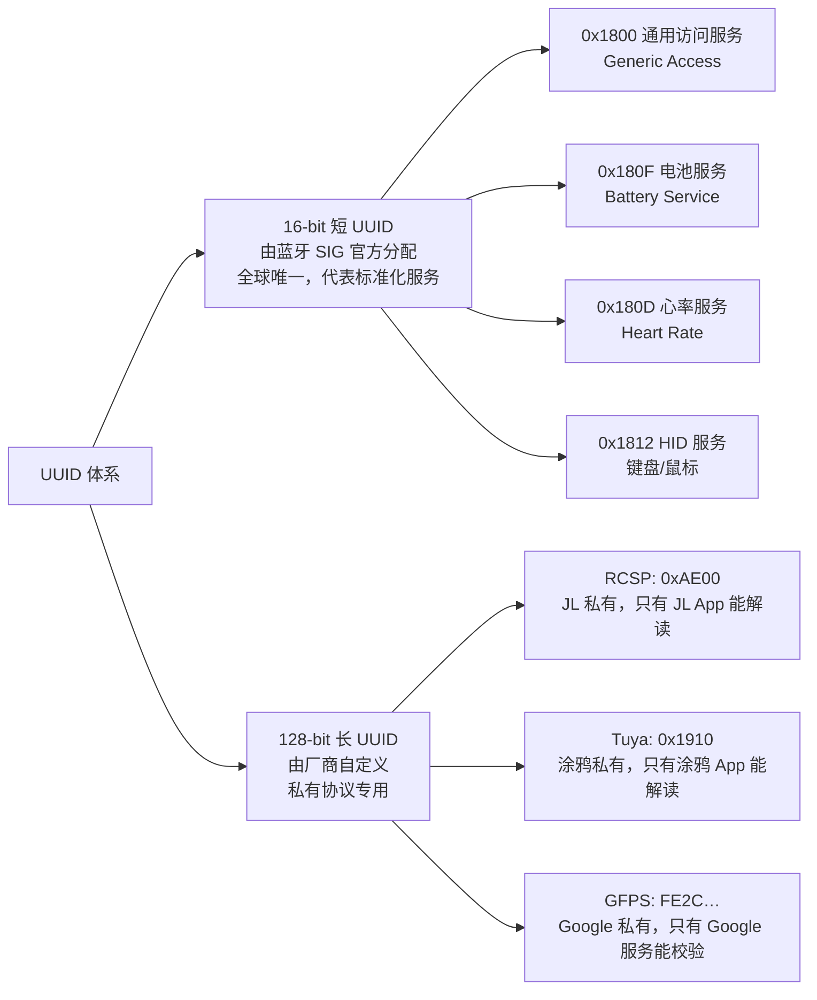
```mermaid
graph LR
  UUID["UUID 体系"]

  UUID --> SIG16["16-bit 短 UUID\n由蓝牙 SIG 官方分配\n全球唯一，代表标准化服务"]
  UUID --> Custom128["128-bit 长 UUID\n由厂商自定义\n私有协议专用"]

  SIG16 --> E1["0x1800 通用访问服务\nGeneric Access"]
  SIG16 --> E2["0x180F 电池服务\nBattery Service"]
  SIG16 --> E3["0x180D 心率服务\nHeart Rate"]
  SIG16 --> E4["0x1812 HID 服务\n键盘/鼠标"]

  Custom128 --> E5["RCSP: 0xAE00\nJL 私有，只有 JL App 能解读"]
  Custom128 --> E6["Tuya: 0x1910\n涂鸦私有，只有涂鸦 App 能解读"]
  Custom128 --> E7["GFPS: FE2C…\nGoogle 私有，只有 Google 服务能校验"]
```

16-bit UUID 是 128-bit 基础 UUID `0000xxxx-0000-1000-8000-00805F9B34FB` 的缩写形式，本质上是同一套体系。

---

## 五、为什么所有芯片厂商都必须实现 GATT？

### 5.1 蓝牙 SIG 的强制要求

蓝牙 SIG 规定：**任何申请蓝牙认证标志的产品，其 BLE 实现必须符合 GATT 规范。** 这不是建议，是强制要求——没有 GATT，就拿不到蓝牙认证，就不能印蓝牙 Logo 上市。

因此，每家芯片厂商都必须用自己的硬件（寄存器、DMA、RF）去实现同一套 GATT 规范，然后把 GATT 能力通过 API 暴露给开发者：

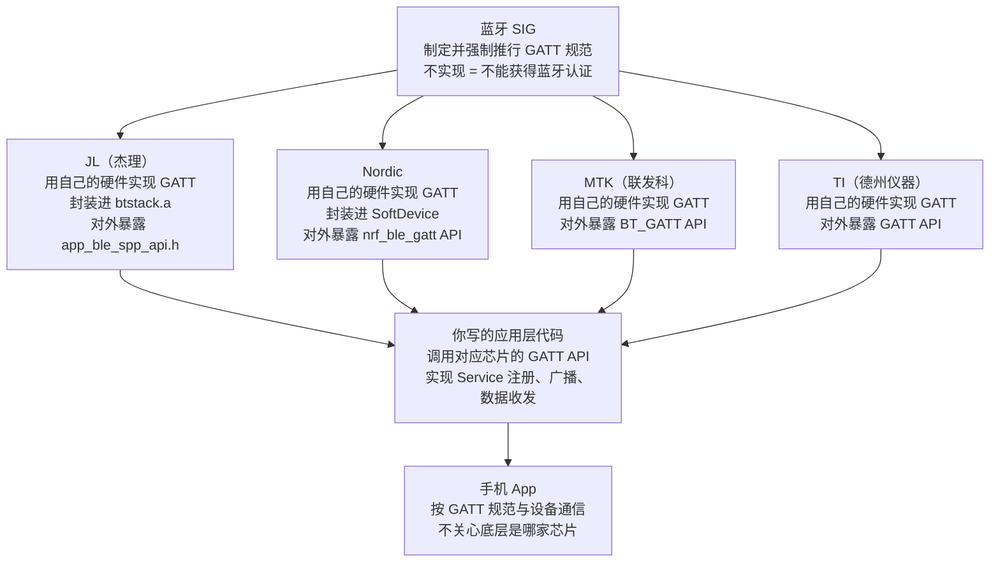
```mermaid
graph TD
  SIG["蓝牙 SIG\n制定并强制推行 GATT 规范\n不实现 = 不能获得蓝牙认证"]

  SIG --> JL["JL（杰理）\n用自己的硬件实现 GATT\n封装进 btstack.a\n对外暴露 app_ble_spp_api.h"]
  SIG --> Nordic["Nordic\n用自己的硬件实现 GATT\n封装进 SoftDevice\n对外暴露 nrf_ble_gatt API"]
  SIG --> MTK["MTK（联发科）\n用自己的硬件实现 GATT\n对外暴露 BT_GATT API"]
  SIG --> TI["TI（德州仪器）\n用自己的硬件实现 GATT\n对外暴露 GATT API"]

  JL --> APP["你写的应用层代码\n调用对应芯片的 GATT API\n实现 Service 注册、广播、数据收发"]
  Nordic --> APP
  MTK --> APP
  TI --> APP

  APP --> PHONE["手机 App\n按 GATT 规范与设备通信\n不关心底层是哪家芯片"]
```

### 5.2 GATT 统一规范带来的可移植性

因为所有芯片都实现同一套 GATT 行为，应用层的业务逻辑是可以跨芯片迁移的。**换芯片 ≠ 重写业务逻辑，只需要换调用的底层 API。**

涂鸦 SDK 完美地展示了这一点：

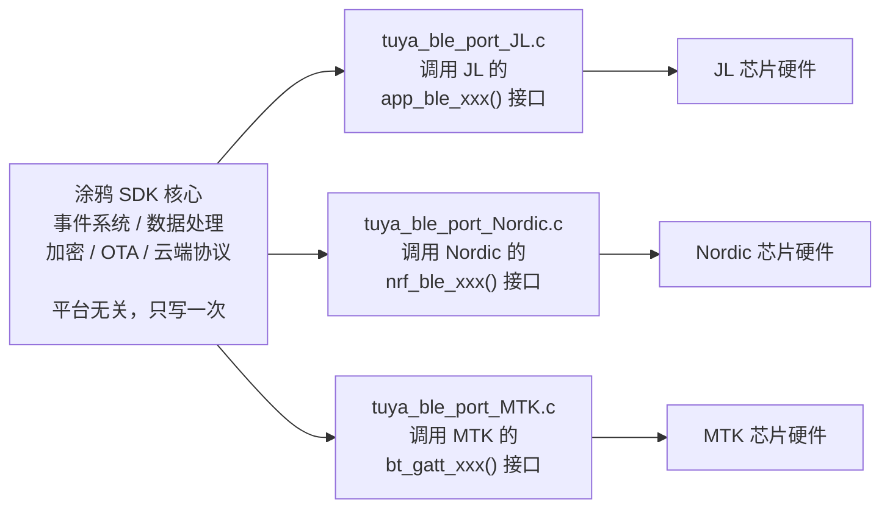
```mermaid
graph LR
  TuyaCore["涂鸦 SDK 核心\n事件系统 / 数据处理\n加密 / OTA / 云端协议\n\n平台无关，只写一次"]

  TuyaCore --> PJL["tuya_ble_port_JL.c\n调用 JL 的\napp_ble_xxx() 接口"]
  TuyaCore --> PNordic["tuya_ble_port_Nordic.c\n调用 Nordic 的\nnrf_ble_xxx() 接口"]
  TuyaCore --> PMTK["tuya_ble_port_MTK.c\n调用 MTK 的\nbt_gatt_xxx() 接口"]

  PJL --> HW_JL["JL 芯片硬件"]
  PNordic --> HW_Nordic["Nordic 芯片硬件"]
  PMTK --> HW_MTK["MTK 芯片硬件"]
```

Port 层（`tuya_ble_port_xxx.c`）是胶水代码，把涂鸦 SDK 的"发送数据""开启广播""获取 MAC"等抽象操作，翻译成该芯片平台的具体 API 调用。**这个 Port 层通常只有几百行，是移植一个新平台的全部工作量。**

---

## 六、BLE 应用层协议的通用结构

所有跑在 BLE 上的应用协议，无论来自哪家厂商，都遵循同一套套路：

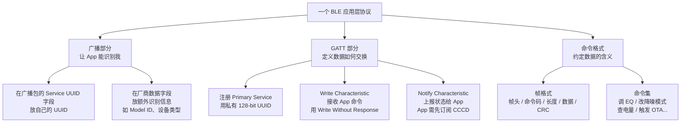
```mermaid
graph TD
  Proto["一个 BLE 应用层协议"]

  Proto --> ADV_PART["广播部分\n让 App 能识别我"]
  Proto --> GATT_PART["GATT 部分\n定义数据如何交换"]
  Proto --> CMD_PART["命令格式\n约定数据的含义"]

  ADV_PART --> A1["在广播包的 Service UUID 字段\n放自己的 UUID"]
  ADV_PART --> A2["在厂商数据字段\n放额外识别信息\n如 Model ID、设备类型"]

  GATT_PART --> G1["注册 Primary Service\n用私有 128-bit UUID"]
  GATT_PART --> G2["Write Characteristic\n接收 App 命令\n用 Write Without Response"]
  GATT_PART --> G3["Notify Characteristic\n上报状态给 App\nApp 需先订阅 CCCD"]

  CMD_PART --> C1["帧格式\n帧头 / 命令码 / 长度 / 数据 / CRC"]
  CMD_PART --> C2["命令集\n调 EQ / 改降噪模式\n查电量 / 触发 OTA..."]
```

**标准协议 vs 私有协议的本质区别**：

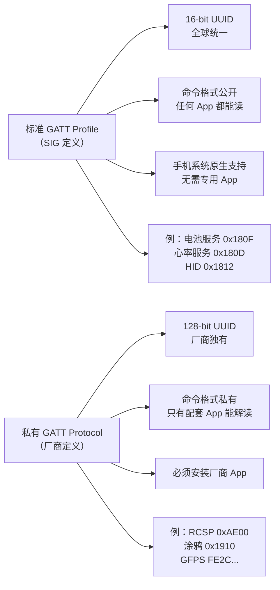
```mermaid
graph LR
  STANDARD["标准 GATT Profile\n（SIG 定义）"]
  CUSTOM["私有 GATT Protocol\n（厂商定义）"]

  STANDARD --> S1["16-bit UUID\n全球统一"]
  STANDARD --> S2["命令格式公开\n任何 App 都能读"]
  STANDARD --> S3["手机系统原生支持\n无需专用 App"]
  STANDARD --> S4["例：电池服务 0x180F\n心率服务 0x180D\nHID 0x1812"]

  CUSTOM --> C1["128-bit UUID\n厂商独有"]
  CUSTOM --> C2["命令格式私有\n只有配套 App 能解读"]
  CUSTOM --> C3["必须安装厂商 App"]
  CUSTOM --> C4["例：RCSP 0xAE00\n涂鸦 0x1910\nGFPS FE2C..."]
```

---

## 七、以 RCSP 和涂鸦为例

两个协议都遵循上一章描述的通用结构，但来历不同、接入方式不同：

### RCSP（JL 私有）

- **来源**：JL 杰理自己定义，专配 JL 官方 App
- **GATT Service**：`0xAE00`
- **数据方向**：`ae01`（Write Without Response，下行）+ `ae02`（Notify，上行）
- **传输通道**：同时支持 **BLE ATT**、**经典蓝牙 SPP**、**GATT over EDR**（三通道并行，`rcsp_interface.c` 中的 `bt_rcsp_data_send()` 同时向三条通道广播数据）
- **SDK 位置**：`apps/common/third_party_profile/jieli/rcsp/`

### 涂鸦 Tuya

- **来源**：涂鸦智能平台，全球通用 IoT 生态，配套 Smart Life / Tuya App
- **GATT Service**：`0x1910`
- **数据方向**：`0x2B11`（Write，下行）+ `0x2B10`（Notify，上行）
- **SDK 位置**：`apps/common/third_party_profile/tuya_protocol/`

**对比：**

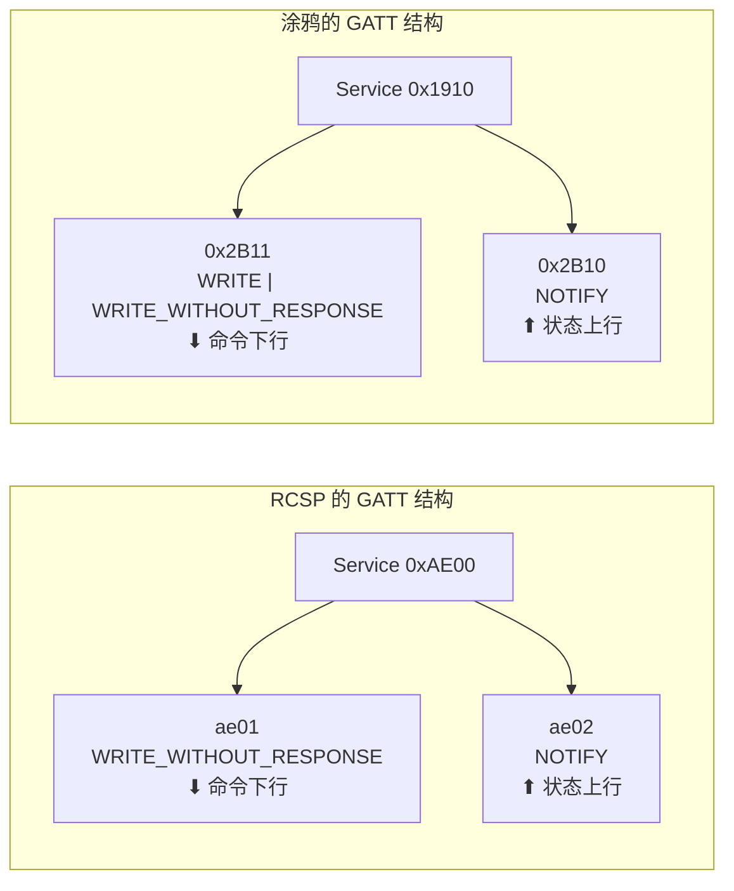
```mermaid
graph LR
  subgraph RCSP["RCSP 的 GATT 结构"]
    R1["Service 0xAE00"]
    R2["ae01\nWRITE_WITHOUT_RESPONSE\n⬇ 命令下行"]
    R3["ae02\nNOTIFY\n⬆ 状态上行"]
    R1 --> R2
    R1 --> R3
  end

  subgraph Tuya["涂鸦的 GATT 结构"]
    T1["Service 0x1910"]
    T2["0x2B11\nWRITE | WRITE_WITHOUT_RESPONSE\n⬇ 命令下行"]
    T3["0x2B10\nNOTIFY\n⬆ 状态上行"]
    T1 --> T2
    T1 --> T3
  end
```

可以看到，两者的 GATT 骨架完全一样，只是 UUID 不同——**UUID 是协议的"身份证"，骨架是 BLE 应用层的行业惯例。**

---

## 八、芯片厂商如何实现 GATT：以 JL 为例

前面几章都是通用 BLE 知识。从这里开始，讲 JL 芯片的具体实现——换其他芯片时，原理相同，API 名字不同。

### 8.1 JL SDK 的层次结构

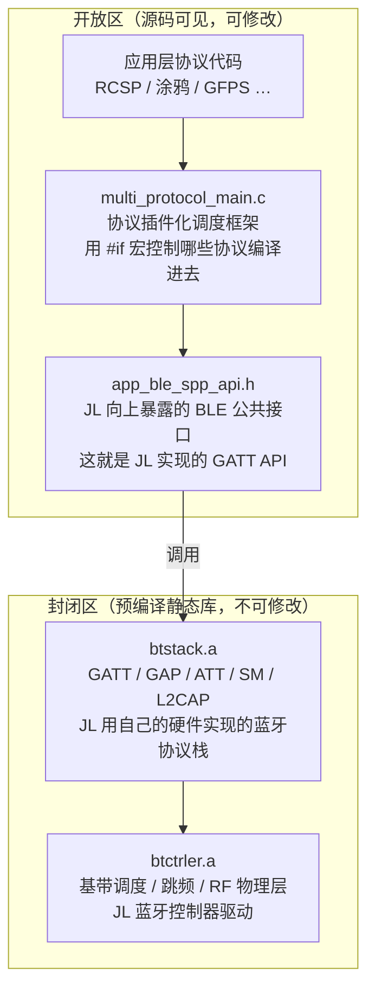
```mermaid
graph TB
  subgraph OPEN["开放区（源码可见，可修改）"]
    O1["应用层协议代码\nRCSP / 涂鸦 / GFPS …"]
    O2["multi_protocol_main.c\n协议插件化调度框架\n用 #if 宏控制哪些协议编译进去"]
    O3["app_ble_spp_api.h\nJL 向上暴露的 BLE 公共接口\n这就是 JL 实现的 GATT API"]
  end

  subgraph CLOSED["封闭区（预编译静态库，不可修改）"]
    C1["btstack.a\nGATT / GAP / ATT / SM / L2CAP\nJL 用自己的硬件实现的蓝牙协议栈"]
    C2["btctrler.a\n基带调度 / 跳频 / RF 物理层\nJL 蓝牙控制器驱动"]
  end

  O1 --> O2 --> O3
  O3 -- "调用" --> C1 --> C2
```

### 8.2 JL 开放的核心 BLE 接口（`app_ble_spp_api.h`）

```c
// ── 模块初始化 ──────────────────────────────────────────────
app_ble_init();                            // 启动 BLE 协议栈
app_ble_sm_init(io_cap, auth_req, ...);    // 配置安全配对参数
le_device_db_init();                       // 初始化设备绑定数据库

// ── GATT Profile 注册 ────────────────────────────────────────
app_ble_hdl_alloc();                       // 分配句柄（每个协议独立一个）
app_ble_profile_set(hdl, profile_data[]);  // 注册 GATT 属性表

// ── 广播控制（对应 GAP 广播） ─────────────────────────────────
app_ble_adv_data_set(hdl, data, len);      // 设置广播包内容
app_ble_rsp_data_set(hdl, data, len);      // 设置扫描响应包
app_ble_adv_enable(hdl, en);               // 开启/关闭广播
app_ble_set_adv_param(hdl, interval, ...); // 广播间隔等参数

// ── GATT 数据收发 ────────────────────────────────────────────
app_ble_att_send_data(hdl, handle, data, len, ATT_OP_NOTIFY); // 发 Notify
app_ble_att_write_callback_register(hdl, callback);  // 注册 Write 回调
app_ble_att_read_callback_register(hdl, callback);   // 注册 Read 回调

// ── 连接状态回调 ─────────────────────────────────────────────
app_ble_state_update_callback_regitster(callback);
// APP_BLE_CONNECTION_COMPLETE / APP_BLE_DISCONNECTION_COMPLETE

// ── 连接管理 ────────────────────────────────────────────────
app_ble_disconnect(hdl);
app_ble_remote_mac_addr_get(hdl);
```

**句柄机制**：多个协议并存时，每个协议用自己的句柄操作，共用一个底层 ATT 发送缓冲：

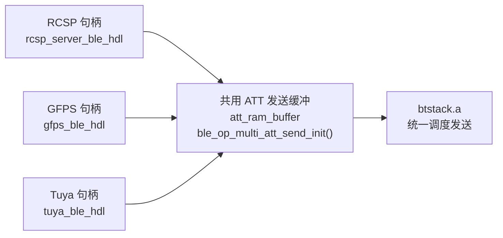
```mermaid
graph LR
  RCSP_hdl["RCSP 句柄\nrcsp_server_ble_hdl"]
  GFPS_hdl["GFPS 句柄\ngfps_ble_hdl"]
  Tuya_hdl["Tuya 句柄\ntuya_ble_hdl"]

  RCSP_hdl --> ATT_BUF["共用 ATT 发送缓冲\natt_ram_buffer\nble_op_multi_att_send_init()"]
  GFPS_hdl --> ATT_BUF
  Tuya_hdl --> ATT_BUF
  ATT_BUF --> Stack["btstack.a\n统一调度发送"]
```

### 8.3 RCSP 与涂鸦在 JL SDK 中的接入方式对比

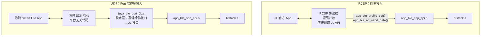
```mermaid
graph TD
  subgraph RCSP架构["RCSP：原生接入"]
    R_App["JL 官方 App"]
    R_Proto["RCSP 协议层\n源码开放\n直接调用 JL API"]
    R_API["app_ble_spp_api.h"]
    R_Stack["btstack.a"]
    R_App <--> R_Proto
    R_Proto -- "app_ble_profile_set()\napp_ble_att_send_data()" --> R_API --> R_Stack
  end

  subgraph Tuya架构["涂鸦：Port 层移植接入"]
    T_App["涂鸦 Smart Life App"]
    T_SDK["涂鸦 SDK 核心\n平台无关代码"]
    T_Port["tuya_ble_port_JL.c\n胶水层：翻译涂鸦接口\n→ JL 接口"]
    T_API["app_ble_spp_api.h"]
    T_Stack["btstack.a"]
    T_App <--> T_SDK
    T_SDK --> T_Port --> T_API --> T_Stack
  end
```

### 8.4 一个协议从上电到通信的完整流程

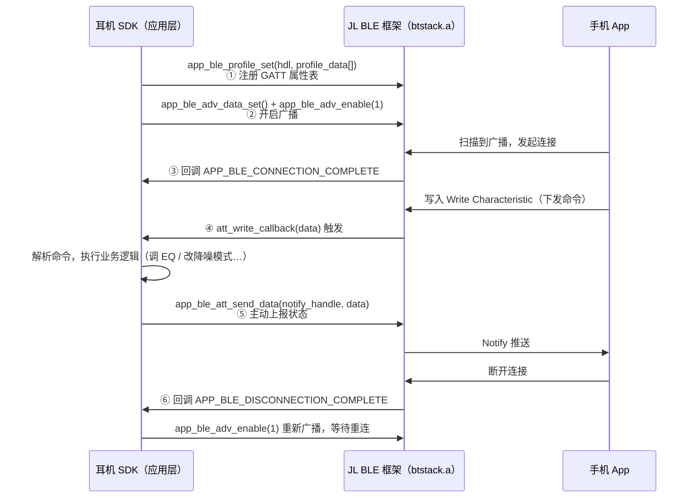
```mermaid
sequenceDiagram
  participant SDK as 耳机 SDK（应用层）
  participant JL_BLE as JL BLE 框架（btstack.a）
  participant App as 手机 App

  SDK->>JL_BLE: app_ble_profile_set(hdl, profile_data[])<br/>① 注册 GATT 属性表

  SDK->>JL_BLE: app_ble_adv_data_set() + app_ble_adv_enable(1)<br/>② 开启广播

  App->>JL_BLE: 扫描到广播，发起连接
  JL_BLE->>SDK: ③ 回调 APP_BLE_CONNECTION_COMPLETE

  App->>JL_BLE: 写入 Write Characteristic（下发命令）
  JL_BLE->>SDK: ④ att_write_callback(data) 触发
  SDK->>SDK: 解析命令，执行业务逻辑（调 EQ / 改降噪模式…）

  SDK->>JL_BLE: app_ble_att_send_data(notify_handle, data)<br/>⑤ 主动上报状态
  JL_BLE->>App: Notify 推送

  App->>JL_BLE: 断开连接
  JL_BLE->>SDK: ⑥ 回调 APP_BLE_DISCONNECTION_COMPLETE
  SDK->>JL_BLE: app_ble_adv_enable(1) 重新广播，等待重连
```

### 8.5 安全配对在 JL SDK 中的配置

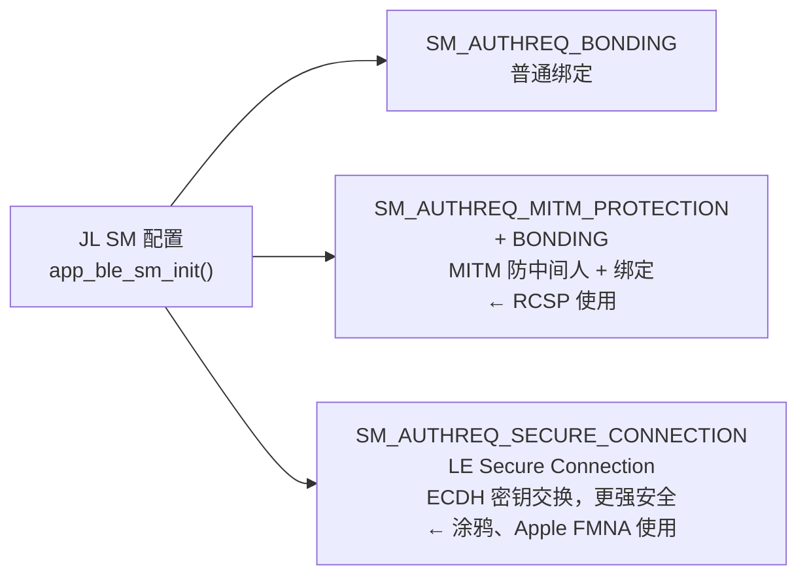
```mermaid
graph LR
  SEC["JL SM 配置\napp_ble_sm_init()"]
  SEC --> LOW["SM_AUTHREQ_BONDING\n普通绑定"]
  SEC --> MID["SM_AUTHREQ_MITM_PROTECTION\n+ BONDING\nMITM 防中间人 + 绑定\n← RCSP 使用"]
  SEC --> HIGH["SM_AUTHREQ_SECURE_CONNECTION\nLE Secure Connection\nECDH 密钥交换，更强安全\n← 涂鸦、Apple FMNA 使用"]
```

---

## 九、换芯片时怎么迁移？

掌握了前面的通用原理，换芯片时的迁移路径是清晰的：

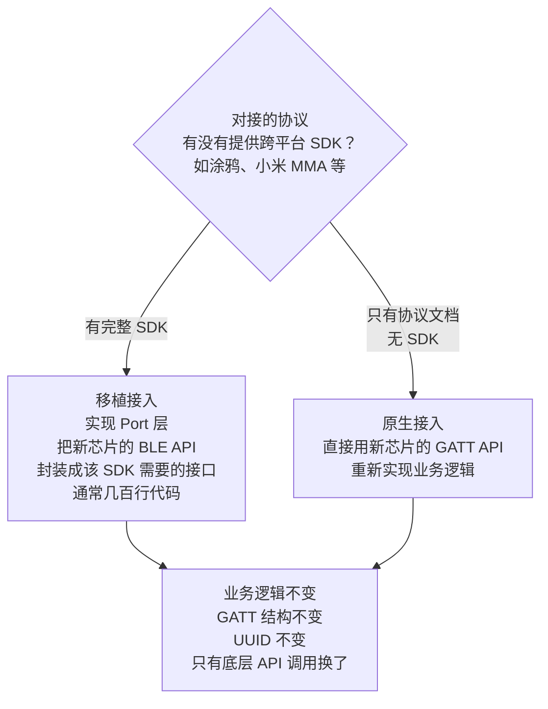
```mermaid
flowchart TD
  Q1{"对接的协议\n有没有提供跨平台 SDK？\n如涂鸦、小米 MMA 等"}

  Q1 -- "有完整 SDK" --> PORT["移植接入\n实现 Port 层\n把新芯片的 BLE API\n封装成该 SDK 需要的接口\n通常几百行代码"]
  Q1 -- "只有协议文档\n无 SDK" --> NATIVE["原生接入\n直接用新芯片的 GATT API\n重新实现业务逻辑"]

  PORT --> SAME["业务逻辑不变\nGATT 结构不变\nUUID 不变\n只有底层 API 调用换了"]
  NATIVE --> SAME
```

**跨芯片迁移对照表（以 RCSP 业务为例）：**

| 操作 | JL 芯片 | Nordic 芯片 | MTK 芯片 |
|------|---------|------------|---------|
| 注册 GATT Profile | `app_ble_profile_set()` | `ble_gatts_add_service()` | `BT_GATTS_NEW_SERVICE_128()` |
| 发送 Notify | `app_ble_att_send_data()` | `sd_ble_gatts_hvx()` | `bt_gatts_notify()` |
| 开启广播 | `app_ble_adv_enable()` | `sd_ble_gap_adv_start()` | `bt_le_adv_start()` |
| 注册写回调 | `app_ble_att_write_callback_register()` | `BLE_GATTS_EVT_WRITE` 事件 | `BT_GATTS_WRITE_CB` |

API 名字不同，做的事情完全一样——因为底层都实现了同一套 GATT 规范。

---

## 十、举一反三：拿到任何 BLE 协议文档，快速上手

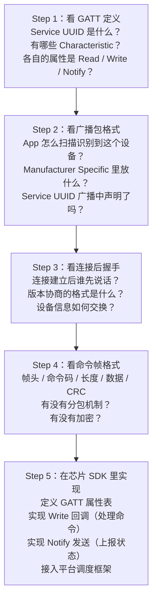
```mermaid
flowchart TD
  S1["Step 1：看 GATT 定义\nService UUID 是什么？\n有哪些 Characteristic？\n各自的属性是 Read / Write / Notify？"]
  S2["Step 2：看广播包格式\nApp 怎么扫描识别到这个设备？\nManufacturer Specific 里放什么？\nService UUID 广播中声明了吗？"]
  S3["Step 3：看连接后握手\n连接建立后谁先说话？\n版本协商的格式是什么？\n设备信息如何交换？"]
  S4["Step 4：看命令帧格式\n帧头 / 命令码 / 长度 / 数据 / CRC\n有没有分包机制？\n有没有加密？"]
  S5["Step 5：在芯片 SDK 里实现\n定义 GATT 属性表\n实现 Write 回调（处理命令）\n实现 Notify 发送（上报状态）\n接入平台调度框架"]

  S1 --> S2 --> S3 --> S4 --> S5
```

---

## 十一、全文总结

```mermaid
graph TD
  SIG["蓝牙 SIG\n制定 GAP + GATT 规范\n强制所有 BLE 芯片实现"]

  SIG --> RULE["核心规则\nService / Characteristic / UUID\nRead / Write / Notify"]

  RULE --> JL["JL 芯片\nbtstack.a 封装 GATT 实现\napp_ble_spp_api.h 暴露 API"]
  RULE --> Nordic["Nordic 芯片\nSoftDevice 封装 GATT 实现\nnrf_ble_gatt API"]
  RULE --> Others["其他芯片\n同理…"]

  JL --> RCSP["RCSP\n原生调用 JL API\nService 0xAE00"]
  JL --> Tuya["涂鸦\nPort 层适配 JL API\nService 0x1910"]
  JL --> Others2["GFPS / MMA / DMA…\n同理…"]

  RCSP --> JL_App["JL 官方 App"]
  Tuya --> Smart_Life["涂鸦 Smart Life App"]
```

| 核心问题 | 答案 |
|---------|------|
| BLE 应用层的行业统一规范是什么？ | GATT，由蓝牙 SIG 制定，所有 BLE 芯片强制实现 |
| 为什么换芯片不用重写业务逻辑？ | 业务逻辑基于 GATT 规范，芯片只是换了 GATT API 的名字 |
| 私有协议和标准协议的区别？ | UUID 不同：16-bit = 标准全球互通，128-bit = 私有需配套 App |
| Write Without Response + Notify 为什么最常用？ | 前者下行快不等 ACK，后者上行设备主动推不需 App 轮询 |
| RCSP 和涂鸦接入方式的本质区别？ | RCSP 直接调 JL API；涂鸦带跨平台 SDK，通过 Port 层适配 |
| "熟悉 BLE"在嵌入式开发中意味着什么？ | 熟悉 GAP（广播/连接）+ GATT（数据组织/读写/通知）编程模型 |

---

## 十二、实践一：拿到协议文档后如何一步步在 JL 平台实现

> 本章以两份真实耳机 BLE 协议为例，演示从阅读文档到跑通通信的完整实现路径。

### 12.1 先读懂文档——提取五个关键信息

拿到任何一份 BLE 通信协议文档，不要直接翻命令列表，先找这五个关键信息：

```mermaid
flowchart TD
  DOC["协议文档"]
  DOC --> G["① GATT 结构\nService UUID\nCharacteristic UUID\n各特征的属性（Read/Write/Notify）"]
  DOC --> ADV["② 广播包格式\n设备名？\nManufacturer Specific 里放什么？\nService UUID 是否在广播中声明？"]
  DOC --> FRAME["③ 帧格式\n帧头 / 帧尾 / 长度字段 / 命令字段\n字节序（大端/小端）\n是否有分包机制？"]
  DOC --> CMD["④ 命令集\nApp→设备（Write 方向）有哪些命令？\n设备→App（Notify 方向）有哪些通知？\n有没有 ACK/回应机制？"]
  DOC --> RULE["⑤ 特殊规则\n加密？\nMTU 要求？\n连接后是否有握手？"]
```

**实例对比：两份真实协议的差异**

| 要素 | 恒芸生泰 v1.0（简单型） | 机乐堂 v1.1.5（复杂型） |
|------|----------------------|----------------------|
| Service UUID | `00001820-...-00805f9b34fb` | 含 `A801` 的 128-bit UUID |
| Write UUID | `000018F1-...` | `xxxA801xxxxxx`（Write Without Response）|
| Notify UUID | `000018F2-...` | `xxxA802xxxxxx` |
| OTA 通道 | 无 | 另有 `A811`（Write）+ `A812`（Notify）|
| 帧格式 | `FF [Len] [RW] [CMD] [Data...] AA` | TLV 结构（字段类型 + 字段长度 + 字段值） |
| 命令方向 | Byte2：0x81=下行，0x82=上行 | Direction 字段：0x11/0x12/0x21/0x22 |
| 消息匹配 | 无（靠 CMD 字段区分） | Message ID（2 字节，随机[100,65535]）|
| 完整性校验 | 无 | Check = sum(Payload) & 0xFF |
| 分包 | 无 | 支持（PackageIndex + PackageTotal）|

> 结论：简单协议适合快速上手，复杂协议功能更全，但实现量更大。先从简单型理解框架，再上复杂型。

---

### 12.2 Step 1：定义 GATT 属性表 profile_data[]

这是接入 JL 框架的第一步。JL 的 GATT 属性表是一个**原始字节数组**，每条属性条目格式如下：

```
[total_len_lo] [total_len_hi] [permissions] [dynamic_flag] [handle_lo] [handle_hi] [attr_UUID_lo] [attr_UUID_hi] [value_bytes...]
```

各字段含义：

| 字段 | 说明 |
|------|------|
| total_len（2字节）| 整条条目的总字节数（含自身） |
| permissions（1字节）| 访问权限：0x02=READ, 0x04=WRITE_WITHOUT_RESPONSE, 0x0a=READ\|WRITE, 0x10=NOTIFY |
| dynamic_flag（1字节）| 0x01=DYNAMIC（读写通过回调动态处理），0x00=静态 |
| handle（2字节）| 该属性的 handle 编号，小端序，需从 1 开始顺序编排 |
| attr_UUID（2字节）| 属性类型：0x2800=Primary Service，0x2803=Characteristic，0x2902=CCCD |
| value_bytes | 内容：Service 条目放 Service UUID；Characteristic Declaration 放[properties, value_handle_lo, value_handle_hi, char_UUID_lo, char_UUID_hi] |

> **重要**：不要手写这个数组！直接复制 SDK 中 `custom_protocol_demo/custom_protocol.c` 的 `custom_demo_profile_data[]`，然后按你的 UUID 和 handle 修改字节值。

**以恒芸生泰协议为例（Service 0x1820，Write 18F1，Notify 18F2）：**

```c
// my_protocol.c

static const u8 my_profile_data[] = {
    //
    // 0x0001  PRIMARY_SERVICE  1820
    //
    // total=10, perm=READ(0x02), handle=0x0001, UUID=0x2800(Primary Service), value=0x1820
    0x0a, 0x00, 0x02, 0x00, 0x01, 0x00, 0x00, 0x28, 0x20, 0x18,

    // 0x0002  CHARACTERISTIC  18F1  WRITE_WITHOUT_RESPONSE | DYNAMIC
    // 这是 Characteristic Declaration：告知 Client 此 Characteristic 的属性、value handle、UUID
    // properties=0x04(WRITE_WITHOUT_RESPONSE), value_handle=0x0003, UUID=0x18F1
    0x0d, 0x00, 0x02, 0x00, 0x02, 0x00, 0x03, 0x28, 0x04, 0x03, 0x00, 0xF1, 0x18,
    // 0x0003  VALUE  18F1  WRITE_WITHOUT_RESPONSE | DYNAMIC
    // 这是 Characteristic Value：App 写命令的目标
    0x08, 0x00, 0x04, 0x01, 0x03, 0x00, 0xF1, 0x18,

    // 0x0004  CHARACTERISTIC  18F2  NOTIFY
    // properties=0x10(NOTIFY), value_handle=0x0005, UUID=0x18F2
    0x0d, 0x00, 0x02, 0x00, 0x04, 0x00, 0x03, 0x28, 0x10, 0x05, 0x00, 0xF2, 0x18,
    // 0x0005  VALUE  18F2  NOTIFY
    0x08, 0x00, 0x10, 0x00, 0x05, 0x00, 0xF2, 0x18,
    // 0x0006  CLIENT_CHARACTERISTIC_CONFIGURATION（CCCD）
    // App 通过写此 Descriptor 开启/关闭 Notify（写 0x0001 = 开启）
    0x0a, 0x00, 0x0a, 0x01, 0x06, 0x00, 0x02, 0x29, 0x00, 0x00,

    // END
    0x00, 0x00,
};

// handle 定义——与 profile_data[] 中的 handle 编号严格对应
#define MY_WRITE_VALUE_HANDLE   0x0003   // 18F1：App 发命令写这里
#define MY_NOTIFY_VALUE_HANDLE  0x0005   // 18F2：设备推通知发这里
#define MY_CCCD_HANDLE          0x0006   // CCCD：App 订阅 Notify 写这里
```

> 如果使用 128-bit UUID（如机乐堂的 A801/A802），每条条目中 UUID 从 2 字节变为 16 字节，总长度相应增大。可参考 SDK 中 `tuya_protocol.c` 的 `tuya_profile_data[]` 写法。

---

### 12.3 Step 2：注册到 multi_protocol_main.c

打开 `apps/common/third_party_profile/multi_protocol_main.c`，在现有协议旁边添加你的协议：

```c
// multi_protocol_main.c

// ① 添加头文件
#if MY_PROTOCOL_EN
#include "my_protocol.h"
#endif

// ② 在 protocol_ble_init() 中注册 GATT profile
void protocol_ble_init(void)
{
    // ... 其他协议 ...

#if MY_PROTOCOL_EN
    my_ble_profile_init();  // 你实现的注册函数
#endif
}

// ③ 在板级配置头文件（如 board_config.h）中开关
#define MY_PROTOCOL_EN    1
```

**你的 `my_ble_profile_init()` 内部做什么（参照 `custom_demo_all_init()` 的实际写法）：**

```c
// my_protocol.c

void *my_ble_hdl = NULL;   // BLE 句柄，全局保存

// 用于 TWS 双耳数据同步的句柄唯一标识（字母随便定，保证不和其他协议冲突）
#define MY_BLE_HDL_UUID \
    (((u8)('M'+'Y'+'P') << (3*8)) | ((u8)('R'+'O'+'T') << (2*8)) | \
     ((u8)('O'+'B'+'L') << (1*8)) | ((u8)('E'+'H'+'D') << (0*8)))

void my_ble_profile_init(void)
{
    if (my_ble_hdl != NULL) {
        return;   // 防重复初始化
    }

    // 1. 申请 BLE 句柄
    my_ble_hdl = app_ble_hdl_alloc();
    if (my_ble_hdl == NULL) {
        printf("my_protocol: hdl alloc failed!\n");
        return;
    }

    // 2. 设置句柄 UUID（用于 TWS 双耳间同步 BLE 状态，每个协议唯一）
    app_ble_hdl_uuid_set(my_ble_hdl, MY_BLE_HDL_UUID);

    // 3. 设置 BLE MAC 地址（通常和经典蓝牙 MAC 相同）
    const u8 *edr_addr = bt_get_mac_addr();
    app_ble_set_mac_addr(my_ble_hdl, (void *)edr_addr);

    // 4. 注册 GATT 属性表
    app_ble_profile_set(my_ble_hdl, my_profile_data);

    // 5. 注册 Read 回调（CCCD 读取、设备名读取等）
    app_ble_att_read_callback_register(my_ble_hdl, my_att_read_cb);

    // 6. 注册 Write 回调（App 下发命令时触发）
    app_ble_att_write_callback_register(my_ble_hdl, my_att_write_cb);

    // 7. 注册 ATT Server 事件回调（连接/断开通知在这里）
    app_ble_att_server_packet_handler_register(my_ble_hdl, my_packet_handler);

    // 8. 注册 HCI 事件回调（LE meta 事件，包含连接信息）
    app_ble_hci_event_callback_register(my_ble_hdl, my_packet_handler);

    // 9. 立即开始广播
    my_ble_start_adv(1);

    printf("my_protocol: profile init done\n");
}
```

---

### 12.4 Step 3：设置广播数据

广播数据让 App 能扫描到你的设备。恒芸生泰协议在广播包中声明了 Service UUID，机乐堂则在 Manufacturer Specific 里放了经典蓝牙 MAC 地址和设备识别码。

```c
// my_protocol.c
// make_eir_packet_data() 是 JL SDK 提供的广播包构建工具函数

static u8 my_fill_adv_data(u8 *adv_data)
{
    u8 offset = 0;

    // 广播 Service UUID 0x1820，让 App 能识别这是目标设备
    u8 uuid[2] = {0x20, 0x18};   // 0x1820 小端序
    offset += make_eir_packet_data(&adv_data[offset], offset,
                                   HCI_EIR_DATATYPE_COMPLETE_16BIT_UUIDS,
                                   uuid, sizeof(uuid));

    // Flags（可连接）
    u8 flags = 0x06;
    offset += make_eir_packet_data(&adv_data[offset], offset,
                                   HCI_EIR_DATATYPE_FLAGS, &flags, 1);
    return offset;
}

static u8 my_fill_rsp_data(u8 *rsp_data)
{
    u8 offset = 0;
    // 扫描响应包放设备名（让 App 显示设备名称）
    const char *name = bt_get_local_name();
    offset += make_eir_packet_data(&rsp_data[offset], offset,
                                   HCI_EIR_DATATYPE_COMPLETE_LOCAL_NAME,
                                   (void *)name, strlen(name));
    return offset;
}

// 开启/关闭广播（传 enable=1 开启，enable=0 关闭）
void my_ble_start_adv(u8 enable)
{
    u8 adv_data[ADV_RSP_PACKET_MAX] = {0};
    u8 rsp_data[ADV_RSP_PACKET_MAX] = {0};
    u8 len;

    if (enable == app_ble_adv_state_get(my_ble_hdl)) {
        return;   // 状态未变，不重复操作
    }

    if (enable) {
        // 广播间隔 150×0.625ms ≈ 94ms，可连接非定向广播，全信道
        app_ble_set_adv_param(my_ble_hdl, 150, ADV_IND, ADV_CHANNEL_ALL);

        len = my_fill_adv_data(adv_data);
        if (len) {
            app_ble_adv_data_set(my_ble_hdl, adv_data, len);
        }
        len = my_fill_rsp_data(rsp_data);
        if (len) {
            app_ble_rsp_data_set(my_ble_hdl, rsp_data, len);
        }
    }

    app_ble_adv_enable(my_ble_hdl, enable);
    printf("my_protocol: adv %s\n", enable ? "start" : "stop");
}
```

---

### 12.5 Step 4：实现 Write 回调——解析 App 下发的命令

这是协议实现的核心。App 通过 Write Characteristic 发送命令，JL 框架将原始字节透传到这个回调，由你解析。

**恒芸生泰帧格式解析示例：**

```
帧格式：FF [Len] [RW] [CMD] [Data...] AA
  Byte0:  0xFF（帧头，固定）
  Byte1:  Length（后续数据字节数，不含帧尾）
  Byte2:  0x81=APP设置命令，0x82=APP读取请求
  Byte3:  命令码
  Byte4~: 数据
  末尾:   0xAA（帧尾，固定）
```

```c
// my_protocol.c

#define MY_FRAME_HEAD   0xFF
#define MY_FRAME_TAIL   0xAA
#define MY_DIR_SET      0x81    // App → 设备（写入/设置）
#define MY_DIR_GET      0x82    // App → 设备（查询，设备 Notify 回应）

// 命令码定义（与协议文档对应）
#define CMD_KEY_FUNC    0x01    // 按键功能设置
#define CMD_EQ          0x02    // EQ 设置
#define CMD_FIND        0x03    // 查找耳机
#define CMD_RESTORE_DEF 0x04    // 恢复默认
#define CMD_CLEAR_PAIR  0x05    // 清除配对
#define CMD_FACTORY_RST 0x06    // 恢复出厂
#define CMD_GAME_MODE   0x07    // 游戏模式
#define CMD_ANC_MODE    0x09    // ANC 模式
#define CMD_BATTERY     0x0C    // 电量查询
#define CMD_FW_VERSION  0x0D    // 固件版本查询

// ack 回应：格式 FF 02 81 [cmd] AA
static void my_send_ack(u8 cmd)
{
    u8 ack[] = {0xFF, 0x02, 0x81, cmd, 0xAA};
    app_ble_att_send_data(my_ble_hdl, MY_NOTIFY_VALUE_HANDLE, ack, sizeof(ack),
                          ATT_OP_AUTO_READ_CCC);
}

// Write 回调：JL 框架收到 App 写入数据后调用此函数
// 注意：att_handle 指明是哪个 Characteristic 被写，要先判断 handle
static int my_att_write_cb(void *_hdl, hci_con_handle_t con_handle,
                            u16 att_handle, u16 transaction_mode,
                            u16 offset, u8 *buffer, u16 buffer_size)
{
    // ① CCCD 被写：App 开启/关闭 Notify 订阅
    if (att_handle == MY_CCCD_HANDLE) {
        printf("my_protocol: write CCCD = 0x%02X\n", buffer[0]);
        att_set_ccc_config(att_handle, buffer[0]);   // 保存订阅状态
        return 0;
    }

    // ② Write Characteristic 被写：App 下发业务命令
    if (att_handle != MY_WRITE_VALUE_HANDLE) {
        return 0;   // 其他 handle，忽略
    }

    // 打印原始数据（调试时很有用）
    printf("my_protocol rx(%d): ", buffer_size);
    put_buf(buffer, buffer_size);

    // 基本帧格式校验
    if (buffer_size < 4 || buffer[0] != MY_FRAME_HEAD
        || buffer[buffer_size - 1] != MY_FRAME_TAIL) {
        printf("my_protocol: invalid frame\n");
        return 0;
    }

    u8 dir      = buffer[2];
    u8 cmd      = buffer[3];
    u8 *data    = &buffer[4];
    u8 data_len = buffer[1] - 2;   // Len 字段 = RW(1) + CMD(1) + 数据，减去 RW 和 CMD

    printf("my_protocol: dir=0x%02X cmd=0x%02X data_len=%d\n", dir, cmd, data_len);

    if (dir == MY_DIR_SET) {
        // App 设置命令 → 执行业务，回 ACK
        switch (cmd) {
        case CMD_KEY_FUNC:
            my_handle_key_func(data, data_len);
            my_send_ack(cmd);
            break;
        case CMD_EQ:
            my_handle_eq(data, data_len);
            my_send_ack(cmd);
            break;
        case CMD_GAME_MODE:
            my_handle_game_mode(data[0]);
            my_send_ack(cmd);
            break;
        case CMD_ANC_MODE:
            my_handle_anc_mode(data[0]);
            my_send_ack(cmd);
            break;
        case CMD_FIND:
            my_handle_find_device(data[0]);
            my_send_ack(cmd);
            break;
        case CMD_FACTORY_RST:
            my_handle_factory_reset();
            my_send_ack(cmd);
            break;
        default:
            printf("my_protocol: unknown cmd 0x%02X\n", cmd);
            break;
        }
    } else if (dir == MY_DIR_GET) {
        // App 查询命令 → 直接 Notify 回应，不需要 ACK
        switch (cmd) {
        case CMD_BATTERY:     my_notify_battery();    break;
        case CMD_FW_VERSION:  my_notify_fw_version(); break;
        case CMD_ANC_MODE:    my_notify_anc_mode();   break;
        default:              break;
        }
    }

    return 0;
}
```

---

### 12.6 Step 5：实现 Notify——主动上报设备状态

设备状态变化时（电量变化、ANC 切换、用户按键触发等），主动通过 Notify 推送给 App。

```c
// my_protocol.c

// 发送通用 Notify 帧
static void my_send_notify(u8 cmd, u8 *payload, u8 payload_len)
{
    // 帧格式：FF [Len] 82 [CMD] [payload] AA
    u8 frame[64];
    frame[0] = MY_FRAME_HEAD;
    frame[1] = payload_len + 2;    // Len = RW(1) + CMD(1) + payload
    frame[2] = MY_DIR_GET;         // 0x82 = 设备 → App 方向
    frame[3] = cmd;
    if (payload_len > 0) {
        memcpy(&frame[4], payload, payload_len);
    }
    frame[4 + payload_len] = MY_FRAME_TAIL;

    u8 total_len = 5 + payload_len;
    // ATT_OP_AUTO_READ_CCC：框架自动检查 CCCD 是否已开启，再决定是否发送 Notify
    app_ble_att_send_data(my_ble_hdl, MY_NOTIFY_VALUE_HANDLE, frame, total_len,
                          ATT_OP_AUTO_READ_CCC);

    printf("my_protocol: notify cmd=0x%02X len=%d\n", cmd, total_len);
}

// 上报当前电量（左耳/右耳/充电仓）
void my_notify_battery(void)
{
    u8 batt[3];
    batt[0] = get_left_ear_battery();    // bit7=充电标志, bit6~0=电量
    batt[1] = get_right_ear_battery();
    batt[2] = get_charger_box_battery();
    my_send_notify(CMD_BATTERY, batt, 3);
}

// 上报 ANC 模式
void my_notify_anc_mode(void)
{
    u8 mode = get_current_anc_mode();    // 1=关闭, 2=降噪, 3=通透
    my_send_notify(CMD_ANC_MODE, &mode, 1);
}

// 上报固件版本
void my_notify_fw_version(void)
{
    u8 ver[3] = {FW_VERSION_MAJOR, FW_VERSION_MINOR, FW_VERSION_PATCH};
    my_send_notify(CMD_FW_VERSION, ver, 3);
}
```

---

### 12.7 Step 6：处理连接/断开事件

连接/断开事件在 `my_packet_handler` 里处理（即 Step 2 初始化时注册的 `app_ble_hci_event_callback_register` 回调）：

```c
// my_protocol.c  （my_packet_handler 已在初始化里注册）

static void my_packet_handler(void *hdl, u8 packet_type, u16 channel,
                               u8 *packet, u16 size)
{
    u16 con_handle;

    switch (packet_type) {
    case HCI_EVENT_PACKET:
        switch (hci_event_packet_get_type(packet)) {

        case HCI_EVENT_LE_META:
            switch (hci_event_le_meta_get_subevent_code(packet)) {
            case HCI_SUBEVENT_LE_CONNECTION_COMPLETE:
                con_handle = little_endian_read_16(packet, 4);
                printf("my_protocol: BLE connected, handle=0x%04X\n", con_handle);
                // 部分协议要求连接后立即上报当前状态（按协议文档决定）
                // my_notify_battery();
                break;
            default:
                break;
            }
            break;

        case HCI_EVENT_DISCONNECTION_COMPLETE:
            printf("my_protocol: BLE disconnected, restart adv\n");
            // 断开后重新广播，等待 App 重连
            my_ble_start_adv(1);
            break;

        default:
            break;
        }
        break;
    default:
        break;
    }
}
```

> 这个函数同时注册为 `app_ble_att_server_packet_handler_register` 和 `app_ble_hci_event_callback_register` 的回调，两个注册点共享同一函数是 JL SDK 的标准写法（见 `custom_demo_all_init()`）。

---

### 12.8 Step 7：逐功能实现，切勿一次写完

这是最关键的实践原则。

```mermaid
flowchart LR
  F1["① 先只实现广播\n让 nRF Connect 能扫到设备"] -->
  F2["② 实现 GATT 注册\n让 nRF Connect 能连上并看到 Service/Char"] -->
  F3["③ 实现 ACK 命令\n写入命令 → 串口看到日志 → nRF 收到 Notify ACK"] -->
  F4["④ 逐个命令接入业务\n按键功能 → 测试 → EQ → 测试 → ANC → 测试…"] -->
  F5["⑤ 联调真实 App\n所有功能跑通后再对接"]

  style F1 fill:#e8f4fd
  style F2 fill:#e8f4fd
  style F3 fill:#d4edda
  style F4 fill:#d4edda
  style F5 fill:#fff3cd
```

**机乐堂协议（复杂 TLV 型）的实现顺序建议：**

| 阶段 | 实现内容 | 验证方式 |
|------|---------|---------|
| 1 | 广播 + GATT 注册（4个特征：A801/A802/A811/A812）| nRF Connect 看到 4 个 Characteristic |
| 2 | TLV 帧解析器：解析 Command ID + Direction + Message ID | 串口打印解析结果 |
| 3 | Check 校验函数 | 故意发错误帧，验证丢弃 |
| 4 | 实现 CONN_STATUS + BATTERY GET/NOTIFY | nRF Connect 发 GET，看 Notify 回应 |
| 5 | 实现 ANC + EQ + GAME_MODE | 同上，逐个测试 |
| 6 | 实现分包机制（用于 EQ 等大数据） | 构造超过 MTU 的帧测试 |
| 7 | 联调真实 App | 完整功能验证 |

---

## 十三、实践二：调试方法论

> 永远不要把协议一口气写完再测试。每次只实现一个功能点，立刻验证，发现问题立刻修。这不是怕麻烦，而是省时间。

### 13.1 调试工具清单

```mermaid
graph LR
  subgraph 手机端工具
    NRF["nRF Connect\n（最常用）\nAndroid / iOS\n完整 GATT 调试"]
    LightBlue["LightBlue\nApple 设备调试\niOS 友好"]
  end

  subgraph 固件端工具
    UART["串口终端\n（minicom / SecureCRT / MobaXterm）\n看 SDK log 输出"]
    BTSniffer["蓝牙抓包器\n（Ellisys / Wireshark + dongle）\n抓空中包，查帧格式"]
  end

  NRF <-->|"GATT 交互"| DEV["耳机固件"]
  DEV <-->|"log 输出"| UART
```

**推荐优先级**：nRF Connect（免费、功能最全）> 串口 log > 蓝牙抓包（需硬件，有问题再上）

---

### 13.2 阶段一：验证广播

**目标**：nRF Connect 能扫到你的设备，并且广播包内容正确。

**操作步骤：**

1. 打开 nRF Connect → "SCANNER"（扫描）标签
2. 点击 "FILTER" 按滤波条件：填写设备名或 Service UUID
3. 找到你的设备，点击展开广播包详情

**验证要点：**

```
✓ 设备名正确（Complete Local Name）
✓ Service UUID 显示正确（UUID 0x1820 / 含 A801 等）
✓ Manufacturer Specific Data 格式正确（机乐堂协议：MAC + 设备识别码）
✓ RSSI 信号强度合理（-60 以内算近距离正常）
```

**常见问题：**

| 现象 | 原因 | 排查 |
|------|------|------|
| 扫不到设备 | 广播未开启，或 hdl 申请失败 | 看串口是否打印 "adv started" |
| UUID 显示错误 | 字节序问题（大端/小端写反了）| 检查广播数组的 UUID 字节顺序 |
| 设备名乱码 | UTF-8 编码问题 | 用纯 ASCII 设备名先测试 |

---

### 13.3 阶段二：验证 GATT 结构

**目标**：连接后，nRF Connect 能发现正确的 Service 和 Characteristic，属性与协议文档一致。

**操作步骤：**

1. nRF Connect 扫描页面 → 点击你的设备 → "CONNECT"
2. 连接成功后，进入 "CLIENT" 标签
3. 点击 "SERVICE DISCOVERY"（服务发现）
4. 展开 Service，查看每个 Characteristic 的 UUID 和 Properties

**验证要点（以恒芸生泰为例）：**

```
Service: 00001820-0000-1000-8000-00805f9b34fb
  ├── Characteristic: 000018F1-...  Properties: WRITE_WITHOUT_RESPONSE  ✓
  └── Characteristic: 000018F2-...  Properties: NOTIFY                  ✓
                       └── Descriptor: CCCD (0x2902)                    ✓
```

**验证要点（以机乐堂为例）：**

```
Service: xxx-A801-xxx
  ├── Characteristic: A801  Properties: WRITE_WITHOUT_RESPONSE  ✓
  ├── Characteristic: A802  Properties: NOTIFY                  ✓
  ├── Characteristic: A811  Properties: READ, WRITE             ✓
  └── Characteristic: A812  Properties: READ, NOTIFY            ✓
```

**常见问题：**

| 现象 | 原因 | 排查 |
|------|------|------|
| Service 发现失败 | profile_data[] 格式错误 | 对比 SDK 中 RCSP 的 profile_data 写法 |
| Characteristic 少了 | 属性表提前截断 | 检查结束标志 `0,` 的位置 |
| Properties 不对 | ATT_PROPERTY_ 宏填错 | 查 `bluetooth.h` 中的宏定义 |
| 连接后立刻断开 | SM 安全配置不匹配 | 暂时关掉 SM 配对要求，先测通信 |

---

### 13.4 阶段三：验证 Write → 串口 Log

**目标**：App（nRF Connect）下发命令，固件能正确解析并在串口打印。

**在 nRF Connect 中发送命令（以恒芸生泰 ANC 切换命令为例）：**

```
ANC 切换到降噪模式：
Byte0  Byte1  Byte2  Byte3  Byte4  Byte5
 FF     03     81     09     02     AA

操作步骤：
1. nRF Connect → CLIENT 标签 → 找 Write Characteristic (18F1)
2. 点击向上箭头 ↑（Write 按钮）
3. 选择 "WRITE COMMAND"（对应 Write Without Response）
4. 输入格式选 "BYTE ARRAY"，填入：FF 03 81 09 02 AA
5. 点击 "WRITE"
```

**固件串口应打印：**

```
my_protocol: rx dir=0x81 cmd=0x09 len=1
my_protocol: ANC mode set to 2 (noise cancel)
my_protocol: notify cmd=0x09 len=5
```

**nRF Connect 同时应收到 ACK Notify：**

```
Notify on 18F2:  FF 02 81 09 AA
```

**机乐堂协议的 TLV 帧构造示例（查询 ANC 模式）：**

```
字段:  [Field Len] [Field Type] [Field Data]
Command ID:     03 01 E9 03        （03: len=2+1, 01: type=CommandID, 0x03E9=1001十进制）

注意：机乐堂用小端序，1001=0x03E9 → 字节序为 E9 03
完整帧（查询 ANC）：
  03 01 [ANC命令ID低字节] [高字节]
  02 02 11                          （Direction: App对设备请求=0x11）
  03 03 [MsgID低] [MsgID高]         （随机MessageID）
  02 04 00 00                       （ResponseCode: 请求固定0x00,0x00）
  02 05 00                          （PayloadLength: 0）
  02 07 00                          （Check: Payload为空时=0x00）
```

> **技巧**：用 nRF Connect 发帧时，先发最简单的命令（如查询电量），确认解析正确后再发复杂命令。构造 TLV 帧容易出字节序错误，串口打印原始 buffer 逐字节排查。

---

### 13.5 阶段四：验证 Notify → nRF Connect 接收

**目标**：固件主动发送的 Notify，nRF Connect 能正确接收并显示。

**操作步骤：**

1. nRF Connect → CLIENT → 找 Notify Characteristic (18F2 / A802)
2. 点击向下箭头 ↓（Subscribe / Enable Notification）
   - 实际上是写 CCCD Descriptor = `0x0100`
3. 触发 Notify 的方式：
   - 方式 A：直接按耳机物理按键（ANC 切换）
   - 方式 B：nRF Connect 发一个查询命令，等固件回 Notify
   - 方式 C：在固件调试代码里直接调 `my_notify_battery()`

**nRF Connect 中应看到：**

```
Notification received from handle 0x000X:
  Value (HEX): FF 05 82 0C 64 64 50 AA
               ↑  ↑  ↑  ↑  ↑  ↑  ↑  ↑
               头 长 方 命 左  右  仓  尾
                      向 令 100% 100% 80%
```

**常见问题：**

| 现象 | 原因 | 排查 |
|------|------|------|
| Notify 收不到 | CCCD 没有被写入，或 Notify handle 填错 | 检查 Notify Handle 值是否正确 |
| Notify 内容乱 | 帧组装字节序错误 | 逐字节打印 frame[] 数组 |
| Notify 一直不来 | `app_ble_att_send_data` 返回错误码 | 检查返回值并打印 |
| 收到 Notify 但 App 无响应 | 命令码和协议文档对不上 | 用 HEX 原始数据和协议文档逐字段比对 |

---

### 13.6 调试黄金原则

```mermaid
flowchart TD
  P1["原则一：增量实现\n每次只加一个功能，立刻验证\n不要一次写完所有命令"] -->
  P2["原则二：日志先行\n每个关键路径都加 log_i\n不加日志的代码等于盲盒"] -->
  P3["原则三：从简单命令开始\n先跑通最简单的命令（如查询电量）\n确认框架通路正确，再加复杂命令"] -->
  P4["原则四：原始数据对比\n出问题时 HEX dump 原始 buffer\n和协议文档逐字节比对"] -->
  P5["原则五：隔离问题域\n协议解析 vs 业务逻辑 分开测试\n先验证解析正确（打印日志），再接业务"]
```

**串口日志示范（推荐的打印格式）：**

```c
// 收到数据时，打印原始 buffer（put_buf 是 JL SDK 内置的 HEX dump 工具）
printf("[MY_PROTO RX] len=%d: ", buffer_size);
put_buf(buffer, buffer_size);

// 解析后，打印语义
printf("[MY_PROTO RX] dir=0x%02X cmd=0x%02X data_len=%d\n", dir, cmd, data_len);

// 发送 Notify 时，打印发送内容
printf("[MY_PROTO TX] notify cmd=0x%02X: ", cmd);
put_buf(frame, total_len);
```

---

### 13.7 完整调试路径总结

```mermaid
sequenceDiagram
  participant FW as 耳机固件
  participant nRF as nRF Connect（手机）
  participant LOG as 串口 Log

  Note over FW,LOG: 阶段一：验证广播
  FW->>nRF: ADV 广播包
  nRF->>nRF: 扫描到设备，检查 Service UUID ✓

  Note over FW,LOG: 阶段二：验证 GATT 结构
  nRF->>FW: 发起连接
  FW->>LOG: "BLE connected"
  nRF->>FW: GATT Service Discovery
  nRF->>nRF: 检查 Service / Characteristic / Properties ✓

  Note over FW,LOG: 阶段三：验证 Write 解析
  nRF->>FW: Write Cmd（FF 03 81 09 02 AA）
  FW->>LOG: "rx dir=0x81 cmd=0x09 len=1" ✓
  FW->>nRF: Notify ACK（FF 02 81 09 AA）
  nRF->>nRF: 收到 Notify，比对 HEX ✓

  Note over FW,LOG: 阶段四：验证 Notify 主动上报
  FW->>FW: 用户按键触发 ANC 切换
  FW->>LOG: "notify ANC mode=2"
  FW->>nRF: Notify（FF 03 82 09 02 AA）
  nRF->>nRF: 收到状态变化通知 ✓

  Note over FW,LOG: 阶段五：联调真实 App
  nRF->>nRF: 换成真实 App 重复上述验证 ✓
```

---

### 13.8 遇到疑难问题的排查思路

```mermaid
flowchart TD
  BUG["发现问题"]

  BUG --> Q1{"nRF Connect\n能扫到设备吗？"}
  Q1 -- 否 --> FIX1["查广播是否开启\nlog: adv started?\nhdl 申请是否成功？"]
  Q1 -- 是 --> Q2{"能连接成功吗？"}

  Q2 -- 否 --> FIX2["查 SM 安全配置\n先关掉 MITM/绑定要求\n用最低安全等级测试"]
  Q2 -- 是 --> Q3{"Service Discovery\n结构正确吗？"}

  Q3 -- 否 --> FIX3["检查 profile_data[]\n对比 RCSP 的写法\n检查 UUID 字节序"]
  Q3 -- 是 --> Q4{"Write 后\n串口有 log 吗？"}

  Q4 -- 否 --> FIX4["检查 write_callback 是否注册\n检查 handle 是否匹配\nlog: write_cb called?"]
  Q4 -- 是 --> Q5{"Notify 能收到吗？"}

  Q5 -- 否 --> FIX5["检查 CCCD 是否开启\n检查 Notify handle 值\n检查 att_send_data 返回值"]
  Q5 -- 是 --> DONE["✓ 框架通路正常\n可以逐个接入业务逻辑"]
```

---

## 十四、AB 平台如何实现 GATT：以 AB5756C-SDK 为例

> 前面所有章节都是通用 BLE 原理 + JL 平台的具体实现。本章聚焦 AB（澎湃/泰凌）平台，验证"不同音频芯片平台都必须实现同一套 GATT 规范"这一结论。

### 14.1 AB SDK 的层次结构

AB 平台与 JL 平台结构高度相似——开发者可见的源码调用封闭的预编译库，最终通过库实现 GATT：

```mermaid
graph TB
  subgraph OPEN["开放区（源码可见，可修改）"]
    O1["应用层协议代码\nAB Mate / 自定义协议"]
    O2["ab_gatt_app.c\nGATT 回调入口\n覆写弱符号 ble_att_write_callback\n覆写弱符号 ble_att_read_callback"]
    O3["bsp_ble.c\n广播数据填充\nble_get_adv_data_hook()\n自定义广播包内容"]
  end

  subgraph CLOSED["封闭区（预编译库，不可修改）"]
    C1["libbtstack.a\nGATT / GAP / ATT / SM\nAB 用自己的硬件实现的蓝牙协议栈\n包含 att_gatt_server.o / gatt_server.o"]
    C2["libplatform.a\n基带调度 / 物理层驱动\nAB 蓝牙控制器底层"]
  end

  O1 -- "调用 ab_gatt_send_packet()\n发 Notify" --> C1
  O2 -- "弱符号覆写\n收到 Write 时由库回调" --> C1
  O3 -- "ble_get_adv_data_ptr 函数指针\n库读取广播数据" --> C1
  C1 --> C2
```

**关键区别**：AB 的 GATT 属性表由 `libbtstack.a` 内部的 `latt_app_profile_init()` 统一管理，**开发者不需要也不能自己定义 `profile_data[]` 字节数组**，只需覆写两个弱符号回调即可接收/发送数据。

---

### 14.2 AB 平台开放的核心 GATT 接口

AB SDK 通过"弱符号（weak symbol）+ 函数指针"两种机制向应用层开放 GATT 能力：

```c
// ── GATT 数据收发（弱符号，用户覆写） ─────────────────────────────────
// 定义于 libbtstack.a(weak_symbol.o)，用户在 ab_gatt_app.c 中覆写
u8 ble_att_write_callback(u16 handle, u8 *ptr, u8 len);  // App 写入时触发（下行命令）
u8 ble_att_read_callback(u16 handle, u8 *ptr, u8 len);   // App 读取时触发

// ── 发送 Notify（由 libbtstack.a 导出） ─────────────────────────────────
int ab_gatt_send_packet(u8 *buf, u16 len);   // 向 App 发送 Notify 数据

// ── GATT Profile 初始化（库内部，不需用户调用） ───────────────────────────
void latt_app_profile_init(void);            // 在 libbtstack.a 内部自动完成 GATT 注册

// ── 连接状态查询 ────────────────────────────────────────────────────────
bool bt_att_is_connect(void);                // 当前 BLE ATT 通道是否已连接

// ── 广播控制 ──────────────────────────────────────────────────────────
void ble_house_adv_init(void);               // 初始化并启动广播（在蓝牙初始化时调用）
void btstack_ble_set_adv_interval(void);     // 设置广播间隔
void btstack_ble_set_adv_data(void);         // 触发更新广播数据
void le_set_adv_interval(u16 interval);      // 直接设置广播间隔参数

// ── 广播数据填充（函数指针机制） ──────────────────────────────────────────
// 库在组装广播包时调用此指针指向的函数获取应用层自定义内容
extern uint (*ble_get_adv_data_ptr)(u8 *buf);

// 用户可覆写此 hook 函数追加自定义广播数据（ab5756c-sdk/bsp_ble.c）
uint ble_get_adv_data_hook(u8 *buf);
```

**与 JL 平台的对比**：

| 操作 | JL 平台 | AB 平台 |
|------|---------|---------|
| 注册 GATT 属性表 | `app_ble_profile_set(hdl, profile_data[])` 用户定义字节数组 | `latt_app_profile_init()` 库内部自动完成，用户不干预 |
| 发送 Notify | `app_ble_att_send_data(hdl, handle, data, len, op)` | `ab_gatt_send_packet(buf, len)` |
| 接收 Write（注册回调） | `app_ble_att_write_callback_register(hdl, cb)` 显式注册 | 覆写 `ble_att_write_callback()` 弱符号 |
| 开启广播 | `app_ble_adv_enable(hdl, 1)` | `ble_house_adv_init()` / `btstack_ble_set_adv_data()` |
| 多协议句柄 | 每协议一个独立 hdl | 无句柄机制，单一通道 |

---

### 14.3 AB Mate：AB 平台的原生私有协议

AB 平台随 SDK 附带了官方私有协议 **AB Mate**，地位等同于 JL 平台的 RCSP，用于配套 AB 官方 App 通信。

#### AB Mate 帧格式

```
帧头（5 字节固定）:
  Byte0:  [seq:4bit][reserve:3bit][encrypt:1bit]   序列号 + 加密标志
  Byte1:  cmd                                       命令码
  Byte2:  cmd_type                                  1=REQUEST, 2=RESPONSE, 3=NOTIFY
  Byte3:  [frame_seq:4bit][frame_total:4bit]        分包序号 / 总包数（支持大数据分包）
  Byte4:  payload_len                               本包有效载荷长度

载荷（TLV 结构）:
  [TYPE][LENGTH][VALUE] [TYPE][LENGTH][VALUE] ...
  例：INFO_POWER(0x01) + LENGTH(0x02) + 左耳电量 + 右耳电量
```

#### 命令码定义（`enum` in `ab_mate_app.h`）

```c
enum {
    CMD_EQ_SET          = 0x20,  // EQ 设置
    CMD_MUSIC_SET,               // 音乐控制（播放/暂停/音量）
    CMD_KEY_SET,                 // 按键功能自定义
    CMD_POWER_OFF_SET,           // 关机定时
    CMD_DEVICE_RESET,            // 恢复出厂
    CMD_MODE_SET,                // 模式切换（普通/游戏低延迟）
    CMD_IN_EAR_SET,              // 入耳检测开关
    CMD_DEVICE_INFO_GET,         // 批量查询设备信息
    CMD_DEVICE_INFO_NOTIFY,      // 设备信息主动上报
    CMD_LANGUAGE_SET,            // 语言设置
    CMD_DEVICE_FIND,             // 查找设备（播提示音）
    CMD_AUTO_ANSWER_SET,         // 自动接听
    CMD_ANC_SET,                 // ANC / 通透模式
    CMD_BT_NAME_SET,             // 修改蓝牙名称
    CMD_LED_SET,                 // LED 设置
    CMD_BT_LINK_INFO_CLEAR,      // 清除配对信息
    CMD_PIDVID_PUSH     = 0xAB,  // 厂商 PID/VID 推送
};
```

#### 设备信息 TLV 类型（`INFO_*`，用于 CMD_DEVICE_INFO_GET/NOTIFY）

```c
INFO_POWER          = 0x01   // 电量（左耳 + 右耳）
INFO_VERSION        = 0x02   // 固件版本
INFO_BT_NAME        = 0x03   // 蓝牙名称
INFO_EQ             = 0x04   // EQ 配置
INFO_KEY            = 0x05   // 按键功能配置
INFO_LATENCY_MODE   = 0x07   // 游戏/普通模式
INFO_TWS_SUPPORT    = 0x0C   // 是否支持 TWS
INFO_TWS_STA        = 0x0D   // TWS 连接状态
INFO_ANC            = 0x0B   // ANC 状态
INFO_MTU            = 0xFF   // MTU 协商（连接后第一步握手）
```

---

### 14.4 AB Mate 的 GATT 骨架与通信机制

```mermaid
graph TD
  subgraph AB_MATE["AB Mate 的 GATT 结构（库内部定义，用户不可见）"]
    S1["Primary Service\n（AB 私有 UUID，封装在 libbtstack.a 内）"]
    C1["Write Characteristic\n⬇ App → 设备\nWrite Without Response"]
    C2["Notify Characteristic\n⬆ 设备 → App"]
    S1 --> C1
    S1 --> C2
  end

  App["手机 AB Mate App"]
  App -- "Write（下行命令）" --> C1
  C1 -- "触发 ble_att_write_callback()" --> CODE["ab_gatt_app.c\n→ ab_mate_receive_proc()"]
  CODE -- "ab_gatt_send_packet()\n或 bt_spp_tx()" --> C2
  C2 -- "Notify（上行上报）" --> App
```

**AB Mate 的双通道特性**：AB Mate **同时支持 BLE ATT 和经典蓝牙 SPP** 两条通道，系统自动路由：

```c
// ab_mate_app.c 中的发送逻辑
static void ab_mate_data_send_do(uint8_t *packet, uint16_t len)
{
    int err;
    if (bt_att_is_connect()) {
        err = ab_gatt_send_packet(packet, len);   // BLE ATT 通道（手机通过 BLE 连接时）
    } else {
        err = bt_spp_tx(packet, len);             // 经典蓝牙 SPP 通道（手机通过 BR/EDR 连接时）
    }
}
```

JL 的 RCSP 实现了同等乃至更完整的多通道支持——从 JL 双核 SDK 的 `rcsp_interface.c` 可以看到，`bt_rcsp_data_send()` 同时向 **BLE ATT**、**SPP**、**GATT over EDR**（经典蓝牙上的 ATT）三条通道广播数据，`bt_rcsp_interface_init()` 在初始化时同时申请 SPP 句柄（`app_spp_hdl_alloc()`）和 BLE 句柄（`app_ble_hdl_alloc()`）：

```c
// JL 双核SDK rcsp_interface.c  bt_rcsp_data_send() 片段（三通道同时发送）
app_spp_data_send(bt_rcsp_spp_hdl, buf, len);                          // ① SPP 通道
app_ble_att_send_data(rcsp_server_ble_hdl, ae02_HANDLE, buf, len, op); // ② BLE ATT 通道
app_ble_att_send_data(rcsp_server_edr_att_hdl, ae02_HANDLE, buf, len, op); // ③ GATT over EDR 通道
```

两个平台的差异仅在于路由策略：AB Mate 是**互斥选择**（BLE 优先，否则 SPP）；JL RCSP 是**同时广播**（所有已连接通道都收到数据）。

---

### 14.5 AB Mate 的连接生命周期

```mermaid
sequenceDiagram
  participant SDK as 耳机 SDK（ab_mate_app.c）
  participant AB_BLE as AB BLE 框架（libbtstack.a）
  participant App as 手机 AB Mate App

  SDK->>AB_BLE: ble_house_adv_init()<br/>① 初始化并开启广播（在 bsp_bt_init 中调用）

  App->>AB_BLE: 扫描到广播，发起连接
  AB_BLE->>SDK: ② ab_mate_ble_connect_callback() 触发<br/>（状态置为 AB_MATE_CON_NONE，清空收发缓存）

  Note over SDK,App: 连接后握手：App 首先查询 MTU
  App->>AB_BLE: Write（CMD_DEVICE_INFO_GET, INFO_MTU）
  AB_BLE->>SDK: ③ ble_att_write_callback() → ab_mate_receive_proc()
  SDK->>SDK: 收到 INFO_MTU 查询\n→ ab_mate_app.can_send_now = 1（解锁发送）
  SDK->>AB_BLE: ab_gatt_send_packet()（回复 MTU 值）
  AB_BLE->>App: Notify（INFO_MTU + MTU值）

  App->>AB_BLE: Write（CMD_DEVICE_INFO_GET，批量查询电量/版本/EQ等）
  AB_BLE->>SDK: ④ ble_att_write_callback() → ab_mate_device_info_query()
  SDK->>AB_BLE: ab_gatt_send_packet()（TLV 格式回复所有信息）
  AB_BLE->>App: Notify（批量设备信息）

  Note over SDK,App: 此后进入正常双向通信
  App->>AB_BLE: Write（CMD_EQ_SET / CMD_ANC_SET / CMD_KEY_SET …）
  AB_BLE->>SDK: ⑤ ble_att_write_callback() → ab_mate_request_receive_proc()
  SDK->>SDK: 执行业务（更新 EQ / 切换 ANC 模式 / 更改按键功能…）
  SDK->>AB_BLE: ab_gatt_send_packet()（CMD_TYPE_RESPONSE 回复）
  AB_BLE->>App: Notify 确认

  Note over SDK,App: 状态变化时主动上报
  SDK->>AB_BLE: ab_gatt_send_packet()（CMD_DEVICE_INFO_NOTIFY + INFO_POWER）
  AB_BLE->>App: ⑥ Notify 电量变化

  App->>AB_BLE: 断开连接
  AB_BLE->>SDK: ⑦ ab_mate_ble_disconnect_callback()\n→ ab_mate_disconnect_proc()\n→ con_sta = NONE, can_send_now = 0
```

> **握手关键点**：AB Mate 规定连接后 App 必须先发 `INFO_MTU` 查询，固件收到后才会将 `can_send_now` 置为 1，此后才允许主动发送 Notify。这是防止连接刚建立时协议栈尚未稳定就发包的保护机制。

---

### 14.6 AB Mate 在 SDK 中的初始化路径

```mermaid
graph TD
  MAIN["main.c\n系统启动"]
  MAIN --> BSP_BT["bsp_bt_init()\nbsp_bt.c"]
  BSP_BT --> ADV_INIT["ble_house_adv_init()\n初始化广播模块\n→ libplatform.a(bt.o)"]
  BSP_BT --> MATE_VAR["ab_mate_var_init()\n初始化 AB Mate 变量\n读取 CM 存储的 EQ/按键等配置"]

  MAIN --> BT_INIT["bt_init()\napi_btstack.h\n启动蓝牙协议栈"]
  BT_INIT --> NOTICE["BT_NOTICE_INIT_FINISH\n初始化完成回调"]
  NOTICE --> MATE_DO["ab_mate_init_do()\n创建软件定时器\n启动电量检测（每 2 秒）\n应用 EQ 设置"]

  NOTICE --> START_ADV["bt_start_work()\n开始工作\n广播 + 等待连接"]
```

---

### 14.7 AB 平台迁移现有协议的方法

如果想在 AB 平台上接入一个 JL SDK 中已有的协议（如恒芸生泰、机乐堂协议），迁移工作量极小：

```mermaid
flowchart TD
  JL_CODE["已有 JL 平台实现\nmy_att_write_cb()\nmy_notify_xxx()\n业务逻辑不变"]

  JL_CODE --> DIFF["需要替换的部分\n（仅底层 API 调用）"]

  DIFF --> D1["JL: app_ble_profile_set(hdl, profile_data[])\n→ AB: 无需操作，库自动完成"]
  DIFF --> D2["JL: app_ble_att_write_callback_register(hdl, cb)\n→ AB: 直接覆写 ble_att_write_callback() 弱符号"]
  DIFF --> D3["JL: app_ble_att_send_data(hdl, handle, data, len, op)\n→ AB: ab_gatt_send_packet(data, len)"]
  DIFF --> D4["JL: app_ble_adv_enable(hdl, 1)\n→ AB: ble_house_adv_init() 在 bt_init 时统一处理\n自定义广播数据在 ble_get_adv_data_hook() 中填充"]

  D1 --> SAME["业务逻辑层完全不变\n帧格式不变 / UUID 不变 / 命令集不变"]
  D2 --> SAME
  D3 --> SAME
  D4 --> SAME
```

**实际迁移示例（以恒芸生泰协议为例）：**

```c
// ============================================================
// JL 平台实现（multi_protocol_main.c 注册 + my_protocol.c）
// ============================================================

// 注册 GATT（JL 需要显式构建属性表字节数组）
app_ble_profile_set(my_ble_hdl, my_profile_data);

// 注册 Write 回调
app_ble_att_write_callback_register(my_ble_hdl, my_att_write_cb);

// 发 Notify
app_ble_att_send_data(my_ble_hdl, MY_NOTIFY_VALUE_HANDLE, frame, len,
                      ATT_OP_AUTO_READ_CCC);

// ============================================================
// AB 平台迁移（ab_gatt_app.c 覆写弱符号，业务逻辑不变）
// ============================================================

// 不需要注册属性表！库已内置

// 覆写弱符号接收 Write（原 my_att_write_cb 逻辑完全照搬）
u8 ble_att_write_callback(u16 handle, u8 *ptr, u8 len)
{
    // 直接复用 JL 版本中的帧解析 + 业务分发逻辑
    my_parse_and_dispatch(ptr, len);
    return 0;
}

// 发 Notify（仅换一个函数名）
ab_gatt_send_packet(frame, len);   // 原来是 app_ble_att_send_data(...)
```

> **结论**：迁移一个私有协议到 AB 平台，改动量通常只有 **3～5 行**——换掉底层发送函数名、删掉显式注册步骤、用弱符号替代回调注册。业务逻辑、帧格式、命令集全部原样保留。

---

### 14.8 JL vs AB 平台全面对比

```mermaid
graph LR
  subgraph JL_STACK["JL 平台"]
    JL1["btstack.a\nGATT 实现"]
    JL2["app_ble_spp_api.h\n对外 API（显式）\nhdl 句柄机制\n多协议并存"]
    JL3["multi_protocol_main.c\n协议调度框架"]
    JL3 --> JL2 --> JL1
  end

  subgraph AB_STACK["AB 平台"]
    AB1["libbtstack.a\nGATT 实现"]
    AB2["弱符号接口（隐式）\nble_att_write_callback()\nble_att_read_callback()\nab_gatt_send_packet()"]
    AB3["ab_gatt_app.c\n单一入口覆写"]
    AB3 --> AB2 --> AB1
  end

  PHONE["手机 App"]
  PHONE <--> JL1
  PHONE <--> AB1
```

| 维度 | JL 平台 | AB 平台 |
|------|---------|---------|
| GATT 属性表 | 用户定义字节数组 `profile_data[]`，手动编排 handle | 库内部自动管理，用户不可见 |
| 多协议支持 | `hdl` 句柄机制，多协议各自独立 | 单通道，所有协议共用一个 Write/Notify 通道 |
| 接收 Write | `app_ble_att_write_callback_register(hdl, cb)` | 覆写弱符号 `ble_att_write_callback()` |
| 发送 Notify | `app_ble_att_send_data(hdl, handle, data, len, op)` | `ab_gatt_send_packet(buf, len)` |
| 广播控制 | `app_ble_adv_enable(hdl, 1/0)` 随时开关 | `ble_house_adv_init()` 初始化后由库托管 |
| 原生私有协议 | RCSP（BLE ATT + SPP + GATT over EDR 三通道同时广播） | AB Mate（BLE ATT + SPP 二选一路由） |
| 协议层编码风格 | 原始字节数组 + 宏定义 handle | TLV 结构体 + 枚举命令码 |
| 安全配对配置 | `app_ble_sm_init(io_cap, auth_req)` 显式配置 | 库内部配置，用户一般不直接干预 |
| TWS 数据同步 | `app_ble_hdl_uuid_set()` + btstack 内部 | AB Mate 协议层自带 TWS 同步机制 |

**两者验证了同一个结论**：尽管 API 名字、调用方式、设计哲学都不同，底层都实现了相同的 GATT 规范——`Service / Characteristic / Write / Notify`，手机 App 按 GATT 标准通信，完全不感知底层是哪家芯片。
