# BLE 面经题目集（以 JL 双核 SDK 代码为准）

> 所有代码引用均来自 JL 双核 SDK 真实源文件，非伪代码。

---

# Q1：你对 BLE 与 GATT 了解多少？有没有对接过第三方基于 BLE 的手机 APP？

## 一、标准回答（直接背诵）

> "BLE 这块，我主要做 **GATT 应用层**。GATT 跑在 ATT 之上，手机是 GATT Client，耳机是 GATT Server。通信模型就是 Service/Characteristic，常见组合是 **Write Without Response 下行命令 + Notify 上行上报**。
>
> 在 JL SDK 里，App 往 `0xAE01`（handle `0x0006`）写命令，进入 `rcsp_att_write_callback()` 做帧解析和业务分发；耳机上报时通过 `app_ble_att_send_data(..., 0x0008, ...)` 从 `0xAE02` 发 Notify。Notify 生效前，App 必须先写 CCCD（handle `0x0009`, UUID `0x2902`）订阅，这个动作是“写 Descriptor 句柄”，不是往 `0xAE01` 发业务包。
>
> 对接第三方 APP 的流程我做过多次：先从协议文档提取 GATT 三要素（Service / Write Char / Notify Char）和帧格式；再在 SDK 注册属性表、实现写回调和上报通道；最后用 nRF Connect 先单机验证广播/连接/收发，再和客户 APP 联调。
>
> JL RCSP 还支持 BLE ATT、SPP、GATT over EDR 三通道并行，`bt_rcsp_data_send()` 可同时向已连接通道发送，业务层不需要为不同链路重复写一套逻辑。"

---

## 二、高频追问（基础）

### Q1-1：Write Without Response 和 Write With Response 有什么区别？

> 前者发出去不等设备 ACK，速度快，适合高频控制命令；后者等设备回复确认，保证送达，适合重要的配置写入。实际开发中下行命令基本都用 Without Response。
>
> 在 JL SDK 中，`0xae01` Characteristic 的属性就是 `ATT_PROPERTY_WRITE_WITHOUT_RESPONSE`，对应的 handle 是 `ATT_CHARACTERISTIC_ae01_01_VALUE_HANDLE = 0x0006`。

---

### Q1-2：SPP 和 BLE 有什么区别？

> SPP 走经典蓝牙（BR/EDR），带宽大但功耗高，iOS 不原生支持；BLE 带宽小但省电、连接快，iOS/Android 原生支持。
>
> JL 的 RCSP 协议三条通道同时支持，SDK 里 `bt_rcsp_interface_init()` 会同时分配 SPP 句柄和 BLE 句柄：
>
> ```c
> // rcsp_interface.c
> bt_rcsp_spp_hdl      = app_spp_hdl_alloc(0x0);    // ① 经典蓝牙 SPP
> rcsp_server_ble_hdl  = app_ble_hdl_alloc();        // ② BLE ATT
> // GATT over EDR 判断支持后再分配
> rcsp_server_edr_att_hdl = app_ble_hdl_alloc();     // ③ GATT over EDR
> app_ble_gatt_over_edr_connect_type_set(rcsp_server_edr_att_hdl, 1);
> ```

---

### Q1-3：BLE 怎么调试？

> 四个阶段：
> 1. **广播**：nRF Connect 扫描，确认设备名和 Service UUID 正确出现在广播包里
> 2. **GATT 结构**：连上后做 Service Discovery，确认 `0xAE01`（Write）和 `0xAE02`（Notify）的 UUID 和属性与协议文档一致
> 3. **Write 解析**：nRF Connect 向 `0xAE01` 发命令，看串口 log `rcsp_att_write_callback` 是否正确解析出帧格式和命令码
> 4. **Notify**：点击"Enable Notification"（写 CCCD = 0x0001），触发状态变化，确认 nRF Connect 能在 `0xAE02` 上收到通知帧

---

### Q1-4：UUID 是什么？16-bit 和 128-bit 有什么区别？

> UUID 是 GATT 里每个 Service 和 Characteristic 的唯一标识。16-bit 是蓝牙 SIG 官方分配的标准 UUID，全球通用，如 `0x180F` 是电池服务；128-bit 是厂商自定义的私有 UUID，只有配套 APP 能解读。
>
> JL RCSP 用 16-bit 私有扩展方式，Service `0xAE00`、RX `0xAE01`、TX `0xAE02`；涂鸦协议 Service 用 128-bit `0x1910`。

---

## 三、GATT 框架实战展开（Service 和 Characteristic）

### 3.1 Service UUID：区分不同第三方 BLE 协议的"暗号"

一款支持 BLE 的 TWS 耳机，可能同时运行多套协议——JL 官方 RCSP、涂鸦、谷歌快连……每套协议都有自己独立的 Service UUID，这个 UUID 就是协议的"身份证"。

**不同协议的 Service UUID 对比：**

| 协议 | 所属平台 | Service UUID | 配套 APP |
|------|---------|-------------|---------|
| RCSP | JL 杰理官方 | `0xAE00`（16-bit 私有） | 杰理耳机 APP |
| Tuya BLE | 涂鸦智能 | `0x1910`（16-bit 私有） | 涂鸦智能 APP |
| Google Fast Pair | Google | `0xFE2C`（SIG 分配） | Android 系统弹窗 |
| 电池服务 | 蓝牙 SIG 标准 | `0x180F`（16-bit 标准） | 任意 APP 均可读 |

> Service UUID 由**协议设计方在 APP 和固件之间提前约定好**，写死在双方代码里，外人不知道也无法解析里面的数据。

---

### 3.2 Service UUID 如何实现"只给自家 APP 显示自家设备"

BLE 设备广播时，可以在广播包里携带自己支持的 Service UUID。APP 扫描时用这个 UUID 过滤，只把认识的设备显示给用户。

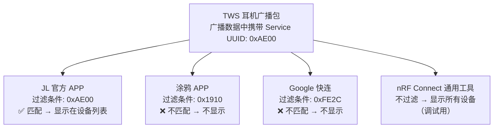

连接成功后，APP 做 Service Discovery 再次确认设备属性表里有 `0xAE00` 这个 Service，才开始发业务命令。两阶段结合，完成"认设备"的完整过程。

> **注意**：BLE 协议栈层面不会因 UUID 不匹配拒绝连接，任何人都能连上。过滤是**APP 应用层行为**，不是协议层强制隔离。

---

### 3.3 Characteristic UUID：区分同一协议内不同行为意图的"通道标签"

确认是自家设备之后，APP 和耳机通过这个 Service 下的各个 **Characteristic** 来交换数据。每个 Characteristic 有自己的 UUID，标识"这条通道是干什么的"，配合 **Properties 属性**声明它能执行什么操作（写/通知/读）。

**以 JL RCSP（Service `0xAE00`）为例：**

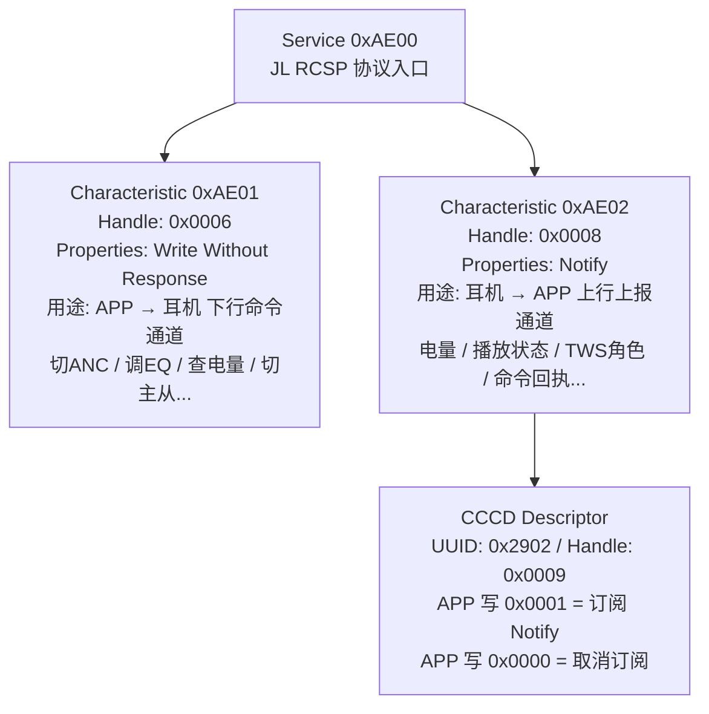

> **JL SDK 原始定义（`ble_rcsp_server.h`）：**
> ```c
> #define ATT_CHARACTERISTIC_ae01_01_VALUE_HANDLE                0x0006  // Write
> #define ATT_CHARACTERISTIC_ae02_01_VALUE_HANDLE                0x0008  // Notify
> #define ATT_CHARACTERISTIC_ae02_01_CLIENT_CONFIGURATION_HANDLE 0x0009  // CCCD
> ```

**设计逻辑**：所有下行命令（调EQ、切ANC、查电量、切主从……）全都从 `0xAE01` 写进去，耳机 SDK 里 `rcsp_att_write_callback()` 收到后再按帧里的命令码（OpCode）做分支处理；所有上行上报全从 `0xAE02` Notify 出去。**两个 Characteristic 搞定所有业务，这是私有协议最简洁的设计方式。**

---

### 3.4 ATT Handle 和 Characteristic UUID 的关系（关键概念）

这是 BLE 面试和实战里最容易混淆的点：

- **Characteristic UUID**：语义标识，表示“这条通道是干什么的”（外部协议约定）。
- **ATT Handle**：属性表地址，表示“这条属性在表里的位置”（传输时真正使用）。

也就是：**UUID 决定语义，Handle 决定寻址。**

实际通信流程一定是两步：

1. App 先做 Service/Characteristic Discovery，按 UUID 找到目标属性；
2. 协议栈把它映射成具体 handle，后续读/写/通知都按 handle 走。

| 属性 | UUID | Handle | 实际用途 |
|------|------|--------|----------|
| Write Value | `0xAE01` | `0x0006` | App 下发业务数据（ATT Write） |
| Notify Value | `0xAE02` | `0x0008` | 设备上行数据（ATT Notify） |
| CCCD Descriptor | `0x2902` | `0x0009` | App 写订阅开关（`0x0001/0x0000`） |

> 关键结论：Characteristic UUID 属于“外部语义约定的通道”；实际传输时都会映射到具体 ATT Handle 再操作。

---

### 3.5 CCCD 订阅动作到底走哪条路？（高频误解点）

很多人会把“写 CCCD”误解成“走业务 Write 通道发了一条订阅命令”。准确说法是：

- `0xAE01`（handle `0x0006`）是 **业务 Write Characteristic**，承载业务协议帧（OpCode/payload）。
- `0xAE02`（handle `0x0008`）是 **Notify Characteristic**，用于设备上行通知。
- `0x0009`（UUID `0x2902`）是挂在 `0xAE02` 下的 **CCCD Descriptor 句柄**，只负责开关通知能力。

App 开启通知时是一次 `ATT Write(handle=0x0009, value=0x0001)`，这个写操作：

- 不是“走 `0xAE01` 业务通道”；
- 也不是“走 Notify 通道”；
- 而是“写 Descriptor 句柄”的控制动作。

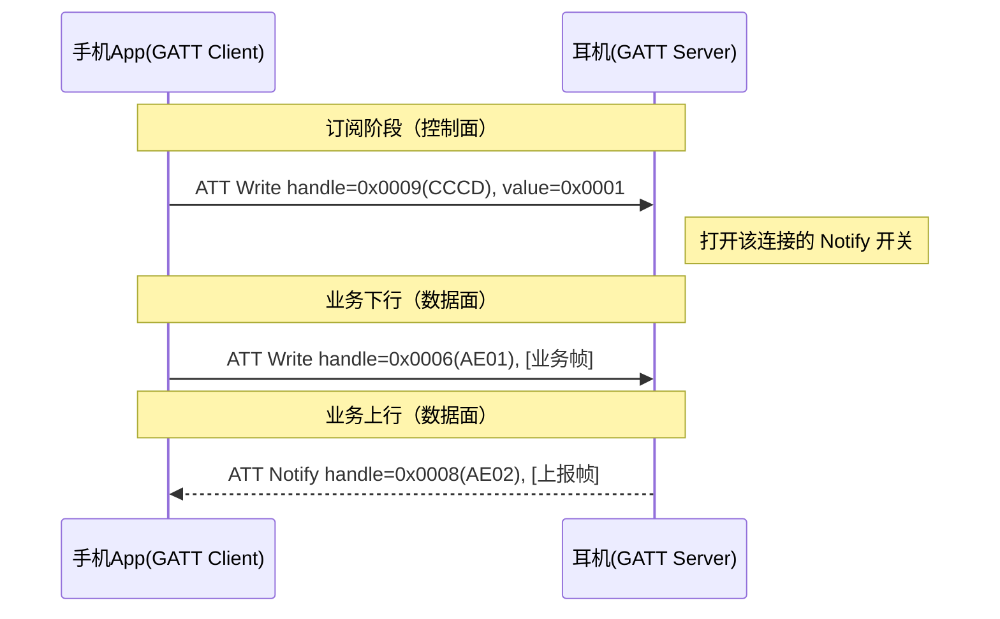

> 结论：CCCD 写入是“Notify 权限开关控制”，业务帧收发仍然是 `AE01/AE02`；真正下发到协议栈时都是按 handle（`0x0006/0x0008/0x0009`）执行。

---

### 3.6 TWS 耳机真实交互场景

#### 场景 A：APP 切换 ANC 模式（降噪 → 通透）

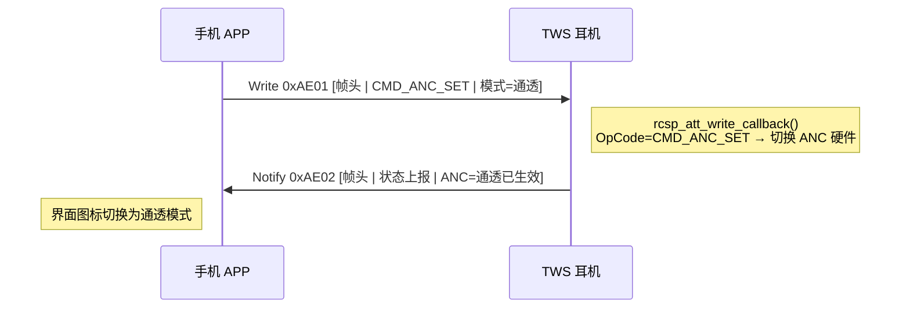

#### 场景 B：APP 启动时查询三颗电量

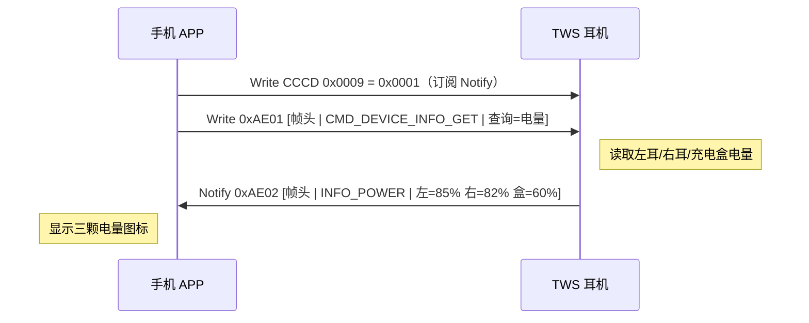

#### 场景 C：APP 调整 EQ 均衡器

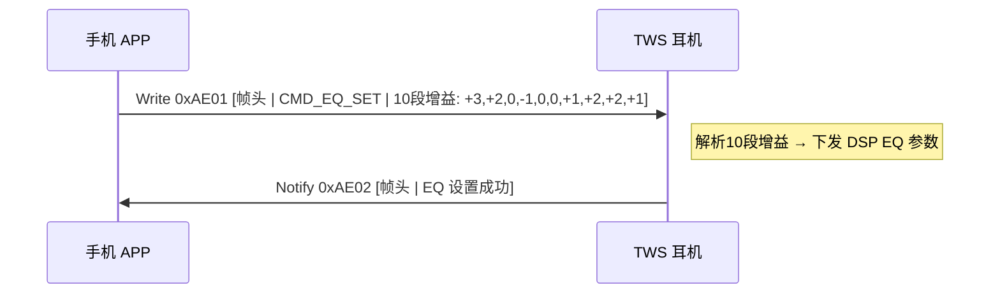

#### 场景 D：主从耳角色切换

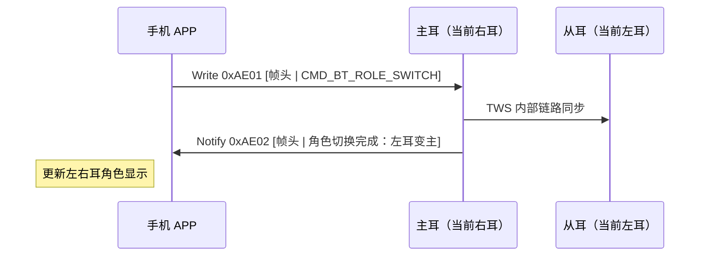

---

### 3.7 与 I2C 寻址类比

你提到"跟 I2C 读写标志位一样"——类比方向完全正确，精确对应如下：

| I2C | BLE GATT | 说明 |
|-----|---------|------|
| 7-bit 设备地址 | **Service UUID** | 找到哪个功能模块（协议入口） |
| 寄存器地址 | **Characteristic UUID / Handle** | 找到哪个数据通道 |
| R/W 标志位（第8位） | **Characteristic Properties** | 声明这条通道能写/读/通知 |
| 数据字节 | **Characteristic Value** | 实际传输的字节流 |
| ACK / NACK | **Write With / Without Response** | 是否要对方回执确认 |

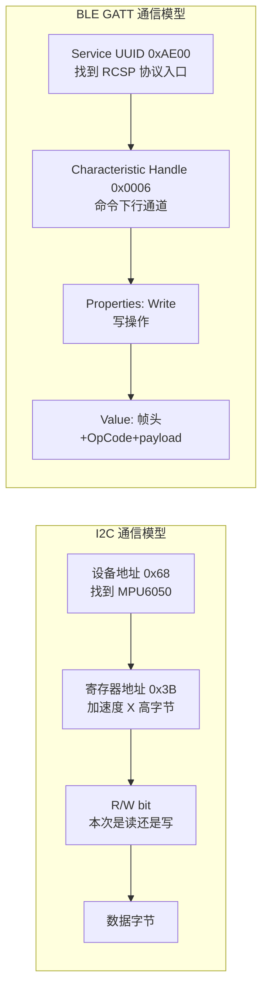

**关键区别**：I2C 每次事务里都要带 R/W bit；BLE 的 Properties 是**静态声明**的——注册 GATT 属性表时就定好了，APP 在 Service Discovery 阶段读一次就全知道了，后续通信直接按 handle 操作，**不需要每次传"行为标志"**。

---

## 四、GATT 层级结构图

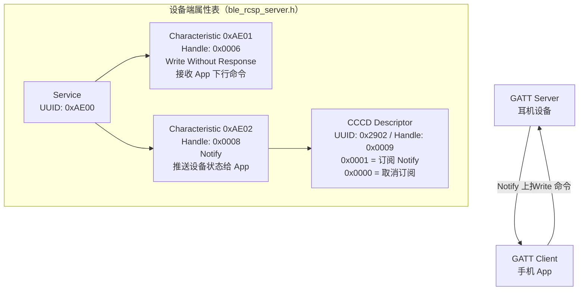

> `ble_rcsp_server.h` 原始定义：
> ```c
> #define ATT_CHARACTERISTIC_ae01_01_VALUE_HANDLE                  0x0006
> #define ATT_CHARACTERISTIC_ae02_01_VALUE_HANDLE                  0x0008
> #define ATT_CHARACTERISTIC_ae02_01_CLIENT_CONFIGURATION_HANDLE   0x0009
> ```

---

## 五、完整通信时序图

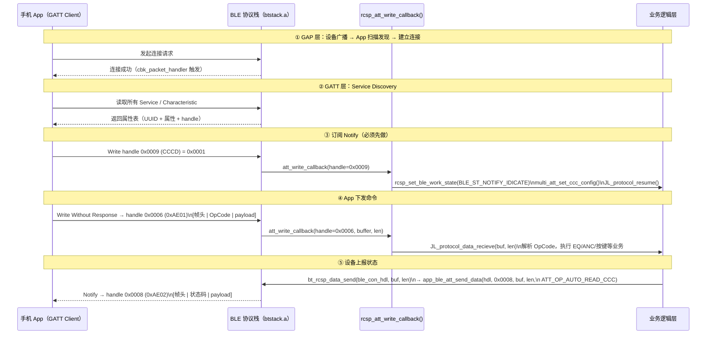

---

## 六、Write 回调代码拆解（ble_rcsp_server.c）

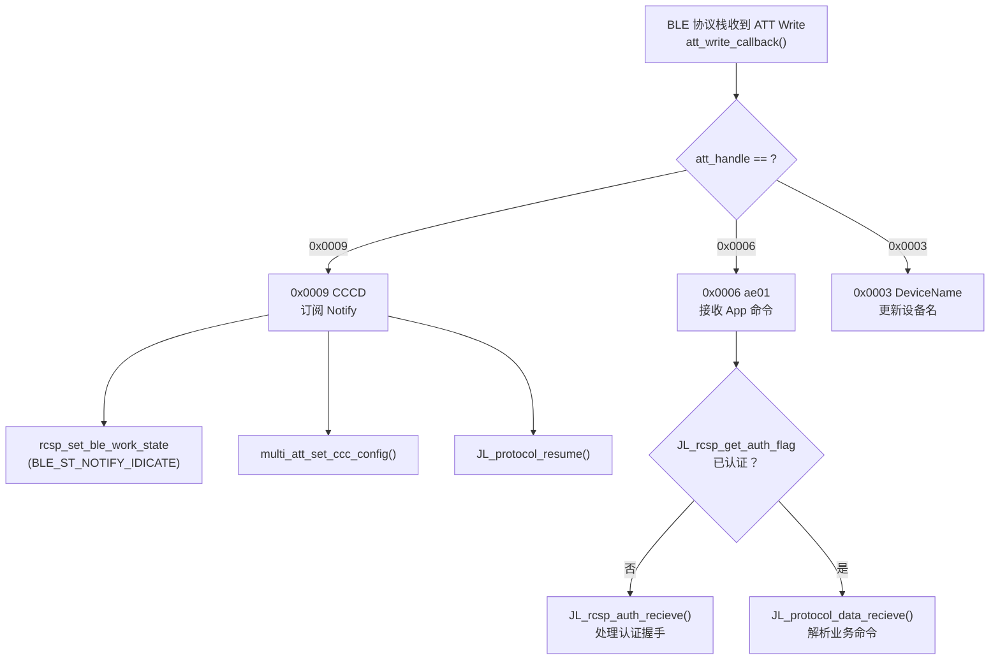

> 对应 SDK 代码（`ble_rcsp_server.c`）：
> ```c
> int rcsp_att_write_callback(..., uint16_t att_handle, ..., uint8_t *buffer, uint16_t buffer_size)
> {
>     switch (att_handle) {
>     case ATT_CHARACTERISTIC_ae02_01_CLIENT_CONFIGURATION_HANDLE:  // 0x0009
>         rcsp_set_ble_work_state(BLE_ST_NOTIFY_IDICATE);
>         multi_att_set_ccc_config(connection_handle, att_handle, buffer[0]);
>         JL_protocol_resume();
>         break;
>
>     case ATT_CHARACTERISTIC_ae01_01_VALUE_HANDLE:                 // 0x0006
>         if (!JL_rcsp_get_auth_flag_with_bthdl(rcsp_ble_con_handle, NULL)) {
>             JL_rcsp_auth_recieve(rcsp_ble_con_handle, NULL, buffer, buffer_size);
>             break;
>         }
>         JL_protocol_data_recieve(NULL, buffer, buffer_size, rcsp_ble_con_handle, NULL);
>         break;
>     }
>     return 0;
> }
> ```

---

## 七、Notify 发送代码拆解（rcsp_interface.c）

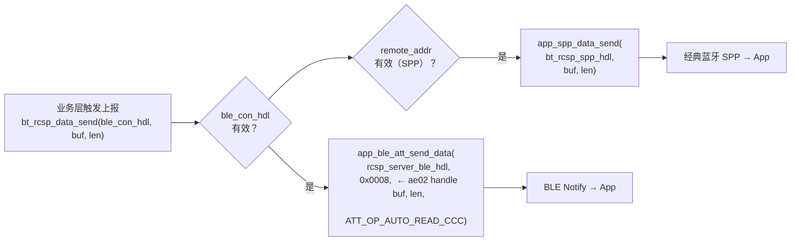

> `app_ble_att_send_data` 函数签名（`app_ble_spp_api.h`）：
> ```c
> extern ble_cmd_ret_e app_ble_att_send_data(
>     void *_hdl,          // RCSP BLE 服务句柄
>     u16   att_handle,    // 0x0008 (ae02)
>     u8   *data,
>     u16   len,
>     att_op_type_e att_op_type  // ATT_OP_AUTO_READ_CCC：自动读 CCCD 决定用 Notify 还是 Indicate
> );
> ```

---

## 八、三通道初始化全景图（rcsp_interface.c）

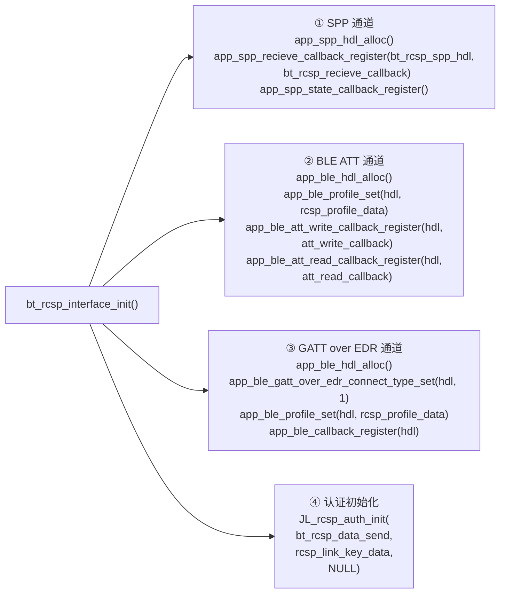

> 三通道同时工作，`bt_rcsp_data_send()` 根据 `ble_con_hdl` / `remote_addr` 向有连接的通道广播，业务层感知不到通道差异。

---

## 九、BLE 广播初始化（bt_ble.c）

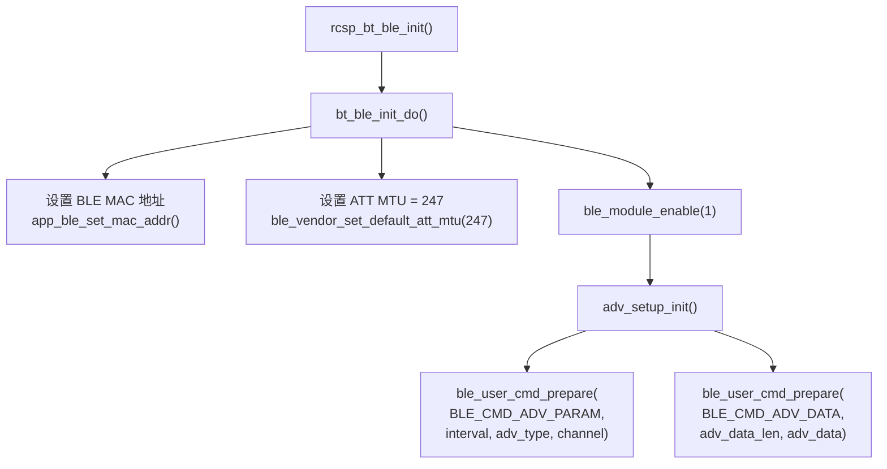

> 广播间隔常量（`bt_ble.c`）：
> ```c
> #define ADV_FAST_INTERVAL         48   // 30ms  - 未连接时快速广播
> #define ADV_CONN_FAST_INTERVAL    64   // 40ms  - 连接后快速
> #define ADV_CONN_NORMAL_INTERVAL  128  // 80ms  - 连接后正常
> #define ADV_SLOW_INTERVAL         800  // 500ms - 慢速广播（省电）
> ```

---

## 十、追问应答（进阶）

### 进阶-1：GATT Server 和 GATT Client 分别是什么角色？

> 设备（耳机）是 Server，持有属性表，被动响应读写请求；手机 App 是 Client，主动发起 Service Discovery 和 Write 操作，也主动订阅 Notify。但 Notify 是 Server 主动推给 Client，所以不是纯粹的请求-响应模式，而是混合模式。

---

### 进阶-2：CCCD 为什么要 App 主动写？

> GATT 规范要求如此——Notify 是单播给已订阅的 Client，如果默认开启而 Client 没准备好，数据就丢了。让 Client 主动写 CCCD = 0x0001 相当于握手确认"我准备好接收了"。
>
> 在 SDK 里，`rcsp_att_write_callback` 接收到 handle `0x0009` 写入时，调用 `rcsp_set_ble_work_state(BLE_ST_NOTIFY_IDICATE)` 标记可以开始推 Notify，然后调 `JL_protocol_resume()` 让协议层开始工作。

---

### 进阶-3：认证是怎么做的？

> JL RCSP 有一个 16 字节 Link Key 认证机制。连接后 App 先发认证握手帧，`rcsp_att_write_callback` 里检查 `JL_rcsp_get_auth_flag_with_bthdl()` 返回值：未认证时只走 `JL_rcsp_auth_recieve()` 处理握手；认证通过后才调 `JL_protocol_data_recieve()` 处理业务命令。
>
> ```c
> // ble_rcsp_server.c，Link Key 定义
> const u8 rcsp_link_key_data[16] = {
>     0x06, 0x77, 0x5f, 0x87, 0x91, 0x8d, 0xd4, 0x23,
>     0x00, 0x5d, 0xf1, 0xd8, 0xcf, 0x0c, 0x14, 0x2b
> };
> ```

---

### 进阶-4：ATT MTU 是什么，影响什么？

> ATT MTU 是单次 ATT 数据包的最大字节数，默认 23 字节（有效 payload 20 字节）。JL SDK 在初始化时设置为 247：
> ```c
> ble_vendor_set_default_att_mtu(ATT_LOCAL_PAYLOAD_SIZE);  // 247
> ```
> MTU 越大，单次 Notify 能携带的数据越多，对于 RCSP 这种需要传输 EQ 参数等较长数据包的场景很重要，否则要分包。

---

### 进阶-5：连接参数（Connection Parameter）是什么？

> 连接参数主要是连接间隔（Connection Interval），决定设备和手机多久通信一次，直接影响延迟和功耗。JL SDK 里有两组参数表：
> ```c
> // ble_rcsp_server.c
> static const struct conn_update_param_t connection_param_table[] = {
>     {16, 24, 16, 600},   // 初始：interval 16~24 × 1.25ms = 20~30ms
>     ...
> };
> static const struct conn_update_param_t connection_param_table_update[] = {
>     {96, 120, 0, 600},   // iOS 优化：60~75ms，省电
>     {6,  12,  0, 400},   // iOS 提速：7.5~15ms，低延迟
>     ...
> };
> ```
> 连接后会根据使用场景（普通控制 vs 游戏低延迟）动态更新连接参数。

---

## 十一、核心概念一行速记

| 概念 | SDK 对应 | 一行记忆 |
|------|---------|---------|
| **Service** | UUID `0xAE00` | 一组功能的命名空间 |
| **Characteristic** | `0xAE01` / `0xAE02` | 一个具体数据点，带读写通知属性 |
| **CCCD** | handle `0x0009` | Notify 的订阅开关，写 `0x0001` 才能收推送 |
| **Write Without Response** | `0xAE01` → `rcsp_att_write_callback` | App 下行命令，无需 ACK，快 |
| **Notify** | `app_ble_att_send_data(..., 0x0008, ...)` | 设备主动上报，不需 App 轮询 |
| **ATT MTU** | `ble_vendor_set_default_att_mtu(247)` | 单包最大字节数，影响分包策略 |
| **RCSP 多通道** | `bt_rcsp_interface_init()` | BLE + SPP + GATT over EDR 同时初始化，同时广播 |
| **认证** | `JL_rcsp_auth_init()` + 16B link key | 连接后先握手认证，通过后才处理业务命令 |

# Q2：机乐堂复杂数据包实战下，哪些参数可能需要调整？

## 一、标准回答（直接背诵）

> "机乐堂协议里，普通控制包不大，但有几类明显更重：  
> 比如 `1005/1006` EQ 信息（10 组时 payload 到 `0x52`）、`1008/1010` 按键配置返回 `0x30`、`1030/2010` 豆包数据是可变长且可能分包。  
> 所以实战里我会先用默认参数跑通，再根据具体现象判断是否要调 **MTU/发送缓存与节流/连接参数**，不是一上来就改 MTU。"

---

## 二、场景 1：复杂包下发慢、分包多、偶发失败（重点看 `1006` 和 `1030`）

### 典型现象

1. `1006 EQ_INFO_APP_SET` 大 payload 下发耗时明显。  
2. `1030 BEAN_DATA_APP_SEND` 连续发送时，设备侧偶发重组失败或超时。  
3. App 侧看到“发送成功”，设备侧处理不完整。

### 先排查什么（先协议后链路）

1. 机乐堂 TLV 字段是否正确：`Payload length`、`Check`、`Message ID`。  
2. 分包字段是否一致：`Package Index`、`Package Total Index`。  
3. 是否是发送节奏过快导致设备侧缓冲跟不上。

### 可能要改的参数

1. **MTU 相关参数**：当有效载荷长期受限且分包过多时再考虑提升。  
2. **发送缓存/队列大小**：处理连续大包时的瞬时堆积。  
3. **发送节流策略**：控制 App 连续写入速率，避免把问题“硬压给链路”。

### 一般怎么改

1. 先不改 MTU，只调发送节奏和分包策略。  
2. 仍然拥塞，再小步提升 MTU/缓存并复测。  
3. 每轮看三项：大包成功率、平均时延、内存/功耗变化。

---

## 三、场景 2：设备上报多事件并发，APP 端显示延迟或丢状态（重点看 `2002/2003/2010`）

### 典型现象

1. 电量（`2002`）和 ANC（`2003`）连续变化时，APP 显示不同步。  
2. 豆包上报（`2010`）活跃时，普通状态上报延迟变大。  
3. “下行控制正常，上行偶发漏一条”。

### 可能要改的参数

1. **Notify 发送节流**：限制单位时间上报条数。  
2. **发送队列策略**：关键状态优先，低优先级状态合并上报。  
3. **连接间隔档位**：在高交互场景使用更低时延档。

### 一般怎么改

1. 先做上报分级：关键控制回执 > 状态变化 > 非关键统计。  
2. 再做去突发化：短时间重复状态只保留最新值。  
3. 最后才动连接参数，避免一上来加大功耗。

---

## 四、场景 3：复杂数据交互期间偶发断连或重连慢

### 典型现象

1. 大包交互时链路更容易抖动。  
2. 断开后重连速度不稳定。  
3. iOS 和 Android 表现差异明显。

### 可能要改的参数

1. **连接参数组合**：`Connection Interval / Slave Latency / Supervision Timeout`。  
2. **重连阶段参数档位**：先稳后快，避免重连阶段就用激进参数。  
3. **广播阶段参数**：针对重连窗口优化发现与连接速度。

### 一般怎么改

1. 先回退到稳态保守档验证稳定性。  
2. 稳定后再按场景切低延迟档（如游戏模式）。  
3. 平台分档验证，不强行一套参数覆盖所有手机。

---

## 五、工程实践（机乐堂这类复杂协议推荐流程）

1. 默认参数先跑通：`1001~1032` 和 `2001~2010` 全链路可用。  
2. 先定位问题归属：协议封包问题 or 链路参数问题。  
3. 复杂包问题优先改发送节奏与分包，再考虑 MTU。  
4. 一次只改一类参数，避免互相掩盖。  
5. 每轮必须量化：成功率、时延、断连率、重连时长、功耗。

# 恒芸生泰 BLE 通讯协议 v1.0 实战

> 以下还原一个真实项目的完整开发流程：从收到客户协议文档，到独立调试，到与 APP 联调。

---

## Step 1：阅读文档，提取 GATT 结构

拿到协议文档第一件事——不是看命令，而是先找 **GATT 三要素**：Service UUID、Write Characteristic UUID、Notify Characteristic UUID。有了这三个，才能在 SDK 里注册属性表，剩下的帧格式和命令都是业务层的事。

**从《恒芸生泰BLE通讯协议v1.0》第二节提取：**

| 角色 | UUID（128-bit） | 说明 |
|------|---------------|------|
| **Service** | `00001820-0000-1000-8000-00805f9b34fb` | 协议入口，APP 靠这个 UUID 识别设备 |
| **Write Characteristic** | `000018F1-0000-1000-8000-00805f9b34fb` | APP → 耳机，下发设置命令 |
| **Read/Notify Characteristic** | `000018F2-0000-1000-8000-00805f9b34fb` | 耳机 → APP，上报状态/返回读取结果 |

> **注意**：这里用的是 128-bit 私有 UUID，不是 JL RCSP 那种 16-bit 短 UUID。两者格式不同，但注册 GATT 属性表时只是填的 UUID 长度不一样，开发流程完全相同。

---

## Step 2：分析帧格式，画出结构图

### 先搞清楚一个关键问题：帧里的 0x81/0x82 是多余的吗？

**不多余。Characteristic 和帧内读写标识解决的是两个不同层次的问题。**

Characteristic 只告诉你数据**从哪来、往哪走**（物理通道方向）。但这个协议里，"下发设置命令"和"查询当前状态"都是从 APP 写入同一个 Characteristic `0x18F1`——耳机的 Write 回调只知道"有数据写进来了"，根本不知道这次是命令还是查询，必须靠解析帧里的 `0x81/0x82` 才能区分。

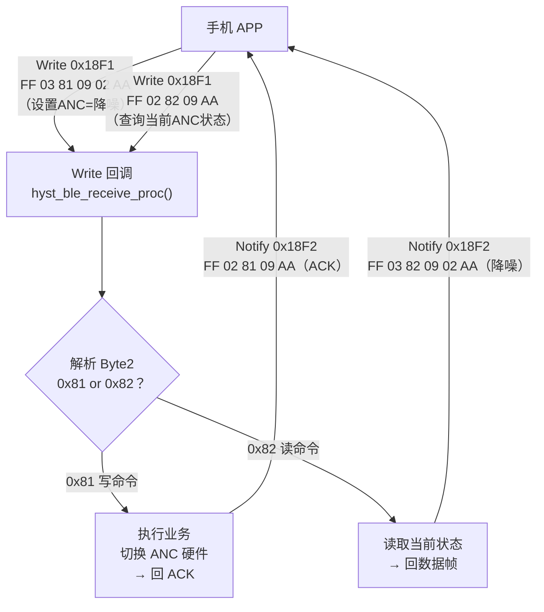

> **Characteristic = 入口管道**（区分数据从哪个方向进来）；**帧内标识 = 管道里货物的标签**（区分这批货是"命令"还是"查询"）。两层各司其职，不重叠。
>
> 类比串口通信：串口告诉你"UART0 收到数据了"，但你还得解析数据包头才能知道这包数据是配置指令还是状态查询。

---

GATT 只负责把字节流送达，帧格式是私有协议自己定义的。读懂帧格式才能写解析代码。

**协议帧结构（通用格式）：**

```
┌────────┬────────┬────────┬────────┬─────────────────┬────────┐
│ Byte0  │ Byte1  │ Byte2  │ Byte3  │  Byte4 ~ Byte N │ Byte N+1│
│ 帧头   │ 长度   │ 读写标识│ 命令码 │    数据内容      │ 帧尾   │
│ 0xFF   │   N    │0x81/0x82│  CMD  │    payload      │ 0xAA   │
└────────┴────────┴────────┴────────┴─────────────────┴────────┘
```

- **Byte0**：固定 `0xFF`，帧头标识
- **Byte1**：后续数据内容的长度 N（**不含帧尾 0xAA**）
- **Byte2**：`0x81` = APP 写入设备（APP→耳机）；`0x82` = APP 读取设备状态（耳机→APP）
- **Byte3**：命令码，区分不同业务功能
- **Byte4~N+3**：payload，各命令自定义
- **Byte N+4**：固定 `0xAA`，帧尾标识

**ACK 机制**：APP 发 `0x81` 写命令后，耳机必须立即回复 ACK：

```
FF  02  81  xx  AA
            ↑
        收到的命令码
```
APP 发 `0x82` 读命令，耳机不回 ACK，直接回复内容帧。

---

## Step 3：梳理完整命令表

读完整个文档，把所有命令整理成表——这是后续写代码 switch-case 分支的依据。

**写命令（Byte2 = 0x81，APP → 耳机）：**

| 命令码 | 功能 | 关键 payload |
|--------|------|-------------|
| `0x01` | 按键功能设置 | `[KeyID, ValueID]` |
| `0x02` | EQ 设置 | `[EQID, Gain×10字节]` |
| `0x03` | 查找耳机 | `[search: 1=开始, 0=停止]` |
| `0x04` | 恢复默认设置 | 无 payload |
| `0x05` | 清除配对记录 | 无 payload |
| `0x06` | 恢复出厂设置 | 无 payload |
| `0x07` | 游戏模式开关 | `[1=进入游戏模式, 0=退出]` |
| `0x09` | ANC 模式切换 | `[1=关闭, 2=降噪, 3=通透]` |

**读命令（Byte2 = 0x82，APP 查询 → 耳机返回）：**

| 命令码 | 查询内容 | 返回 payload |
|--------|---------|-------------|
| `0x01` | 所有按键配置 | `[KeyID ValueID] × N` 组 |
| `0x03` | 查找耳机状态 | `[search: 1=查找中, 0=停止]` |
| `0x07` | 游戏模式状态 | `[1=游戏模式, 0=普通模式]` |
| `0x09` | ANC 模式 | `[1=关闭, 2=降噪, 3=通透]` |
| `0x0C` | 三颗电量 | `[左耳, 右耳, 充电仓]` bit7=充电状态, bit6~0=电量 |
| `0x0D` | 固件版本 | `[V1, V2, V3]` → V1.V2.V3 |

---

## Step 4：在 JL SDK 里实现

### 4.1 注册 GATT 属性表

JL SDK 里 GATT 属性表在 `ble_rcsp_server.c` 的 profile data 数组里定义。对接第三方协议时，需要把 UUID 替换成客户协议的 UUID。关键修改点：

```c
// 原 RCSP: Service UUID 0xAE00 (16-bit)
// 恒芸生泰: Service UUID 00001820-... (128-bit)

// 属性表中 Characteristic 的 UUID 也同步替换：
// Write:  000018F1-0000-1000-8000-00805f9b34fb
// Notify: 000018F2-0000-1000-8000-00805f9b34fb
```

替换后 handle 编号不变，后续代码仍用 handle 寻址。

### 4.2 实现 Write 回调（帧解析 + 命令分发）

```c
// 在 att_write_callback 里，收到 0x18F1 的写入后进入此函数
void hyst_ble_receive_proc(uint8_t *buf, uint16_t len)
{
    // ① 校验帧头帧尾
    if (buf[0] != 0xFF || buf[len - 1] != 0xAA) {
        return;  // 帧格式错误，丢弃
    }

    uint8_t data_len = buf[1];   // 数据长度
    uint8_t rw_flag  = buf[2];   // 0x81=写 / 0x82=读
    uint8_t cmd      = buf[3];   // 命令码
    uint8_t *payload = &buf[4];  // payload 起始

    if (rw_flag == 0x81) {
        // ② 写命令：先回 ACK
        uint8_t ack[] = {0xFF, 0x02, 0x81, cmd, 0xAA};
        hyst_ble_notify(ack, sizeof(ack));  // 通过 Notify 发回 ACK

        // ③ 按命令码分发业务
        switch (cmd) {
        case 0x01:  hyst_key_set(payload, data_len);    break;
        case 0x02:  hyst_eq_set(payload, data_len);     break;
        case 0x03:  hyst_find_set(payload[0]);           break;
        case 0x07:  hyst_game_mode_set(payload[0]);      break;
        case 0x09:  hyst_anc_set(payload[0]);            break;
        case 0x04:  hyst_restore_default();              break;
        case 0x05:  hyst_clear_pair_info();              break;
        case 0x06:  hyst_factory_reset();                break;
        }
    } else if (rw_flag == 0x82) {
        // ④ 读命令：直接返回对应数据，不回 ACK
        switch (cmd) {
        case 0x01:  hyst_key_info_report();              break;
        case 0x03:  hyst_find_status_report();           break;
        case 0x07:  hyst_game_mode_report();             break;
        case 0x09:  hyst_anc_status_report();            break;
        case 0x0C:  hyst_battery_report();               break;
        case 0x0D:  hyst_version_report();               break;
        }
    }
}
```

### 4.3 实现 Notify 发送

所有上行数据（ACK、读取回复、主动上报）都走同一个 Notify 接口：

```c
// 封装发送，内部调用 JL SDK 的 app_ble_att_send_data()
void hyst_ble_notify(uint8_t *buf, uint16_t len)
{
    app_ble_att_send_data(
        rcsp_server_ble_hdl,          // BLE 服务句柄
        HYST_NOTIFY_CHAR_HANDLE,      // 0x18F2 对应的 handle
        buf, len,
        ATT_OP_AUTO_READ_CCC          // 自动检查 CCCD 是否已订阅
    );
}
```

**以电量上报为例，构建返回帧：**

```c
void hyst_battery_report(void)
{
    uint8_t left_bat  = get_local_battery();   // 本机电量 0~100
    uint8_t right_bat = get_remote_battery();  // 对端电量 0~100
    uint8_t box_bat   = get_box_battery();     // 充电仓电量 0~100

    // bit7 = 充电状态, bit6~0 = 电量
    uint8_t frame[] = {
        0xFF,                         // 帧头
        0x05,                         // 长度: 后续5字节(不含帧尾)
        0x82,                         // 读取回复
        0x0C,                         // 命令码
        left_bat  | (is_left_charging()  << 7),
        right_bat | (is_right_charging() << 7),
        box_bat   | (is_box_charging()   << 7),
        0xAA                          // 帧尾
    };
    hyst_ble_notify(frame, sizeof(frame));
}
```

---

## Step 5：nRF Connect 单机调试（不依赖客户 APP）

有了 nRF Connect，可以在拿不到客户 APP 的情况下独立验证所有功能，**按顺序走四个阶段**：

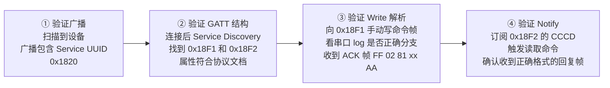

**具体操作示例——调试 ANC 切换命令（0x09）：**

| 步骤 | nRF Connect 操作 | 预期结果 |
|------|-----------------|---------|
| 1 | 扫描，找到设备广播 | 设备名正确，广播包里能看到 Service UUID `1820` |
| 2 | 连接，点"Discover Services" | 看到 Service `1820`，下面有 `18F1`（Write）和 `18F2`（Notify） |
| 3 | 点 `18F2` 旁边"Enable Notification" | 写 CCCD = 0x0001，订阅成功 |
| 4 | 向 `18F1` 写入：`FF 03 81 09 02 AA` | 设备切换到降噪模式，串口打印 `ANC set: 2` |
| 5 | 检查 `18F2` 收到的 Notify | 应收到 ACK：`FF 02 81 09 AA` |
| 6 | 向 `18F1` 写入：`FF 02 82 09 AA` | 读取当前 ANC 模式 |
| 7 | 检查 `18F2` 收到的 Notify | 应收到：`FF 03 82 09 02 AA`（02=降噪） |

> **每个命令调试完在文档上打勾**，全部通过后再联调 APP，避免问题混淆。

---

## Step 6：与客户 APP 联合调试

单机调试通过后，才进入 APP 联调阶段。联调按功能模块逐一验证。

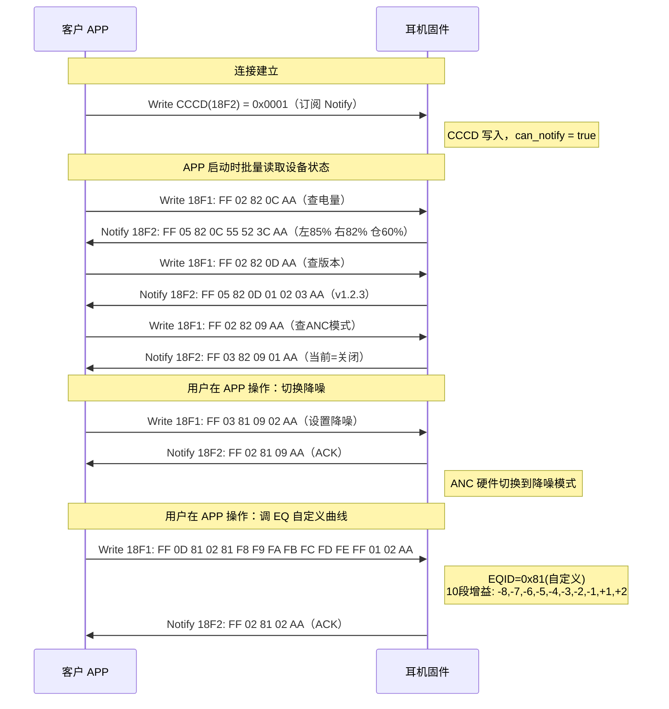

**联调检查清单：**

- [ ] APP 扫描页能正确显示设备（靠 Service UUID `0x1820` 过滤）
- [ ] APP 连接后能读到正确的电量、版本、ANC 模式初始值
- [ ] APP 切换 ANC 模式（关闭/降噪/通透），耳机硬件实际切换，ACK 正确
- [ ] APP 发送内置 EQ（0x01~0x06），耳机 DSP 切换，ACK 正确
- [ ] APP 发送自定义 EQ（EQID bit7=1），10段增益值正确解析
- [ ] APP 点击"查找耳机"，耳机发声，2分钟自动停止
- [ ] APP 切换游戏模式，耳机进入低延迟模式
- [ ] 断开重连后，APP 重新读取状态仍与设备实际状态一致

---

## 核心帧格式速查

```
写命令 (APP→耳机):   FF [len] 81 [CMD] [payload...] AA
写命令回执 (耳机→APP): FF  02  81 [CMD]              AA
读命令 (APP→耳机):   FF  02  82 [CMD]              AA
读命令回复 (耳机→APP): FF [len] 82 [CMD] [payload...] AA
```

**几个典型帧举例：**

```
切换降噪:     FF 03 81 09 02 AA
切换通透:     FF 03 81 09 03 AA
降噪命令ACK:  FF 02 81 09 AA
读取三颗电量: FF 02 82 0C AA
电量回复:     FF 05 82 0C 55 52 3C AA  → 左=85% 右=82% 仓=60%
自定义EQ:    FF 0D 81 02 81 F8 F9 FA FB FC FD FE FF 01 02 AA
```

# 机乐堂蓝牙耳机 BLE 通讯协议实战

> 以下内容严格基于《机乐堂蓝牙耳机 BLE 通讯协议（20250709）V1.1.5》原文整理，不使用文档外自定义字段。

---

## Step 1：阅读文档，提取 GATT 结构

拿到文档先做两件事：
1. 确认广播识别字段（APP 扫描过滤用）
2. 确认 BLE 通信 Characteristic（真正收发数据用）

**从协议第 2 章提取：**

| 模块 | 协议定义 | 作用 |
|------|---------|------|
| 广播设备名 | `COMPLETE LOCAL NAME`（ASCII） | APP 扫描列表展示与过滤 |
| 厂商数据 | 经典蓝牙 MAC + 设备识别码 + 固件版本 + `0x4A 0x52("JR")` | 标识机乐堂设备 |
| 通信写通道 | `xxxA801xxxxxx`，`Write Without Response` | APP → 耳机指令下发 |
| 通信通知通道 | `xxxA802xxxxxx`，`Notify` | 耳机 → APP 应答/主动上报 |
| OTA 数据通道 | `xxxA811xxxxxx`，`Read/Write/Write Without Response` | APP 发送 OTA 数据 |
| OTA 通知通道 | `xxxA812xxxxxx`，`Read/Notify` | OTA 回传 |

> 业务通信核心只用 `A801/A802`；`A811/A812` 是 OTA 专用。文档要求 BLE 连接时四个特征都存在。
>
> 订阅 `A802` 时，App 实际执行的是 `ATT Write` 到 `A802` 对应的 `CCCD Descriptor` 句柄（`0x2902`），不是往 `A801` 发送业务协议包。

---

## Step 2：分析帧格式，画出结构图

这份协议不是 `FF ... AA` 固定头尾帧，而是 **TLV 串接帧**：每个字段都按 `Field Length + Field Type + Field Data` 拼接。

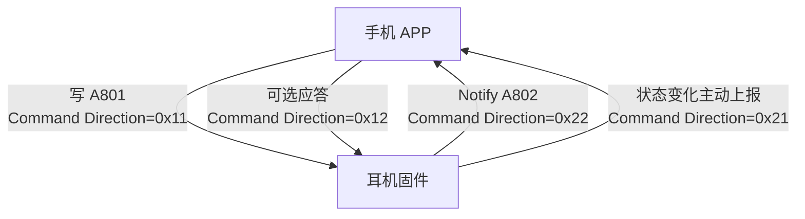

**字段类型表（协议 2.2.2）：**

| Field Type | 含义 | 长度 |
|-----------|------|------|
| `0x01` | Command ID | 2 字节（UInt16，小端） |
| `0x02` | Command Direction | 1 字节 |
| `0x03` | Message ID | 2 字节（随机 100~65535） |
| `0x04` | Response Code | 2 字节（请求固定 `0x0000`） |
| `0x05` | Payload length | 1 字节 |
| `0x06` | Payload | N 字节（最多 160） |
| `0x07` | Check | 1 字节 |

**Direction 取值：**

- `0x11`：App 对设备请求
- `0x22`：设备对 App 应答
- `0x21`：设备对 App 请求（主动通知）
- `0x12`：App 对设备应答

**Check 算法（协议 2.4）：**

```text
Check = (sum(Payload 所有字节) & 0xFF)
Payload 为空时，Check = 0x00
```

**分包规则（协议 2.3）：**仅文档指定的固定指令需要分包，分包放在 `Payload` 里：
- `Package Index`（当前包序号）
- `Package Total Index`（总包数）
- `Package Data`（每包最多 158 字节）

**文档原始字段示例（2.2.1）：**

```text
Field Length = 0x03
Field Type   = 0x01 (Command ID)
Field Data   = 0x0B, 0x0A

Field Length = 0x02
Field Type   = 0x02 (Command Direction)
Field Data   = 0x11
```

> 文档给出了字段级格式和各指令字段定义，但没有给出完整请求/应答整包十六进制示例。联调时整包由 Message ID、Payload 实时拼装。

---

## Step 3：梳理完整命令表

### 3.1 APP 主动发送指令（协议 4.1~4.32 一一对应）

| 协议节 | Command ID | 统一命名 | 请求 Payload length / 内容 | 应答 Payload length / 内容 |
|------|------------|---------|-----------------------------|-----------------------------|
| 4.1 | `1001` | `CONN_STATUS_APP_GET` | `0x00` / 空 | `0x02` / `B0左耳连接状态, B1右耳连接状态` |
| 4.2 | `1002` | `BATTERY_APP_GET` | `0x00` / 空 | `0x03` / `B0左耳电量, B1右耳电量, B2充电盒电量` |
| 4.3 | `1003` | `ANC_MODE_APP_GET` | `0x00` / 空 | `0x03` / `B0 ANC模式, B1自定义ANC Level, B2是否开机ANC` |
| 4.4 | `1004` | `ANC_MODE_APP_SET` | `0x03` / `B0模式,B1自定义Level,B2是否开机ANC` | `0x00` / 无 |
| 4.5 | `1005` | `EQ_INFO_APP_GET` | `0x00` / 无 | 按实际（10组时`0x52`）/ `B0 EQ编号 + 每组8字节频点参数 + 预衰减` |
| 4.6 | `1006` | `EQ_INFO_APP_SET` | 按实际（10组时`0x52`）/ `B0 EQ编号 + 每组8字节频点参数 + 预衰减` | `0x00` / 无 |
| 4.7 | `1007` | `FW_VERSION_APP_GET` | `0x00` / 空 | `0x03` / `B0~B2版本号` |
| 4.8 | `1008` | `BTN_CONFIG_APP_GET` | `0x00` / 空 | `0x30` / `48字节：左右耳支持功能列表+当前配置功能` |
| 4.9 | `1009` | `BTN_CONFIG_APP_SET` | `0x0C` / `12字节：左右耳单/双/三击与长按配置，含预留位` | `0x00` / 无 |
| 4.10 | `1010` | `DEFAULT_BTN_CONFIG_APP_SET` | `0x00` / 无 | `0x30` / `恢复后返回48字节按钮配置` |
| 4.11 | `1011` | `GAME_MODE_APP_GET` | `0x00` / 无 | `0x01` / `B0游戏模式开关(0关1开)` |
| 4.12 | `1012` | `GAME_MODE_APP_SET` | `0x01` / `B0游戏模式开关(0关1开)` | `0x00` / 无 |
| 4.13 | `1013` | `BASS_MODE_APP_GET` | `0x00` / 无 | `0x01` / `B0低音模式开关(0关1开)` |
| 4.14 | `1014` | `BASS_MODE_APP_SET` | `0x01` / `B0低音模式开关(0关1开)` | `0x00` / 无 |
| 4.15 | `1015` | `BATCH_NUMBER_APP_GET` | `0x00` / 无 | `0x01` / `B0批次号(0~255)` |
| 4.16 | `1016` | `SN_NUMBER_APP_GET` | `0x00` / 无 | `0x10` / `16字节ASCII（数字或大写字母）` |
| 4.17 | `1017` | `FIND_DEVICE_APP_SET` | `0x02` / `B0左耳蜂鸣开关,B1右耳蜂鸣开关` | `0x00` / 无 |
| 4.18 | `1018` | `RESET_DEVICE_APP_SET` | `0x00` / 无 | `0x00` / 无 |
| 4.19 | `1019` | `MULTI_CONN_MODE_APP_GET` | `0x00` / 无 | `0x01` / `B0一拖二开关(0关1开)` |
| 4.20 | `1020` | `MULTI_CONN_MODE_APP_SET` | `0x01` / `B0一拖二开关(0关1开)` | `0x00` / 无 |
| 4.21 | `1021` | `SPATIAL_AUDIO_MODE_APP_GET` | `0x00` / 无 | `0x01` / `B0空间音频(0关1音乐2影院)` |
| 4.22 | `1022` | `SPATIAL_AUDIO_MODE_APP_SET` | `0x01` / `B0空间音频(0关1音乐2影院)` | `0x00` / 无 |
| 4.23 | `1023` | `LHDC_MODE_APP_GET` | `0x00` / 无 | `0x01` / `B0 LHDC开关(0关1开)` |
| 4.24 | `1024` | `LHDC_MODE_APP_SET` | `0x01` / `B0 LHDC开关(0关1开)` | `0x00` / 无 |
| 4.25 | `1025` | `MUSIC_STATUS_APP_SET` | `0x01` / `B0音乐播放状态(0关1开)` | `0x00` / 无 |
| 4.26 | `1026` | `CALL_MODE_APP_GET` | `0x00` / 无 | `0x01` / `B0通话状态(0未通话1通话中)` |
| 4.30 | `1030` | `BEAN_DATA_APP_SEND` | 按实际 / 豆包数据 | 文档该节未定义应答结构 |
| 4.31 | `1031` | `VOICE_ACTIVATION_STATUS_APP_GET` | `0x00` / 无 | `0x01` / `B0豆包AI语音唤醒开关(0关1开)` |
| 4.32 | `1032` | `VOICE_ACTIVATION_STATUS_APP_SET` | `0x01` / `B0豆包AI语音唤醒开关(0关1开)` | `0x00` / 无 |

> 协议目录中 `4.27~4.29` 未定义，实战对接按文档现有 `4.1~4.26, 4.30~4.32` 落地。

### 3.2 设备主动通知指令（协议 5.1~5.10 一一对应）

| 协议节 | Command ID | 统一命名 | Payload length / 内容 |
|------|------------|---------|------------------------|
| 5.1 | `2001` | `CONN_STATUS_CHANGE_DEVICE_SEND` | `0x02` / `B0左耳连接状态,B1右耳连接状态` |
| 5.2 | `2002` | `BATTERY_CHANGE_DEVICE_SEND` | `0x03` / `B0左耳电量,B1右耳电量,B2充电盒电量` |
| 5.3 | `2003` | `ANC_CHANGE_DEVICE_SEND` | `0x03` / `B0 ANC模式,B1自定义ANC Level,B2是否开机ANC` |
| 5.4 | `2004` | `GAME_MODE_CHANGE_DEVICE_SEND` | `0x01` / `B0游戏模式开关(0关1开)` |
| 5.5 | `2005` | `BASS_MODE_CHANGE_DEVICE_SEND` | `0x01` / `B0低音模式开关(0关1开)` |
| 5.6 | `2006` | `CALL_MODE_CHANGE_DEVICE_SEND` | `0x01` / `B0通话状态(0结束1进入)` |
| 5.7 | `2007` | `SPATIAL_AUDIO_MODE_CHANGE_DEVICE_SEND` | `0x01` / `B0空间音频(0关1音乐2影院)` |
| 5.10 | `2010` | `BEAN_DATA_DEVICE_SEND` | 按实际 / 豆包数据 |

### 3.3 按钮功能清单（协议 4.8.1 一一对应）

| 功能序号 | 功能 | 对应 bit | 功能值 |
|--------|------|---------|-------|
| 1 | 无功能 | `bit0` | `1` |
| 2 | 播放/暂停 | `bit1` | `2` |
| 3 | 下一曲 | `bit2` | `3` |
| 4 | 上一曲 | `bit3` | `4` |
| 5 | 增加音量 | `bit4` | `5` |
| 6 | 减少音量 | `bit5` | `6` |
| 7 | 切换降噪模式 | `bit6` | `7` |
| 8 | 关闭降噪模式 | `bit7` | `8` |
| 9 | 低音增强开关 | `bit8` | `9` |
| 10 | 低延迟模式开关 | `bit9` | `10` |
| 11 | 语音助手 | `bit10` | `11` |
| 12 | 切换通话设备 | `bit11` | `12` |
| 13 | 启动/关闭豆包AI聊天 | `bit12` | `13` |
| 14~24 | 保留位 | `bit13~bit23` | `14~24` |

---

## Step 4：在 JL SDK 里实现

### 4.1 注册 GATT 属性表

在 `ble_rcsp_server.c`（或项目自定义 BLE profile 文件）里把业务 UUID 切到机乐堂协议：

```c
// 业务通道
// Write  : xxxA801xxxxxx
// Notify : xxxA802xxxxxx

// OTA 通道
// Write  : xxxA811xxxxxx
// Notify : xxxA812xxxxxx
```

实际项目里 `xxx` 前后缀由客户给定，核心是保留 `A801/A802/A811/A812` 这 4 个特征点。

### 4.2 实现 Write 回调（TLV 解析 + 命令分发）

```c
typedef struct {
    uint16_t cmd_id;
    uint8_t  direction;
    uint16_t msg_id;
    uint16_t rsp_code;
    uint8_t  payload_len;
    uint8_t *payload;
    uint8_t  check;
} jr_pkt_t;

static uint8_t jr_checksum(const uint8_t *payload, uint8_t len)
{
    uint32_t sum = 0;
    for (uint8_t i = 0; i < len; i++) {
        sum += payload[i];
    }
    return (uint8_t)(sum & 0xFF);
}

static int jr_parse_tlv(const uint8_t *buf, uint16_t len, jr_pkt_t *pkt)
{
    // 生产代码应做边界检查：Field Length 至少为1，且不越界。
    // 这里只演示解析主流程。
    for (uint16_t i = 0; i < len; ) {
        uint8_t flen = buf[i++];
        uint8_t ftype = buf[i++];
        uint8_t dlen = (uint8_t)(flen - 1);
        const uint8_t *fdata = &buf[i];

        switch (ftype) {
        case 0x01: pkt->cmd_id = fdata[0] | (fdata[1] << 8); break;
        case 0x02: pkt->direction = fdata[0]; break;
        case 0x03: pkt->msg_id = fdata[0] | (fdata[1] << 8); break;
        case 0x04: pkt->rsp_code = fdata[0] | (fdata[1] << 8); break;
        case 0x05: pkt->payload_len = fdata[0]; break;
        case 0x06: pkt->payload = (uint8_t *)fdata; break;
        case 0x07: pkt->check = fdata[0]; break;
        default: break;
        }
        i += dlen;
    }

    if (pkt->payload_len == 0 && pkt->check != 0x00) {
        return -1;
    }
    if (pkt->payload_len > 0 && pkt->check != jr_checksum(pkt->payload, pkt->payload_len)) {
        return -2;
    }
    return 0;
}
```

分发策略：
- `direction=0x11`：按 `cmd_id` 执行 GET/SET，回复 `0x22`
- `direction=0x12`：处理对设备主动消息的 APP 应答（按需实现）
- `direction=0x21/0x22`：通常是设备上行方向，设备侧写回调可直接拒收

### 4.3 实现 Notify 发送

```c
static void jr_ble_notify(uint8_t *buf, uint16_t len)
{
    app_ble_att_send_data(
        rcsp_server_ble_hdl,
        JR_NOTIFY_CHAR_HANDLE,      // A802 对应 handle
        buf,
        len,
        ATT_OP_AUTO_READ_CCC
    );
}
```

返回码建议直接对齐协议 6.1：`0` 成功，`10000~10008` 通用失败（如 LHDC 冲突、参数错误、依赖未就绪等）。

---

## Step 5：nRF Connect 单机调试（不依赖客户 APP）

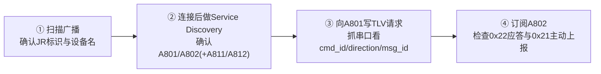

**电量指令调试样例：**

| 步骤 | 操作 | 预期 |
|------|------|------|
| 1 | 连接后订阅 `A802` CCCD | 可以收到 Notify |
| 2 | 向 `A801` 写 `1002` 查询帧 | 串口解析到 `cmd=1002,direction=0x11` |
| 3 | 检查 `A802` 返回 | `direction=0x22`，payload 3 字节电量 |
| 4 | 改变耳机电量状态 | 会收到 `cmd=2002,direction=0x21` 主动上报 |

---

## Step 6：与客户 APP 联合调试

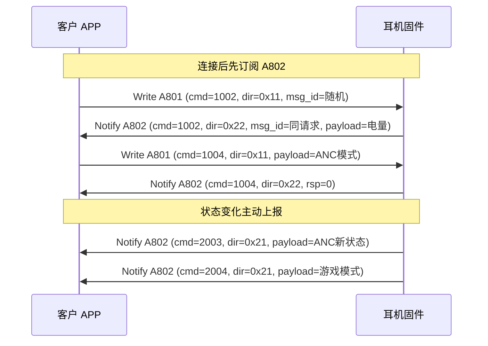

**联调检查清单：**

- [ ] 扫描过滤正确（设备名/JR 标识/厂商数据）
- [ ] `A801/A802` 收发稳定，`Message ID` 请求与应答一致
- [ ] 空 payload 命令 `Check=0x00`，非空 payload `Check=sum(payload)&0xFF`
- [ ] ANC / 游戏模式 / 低音 / 空间音频 / LHDC 开关都可闭环
- [ ] LHDC 冲突场景返回码正确（`10005~10008`）
- [ ] 单耳方案右耳无效位按文档填充 `0xFF`
- [ ] 豆包数据大包按分包规则处理并可重组

---

## 核心帧格式速查

```text
通用TLV串：
[Len][Type][Data]...[Len][Type][Data]

最小请求(空Payload)必含字段：
0x01(Command ID) + 0x02(Direction) + 0x03(Message ID) +
0x04(Response Code) + 0x05(Payload length) + 0x06(Payload) + 0x07(Check)
```

**文档里给出的典型数据值（原文示例）：**

```text
固件版本示例（1007返回）：
0x0A 0x00 0x03  -> 10.0.3

电量字节示例（1002/2002）：
0x21 = 33%

SN 示例（1016返回，16字节ASCII）：
2410AJQ800010001
对应字节：
0x32 0x34 0x31 0x30 0x41 0x4A 0x51 0x38
0x30 0x30 0x30 0x31 0x30 0x30 0x30 0x31

ANC 模式值（1003/1004/2003）：
0x00 OFF, 0x01 ON, 0x02 通透, 0x03 防风噪,
0x04 休闲, 0x05 自适应, 0x06 自定义

Check 算法示例：
Payload 为空 -> Check=0x00
Check = sum(payload) & 0xFF
```

# BLE 通讯协议实战总结

你的理解是对的，实战里可以先抓住两层：

## 1. 通道层（Characteristic）

- BLE 的通信通道就是 Characteristic。
- APP 下行到耳机走 Write 通道（如 `A801`）。
- 耳机上行到 APP 走 Notify 通道（如 `A802`）。
- 不同通道由不同 Characteristic UUID 唯一标识。
- 业务通信和 OTA 通信通常各有一组 Write/Notify 通道（例如业务 `A801/A802`，OTA `A811/A812`）。

## 2. 数据层（协议包）

- 真正的业务复杂度主要在数据包定义与解析，而不是通道本身。
- 有的协议是简单帧（固定帧头/帧尾）；有的协议是 TLV 这类结构化封包。
- 只要字段定义、字节序、长度规则、校验规则、分包规则与文档一致，协议联调大概率可控。

## 3. 实战落地方法（通用）

- 先对齐 GATT：确认 Service/Characteristic/属性（Write、Notify、CCCD）。
- 再对齐封包：逐字段实现解析与组包，不猜字段。
- 再对齐命令表：按文档一一对应实现 `cmd_id` 分支。
- 最后联调验证：先 nRF Connect 单机，再和客户 APP 联调，逐条勾检。

一句话：**Characteristic 解决“从哪条通道收发”，协议包解决“收发的内容怎么解释”。**
