# 基于 BLE 的 OTA 原理

> 本章以 JL 双核 SDK（RCSP 协议）为基准，Flash 布局数据来自真实编译日志，结合嵌入式音频行业工程实践。

---

## 零、基础概念：RAM / ROM / Flash 三层存储

### 0.1 RAM vs ROM 的本质区别

在嵌入式音频行业，"ROM"是从业者对**非易失性存储（NOR Flash）**的习惯叫法，核心特征是**掉电不丢失**。

| | **RAM（SRAM）** | **ROM（NOR Flash）** |
|-|---------------|-------------------|
| **掉电后数据** | ❌ 消失 | ✅ 保留 |
| **可否修改** | 随时读写 | 可电气擦写（OTA 目标） |
| **CPU 能否直接执行** | ✅ | ✅ XIP（就地执行，无需拷到 RAM） |
| **JL 耳机典型用途** | 变量 / 堆栈 / 音频缓冲 | 固件代码 / 提示音 / 配置参数 |
| **能被 OTA 更新** | — | ✅ |

> JL 芯片（如 BR52/AC709N）通过 SFC（串行 Flash 控制器）接口外挂 NOR Flash，整体作为一个模组选型。开发者说"选 ROM 8MB / 16MB 的型号"是完全正确的行业表述。

---

### 0.2 JL709N 真实 Flash 分区布局（来自编译日志）

以下数据来自 `isd_download.exe` 打印的 `FLASH INFO`，是实际工程的真实地址：

```
-----------------------------------FLASH INFO------------------------------------
|  PID : JL709N                                                                 |
|  FLASH_BIN_SIZE : 0xa8000     ← 固件主体（app+uboot+tone+res）= 672 KB       |
|  VM_REAL_SIZE   : 0x56000     ← VM 用户配置区 = 344 KB                       |
|  VM_START_ADDR  : 0xa8000     ← VM 起始地址                                  |
|  VM_END_ADDR    : 0xfe000     ← VM 结束地址                                  |
|  BTIF_RESERVED_SIZE : 0x1000  ← 蓝牙配对信息保留区 = 4 KB                   |
|  BTIF_RESERVED_START: 0xfe000                                                 |
|  LAVE_SIZE      : 0x4c000     ← 剩余空闲空间 = 304 KB                        |
|  ENTRY_ADDR     : 0x4000100   ← 程序入口（Flash XIP 映射地址）               |
---------------------------------------------------------------------------------
```

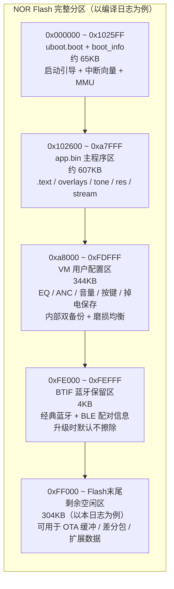

**各分区说明：**

| 分区 | 地址范围 | 大小 | 随代码修改而变化？ | 升级时是否擦除 |
|------|---------|------|-----------------|-------------|
| uboot + boot_info | `0x000000~0x1025FF` | ~65KB | ❌ 厂商固定，轻易不动 | 覆盖写入（危险操作） |
| 固件主体（app） | `0x102600~0xa7FFF` | ~607KB | ✅ **每次编译都变** | OTA 时写入新固件 |
| VM 用户配置区 | `0xa8000~0xFDFFF` | 344KB | ❌ 代码不变它不变 | 由 `CONFIG_VM_OPT` 决定，默认**不擦** |
| BTIF 蓝牙配对区 | `0xFE000~0xFEFFF` | 4KB | ❌ | 由 `CONFIG_BTIF_OPT` 决定，默认**不擦** |
| 空闲区 | `0xFF000~末尾` | 视 Flash 容量 | ❌ | OTA 双 Bank 时作为缓冲区 |

> **VM 区的双备份**：VM 内部实现了"两份 KV 数据 + 版本标记"机制，写入顺序是先写备份 → 成功后切主份。断电后优先读主份，失败读备份。这保证了升级或断电时 EQ/音量等用户配置**不会彻底丢失**。

---

### 0.3 JL 三层启动链：uboot → ota.bin（Loader）→ app

这是理解 OTA 的前提。JL 的启动不是"Bootloader 直接跳 App"那么简单，而是**三层**：

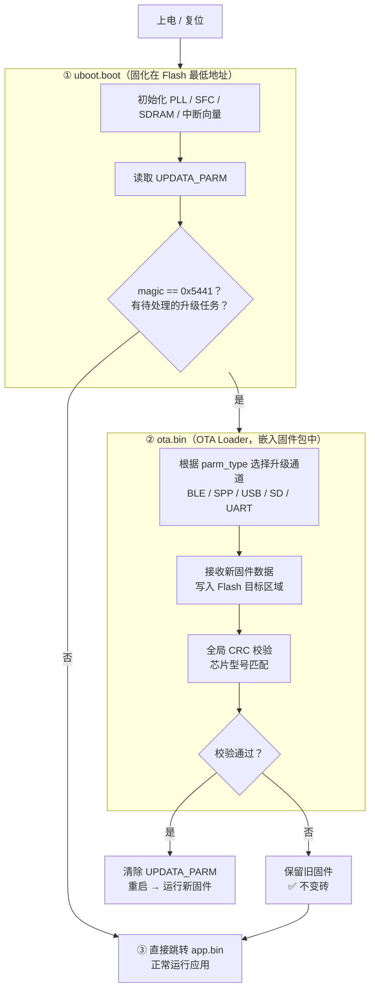

**三者职责分工：**

| 组件 | 对应文件 | 职责 | 能被 OTA 更新？ |
|------|---------|------|--------------|
| **uboot** | `uboot.boot` | 硬件初始化、读 UPDATA_PARM、决定跳 App 还是跳 Loader | ⚠️ 极少更新，失败必变砖 |
| **OTA Loader** | `ota.bin` | 实际执行固件接收、写 Flash、校验。内含多种升级通道驱动 | ✅ 可随固件包一起更新 |
| **应用固件** | `app.bin` | 业务逻辑（BLE/音频/传感器/UI） | ✅ OTA 的主要目标 |

**ota.bin 内含多种升级通道驱动（编译日志实证）：**

```
--------------------------- OTA UPDATE INFO ---------------------------
| PASS: 测试盒串口升级        大小=0x6920   需要最小空间 0x0
| PASS: 测试盒经典蓝牙升级    大小=0x9573   需要最小空间 0xa000
| PASS: SD卡升级             大小=0x1736   需要最小空间 0x2000
| PASS: USB升级              大小=0x1d98   需要最小空间 0x2000
| PASS: 测试盒BLE升级         大小=0xdfb7   需要最小空间 0xf000
-----------------------------------------------------------------------
```

> `ota.bin` 是一个**多合一的 OTA Loader 包**，内嵌多种升级通道的驱动（串口、蓝牙、USB、SD）。uboot 检测到升级任务时，根据 `UPDATA_PARM.parm_type` 决定启用哪条通道。

---

## 一、OTA 不是必须双 Bank——三种存储策略

双 Bank 只是 OTA 的**一种存储策略**，根据 Flash 容量和产品定位选择：

```mermaid
graph TD
    subgraph S1["策略一：单 Bank 直接覆盖（In-place）"]
        F1["Flash: Bootloader | 固件区（一份）| VM | BTIF"]
        P1["升级时逐扇区擦旧写新\n❌ 中途断电 = 变砖"]
        R1["恢复：测试盒 / USB / UART 重刷"]
        F1 --> P1 --> R1
    end

    subgraph S2["策略二：双 Bank / A/B 分区（Dual Bank）"]
        F2["Flash: Bootloader | Bank A（运行）| Bank B（备份）| VM | BTIF"]
        P2["新固件写 Bank B，Bank A 继续运行\n✅ 断电可回滚"]
        R2["Loader 校验通过后切 Boot 指针"]
        F2 --> P2 --> R2
    end

    subgraph S3["策略三：差分升级（Delta Update）"]
        F3["Flash: 可与单/双 Bank 结合"]
        P3["只传新旧固件差异包\n耳机侧重建完整新固件\n传输量极小（几十KB vs 几百KB）"]
        R3["JL SDK: UPDIFF_FLASH_UPDATA\n适合小版本 Bug 修复"]
        F3 --> P3 --> R3
    end
```

| 对比维度 | 单 Bank | 双 Bank | 差分升级 |
|---------|--------|--------|--------|
| **断电安全** | ❌ 可能变砖 | ✅ 保证不变砖 | 取决于底层策略 |
| **Flash 占用** | 1× 固件 | 2× 固件（需足够大的 Flash） | 临时缓冲区 |
| **传输数据量** | 完整固件 | 完整固件 | 仅差异包（最省） |
| **实现复杂度** | 低 | 中 | 高（需 diff 算法） |
| **适用产品** | 低成本 / 有线恢复 | 高端 TWS / 消费电子 | 量产大规模升级 |
| **JL SDK** | `BLE_APP_UPDATA` | `DUAL_BANK_UPDATA` | `UPDIFF_FLASH_UPDATA` |

> **选型依据**：双 Bank 需要 Flash 中有足够的空闲区域存放第二份固件。Flash 越大（如 16MB）、固件相对越小，才越适合双 Bank。Flash 紧张的项目通常用单 Bank + 测试盒恢复。

---

## 二、普通 BLE 交互 vs BLE OTA：本质区别

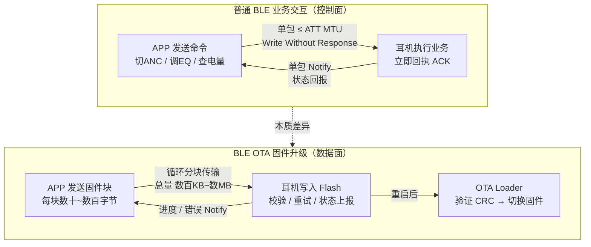

| 维度 | 普通 BLE 业务交互 | BLE OTA 固件升级 |
|------|-----------------|-----------------|
| **数据量** | 单包几字节~几十字节 | 固件文件数百KB~数MB，分块传输 |
| **交互模式** | 命令 → 立即响应（同步） | 初始化 → 数据流循环 → 重启（异步状态机） |
| **通道用途** | 实时控制（ANC/EQ/按键/电量） | 固件传输（有些协议用独立通道） |
| **设备状态** | 正常运行 | 进入"升级模式"，关闭音频、降低功耗 |
| **结束方式** | 每条命令独立结束 | 全部传输完成后主动重启 |
| **错误处理** | 单条命令失败即重发或忽略 | CRC 校验、分块重试、失败回滚 |

> **一句话区别**：普通交互是"实时打电话"，OTA 是"搬运一个大货柜然后重启仓库"。

---

## 三、BLE OTA 两种通道架构

### 架构 A：业务通道与 OTA 通道合并（RCSP 方案）

OTA 和业务命令共用同一套 GATT Characteristic（`AE01` Write + `AE02` Notify），靠 **OpCode 范围**区分：

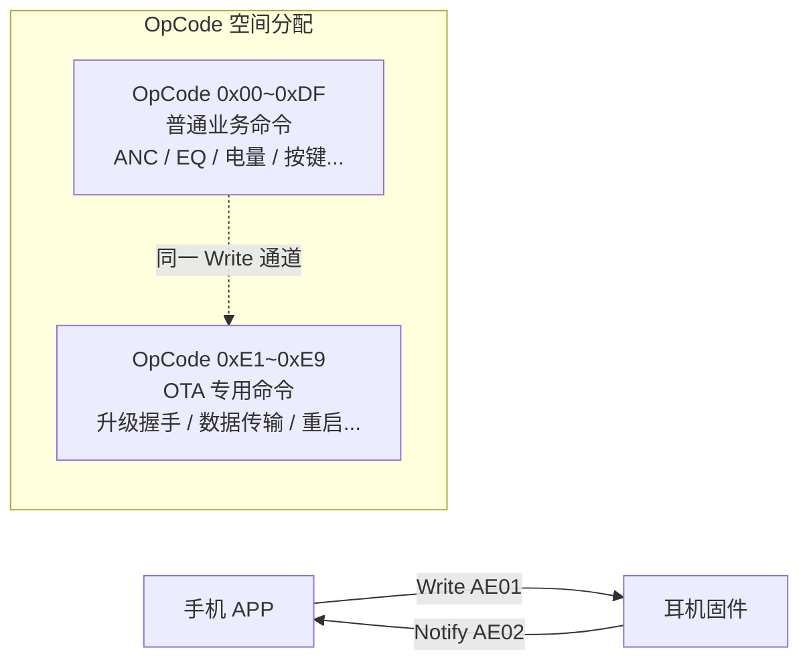

### 架构 B：业务通道与 OTA 通道分离（机乐堂方案）

独立的 GATT Characteristic，物理隔离业务与 OTA：

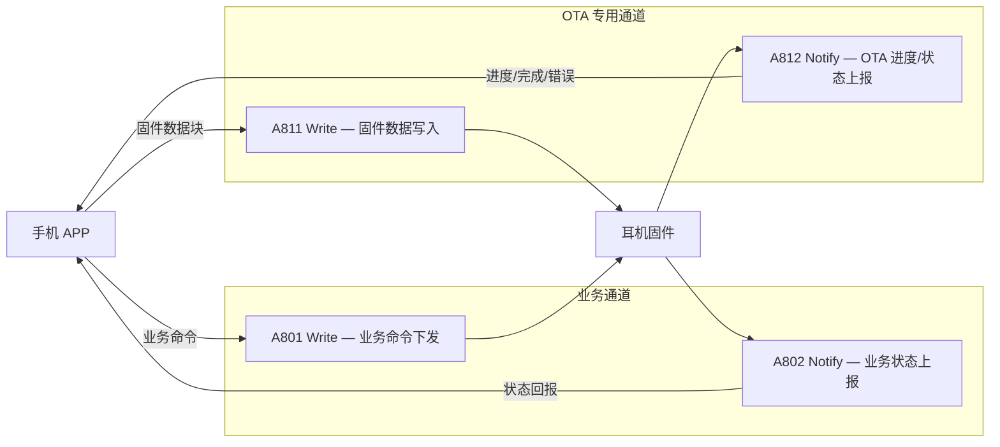

> **架构 B 的优点**：OTA 传输期间业务通道仍可正常通信（APP 仍能显示电量），两条通道互不干扰。

---

## 四、JL RCSP OTA 专用指令集（0xE1~0xE9）

这 9 条 OpCode 构成"握手 → 传输 → 校验 → 重启"完整协议：

| OpCode | 名称 | 方向 | 功能 |
|--------|------|------|------|
| `0xE1` | `GET_UPDATE_FILE_INFO_OFFSET` | APP→耳机 | 查询设备固件分区偏移量和长度 |
| `0xE2` | `INQUIRE_IF_CAN_UPDATE` | APP→耳机 | 检查能否升级（电量/TWS状态/版本） |
| `0xE3` | `ENTER_UPDATE_MODE` | APP→耳机 | 进入升级模式（关音频、初始化缓冲区） |
| `0xE4` | `EXIT_UPDATE_MODE` | APP→耳机 | 退出升级模式（用户取消/错误中止） |
| `0xE5` | `SEND_FW_UPDATE_BLOCK` | APP↔耳机 | 发送/请求固件数据块（循环调用） |
| `0xE6` | `GET_FW_REFRESH_STATUS` | APP→耳机 | 查询固件烧录进度/状态 |
| `0xE7` | `SET_DEVICE_REBOOT` | APP→耳机 | 命令设备重启，进入 Loader 应用新固件 |
| `0xE8` | `NOTIFY_UPDATE_CONTENT_SIZE` | APP→耳机 | 告知设备固件总大小（预分配空间） |
| `0xE9` | `CHECK_DEVICE_CONN_NUM` | APP→耳机 | 查询当前连接数（一拖二场景） |

---

## 五、BLE OTA 完整交互时序图

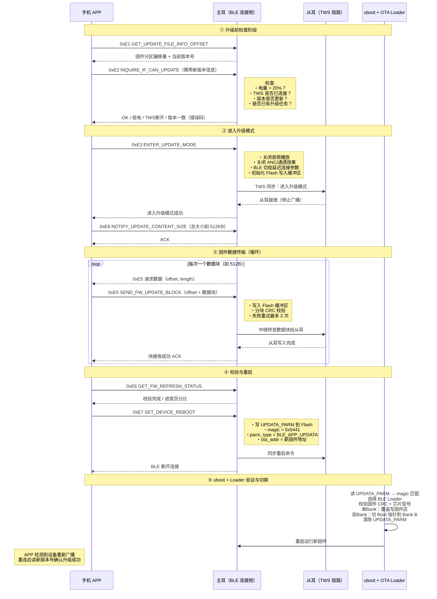

---

## 六、双 Bank 机制详解

### Flash 分区示意（双 Bank 方案）

```mermaid
graph TD
    subgraph FLASH["NOR Flash（双 Bank 方案，需较大 Flash）"]
        UB2["uboot 区\n受写保护"]
        BA["Bank A — 当前运行固件"]
        BB["Bank B — OTA 写入缓冲区\n（空闲空间中划出）"]
        VM2["VM 用户配置区\n掉电保存，内部双备份"]
        BTIF2["BTIF 蓝牙配对区\n升级不擦除"]
        UB2 --> BA --> BB --> VM2 --> BTIF2
    end

    subgraph Flow["双 Bank 升级流程"]
        S1["① 正常运行 Bank A"]
        S2["② OTA 写入 Bank B\nBank A 继续运行"]
        S3["③ 全部写完，CRC 校验通过\n写 UPDATA_PARM 标记 Bank B 有效"]
        S4["④ 重启 → uboot 读 UPDATA_PARM\n切 Boot 指针到 Bank B"]
        S5["⑤ 运行新固件（Bank B）"]
        S1 --> S2 --> S3 --> S4 --> S5
    end

    subgraph Rollback["失败回滚"]
        R1["Bank B CRC 失败\n或传输中断"]
        R2["uboot 检测 Bank B 无效\n保持 Boot 指针在 Bank A"]
        R3["继续运行旧固件\n✅ 不变砖"]
        R1 --> R2 --> R3
    end
```

**JL SDK 双 Bank 核心 API（`dual_bank_updata_api.h`）：**

```c
// 1. 初始化
dual_bank_passive_update_init(fw_crc, fw_size, max_pkt_len, priv);

// 2. 检查空间是否够
dual_bank_update_allow_check(fw_size);

// 3. 循环写入（每收到一块数据调一次）
dual_bank_update_write(data, len, write_complete_cb);

// 4. 整体 CRC 校验
dual_bank_update_verify(crc_init_hdl, crc_calc_hdl, verify_result_hdl);

// 5. 写 Boot Info（让 Loader 知道切到 Bank B）
dual_bank_update_burn_boot_info(burn_boot_info_result_hdl);

// 6. 清理释放资源
dual_bank_passive_update_exit(priv);
```

---

## 七、TWS 双耳同步升级

TWS 两颗耳机**必须同时升级**，版本不一致会导致 TWS 无法连接。

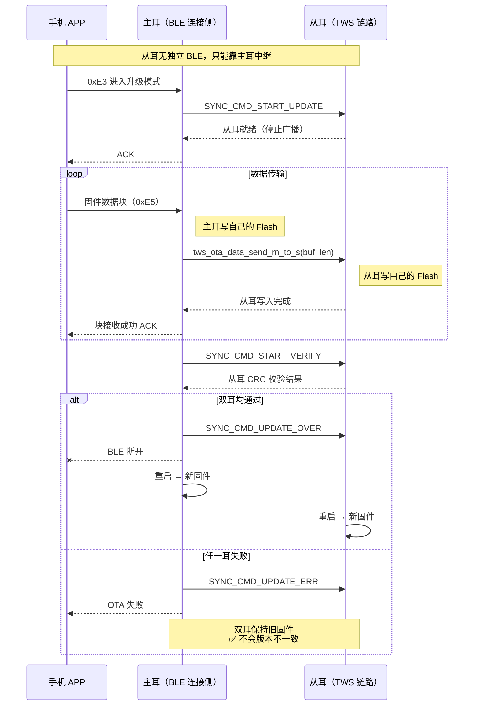

**TWS OTA 状态机：**

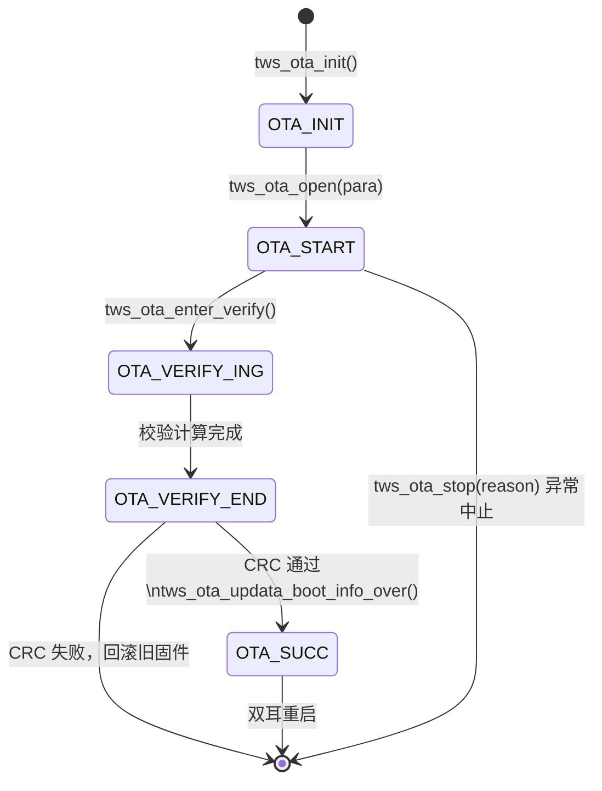

---

## 八、固件文件格式（.ufw 文件）

APP 侧发送的不是裸固件，而是带有头信息的 `.ufw` 升级包：

```
┌──────────────┬──────────────────────────────────────────────────┐
│ UFW 文件头   │ 版本号、芯片型号、Product ID、固件总 CRC、总大小  │
│ (FLASH_HEAD) │ → 耳机校验：型号不匹配返回 PRODUCT_INFO_NOT_MATCH│
├──────────────┼──────────────────────────────────────────────────┤
│ APP Code 头  │ 每个模块的偏移 / 大小 / CRC                      │
│ (CODE_HEAD)  │ → CRC 失败返回 UFW_CODE_HEAD_CRC_ERR             │
├──────────────┼──────────────────────────────────────────────────┤
│ 主固件代码   │ app.bin（实际运行的应用程序代码）                 │
├──────────────┼──────────────────────────────────────────────────┤
│ 资源文件     │ 提示音 / 音效配置（可选，分块传输）               │
├──────────────┼──────────────────────────────────────────────────┤
│ OTA Loader   │ ota.bin（可随固件一起升级，含多通道升级驱动）      │
│              │ → CRC 失败返回 LOADER_VERIFY_ERR                 │
└──────────────┴──────────────────────────────────────────────────┘
```

> **APP 侧发起升级前必须校验** `PRODUCT_INFO_NOT_MATCH`：`.ufw` 里的芯片型号必须与 `0xE1` 返回的设备型号完全一致，否则绝对拒绝发起升级。

---

## 九、0xE2 升级前检查逻辑

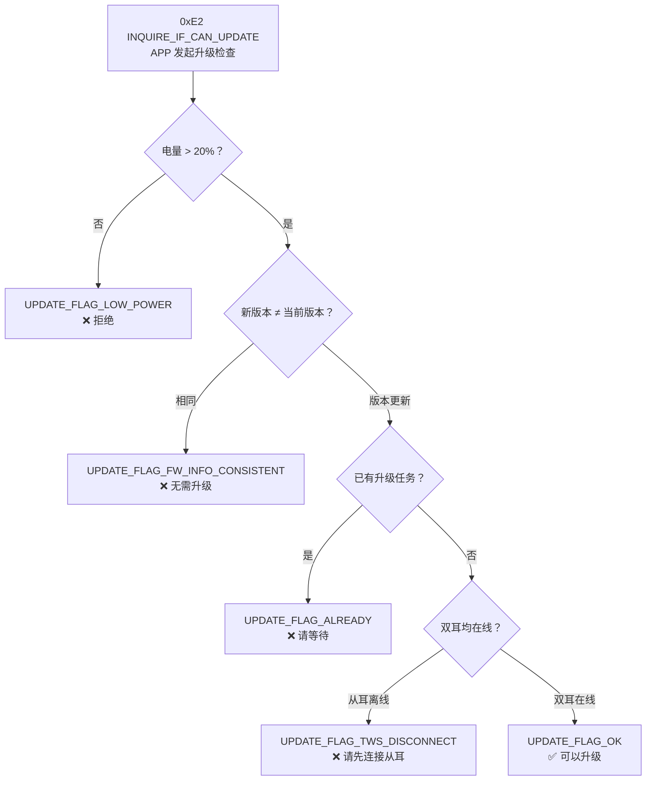

---

## 十、OTA 常见错误码

| 错误码 | 名称 | 类别 | 说明 |
|--------|------|------|------|
| `0x01` | `FILE_SIZE_ERR` | 固件文件 | 固件大小异常 |
| `0x03` | `LOADER_VERIFY_ERR` | 固件文件 | OTA Loader CRC 校验失败 |
| `0x08` | `FLASH_DATA_VERIFY_ERR` | Flash 操作 | Flash 数据 CRC 校验失败 |
| `0x0A` | `PRODUCT_INFO_NOT_MATCH` | 固件文件 | ⚠️ 芯片型号不匹配（最常见） |
| `0x0D` | `FLASH_ERASE_ERR` | Flash 操作 | Flash 擦除失败（写保护？） |
| `0x0E` | `REMOTE_FILE_NOT_MATCH` | 固件文件 | 固件与设备不兼容 |
| `0x11` | `OTA_TWS_NO_RSP` | TWS 同步 | 从耳无响应 |
| `0x13` | `OTA_TWS_START_ERR` | TWS 同步 | 从耳进入升级模式失败 |
| `0x14` | `OTA_TWS_CRC_ERROR` | TWS 同步 | 从耳 CRC 校验失败 |
| `0x15` | `OTA_APP_EXIT` | 系统环境 | 用户取消升级 |
| `0x16` | `TWS_NO_CONNECT` | TWS 同步 | TWS 链路断开 |
| `0x18` | `UFW_FLASH_HEAD_CRC_ERR` | 固件文件 | .ufw 文件头 CRC 失败 |

---

## 十一、UPDATA_PARM 升级参数结构

App 触发重启前写入 Flash 固定地址，uboot 读取后决定行为：

```c
// update.h
typedef struct _UPDATA_PARM {
    u16 parm_crc;       // 结构体 CRC，uboot 先验证
    u16 parm_type;      // 升级来源：BLE_APP_UPDATA / SPP_APP_UPDATA / USB_UPDATA ...
    u16 parm_result;    // Loader 完成后回写的结果码
    u16 magic;          // 魔数 0x5441，uboot 靠这个识别"有待处理的升级"
    u8  file_path[32];  // 固件路径（SD/NOR Flash 场景用）
    u8  parm_priv[32];  // 私有参数（不同升级类型含义不同）
    u32 ota_addr;       // 新固件在 Flash 中的起始地址（双 Bank 场景关键字段）
    u16 ext_arg_len;    // 扩展参数长度
    u16 ext_arg_crc;    // 扩展参数 CRC
} UPDATA_PARM;          // 固定 256 字节
```

**升级类型枚举：**

```c
BLE_APP_UPDATA      // BLE APP 远程升级（本章重点）
SPP_APP_UPDATA      // SPP 经典蓝牙远程升级
DUAL_BANK_UPDATA    // 双 Bank A/B 升级（配合 BLE_APP_UPDATA）
USB_UPDATA          // USB/MSD 升级
PC_UPDATA           // 测试盒升级
```

---

## 十二、OTA 全流程架构总览

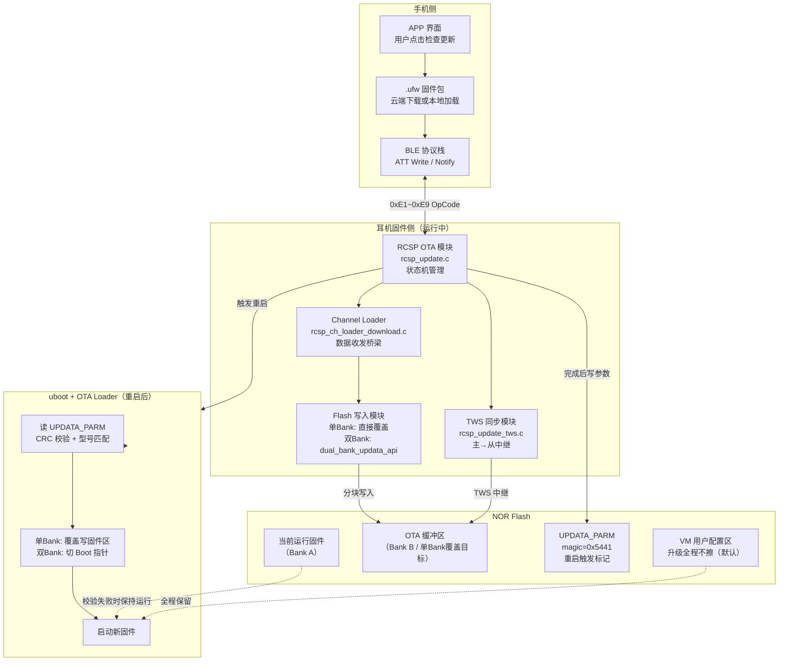

---

## 十三、面试高频追问

### Q1：BLE OTA 和普通 BLE 命令有什么本质区别？

> 普通命令是**同步控制**：APP 发一条、耳机执行一条、立即回 ACK，单包完成，设备继续正常运行。
>
> BLE OTA 是**异步数据流**：需要先握手初始化（`0xE2~0xE3`），然后进入循环分块传输状态机（`0xE5` 反复调用），中间要写 Flash、CRC 校验、TWS 中继，最后重启进 Loader 完成切换，整个过程可能持续数分钟。期间设备会关闭音频，BLE 参数切换为低延迟模式提升吞吐。

### Q2：双 Bank 的意义是什么？不用双 Bank 有什么风险？

> 双 Bank 解决"升级中断变砖"问题。新固件写入 Bank B 时 Bank A 旧固件完整保留，只有 Bank B 全部写完且 CRC 校验通过后，才在 UPDATA_PARM 里标记切换，Loader 重启时才真正切过去。中途断电、CRC 失败，Loader 都保持 Bank A。
>
> 单 Bank 方案逐扇区擦旧写新，中途断电就变砖，只能靠测试盒 / USB 线下恢复——消费者拿到手里的耳机不能这么做，所以消费电子一般选双 Bank。

### Q3：TWS 两颗耳机如何保证同时升级？

> 从耳没有独立 BLE 连接，只能靠主耳中继：主耳收到固件块 → 先写自己的 Flash → 再调 `tws_ota_data_send_m_to_s()` 发给从耳 → 等从耳写完回执 → 才向 APP 发 ACK。
>
> 校验阶段两耳分别独立 CRC 校验，任一失败就 `SYNC_CMD_UPDATE_ERR` 同步终止，**双耳要么同时成功，要么同时回滚**，不会出现版本不一致导致 TWS 连不上的情况。

### Q4：OTA 期间为什么要关闭音频？

> OTA 写 Flash 是高 I/O 操作，与 DSP 音频实时处理存在资源竞争（Flash 总线、CPU 时间）：① 避免音频播放干扰 Flash 写入时序；② 释放 CPU/内存给数据传输状态机；③ 降低功耗，减少升级过程中因低电中断的概率。

### Q5：VM 区在 OTA 中起什么作用？

> VM 区存储用户配置（EQ/音量/ANC 模式/按键映射等），OTA 时**默认不擦除**（由 `CONFIG_VM_OPT=1` 控制）。这保证了升级后用户不需要重新设置所有偏好，同时 VM 内部有双备份机制，就算升级中断也不会丢配置。
>
> 如果特殊情况需要强制重置（如结构体字段不兼容），才把 `CONFIG_VM_OPT` 改为 0，但量产版本几乎永远保持 1。

### Q6：固件版本比对在哪里做？APP 侧还是耳机侧？

> 两侧都做，各自负责不同层面：
> - **APP 侧**：发 `0xE1` 读设备当前版本，与 `.ufw` 文件头比对，UI 决定是否提示用户升级。还需校验 `PRODUCT_INFO_NOT_MATCH`，芯片型号不符直接拒绝发起升级。
> - **耳机侧（`0xE2` 响应）**：收到 APP 传来的新版本信息，与 Flash 里当前版本比对，版本相同返回 `UPDATE_FLAG_FW_INFO_CONSISTENT`，拒绝重复升级。

---

## 十四、核心概念速记

| 概念 | SDK / 日志对应 | 一行记忆 |
|------|-------------|---------|
| **uboot** | `uboot.boot`，Flash 最低地址 | 第一段代码，读 UPDATA_PARM 决定跳 App 还是跳 Loader |
| **OTA Loader** | `ota.bin`，嵌入固件包 | 多合一升级驱动，负责实际写 Flash 和校验 |
| **UPDATA_PARM** | `update.h`，Flash 固定地址 | magic=0x5441 = 有升级任务，重启触发标记 |
| **VM 区** | `0xa8000` 起，344KB（日志示例） | 用户配置掉电保存，内部双备份，升级默认不擦 |
| **BTIF 区** | `0xfe000` 起，4KB | 蓝牙配对信息，升级默认不擦，保证重连 |
| **双 Bank** | `dual_bank_updata_api.h` | 写 B 不碰 A，失败永远能跑 A，不变砖 |
| **OTA OpCode** | `0xE1~0xE9` in RCSP | 与业务命令共用通道，靠 OpCode 区分 |
| **TWS 中继** | `tws_ota_data_send_m_to_s()` | 主耳是中转站，从耳靠 TWS 链路收固件 |
| **VM_OPT** | `CONFIG_VM_OPT=1` | 1=升级不擦 VM，0=擦，量产永远用 1 |
| **BTIF_OPT** | `CONFIG_BTIF_OPT=1` | 1=升级不擦配对信息，0=擦，量产永远用 1 |
