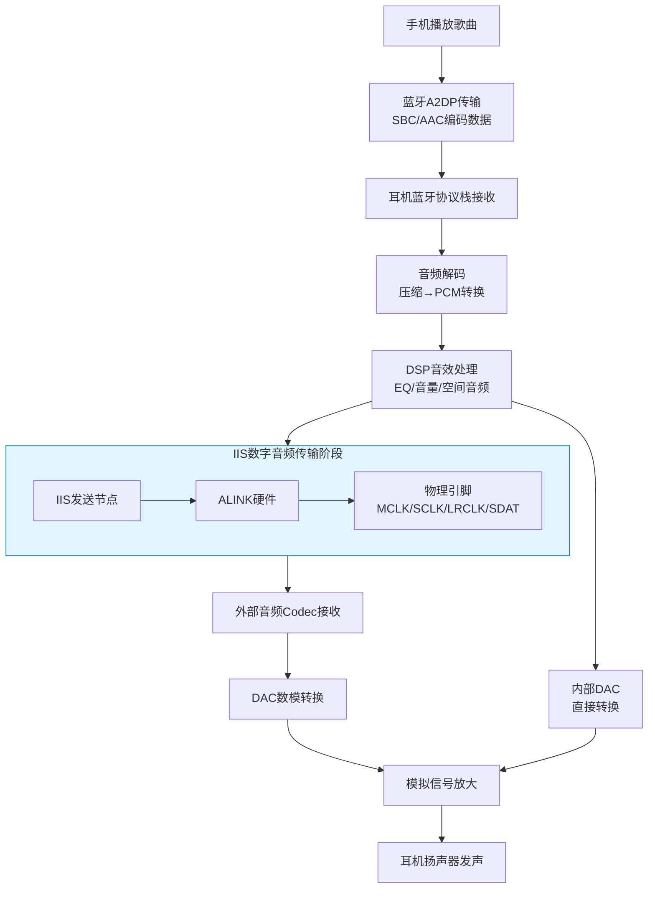
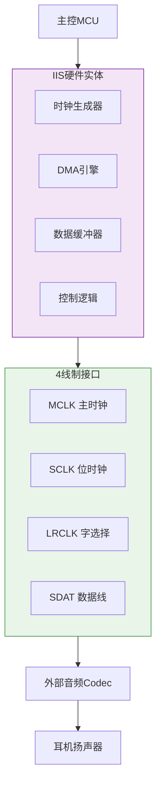
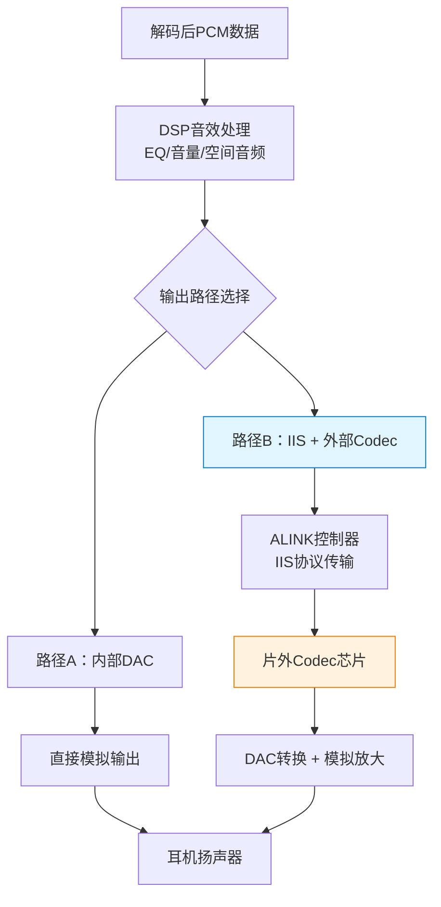
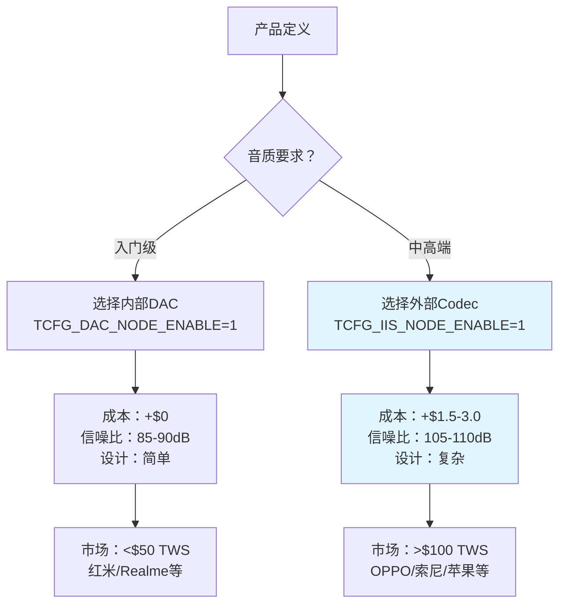

# IIS在TWS耳机音频播放流程中的作用

## 概述
IIS（Inter-IC Sound，内部IC声音总线）是专门为音频数据传输设计的数字音频总线协议。在TWS耳机中，IIS在音频处理流程的**后端输出阶段**发挥作用，负责将处理完成的数字PCM音频数据传输到数模转换器（DAC）。

**硬件实现特点**：在JL709N等TWS耳机芯片中，IIS功能由专用的**ALINK（音频链路）硬件控制器**实现，这是芯片内置的音频专用外设，不能通过软件模拟。

## 整体音频播放流程



## 详细阶段说明

### 阶段1：数据接收（蓝牙协议层）
- **位置**：手机 → 耳机
- **内容**：A2DP压缩音频数据（SBC/AAC编码）
- **协议**：蓝牙经典或低功耗蓝牙
- **特点**：无线传输，有压缩和数据包

### 阶段2：音频解码
- **位置**：蓝牙协议栈内部
- **内容**：压缩音频 → PCM原始数据
- **参数**：16kHz/44.1kHz/48kHz采样率，16/24bit位深度
- **输出**：原始PCM数字音频流

### 阶段3：音频处理（DSP）
- **位置**：音频处理框架（JLStream）
- **处理节点**：
  - 重采样器（SRC）
  - 均衡器（EQ）
  - 音量控制
  - 空间音频/ANC降噪
- **输出**：处理后的PCM数字音频

### 阶段4：**IIS数字音频传输**
```
数字PCM数据 → IIS节点 → ALINK硬件 → 物理引脚 → 外部Codec
```
- **时机**：所有数字处理完成后，数模转换前
- **作用**：高质量、低延迟传输PCM音频
- **内容**：纯粹的PCM样本（左/右声道交替）
- **无协议封装**：直接传输音频数据

### 阶段5：数模转换
- **方案A（使用IIS）**：
  ```
  IIS数据 → 外部Codec接收 → DAC转换 → 模拟输出
  ```
  - **优点**：高品质音频，专业Codec芯片
  - **硬件**：需外部音频Codec（如WM8978、ES8311）

- **方案B（无IIS）**：
  ```
  内部DAC直接转换 → 模拟输出
  ```
  - **优点**：成本低，集成度高
  - **现状**：大多数TWS耳机采用此方案

### 阶段6：模拟放大与输出
- 功率放大器驱动扬声器
- 最终转换为声波

## IIS的硬件实体架构



### ALINK控制器：IIS的硬件实体（以JL709N为例）

**结论**：在JL709N芯片中，IIS通信完全由**ALINK（音频链路）硬件控制器**实现，这是芯片专用的音频外设，不能像UART那样软件模拟。

#### 1. ALINK硬件寄存器映射
```c
// ALINK控制器寄存器结构体（br52.h:1327-1352）
typedef struct {
    __RW __u16 CON0;     // 控制寄存器0：使能、时钟配置
    __RW __u16 CON1;     // 控制寄存器1：通道模式选择
    __RW __u16 CON2;     // 控制寄存器2：中断控制
    __RW __u32 CON3;     // 控制寄存器3：采样率、位宽配置
    __RW __u32 CON4;     // 控制寄存器4：软件静音控制
    __RW __u32 ADR0;     // 通道0 DMA地址
    __RW __u32 ADR1;     // 通道1 DMA地址
    __RW __u32 ADR2;     // 通道2 DMA地址
    __RW __u32 ADR3;     // 通道3 DMA地址
    __RW __u16 LEN;      // DMA缓冲区长度
    __RW __u32 PNS;      // PNS（Packet Number Size）寄存器
    __RW __u32 HWPTR0;   // 硬件指针0（当前DMA位置）
    __RW __u32 HWPTR1;   // 硬件指针1
    __RW __u32 HWPTR2;   // 硬件指针2
    __RW __u32 HWPTR3;   // 硬件指针3
    __RW __u32 SWPTR0;   // 软件指针0（CPU处理位置）
    __RW __u32 SWPTR1;   // 软件指针1
    __RW __u32 SWPTR2;   // 软件指针2
    __RW __u32 SWPTR3;   // 软件指针3
    __RW __u32 SHN0;     // SHN寄存器0
    __RW __u32 SHN1;     // SHN寄存器1
    __RW __u32 SHN2;     // SHN寄存器2
    __RW __u32 SHN3;     // SHN寄存器3
    __RW __u32 BLOCK;    // 块寄存器
} JL_ALNK_TypeDef;

#define JL_ALNK0_BASE (as_base + map_adr(0x06, 0x00))  // 基地址：0x0600
#define JL_ALNK0 ((JL_ALNK_TypeDef *)JL_ALNK0_BASE)    // ALINK0实例
```

#### 2. IIS模式配置枚举
```c
// ALINK工作模式（audio_link.h:102-116）
typedef enum {
    ALINK_MD_BASIC      = 0u,  // 基础模式（支持IIS）
    ALINK_MD_DSP_SHORT,        // DSP短帧模式
    ALINK_MD_DSP_LONG,         // DSP长帧模式
} ALINK_MODE;

// 通道模式配置
typedef enum {
    ALINK_CH_MD_NONE          = 0u,
    ALINK_CH_MD_BASIC_IIS     = 1,  // 通道配置为IIS模式
    ALINK_CH_MD_BASIC_LALIGN  = 2,  // 左对齐模式
    ALINK_CH_MD_BASIC_RALIGN  = 3,  // 右对齐模式
    ALINK_CH_MD_DSP0          = 1,  // DSP0模式
    ALINK_CH_MD_DSP1          = 2,  // DSP1模式
} ALINK_CH_MODE;
```

#### 3. 关键控制寄存器宏定义
```c
#define ALINK_SEL(module, reg) (((JL_ALNK_TypeDef *)(((u8 *)JL_ALNK0) + module*(0)))->reg)

// 使能控制
#define ALINK_EN(module, x)        SFR(ALINK_SEL(module, CON0), 11, 1, x)
// 采样率配置：LRCLK = SCLK / (x+1)
#define ALINK_LRCK_PRD_SET(module, x) SFR(ALINK_SEL(module, CON3), 8, 9, x)
// 通道方向配置：0=输入，1=输出
#define ALINK_CHx_DIR_MODE(module, ch, x) SFR(ALINK_SEL(module, CON1), 2+3*ch, 1, x)
```

### 信号时序
```
时序图示例：
MCLK:  __|‾‾|__|‾‾|__|‾‾|__|‾‾|__  (主时钟，通常12.288MHz)
SCLK:  _|‾‾‾|__|‾‾‾|__|‾‾‾|__|‾‾  (位时钟，数据速率)
LRCLK: |‾‾‾‾‾‾‾‾‾‾‾‾|______________|  (左/右声道选择)
SDAT:  [左声道数据][右声道数据][左声道数据]...
```

## JL709N SDK中的实际配置

### 默认配置（大多数TWS耳机）
```c
// 禁用IIS，使用内部DAC
#define TCFG_IIS_NODE_ENABLE              0     // IIS节点禁用
#define TCFG_DAC_NODE_ENABLE              1     // DAC节点启用
#define TCFG_IIS_ENABLE                   DISABLE_THIS_MOUDLE

// 音频输出配置
#define TCFG_AUDIO_OUTPUT_IIS             (DISABLE && TCFG_IIS_ENABLE)
#define TCFG_IIS_OUTPUT_DATAPORT_SEL      ALINK_CH0
```

### IIS启用时的代码流程
```c
// 1. 音频管道配置
player->stream = jlstream_pipeline_parse(uuid, NODE_UUID_IIS0_TX);

// 2. IIS硬件初始化
struct alink_param params = {
    .module_idx = 0,
    .bit_width = 0,      // 16bit
    .sr = 16000,         // 采样率
    .dma_size = 1024,    // DMA缓冲区
};
void *iis_hdl = audio_iis_init(params);

// 3. 启动IIS传输
audio_iis_open(iis_hdl, 0);   // 打开通道0
audio_iis_start(iis_hdl);     // 启动硬件
```

### ALINK参数配置详解
```c
// ALINK参数结构体（audio_link.h:173-194）
typedef struct _ALINK_PARM {
    ALINK_PORT module;           // 模块：ALINK0
    u8 mclk_io;                  // MCLK IO输出配置
    u8 sclk_io;                  // SCLK IO输出配置
    u8 lrclk_io;                 // LRCLK IO输出配置
    struct alnk_hw_ch ch_cfg[4]; // 4个通道配置
    ALINK_MODE mode;             // 模式：ALINK_MD_IIS
    ALINK_ROLE role;             // 角色：主机/从机
    ALINK_CLK_MODE clk_mode;     // 时钟边沿模式
    ALINK_DATA_BW bitwide;       // 数据位宽：16/24/32bit
    ALINK_SLOT_NUM slot_num;     // slot数量：1-8
    u32 dma_len;                 // DMA缓冲区长度
    ALINK_SR sample_rate;        // 采样率
    ALINK_BUF_MODE buf_mode;     // 缓冲区模式：乒乓/循环
    // ... 其他参数
} ALINK_PARM;

// 典型IIS配置示例（audio_alink_demo.c:51）
ALINK_PARM alink0_demo = {
    .mode = ALINK_MD_IIS,                    // IIS模式
    .role = ALINK_ROLE_MASTER,               // 主模式
    .clk_mode = ALINK_CLK_FALL_UPDATE_RAISE_SAMPLE, // 下降沿更新，上升沿采样
    .bitwide = ALINK_BW_16BIT,               // 16位数据
    .slot_num = ALINK_SLOT_NUM2,             // 2个slot（立体声）
    .sample_rate = ALINK_SR_16000,           // 16kHz采样率
    .ch_cfg[0] = {
        .dir = ALINK_DIR_TX,                 // 发送方向
        .ch_mode = ALINK_CH_MD_BASIC_IIS,    // 通道配置为IIS模式
    },
};
```

### 音频节点UUID定义
```c
#define NODE_UUID_IIS0_TX           0x69A5    // IIS发送节点
#define NODE_UUID_IIS0_RX           0x69A6    // IIS接收节点
#define NODE_UUID_MULTI_CH_IIS0_TX  0x6A2D    // 多通道IIS发送
```

## 与其他通信总线的对比

| 总线协议 | 专用性 | 传输内容 | 硬件实现（以JL709N为例） | 在TWS耳机中的应用 |
|---------|--------|----------|--------------------------|------------------|
| **IIS** | **专用音频** | PCM音频数据 | **ALINK控制器**<br/>专用音频硬件，不能软件模拟 | 连接外部Codec，高品质音频输出 |
| SPI | 通用数据 | 任意二进制数据 | SPI控制器<br/>可软件模拟但效率低 | Flash存储、屏幕显示 |
| I2C | 通用控制 | 控制命令/寄存器 | I2C控制器<br/>可软件模拟（Bit-banging） | 传感器控制、EEPROM访问 |
| UART | 通用串行 | 异步数据流 | UART控制器<br/>可软件模拟但精度差 | 调试输出、AT指令通信 |
| USB | 通用高速 | 多种数据类型 | USB控制器<br/>必须硬件实现 | USB Audio、固件升级 |

### 硬件实现关键区别
1. **IIS必须硬件实现**：音频对时序要求严格（μs级抖动），软件模拟无法保证音质
2. **ALINK专用性**：针对音频优化，包含时钟生成器、DMA引擎、缓冲区管理
3. **配置复杂性**：IIS需要配置采样率、位宽、时钟边沿、主从模式等参数
4. **实时性要求**：音频流必须连续、低延迟，硬件DMA确保数据传输不中断

## 内部DAC与外部Codec的成本-性能权衡

### 音频输出路径决策
在TWS耳机设计中，处理后的PCM音频数据有两种输出方案：



### JL709N SDK中的配置选择

#### 默认配置（大多数TWS耳机 - 成本优先）
```c
// jlstream_node_cfg.h:63
#define TCFG_DAC_NODE_ENABLE      1  // 启用内部DAC
#define TCFG_IIS_NODE_ENABLE      0  // 禁用IIS输出

// 内部DAC配置（sdk_config.h）
#define TCFG_AUDIO_DAC_CONNECT_MODE    DAC_OUTPUT_MONO_L  // 单声道输出
#define TCFG_AUDIO_DAC_MODE            DAC_MODE_DIFF      // 差分输出
#define TCFG_AUDIO_DAC_LDO_VOLT        2                  // 基础供电
```

#### 高端配置（启用外部Codec - 音质优先）
```c
#define TCFG_DAC_NODE_ENABLE      0  // 禁用内部DAC
#define TCFG_IIS_NODE_ENABLE      1  // 启用IIS输出
#define TCFG_IIS_ENABLE           ENABLE_THIS_MOUDLE
// 需要连接外部Codec芯片（如WM8978、ES8311）
```

### 性能指标对比

| 参数 | 内部DAC（JL709N集成） | 外部Codec（WM8978典型） | 性能提升 |
|------|----------------------|------------------------|----------|
| **信噪比(SNR)** | 85-90dB | 105-110dB | **+20dB** |
| **总谐波失真(THD+N)** | 0.05-0.1% | 0.001% | **低50倍** |
| **动态范围(DR)** | 90dB | 110dB | **+20dB** |
| **采样率支持** | 最高48kHz | 8-192kHz | 支持高清音频 |
| **位宽支持** | 16/24bit | 16/24/32bit | 真32位支持 |
| **输出功率** | 20mW@16Ω | 40mW@16Ω | **+100%** |
| **硬件功能** | 软件EQ（消耗CPU） | 硬件5段EQ、DRC、限幅器 | 硬件加速 |

### 成本差异分析

#### BOM（物料清单）成本增加
```
外部Codec方案额外需要：
1. Codec芯片本身：$0.5-$2.0（WM8978/ES8311等）
2. 外围电路：电源滤波电容（4-6颗）
3. 音频耦合电容（2-4颗）  
4. 参考电压电路（1-2颗）
5. PCB面积增加：~4×4mm

总成本增加：$1.5-$3.0（取决于Codec选型）
```

#### 设计复杂度成本
- **布局难度**：音频模拟部分需要与数字部分隔离，防止噪声耦合
- **调试时间**：IIS时序调试 + Codec寄存器配置（增加1-2天）
- **测试成本**：音频性能测试（THD+N、信噪比等）更复杂

### 商业决策树



### 关键技术要点澄清

#### 1. **"直接传输"的误解**
- **误解**：PCM数据可以"直接"给外部Codec，不需要协议
- **事实**：必须通过物理引脚 + 通信协议（IIS）传输
- **技术本质**：IIS是数字音频的"物理专线"，不是可选附件

#### 2. **内部DAC vs 外部Codec的核心区别**
```
内部DAC：芯片设计中的"够用级"音频输出
          （集成工艺妥协，性能有限）
          
外部Codec：音频专家的"专业级"解决方案  
          （专门优化，性能极致）
          
IIS：连接两者的"数字音频专线"
     （必须的传输通道，不是替代关系）
```

#### 3. **行业现状与趋势**
- **90%的TWS耳机**：使用内部DAC（成本优先策略）
- **10%的高端TWS**：使用IIS+外部Codec（音质优先策略）  
- **发展趋势**：随着消费者对音质要求提高，外部Codec渗透率逐年上升
- **技术演进**：从SBC基础音质 → LDAC/高清音频 → 空间音频/头部追踪

### 面试回答要点

#### 当被问到"为什么选择IIS+外部Codec？"
> "这是音质与成本的精准权衡。内部DAC集成度高、成本为零增量，适合入门产品。但外部Codec在信噪比（高20dB）、失真度（低50倍）、输出功率等方面优势明显。在高端TWS中，用户愿意为音质体验付费，增加$1.5-3.0成本换取Hi-Fi级音频是合理的商业决策。"

#### 当被问到"如何做技术选型决策？"
> "在JL709N项目中，我们根据产品定位决策：
> 1. **成本敏感型**：用`TCFG_DAC_NODE_ENABLE=1`，内部DAC直出
> 2. **音质优先型**：用`TCFG_IIS_NODE_ENABLE=1`，配WM8978等外部Codec
> 3. **决策依据**：BOM成本增加$1.5-3.0 vs 性能提升SNR 90dB→110dB，THD 0.05%→0.001%
> 4. **实际数据**：通过音频分析仪测试验证，外部Codec方案音质提升可明显被用户感知"

## 面试要点总结

### 1. **IIS的作用时机**
- **位置**：数字音频处理的"最后一公里"
- **时机**：所有DSP处理完成后，DAC转换前
- **内容**：纯粹的PCM数字音频，无协议封装

### 2. **硬件依赖性**
- **需要**：MCU内置ALINK音频外设 + 外部Codec芯片
- **不需要**：纯软件协议栈，依赖底层硬件支持

### 3. **在TWS耳机中的实际应用**
- **常见方案**：内部DAC直接输出（成本低）
- **高端方案**：IIS + 外部Codec（音质好）
- **JL709N默认**：禁用IIS，使用内部DAC

### 4. **技术特点**
- **专用性**：仅为音频数据传输设计
- **时序要求**：严格时钟同步，低抖动
- **接口简单**：4线制（MCLK/SCLK/LRCLK/SDAT）
- **高品质**：支持24bit/192kHz高分辨率音频

### 5. **硬件实现特性**
- **专用硬件**：IIS由ALINK音频控制器实现，非通用外设
- **不可软件模拟**：音频时序要求严格（μs级），软件无法保证质量
- **完整硬件栈**：包含时钟生成、DMA引擎、缓冲区管理、中断控制
- **配置复杂性**：需配置采样率、位宽、主从模式、时钟边沿等参数

### 6. **调试与优化**
- **常见问题**：时钟不同步、数据错位、噪声干扰
- **调试工具**：逻辑分析仪抓取时序、音频分析仪测试频响
- **优化方向**：降低时钟抖动、优化DMA传输、电源噪声抑制

## 结论
IIS在TWS耳机音频播放流程中扮演着**数字音频传输桥梁**的角色，负责将处理完成的PCM音频数据高质量、低延迟地传输到数模转换器。虽然大多数TWS耳机为降低成本采用内部DAC方案而绕过IIS，但在高端产品中，IIS+外部Codec的组合仍是实现高保真音质的关键技术方案。

### 硬件实现要点
1. **ALINK专用控制器**：在JL709N等TWS耳机芯片中，IIS功能由专用的**ALINK（音频链路）硬件控制器**实现，而非通用外设
2. **不可软件模拟性**：由于音频对时序的严格要求（μs级抖动），IIS不能像UART/I2C那样通过软件模拟实现
3. **完整硬件栈**：ALINK控制器包含时钟生成器、DMA引擎、数据缓冲区、中断控制等完整音频硬件组件
4. **配置驱动模式**：软件通过配置ALINK_PARM参数结构体来驱动硬件，而非直接控制GPIO时序

**核心价值**：IIS通过专用硬件控制器实现了数字音频领域的"专线专用"，为高品质音频传输提供了物理层保障。这种硬件级优化确保了低延迟、高保真的音频体验，是专业音频设备不可或缺的组成部分。