# FreeRTOS的任务状态有哪一些？

FreeRTOS中任务主要有**4种状态**。

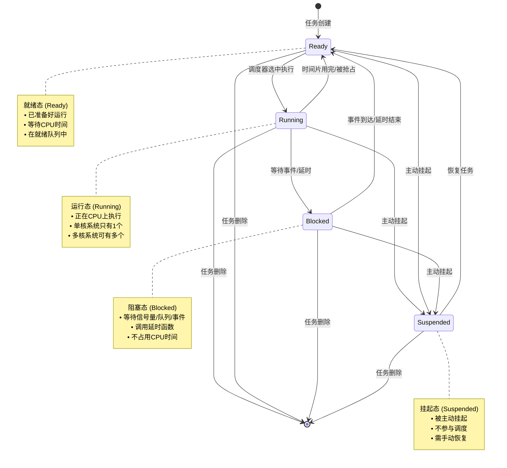

## 各状态详细说明

**1. 就绪态 (Ready)**

- 任务已经准备好运行，但CPU还在执行其他任务
- 任务在就绪队列中按优先级排队
- 等待调度器分配CPU时间

**2. 运行态 (Running)**

- 任务正在CPU上执行代码
- 单核系统同时只有一个任务处于运行态
- 拥有最高优先级的就绪任务会被选中运行

**3. 阻塞态 (Blocked)**

- 任务等待某个事件发生：
  - 等待信号量、互斥锁
  - 等待队列有数据
  - 调用延时函数（vTaskDelay）
- 阻塞期间不消耗CPU时间

**4. 挂起态 (Suspended)**

- 通过`vTaskSuspend()`主动挂起
- 完全不参与调度，除非调用`vTaskResume()`恢复
- 可以从任何状态挂起

## 典型状态转换场景

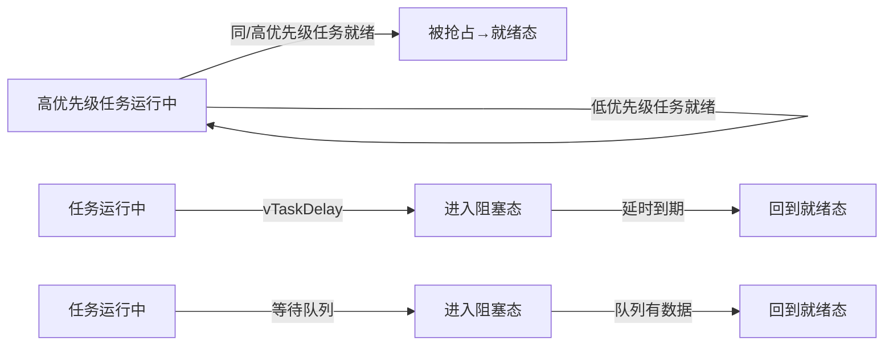

## 工作中的体现

在TWS耳机的SDK中，在app_task_loop任务中，进入到具体的一个蓝牙模式后，那么这个任务就进入到阻塞态了，因为他有一个获取消息队列消息的操作，当队列中没有消息时，他会持续在某一个地方等待而让出CPU，当有消息被从消息队列中拿到时，那么这个任务就从阻塞态进入到就绪态，又因为他是高优先级任务，所以立马往下执行进行消息分发并到具体的分支上处理达到实时效果。

```c
void app_main()
{
    task_create(app_task_loop, NULL, "app_core");

    os_start(); //no return
    while (1) {
        asm("idle");
    }
}
//一般任务里都是一个while 1
static void app_task_loop(void *p)
{
    struct app_mode *mode;

    mode = app_task_init();
    //sys_timer_add(NULL, test_printf, 2000);  //定时调试打印
#if CONFIG_FINDMY_INFO_ENABLE || (THIRD_PARTY_PROTOCOLS_SEL & REALME_EN)
#if (VFS_ENABLE == 1)
    if (mount(NULL, "mnt/sdfile", "sdfile", 0, NULL)) {
        log_debug("sdfile mount succ");
    } else {
        log_debug("sdfile mount failed!!!");
    }
#if (THIRD_PARTY_PROTOCOLS_SEL & REALME_EN)
    int update = 0;
    u32 realme_breakpoint = 0;
    if (CONFIG_UPDATE_ENABLE) {
        update = update_result_deal();
        extern int realme_check_upgrade_area(int update);
        realme_check_upgrade_area(update);
    }
#endif
#endif /* #if (VFS_ENABLE == 1) */

#else
    extern const int support_dual_bank_update_no_erase;
    if (support_dual_bank_update_no_erase) {
        if (0 == dual_bank_update_bp_info_get()) {
            norflash_set_write_protect_remove();
            dual_bank_check_flash_update_area(0);
            norflash_set_write_protect_en();
        }
    }
#endif

    //从这里开始就会进入到一个具体的模式，每一个模式下都是一个while 1 通过具体事件驱动来切换不同的模式
    while (1) {
        app_set_current_mode(mode);

        switch (mode->name) {
        case APP_MODE_IDLE:
            mode = app_enter_idle_mode(g_mode_switch_arg);
            break;
        case APP_MODE_POWERON:
            mode = app_enter_poweron_mode(g_mode_switch_arg);
            break;
        case APP_MODE_BT:
            mode = app_enter_bt_mode(g_mode_switch_arg);
            printf("----mode: %d\n", mode->name);
            break;
#if TCFG_APP_LINEIN_EN
        case APP_MODE_LINEIN:
            mode = app_enter_linein_mode(g_mode_switch_arg);
            break;
#endif
#if TCFG_APP_PC_EN
        case APP_MODE_PC:
            mode = app_enter_pc_mode(g_mode_switch_arg);
            break;
#endif
#if TCFG_APP_MUSIC_EN
        case APP_MODE_MUSIC:
            mode = app_enter_music_mode(g_mode_switch_arg);
            break;
#endif
        }
    }
}

//TWS一般是进入蓝牙模式
struct app_mode *app_enter_bt_mode(int arg)
{
    int msg[16];
    struct bt_event *event;
    struct app_mode *next_mode;

    bt_mode_init();

    while (1) {
        if (!app_get_message(msg, ARRAY_SIZE(msg), bt_mode_key_table)) {
            continue;
        }
        next_mode = app_mode_switch_handler(msg);
        if (next_mode) {
            break;
        }

        event = (struct bt_event *)(msg + 1);

        switch (msg[0]) {
#if TCFG_USER_TWS_ENABLE
        case MSG_FROM_TWS:
            bt_tws_connction_status_event_handler(msg + 1);
            break;
#endif
        case MSG_FROM_BT_STACK:
            bt_connction_status_event_handler(event);
#if TCFG_BT_DUAL_CONN_ENABLE
            bt_dual_phone_call_msg_handler(msg + 1);
#endif
            break;
        case MSG_FROM_BT_HCI:
            bt_hci_event_handler(event);
            break;
        case MSG_FROM_APP:
            bt_app_msg_handler(msg + 1);
            break;
        }

        app_default_msg_handler(msg);
    }

    bt_mode_exit();

    return next_mode;
}
```

### 图表分析

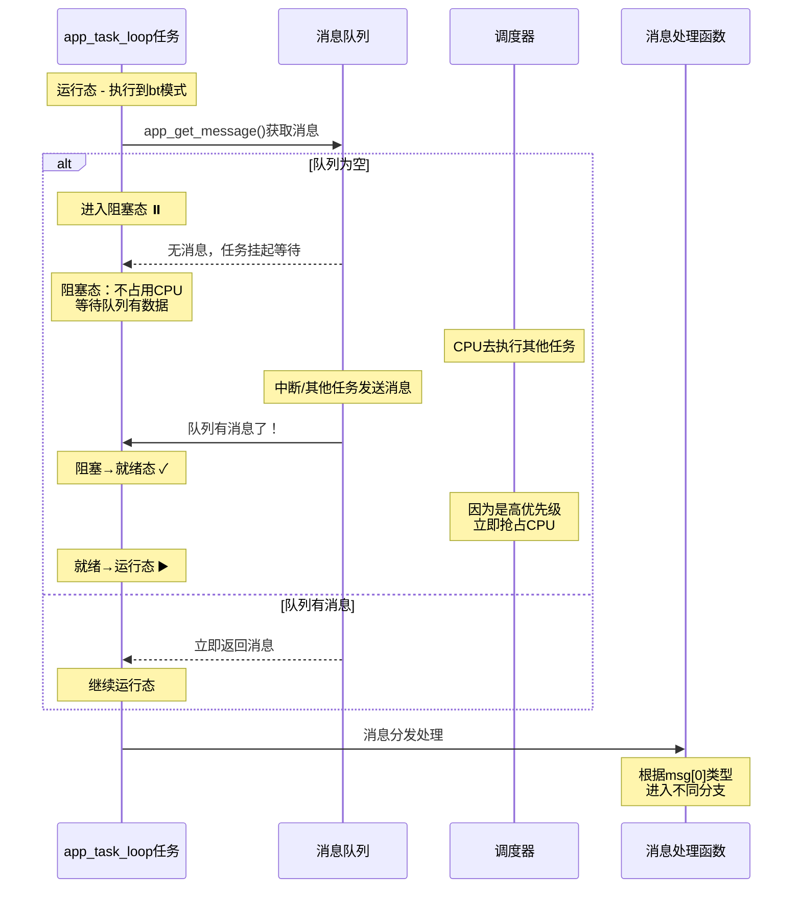

### 任务状态转换流程

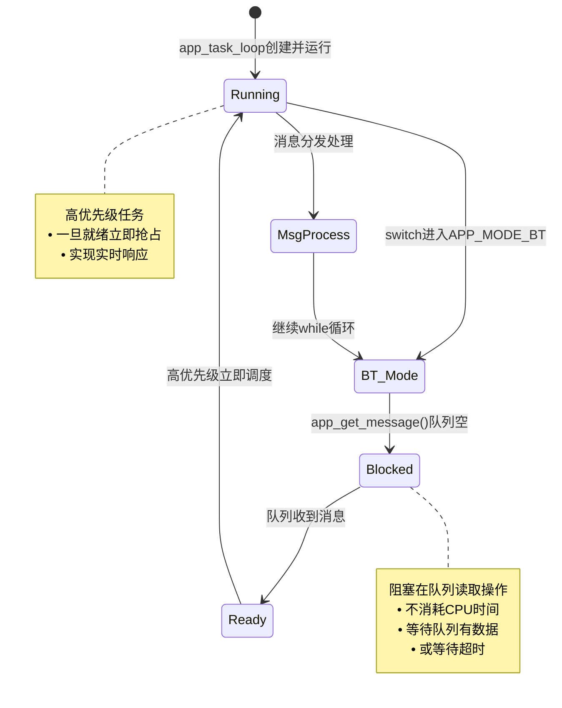

# FreeRTOS的调度方式有哪一些？

## 调度方式全景图

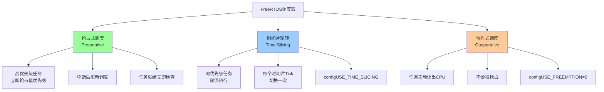

## 抢占式调度

这是FreeRTOS的**默认且最常用**的调度方式。

```mermaid
gantt
    title 抢占式调度示例
    dateFormat X
    axisFormat %L
    
    section CPU执行
    低优先级任务A(P2) :a1, 0, 30
    高优先级任务B(P5) :crit, a2, 30, 50
    低优先级任务A(P2) :a3, 50, 80
    
    section 事件
    任务B就绪 :milestone, 30, 30
    任务B完成 :milestone, 50, 50
```

- 高优先级任务就绪后会直接保存上下文并切换到运行态。

#### 抢占发生的时机

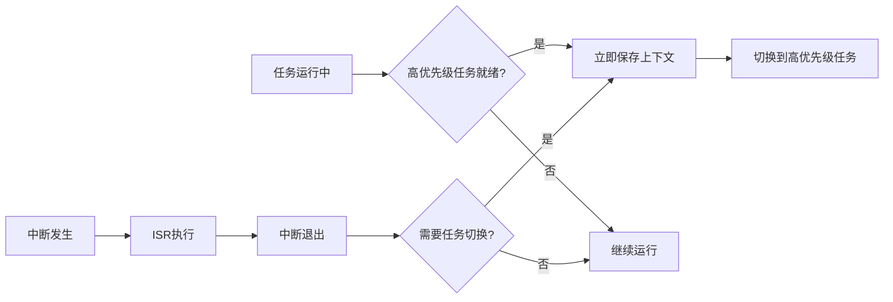

- 任务运行中，有高优先级任务就绪
- 中断执行完后，看是否有高优先级任务就绪。

## 时间片轮转

用于**同优先级**任务之间的调度。

```mermaid
gantt
    title 时间片轮转 - 同优先级任务(P3)
    dateFormat X
    axisFormat %L
    
    section CPU执行
    任务A :a1, 0, 10
    任务B :a2, 10, 20
    任务C :a3, 20, 30
    任务A :a4, 30, 40
    任务B :a5, 40, 50
    任务C :a6, 50, 60
    
    section Tick中断
    Tick :milestone, 10, 10
    Tick :milestone, 20, 20
    Tick :milestone, 30, 30
    Tick :milestone, 40, 40
    Tick :milestone, 50, 50
```

### 工作原理

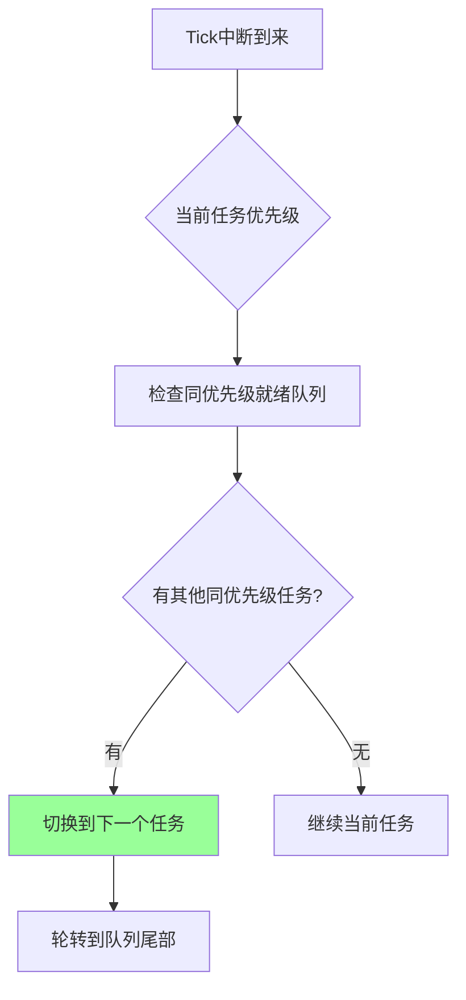

## 协作式调度

任务**主动让出CPU**，不会被抢占

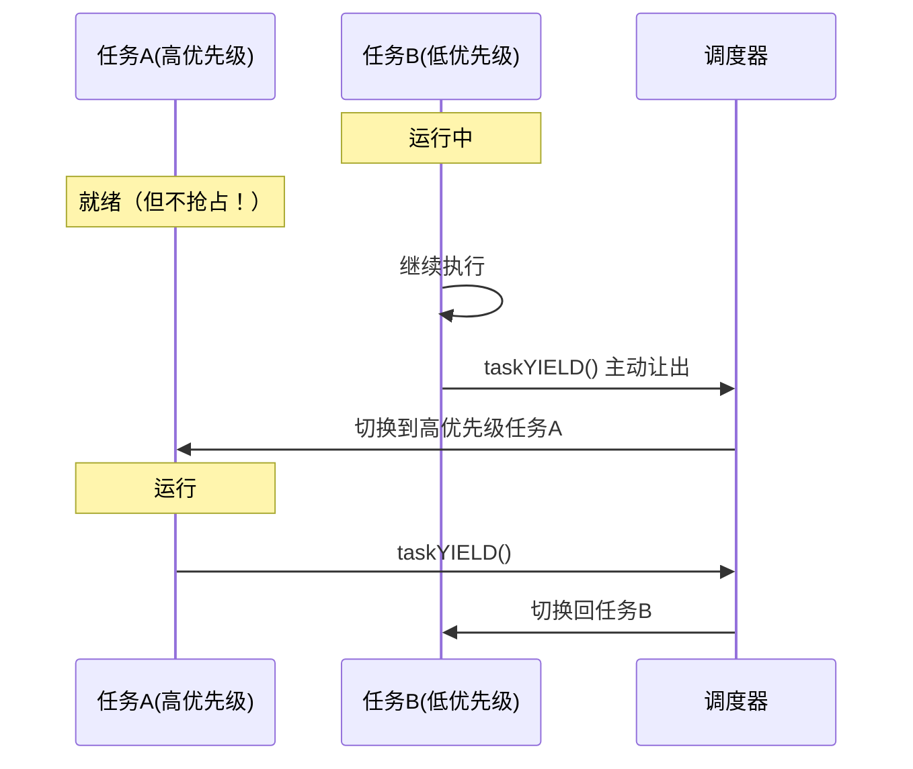

#### 使用场景（较少用）

- 系统简单，任务可控
- 需要避免抢占带来的复杂性
- 实时性要求不高

## 三种方式对比

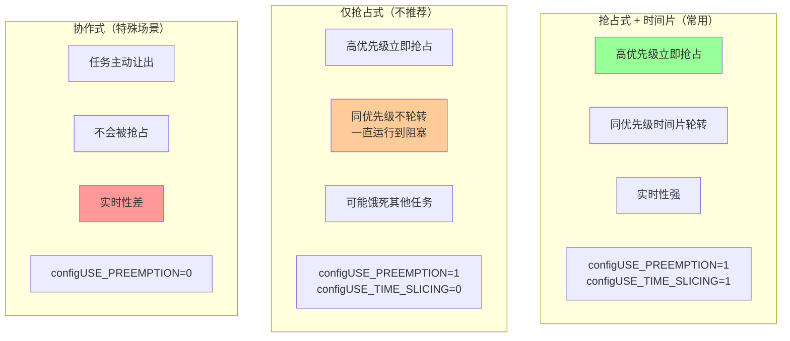

## 工作中体现

在TWS耳机的SDK中，在`app_main.c`中就会罗列各任务的优先级等各信息。

### TWS耳机任务优先级概览

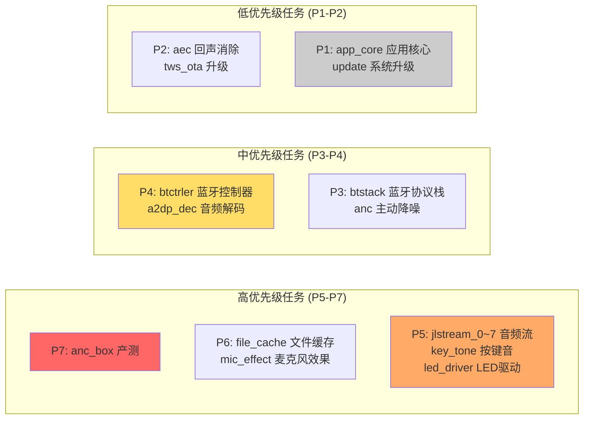

### 任务分类

| 优先级    | 任务类型      | 典型任务                                                  |
| --------- | ------------- | --------------------------------------------------------- |
| **P7**    | 最高优先级    | `anc_box`（产测，不能被打断）                             |
| **P5-P6** | 音频实时处理  | `jlstream_0~7`（8个音频流任务）、`key_tone`、`led_driver` |
| **P3-P4** | 蓝牙/音频核心 | `btctrler`、`btstack`、`a2dp_dec`                         |
| **P1-P2** | 应用/后台     | `app_core`、`update`、`aec`                               |

------

### 实际场景示例

#### 抢占式调度 - 听歌时按下按键

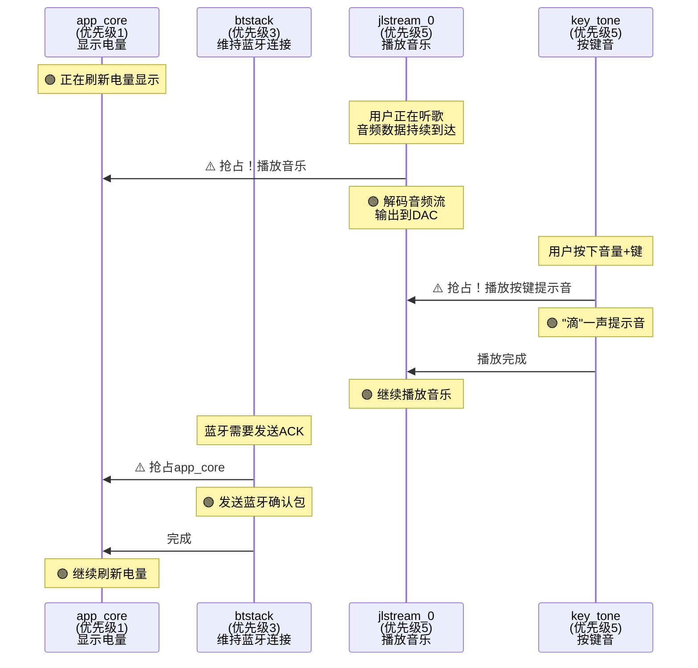

**实际发生的过程：**

1. **初始状态**：`app_core`(P1) 在显示电量图标
2. **音乐播放**：手机发来音频数据 → `jlstream_0`(P5) **抢占** `app_core`(P1) → 解码并播放音乐
3. **按键按下**：用户按音量+ → `key_tone`(P5) 与 `jlstream_0`(P5) 同优先级，插入播放提示音
4. **蓝牙维护**：需要回复ACK → `btstack`(P3) **抢占** `app_core`(P1) → 发送确认包
5. **回到低优先级**：高优先级任务都完成 → `app_core`(P1) 继续显示电量

#### 时间片轮转场景

其实这8个 `jlstream_0~7` 任务**不是同时都在工作的**，它们更像是一个**任务池**，用来处理不同的音频流任务。

你在用TWS耳机，同时发生了多件事

```mermaid
gantt
    title 多个音频源同时活跃时的时间片轮转
    dateFormat X
    axisFormat %L ms
    
    section CPU执行
    jlstream_0 播放音乐 :a1, 0, 1
    jlstream_1 播放导航语音 :a2, 1, 2
    jlstream_2 播放微信消息提示音 :a3, 2, 3
    jlstream_0 播放音乐 :a4, 3, 4
    jlstream_1 播放导航语音 :a5, 4, 5
    jlstream_2 播放微信消息提示音 :a6, 5, 6
    
    section Tick中断
    Tick :milestone, 1, 1
    Tick :milestone, 2, 2
    Tick :milestone, 3, 3
    Tick :milestone, 4, 4
```

**你正在做的事情：**

1. 🎵 **听网易云音乐** → `jlstream_0` 处理音乐流
2. 🗺️ **高德地图导航播报** → `jlstream_1` 处理导航语音
3. 💬 **微信来消息提示音** → `jlstream_2` 播放提示音

这三个音频流**同时存在**，都是优先级5，所以需要**时间片轮转**：

- `jlstream_0` 执行1ms：解码一小段音乐
- `jlstream_1` 执行1ms：播放"前方500米右转"
- `jlstream_2` 执行1ms：播放微信"咚咚"声
- 然后循环...

# FreeRTOS的内核对象有哪一些？

FreeRTOS 内核非常精简，**核心是 5 个文件**：

1. **`tasks.c`** 负责任务调度（抢占式/时间片轮转）
2. **`queue.c`** 实现队列，同时**信号量和互斥量都基于队列机制**
3. **`timers.c`** 提供软件定时器
4. **`list.c`** 是底层双向链表，任务就绪表和延迟表都靠它
5. **`heap_x.c`** 提供 5 种内存管理方案，**实际项目常用 heap_4**

高级功能还有事件组和流缓冲区，协程基本不用。

🔴 **核心三剑客（必须掌握）**

1. **`tasks.c`** → 任务管理与调度器
2. **`queue.c`** → 队列 + 信号量 + 互斥量（三合一实现）
3. **`timers.c`** → 软件定时器

🟡 **必要的支撑模块（你漏掉的）**

1. **`list.c`** → **双向链表**（任务就绪列表、延迟列表的底层实现）
2. **`heap_x.c`** → **内存管理**（heap_1 ~ heap_5 五种方案）

🔵 **高级功能（加分项）**

1. **`event_groups.c`** → 事件组（多任务同步）
2. **`stream_buffer.c`** → 流缓冲区（中断与任务通信）
3. **`croutine.c`** → 协程（Co-routine，极少用）

## 互斥量与信号量

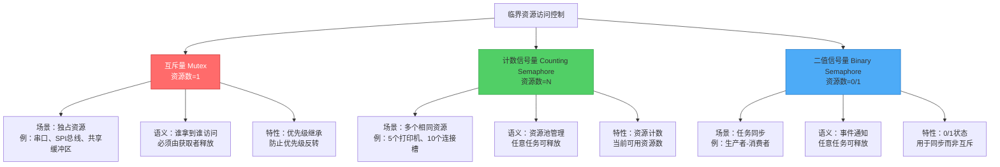

- 互斥量 = 1把钥匙，1个厕所
  - **关键特性：**
    - 🔑 **只有1把钥匙** - 资源数量=1
    - 🔒 **谁拿谁用** - 必须由获取者释放
    - ⏰ **按顺序排队** - FIFO或优先级队列
    - 🚫 **不能插队** - 除非有优先级继承
- 计数信号量 = N把钥匙，N个相同厕所
  - **关键特性：**
    - 🔑🔑🔑 **有N把钥匙** - 资源数量=N
    - 🔄 **任意人可还** - 不要求获取者释放
    - 📊 **实时计数** - 当前可用数量
    - ⚡ **并发访问** - N个任务同时使用

### 互斥量 - 独占串口资源

~~~c
SemaphoreHandle_t uart_mutex;

void uart_init() {
    // 创建互斥量 - 只有1个串口
    uart_mutex = xSemaphoreCreateMutex();
}

void task1(void *p) {
    while(1) {
        // 获取串口独占权
        xSemaphoreTake(uart_mutex, portMAX_DELAY);
        
        // 临界区：独占串口
        uart_send("Task1: Hello\n");
        vTaskDelay(10);
        
        // 必须由task1自己释放
        xSemaphoreGive(uart_mutex);
    }
}

void task2(void *p) {
    while(1) {
        xSemaphoreTake(uart_mutex, portMAX_DELAY);
        uart_send("Task2: World\n");
        xSemaphoreGive(uart_mutex);
    }
}
```

**输出：** 不会出现交错混乱
```
Task1: Hello
Task2: World
Task1: Hello
Task2: World
~~~

### 从哪里看出互斥量与信号量是基于队列的？

#### 创建函数都在 queue.c 中

```c
// queue.c 文件中

// 队列创建
QueueHandle_t xQueueCreate(UBaseType_t uxQueueLength, 
                           UBaseType_t uxItemSize);

// 信号量创建（在queue.c中实现）
#if (configUSE_COUNTING_SEMAPHORES == 1)
QueueHandle_t xQueueCreateCountingSemaphore(UBaseType_t uxMaxCount, 
                                             UBaseType_t uxInitialCount)
{
    QueueHandle_t xHandle;
    
    // ← 关键！调用xQueueGenericCreate创建队列
    xHandle = xQueueGenericCreate(uxMaxCount, 
                                   queueSEMAPHORE_QUEUE_ITEM_LENGTH,  // 元素大小=0
                                   queueQueueTypeCounting);
    
    if (xHandle != NULL) {
        ((Queue_t *)xHandle)->uxMessagesWaiting = uxInitialCount;
    }
    
    return xHandle;
}
#endif

// 互斥量创建（在queue.c中实现）
#if (configUSE_MUTEXES == 1)
QueueHandle_t xQueueCreateMutex(const uint8_t ucQueueType)
{
    QueueHandle_t xNewQueue;
    
    // ← 关键！也是调用xQueueGenericCreate创建队列
    xNewQueue = xQueueGenericCreate(1,                    // 长度=1
                                     queueSEMAPHORE_QUEUE_ITEM_LENGTH,  // 元素大小=0
                                     ucQueueType);
    
    // 互斥量初始化为可用状态
    if (xNewQueue != NULL) {
        ((Queue_t *)xNewQueue)->u.xSemaphore.xMutexHolder = NULL;
        ((Queue_t *)xNewQueue)->uxQueueType = queueQUEUE_IS_MUTEX;
    }
    
    return xNewQueue;
}
#endif
```

#### 同一结构体的不同用途Queue_t

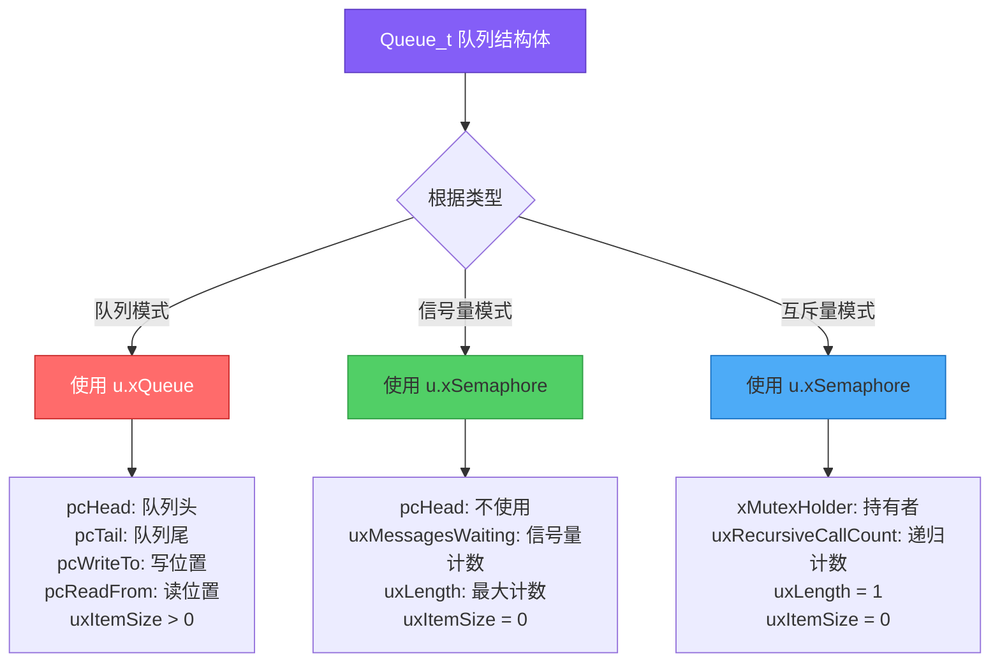

```c
// queue.c 中定义
typedef struct QueueDefinition  /* The old naming convention is used to prevent breaking kernel aware debuggers. */
{
    int8_t * pcHead;           // ← 指向队列存储区开始位置
    int8_t * pcWriteTo;        // ← 指向下一个写入位置
    
    union
    {
        QueuePointers_t xQueue;     // ← 用于队列
        SemaphoreData_t xSemaphore; // ← 用于信号量和互斥量
    } u;
    
    List_t xTasksWaitingToSend;     // ← 等待发送的任务列表
    List_t xTasksWaitingToReceive;  // ← 等待接收的任务列表
    
    volatile UBaseType_t uxMessagesWaiting;  // ← 当前队列中的消息数量
    UBaseType_t uxLength;           // ← 队列长度
    UBaseType_t uxItemSize;         // ← 每个元素的大小
    
    volatile int8_t cRxLock;        // ← 接收锁
    volatile int8_t cTxLock;        // ← 发送锁
    
    #if ((configSUPPORT_STATIC_ALLOCATION == 1) && (configSUPPORT_DYNAMIC_ALLOCATION == 1))
        uint8_t ucStaticallyAllocated;
    #endif
    
    #if (configUSE_QUEUE_SETS == 1)
        struct QueueDefinition * pxQueueSetContainer;
    #endif
    
    #if (configUSE_TRACE_FACILITY == 1)
        UBaseType_t uxQueueNumber;
        uint8_t ucQueueType;
    #endif
    
} xQUEUE;

typedef xQUEUE Queue_t;
```

**这个联合体的意思是：**

1. ✅ `xQueue` 和 `xSemaphore` **共享同一块内存空间**
2. ✅ **同一时刻只能使用其中一个**
3. ✅ 在同一个实例中，**二者不能同时存在**
4. ✅ 联合体的大小 = 最大成员的大小

#### 信号量和互斥量能基于队列实现的原因

```c
"信号量和互斥量能基于队列实现，核心原因是它们的本质操作是相同的：

【本质相同】
队列、信号量、互斥量的核心功能都是：
1. 尝试获取资源 - 成功就继续，失败就阻塞等待
2. 释放资源 - 唤醒等待的任务
3. 管理等待任务列表

队列：获取消息，没消息就阻塞
信号量：获取信号，没信号就阻塞  
互斥量：获取锁，锁被占用就阻塞

【区别只是语义】
- 队列传递数据（uxItemSize > 0，有存储区）
- 信号量只是计数（uxItemSize = 0，无存储区）
- 互斥量是特殊的二值信号量（加了优先级继承）

【为什么放在queue.c？】
因为它们共享同一套阻塞/唤醒机制：
- xTasksWaitingToReceive 链表管理等待任务
- 资源可用时从链表中唤醒任务
- 这套机制队列已经实现了，信号量和互斥量直接复用

【为什么用同一个结构体？】
用 union 区分不同用途：
- 队列需要 pcTail、pcReadFrom 管理数据
- 互斥量需要 xMutexHolder 记录持有者
- 二者互斥，用 union 节省内存

这就是 FreeRTOS 的设计哲学：一套代码实现三种同步原语，
既节省了ROM（代码空间），又节省了RAM（数据空间）。"
```

### 互斥量与信号量的区别

 互斥量是特殊的二值信号量，增加了所有权和优先级继承机制，专门用于互斥访问。

**所有权差异：**

- 互斥量：谁上锁谁解锁，有所有权概念
- 信号量：任何任务都能give/take，无所有权

**优先级继承：**

- 互斥量：支持优先级继承，防止优先级反转
- 信号量：不支持

**使用场景：**

- 互斥量：保护共享资源（如串口、全局变量）
- 二值信号量：任务间同步（如中断通知任务）
- 计数信号量：资源计数管理（如连接池）

#### **什么是优先级反转？**

假设有三个任务：

- **高优先级任务H**：需要访问共享资源
- **中优先级任务M**：不需要访问共享资源
- **低优先级任务L**：需要访问共享资源

**危险场景：**

1. L正在使用共享资源（已获取互斥量）
2. H就绪，想获取互斥量，但被L占用，**H被阻塞**
3. 此时M就绪，抢占L开始运行
4. 结果：**高优先级H被低优先级L间接阻塞，还要等中优先级M执行完**

这就是**优先级反转** —— 优先级关系被"反转"了。

##### **优先级继承如何解决？**

当使用互斥量时，FreeRTOS会自动处理：

1. L获取互斥量，正常运行
2. H尝试获取互斥量，发现被L持有
3. **系统自动将L的优先级临时提升到H的优先级**（继承）
4. M无法抢占L（因为L现在优先级等于H）
5. L快速完成，释放互斥量，**优先级恢复**
6. H获取互斥量继续运行

**为什么信号量不支持？**

因为信号量没有"所有权"概念，系统不知道是谁持有信号量，无法提升持有者的优先级。

## 工作中的体现

### TWS耳机的OS启动流程

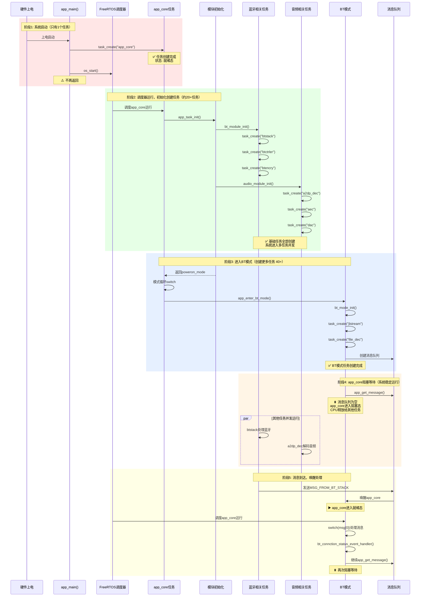

#### 任务状态转换详图

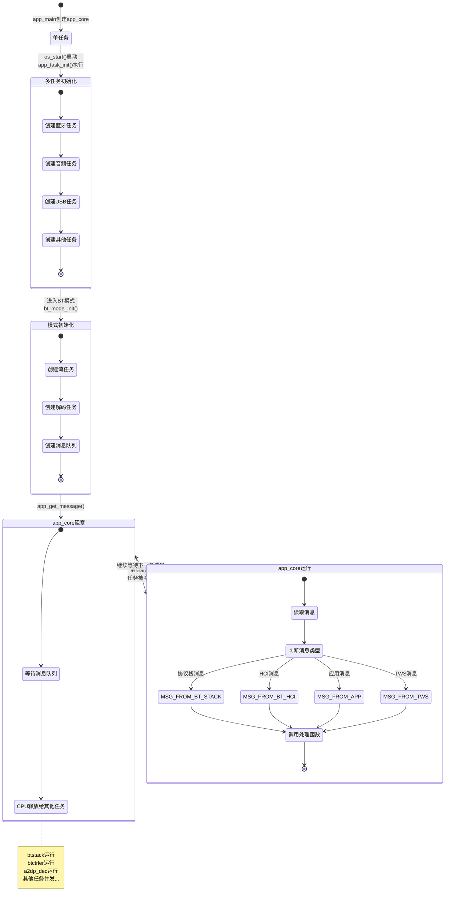

#### **任务管理原则**

- 任务是**独立调度实体**
- 由**调度器统一管理**
- 需要**显式删除**才会销毁
- 不存在**父子依赖关系**

在FreeRTOS中，**任务一旦被创建，就成为独立的调度实体**，与创建它的任务没有父子依赖关系。

### queue中队列的应用

消息队列是我们用得最多的场景。系统启动时，主任务app_core会在初始化各模块 时创建20多个子任务，比如btstack负责蓝牙协议栈、a2dp_dec负责音频解码。 进入BT模式后，还会创建jlstream、file_dec等模式专属任务，此时系统已经 有40多个任务在并发运行。 app_core任务会创建一个消息队列，然后调用app_get_message阻塞等待。 当其他任务有事件发生时，比如btstack检测到蓝牙连接，就会往这个消息队列 发送MSG_FROM_BT_STACK消息。app_core被唤醒后，通过switch-case分发消息， 调用对应的处理函数。处理完又回到阻塞态继续等待。这就是典型的消息事件驱动架构。

### queue中互斥量的应用

- 原来使用标志位锁，这里使用互斥量更加直观！

```c
// 全局或结构体中定义
SemaphoreHandle_t mode_switch_mutex;

// 初始化
void anc_init() {
    mode_switch_mutex = xSemaphoreCreateMutex();
}

// 使用
int anc_mode_switch(u8 mode, u8 tone_play)
{
    // 尝试获取互斥量，超时时间100ms
    if (xSemaphoreTake(mode_switch_mutex, pdMS_TO_TICKS(100)) != pdTRUE) {
        user_anc_log("anc mode switch lock\n");
        return -1;  // 获取失败，说明其他任务正在切换模式
    }
    
    // 临界区：执行模式切换
    anc_hdl->new_mode = mode;
    // ... 其他操作
    
    // 释放互斥量
    xSemaphoreGive(mode_switch_mutex);
    return 0;
}
```

## list.c 是隐藏的核心

FreeRTOS 的任务调度**完全依赖链表**：

- 就绪列表 `pxReadyTasksLists[]`
- 延迟列表 `xDelayedTaskList`
- 挂起列表 `xSuspendedTaskList`

**没有 list.c，任务调度器根本跑不起来**

### **链表 vs 队列：彻底区分**

| 对比项       | 链表（list.c）                    | 队列（queue.c）                   |
| ------------ | --------------------------------- | --------------------------------- |
| **用途**     | 任务状态管理                      | 任务间数据传递                    |
| **数据结构** | 双向循环链表                      | 环形缓冲区                        |
| **操作对象** | TCB（任务控制块）                 | 用户数据                          |
| **典型操作** | `vListInsert()`、`uxListRemove()` | `xQueueSend()`、`xQueueReceive()` |
| **示例**     | 任务从就绪→阻塞                   | 任务A发送消息给任务B              |

任务状态切换用的是 **`list.c` 的双向链表**，不是队列。FreeRTOS 为每种状态维护了独立的链表：

- 就绪态 → `pxReadyTasksLists[]` 数组（按优先级分层）
- 阻塞态 → `xDelayedTaskList` 延迟列表
- 挂起态 → `xSuspendedTaskList`

状态切换就是把 TCB 的链表节点从一个链表移到另一个链表。

**队列是用来做任务间通信的**，比如 `xQueueSend()` 发送数据，和状态管理是两回事。

### 为啥是双向链表不是单向？

任务 A 调用 `vTaskDelay(100)`

**状态切换过程**

- 运行态 → 阻塞态

**涉及的链表操作**

1. 从就绪链表中删除任务 A
2. 插入到延迟链表（阻塞态）
3. 调度器选择新的最高优先级任务运行

**初始状态**

```c
【运行态】
  pxCurrentTCB → [任务 A]  ← 当前正在 CPU 上运行

【就绪链表】（按优先级排序）
  End ⇄ [任务B:P5] ⇄ [任务A:P3] ⇄ [任务C:P1] ⇄ End
                      ↑
                   A 在就绪链表中

【延迟链表】（按唤醒时间排序）
  End ⇄ [任务D:100] ⇄ [任务E:200] ⇄ End
```

### 单向链表 vs 双向链表对比

```c
**A:**
> "以 `vTaskDelay()` 为例，任务从运行态切换到阻塞态，涉及两步链表操作：
>
> **第一步：从就绪链表删除任务**  
> - 单向链表必须遍历找前驱节点，O(n) 时间不确定  
> - 双向链表直接通过 `pxPrevious` 指针，O(1) 完成删除
>
> **第二步：插入延迟链表（按唤醒时间排序）**  
> - 两种链表都是 O(n)，需要遍历找插入位置
>
> **关键区别在删除**：任务唤醒可能在中断中发生（如定时器中断），必须保证 O(1) 的确定性时间。双向链表的删除操作固定只需 2 次指针修改，无论链表多长，时间都是常量。这是实时系统的硬性要求。"
```

## heap_x.c 决定内存分配策略

FreeRTOS 提供 5 种内存管理方案：

- **heap_1**：只分配不释放，适合静态系统
- **heap_2**：允许释放但有碎片，**已废弃**
- **heap_3**：封装标准库 malloc/free，有 libc 才能用。
- **heap_4**：首次适应算法 + 碎片合并，**工程最常用** 👍
- **heap_5**：heap_4  + 支持不连续内存区域，用于多 RAM 芯片

实际项目 **90% 用 heap_4**，因为它平衡了性能和碎片管理。

**heap_1 → heap_2 → heap_4**

这条线确实是递进关系：

- heap_1：只分配 → **问题：无法释放内存**
- heap_2：可以释放 → **问题：有碎片且无法合并**
- heap_4：可以释放+合并碎片 → **解决了heap_2的碎片问题** ✅

**但 heap_3 和 heap_5 不是"解决前者问题"**

**heap_3：**

- 不是为了解决heap_2的问题
- 它是为了**复用现有的libc实现**，适合已有malloc/free的平台
- 特点：依赖外部库，性能取决于libc实现

**heap_5：**

- 不是为了解决heap_4的问题
- heap_4已经很完善了
- heap_5是为了**特殊硬件场景**：芯片有多块不连续的RAM（如内部SRAM + 外部SDRAM）
- 功能上=heap_4 + 多内存区域支持

### **什么是首次适应？**

> "从空闲块链表头部开始遍历，找到**第一个足够大**的空闲块就分配，不继续找更合适的。"

~~~c
**场景**：分配 50 字节
```
空闲链表（从小到大排序）：
  xStart → [30B] → [80B] → [100B] → [200B] → pxEnd
            ↓       ↓
          太小   第一个够大的！← 就用这个

分配后：
  xStart → [30B] → [30B剩余] → [100B] → [200B] → pxEnd
                    ↑
                 80B 被分割：50B给用户，30B回链表
~~~

**关键点**：

- ✅ **不找最合适的**，只找第一个够大的
- ✅ **如果剩余空间够大**（> `heapMINIMUM_BLOCK_SIZE`），分割并回收剩余部分
- ⚠️ **时间复杂度 O(n)**，最坏遍历整个链表

### **什么是碎片合并？**

> "释放内存后，如果**出现连续的空闲内存空间**，就把它们**合并成一个大块**，再加入空闲链表。"

### 如何避免内存泄漏？

优先使用静态分配API，避免运行时频繁创建销毁：

**例子：** 比如创建队列时，我会用xQueueCreateStatic而不是xQueueCreate。静态方式在编译时就分配好内存，队列的缓冲区和控制块都用预定义的静态变量，生命周期和程序一致，根本不存在释放的问题，从源头避免了泄漏风险。

确保所有动态资源配对释放，特别注意错误分支：

比如在数据处理函数中，我用pvPortMalloc分配了缓冲区，除了正常流程最后要vPortFree释放，更要注意如果中间读取传感器失败了，在return之前也必须先释放内存。很多泄漏就是因为只关注了正常流程，忘记了错误分支的清理。

实际项目中，我倾向于启动时创建所有资源，运行时只做状态切换，从根本上避免泄漏风险：

**例子：** 具体做法是在系统初始化阶段一次性把所有任务、队列、信号量都用静态API创建好，运行过程中任务永不退出，只是通过信号量阻塞和唤醒来切换状态。这样整个系统运行期间没有任何create和delete操作，内存布局完全固定，泄漏问题从架构上就被杜绝了。

**但是我工作中使用的TWS耳机的SDK中，app_main.c中只创建了一个主任务，在主任务往下执行时，各模块初始化时再创建各类子任务。进入到具体模式时创建专属的子任务。然后主任务就会读取消息队列，无消息进入阻塞态，有消息就进行分发处理。这种运行时创建各任务是否符合内存泄漏预防的规范？**

```c
const struct task_info task_info_table[] = {
    {"app_core",   1, 0, 1024, 512 },
    {"btctrler",   4, 0, 512,  512 },
    // ... 所有任务编译时就定义好
};
```

**含义：**

- `const` 说明这是**编译时常量**
- 所有任务的**名称、优先级、栈大小都是预定义的**
- 运行时只是**按需激活**这些任务，而非malloc创建

我们TWS项目采用**预定义任务池 + 分阶段激活**的设计。所有可能用到的任务在编译时就通过一个const任务表定义好了，包括栈大小、优先级等参数。

系统启动时，只创建核心任务如蓝牙协议栈、主控任务等；当用户进入特定功能，比如播放音乐时，才从任务表中激活A2DP解码任务。这些任务一旦创建就**常驻运行**，模式切换时通过挂起/恢复来节能，而不是销毁重建。

这种设计的好处是：内存需求的**上限在编译时就确定了**，我们可以静态分析最坏情况下需要多少RAM；同时又保留了灵活性，不需要的功能不占内存。从内存安全角度看，它既避免了运行时动态分配的不确定性，又比完全静态分配更节省资源。

# FreeRTOS中的低功耗支持

## 系统架构图

```c
硬件层:
┌──────────────┐
│ 系统时钟源   │ (如 72MHz HSE)
│ (晶振/PLL)   │
└──────┬───────┘
       │
       ├────────────────────────┐
       │                        │
       ▼                        ▼
┌─────────────┐          ┌──────────────┐
│   驱动CPU   │          │  驱动SysTick │
│  执行指令   │          │   定时器     │
└─────────────┘          └──────┬───────┘
       │                        │
       │                   每1ms触发中断
       │                        │
       ▼                        ▼
┌──────────────────────┐  ┌─────────────┐
│  裸机程序代码        │  │ xTickCount++│ ← Tick计数
│  (while循环/中断等)  │  │   (1ms++)   │
└──────────────────────┘  └──────┬──────┘
                                 │
                                 ▼
                          ┌──────────────┐
                          │  FreeRTOS    │
                          │  任务调度    │
                          │  延时管理    │
                          └──────────────┘
```

## 系统时钟 (如72MHz)

```c
作用: 驱动CPU核心工作
频率: 很高 (MHz级别)
用途: 
  - CPU执行每一条指令
  - 外设工作 (UART、SPI、ADC等)
  - 内存访问
无论是否使用FreeRTOS,CPU都需要系统时钟!
```

## Tick (如1kHz = 1ms一次)

```c
作用: FreeRTOS的时间基准
频率: 较低 (通常100Hz-1000Hz)
用途:
  - 任务延时 vTaskDelay(100) → "等100个tick"
  - 任务调度 "每N个tick切换任务"
  - 超时管理 "最多等500个tick"
如果不用FreeRTOS,根本不需要Tick!
```

### SysTick(系统滴答定时器)的作用是什么?

> "SysTick是系统时钟经过分频后产生的周期性定时中断,它为FreeRTOS提供了时间基准。
>
> **硬件层面**:SysTick从系统时钟(如72MHz)分频得到期望的tick频率(如1kHz),每1ms产生一次中断。
>
> **软件层面**:每次中断里递增全局计数器xTickCount,这个计数器就是'系统时间'。
>
> **调度应用**:基于这个时间基准,FreeRTOS实现:
>
> 1. 任务延时 - vTaskDelay(500)会在tick增加500后唤醒
> 2. 超时管理 - 等待信号量最多N个tick
> 3. 时间片轮转 - 每N个tick切换同优先级任务
> 4. 周期任务 - vTaskDelayUntil保证严格周期
>
> 可以说,没有SysTick提供的时间基准,FreeRTOS的时间相关功能都无法实现。

FreeRTOS的时间基准**不一定要用SysTick**，可以用任何定时器，只要能提供周期性中断就行。但在实践中，**绝大多数情况用SysTick**。

## 低功耗支持

这个时候再来说Tickless Idle Mode(无滴答空闲模式) 应该就容易理解了： 因为系统滴答定时器被用于OS的时间基准，所以CPU会被定时器中断反复唤醒，要实现低功耗的话，这个反复唤醒问题要解决：

正常模式的矛盾

```c
FreeRTOS需要:
  系统滴答定时器 → 提供时间基准 → 每1ms中断一次
  
低功耗需要:
  CPU尽可能睡眠 → 减少唤醒次数 → 降低功耗
  
矛盾点:
  ┌─────────────────────────────────────┐
  │ 即使所有任务都在sleep(无事可做)  │
  │ CPU仍然每1ms被tick中断唤醒一次!  │
  └─────────────────────────────────────┘
```

功耗浪费分析

```c
场景: 所有任务都在vTaskDelay(5000)，5秒内无事可做

正常模式:
时间:    0ms--1ms--2ms--3ms--...-4999ms-5000ms
中断:    tick tick tick tick ... tick   tick
CPU:     唤醒  唤醒  唤醒  唤醒 ... 唤醒   唤醒
         ↓    ↓    ↓    ↓       ↓     ↓
      xTickCount++ (检查一圈发现还没到5000)
      然后重新睡眠 (但已经浪费了功耗!)

统计:
- 5秒内被唤醒 5000次
- 每次唤醒处理中断 ~200μs
- 总活跃时间 = 5000 × 200μs = 1秒
- CPU利用率 = 1/5 = 20% (实际没干任何有意义的事!)

功耗:
- 运行电流: 10mA
- 睡眠电流: 10μA
- 平均电流 = 10mA × 0.2 + 0.01mA × 0.8 = 2.008mA
```

问题本质

```c
// 每次tick中断都在做这个检查:
void xTaskIncrementTick(void)
{
    xTickCount++;  // 1, 2, 3, 4, ..., 4999
    
    // 检查延时队列
    if (最近要唤醒的任务时刻 == 5000) {
        // 还没到! 什么都不做
        // 但CPU已经被唤醒了,功耗已经浪费了!
    }
}

// 问题:
// 我们明知道5000ms之前不会有任务需要运行
// 为什么还要每1ms唤醒一次去检查?
// 能不能直接睡到5000ms那一刻?
```

### Tickless的解决方案

核心思想

```
与其每1ms醒来问一次"该干活了吗?"
不如算好"什么时候该干活"，睡到那时候再醒

正常模式 (傻瓜式):
├─tick─┤├─tick─┤├─tick─┤...├─tick─┤
  醒?    醒?    醒?  ...  醒!
  否     否     否   ...  是
  (浪费4999次唤醒)

Tickless模式 (聪明式):
├────────────sleep 5000ms─────────────┤醒!
                                      是
(只唤醒1次!)
```

实现机制

```c
void prvIdleTask(void *pvParameters)
{
    for (;;) {
        // 检查: 是否只有Idle任务在运行?
        if (所有用户任务都阻塞) {
            
            // === 第1步: 计算可以睡多久 ===
            TickType_t xExpectedIdleTime = prvGetExpectedIdleTime();
            
            // 遍历延时队列,找最近要唤醒的任务
            // 假设找到: TaskA在tick=5000时醒来
            // 当前tick=0
            // 可睡眠时间 = 5000 - 0 = 5000 ticks
            
            if (xExpectedIdleTime >= 2) {  // 太短就不值得睡了
                
                // === 第2步: 停止周期性tick ===
                SysTick->CTRL &= ~SysTick_CTRL_ENABLE_Msk;
                // 不再有1ms一次的中断了!
                
                // === 第3步: 配置一次性唤醒定时器 ===
                // 用RTC/LPTIM等，设置5000ms后触发中断
                RTC_SetWakeUpTimer(5000);
                
                // === 第4步: 进入深度睡眠 ===
                __WFI();  // CPU在这里睡眠
                
                // ========== 5秒后，RTC中断唤醒 ==========
                
                // === 第5步: 读取实际睡眠时长 ===
                uint32_t ulActualSleepTime = RTC_GetElapsedTime();
                // 假设正常睡满，ulActualSleepTime = 5000
                
                // === 第6步: 补偿tick计数 ===
                vTaskStepTick(5000);
                // xTickCount从0直接跳到5000 (时间快进!)
                // 内部检查延时队列，TaskA到期，移到就绪队列
                
                // === 第7步: 重启SysTick ===
                SysTick->CTRL |= SysTick_CTRL_ENABLE_Msk;
                // 恢复正常的1ms tick
            }
        }
        
        // 如果有任务就绪了，这里会触发调度切换
        portYIELD_WITHIN_API();
    }
}
```

#### 什么是Tickless模式？为什么需要它？

> "Tickless是FreeRTOS的低功耗优化机制。
>
> **问题根源**: FreeRTOS依赖系统滴答定时器(如SysTick)提供时间基准，通常每1ms产生一次tick中断。即使所有任务都在延时、系统完全空闲，CPU仍然每1ms被tick中断唤醒一次，处理完又睡眠。这导致大量无意义的唤醒和功耗浪费。
>
> **Tickless的解决方案**: 当系统进入空闲时:
>
> 1. 计算下次必须唤醒的时刻(遍历延时队列)
> 2. 停止周期性的SysTick中断
> 3. 用低功耗定时器(如RTC)设置一次性唤醒
> 4. CPU进入深度睡眠，直到定时器到期或其他中断唤醒
> 5. 醒来后读取实际睡眠时长，补偿tick计数
>
> **效果**: 将毫秒级的周期唤醒延长到秒级，中断次数减少几千倍，功耗降低几百到几千倍，是电池供电设备的关键优化技术。"

## 时间基准为啥不用系统时钟？

Free RTOS为啥不用系统时钟作为时间基准？因为太快了，所以可以经过分频用一个专属的定时器硬件来提供，如果要达到相同的效果的效果，使用系统时钟的话，就要进行大量的计算得到，而且还没有定时中断？

```c
系统时钟 (System Clock):
├─ 是什么: 驱动CPU执行指令的时钟源 (如72MHz)
├─ 特点: 连续的方波信号，没有"中断"概念
├─ 作用: 让CPU的每个时钟周期执行指令
└─ 比喻: 像心脏的跳动，一直在跳，不会主动通知你

定时器硬件 (如SysTick):
├─ 是什么: 基于系统时钟的计数器 + 比较器
├─ 特点: 计数到指定值时产生中断
├─ 作用: 提供周期性的"事件"(中断)
└─ 比喻: 像闹钟，到点了会响
```

### 系统时钟不会主动"通知"

```c
系统时钟的工作方式:
    ___     ___     ___     ___
___|   |___|   |___|   |___|   |___  (72MHz = 每13.9ns一个周期)
   1   0   1   0   1   0   1   0

这只是个持续振荡的信号，它不会:
- ❌ 产生中断
- ❌ 告诉你"1ms到了"
- ❌ 触发任何事件

就像时钟的秒针在转，但它不会主动提醒你
```

### 频率太快，无法直接作为OS调度基准

```c
假设直接用72MHz做时间基准:

每个时钟周期 = 1/72,000,000 ≈ 13.9纳秒

如果OS每个时钟周期检查一次任务:
void SystemClockHandler(void)  // 假设每13.9ns触发一次
{
    xTickCount++;  // 72,000,000次/秒
    
    // 检查延时队列
    if (任务需要唤醒) {
        // 处理...
    }
}

问题:
1. 中断太频繁: 每秒7200万次中断!
2. CPU全用来处理中断: 根本没时间干正事
3. 功耗爆炸: 中断处理本身就是功耗大户
4. 没有意义: OS不需要纳秒级的时间精度

结论: 不是"不能用"，而是"完全没必要且非常低效"
```

# 如何在FreeRTOS中实现定时任务？

## FreeRTOS中的任务分为两大类

```c
┌─────────────────────────────────────┐
│        FreeRTOS 任务分类            │
└─────────────────────────────────────┘

1. 周期性任务 (Periodic Task)
   - 有固定的时间间隔
   - 使用 vTaskDelay/vTaskDelayUntil
   - 例如: 每100ms采样一次传感器

2. 事件驱动任务 (Event-Driven Task)
   - 没有固定周期
   - 等待事件发生 (队列/信号量/通知)
   - 例如: 等待串口数据到来
```


```c
// 这是"定时任务" - 有固定周期
void vTaskSensor(void *pvParameters)
{
    TickType_t xLastWakeTime = xTaskGetTickCount();
    
    for (;;)
    {
        ReadSensor();  // 读传感器
        
        // 每100ms执行一次 (周期性)
        vTaskDelayUntil(&xLastWakeTime, pdMS_TO_TICKS(100));
    }
}

特点:
✓ 有固定的执行周期 (100ms)
✓ 时间驱动 (到时间就执行)
✓ 是"定时任务"
    
// 这不是"定时任务" - 没有固定周期
void vTaskUART(void *pvParameters)
{
    uint8_t data;
    
    for (;;)
    {
        // 阻塞等待串口数据 (没有时间周期!)
        xQueueReceive(uart_queue, &data, portMAX_DELAY);
        
        // 收到数据才执行
        ProcessData(data);
    }
}

特点:
✓ 没有固定周期
✓ 事件驱动 (有事件就执行，没事件就睡眠)
✗ 不是"定时任务"
✓ 但也有阻塞 (xQueueReceive会让出CPU)
```

## 关键区别
```
定时任务:
时间轴: 0ms--100ms--200ms--300ms--400ms
执行:   ↑     ↑      ↑      ↑      ↑
       固定时间间隔执行

事件驱动任务:
时间轴: 0ms----------500ms---600ms--------1200ms
执行:              ↑     ↑            ↑
                 事件1  事件2         事件3
                 (不定时，随机发生)
```

## 实现

实现定时任务的三种方式

```c
方式1: 任务 + vTaskDelayUntil (最常用 ⭐⭐⭐⭐⭐)
方式2: 软件定时器 + 回调函数 (次常用 ⭐⭐⭐⭐)
方式3: 硬件定时器 + 中断/通知 (特殊场景 ⭐⭐⭐)
```

关键点：它们的"模板"完全不同！不是一样的！

### 任务 + vTaskDelayUntil (你之前理解的)

```c
// 模板: 任务 + 无限循环 + 延时
void vPeriodicTask(void *pvParameters)
{
    TickType_t xLastWakeTime = xTaskGetTickCount();
    
    for (;;)  // ← 必须有无限循环
    {
        // 工作代码
        DoWork();
        
        // 延时 (让出CPU)
        vTaskDelayUntil(&xLastWakeTime, pdMS_TO_TICKS(100));
    }
}

// 创建任务
xTaskCreate(vPeriodicTask, "Periodic", 256, NULL, 3, NULL);

✓ 有独立的任务 (占用栈空间)
✓ 有自己的优先级
✓ 任务内部是无限循环
✓ 使用 vTaskDelayUntil 阻塞
✓ 不需要 configUSE_TIMERS = 1
✓ 最常用的方式 (90%的定时任务用这个)
```

### 软件定时器 + 回调函数 ❗模板完全不同

```c
// 模板: 回调函数 (不是任务! 没有无限循环!)
void vTimerCallback(TimerHandle_t xTimer)
{
    // ❌ 没有 for(;;)
    // ❌ 没有 vTaskDelayUntil
    // ✓ 只是一个普通函数，定时器到期时被调用
    
    // 工作代码 (要快速执行，不能阻塞!)
    DoWork();
    
    // 函数返回后，定时器自动重新计时 (如果是周期定时器)
}

// 创建软件定时器
TimerHandle_t xTimer;

xTimer = xTimerCreate(
    "MyTimer",              // 定时器名
    pdMS_TO_TICKS(100),    // 周期 100ms
    pdTRUE,                 // pdTRUE = 周期性, pdFALSE = 单次
    NULL,                   // 定时器ID
    vTimerCallback          // 回调函数
);

// 启动定时器
xTimerStart(xTimer, 0);

// 注意: 没有创建任务!
//       软件定时器由FreeRTOS内部的Timer Service Task管理
```

#### 软件定时器回调函数在哪里使用？

```c
软件定时器的回调函数:
✗ 不是在你的任务的 while(1) 中调用
✗ 不是在中断中调用
✓ 是在 FreeRTOS 内部的 "Timer Service Task" 中调用

你不需要手动调用它!
FreeRTOS会自动在合适的时候调用回调函数
    
// ========== 第1步: 你写回调函数 ==========
void vTimerCallback(TimerHandle_t xTimer)
{
    // 这个函数什么时候被调用? 谁调用的?
    printf("Timer expired!\n");
    GPIO_Toggle(LED);
}

// ========== 第2步: 你创建定时器 ==========
void vYourTask(void *pvParameters)
{
    TimerHandle_t xTimer;
    
    // 创建软件定时器
    xTimer = xTimerCreate(
        "MyTimer",              
        pdMS_TO_TICKS(1000),   // 1秒周期
        pdTRUE,                 // 周期性
        NULL,                   
        vTimerCallback          // ← 注册回调函数
    );
    
    // 启动定时器
    xTimerStart(xTimer, 0);
    
    // 然后你的任务继续做其他事
    for (;;)
    {
        DoYourWork();
        vTaskDelay(pdMS_TO_TICKS(100));
    }
    
    // 注意: 你从来没有调用过 vTimerCallback()!
}

// ========== 第3步: FreeRTOS 内部自动调用 ==========
// FreeRTOS 内部有个 Timer Service Task (你看不见的)
void prvTimerTask(void *pvParameters)  // FreeRTOS内部代码，你不需要写
{
    for (;;)
    {
        // 检查哪些定时器到期了
        if (xTimer 到期了) {
            // FreeRTOS 在这里调用你的回调!
            vTimerCallback(xTimer);  // ← 在这里被调用
        }
        
        // 等待下次检查
        vTaskDelayUntil(...);
    }
}

// 所以:
// vTimerCallback 不是在你的任务中调用
// 而是在 Timer Service Task 中被调用
```


### 硬件定时器 + 中断/通知 ❗又是不同的模板

```c
硬件定时器 可以这样用:

模式1: 硬件定时器 + 中断直接处理 (事件驱动)
模式2: 硬件定定时器 + 任务通知 (事件驱动 + 任务处理)

关键点:
✓ 都是事件驱动的
✓ 都不需要 vTaskDelayUntil
✓ 由硬件定时器触发，不是软件延时// 配置硬件定时器 (例如TIM2，每100ms中断一次)
    
    
void ConfigureTIM2(void)
{
    // 硬件配置 (HAL库示例)
    htim2.Init.Prescaler = 7200 - 1;   // 72MHz / 7200 = 10kHz
    htim2.Init.Period = 1000 - 1;      // 10kHz / 1000 = 10Hz = 100ms
    HAL_TIM_Base_Init(&htim2);
    HAL_TIM_Base_Start_IT(&htim2);
}

// 硬件定时器中断处理函数
void TIM2_IRQHandler(void)
{
    if (TIM2->SR & TIM_SR_UIF) {
        TIM2->SR &= ~TIM_SR_UIF;  // 清标志
        
        // 直接在中断里处理 (要快!)
        DoQuickWork();  // 只能做快速操作
    }
}

// 注意:
// ✗ 没有任务！！！！！！！！！！！！
// ✗ 没有 for(;;)
// ✗ 没有 vTaskDelayUntil
// ✓ 只有中断处理函数

// 任务
TaskHandle_t xTaskHandle;

void vTask(void *pvParameters)
{
    for (;;)  // ✓ 有无限循环
    {
        // 等待硬件定时器通知 (阻塞)
        ulTaskNotifyTake(pdTRUE, portMAX_DELAY);
        
        // 被硬件定时器唤醒，执行工作
        DoWork();
        
        // ✗ 没有 vTaskDelayUntil
        // 延时由硬件定时器控制
    }
}

// 硬件定时器中断 (每100ms)
void TIM2_IRQHandler(void)
{
    if (TIM2->SR & TIM_SR_UIF) {
        TIM2->SR &= ~TIM_SR_UIF;
        
        BaseType_t xHigherPriorityTaskWoken = pdFALSE;
        
        // 通知任务
        vTaskNotifyGiveFromISR(xTaskHandle, &xHigherPriorityTaskWoken);
        
        portYIELD_FROM_ISR(xHigherPriorityTaskWoken);
    }
}

// 对比:
// ✓ 有任务，有 for(;;)
// ✗ 但不用 vTaskDelayUntil
// ✓ 用 ulTaskNotifyTake 阻塞
// ✓ 由硬件定时器触发
```


# 如何优化FreeRTOS的性能？

**系统配置方面(最重要)**

- 合理分配优先级：响应要求高的给高优先级，耗时长的给低优先级
- 控制任务数量：相近功能合并，减少切换开销
- 选择高效通信：能用任务通知就不用队列，减少拷贝

- Tick频率：通常1000Hz，低功耗可降到100Hz
- 栈大小：测试后精确配置，留20-30%余量
- 裁剪功能：关闭不用的功能，减少代码体积
  - 很多功能是可选的 (软件定时器、各种信号量、统计等)

**代码层面**

- 中断快速返回：中断只通知，任务做处理
- 缩短临界区：只保护必须保护的代码
- 零拷贝：传指针不传数据

**硬件优化**

- 使用DMA搬运数据，释放CPU
- 启用Tickless低功耗模式

# FreeRTOS的启动流程

FreeRTOS的启动流程分为三个阶段：

**1. 初始化阶段 (main函数)**

- 硬件初始化 (时钟、外设)
- 创建任务、队列、信号量等内核对象

**2. 启动调度器 (vTaskStartScheduler)**

- 创建Idle任务 (必须)
- 创建Timer Service Task (如果启用软件定时器)
- 配置系统tick定时器 (SysTick)
- 选择第一个要运行的任务 (最高优先级)
- 启动第一次任务切换

**3. 进入调度循环**

- CPU开始运行第一个任务
- 之后由调度器根据优先级、时间片等规则调度各个任务
- 系统正式运行

关键点是：调用 vTaskStartScheduler() 后，CPU控制权交给FreeRTOS，main函数后面的代码不会再执行。