# FreeRTOS的任务状态有哪一些？

FreeRTOS中任务主要有**4种状态**。

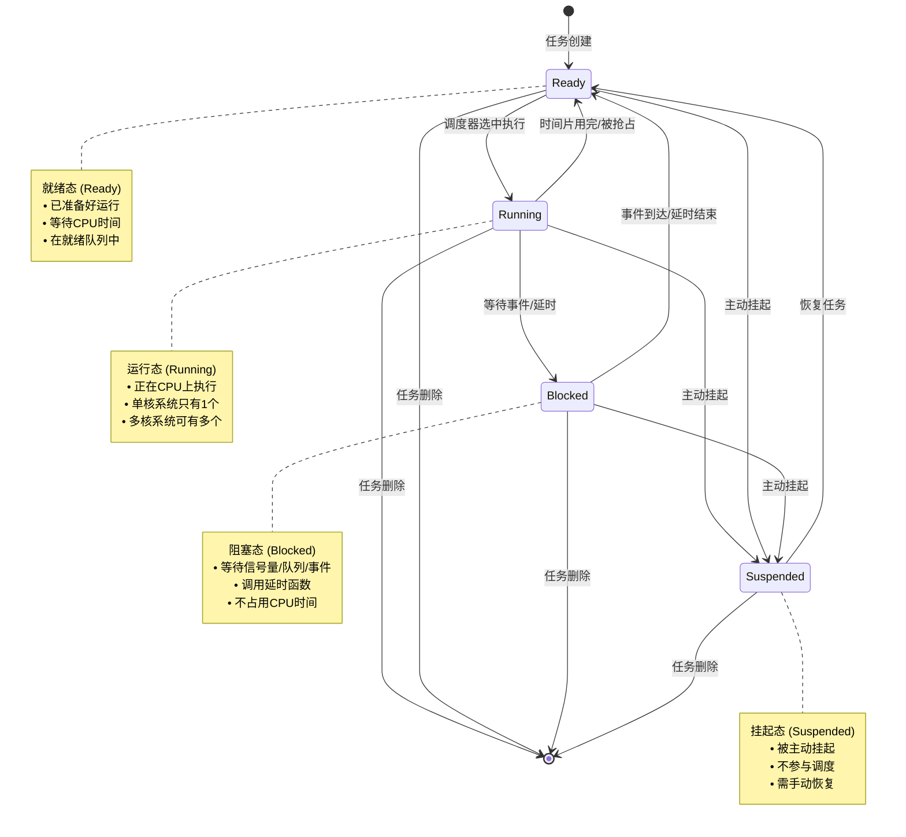

## 各状态详细说明

**1. 就绪态 (Ready)**

- 任务已经准备好运行，但CPU还在执行其他任务
- 任务在就绪队列中按优先级排队
- 等待调度器分配CPU时间

**2. 运行态 (Running)**

- 任务正在CPU上执行代码
- 单核系统同时只有一个任务处于运行态
- 拥有最高优先级的就绪任务会被选中运行

**3. 阻塞态 (Blocked)**

- 任务等待某个事件发生：
  - 等待信号量、互斥锁
  - 等待队列有数据
  - 调用延时函数（vTaskDelay）
- 阻塞期间不消耗CPU时间

**4. 挂起态 (Suspended)**

- 通过`vTaskSuspend()`主动挂起
- 完全不参与调度，除非调用`vTaskResume()`恢复
- 可以从任何状态挂起

## 典型状态转换场景

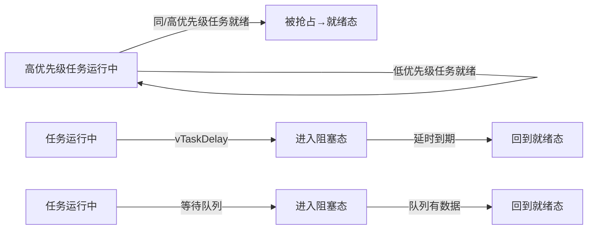

## 工作中的体现

在TWS耳机的SDK中，在app_task_loop任务中，进入到具体的一个蓝牙模式后，那么这个任务就进入到阻塞态了，因为他有一个获取消息队列消息的操作，当队列中没有消息时，他会持续在某一个地方等待而让出CPU，当有消息被从消息队列中拿到时，那么这个任务就从阻塞态进入到就绪态，又因为他是高优先级任务，所以立马往下执行进行消息分发并到具体的分支上处理达到实时效果。

```c
void app_main()
{
    task_create(app_task_loop, NULL, "app_core");

    os_start(); //no return
    while (1) {
        asm("idle");
    }
}
//一般任务里都是一个while 1
static void app_task_loop(void *p)
{
    struct app_mode *mode;

    mode = app_task_init();
    //sys_timer_add(NULL, test_printf, 2000);  //定时调试打印
#if CONFIG_FINDMY_INFO_ENABLE || (THIRD_PARTY_PROTOCOLS_SEL & REALME_EN)
#if (VFS_ENABLE == 1)
    if (mount(NULL, "mnt/sdfile", "sdfile", 0, NULL)) {
        log_debug("sdfile mount succ");
    } else {
        log_debug("sdfile mount failed!!!");
    }
#if (THIRD_PARTY_PROTOCOLS_SEL & REALME_EN)
    int update = 0;
    u32 realme_breakpoint = 0;
    if (CONFIG_UPDATE_ENABLE) {
        update = update_result_deal();
        extern int realme_check_upgrade_area(int update);
        realme_check_upgrade_area(update);
    }
#endif
#endif /* #if (VFS_ENABLE == 1) */

#else
    extern const int support_dual_bank_update_no_erase;
    if (support_dual_bank_update_no_erase) {
        if (0 == dual_bank_update_bp_info_get()) {
            norflash_set_write_protect_remove();
            dual_bank_check_flash_update_area(0);
            norflash_set_write_protect_en();
        }
    }
#endif

    //从这里开始就会进入到一个具体的模式，每一个模式下都是一个while 1 通过具体事件驱动来切换不同的模式
    while (1) {
        app_set_current_mode(mode);

        switch (mode->name) {
        case APP_MODE_IDLE:
            mode = app_enter_idle_mode(g_mode_switch_arg);
            break;
        case APP_MODE_POWERON:
            mode = app_enter_poweron_mode(g_mode_switch_arg);
            break;
        case APP_MODE_BT:
            mode = app_enter_bt_mode(g_mode_switch_arg);
            printf("----mode: %d\n", mode->name);
            break;
#if TCFG_APP_LINEIN_EN
        case APP_MODE_LINEIN:
            mode = app_enter_linein_mode(g_mode_switch_arg);
            break;
#endif
#if TCFG_APP_PC_EN
        case APP_MODE_PC:
            mode = app_enter_pc_mode(g_mode_switch_arg);
            break;
#endif
#if TCFG_APP_MUSIC_EN
        case APP_MODE_MUSIC:
            mode = app_enter_music_mode(g_mode_switch_arg);
            break;
#endif
        }
    }
}

//TWS一般是进入蓝牙模式
struct app_mode *app_enter_bt_mode(int arg)
{
    int msg[16];
    struct bt_event *event;
    struct app_mode *next_mode;

    bt_mode_init();

    while (1) {
        if (!app_get_message(msg, ARRAY_SIZE(msg), bt_mode_key_table)) {
            continue;
        }
        next_mode = app_mode_switch_handler(msg);
        if (next_mode) {
            break;
        }

        event = (struct bt_event *)(msg + 1);

        switch (msg[0]) {
#if TCFG_USER_TWS_ENABLE
        case MSG_FROM_TWS:
            bt_tws_connction_status_event_handler(msg + 1);
            break;
#endif
        case MSG_FROM_BT_STACK:
            bt_connction_status_event_handler(event);
#if TCFG_BT_DUAL_CONN_ENABLE
            bt_dual_phone_call_msg_handler(msg + 1);
#endif
            break;
        case MSG_FROM_BT_HCI:
            bt_hci_event_handler(event);
            break;
        case MSG_FROM_APP:
            bt_app_msg_handler(msg + 1);
            break;
        }

        app_default_msg_handler(msg);
    }

    bt_mode_exit();

    return next_mode;
}
```

### 图表分析

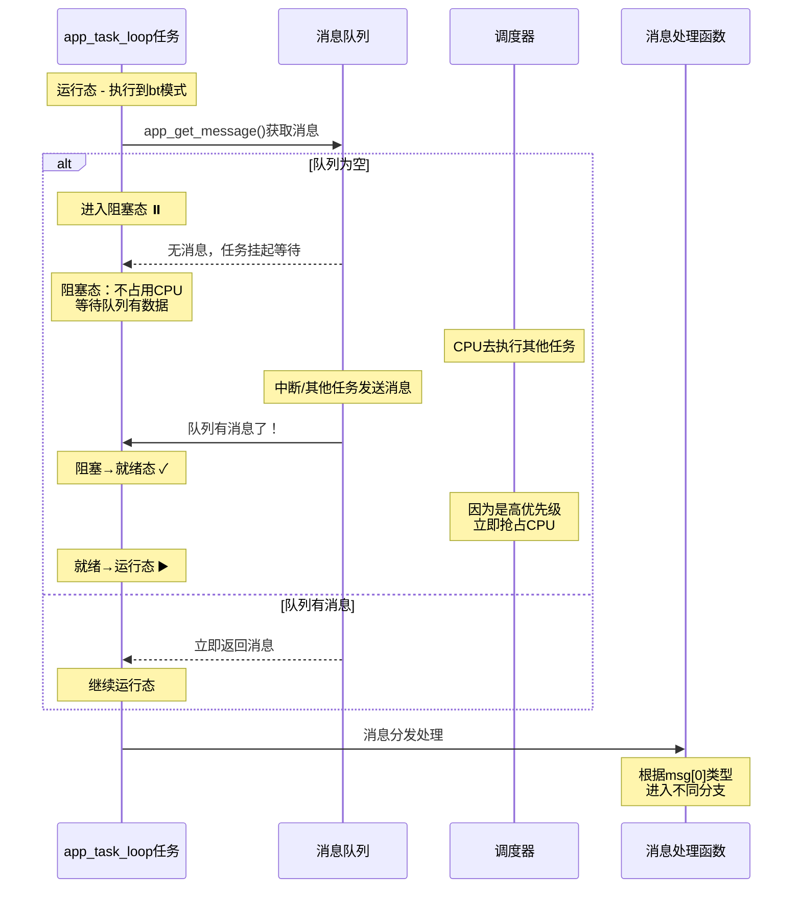

### 任务状态转换流程

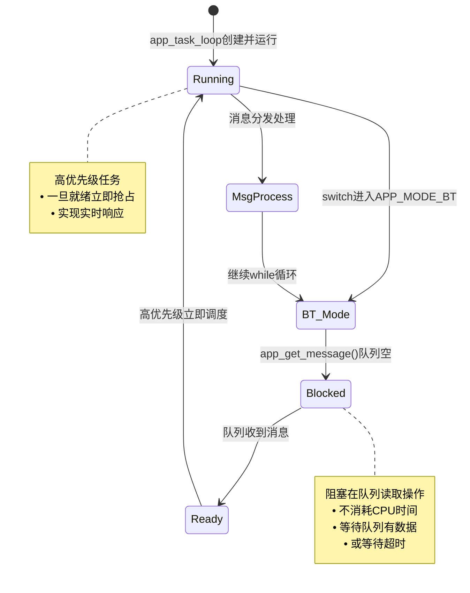

# FreeRTOS的调度方式有哪一些？

## 调度方式全景图

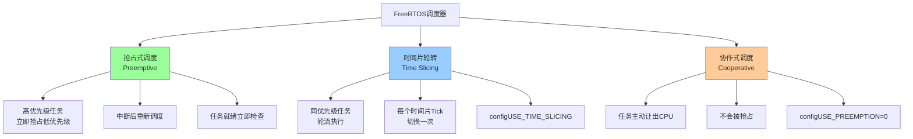

## 抢占式调度

这是FreeRTOS的**默认且最常用**的调度方式。

```mermaid
gantt
    title 抢占式调度示例
    dateFormat X
    axisFormat %L
    
    section CPU执行
    低优先级任务A(P2) :a1, 0, 30
    高优先级任务B(P5) :crit, a2, 30, 50
    低优先级任务A(P2) :a3, 50, 80
    
    section 事件
    任务B就绪 :milestone, 30, 30
    任务B完成 :milestone, 50, 50
```

- 高优先级任务就绪后会直接保存上下文并切换到运行态。

#### 抢占发生的时机

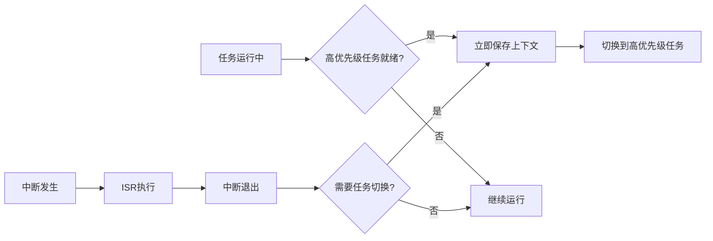

- 任务运行中，有高优先级任务就绪
- 中断执行完后，看是否有高优先级任务就绪。

## 时间片轮转

用于**同优先级**任务之间的调度。

```mermaid
gantt
    title 时间片轮转 - 同优先级任务(P3)
    dateFormat X
    axisFormat %L
    
    section CPU执行
    任务A :a1, 0, 10
    任务B :a2, 10, 20
    任务C :a3, 20, 30
    任务A :a4, 30, 40
    任务B :a5, 40, 50
    任务C :a6, 50, 60
    
    section Tick中断
    Tick :milestone, 10, 10
    Tick :milestone, 20, 20
    Tick :milestone, 30, 30
    Tick :milestone, 40, 40
    Tick :milestone, 50, 50
```

### 工作原理

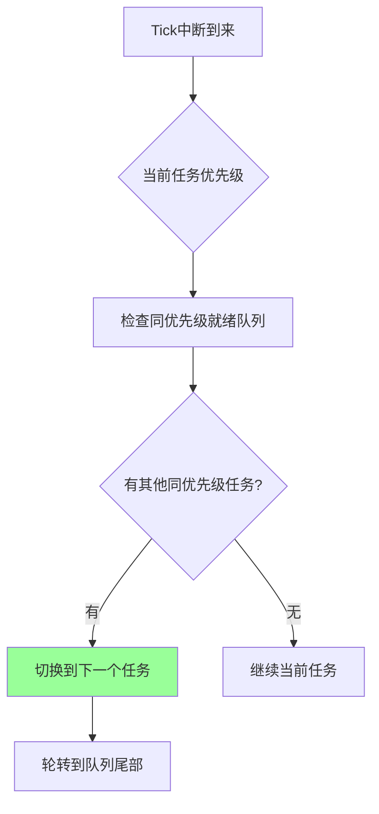

## 协作式调度

任务**主动让出CPU**，不会被抢占

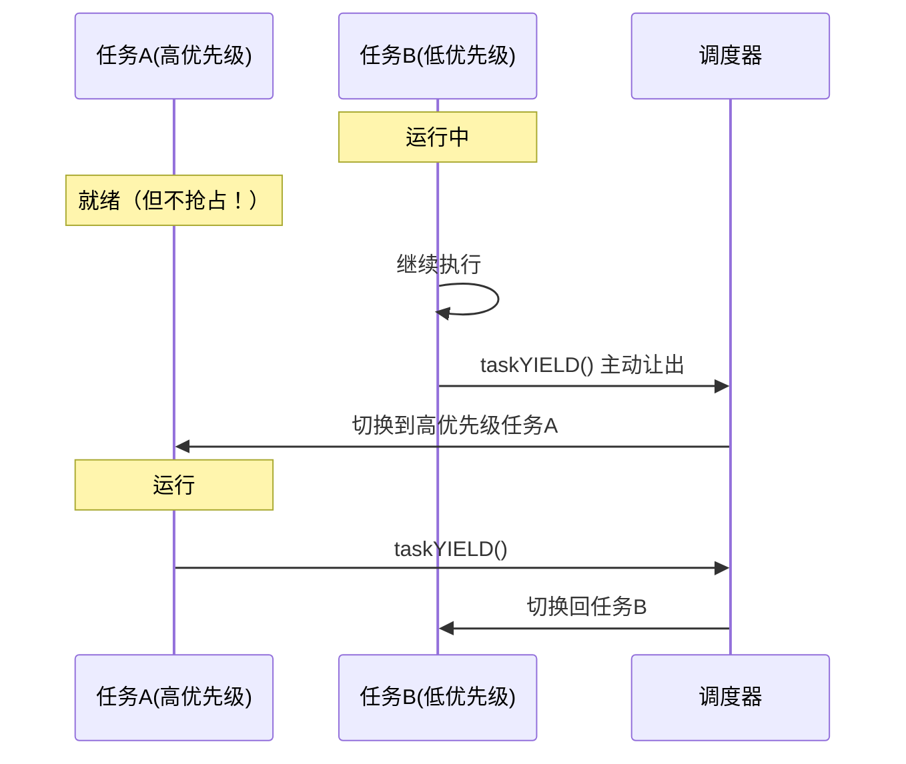

#### 使用场景（较少用）

- 系统简单，任务可控
- 需要避免抢占带来的复杂性
- 实时性要求不高

## 三种方式对比

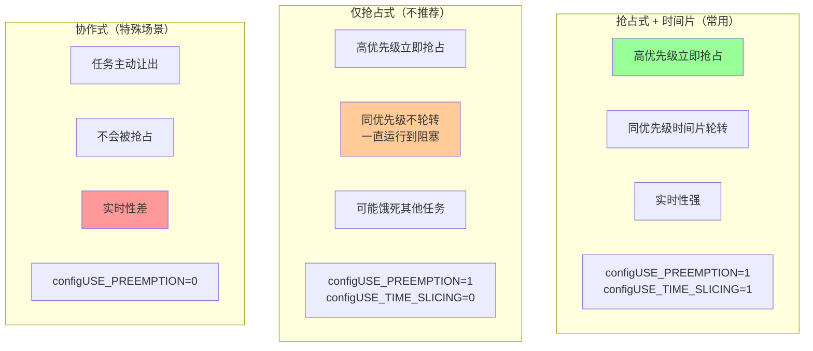

## 工作中体现

在TWS耳机的SDK中，在`app_main.c`中就会罗列各任务的优先级等各信息。

### TWS耳机任务优先级概览

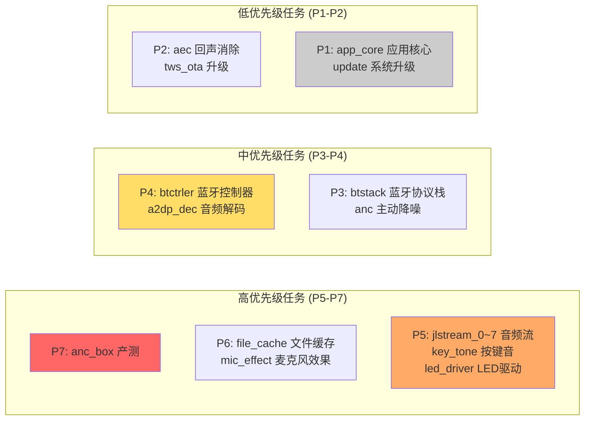

### 任务分类

| 优先级    | 任务类型      | 典型任务                                                  |
| --------- | ------------- | --------------------------------------------------------- |
| **P7**    | 最高优先级    | `anc_box`（产测，不能被打断）                             |
| **P5-P6** | 音频实时处理  | `jlstream_0~7`（8个音频流任务）、`key_tone`、`led_driver` |
| **P3-P4** | 蓝牙/音频核心 | `btctrler`、`btstack`、`a2dp_dec`                         |
| **P1-P2** | 应用/后台     | `app_core`、`update`、`aec`                               |

------

### 实际场景示例

#### 抢占式调度 - 听歌时按下按键

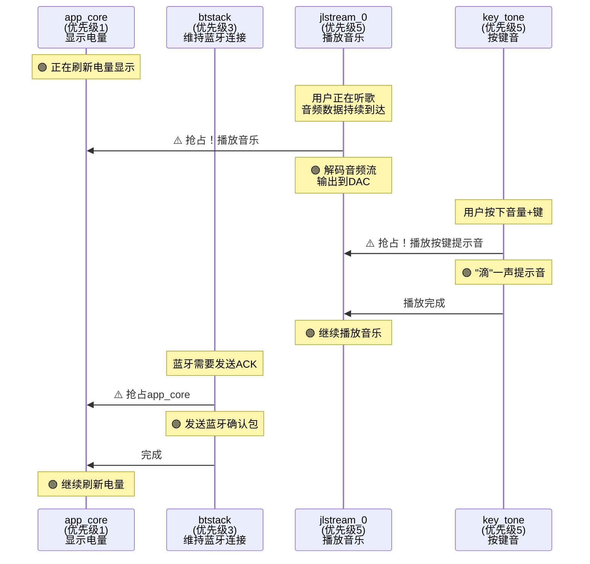

**实际发生的过程：**

1. **初始状态**：`app_core`(P1) 在显示电量图标
2. **音乐播放**：手机发来音频数据 → `jlstream_0`(P5) **抢占** `app_core`(P1) → 解码并播放音乐
3. **按键按下**：用户按音量+ → `key_tone`(P5) 与 `jlstream_0`(P5) 同优先级，插入播放提示音
4. **蓝牙维护**：需要回复ACK → `btstack`(P3) **抢占** `app_core`(P1) → 发送确认包
5. **回到低优先级**：高优先级任务都完成 → `app_core`(P1) 继续显示电量

#### 时间片轮转场景

其实这8个 `jlstream_0~7` 任务**不是同时都在工作的**，它们更像是一个**任务池**，用来处理不同的音频流任务。

你在用TWS耳机，同时发生了多件事

```mermaid
gantt
    title 多个音频源同时活跃时的时间片轮转
    dateFormat X
    axisFormat %L ms
    
    section CPU执行
    jlstream_0 播放音乐 :a1, 0, 1
    jlstream_1 播放导航语音 :a2, 1, 2
    jlstream_2 播放微信消息提示音 :a3, 2, 3
    jlstream_0 播放音乐 :a4, 3, 4
    jlstream_1 播放导航语音 :a5, 4, 5
    jlstream_2 播放微信消息提示音 :a6, 5, 6
    
    section Tick中断
    Tick :milestone, 1, 1
    Tick :milestone, 2, 2
    Tick :milestone, 3, 3
    Tick :milestone, 4, 4
```

**你正在做的事情：**

1. 🎵 **听网易云音乐** → `jlstream_0` 处理音乐流
2. 🗺️ **高德地图导航播报** → `jlstream_1` 处理导航语音
3. 💬 **微信来消息提示音** → `jlstream_2` 播放提示音

这三个音频流**同时存在**，都是优先级5，所以需要**时间片轮转**：

- `jlstream_0` 执行1ms：解码一小段音乐
- `jlstream_1` 执行1ms：播放"前方500米右转"
- `jlstream_2` 执行1ms：播放微信"咚咚"声
- 然后循环...